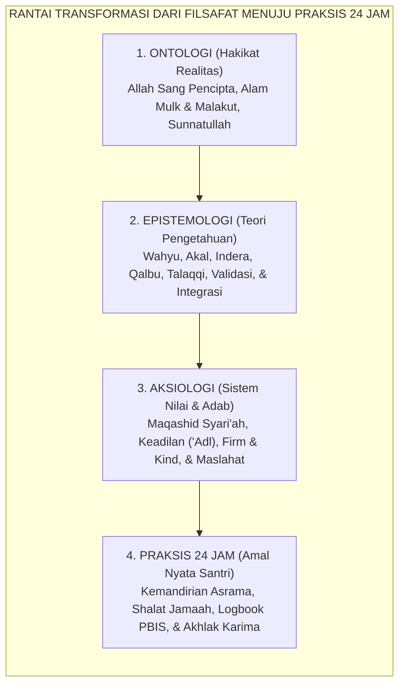
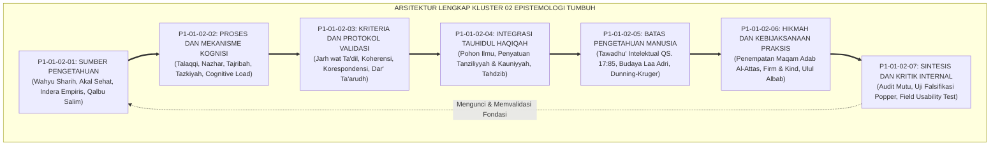
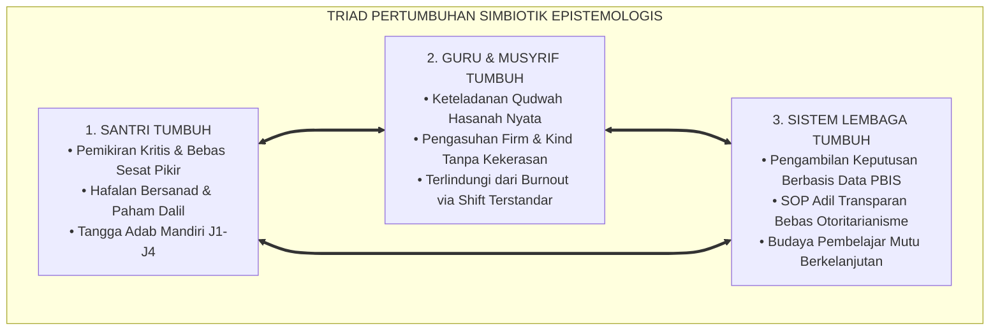
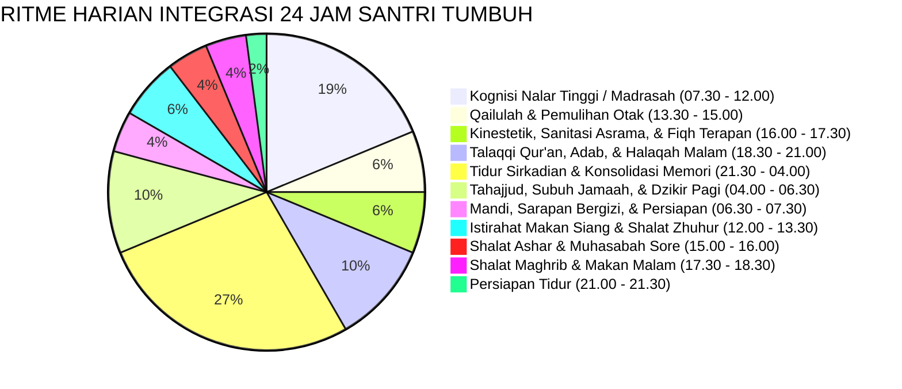

# P1-01-02: EPISTEMOLOGI EKOSISTEM TUMBUH
## *Monograf Induk Teori Pengetahuan: 4 Sumber Fitrah, Proses Kognisi, Protokol Validasi, Integrasi Tauhidul Haqiqah, Batas Nalar Insan, & Puncak Al-Hikmah Praksis*

**Nomor Identifikasi**: `P1-01-02/MONOGRAF-INDUK-EPISTEMOLOGI/2026`  
**Domain**: `01 Philosophy` > `01 Worldview` > `02 Epistemologi TUMBUH`  
**Klasifikasi Naskah**: *Cluster Master Monograph* (Monograf Induk Kluster Epistemologi)  
**Rumpun Disiplin Pengkaji**: Epistemologi Turats & Ushuluddin, Filsafat Pendidikan Islam (Ta'dib Al-Attas), Psikologi Belajar & Kognitif, Metodologi Riset PBIS, Arsitektur Manajemen Pesantren  

---

> ### 💡 INTISARI PRAKTIS (3 MENIT PAHAM UNTUK ASATIDZ & MUSYRIF)
>
> * **Apa Peran Epistemologi dalam Kehidupan Pesantren?**  
>   Jika Ontologi menjawab *"Apa yang nyata diciptakan Allah?"*, maka Epistemologi menjawab **"Bagaimana cara kita meraih ilmu yang benar, menyaring hoaks, dan mengamalkannya menjadi adab nyata di asrama 24 jam?"**
> * **Tujuh Bangunan Utama Epistemologi TUMBUH:**  
>   1. **4 Saluran Ilmu (01)**: Wahyu Sharih, Akal Sehat, Indera Empiris, dan Qalbu yang Suci.  
>   2. **4 Cara Belajar (02)**: Talaqqi Bersanad, Menalar Kritis (*Nazhar*), Praktik Nyata (*Tajribah*), dan Niat Ikhlas (*Tazkiyah*).  
>   3. **Filter Kebenaran (03)**: Uji hadits shahih, bebas sesat pikir logika, data faktual dhohir, dan harmoni sains-agama.  
>   4. **Pohon Ilmu yang Satu (04)**: Menyatukan ayat Al-Qur'an dan sains semesta di bawah Tauhid (*Tauhidul Haqiqah*).  
>   5. **Rendah Hati Ilmiah (05)**: Berani berkata "Saya belum tahu (*Wallahu A'lam*)", membuang kesombongan sok pintar.  
>   6. **Puncak Kebijaksanaan (06)**: Menjadi pribadi yang bijak (*Hakim*), menegakkan aturan dengan tegas dan penuh kasih (*Firm & Kind*).  
>   7. **Audit Bebas Kontradiksi (07)**: Menjamin sistem 100% selaras syariat, ilmiah, dan mudah dijalankan musyrif.

---

## 📑 DAFTAR ISI MONOGRAF INDUK

- [BAGIAN I: ARSITEKTUR FONDASI EPISTEMOLOGI ISLAM](#bagian-i-arsitektur-fondasi-epistemologi-islam)
  - [1. Epistemologi sebagai Jembatan Kognitif Antara Ontologi dan Aksiologi](#1-epistemologi-sebagai-jembatan-kognitif-antara-ontologi-dan-aksiologi)
  - [2. Pohon Epistemologi TUMBUH: Integrasi Tujuh Pilar Keilmuan](#2-pohon-epistemologi-tumbuh-integrasi-tujuh-pilar-keilmuan)
  - [3. Rantai Kausalitas Transformatif: Dari Teori Kognisi Menuju Adab Otomatis](#3-rantai-kausalitas-transformatif-dari-teori-kognisi-menuju-adab-otomatis)
- [BAGIAN II: KODIFIKASI BAKU TUJUH MONOGRAF KLUSTER 02](#bagian-ii-kodifikasi-baku-tujuh-monograf-kluster-02)
  - [1. Matriks Lengkap Tujuh Monograf Kluster Epistemologi TUMBUH](#1-matriks-lengkap-tujuh-monograf-kluster-epistemologi-tumbuh)
  - [2. Deklarasi Integrasi Triadik Epistemologi: Santri, Guru, & Sistem Lembaga](#2-deklarasi-integrasi-triadik-epistemologi-santri-guru--sistem-lembaga)
  - [3. Standarisasi Siklus Kognisi 24 Jam: Dari Kelas Madrasah Menuju Kamar Asrama](#3-standarisasi-siklus-kognisi-24-jam-dari-kelas-madrasah-menuju-kamar-asrama)
- [BAGIAN III: APARATUS AKADEMIS & APENDIKS](#bagian-iii-aparatus-akademis--apendiks)
  - [1. Tabel Sintesis Kluster Epistemologi TUMBUH](#1-tabel-sintesis-kluster-epistemologi-tumbuh)
  - [2. Daftar Pustaka Akademis & Rujukan Turats Primer](#2-daftar-pustaka-akademis--rujukan-turats-primer)
  - [3. Catatan Kaki Akademis (Footnotes)](#3-catatan-kaki-akademis-footnotes)
  - [4. Glosarium Terminologi Kunci Epistemologi TUMBUH](#4-glosarium-terminologi-kunci-epistemologi-tumbuh)

---

# BAGIAN I: ARSITEKTUR FONDASI EPISTEMOLOGI ISLAM

---

### 1. Epistemologi sebagai Jembatan Kognitif Antara Ontologi dan Aksiologi

Jika penyelidikan Ontologi pada Kluster 01 telah menetapkan bahwa realitas terdiri dari dua dimensi yang tak terpisahkan (*Alam Mulk dan Alam Malakut* ciptaan Allah SWT), maka Kluster 02 Epistemologi merumuskan **Bagaimana Manusia Memperoleh Akses Kognitif dan Spiritual Menuju Realitas Tersebut**.[^1]

Epistemologi adalah cetak biru navigasi berpikir (*Cognitive & Spiritual Blueprint*) yang menjamin:
* Santri tidak terjebak dalam ilusi rasionalisme kering yang angkuh tanpa bimbingan wahyu.
* Santri tidak terjerumus ke dalam lubang dogmatisme tekstualis sempit yang anti-sains.
* Santri tidak tertipu oleh mistisisme khurafat atau pseudosains komersial.
* Seluruh kebijakan pengasuhan pesantren berdiri di atas landasan bukti nyata (*Evidence-Based Practice*) yang adil dan beradab.

---

### 2. Pohon Epistemologi TUMBUH: Integrasi Tujuh Pilar Keilmuan

Tujuh monograf dalam Kluster Epistemologi tersusun dalam arsitektur hierarkis yang kokoh dan saling melengkapi:

---

### 3. Rantai Kausalitas Transformatif: Dari Teori Kognisi Menuju Adab Otomatis

Ekosistem TUMBUH merancang transmisi keilmuan yang tidak berhenti di kepala, melainkan mengalir menembus sanubari dan menggerakkan raga santri:

1. **Fase Penyerapan Otentik (*Auditory-Verbal Encoding*)**: Santri menerima teks matan dan dalil wahyu dari asatidz bersanad melalui metode *Talaqqi Musyafahah*.[^2]
2. **Fase Pengolahan Nalar (*Critical Working Memory Processing*)**: Santri membedah illat kausalitas dan premis logika melalui metode *Nazhar & Bahsul Masail*.[^3]
3. **Fase Uji Fakta & Eksperimen (*Empirical Sensorimotor Praxis*)**: Santri mempraktikkan teori fiqh dan sains di laboratorium dan lingkungan fisik asrama melalui metode *Tajribah*.[^4]
4. **Fase Penyucian Niat & Afeksi (*Affective Purification*)**: Santri merefleksikan keikhlasan batin dan membersihkan diri dari riya' melalui metode *Tazkiyah*.[^5]
5. **Fase Otomatisasi Karakter (*Habituation & Behavioral Automatism*)**: Pengulangan adab yang konsisten di asrama selama 24 jam membentuk kebiasaan spontan (*Refleks Muraqabah*) yang melekat permanen.[^6]

---

# BAGIAN II: KODIFIKASI BAKU TUJUH MONOGRAF KLUSTER 02

---

### 1. Matriks Lengkap Tujuh Monograf Kluster Epistemologi TUMBUH

| Kode Monograf | Judul Naskah Terpadu | Dokumen Tautan Langsung | Intisari Temuan & Kontribusi Baku |
| :---: | :--- | :---: | :--- |
| **P1-01-02-01** | Sumber-Sumber Pengetahuan dalam Islam | [**`Buka Monograf P1-01-02-01`**](./P1-01-02-01-Sumber-Pengetahuan.md) | Deklarasi 4 Saluran: Wahyu Mutawatir (Otoritas Tertinggi), Akal Sehat, Indera Empiris, dan Ilham Kalbu; Komparasi komprehensif atas Empirisme, Rasionalisme, Positivisme, dan Pragmatisme Barat.[^7] |
| **P1-01-02-02** | Proses dan Mekanisme Memperoleh Pengetahuan | [**`Buka Monograf P1-01-02-02`**](./P1-01-02-02-Proses-Memperoleh-Pengetahuan.md) | Metodologi 4 Jalur: Talaqqi-Tadabbur, Nazhar-Istimbath, Tajribah-Musyahadah, Tazkiyah-Bashirah; Integrasi Cognitive Load Theory Sweller, Spaced Retrieval Ebbinghaus, dan Format Halaqah 4 Tahap.[^8] |
| **P1-01-02-03** | Kriteria dan Protokol Validasi Pengetahuan | [**`Buka Monograf P1-01-02-03`**](./P1-01-02-03-Validasi-Pengetahuan.md) | 4 Filter Kebenaran: Kritik Sanad-Matan 'Ilmul Hadits, Koherensi Logika Mantiq, Korespondensi Fakta Empiris, Mizan Syar'i Batin; Algoritma Resolusi Benturan Sains-Teks (*Dar' Ta'arudh*) & Psikometri PBIS.[^9] |
| **P1-01-02-04** | Integrasi Pengetahuan: Tauhidul Haqiqah | [**`Buka Monograf P1-01-02-04`**](./P1-01-02-04-Integrasi-Pengetahuan.md) | Harmoni Ayat Tanziliyyah & Kauniyyah; Dekonstruksi Pseudo-Islamisasi label; Arsitektur Resmi Pohon Ilmu TUMBUH (Akar Tauhid $\to$ Batang Adab $\to$ Cabang Sains $\to$ Buah Insan Kamil); Filter *Tahdzib*.[^10] |
| **P1-01-02-05** | Batas-Batas Pengetahuan Manusia | [**`Buka Monograf P1-01-02-05`**](./P1-01-02-05-Batas-Pengetahuan-Manusia.md) | Keterbatasan Kognisi QS. 17:85; Demarkasi 3 Ranah (Al-Ma'lum, Al-Majhul, Al-Ghaib); Tradisi *Laa Adri* Imam Malik; Penanganan Bias Dunning-Kruger; Moderasi Toleransi Bermazhab (*Tasamuh Wasathiy*).[^11] |
| **P1-01-02-06** | Hikmah dan Kebijaksanaan dalam Praksis | [**`Buka Monograf P1-01-02-06`**](./P1-01-02-06-Hikmah-dan-Kebijaksanaan.md) | Puncak Epistemologi: QS. 2:269; 3 Dimensi Hikmah ('Ilm, 'Amal, Hal); Definisi Adab Prof. Al-Attas (Keadilan Maqam); Protokol *Firm & Kind* Pengasuhan; Firasat Mukmin; Profil Lulusan Ulul Albab.[^12] |
| **P1-01-02-07** | Sintesis Epistemologi dan Kritik Internal | [**`Buka Monograf P1-01-02-07`**](./P1-01-02-07-Sintesis-Epistemologi-dan-Kritik-Internal.md) | Audit Mutu Keilmuan Bebas Kontradiksi; Uji Falsifikasi Karl Popper; Eliminasi Tirani Kasysyaf Sultanul Ulama; Uji Stres Lapangan (*Field Usability Test*); Deklarasi Kelulusan Audit Epistemologi.[^13] |

---

### 2. Deklarasi Integrasi Triadik Epistemologi: Santri, Guru, & Sistem Lembaga

Epistemologi TUMBUH menegakkan pertumbuhan simbiotik pada tiga entitas utama ekosistem pesantren:

---

### 3. Standarisasi Siklus Kognisi 24 Jam: Dari Kelas Madrasah Menuju Kamar Asrama

Ekosistem TUMBUH menetapkan ritme harian terpadu yang menghubungkan ranah kognitif kelas dengan ranah afektif-motorik asrama:

---

# BAGIAN III: APARATUS AKADEMIS & APENDIKS

---

### 1. Tabel Sintesis Kluster Epistemologi TUMBUH

| Parameter Evaluasi | Capaian Baku Kluster 02 Epistemologi TUMBUH |
| :--- | :--- |
| **Fondasi Teologis** | Tauhidullah & Prinsip *Tauhidul Haqiqah* (Allah SWT adalah Sumber Segala Kebenaran Hakiki). |
| **Saluran Kognisi** | Empat Saluran Terpadu: Wahyu Mutawatir, Akal Sehat, Indera Empiris, dan Qalbu yang Suci. |
| **Metode Didaktik** | Halaqah Interaktif 4 Tahap: Talaqqi (15m), Nazhar (25m), Tajribah (15m), dan Tazkiyah (5m). |
| **Kriteria Validasi** | Filter Ganda: Kritik Sanad-Matan Hadits, Mantiq Burhani Bebas Fallacy, Korespondensi Data PBIS, & Dar' Ta'arudh. |
| **Sikap Akademis** | Tawadhu' Intelektual (*Epistemic Humility*), Budaya *Laa Adri*, dan Moderasi Beragama (*Wasathiyyah*). |
| **Pola Pengasuhan** | *Firm on Standards, Kind in Heart* (Tegas menegakkan aturan tanpa kompromi; Santun dan penuh empati tanpa kekerasan). |
| **Profil Lulusan** | Generasi Ulul Albab / Insan Kamil: Menyatukan Dzikir Batin, Fikir Sains, Kemandirian Hidup, dan Khidmah Ummah. |

---

### 2. Daftar Pustaka Akademis & Rujukan Turats Primer

1. **Al-Attas, Syed Muhammad Naquib.** (1980). *The Concept of Education in Islam: A Framework for an Islamic Philosophy of Education*. Kuala Lumpur: ABIM.
2. **Al-Attas, Syed Muhammad Naquib.** (1995). *Prolegomena to the Metaphysics of Islam*. Kuala Lumpur: ISTAC.
3. **Al-Ghazali, Abu Hamid Muhammad bin Muhammad.** (2004). *Ihya' 'Ulumiddin* (4 Jilid). Kairo: Dar al-Hadits.
4. **Al-Ghazali, Abu Hamid Muhammad bin Muhammad.** (1997). *Al-Mustashfa min 'Ilm al-Ushul*. Beirut: Dar al-Kutub al-'Ilmiyyah.
5. **Al-Izz bin Abdis Salam, Abu Muhammad Abdul Aziz.** (1999). *Qawa'id al-Ahkam fi Mashalih al-Anam*. Beirut: Dar al-Kutub al-'Ilmiyyah.
6. **Asy-Syafi'i, Muhammad bin Idris.** (1988). *Diwan al-Imam asy-Syafi'i*. Beirut: Dar al-Kitab al-'Arabi.
7. **Asy-Syathibi, Abu Ishaq Ibrahim bin Musa.** (2003). *Al-Muwafaqat fi Ushul asy-Syari'ah*. Kairo: Dar Ibn 'Affan.
8. **Ibn Taimiyyah, Taqiuddin Ahmad.** (1991). *Dar' Ta'arudh al-'Aql wan-Naql*. Riyadh: Jami'ah al-Imam Muhammad bin Su'ud.
9. **Ibnul Qayyim al-Jauziyyah, Syamsuddin Muhammad bin Abi Bakr.** (1996). *Madarij as-Salikin*. Beirut: Dar al-Kitab al-'Arabi.
10. **Popper, Karl R.** (2002). *The Logic of Scientific Discovery*. London & New York: Routledge.
11. **Sapolsky, Robert M.** (2017). *Behave: The Biology of Humans at Our Best and Worst*. New York: Penguin Press.
12. **Sugai, George, & Horner, Robert H.** (2006). *"A Promising Approach for Expanding and Sustaining School-Wide Positive Behavior Support"*. *School Psychology Review*, 35(2), 245–259.
13. **Sweller, John.** (1988). *"Cognitive Load During Problem Solving: Effects on Learning"*. *Cognitive Science*, 12(2), 257–285.

---

### 3. Catatan Kaki Akademis (*Footnotes*)

[^1]: Syed Muhammad Naquib Al-Attas, *Prolegomena to the Metaphysics of Islam* (Kuala Lumpur: ISTAC, 1995), hlm. 1–30.
[^2]: Shahih Muslim, *Muqaddimah*, Bab fi Bayan an-Isnad minad Din, Juz I, hlm. 15.
[^3]: Abu Hamid Al-Ghazali, *Mi'yar al-'Ilm fi Fann al-Mantiq* (Beirut: Dar al-Kutub al-'Ilmiyyah, 1993), hlm. 20–40.
[^4]: David A. Kolb, *Experiential Learning* (New Jersey: Prentice-Hall, 1984), hlm. 35–50.
[^5]: Abu Hamid Al-Ghazali, *Ihya' 'Ulumiddin*, Kitab Syarh 'Aja'ib al-Qalb, Juz III, hlm. 19–28.
[^6]: Robert M. Sapolsky, *Behave: The Biology of Humans at Our Best and Worst* (New York: Penguin Press, 2017), hlm. 145–160.
[^7]: Lihat Monograf [`P1-01-02-01-Sumber-Pengetahuan.md`](./P1-01-02-01-Sumber-Pengetahuan.md).
[^8]: Lihat Monograf [`P1-01-02-02-Proses-Memperoleh-Pengetahuan.md`](./P1-01-02-02-Proses-Memperoleh-Pengetahuan.md).
[^9]: Lihat Monograf [`P1-01-02-03-Validasi-Pengetahuan.md`](./P1-01-02-03-Validasi-Pengetahuan.md).
[^10]: Lihat Monograf [`P1-01-02-04-Integrasi-Pengetahuan.md`](./P1-01-02-04-Integrasi-Pengetahuan.md).
[^11]: Lihat Monograf [`P1-01-02-05-Batas-Pengetahuan-Manusia.md`](./P1-01-02-05-Batas-Pengetahuan-Manusia.md).
[^12]: Lihat Monograf [`P1-01-02-06-Hikmah-dan-Kebijaksanaan.md`](./P1-01-02-06-Hikmah-dan-Kebijaksanaan.md).
[^13]: Lihat Monograf [`P1-01-02-07-Sintesis-Epistemologi-dan-Kritik-Internal.md`](./P1-01-02-07-Sintesis-Epistemologi-dan-Kritik-Internal.md).

---

### 4. Glosarium Terminologi Kunci Epistemologi TUMBUH

| No | Istilah / Terminologi | Asal Bahasa / Tradisi | Penjelasan Konseptual & Kontekstual |
| :---: | :--- | :--- | :--- |
| 1 | **Epistemologi Integratif** | Filsafat Pendidikan Islam | Teori pengetahuan yang memadukan wahyu, akal, indera, dan kalbu di bawah naungan tauhid. |
| 2 | **Tauhidul Haqiqah** | Epistemologi Islam (*توحيد الحقيقة*) | Prinsip kesatuan kebenaran hakiki: kebenaran wahyu tanziliyyah selaras dengan kebenaran sains kauniyyah. |
| 3 | **Firm & Kind** | Disiplin Positif Restoratif | Sikap kepengasuhan: Tegas tanpa kompromi menegakkan aturan syariat; Penuh kasih sayang dan santun dalam interaksi. |
| 4 | **Ta'dib** | Konsep Syed Naquib Al-Attas (*تأديب*) | Proses pendidikan pembentukan adab, yaitu pengenalan dan pengakuan atas posisi hakiki segala sesuatu dalam tatanan wujud. |
| 5 | **Dar' Ta'arudh** | Metodologi Ibn Taimiyyah (*درء التعارض*) | Algoritma penyelesaian pertentangan semu antara dalil akal dan wahyu guna membuktikan ketiadaan kontradiksi hakiki. |
| 6 | **Ulul Albab** | Terminologi Qur'ani (*أولو الألباب*) | Cendekiawan mukmin sejati yang senantiasa berdzikir batin, berfikir sains mendalam, dan menebarkan kemaslahatan umat. |
| 7 | **Talaqqi Musyafahah** | Tradisi Transmisi Turats (*تلقي مشافهة*) | Metode belajar tatap muka langsung berhadapan dengan guru bersanad guna menjaga akurasi lafazh dan adab keteladanan. |
| 8 | **Tahdzib al-'Ulum** | Filsafat Islam (*تهذيب العلوم*) | Protokol penyaringan dan penyucian teori sains modern dari racun materialisme dan ateisme sekuler. |
| 9 | **Epistemic Humility** | Filsafat Epistemologi | Tawadhu' intelektual; kesadaran jujur atas keterbatasan akal budi manusia di hadapan kemahaluasan ilmu Allah SWT. |
| 10 | **Refleks Muraqabah** | Tasawuf & Perilaku PBIS | Kondisi otomatisasi perilaku di mana santri terbiasa beradab luhur secara spontan karena kesadaran batin diawasi Allah SWT. |
