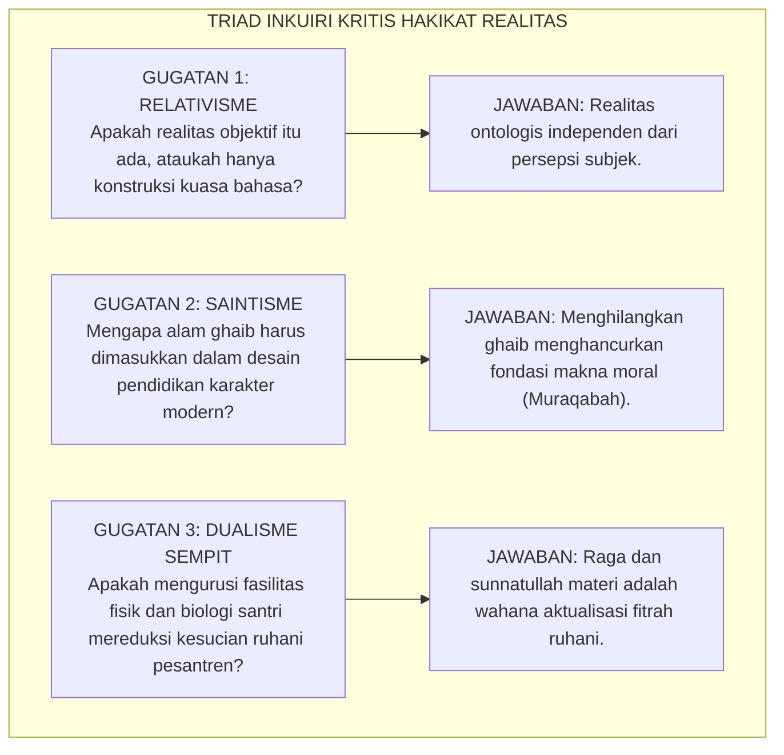
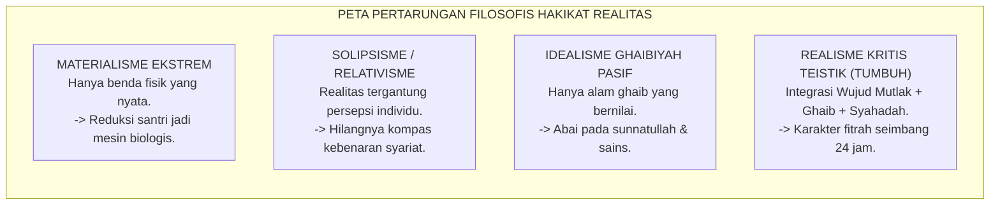
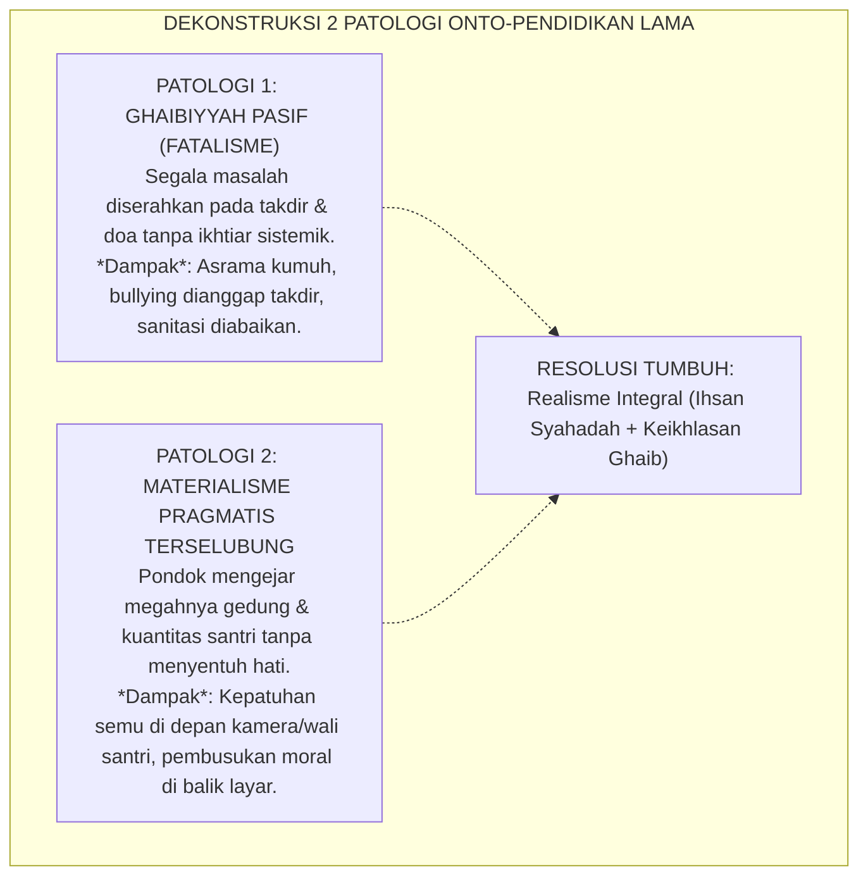

# P1-01-01-00: KAJIAN DIALEKTIKA INKUIRI, TANYA-JAWAB KRITIS, & ANALISIS SKENARIO REALITAS
## *Naskah Pendahulu (Inquiry Working Paper): Pergulatan Epistemik, Bedah "Mengapa & Bagaimana Jika", serta Dekonstruksi Asumsi Sebelum Perumusan Definisi Realitas (P1-01-01-01)*

**Nomor Identifikasi**: `P1-01-01-00/INKUIRI-DIALEKTIKA-REALITAS/2026`  
**Domain**: `01 Philosophy` > `01 Worldview` > `01 Hakikat Realitas`  
**Status Naskah**: *Foundational Dialectical Paper* (Berkas Inkuiri Pendahulu Sebelum Sintesis Formal)  
**Dewan Pakar Pengkaji**: `pakar-filosofi-tumbuh`, `pakar-epistemologi-turats`, `pakar-penulis-monograf-tumbuh`, `pakar-kritikus-dan-auditor-kualitas`

---

## 📑 DAFTAR ISI DIALEKTIKA

1. [1. Urgensi Metodologis: Mengapa Harus Ada Pergulatan Inkuiri Sebelum Konklusi?](#1-urgensi-metodologis-mengapa-harus-ada-pergulatan-inkuiri-sebelum-konklusi)
2. [2. Sesi Tanya-Jawab Kritis Mendasar (*Al-Iradat wal-Ajwibah*)](#2-sesi-tanya-jawab-kritis-mendasar-al-iradat-wal-ajwibah)
   - *Q1: Apakah Realitas Benar-Benar Objektif atau Sekadar Konstruksi Sosial Bahasa?*
   - *Q2: Mengapa Harus Mengakui Alam Ghaib Jika Pendidikan Karakter Bersifat Perilaku Nyata?*
   - *Q3: Mengapa Realitas Fisik-Biologis Santri Setara Pentingnya dengan Realitas Ruhiyah?*
3. [3. Bedah Eksplorasi Kausal: "Mengapa Ini, Mengapa Itu?" (*Root-Cause Analysis*)](#3-bedah-eksplorasi-kausal-mengapa-ini-mengapa-itu-root-cause-analysis)
   - *Mengapa Realisme Kritis Teistik Dipilih dan Mengapa Materialisme serta Solipsisme Gugur?*
   - *Mengapa Reduksionisme Saintisme Gagal Menjelaskan Nilai-Nilai Adab dan Martabat Manusia?*
   - *Mengapa Hukum Moral di Pesantren Harus Diperlakukan Seobjektif Hukum Gravitasi?*
4. [4. Pengujian Stres Kasus & Skenario Lapangan: "Bagaimana Jika Ini, Bagaimana Jika Itu?" (*Stress-Testing*)](#4-pengujian-stres-kasus--skenario-lapangan-bagaimana-jika-ini-bagaimana-jika-itu-stress-testing)
   - *Skenario A: Bagaimana jika santri tenggelam dalam dunia digital (Virtual Reality / Simulakra) dan menganggap dunia nyata tidak bermakna?*
   - *Skenario B: Bagaimana jika santri menuntut pembuktian empiris-laboratoris atas pengawasan Allah (Muraqabatullah)?*
   - *Skenario C: Bagaimana jika pesantren mengajarkan keluhuran ghaib namun mengabaikan realitas fisik sanitasi dan gizi asrama?*
   - *Skenario D: Bagaimana jika santri menganggap aturan moral pesantren hanya rekayasa musyrif untuk menindas kebebasan mereka?*
5. [5. Dekonstruksi Paradigma Lama & Kritik Patologi Pesantren Konvensional](#5-dekonstruksi-paradigma-lama--kritik-patologi-pesantren-konvensional)
   - *Patologi 1: Ghaibiyyah Pasif & Fatalisme Jabariyah*
   - *Patologi 2: Materialisme Pragmatis Terselubung*
6. [6. Sintesis Argumentatif & Mandat Menuju Berkas Formal (P1-01-01-01)](#6-sintesis-argumentatif--mandat-menuju-berkas-formal-p1-01-01-01)
7. [7. Glosarium dan Penjelasan Istilah Asing & Teknis](#7-glosarium-dan-penjelasan-istilah-asing--teknis)

---

### 1. Urgensi Metodologis: Mengapa Harus Ada Pergulatan Inkuiri Sebelum Konklusi?

Dalam tradisi pemikiran Islam klasik (*Kalam, Ushul Fiqh, dan Hikmah*) serta tradisi filsafat kritis kontemporer, sebuah dalil atau postulat tidak pernah diumumkan secara sepihak tanpa melalui **babak perdebatan kritis (*al-Munazharah wal-Jadal al-Ahsan*)**. 

Jika Ekosistem TUMBUH langsung menetapkan formula *"Realitas adalah segala yang berwujud objektif, memadukan alam ghaib dan syahadah"* (sebagaimana tertuang dalam [P1-01-01-01-Definisi-Realitas.md](file:///c:/xampp/htdocs/tumbuh/01%20Philosophy/01%20Worldview/P1-01-01-01-Definisi-Realitas.md)), maka perumusan tersebut akan kehilangan daya gedor intelektualnya. Dokumen tersebut akan tampak seperti dogma normatif belaka yang rapuh ketika diserang oleh gelombang skeptisisme modern, relativisme pascamodern, atau benturan realitas empiris di lingkungan pesantren.

Oleh karena itu, berkas **P1-01-01-00** ini berfungsi sebagai **kawah candradimuka epistemik**: menguji setiap asumsi, membongkar keraguan, menantang skenario terburuk, dan mempertanggungjawabkan secara logis mengapa kita memilih definisi realitas tersebut sebelum masuk ke modul preskriptif.

---

### 2. Sesi Tanya-Jawab Kritis Mendasar (*Al-Iradat wal-Ajwibah*)

#### Pertanyaan 1: Apakah realitas moral dan adab di pesantren bersifat objektif, ataukah sekadar konstruksi sosial budaya (*social construct*) yang diciptakan pengasuh untuk menertibkan santri?

* **Gugatan / Skeptisisme**:  
  Kaum relativis dan dekonstruksionis pascamodern menyatakan bahwa tidak ada kebenaran objektif yang universal. Nilai "sopan santun", "ketaatan", atau "adab" dianggap sekadar norma lokal buatan kultur feodal Jawa atau Timur Tengah. Jika demikian, apakah pesantren berhak memaksakan satu definisi realitas adab kepada santri generasi Z/Alpha?

* **Kajian Dialektis & Jawaban TUMBUH**:  
  TUMBUH membedakan secara tegas antara **Kebenaran Hakiki Objektif (*al-Haqq al-Maudhu'iy*)** dengan **Ekspresi Kultural Lokal (*al-'Urf al-Khashsh*)**.  
  1. *Objektivitas Universal*: Keadilan, kejujuran, kasih sayang (*rahmah*), penghormatan martabat manusia, dan kesucian fitrah adalah **hukum realitas objektif yang diciptakan Allah SWT**. Menyakiti anak lemah (perundungan) secara intrinsik adalah keburukan nyata di seluruh semesta, bukan karena "budaya melarangnya", melainkan karena ia bertentangan dengan hukum ontologis penciptaan manusia.  
  2. *Ekspresi Kultural*: Cara duduk, pilihan busana daerah, atau ragam dialek bahasa adalah instrumen fleksibel (*al-Wasa'il*), namun nilai adab di dalamnya (*al-Ghayat*) berpijak pada realitas objektif wahyu dan fithrah.  
  *Konsekuensi*: Pesantren tidak boleh menegakkan aturan atas dasar "kehendak pribadi kiai", melainkan atas dasar penyingkapan hukum realitas keadilan Allah SWT.

---

#### Pertanyaan 2: Mengapa pendidikan karakter modern harus menyertakan Alam Ghaib (*'Alam al-Ghayb*)? Bukankah pendekatan behavioristik empiris (reward-punishment) sudah cukup untuk mendisiplinkan santri?

* **Gugatan / Skeptisisme**:  
  Pendekatan psikologi sekuler berpendapat bahwa perilaku anak dapat dibentuk sepenuhnya melalui manipulasi lingkungan fisik (*conditioning*). Jika santri diberi hadiah saat rapi dan dihukum saat melanggar, mereka akan patuh. Mengapa kita perlu melibatkan konsep ghaib seperti pahala, malaikat, hari akhir, dan hisab?

* **Kajian Dialektis & Jawaban TUMBUH**:  
  Behaviorisme mekanistik terbukti **gagal total** mencetak karakter sejati karena hanya menghasilkan **Kepatuhan Semu (*Pseudo-Compliance*)**:  
  1. *Cacat Pengawasan Terbatas*: Jika disiplin hanya bersandar pada kehadiran fisik musyrif (alam syahadah), maka saat musyrif tidur atau CCTV mati, santri akan melanggar.  
  2. *Aktivasi Muraqabatullah*: Kesadaran akan Realitas Ghaib (bahwa Allah Maha Melihat, Malaikat mencatat setiap getaran batin) menanamkan **pengawas internal permanen (*Internal Moral Compass*)** dalam jiwa santri.  
  3. *Makna Eksistensial*: Mengabaikan alam ghaib mencabut akar makna amal santri; kebaikan direduksi menjadi sekadar transaksi pragmatis demi pujian manusia (*riya'*), bukan penyucian jiwa (*tazkiyah*).

---

#### Pertanyaan 3: Jika Realitas Tertinggi adalah Allah dan Akhirat (Alam Ghaib), mengapa sistem TUMBUH sangat cerewet mengurusi sanitasi kamar mandi, nutrisi otak, pencahayaan asrama, dan neurosains (Alam Syahadah)?

* **Gugatan / Skeptisisme**:  
  Sebagian kalangan tradisionalis beranggapan bahwa pesantren hanya perlu fokus pada ngaji kitab, wirid, dan tirakat batin. Urusan higienitas, gizi seimbang, dan manajemen fasilitas dianggap urusan duniawi rendahan yang tidak menentukan keshalihan santri.

* **Kajian Dialektis & Jawaban TUMBUH**:  
  Ini adalah bentuk kerancuan ontologis ekstrem (*Ontological Asymmetry*):  
  1. *Hukum Kausalitas Sunnatullah*: Allah yang menurunkan Al-Qur'an adalah Allah yang sama yang menetapkan hukum neurobiologi otak. Otak santri yang kekurangan nutrisi omega-3, kekurangan tidur, atau menghirup bau pesing kamar mandi yang menyengat akan mengalami stres limbik (*amigdala hiperaktif*), sehingga prefrontal cortex-nya lumpuh untuk diajak memahami kitab gundul dan meresapi adab.  
  2. *Raga sebagai Kendaraan Ruh*: Memuliakan alam syahadah (merawat fisik dan lingkungan santri) adalah bentuk ketundukan tertinggi kepada Allah pencipta sunnatullah. Mengabaikan aspek fisik atas nama zuhud adalah kebodohan metodologis yang merusak instrumen fitrah santri.

---

### 3. Bedah Eksplorasi Kausal: "Mengapa Ini, Mengapa Itu?" (*Root-Cause Analysis*)

#### A. Mengapa Realisme Kritis Teistik Dipilih sebagai Jangkar Worldview TUMBUH?
* **Akar Masalah**: Jika kita memilih *Materialisme*, maka pendidikan santri kehilangan dimensi spiritual dan etika ukhrawi. Jika kita memilih *Idealisme Subjektif/Solipsisme*, maka standar adab menjadi relatif dan kacau. Jika kita memilih *Spiritualisme Pasif*, pesantren menjadi terbelakang dan kumuh.
* **Justifikasi Pilihan**: *Realisme Kritis Teistik* Islam mengakui bahwa:
  1. Ada Pencipta Tunggal yang Wajib Wujud-Nya (Allah SWT).
  2. Ada ciptaan fisik yang nyata dan dapat diselidiki secara ilmiah melalui akal dan indera (hukum gravitasi, neurobiologi, dinamika psikososial).
  3. Ada realitas metafisik yang diwahyukan secara qath'i (pahala, dosa, takdir, barzakh).
  4. Pengetahuan manusia tentang alam fisik bersifat aproksimatif dan terus berkembang (*kritis*), namun selalu bertumpu pada kebenaran hakiki wahyu (*teistik*).

#### B. Mengapa Hukum Moral di Pesantren Harus Diperlakukan Seobjektif Hukum Gravitasi?
* **Analisis Kausal**: Ketika santri menjatuhkan piring kaca dari lantai dua asrama, piring itu pecah karena hukum gravitasi alam syahadah bekerja secara objektif tanpa memandang apakah anak tersebut berniat baik atau buruk.
* **Kesejajaran Moral**: Hukum moral bekerja dengan kepastian yang sama persis: ketika seorang santri berbohong, mendengki, atau menindas adik kelas, **secara objektif struktur spiritual kalbunya tergores (*nuktah sauda'*) dan secara neurobiologis jalur sinaptik agresi otaknya menguat**. Dosa bukan sekadar catatan abstrak di buku malaikat, melainkan racun ontologis nyata yang merusak keseimbangan eksistensial santri.

---

### 4. Pengujian Stres Kasus & Skenario Lapangan: "Bagaimana Jika Ini, Bagaimana Jika Itu?" (*Stress-Testing*)

| Kode | Skenario Lapangan "Bagaimana Jika..." | Jebakan Respons Konvensional / Primitif | Analisis Akar Masalah Filosofis | Solusi & Resolusi Ekosistem TUMBUH |
| :---: | :--- | :--- | :--- | :--- |
| **SC-01** | **Bagaimana jika santri hidup di era digital di mana realitas virtual/game terasa jauh lebih 'hidup' daripada realitas asrama?** | Merampas gadget dengan kemarahan, memberi takzir jemur, dan menuduh santri "terkena sihir setan". | Terjadinya disonansi realitas: asrama terasa membosankan, kering interaksi, dan menindas dibanding dunia virtual yang responsif dan memberi dopamine instan. | Mentransformasi asrama menjadi lingkungan kaya stimulasi (*Bi'ah Shalihah*), menghadirkan keteladanan musyrif yang hangat, dan mengajarkan santri literasi ontologis: membedakan antara fiksi layar dengan hakikat wujud manusia. |
| **SC-02** | **Bagaimana jika santri cerdas mempertanyakan bukti empiris alam ghaib dan pengawasan Allah secara kritis?** | Membentak santri: *"Jangan banyak tanya, kafir kamu kalau ragu sama Allah!"* | Ketakutan pendidik karena tidak memiliki landasan epistemologi integratif antara akal, bukti kauniyyah, dan wahyu. | Menghargai pertanyaan kritis santri sebagai pintu gerbang *Hidayah al-Aql*. Mengajak santri meneliti keteraturan biologis sel tubuh dan hukum semesta sebagai bukti ontologis keniscayaan Sang Perancang Maha Cerdas (*Burhan an-Nizham*). |
| **SC-03** | **Bagaimana jika pesantren mengklaim keberkahan ghaib melimpah, namun asramanya kumuh, MCK rusak, dan makanannya tidak bergizi?** | Menjustifikasi: *"Di pondok itu tirakat, santri harus tahan kotor supaya lekas alim."* | Distorsi pemahaman realitas: membenarkan kemalasan dan ketidakbecusan tata kelola manajemen syahadah dengan tameng kezuhudan palsu. | Menegakkan audit tata ruang dan standar kelayakan biologis. Pesantren TUMBUH memandang kebersihan dan gizi sebagai prasyarat tegaknya ibadah dan optimalisasi akal budi santri. |
| **SC-04** | **Bagaimana jika santri menuduh bahwa aturan disiplin pondok hanyalah buatan musyrif untuk menindas hak kebebasan mereka?** | Menghukum santri atas tuduhan "su'ul adab" dan membangkang pada pengurus. | Kegagalan musyrif mengomunikasikan objektivitas hukum adab: aturan disampaikan sebagai perintah kekuasaan feodal ego ustadz, bukan kebutuhan fitrah santri. | Melakukan dialog restoratif. Membuktikan kepada santri bahwa aturan tata tertib asrama dirumuskan demi menjaga keselamatan bersama (*Hifzh an-Nafs*) dan ketenangan belajar, bukan kepentingan pribadi musyrif. |

---

### 5. Dekonstruksi Paradigma Lama & Kritik Patologi Pesantren Konvensional

#### 1. Patologi *Ghaibiyyah Pasif* (Fatalisme Jabariyah Pengasuhan)
Kerap ditemukan di lingkungan pengasuhan lama fenomena di mana kelalaian manajemen asrama dibungkus dengan bahasa religius. Ketika ada santri sakit akibat air kotor, dikatakan *"ini ujian kesabaran santri"*. Ketika terjadi perundungan antarsantri, dikatakan *"ini proses pembentukan mental secara alami"*. 
* **Kritik Keras TUMBUH**: Ini adalah bentuk kejahatan epistemologis dan pelanggaran amanah. Mengabaikan hukum sebab-akibat di alam syahadah adalah tindakan mencemooh Sunnatullah.

#### 2. Patologi *Materialisme Pragmatis Terselubung*
Sebaliknya, ada pesantren yang tergelincir ke arah komersialisasi dan pencitraan fisik. Gedung megah dibangun, fasilitas mewah disediakan, namun interaksi musyrif-santri bersifat mekanis dan dingin seperti hubungan satpam hotel dengan tamu.
* **Kritik Keras TUMBUH**: Tanpa fondasi kesadaran ghaib (keikhlasan, muraqabah, ukhuwah fillah), fasilitas modern hanya akan melahirkan generasi yang konsumtif, manja, dan rapuh jiwanya saat menghadapi ujian hidup nyata.

---

### 6. Sintesis Argumentatif & Mandat Menuju Berkas Formal (P1-01-01-01)

Dari seluruh pertarungan dialektis, analisis kausal, pengujian skenario ekstrem, dan dekonstruksi kritis di atas, ditarik **Tiga Mandat Ontologis Fondasional** yang menjadi justifikasi mutlak bagi perumusan [P1-01-01-01-Definisi-Realitas.md](file:///c:/xampp/htdocs/tumbuh/01%20Philosophy/01%20Worldview/P1-01-01-01-Definisi-Realitas.md):

1. **Mandat Eksistensial Objektif**: Realitas adab, karakter, dan hukum syariat adalah entitas objektif yang berakar pada ketetapan Allah SWT, bukan konsensus sosial semata.
2. **Mandat Non-Dikotomis Integral**: Pendidikan pesantren wajib menyatukan secara utuh antara dimensi Alam Ghaib (kesadaran Muraqabatullah dan hisab ukhrawi) dengan dimensi Alam Syahadah (kesehatan neurobiologis, kebersihan fisik asrama, dan keadilan interaksi sosial).
3. **Mandat Restoratif Berbasis Fitrah**: Kesalahan santri harus dihadapi bukan dengan kepanikan dendam feodal, melainkan dengan diagnosis objektif atas fungsi perilaku, restorasi hubungan (*Ishlah al-Bain*), dan aktivasi kembali kesucian fitrah Ilahiah yang tersimpan di lubuk kalbunya.

---

*Dengan selesainya berkas kajian inkuiri pendahulu ini, maka rumusan formal pada modul [P1-01-01-01-Definisi-Realitas.md](file:///c:/xampp/htdocs/tumbuh/01%20Philosophy/01%20Worldview/P1-01-01-01-Definisi-Realitas.md) kini memiliki landasan argumentatif dialektis yang kokoh, tak terbantahkan, dan teruji terhadap segala kritik lapangan.*

---

### 7. Glosarium dan Penjelasan Istilah Asing & Teknis

Berikut adalah kamus penjelasan istilah-istilah asing, Arab (*turats*), filsafat, psikologi, dan sosiologi yang digunakan dalam naskah inkuiri dialektis ini:

| No | Istilah / Terminologi | Asal Bahasa | Penjelasan Konseptual & Kontekstual |
| :---: | :--- | :---: | :--- |
| 1 | **Al-Iradat wal-Ajwibah** | Arab (*الإيرادات والأجوبة*) | Tradisi dialektika ilmiah Islam klasik berupa teknik memunculkan sanggahan/keberatan kritis lalu menjawabnya secara sistematis dan argumentatif. |
| 2 | **Al-Munazharah wal-Jadal** | Arab (*المناظرة والجدل*) | Seni debat dan adu argumentasi logis-akademis untuk menguji kebenaran suatu dalil atau postulat hingga mencapai kepastian (*tahqiq*). |
| 3 | **Realisme Kritis Teistik** | Filsafat Barat / Teologi | Paradigma ontologis yang mengakui keberadaan realitas objektif ciptaan Tuhan yang independen dari pikiran manusia, di mana pemahaman manusia terus diuji secara kritis. |
| 4 | **Relativisme Pascamodern** | Filsafat Kontemporer | Paham yang menolak adanya kebenaran mutlak/objektif dan menganggap semua nilai hanyalah konstruksi budaya, bahasa, atau kepentingan kuasa lokal. |
| 5 | **Social Construct** | Inggris (Sosiologi) | Konsep atau makna yang diciptakan dan disepakati oleh masyarakat melalui interaksi sosial, bukan bawaan alami dari alam semesta. |
| 6 | **Al-Haqq al-Maudhu'iy** | Arab (*الحق الموضوعي*) | Kebenaran objektif yang bersumber dari ketetapan Allah SWT yang tidak berubah oleh ruang, waktu, dan opini manusia. |
| 7 | **Al-'Urf al-Khashsh** | Arab (*العرف الخاص*) | Adat kebiasaan atau tradisi lokal kelompok/komunitas tertentu yang bersifat kondisional dan fleksibel. |
| 8 | **Pseudo-Compliance (Kepatuhan Semu)** | Inggris (Psikologi) | Perilaku taat yang hanya ditampilkan anak saat ada pengawasan/ancaman fisik, namun segera dilanggar begitu pengawas tidak ada. |
| 9 | **Conditioning Behavioristik** | Inggris (Psikologi) | Metode pembiasaan perilaku melalui manipulasi stimulus eksternal (hadiah dan hukuman) tanpa melibatkan kesadaran kalbu dan nalar moral. |
| 10 | **Internal Moral Compass** | Inggris (Psikologi) | Kompas moral internal; kesadaran batin yang menuntun seseorang memilih kebaikan secara sukarela karena dorongan iman dan regulasi diri (*self-regulation*). |
| 11 | **Tazkiyatun Nafs** | Arab (*تزكية النفس*) | Proses penyucian jiwa dari kotoran batin (riya', dengki, takabur) untuk mengembalikan fitrah suci manusia. |
| 12 | **Ontological Asymmetry** | Inggris (Filsafat) | Ketimpangan pemahaman wujud; kesalahan berpikir yang hanya mementingkan satu sisi realitas (misal: hanya ruh) sambil menafikan sisi lainnya (misal: raga/sains). |
| 13 | **Amigdala & Prefrontal Cortex (PFC)** | Kedokteran / Neurosains | **Amigdala**: Pusat emosi dan deteksi ancaman (*fight-or-flight*). **PFC**: Bagian depan otak yang bertanggung jawab atas nalar, kontrol diri, empati, dan perencanaan masa depan. |
| 14 | **Simulakra / Virtual Reality** | Latin / Prancis (Baudrillard) | Representasi atau citra digital tiruan yang tampak begitu nyata hingga mengaburkan dan menggantikan realitas asli dalam persepsi manusia. |
| 15 | **Burhan an-Nizham** | Arab (*برهان النظام*) | Argumen teleologis dalam ilmu kalam yang membuktikan keberadaan Allah melalui keteraturan, presisi, dan keindahan hukum alam semesta. |
| 16 | **Hifzh an-Nafs** | Arab (*حفظ النفس*) | Prinsip pokok Maqashid Syari'ah tentang kewajiban mutlak menjaga keselamatan jiwa, raga, dan kesehatan fisik manusia. |
| 17 | **Ghaibiyyah Pasif / Fatalisme** | Teologi / Filsafat | Sikap pasrah buta pada takdir (*Jabariyah*) tanpa melakukan ikhtiar ilmiah dan manajerial yang diwajibkan oleh sunnatullah. |
| 18 | **Ishlah al-Bain** | Arab (*إصلاح البين*) | Proses perdamaian, pemulihan relasi sosial, dan penyelesaian konflik antarsesama berdasarkan prinsip keadilan restoratif. |
| 19 | **Nuktah Sauda'** | Arab (*نكتة سوداء*) | Titik noda hitam spiritual yang mengotori kalbu setiap kali seseorang melakukan kemaksiatan atau pelanggaran adab (merujuk hadits sahih). |
