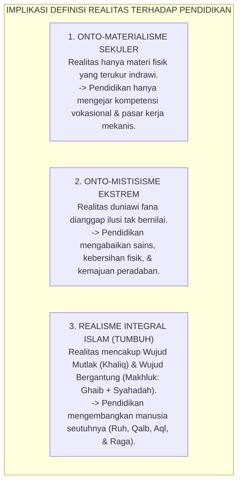
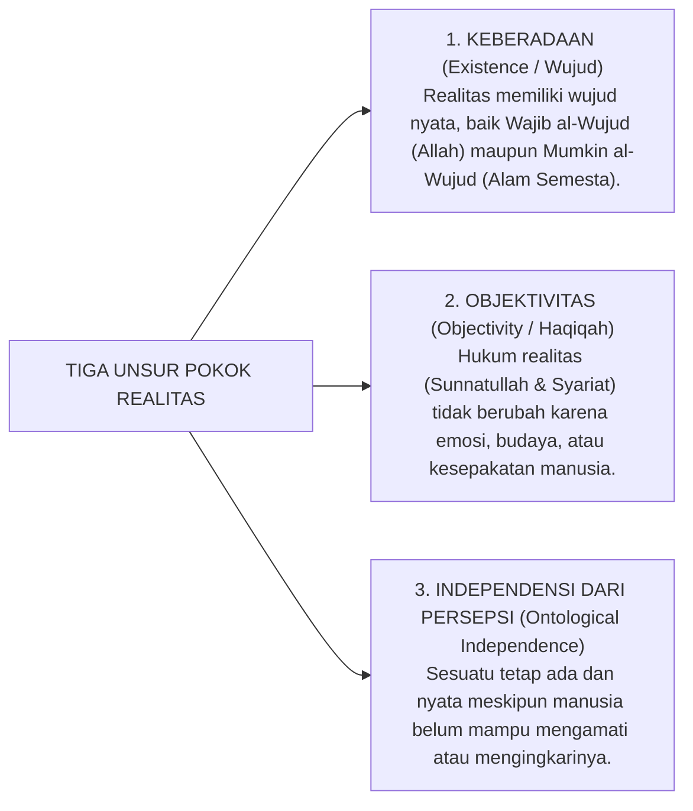

# P1-01-01-01: DEFINISI DAN HAKIKAT REALITAS
## *Fondasi Ontologis Realisme Kritis Teistik dalam Worldview Islam dan Desain Pendidikan Karakter TUMBUH*

**Nomor Identifikasi**: `P1-01-01-01/DEFINISI-REALITAS/2026`  
**Domain**: `01 Philosophy` > `01 Worldview` > `01 Hakikat Realitas`  
**Dewan Pakar**: `pakar-filosofi-tumbuh`, `pakar-epistemologi-turats`, `pakar-arsitektur-digital-pesantren`  
**Berkas Inkuiri Pendahulu**: [P1-01-01-01: Kajian Dialektika Inkuiri, Tanya-Jawab Kritis, & Skenario Realitas](file:///c:/xampp/htdocs/tumbuh/01%20Philosophy/01%20Worldview/P1-01-01-01-Kajian-Dialektika-Inkuiri-dan-Tanya-Jawab-Realitas.md)

---

## 📑 DAFTAR ISI ANALITIS

1. [1. Tujuan dan Urgensi Ontologis Perumusan Realitas](#1-tujuan-dan-urgensi-ontologis-perumusan-realitas)
2. [2. Mengapa Definisi Realitas Menentukan Arah Pendidikan Pesantren?](#2-mengapa-definisi-realitas-menentukan-arah-pendidikan-pesantren)
3. [3. Analisis Istilah dan Definisi Operasional Realitas](#3-analisis-istilah-dan-definisi-operasional-realitas)
4. [4. Tiga Unsur Pokok Realitas: Keberadaan, Objektivitas, dan Independensi](#4-tiga-unsur-pokok-realitas-keberadaan-objektivitas-dan-independensi)
5. [5. Dikotomi Realitas: Alam Ghaib (Mala'ul A'la) dan Alam Syahadah (Mulk)](#5-dikotomi-realitas-alam-ghaib-malaul-ala-dan-alam-syahadah-mulk)
6. [6. Implikasi Ontologis bagi Struktur Kurikulum Ekosistem TUMBUH](#6-implikasi-ontologis-bagi-struktur-kurikulum-ekosistem-tumbuh)
7. [7. Glosarium dan Penjelasan Istilah Asing & Teknis](#7-glosarium-dan-penjelasan-istilah-asing--teknis)

---

### 1. Tujuan dan Urgensi Ontologis Perumusan Realitas

> 💡 **Catatan Dialektika**: *Sebelum membaca definisi normatif dalam modul ini, disarankan meninjau [P1-01-01-01: Kajian Inkuiri Dialektis](file:///c:/xampp/htdocs/tumbuh/01%20Philosophy/01%20Worldview/P1-01-01-01-Kajian-Dialektika-Inkuiri-dan-Tanya-Jawab-Realitas.md) untuk memahami pergulatan tanya-jawab kritis, sanggahan teologis, dan pengujian skenario lapangan yang melandasi perumusan definisi ini.*

Tujuan utama modul ini adalah merumuskan definisi **Realitas (*al-Haqiqah / al-Wujud*)** sebagai fondasi ontologis paling mendasar bagi seluruh arsitektur Ekosistem TUMBUH. Definisi ini wajib akurat secara filosofis, berakar kuat pada worldview Islam, serta mampu menepis kerancuan ontologis modern—baik reduksionisme materialistik yang menafikan alam ghaib maupun mistisisme pasif yang mengabaikan sunnatullah empiris di alam syahadah.

---

### 2. Mengapa Definisi Realitas Menentukan Arah Pendidikan Pesantren?

Setiap sistem pendidikan niscaya dibangun di atas asumsi metafisik mengenai apa yang dianggap sebagai **Realitas Tertinggi (*Ultimate Reality*)**:

Jika pesantren memahami realitas secara terbelah, maka pengasuhan akan melahirkan santri yang timpang: hafal matan namun mengabaikan kebersihan fisik dan etika sosial, atau sebaliknya cakap teknologi namun hampa dari kesadaran muraqabatullah.

---

### 3. Analisis Istilah dan Definisi Operasional Realitas

Dalam khazanah epistemologi Islam dan filsafat kritis, **Realitas** didefinisikan sebagai:

> **"Segala sesuatu yang benar-benar ada (*al-Mawjud al-Haqiqiy*), baik yang berada dalam domain metafisik yang tak kasat mata (*'Alam al-Ghayb*) maupun domain fisik yang teramati (*'Alam asy-Syahadah*), di mana eksistensi dan hukum-hukumnya bersifat objektif serta tidak bergantung pada pengakuan, persepsi, atau opini subjektif manusia."**

Kaidah ini menegaskan bahwa kebenaran realitas tidak diciptakan oleh konsensus manusia, melainkan ditemukan (*discovered*) dan diakui (*acknowledged*) melalui instrumen epistemologi yang valid (Wahyu, Akal Sehat, dan Indera yang Sehat).

---

### 4. Tiga Unsur Pokok Realitas

1. **Keberadaan (*al-Wujud*)**: Sesuatu disebut realitas karena ia benar-benar ada dalam kenyataan hakiki. Allah SWT ada, malaikat ada, ruh manusia ada, hukum gravitasi ada, dan pahala/dosa ada.
2. **Objektivitas (*ath-Thab' al-Maudhu'iy*)**: Realitas memiliki sifat dan hukum baku (*Sunnatullah*). Api membakar secara objektif; perundungan merusak mental santri secara objektif; dan keikhlasan mendatangkan keberkahan secara objektif.
3. **Independensi dari Persepsi Manusia**: Kebenaran halal-haram tidak menjadi cair hanya karena manusia di suatu zaman menormalisasi kemaksiatan. Realitas syariat berdiri kokoh melampaui relativisme budaya.

---

### 5. Dikotomi Realitas: Alam Ghaib dan Alam Syahadah

Worldview Islam memetakan realitas ciptaan (*al-Kawn*) ke dalam dua domain yang saling berinteraksi secara harmonis:

| Domain Realitas | Terminologi Turats | Lingkup Entitas | Instrumen Mengetahuinya |
| :--- | :--- | :--- | :--- |
| **Alam Ghaib (*'Alam al-Ghayb*)** | *'Alam al-Malakut & al-Jabarut* | Allah SWT, Malaikat, Surga, Neraka, Barzakh, Jin, Hakikat Ruh. | **Wahyu Sharih (*Khabar Shadiq*)** dan bashirah kalbu yang suci. |
| **Alam Nyata (*'Alam asy-Syahadah*)** | *'Alam al-Mulk wa asy-Syahadah* | Tubuh biologis, gedung asrama, interaksi sosial santri, hukum fisika-biologi. | **Indera Sehat (*al-Hawas as-Salimah*)** dan observasi sains empiris. |

Pendidikan karakter TUMBUH menolak memisahkan kedua alam ini: santri diajarkan bahwa setiap gerak fisik di alam syahadah (seperti memungut sampah atau tersenyum pada kawan) memiliki konsekuensi spiritual langsung di alam ghaib (pencatatan malaikat dan keridhaan Allah SWT).

---

### 6. Implikasi Ontologis bagi Struktur Kurikulum TUMBUH

1. **Kurikulum Tauhid yang Membumi**: Tauhid bukan sekadar hafalan bait-bait sifat 20 yang abstrak, melainkan diwujudkan dalam kesadaran bahwa Allah mengawasi santri di setiap jengkal ruang asrama (*Muraqabatullah*).
2. **Penghormatan atas Sunnatullah Empiris**: Menjaga kebersihan kamar, kecukupan nutrisi, dan manajemen waktu diakui sebagai hukum realitas yang wajib ditaati untuk mencapai kesehatan jiwa raga.
3. **Keseimbangan Dimensi Ruhiyah dan Maddiyah**: Seluruh fasilitas fisik pesantren (arsitektur gedung, pencahayaan lorong, sanitasi) dirancang untuk mendukung optimalisasi ibadah dan penanaman adab 24 jam.

---

### 7. Glosarium dan Penjelasan Istilah Asing & Teknis

Untuk mempermudah pemahaman pembaca lintas disiplin ilmu, berikut adalah kamus penjelasan istilah-istilah asing, Arab (*turats*), filosofis, dan saintifik yang digunakan dalam dokumen ini:

| No | Istilah / Terminologi | Asal Bahasa | Penjelasan Konseptual & Kontekstual |
| :---: | :--- | :---: | :--- |
| 1 | **Ontologi / Ontologis** | Yunani (*on, ontos* = ada + *logos* = ilmu) | Cabang filsafat yang mengkaji hakikat eksistensi, kenyataan, dan struktur wujud paling mendasar. |
| 2 | **Worldview (*Ru'yatul Islam lil-Wujud*)** | Jerman / Arab (*Weltanschauung*) | Cara pandang atau kacamata komprehensif seseorang/agama dalam memahami hakikat Allah, alam semesta, manusia, dan tujuan hidup. |
| 3 | **Realisme Kritis Teistik** | Filsafat Barat / Teologi | Aliran filsafat yang meyakini bahwa realitas itu nyata, objektif, dan diciptakan oleh Tuhan (Teistik), di mana pemahaman manusia terhadap alam terus disempurnakan melalui observasi kritis (Kritis). |
| 4 | **Al-Haqiqah / Al-Wujud** | Arab (*حقيقة / وجود*) | Sesuatu yang memiliki ketetapan eksistensi nyata dan tidak terbantahkan kebenarannya. |
| 5 | **Al-Mawjud al-Haqiqiy** | Arab (*الموجود الحقيقي*) | Entitas yang benar-benar ada dalam kenyataan, bukan sekadar khayalan pikiran (*wahm*). |
| 6 | **'Alam al-Ghayb** | Arab (*عالم الغيب*) | Dimensi wujud metafisik yang tidak dapat dijangkau oleh panca-indera lahiriah manusia (misal: Allah, Malaikat, Surga, Neraka, Barzakh). |
| 7 | **'Alam asy-Syahadah / 'Alam al-Mulk** | Arab (*عالم الشهادة / الملك*) | Dimensi wujud fisik-material yang dapat diobservasi, diraba, diukur, dan diuji secara empiris melalui indera dan eksperimen sains. |
| 8 | **'Alam al-Malakut & al-Jabarut** | Arab (*عالم الملكوت والجبروت*) | Istilah turats tasawuf/kalam untuk merujuk pada alam ruh, malaikat, dan dimensi keagungan ketetapan takdir Allah. |
| 9 | **Wajib al-Wujud** | Arab (*واجب الوجود*) | Wujud yang niscaya ada dan menjadi sebab keberadaan segala sesuatu tanpa bergantung pada sebab lain (khusus disematkan kepada Allah SWT). |
| 10 | **Mumkin al-Wujud** | Arab (*ممكن الوجود*) | Wujud yang keberadaannya bergantung pada kehendak Wajib al-Wujud (seluruh alam semesta dan makhluk). |
| 11 | **Sunnatullah** | Arab (*سنة الله*) | Hukum-hukum sebab-akibat yang ditetapkan Allah secara teratur dan ajek pada alam semesta (hukum fisika, biologi, sosial). |
| 12 | **Khabar Shadiq** | Arab (*الخبر الصادق*) | Informasi atau berita mutlak benar yang bersumber dari wahyu Allah (Al-Qur'an) dan sabda Nabi Muhammad SAW yang mutawatir/sahih. |
| 13 | **Al-Hawas as-Salimah** | Arab (*الحواس السليمة*) | Panca-indera yang sehat dan berfungsi normal sebagai saluran epistemologis untuk menangkap fenomena alam nyata. |
| 14 | **Bashirah** | Arab (*بصيرة*) | Mata batin atau kejernihan kalbu yang mampu menangkap kebenaran hikmah spiritual melampaui penglihatan fisik. |
| 15 | **Muraqabatullah** | Arab (*مراقبة الله*) | Kondisi kejiwaan di mana seorang hamba senantiasa merasa diawasi, dilihat, dan diketahui batinnya oleh Allah SWT di setiap saat. |
| 16 | **Ruhiyah & Maddiyah** | Arab (*روحية ومادية*) | Dimensi spiritual (kejiwaan/ruh) dan dimensi material (fisik/jasmani) yang harus berjalan secara berimbang dan harmonis. |
| 17 | **Ontological Independence** | Inggris (Filsafat) | Kemandirian ontologis; prinsip bahwa status kebenaran suatu entitas tidak dipengaruhi oleh ada atau tidaknya orang yang mempercayainya. |
