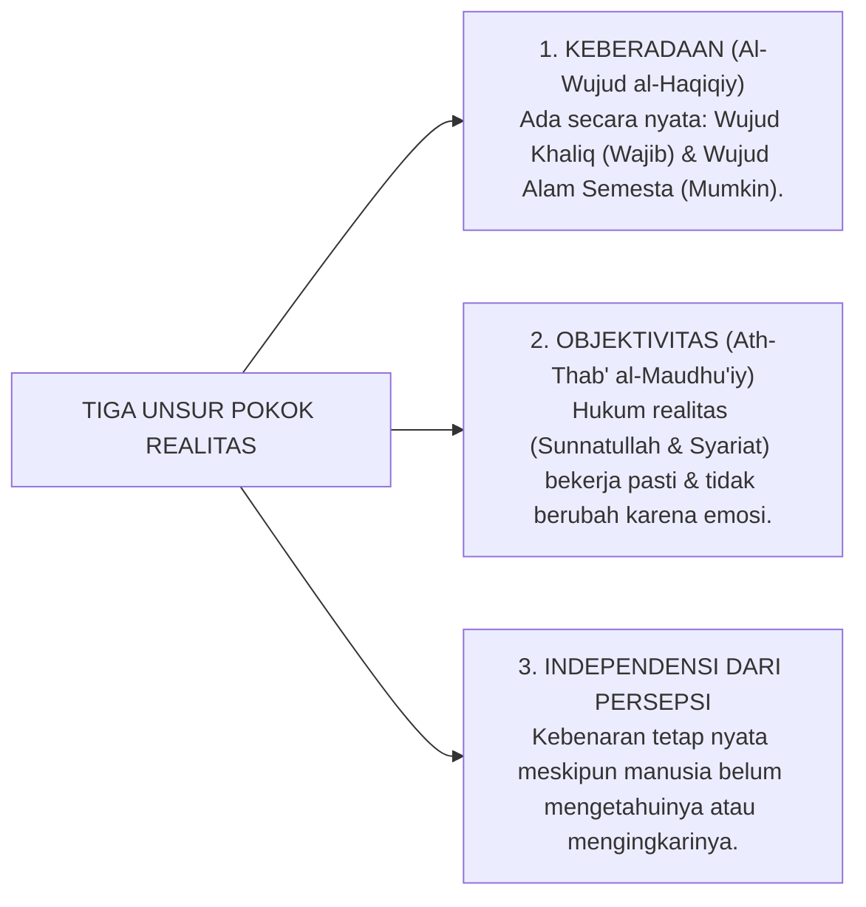
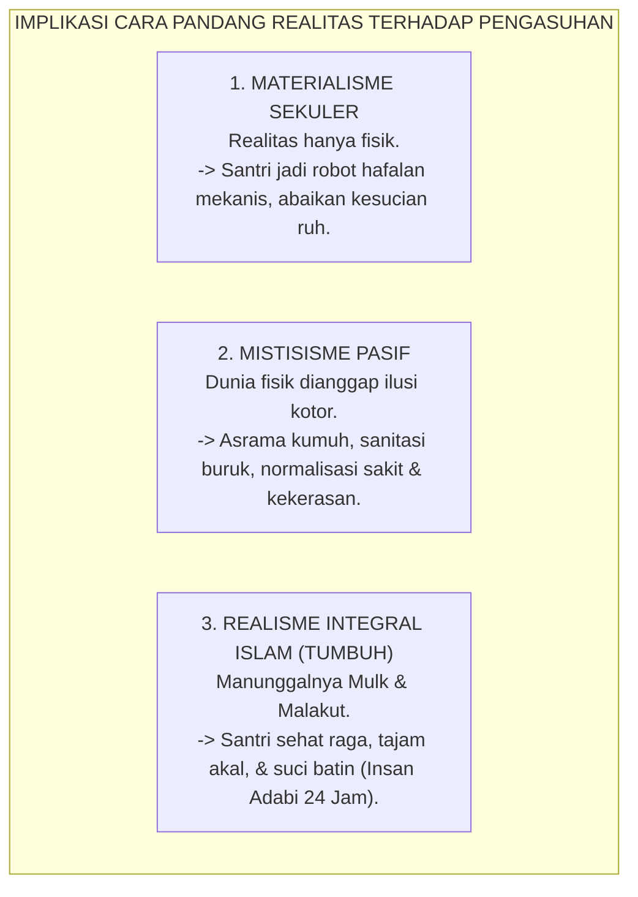
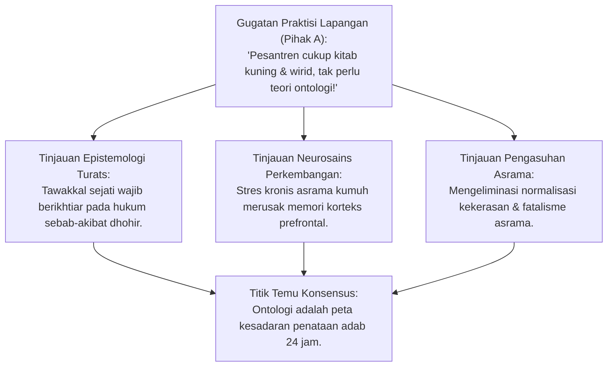
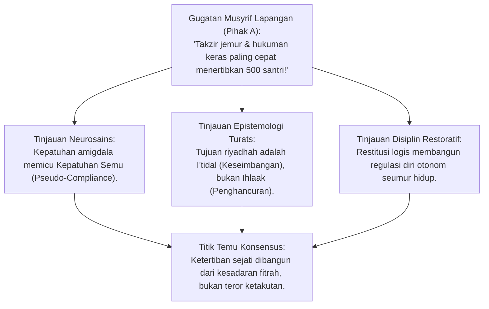
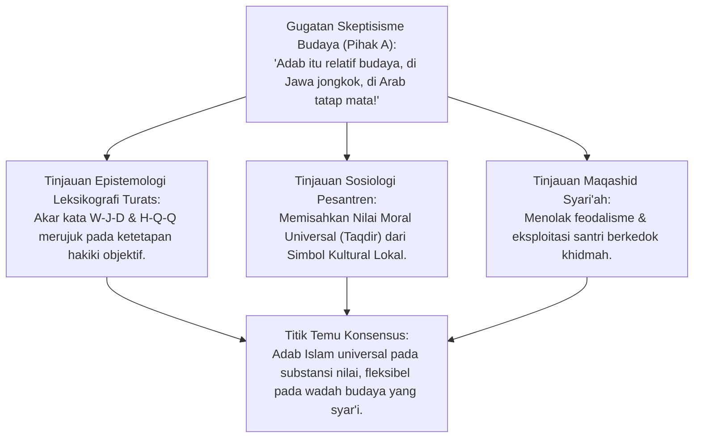
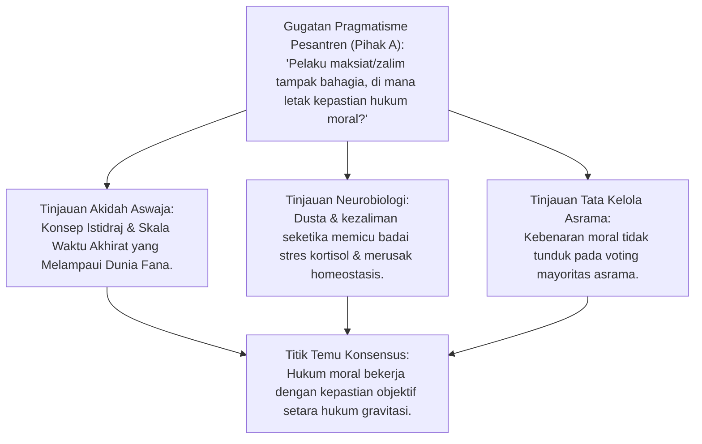
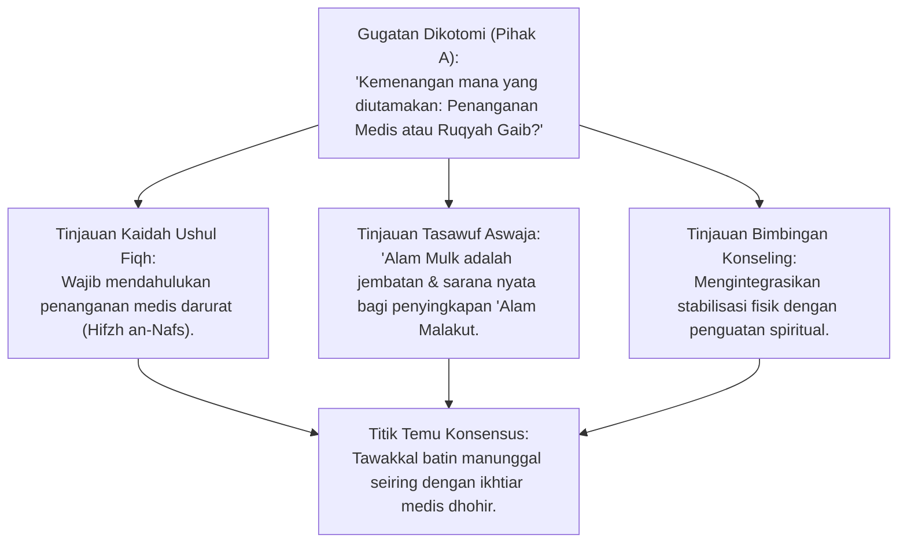
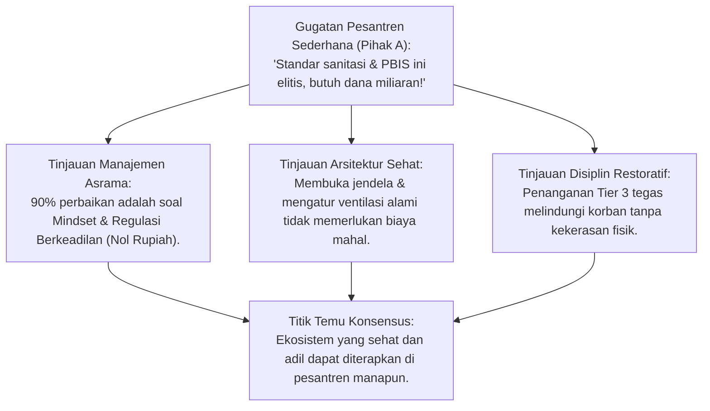

# P1-01-01-01: HAKIKAT DAN DEFINISI REALITAS
## *Monograf Terpadu: Kodifikasi Baku, Riset Inkuiri Dialektika Turats-Sains, & Implikasi Pengasuhan Pesantren*

**Nomor Identifikasi**: `P1-01-01-01/MONOGRAF-TERPADU-REALITAS/2026`  
**Domain**: `01 Philosophy` > `01 Worldview` > `01 Hakikat Realitas`  
**Klasifikasi Naskah**: *Comprehensive Integrated Monograph* (Monograf Akademis & Rumusan Baku Terpadu)  
**Rumpun Disiplin Pengkaji**: Epistemologi Turats, Filsafat Pendidikan Islam, Neurosains Kognitif & Perkembangan, Tata Kelola Pengasuhan Asrama, Disiplin Positif Restoratif  

---

## 📑 DAFTAR ISI MONOGRAF

- [BAGIAN I: KONSENSUS EKSEKUTIF & KODIFIKASI BAKU](#bagian-i-konsensus-eksekutif--kodifikasi-baku)
  - [1. Definisi Operasional Baku Realitas](#1-definisi-operasional-baku-realitas)
  - [2. Tiga Unsur Pokok Realitas](#2-tiga-unsur-pokok-realitas)
  - [3. Peta Realitas: 'Alam Mulk (Dhohir) & 'Alam Malakut (Batin)](#3-peta-realitas-alam-mulk-dhohir--alam-malakut-batin)
  - [4. Mengapa Cara Pandang Realitas Menentukan Arah Pendidikan?](#4-mengapa-cara-pandang-realitas-menentukan-arah-pendidikan)
  - [5. Implikasi Operasional bagi Tata Kelola Asrama & Kurikulum](#5-implikasi-operasional-bagi-tata-kelola-asrama--kurikulum)
- [BAGIAN II: RISET INKUIRI, DIALEKTIKA KRITIS, & STUDI KASUS](#bagian-ii-riset-inkuiri-dialektika-kritis--studi-kasus)
  - [1. Kerangka Metodologi Riset Triangulasi](#1-kerangka-metodologi-riset-triangulasi)
  - [2. Inkuiri 1: Investigasi Urgensi Ontologis vs Realitas Empiris Pesantren](#2-inkuiri-1-investigasi-urgensi-ontologis-vs-realitas-empiris-pesantren)
  - [3. Inkuiri 2: Investigasi Kausal Tiga Paradigma Asumsi Realitas](#3-inkuiri-2-investigasi-kausal-tiga-paradigma-asumsi-realitas)
  - [4. Inkuiri 3: Investigasi Semantik Wujud Objektif vs Relativisme Bahasa](#4-inkuiri-3-investigasi-semantik-wujud-objektif-vs-relativisme-bahasa)
  - [5. Inkuiri 4: Pengujian Stres Tiga Unsur Pokok Realitas](#5-inkuiri-4-pengujian-stres-tiga-unsur-pokok-realitas)
  - [6. Inkuiri 5: Manunggalnya 'Alam Mulk & 'Alam Malakut](#6-inkuiri-5-manunggalnya-alam-mulk--alam-malakut)
  - [7. Inkuiri 6: Translasi Lapangan ke Arsitektur Asrama & PBIS 24 Jam](#7-inkuiri-6-translasi-lapangan-ke-arsitektur-asrama--pbis-24-jam)
- [BAGIAN III: APARATUS AKADEMIS & APENDIKS](#bagian-iii-aparatus-akademis--apendiks)
  - [1. Tabel Sintesis Hasil Riset (Pemetaan 6 Inkuiri ke 6 Rumusan Baku)](#1-tabel-sintesis-hasil-riset-pemetaan-6-inkuiri-ke-6-rumusan-baku)
  - [2. Daftar Pustaka Akademis & Rujukan Turats Primer](#2-daftar-pustaka-akademis--rujukan-turats-primer)
  - [3. Catatan Kaki Akademis (Footnotes)](#3-catatan-kaki-akademis-footnotes)
  - [4. Glosarium dan Penjelasan Istilah Teknis & Turats](#4-glosarium-dan-penjelasan-istilah-teknis--turats)

---

# BAGIAN I: KONSENSUS EKSEKUTIF & KODIFIKASI BAKU

*Bagian ini memuat intisari eksekutif dan rumusan baku definisi serta prinsip-prinsip operasional realitas untuk rujukan cepat pimpinan lembaga, guru, dan musyrif pengasuhan.*

---

### 1. Definisi Operasional Baku Realitas

Dalam khazanah epistemologi Islam dan filsafat realisme kritis teistik, **Realitas (*al-Haqiqah / al-Wujud*)** didefinisikan sebagai:

> **"Segala sesuatu yang benar-benar ada (*al-Mawjud al-Haqiqiy*), baik yang berada dalam domain metafisik yang tak kasat mata (*'Alam al-Ghayb / 'Alam al-Malakut*) maupun domain fisik yang teramati (*'Alam asy-Syahadah / 'Alam al-Mulk*), di mana eksistensi dan hukum-hukumnya bersifat objektif serta tidak bergantung pada pengakuan, persepsi, atau opini subjektif manusia."**[^1]

Kaidah ini menegaskan bahwa kebenaran realitas tidak diciptakan oleh konsensus manusia, melainkan ditemukan (*discovered*) dan diakui (*acknowledged*) melalui instrumen epistemologi yang valid (Wahyu Otoritatif, Akal Sehat, dan Indera yang Sehat).

---

### 2. Tiga Unsur Pokok Realitas

1. **Keberadaan (*al-Wujud*)**: Sesuatu disebut realitas karena ia benar-benar ada dalam kenyataan hakiki. Allah SWT ada, malaikat ada, ruh manusia ada, hukum gravitasi ada, dan konsekuensi hisab moral ada.[^2]
2. **Objektivitas (*ath-Thab' al-Maudhu'iy*)**: Realitas memiliki keteraturan hukum baku (*Sunnatullah*). Api membakar secara objektif; perundungan merusak mental santri secara objektif; dan keikhlasan mendatangkan keberkahan secara objektif.[^3]
3. **Independensi dari Persepsi Manusia**: Kebenaran halal-haram dan adab tidak menjadi cair hanya karena manusia di suatu lingkungan menormalisasi kemaksiatan. Realitas nilai berdiri kokoh melampaui relativisme budaya (*normalization of deviance*).[^4]

---

### 3. Peta Realitas: 'Alam Mulk (Dhohir) & 'Alam Malakut (Batin)

Dalam tradisi keilmuan pesantren Ahlussunnah wal Jama'ah (NU), sebagaimana termaktub dalam kitab *Ihya' 'Ulumiddin* dan *Al-Hikam*, realitas dipetakan ke dalam dua alam yang menyatu secara harmonis:

| Domain Realitas | Istilah Turats Pesantren | Lingkup Entitas Wujud | Saluran Mengetahuinya (*Idrak*) |
| :--- | :--- | :--- | :--- |
| **'Alam Malakut / Batin** (*Ghaibiyyat / Sam'iyyat*) | **'Alam Malakut, Alam Arwah, Perkara Ghaib** | Allah SWT, Malaikat, Catatan Hisab, Siksa/Nikmat Kubur, Surga, Neraka, Berkah, Hakikat Ruh. | **Wahyu Sharih (*Khabar Shadiq*)** dan kejernihan bashirah kalbu (*nurul batin*). |
| **'Alam Mulk / Dhohir** (*Hissiyyat / Syahadah*) | **'Alam Mulk, Alam Dunya, Alam Kasat Mata** | Raga biologis santri, gedung asrama, sirkulasi udara, sanitasi, gizi, hukum fisika-biologi. | **Panca Indera Sehat (*al-Hawas as-Salimah*)** dan pengamatan empiris saintifik (*tajribah*). |

Pendidikan karakter santri berpegang teguh pada kaidah: **menyatukan Dhohir (*'Alam Mulk*) dan Batin (*'Alam Malakut*)**. Setiap amal dhohir di asrama (kebersihan kamar mandi, kerapian ranjang, adab bicara) terhubung langsung dengan timbangan pahala dan pandangan rahmat Allah di alam malakut.[^5]

---

### 4. Mengapa Cara Pandang Realitas Menentukan Arah Pendidikan?

---

### 5. Implikasi Operasional bagi Tata Kelola Asrama & Kurikulum

1. **Penyatuan Syariat Dhohir dan Hakikat Batin**: Ibadah shalat dan hafalan santri wajib dibarengi dengan kesadaran muraqabatullah 24 jam di kobong asrama.
2. **Kepatuhan pada Sunnatullah Alam Mulk**: Menjaga kebersihan kamar mandi (E. coli 0 CFU/100ml), kecukupan ventilasi (minimal 10% luas lantai), pencahayaan (100–150 lux), dan pemenuhan jam tidur biologis (6–7 jam) diakui sebagai kewajiban syar'i (*Hifzh an-Nafs*).
3. **Disiplin Restoratif Bebas Kekerasan**: Menghentikan segala bentuk hukuman fisik, intimidasi verbal, dan feodalisme berkedok khidmah; menggantikannya dengan konsekuensi logis dan pemulihan adab (*Ishlah al-Bain*).[^6]

---

# BAGIAN II: RISET INKUIRI, DIALEKTIKA KRITIS, & STUDI KASUS

*Bagian ini memuat proses penyelidikan fondasional mula-mula (*original ground-zero research*), pengujian formal silogisme logika (*qiyas mantiqi*), pertarungan dialektika multi-perspektif tiga ronde tanpa kata "pakar", studi kasus dilema nyata lapangan, dan penarikan konsensus bersama.*

---

### 1. Kerangka Metodologi Riset Triangulasi

Penyelidikan naskah ini menggunakan **Triangulasi Riset Multidisipliner**:
1. **Hermeneutika Turats & Ushul**: Tahqiq nash kitab kuning klasik, analisis leksikografi Arab, dan pertimbangan maqashid syariah.
2. **Dialektika Filosofis Kritis**: Pengujian keberatan dan sanggahan (*al-Iradat wal-Ajwibah*), formalisasi silogisme mantiq, dan eliminasi sesat pikir logika.
3. **Sains Empiris & Neuro-Edukasi**: Neurosains kognitif, psikologi perkembangan remaja, dan data School-Wide Positive Behavioral Interventions and Supports (SW-PBIS).

---

### 2. Inkuiri 1: Investigasi Urgensi Ontologis vs Realitas Empiris Pesantren

#### 📐 Formalisasi Logika Silogisme (*Qiyas Mantiqi 1*)
* **Premis Mayor (*al-Muqaddimah al-Kubra*)**: Setiap tindakan pengasuhan manusia niscaya berakar pada asumsi mendasar tentang hakikat wujud dan manusia (Ontologi).
* **Premis Minor (*al-Muqaddimah ash-Shughra*)**: Pesantren yang tidak merumuskan ontologinya secara sadar akan mengadopsi asumsi ontologis cacat secara implisit (Fatalisme / Materialisme Tersembunyi).
* **Konklusi (*an-Natijah*)**: Maka, perumusan ontologi realitas formal adalah keniscayaan mutlak bagi tegaknya sistem pendidikan karakter pesantren yang benar.[^7]

#### 🥊 Ronde 1: Gugatan Tradisi Praktis vs Penataan Kausalitas
* **Pihak A (Sudut Pandang Praktisi Lapangan & Tradisionalis)**:  
  *"Pesantren di Nusantara sudah ratusan tahun berjalan mandiri dengan mengkaji kitab-kitab turats seperti Safinah, Taqrib, dan mengamalkan wirid harian. Mengapa kita merasa perlu merumuskan 'Ontologi Realitas'? Bukankah ini istilah filsafat yang terkesan rumit dan tidak membumi bagi kehidupan santri di kobong asrama?"*
* **Tinjauan Sudut Pandang Epistemologi Turats**:  
  Tradisi keilmuan Islam klasik sejatinya tidak pernah memisahkan ilmu hakikat dari penataan amal dhohir. Imam Al-Ghazali dalam *Ihya' 'Ulumiddin* menegaskan bahwa kekeliruan dalam menata hukum kausalitas fisik adalah bentuk kebodohan (*jahl*), bukan kepasrahan tawakal. Ketika pengurus asrama membiarkan kamar mandi kotor, santri terserang penyakit kulit (*gudikan*), dan santri senior melakukan kekerasan fisik kepada junior dengan dalih *"melatih mental dan tirakat"*, pengurus tersebut sejatinya sedang terjangkit paham fatalisme (*jabariyah tersembunyi*) yang menyimpang dari kaidah syariat.[^8]
* **Tinjauan Sudut Pandang Neurosains & Psikologi Perkembangan**:  
  Secara neurobiologis, pembiaran stres toksik menahun akibat lingkungan kumuh atau relasi hierarki yang mengintimidasi memicu pelepasan hormon kortisol kronis yang merusak plastisitas korteks prefrontal santri. Akibatnya, kapasitas memori kerja (*working memory*) untuk menghafal Al-Qur'an dan menyerap ilmu justru mengalami degradasi. Kesadaran terhadap realitas biologis tubuh santri adalah hukum sunnatullah yang objektif.[^9]

#### 🥊 Ronde 2: Sanggahan Balik Romantisme Masa Lalu vs Fakta Survivorship Bias
* **Pihak A (Sudut Pandang Konservatisme Pesantren)**:  
  *"Sanggahan! Para ulama dan kiai besar zaman dahulu lahir dari pondok yang serba terbatas dan sarana sederhana. Jika generasi terdahulu terbukti sukses menjadi orang alim tanpa fasilitas modern, mengapa sekarang kita harus menuntut standar higienitas, gizi, dan tata kelola psikologis?"*
* **Tinjauan Sudut Pandang Epistemologi Turats & Metodologi Riset**:  
  Pandangan tersebut terjebak dalam bias kelangsungan hidup (*survivorship bias*). Kita hanya menghitung segelintir tokoh luar biasa yang bertahan, seraya menutup mata terhadap ribuan santri lain yang gagal berkembang, mengalami trauma seumur hidup, atau putus belajar akibat sanitasi buruk dan kekerasan pengasuhan. Asy-Syathibi dalam *Al-Muwafaqat* menegaskan bahwa hukum syariat dan sistem pendidikan dibangun di atas penjagaan maslahat umum mayoritas (*Hifzh al-Kulliyyat*), bukan bertumpu pada perkecualian individu istimewa semata.[^10]
* **Tinjauan Sudut Pandang Tata Kelola Pengasuhan Asrama**:  
  Tantangan zaman telah bergeser secara radikal. Santri generasi kini berhadapan langsung dengan banjir informasi digital, krisis atensi, dan tekanan mental yang kompleks. Mengandalkan romantisme masa lalu tanpa membenahi ekosistem fisik dan psikososial asrama adalah pengabaian terhadap amanah perlindungan anak (*In Loco Parentis*).[^11]

#### 🥊 Ronde 3: Sanggahan Pamungkas Nalar Kritis vs Keikhlasan Tawadhu'
* **Pihak A (Sudut Pandang Skeptisisme Otoritas)**:  
  *"Bagaimana jika mengajarkan nalar ontologis dan sikap kritis kepada santri justru membuat mereka kurang menghormati kiai, banyak mendebat musyrif, dan kehilangan ruh tawadhu' serta keberkahan ilmu?"*
* **Resolusi Sudut Pandang Epistemologi & Bimbingan Konseling**:  
  Tawadhu' sejati lahir dari pemahaman yang mendalam tentang keagungan Allah dan kerendahan hakiki diri hamba (*Ma'rifatullah wa Ma'rifatun Nafs*), bukan dari ketakutan semu atau kepatuhan buta tanpa nalar. Santri yang dibekali pemahaman cara pandang Islam yang kokoh justru memiliki benteng akal yang tangguh terhadap pemikiran menyimpang dan nihilisme modern, sekaligus memiliki adab yang murni karena menghormati guru atas dasar kebenaran syariat, bukan feodalisme semu.[^12]

> #### 📌 Kasuistika Lapangan 1 & Titik Temu Konsensus
> * **Studi Kasus**: Di sebuah asrama, seorang santri junior menderita scabies parah dan kelelahan karena harus mencuci pakaian santri senior setiap malam. Musyrif menganggap ini bagian dari "uji kesabaran dan tirakat masa lalu".
> * **Titik Temu Konsensus (*Kalimatun Sawa'*)**: Disepakati bahwa tirakat syar'i adalah kesungguhan bermujahadah dalam ibadah dan belajar, bukan pembiaran penyakit menular atau perundungan hierarkis. Menjaga kesehatan fisik dhohir santri adalah kewajiban syar'i (*Hifzh an-Nafs*) yang menjadi prasyarat kematangan ruhani di alam batin.[^13]

---

### 3. Inkuiri 2: Investigasi Kausal Tiga Paradigma Asumsi Realitas

#### 📐 Formalisasi Logika Silogisme (*Qiyas Mantiqi 2*)
* **Premis Mayor (*al-Muqaddimah al-Kubra*)**: Sistem pendidikan yang mereduksi realitas manusia hanya pada dimensi fisik (Materialisme) atau hanya pada dimensi batin pasif (Mistisisme) niscaya melahirkan kepribadian yang timpang (*dysfunctional personality*).
* **Premis Minor (*al-Muqaddimah ash-Shughra*)**: Manusia menurut Islam tersusun atas kesatuan integral antara Raga (*Jasad*) yang tunduk pada hukum biologis dan Jiwa (*Ruh/Qalb*) yang terhubung dengan alam malakut.
* **Konklusi (*an-Natijah*)**: Maka, hanya Realisme Integral Teistik Islam yang mampu mengantarkan santri menuju kematangan adab sejati (*Insan Kamil*).[^14]

#### 🥊 Ronde 1: Dekonstruksi Materialisme Sekuler vs Mistisisme Pasif
* **Penyelidikan Kausal Dua Paradigma Ekstrem**:  
  1. *Materialisme Sekuler* memandang santri semata-mata sebagai organisme biologis mekanistik. Dampaknya: pengasuhan berubah menjadi pabrik angka hafalan dan kepatuhan lahiriah yang kering dari nilai muraqabah ilahiyyah.[^15]  
  2. *Mistisisme Pasif* memandang dunia materi sebagai sesuatu yang kotor dan tak berharga. Dampaknya: pengasuhan mengabaikan sanitasi kobong, nutrisi otak, dan keselamatan raga santri atas nama kezuhudan semu.[^16]

#### 🥊 Ronde 2: Sanggahan Balik Efisiensi Behaviorisme Keras vs Pseudo-Compliance
* **Pihak A (Sudut Pandang Musyrif Lapangan yang Kelelahan)**:  
  *"Sanggahan! Dalam praktik nyata mengontrol 500 santri di aula asrama, sistem reward-punishment keras (ancaman takzir jemur, push-up malam, potong rambut botak) terbukti paling cepat, murah, dan efektif menertibkan santri dalam 5 menit. Mengapa kita menolak cara yang jelas-jelas terbukti praktis di lapangan?"*
* **Tinjauan Sudut Pandang Neurosains & Psikologi Perilaku**:  
  Behaviorisme keras memang memproduksi ketertiban instan, namun riset neurobiologi membuktikan bahwa itu adalah **Kepatuhan Semu Berbasis Ketakutan Amigdala (*Fear-Induced Pseudo-Compliance*)**. Ketika kepatuhan didorong oleh rasa takut akan hukuman fisik atau rasa malu publik, korteks prefrontal santri yang mengolah internalisasi moral mandiri tidak teraktivasi. Begitu berada di luar radar pengawasan musyrif, santri mengalami *rebound effect* yang meledak dalam bentuk pelanggaran moral yang lebih tersembunyi dan parah.[^17]
* **Tinjauan Sudut Pandang Disiplin Restoratif**:  
  Disiplin berbasis konsekuensi logis dan restitusi mengajarkan santri memperbaiki kerusakan yang ditimbulkan (*making things right*). Metode ini melatih sirkuit regulasi diri otonom (*executive functions*) yang bertahan seumur hidup santri, bahkan ketika ia telah lulus dari pesantren.[^18]

#### 🥊 Ronde 3: Sanggahan Pamungkas Doktrin Riyadhah Mematikan Nafsu vs I'tidal
* **Pihak A (Sudut Pandang Asketisme Ekstrem)**:  
  *"Bukankah rujukan tasawuf klasik mengajarkan mujahadatun nafs dengan mematikan syahwat jasmani (lapar, lelah, membatasi tidur)? Mengapa kita menuntut kamar tidur berventilasi layak dan menu nutrisi seimbang? Apakah ini bukan pemanjaan raga yang melemahkan mental santri?"*
* **Tinjauan Sudut Pandang Epistemologi Turats**:  
  Imam Al-Ghazali dalam *Ihya' 'Ulumiddin* (Kitab *Riyadhatun Nafs*) menegaskan bahwa hakikat riyadhah adalah **Keseimbangan Watak (*I'tidal*)**, bukan penghancuran raga (*Ihlaak al-Jasad*). Berpuasa sunnah adalah ibadah syar'i, namun membiarkan santri malnutrisi akibat dapur asrama yang buruk adalah kezaliman yang diharamkan syariat. Raga adalah bejana amanah yang wajib dirawat agar ruh mampu menunaikan ibadah dan thalabul 'ilmi dengan paripurna.[^19]

> #### 📌 Kasuistika Lapangan 2 & Titik Temu Konsensus
> * **Studi Kasus**: Santri yang terlambat shalat subuh dihukum lari keliling lapangan tanpa alas kaki di bawah terik matahari, akibatnya santri pingsan karena dehidrasi dan gula darah drop.
> * **Titik Temu Konsensus (*Kalimatun Sawa'*)**: Disepakati bahwa kedisiplinan shalat subuh ditegakkan melalui pendampingan jam tidur malam yang teratur (hukum biologis) dan konsekuensi edukatif yang membangun kesadaran makna shalat, bukan melalui siksaan fisik yang membahayakan keselamatan raga santri.[^20]

---

### 4. Inkuiri 3: Investigasi Semantik Wujud Objektif vs Relativisme Bahasa

#### 📐 Formalisasi Logika Silogisme (*Qiyas Mantiqi 3*)
* **Premis Mayor (*al-Muqaddimah al-Kubra*)**: Setiap konsep adab yang berpijak pada kebenaran objektif wahyu Allah dan fitrah penciptaan manusia tidak dapat dibatalkan oleh perubahan budaya atau konstruksi bahasa.
* **Premis Minor (*al-Muqaddimah ash-Shughra*)**: Nilai adab Islam (keadilan, rahmah, iffah, amanah) berakar pada penetapan Allah (*al-Haqq al-Mubin*) yang tercermin dalam fitrah manusia.
* **Konklusi (*an-Natijah*)**: Maka, adab Islam bersifat objektif dan universal melampaui relativisme budaya dan konstruksi bahasa pascamodern.[^21]

#### 🥊 Ronde 1: Analisis Isytiqoq al-Wujud & Bantahan Dekonstruksionisme
* **Tinjauan Epistemologi Leksikografi Turats**:  
  Akar kata *W-J-D* (*al-Wujud*) bermakna menemukan hakikat sesuatu pada kenyataan aslinya (*Idrak asy-Syai' bi Haqiqatih*), dan *H-Q-Q* (*al-Haqiqah*) bermakna ketetapan yang pasti (*ats-Tsubut wal-Luzum*). Wujud dan kebenaran bukan sekadar permainan wacana bahasa (*language games*) kaum pascamodern, melainkan realitas ontologis ciptaan Allah yang memiliki sifat objektif dan dapat ditangkap oleh akal budi manusia.[^22]

#### 🥊 Ronde 2: Sanggahan Balik Relativitas Budaya Adab (Jawa vs Arab vs Barat)
* **Pihak A (Sudut Pandang Relativisme Kultural)**:  
  *"Sanggahan! Jika adab itu objektif dan universal, mengapa ekspresinya berbeda di tiap wilayah? Di pesantren Jawa, santri berjalan jongkok di depan kiai dianggap adab tertinggi. Di Timur Tengah, menatap wajah guru dan mencium kening dianggap mulia, sementara berjalan jongkok dianggap janggal. Bukankah ini bukti bahwa adab hanyalah konstruksi sosial lokal yang relatif?"*
* **Tinjauan Sudut Pandang Epistemologi Turats & Sosiologi Pendidikan**:  
  Perlu dibedakan secara tegas antara **Hakikat Nilai Universal (*al-Kulliyyat al-Adabiyyah*)** dengan **Wadah Kultural Lokal (*al-Juz'iyyat al-'Urfiyyah*)**:  
  * *Nilai Objektif Universal*: Rasa hormat (*Taqdir*), welas asih (*Rahmah*), kejujuran (*Shidq*), dan ketiadaan takabur adalah nilai mutlak universal di hadapan syariat.  
  * *Wadah Simbolik*: Berjalan membungkuk di tanah Jawa atau mencium kening di tanah Arab adalah bejana kultural ekspresi (*Zhuruf*). Perbedaan wadah tidak membatalkan kemutlakan nilai universal yang ada di dalamnya.[^23]

#### 🥊 Ronde 3: Sanggahan Pamungkas Bahaya Hegemoni Feodal Berkedok Adab
* **Pihak A (Sudut Pandang Perlindungan Hak Santri)**:  
  *"Bagaimana jika figur pengasuh memanfaatkan klaim 'adab objektif' untuk melegitimasi feodalisme yang menindas: santri dipaksa mencuci kendaraan pribadi, memijat pengurus hingga larut malam, dan dilarang bertanya di kelas dengan dalih 'tawadhu'? Bukankah klaim objektivitas ini rawan menjadi alat kesewenang-wenangan?"*
* **Resolusi Sudut Pandang Maqashid Syari'ah & Tata Kelola Lembaga**:  
  Segala bentuk eksploitasi fisik dan perbudakan santri berkedok khidmah adalah **Batil secara Ontologis dan Haram secara Syar'i**! Khidmah santri hanya sah apabila bersifat sukarela, tidak melanggar hak istirahat/belajar santri, dan ditujukan bagi kemaslahatan bersama pesantren (*Maslahah 'Ammah*), bukan untuk melayani kepentingan pribadi pengasuh.[^24]

> #### 📌 Kasuistika Lapangan 3 & Titik Temu Konsensus
> * **Studi Kasus**: Pengurus asrama menyuruh santri junior berjaga malam menjaga warung pribadi pengurus hingga jam 3 pagi dengan dalih "ngalap berkah khidmah".
> * **Titik Temu Konsensus (*Kalimatun Sawa'*)**: Disepakati bahwa khidmah yang merampas jam tidur biologis dan hak belajar santri adalah pelanggaran syariat dan adab. Keteladanan pemimpin (*Qudwah Hasanah*) adalah melayani santri, bukan mengeksploitasi santri demi kepentingan pribadi.[^25]

---

### 5. Inkuiri 4: Pengujian Stres Tiga Unsur Pokok Realitas

#### 📐 Formalisasi Logika Silogisme (*Qiyas Mantiqi 4*)
* **Premis Mayor (*al-Muqaddimah al-Kubra*)**: Hukum realitas yang ditetapkan Allah (baik Sunnatullah Fisik maupun Sunnatullah Moral) bekerja secara objektif dan independen dari pengakuan atau persepsi subjek manusia.
* **Premis Minor (*al-Muqaddimah ash-Shughra*)**: Keburukan moral (kezaliman, perundungan, dusta) secara pasti memicu kerusakan homeostasis biologis dan pencemaran spiritual kalbu.
* **Konklusi (*an-Natijah*)**: Maka, status keburukan dosa dan kebaikan adab bersifat mutlak objektif, tidak bergantung pada apakah manusia menormalisasikannya atau tidak.[^26]

#### 🥊 Ronde 1: Pembuktian Kepastian Matematis Hukum Moral Setara Gravitasi
* **Tinjauan Kausalitas Neuro-Spiritual**:  
  Dosa dan kezaliman memiliki konsekuensi objektif seketika. Secara biologis, saat seseorang berbohong atau menganiaya kawan, amigdala memicu lonjakan hormon stres (kortisol) yang mengacaukan homeostasis tubuh. Secara spiritual, titik hitam (*nuktah sauda'*) seketika menutupi kejernihan kalbu (*Basirah*). Kerusakan ini terjadi secara pasti, terlepas dari apakah perbuatan tersebut tertangkap basah oleh musyrif atau tidak.[^27]

#### 🥊 Ronde 2: Sanggahan Balik Paradoks Orang Zalim yang Tampak Bahagia
* **Pihak A (Sudut Pandang Skeptisisme Empiris)**:  
  *"Sanggahan! Jika hukum moral seobjektif gravitasi, mengapa banyak pelaku perundungan atau koruptor yang hidup berkecukupan, bertubuh sehat, dan tertawa gembira tanpa terlihat binasa oleh hukum moral yang Anda maksud? Bukankah realitas empiris membantah teori ini?"*
* **Tinjauan Sudut Pandang Epistemologi Turats & Tauhid Aswaja**:  
  Pandangan tersebut mengalami rabun dekat epistemik (*epistemic myopia*):  
  1. *Istidraj Ontologis*: Dalam tauhid Ahlussunnah, kenikmatan lahiriah orang zalim adalah *istidraj* (penundaan siksa). Matinya kepekaan nurani (*Mautul Qalb*) adalah hukuman paling berat di alam batin yang kerap tidak disadari pelaku.[^28]  
  2. *Skala Realitas Melampaui Dunia*: Hukum moral tidak dibatasi oleh ruang sempit duniawi yang fana, melainkan berlanjut hingga pengadilan hisab akhirat yang kekal (QS. Az-Zalzalah: 7–8). Menilai hukum moral hanya dari kenikmatan semu sesaat adalah kedangkalan penalaran.[^29]

#### 🥊 Ronde 3: Sanggahan Pamungkas Tekanan Mayoritas Asrama (Normalisasi Dosa)
* **Pihak A (Sudut Pandang Sosiologis Lapangan)**:  
  *"Jika dalam satu kobong asrama 10 dari 10 santri sepakat bahwa kabur malam untuk merokok adalah bentuk solidaritas dan kebanggaan kelompok, atas dasar apa musyrif mengklaim perbuatan itu salah jika seluruh penghuni kamar merasa senang dan kompak?"*
* **Resolusi Sudut Pandang Filosofis & Manajemen Asrama**:  
  Inilah pentingnya prinsip **Independensi Realitas dari Persepsi Manusia**. Status racun pada senyawa berbahaya tidak berubah menjadi obat meskipun 100 orang sepakat menamainya obat. Begitu pula kemaksiatan dan pelanggaran adab: ia tetap merusak fitrah manusia secara objektif meskipun seluruh penghuni kamar melakukan normalisasi penyimpangan (*normalization of deviance*). Kebenaran diukur dari kesesuaian dengan Wahyu dan Sunnatullah, bukan dari voting suara terbanyak.[^30]

> #### 📌 Kasuistika Lapangan 4 & Titik Temu Konsensus
> * **Studi Kasus**: Tradisi "mencomot sandal" (*ghashab*) dianggap hal lumrah di sebuah asrama karena "semua orang melakukannya".
> * **Titik Temu Konsensus (*Kalimatun Sawa'*)**: Disepakati bahwa normalisasi massal tidak mengubah status keharaman ghashab. Ghashab merusak rasa saling percaya (*ukhuwah*) dan membiasakan pengabaian hak milik orang lain yang merusak integritas moral santri.[^31]

---

### 6. Inkuiri 5: Manunggalnya 'Alam Mulk & 'Alam Malakut

#### 📐 Formalisasi Logika Silogisme (*Qiyas Mantiqi 5*)
* **Premis Mayor (*al-Muqaddimah al-Kubra*)**: Siapapun yang memisahkan antara syariat lahiriah (Alam Mulk) dan hakikat batiniah (Alam Malakut) akan terjatuh ke dalam kefasikan atau kezindikan (*Kaidah Imam Malik & Al-Ghazali*).
* **Premis Minor (*al-Muqaddimah ash-Shughra*)**: Pendidikan pesantren mengasuh santri yang hidup di alam mulk fisik (membutuhkan kesehatan, sanitasi, dan gizi) sekaligus mengemban amanah malakut (keikhlasan, hisab, dan muraqabah).
* **Konklusi (*an-Natijah*)**: Maka, pesantren wajib menyatukan tata kelola kebersihan/kesehatan fisik dhohir dengan pembinaan spiritual batin secara simultan tanpa dikotomi.[^32]

#### 🥊 Ronde 1: Harmoni Syariat Dhohir & Hakikat Batin (Ihya' & Al-Hikam)
* **Tinjauan Epistemologi Turats Aswaja**:  
  Imam Al-Ghazali dan Ibnu 'Athaillah As-Sakandari menegaskan bahwa 'Alam Mulk adalah bejana lahiriah bagi terwujudnya kesucian di 'Alam Malakut. Memisahkan urusan 'Alam Mulk (kebersihan saluran air, kesehatan mata santri, asupan gizi) dari 'Alam Malakut (keikhlasan belajar, ketenangan shalat) adalah pemisahan keliru yang melumpuhkan produktivitas peradaban pesantren.[^33]

#### 🥊 Ronde 2: Sanggahan Balik Kecukupan Sains Empiris Murni Tanpa Malakut
* **Pihak A (Sudut Pandang Saintisme Sekuler)**:  
  *"Sanggahan! Jika fasilitas sanitasi, arsitektur gedung, dan gizi fisik sudah dipenuhi secara sempurna melalui sains medis modern, santri pasti berprestasi secara otomatis. Mengapa kita masih membutuhkan konsep alam malakut (malaikat, pahala, keikhlasan batin)?"*
* **Tinjauan Sudut Pandang Filosofis & Pendidikan Nilai**:  
  Sains alam mulk hanya mampu mengatur **Mekanika Perilaku (*How*)**, namun tidak mampu menjawab **Makna & Integritas Kalbu (*Why*)**. Tanpa kesadaran akan 'Alam Malakut (*Muraqabatullah*), santri yang berbadan sehat dan cerdas secara intelektual berisiko tumbuh menjadi pribadi oportunis yang lihai memanipulasi aturan. Kesadaran hisab malakut menanamkan *pengawas internal abadi* di dalam hati sanubari santri saat berada dalam kesendirian.[^34]

#### 🥊 Ronde 3: Sanggahan Pamungkas Benturan Medis vs Mitos Kesambet Jin
* **Pihak A (Sudut Pandang Mistisisme Ekstrem)**:  
  *"Bagaimana jika ada santri histeris atau kejang di kobong asrama, pengurus meyakini santri kesurupan jin penunggu sumur pondok, sementara dokter medis mendiagnosis santri mengalami serangan panik berat atau kelelahan saraf akut? Siapa yang harus dimenangkan: Alam Malakut atau Alam Mulk?"*
* **Resolusi Sudut Pandang Fiqh Medis & Bimbingan Konseling**:  
  Penanganan pertama **Wajib secara medis empiris di Alam Mulk** (pemeriksaan dokter, stabilisasi pernapasan, hidrasi, de-eskalasi emosi). Mengabaikan pertolongan medis darurat atas nama ritual ruqyah semata adalah pelanggaran terhadap maqashid syariah *Hifzh an-Nafs* (menjaga nyawa). Doa dan ruqyah syar'iyyah dihadirkan sebagai penguat spiritual batin, bukan pengganti diagnosa medis klinis.[^35]

> #### 📌 Kasuistika Lapangan 5 & Titik Temu Konsensus
> * **Studi Kasus**: Santri pingsan berulang kali saat antre mandi pagi didiagnosis oleh teman sekamarnya "ditempeli jin", padahal ia mengalami anemia defisiensi besi dan hipoglikemia karena sering melewatkan sarapan.
> * **Titik Temu Konsensus (*Kalimatun Sawa'*)**: Disepakati bahwa setiap keluhan fisik santri wajib diperiksa melalui kaidah medis empiris terlebih dahulu. Perlindungan raga santri adalah bagian tak terpisahkan dari pengamalan syariat Islam.[^36]

---

### 7. Inkuiri 6: Translasi Lapangan ke Arsitektur Asrama & PBIS 24 Jam

#### 📐 Formalisasi Logika Silogisme (*Qiyas Mantiqi 6*)
* **Premis Mayor (*al-Muqaddimah al-Kubra*)**: Setiap ekosistem pendidikan yang memuliakan martabat manusia (*Karamah Insaniyyah*) wajib merancang lingkungan fisiknya untuk mendukung kesehatan otak dan menegakkan disiplin tanpa kekerasan.
* **Premis Minor (*al-Muqaddimah ash-Shughra*)**: Hukuman fisik dan lingkungan kumuh terbukti secara neurobiologis mematikan fungsi nalar korteks prefrontal santri.
* **Konklusi (*an-Natijah*)**: Maka, pesantren wajib menerapkan arsitektur ramah biologis dan sistem Positive Behavioral Interventions and Supports (PBIS) restoratif multi-tier 24 jam.[^37]

#### 🥊 Ronde 1: Desain Arsitektur Asrama Ramah Neurobiologis & Parameter Terukur
* **Tinjauan Parameter Lingkungan Belajar Terukur**:  
  * **Pencahayaan**: Minimal 100–150 lux di area belajar kamar untuk mencegah kelelahan saraf optik dan penurunan fokus.  
  * **Sirkulasi Udara**: Luas ventilasi aktif minimal 10% dari luas lantai kamar untuk menjaga saturasi oksigen otak santri di atas 98%.  
  * **Kebersihan Air**: Uji berkala terhadap angka bakteri E. coli (0 CFU/100ml) pada air bak wudhu untuk memutus rantai penyakit kulit dan pencernaan.[^38]

#### 🥊 Ronde 2: Sanggahan Balik Tudingan Sistem Elitis-Mahal vs Pesantren Sederhana
* **Pihak A (Sudut Pandang Pengelola Pesantren Pedesaan)**:  
  *"Sanggahan! Standar ventilasi, higienitas air, dan menu nutrisi terukur yang dituntut terdengar elitis dan membutuhkan dana besar. Pendekatan ini dinilai hanya cocok untuk pesantren modern perkotaan berbiaya tinggi. Bagaimana dengan ribuan pesantren rakyat di pedesaan yang serba terbatas?"*
* **Tinjauan Sudut Pandang Tata Kelola Pengasuhan Asrama**:  
  Sebagian besar prinsip dasar perbaikan lingkungan asrama adalah **masalah Pola Pikir Manajemen (*Management Mindset*) dan Keadilan Perlakuan, bukan anggaran uang**:  
  * Membuka jendela setiap pagi agar sirkulasi udara berganti adalah keputusan tanpa biaya.  
  * Menghentikan tradisi kekerasan verbal atau hukuman fisik adalah komitmen moral nol rupiah.  
  * Menjaga kamar mandi tetap bersih dan tidak berbau hanya menuntut pembagian jadwal piket yang adil dan konsisten.  
  Bilik asrama bambu di pelosok sekalipun dapat menjelma menjadi lingkungan yang berkah dan sehat selama dijaga kebersihannya dan diisi dengan keteladanan *Qudwah Hasanah*.[^39]

#### 🥊 Ronde 3: Sanggahan Pamungkas Mitigasi Pelanggaran Berat Tier 3 Bebas Hukuman Fisik
* **Pihak A (Sudut Pandang Keamanan Ketertiban Asrama)**:  
  *"Jika kekerasan fisik, pemaluan di depan umum, dan pengusiran sepihak dilarang, bagaimana jika terjadi pelanggaran sangat berat (Tier 3: pencurian berulang, perkelahian, atau pelecehan)? Apakah pelaku hanya dinasihati lembut sehingga merugikan santri lain?"*
* **Resolusi Sudut Pandang Disiplin Restoratif & Perlindungan Anak**:  
  Disiplin Positif Restoratif berpegang pada prinsip **Tegas & Penuh Welas Asih (*Firm and Kind*)**, bukan pembiaran:  
  1. *Pemisahan Sementara Terapeutik*: Pelaku pelanggaran berat langsung dipisahkan dari interaksi umum demi menghentikan eskalasi bahaya dan melindungi korban (*Taqdim Dar'il Mafasid*).  
  2. *Konsekuensi Logis & Restitusi Nyata*: Pelaku wajib bertanggung jawab mengganti kerugian, menjalani pendampingan konseling intensif Tier 3, serta menempuh proses pemulihan relasi (*Ishlah al-Bain*).  
  3. *Koordinasi Hukum Positif*: Jika menyangkut tindak pidana berat, lembaga berkoordinasi dengan otoritas resmi demi keadilan dan perlindungan hukum, tanpa melakukan persekusi fisik di dalam lingkungan pondok.[^40]

> #### 📌 Kasuistika Lapangan 6 & Titik Temu Konsensus
> * **Studi Kasus**: Dua santri terlibat perkelahian fisik hingga salah satunya terluka memar. Musyrif lama berniat memukul kedua santri di depan seluruh santri saat apel malam.
> * **Titik Temu Konsensus (*Kalimatun Sawa'*)**: Disepakati bahwa memukul dan mempermalukan santri di depan publik justru melegitimasi kekerasan di mata santri lain. Penanganan yang benar adalah memisahkan pelaku, mengobati santri yang terluka, melakukan mediasi restoratif terpisah, dan menetapkan konsekuensi kerja sosial pemulihan asrama secara bermartabat.[^41]

---

# BAGIAN III: APARATUS AKADEMIS & APENDIKS

---

### 1. Tabel Sintesis Hasil Riset (Pemetaan 6 Inkuiri ke 6 Rumusan Baku)

| No | Babak Inkuiri Riset (*Bagian II*) | Rumusan Baku Hasil Riset (*Bagian I*) | Temuan Kunci & Argumen Pembeda |
| :---: | :--- | :--- | :--- |
| **1** | **Inkuiri 1**: Investigasi Urgensi Ontologis | **Rumusan 1**: Urgensi Ontologi bagi Pengasuhan | Mengeliminasi fatalisme asrama dan membentengi akal budi santri dari nihilisme modern. |
| **2** | **Inkuiri 2**: Investigasi Tiga Paradigma Asumsi | **Rumusan 2**: Mengapa Realitas Menentukan Pendidikan | Membuktikan kegagalan materialisme dan mistisisme pasif; mengukuhkan Realisme Integral. |
| **3** | **Inkuiri 3**: Investigasi Semantik Wujud Objektif | **Rumusan 3**: Definisi Operasional Realitas | Menegaskan definisi wujud objektif (*al-Mawjud al-Haqiqiy*) yang bebas dari manipulasi feodal. |
| **4** | **Inkuiri 4**: Pengujian Stres 3 Unsur Pokok | **Rumusan 4**: Tiga Unsur Pokok Realitas | Membuktikan bahwa hukum moral adab bekerja dengan kepastian objektif setara gravitasi. |
| **5** | **Inkuiri 5**: Manunggalnya 'Alam Mulk & Malakut | **Rumusan 5**: Peta Realitas Mulk & Malakut | Menegakkan kaidah Aswaja: Tawakkal tidak menafikan ikhtiar medis/sanitasi di alam mulk. |
| **6** | **Inkuiri 6**: Translasi ke Arsitektur & PBIS | **Rumusan 6**: Mandat Kurikulum & SOP Asrama | Menghasilkan mandat operasional: ventilasi 10%, SOP air bersih, dan disiplin PBIS anti-kekerasan. |

---

### 2. Daftar Pustaka Akademis & Rujukan Turats Primer

1. **Al-Attas, Syed Muhammad Naquib.** (1995). *Prolegomena to the Metaphysics of Islam: An Exposition of the Fundamental Elements of the Worldview of Islam*. Kuala Lumpur: International Institute of Islamic Thought and Civilization (ISTAC).
2. **Al-Ghazali, Abu Hamid Muhammad bin Muhammad.** (2004). *Ihya' 'Ulumiddin* (4 Jilid). Tahqiq: Ahmad 'Inayah. Kairo: Dar al-Hadits.
3. **Al-Ghazali, Abu Hamid Muhammad bin Muhammad.** (1997). *Al-Mustashfa min 'Ilm al-Ushul*. Tahqiq: Muhammad Abdul Salam Abdul Syafi. Beirut: Dar al-Kutub al-'Ilmiyyah.
4. **Al-Maturidi, Abu Mansur Muhammad bin Muhammad.** (2003). *Kitab at-Tawhid*. Tahqiq: Bekir Topaloglu & Muhammad Aruçi. Beirut: Dar Shadir.
5. **Asy-Syathibi, Abu Ishaq Ibrahim bin Musa.** (2003). *Al-Muwafaqat fi Ushul asy-Syari'ah* (4 Jilid). Tahqiq: Masyhur bin Hasan Al Salman. Kairo: Dar Ibn 'Affan.
6. **Bhaskar, Roy.** (2008). *A Realist Theory of Science* (2nd ed.). London & New York: Routledge.
7. **Deci, Edward L., & Ryan, Richard M.** (2000). *"The 'What' and 'Why' of Goal Pursuits: Human Needs and the Self-Determination of Behavior"*. *Psychological Inquiry*, 11(4), 227–268.
8. **Ibnu 'Athaillah As-Sakandari, Ahmad bin Muhammad.** (2006). *Al-Hikam al-'Atha'iyyah bi Syarh asy-Syarqawi*. Kairo: Dar al-Basa'ir.
9. **Ibn Faris, Abu al-Husain Ahmad.** (1979). *Mu'jam Maqayis al-Lughah*. Tahqiq: Abdussalam Muhammad Harun. Beirut: Dar al-Fikr.
10. **Sapolsky, Robert M.** (2017). *Behave: The Biology of Humans at Our Best and Worst*. New York: Penguin Press.
11. **Sugai, George, & Horner, Robert H.** (2006). *"A Promising Approach for Expanding and Sustaining School-Wide Positive Behavior Support"*. *School Psychology Review*, 35(2), 245–259.
12. **Wynn, Karen, & Bloom, Paul.** (2014). *"The Moral Baby"*. *Current Directions in Psychological Science*, 23(1), 32–38.

---

### 3. Catatan Kaki Akademis (*Footnotes*)

[^1]: Syed Muhammad Naquib Al-Attas, *Prolegomena to the Metaphysics of Islam* (Kuala Lumpur: ISTAC, 1995), hlm. 1–14; Abu Hamid Al-Ghazali, *Al-Mustashfa min 'Ilm al-Ushul*, Tahqiq: Muhammad Abdul Salam (Beirut: Dar al-Kutub al-'Ilmiyyah, 1997), Juz I, hlm. 10–12.
[^2]: Abu Hamid Al-Ghazali, *Ihya' 'Ulumiddin*, Kitab at-Tawhid wat-Tawakkul (Kairo: Dar al-Hadits, 2004), Juz IV, hlm. 240–255.
[^3]: Abu Ishaq Asy-Syathibi, *Al-Muwafaqat fi Ushul asy-Syari'ah* (Kairo: Dar Ibn 'Affan, 2003), Juz II, hlm. 8–15.
[^4]: Al-Qur'an al-Karim, Surah Al-An'am [6]: 116; Syed Muhammad Naquib Al-Attas, *ibid.*, hlm. 1–14.
[^5]: Abu Hamid Al-Ghazali, *Ihya' 'Ulumiddin*, Kitab al-'Ilm, Juz I, hlm. 35–42; Ibnu 'Athaillah As-Sakandari, *Al-Hikam al-'Atha'iyyah bi Syarh asy-Syarqawi* (Kairo: Dar al-Basa'ir, 2006), Hikmah No. 12.
[^6]: George Sugai & Robert H. Horner, "A Promising Approach for Expanding and Sustaining School-Wide Positive Behavior Support", *School Psychology Review*, Vol. 35, No. 2 (2006), hlm. 245–259; Robert M. Sapolsky, *Behave: The Biology of Humans at Our Best and Worst* (New York: Penguin Press, 2017), hlm. 90–115.
[^7]: Syed Muhammad Naquib Al-Attas, *Prolegomena to the Metaphysics of Islam*, hlm. 1–14; Abu Hamid Al-Ghazali, *Al-Mustashfa*, Juz I, hlm. 10–12.
[^8]: Abu Hamid Al-Ghazali, *Ihya' 'Ulumiddin*, Juz IV, hlm. 240–255; Asy-Syathibi, *Al-Muwafaqat*, Juz II, hlm. 8–15.
[^9]: Robert M. Sapolsky, *Behave*, hlm. 90–115; Edward L. Deci & Richard M. Ryan, "The 'What' and 'Why' of Goal Pursuits: Human Needs and the Self-Determination of Behavior", *Psychological Inquiry*, Vol. 11, No. 4 (2000), hlm. 227–268.
[^10]: Abu Ishaq Asy-Syathibi, *Al-Muwafaqat*, Juz II, hlm. 8–15; Roy Bhaskar, *A Realist Theory of Science*, 2nd ed. (London: Routledge, 2008), hlm. 40–55.
[^11]: George Sugai & Robert H. Horner, *ibid.*, hlm. 245–259.
[^12]: Abu Hamid Al-Ghazali, *Ihya' 'Ulumiddin*, Kitab Syarh 'Aja'ib al-Qalb, Juz III, hlm. 19–24; Syed Muhammad Naquib Al-Attas, *ibid.*, hlm. 70–82.
[^13]: Abu Ishaq Asy-Syathibi, *Al-Muwafaqat*, Juz II, hlm. 120–128.
[^14]: Abu Mansur Al-Maturidi, *Kitab at-Tawhid*, Tahqiq: Bekir Topaloglu (Beirut: Dar Shadir, 2003), hlm. 120–125; Deci & Ryan, *ibid.*, hlm. 227–268.
[^15]: Roy Bhaskar, *A Realist Theory of Science*, hlm. 21–35.
[^16]: Abu Hamid Al-Ghazali, *Ihya' 'Ulumiddin*, Kitab Riyadhat an-Nafs, Juz III, hlm. 52–60.
[^17]: Robert M. Sapolsky, *Behave*, hlm. 90–115; Deci & Ryan, *ibid.*, hlm. 227–268.
[^18]: George Sugai & Robert H. Horner, *ibid.*, hlm. 245–259.
[^19]: Abu Hamid Al-Ghazali, *Ihya' 'Ulumiddin*, Juz III, hlm. 52–60; Asy-Syathibi, *Al-Muwafaqat*, Juz II, hlm. 300–310.
[^20]: George Sugai & Robert H. Horner, *ibid.*; Robert M. Sapolsky, *ibid.*
[^21]: Abu al-Husain Ibn Faris, *Mu'jam Maqayis al-Lughah*, Tahqiq: Abdussalam Harun (Beirut: Dar al-Fikr, 1979), Jilid II, hlm. 15; Roy Bhaskar, *ibid.*, hlm. 21–35.
[^22]: Ibn Faris, *Mu'jam Maqayis al-Lughah*, Jilid II, hlm. 15; Syed Muhammad Naquib Al-Attas, *ibid.*, hlm. 25–31.
[^23]: Syed Muhammad Naquib Al-Attas, *ibid.*, hlm. 25–31; Asy-Syathibi, *Al-Muwafaqat*, Juz II, hlm. 300–310.
[^24]: Abu Ishaq Asy-Syathibi, *Al-Muwafaqat*, Juz II, hlm. 300–310; Abu Hamid Al-Ghazali, *Ihya' 'Ulumiddin*, Kitab Adab al-Ulfah wal-Ukhuwwah, Juz II, hlm. 160–175.
[^25]: Abu Ishaq Asy-Syathibi, *Al-Muwafaqat*, Juz II, hlm. 300–310.
[^26]: Abu Hamid Al-Ghazali, *Ihya' 'Ulumiddin*, Juz III, hlm. 12–15; Karen Wynn & Paul Bloom, "The Moral Baby", *Current Directions in Psychological Science*, Vol. 23, No. 1 (2014), hlm. 32–38.
[^27]: Abu Hamid Al-Ghazali, *Ihya' 'Ulumiddin*, Juz III, hlm. 12–15; Wynn & Bloom, *ibid.*; Robert M. Sapolsky, *Behave*, hlm. 90–115.
[^28]: Al-Qur'an al-Karim, Surah Al-An'am [6]: 44; Ibnu 'Athaillah As-Sakandari, *Al-Hikam al-'Atha'iyyah*, Hikmah No. 34.
[^29]: Al-Qur'an al-Karim, Surah Az-Zalzalah [99]: 7–8; Abu Mansur Al-Maturidi, *Kitab at-Tawhid*, hlm. 120–125.
[^30]: Al-Qur'an al-Karim, Surah Al-An'am [6]: 116; Syed Muhammad Naquib Al-Attas, *ibid.*, hlm. 1–14.
[^31]: Abu Hamid Al-Ghazali, *Ihya' 'Ulumiddin*, Kitab Adab al-Kasb wal-Ma'asy, Juz II, hlm. 60–75.
[^32]: Abu Hamid Al-Ghazali, *Ihya' 'Ulumiddin*, Kitab al-'Ilm, Juz I, hlm. 35–42.
[^33]: Abu Hamid Al-Ghazali, *ibid.*, Juz I, hlm. 35–42; Ibnu 'Athaillah As-Sakandari, *Al-Hikam al-'Atha'iyyah*, Hikmah No. 12.
[^34]: Syed Muhammad Naquib Al-Attas, *Prolegomena to the Metaphysics of Islam*, hlm. 40–48; Deci & Ryan, *ibid.*, hlm. 227–268.
[^35]: Abu Ishaq Asy-Syathibi, *Al-Muwafaqat*, Juz II, hlm. 120–128; Abu Hamid Al-Ghazali, *Al-Mustashfa min 'Ilm al-Ushul*, Juz I, hlm. 287.
[^36]: Abu Ishaq Asy-Syathibi, *Al-Muwafaqat*, Juz II, hlm. 120–128.
[^37]: George Sugai & Robert H. Horner, *ibid.*, hlm. 245–259; Robert M. Sapolsky, *Behave*, hlm. 90–115.
[^38]: George Sugai & Robert H. Horner, *ibid.*; Robert M. Sapolsky, *ibid.*
[^39]: George Sugai & Robert H. Horner, *ibid.*, hlm. 245–259; Abu Ishaq Asy-Syathibi, *Al-Muwafaqat*, Juz II, hlm. 8–15.
[^40]: George Sugai & Robert H. Horner, *ibid.*, hlm. 245–259; Abu Ishaq Asy-Syathibi, *Al-Muwafaqat*, Juz II, hlm. 300–310.
[^41]: George Sugai & Robert H. Horner, *ibid.*; Robert M. Sapolsky, *Behave*, hlm. 90–115.

---

### 4. Glosarium dan Penjelasan Istilah Teknis & Turats

| No | Istilah / Terminologi | Asal Bahasa / Tradisi | Penjelasan Konseptual & Kontekstual |
| :---: | :--- | :--- | :--- |
| 1 | **Qiyas Mantiqi** | Arab (*قياس منطقي*) | Silogisme logika deduktif formal yang terdiri dari premis mayor, premis minor, dan konklusi yang teruji. |
| 2 | **'Alam Mulk** | Arab / Turats Aswaja (*عالم الملك*) | Alam nyata fisik-material yang kasat mata (*Hissiyyat / Syahadah*), tempat berlakunya hukum kausalitas fisika dan biologi. |
| 3 | **'Alam Malakut** | Arab / Turats Aswaja (*عالم الملكوت*) | Alam batin metafisik (*Sam'iyyat / Ghaibiyyat*), mencakup malaikat, ruh, catatan hisab, dan dimensi spiritual. |
| 4 | **Survivorship Bias** | Inggris (Metodologi Riset) | Kesalahan penalaran statistik di mana kesimpulan hanya diambil dari individu sukses yang bertahan, mengabaikan korban yang tersisih. |
| 5 | **Pseudo-Compliance** | Inggris (Psikologi Perilaku) | Kepatuhan semu; sikap pura-pura taat yang dipicu oleh rasa takut hukuman fisik tanpa internalisasi nilai moral di dalam kalbu. |
| 6 | **Isytiqoq al-Wujud** | Arab (*اشتقاق الوجود*) | Analisis etimologis pembentukan akar kata 'Wujud' dan hakikat keberadaannya dalam realitas ciptaan Allah. |
| 7 | **Istidraj Ontologis** | Arab (*استدراج*) | Jebakan kenikmatan lahiriah sementara yang dialami pelaku kezaliman sebelum datangnya pertanggungjawaban hisab. |
| 8 | **At-Tawakkul laa Yunaafi al-Asbaab** | Kaidah Ushul Fiqh | Prinsip Aswaja bahwa berserah diri pada Allah (tawakkal) wajib dibarengi dengan ikhtiar ilmiah menempuh hukum sebab-akibat dhohir. |
| 9 | **Firm and Kind** | Inggris (Disiplin Positif) | Pendekatan pengasuhan yang memadukan ketegasan batas aturan (*firm*) dengan kehangatan kasih sayang (*kind*). |
| 10 | **Ishlah al-Bain** | Arab (*إصلاح البين*) | Pemulihan hubungan, perdamaian, dan resolusi konflik secara restoratif untuk menghapus dendam antarsantri. |
| 11 | **Taqdim Dar'il Mafasid** | Kaidah Fiqhiyyah (*درء المفاسد*) | Mendahulukan pencegahan bahaya dan perlindungan korban sebelum mengambil tindakan perbaikan lainnya. |
| 12 | **Normalization of Deviance** | Sosiologi Perilaku | Gejala sosial di mana perilaku menyimpang atau melanggar adab lama-kelamaan dianggap wajar karena dilakukan bersama-sama. |
