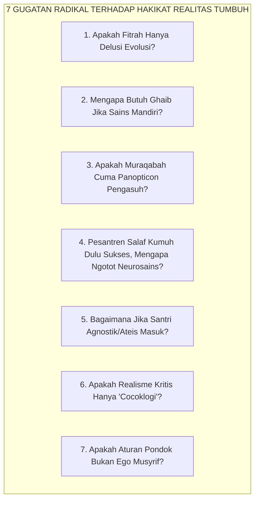
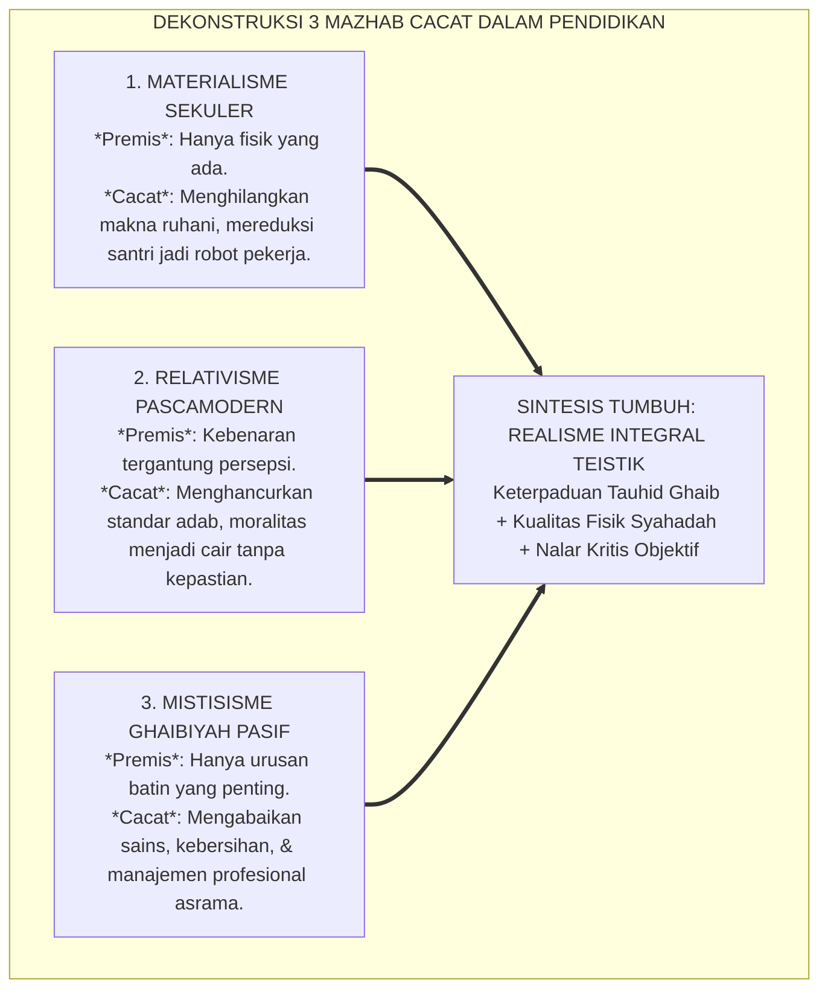
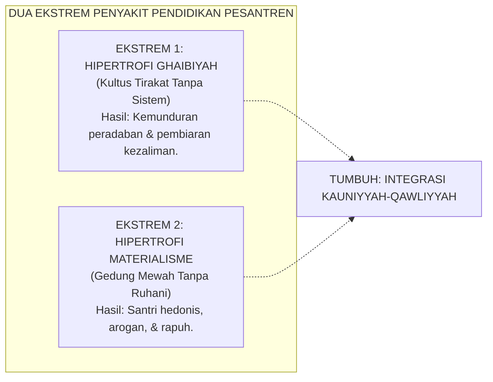

# P1-01-01-01: KAJIAN DIALEKTIKA INKUIRI, TANYA-JAWAB KRITIS, & ANALISIS SKENARIO REALITAS
## *Naskah Pendahulu (Inquiry Working Paper): Pergulatan Epistemik, Bedah "Mengapa & Bagaimana Jika", serta Dekonstruksi Asumsi Sebelum Perumusan Definisi Realitas (P1-01-01-01)*

**Nomor Identifikasi**: `P1-01-01-01/INKUIRI-DIALEKTIKA-REALITAS/2026`  
**Domain**: `01 Philosophy` > `01 Worldview` > `01 Hakikat Realitas`  
**Status Naskah**: *Foundational Dialectical Paper* (Naskah Inkuiri Radikal Sebelum Penarikan Kesimpulan Formal)  
**Dewan Pakar Pengkaji**: `pakar-filosofi-tumbuh`, `pakar-epistemologi-turats`, `pakar-penulis-monograf-tumbuh`, `pakar-kritikus-dan-auditor-kualitas`

---

## 📑 DAFTAR ISI DIALEKTIKA

1. [1. Urgensi Metodologis: Mengapa Harus Menggugat Sebelum Menyimpulkan?](#1-urgensi-metodologis-mengapa-harus-menggugat-sebelum-menyimpulkan)
2. [2. Sesi Tanya-Jawab Radikal & Gugatan Paling Kritis (*Al-Iradat wal-Ajwibah al-Jadzriyyah*)](#2-sesi-tanya-jawab-radikal--gugatan-paling-kritis-al-iradat-wal-ajwibah-al-jadzriyyah)
   - *Gugatan 1: Apakah 'Realitas Fitrah' Nyata, atau Hanya Konstruksi Sosial dan Delusi Evolusioner Otak?*
   - *Gugatan 2: Mengapa Memasukkan Alam Ghaib Jika Sains Modern Bisa Mendarat di Bulan Tanpa Variabel 'Malaikat'?*
   - *Gugatan 3: Bukankah Doktrin Muraqabatullah Hanyalah Panopticon Teologis untuk Menakut-nakuti Santri?*
   - *Gugatan 4: Jika Pesantren Salaf Dulu Kumuh Tapi Sukses Mencetak Ulama Besar, Mengapa TUMBUH Ngotot Membawa Neurosains & Sanitasi?*
   - *Gugatan 5: Bagaimana Jika Santri Bersikap Agnostik/Ateis Mutlak, Apakah Sistem Karakter TUMBUH Runtuh Total?*
   - *Gugatan 6: Apakah Realisme Kritis Teistik Hanya 'Cocoklogi' Akademis untuk Membenarkan Dogma Agama?*
   - *Gugatan 7: Bagaimana Membuktikan Bahwa Aturan Asrama Bukan Proyeksi Ego Kekuasaan Musyrif?*
3. [3. Bedah Kausalitas Epistemik: "Mengapa Ini, Mengapa Itu?" (*Root-Cause Anatomy*)](#3-bedah-kausalitas-epistemik-mengapa-ini-mengapa-itu-root-cause-anatomy)
   - *Mengapa Menolak Materialisme Radikal, Relativisme Pascamodern, dan Mistisisme Pasif Sekaligus?*
   - *Mengapa Hukum Moral Pesantren Bekerja dengan Kepastian Matematik Sebagaimana Hukum Gravitasi?*
4. [4. Pengujian Stres Skenario Ekstrem: "Bagaimana Jika Ini, Bagaimana Jika Itu?" (*Extreme Stress-Testing*)](#4-pengujian-stres-skenario-ekstrem-bagaimana-jika-ini-bagaimana-jika-itu-extreme-stress-testing)
   - *Skenario A: Bagaimana jika realitas digital simulakra (game/AI) membuat santri memandang dunia nyata tidak berharga?*
   - *Skenario B: Bagaimana jika ada kontradiksi nyata antara dalil zhahir naqli dengan temuan sains empiris di asrama?*
   - *Skenario C: Bagaimana jika kultur feodal asrama membungkus penindasan fisik atas nama 'tirakat dan ujian kesabaran'?*
5. [5. Dekonstruksi Patologi Paradigma Konvensional](#5-dekonstruksi-patologi-paradigma-konvensional)
6. [6. Mandat dan Jembatan Epistemik Menuju Modul Kesimpulan (P1-01-01-01)](#6-mandat-dan-jembatan-epistemik-menuju-modul-kesimpulan-p1-01-01-01)
7. [7. Glosarium dan Penjelasan Istilah Asing & Teknis](#7-glosarium-dan-penjelasan-istilah-asing--teknis)

---

### 1. Urgensi Metodologis: Mengapa Harus Menggugat Sebelum Menyimpulkan?

Sebuah kesimpulan filosofis tidak memiliki bobot ilmiah jika ia lahir dari **penerimaan dogmatis yang pasif (*taqlid 'ama*)**. Kebenaran sejati dalam epistemologi Islam (*Tahqiq*) hanya dapat dicapai setelah ide tersebut dihantam dengan pertanyaan-pertanyaan paling meragukan, paling skeptis, dan paling keras dari para penentangnya.

Jika Ekosistem TUMBUH ingin merumuskan definisi **Realitas** yang menjadi kiblat bagi ratusan ribu santri dan ribuan musyrif, kita tidak boleh berlindung di balik retorika kesalehan. Kita harus berani menaruh premis-premis dasar kita di atas meja bedah, membiarkan para pengkritik (materialis, saintis sekuler, relativis pascamodern, hingga kiai tradisionalis skeptis) melancarkan serangannya, lalu membuktikan mengapa posisi TUMBUH berdiri di atas kebenaran objektif yang kokoh.

---

### 2. Sesi Tanya-Jawab Radikal & Gugatan Paling Kritis (*Al-Iradat wal-Ajwibah al-Jadzriyyah*)

---

#### ❓ GUGATAN 1: *"Bagaimana jika apa yang Anda sebut 'Realitas Fitrah Suci' itu sebenarnya tidak pernah ada, melainkan hanya konstruksi sosial bahasa atau produk adaptasi evolusi biologis otak primata untuk bertahan hidup?"*

* **Serangan Kritis (Skeptisisme Radikal)**:  
  Sains materialistik dan filsuf naturalis menyatakan bahwa moralitas manusia (altruisme, kejujuran, rasa bersalah) bukan berasal dari perjanjian azali dengan Tuhan (*Alastu bi Rabbikum*), melainkan sekadar sisa-sisa mekanisme evolusi genetik (*selfish gene*) agar kelompok manusia tidak saling membunuh. Jika fitrah itu fiksi biologis, mengapa pesantren mendasarkan seluruh sistem pembinaannya pada ilusi tersebut?

* **Bedah Kausalitas & Jawaban Ilmiah TUMBUH**:  
  1. *Kebuntuan Reduksionisme Materialistik*: Jika moralitas dan kesadaran diri (*consciousness*) hanya reaksi kimia acak di otak, maka konsep keadilan, cinta, pengorbanan, dan kebenaran kehilangan makna objektifnya. Materialisme tidak mampu menjelaskan mengapa manusia rela mati demi mempertahankan prinsip keadilan yang secara biologis merugikan kelangsungan hidup fisiknya.  
  2. *Bukti Universalitas Kompas Moral*: Riset psikologi perkembangan anak (seperti studi *Yale Infant Cognition Center*) membuktikan bahwa bayi manusia berusia 3–6 bulan telah memiliki preferensi bawaan terhadap tindakan tolong-menolong dibanding agresi, jauh sebelum mereka diajari bahasa atau norma budaya. Ini membuktikan adanya cetak biru moral alami bawaan lahir—inilah yang dalam bahasa wahyu disebut **Fitrah al-Munazzalah**.  
  3. *Kesimpulan*: Fitrah bukan fiksi; ia adalah struktur kesadaran primer yang mendahului pengalaman empiris (*a priori spiritual structure*).

---

#### ❓ GUGATAN 2: *"Sains modern membuktikan peradaban bisa mendarat di bulan, membelah atom, dan mengobati penyakit tanpa memerlukan variabel 'Alam Ghaib' atau 'Malaikat'. Mengapa pendidikan karakter santri harus membebani diri dengan ontologi metafisik ghaib yang tidak bisa diukur di laboratorium?"*

* **Serangan Kritis (Saintisme Sekuler)**:  
  Mengapa kita tidak memakai psikologi terapan positif sekuler saja yang murni berbasis data empiris (CBT, modifikasi perilaku, neuroscience murni)? Mengapa harus ada domain ghaib (*'Alam al-Malakut*) yang abstrak dan tidak bisa diverifikasi secara empirik?

* **Bedah Kausalitas & Jawaban Ilmiah TUMBUH**:  
  1. *Kekeliruan Kategori Epistemik (Category Mistake)*: Menuntut agar entitas ghaib (seperti malaikat atau hisab akhirat) bisa ditimbang dengan timbangan fisika adalah kesalahan logika elementer. Alat ukur laboratorium dirancang untuk mengukur materi (*quantifiable physical properties*), bukan mengukur makna, intensi, ruh, atau Wujud Mutlak Pencipta materi itu sendiri.  
  2. *Kegagalan Saintisme dalam Menjawab "Mengapa Saya Harus Baik?"*: Sains empiris mampu menjelaskan *bagaimana* otak memproses empati (lewat neuron cermin / *mirror neurons*), tetapi sains empiris **tidak akan pernah mampu menjawab mengapa seseorang harus tetap jujur ketika ia punya kesempatan mencuri tanpa ada satu orang pun yang mengetahuinya**.  
  3. *Urgensi Ghaib bagi Integritas Santri*: Menghilangkan realitas ghaib berarti menghancurkan alasan ontologis tertinggi untuk berbuat adil saat sendirian. Tanpa ghaib, integritas runtuh menjadi transaksi kalkulatif: anak hanya taat jika ada pengawas fisik.

---

#### ❓ GUGATAN 3: *"Bukankah doktrin 'Pengawasan Malaikat dan Hisab Akhirat' (Muraqabatullah) hanyalah versi religius dari konsep penjara Panopticon (Jeremy Bentham / Foucault) yang sengaja dipasang untuk meneror psikologis santri agar mereka patuh dan mudah dikendalikan oleh pengurus pondok?"*

* **Serangan Kritis (Kritik Kuasa & Psikoanalisis)**:  
  Psikoanalisis kritis menuduh bahwa penanaman rasa bersalah atas dosa dan ancaman siksa kubur hanyalah alat dominasi struktural agar santri tidak memberontak terhadap otoritas pesantren.

* **Bedah Kausalitas & Jawaban Ilmiah TUMBUH**:  
  1. *Perbedaan Mendasar Panopticon vs. Muraqabah*:  
     * **Panopticon**: Pengawasan eksternal yang dingin, asimetris, berbasis paranoia, dan bertujuan melumpuhkan kehendak individu demi kepentingan sipir penjara.  
     * **Muraqabatullah**: Pengawasan berbasis cinta Ilahiah (*Rahman-Rahim*), di mana Allah yang mengawasi adalah Dzat yang Maha Menyayangi, Maha Mengampuni, dan selalu membuka pintu taubat.  
  2. *Dampak Neuro-Psikologis*: Panopticon feodal memicu *amigdala hyperactivity* (santri hidup dalam ketakutan kronis dan stres kortisol tinggi). Sebaliknya, Muraqabatullah yang diajarkan secara benar menumbuhkan **ketenangan eksistensial (*ithmi'nan al-qalb*)**, harga diri spiritual (*'izzah*), dan otonomi moral internal (*internal locus of control*).  
  3. *Kritik TUMBUH terhadap Praktik Lama*: TUMBUH justru mengutuk keras asatidz/musyrif yang memelintir konsep hisab Allah menjadi alat intimidasi dan teror emosional demi menutupi ketidakmampuan manajemen pengasuhan mereka.

---

#### ❓ GUGATAN 4: *"Pesantren-pesantren salaf zaman dahulu mencetak ratusan ulama besar, pejuang kemerdekaan, dan waliyullah dari bilik-bilik asrama yang kumuh, tidur di lantai tanpa kasur, makan nasi aking, dan terkena penyakit kulit (gudikan). Jika realitas fisik sebegitu pentingnya, mengapa ulama terdahulu bisa hebat tanpa neurosains, tanpa gizi seimbang, dan tanpa sanitasi modern? Apakah klaim TUMBUH ini bukan sekadar latah borjuis?"*

* **Serangan Kritis (Tradisionalisme Skeptis / Romantisme Masa Lalu)**:  
  Banyak kiai dan alumni pesantren merasa tersinggung jika sanitasi dan gizi dikaitkan dengan mutu adab dan keilmuan santri, dengan dalih bahwa penderitaan fisik adalah bagian dari *tirakat* dan barakah.

* **Bedah Kausalitas & Jawaban Ilmiah TUMBUH**:  
  1. *Bias Kelangsungan Hidup (Survivorship Bias)*: Kita hanya melihat segelintir santri jenius yang berhasil menjadi ulama besar di tengah kondisi kumuh masa lalu, namun kita menutup mata terhadap **ribuan santri lainnya yang gugur di tengah jalan**: putus pondok karena tipus, trauma mental akibat perpeloncoan, atau gagal menyerap ilmu karena malnutrisi kronis yang merusak konsentrasi kognitif.  
  2. *Hukum Sunnatullah Bersifat Universal*: Para ulama masa lalu berhasil bukan *karena* mereka sakit kulit atau kekurangan gizi, melainkan karena *kekuatan tekad ruhiyah luar biasa mereka yang mampu melampaui keterbatasan biologis saat itu*. Jika dalam kondisi serba terbatas saja mereka bisa menjadi ulama besar, bayangkan betapa dahsyatnya output generasi santri jika keagungan ruhiyah tersebut dipadukan dengan kesehatan neurobiologis optimal!  
  3. *Zuhud Hakiki vs. Kemalasan Tata Kelola*: Menelantarkan sanitasi dan gizi santri atas nama tirakat adalah kerancuan berpikir (*Safsathah*). Nabi Muhammad SAW adalah manusia paling zuhud, namun beliau adalah orang yang paling bersih, harum, memerintahkan kebersihan, dan melarang membiarkan tubuh dizalimi oleh penyakit.

---

#### ❓ GUGATAN 5: *"Bagaimana jika ada santri agnostik, skeptis radikal, atau tidak percaya hal ghaib yang dipaksa masuk pesantren oleh orang tuanya? Apakah seluruh sistem pembinaan karakter TUMBUH runtuh dan tidak berdaya membina anak tersebut?"*

* **Serangan Kritis (Uji Batas Sistem / Boundary Testing)**:  
  Jika seluruh premis TUMBUH bersandar pada keimanan akan alam ghaib, maka sistem ini akan gagal total saat berhadapan dengan santri yang mengalami krisis aqidah akut atau ateisme praktis.

* **Bedah Kausalitas & Jawaban Ilmiah TUMBUH**:  
  1. *Pintu Masuk Multi-Epistemologis*: TUMBUH tidak memaksakan dogma ghaib di hari pertama. Karena realitas memiliki domain *Syahadah* (empiris) dan *Akal Sehat* (*Nazhar Aqli*), santri skeptis diajak berdialog melalui pintu gerbang rasional dan observasi ilmiah:  
     * Mengamati keteraturan mikrobiologi dan neurobiologi tubuhnya sendiri (*Burhan al-Anfus*).  
     * Merasakan secara langsung pengalaman keadilan restoratif, kehangatan empati musyrif, dan logika sebab-akibat dari hukum adab sosial di asrama.  
  2. *Aktivasi Fitrah Lewat Keteladanan Nyata*: Skeptisisme santri remaja sering kali bukan karena masalah intelektual murni, melainkan **luka afektif akibat hipokrisi orang dewasa** di sekitarnya. Ketika ia melihat musyrif yang adil, jujur, tidak pernah memukul, dan konsisten antara ucapan dan perbuatan, akal budinya akan luluh dan fitrah spiritualnya yang tertutup akan kembali terbuka secara organik.

---

#### ❓ GUGATAN 6: *"Apakah istilah 'Realisme Kritis Teistik' yang diusung TUMBUH ini bukan sekadar istilah keren buatan para akademisi untuk mencocok-cocokkan (cocoklogi) antara ayat Al-Qur'an dengan teori filsafat Barat agar pesantren terlihat intelek?"*

* **Serangan Kritis (Kritik Epistemik & Orisinalitas)**:  
  Tuduhan sinkretisme pemikiran: mencampuradukkan kalam Islam dengan epistemologi Roy Bhaskar / filsafat Barat.

* **Bedah Kausalitas & Jawaban Ilmiah TUMBUH**:  
  1. *Akar Asli Turats Islam*: Ribuan tahun sebelum istilah *Critical Realism* lahir di Barat, para imam Ahlussunnah (Imam Al-Maturidi dalam *Kitab at-Tawhid*, Imam Al-Ghazali dalam *Tahafut al-Falasifah*, dan Ibn Taimiyyah dalam *Dar' Ta'arudh al-'Aql wan-Naql*) telah merumuskan bahwa realitas alam semesta itu nyata, dapat diketahui secara objektif melalui akal dan indera, namun tunduk di bawah kekuasaan mutlak Allah SWT.  
  2. *Islamisasi Ilmu yang Kritis*: TUMBUH tidak menjiplak filsafat Barat. TUMBUH menggunakan terminologi filsafat kontemporer sebagai bahasa komunikasi global (*Lisan al-Qaum*) untuk membuktikan bahwa khazanah Islam memiliki ketahanan epistemik yang jauh melampaui materialisme Barat.

---

#### ❓ GUGATAN 7: *"Banyak musyrif dan pengurus pondok mengklaim aturan tata tertib asrama mereka sebagai 'hukum Allah', padahal isinya pasal-pasal konyol untuk melanggengkan kenyamanan senior dan kemalasan musyrif. Bagaimana sistem TUMBUH membuktikan bahwa aturan disiplinnya bukan proyeksi ego pengasuh?"*

* **Serangan Kritis (Kritik Otoriterisme & Feodalisme Asrama)**:  
  Penyalahgunaan dalil adab untuk memaksakan aturan sewenang-wenang tanpa dasar maslahat nyata.

* **Bedah Kausalitas & Jawaban Ilmiah TUMBUH**:  
  1. *Uji Maqashid Syari'ah & Data PBIS*: Di pesantren TUMBUH, tidak ada satu pun aturan tata tertib yang boleh dibuat berdasarkan selera pribadi kiai atau musyrif. Setiap aturan wajib lolos dua uji kelayakan mutlak:  
     * **Uji Maqashid**: Apakah aturan ini terbukti melindungi 5 kebutuhan pokok (*Hifzh ad-Din, an-Nafs, al-'Aql, an-Nasl, al-Mal*)?  
     * **Uji Empiris (Data PBIS)**: Apakah aturan ini secara faktual menurunkan insiden kekerasan dan meningkatkan kenyamanan belajar santri, ataukah hanya melahirkan kepatuhan semu?  
  2. *Transparansi & Akuntabilitas Terbuka*: Jika suatu aturan terbukti menimbulkan kezaliman, stres destruktif, atau merendahkan martabat santri, maka aturan tersebut secara otomatis batal demi hukum ontologis Islam!

---

### 3. Bedah Kausalitas Epistemik: "Mengapa Ini, Mengapa Itu?" (*Root-Cause Anatomy*)

#### Mengapa Hukum Moral Pesantren Bekerja dengan Kepastian Matematis Sebagaimana Hukum Gravitasi?
* Jika seorang anak melompat dari lantai tiga asrama, ia akan jatuh dan patah tulang karena hukum gravitasi alam syahadah bekerja secara objektif tanpa memandang niat anak tersebut.
* Dalam ontologi TUMBUH, **hukum moral adab bekerja dengan kepastian yang sama persis**:  
  Ketika musyrif membentak santri dengan caci maki di depan umum, secara biologis sistem saraf santri melepaskan hormon kortisol yang merusak koneksi sinaps di otak prefrontal, dan secara spiritual kalbu kedua belah pihak terhijab dari cahaya Allah. Kerusakan ini terjadi secara objektif dan pasti, tidak peduli musyrif berdalih "saya marah demi mendidik".

---

### 4. Pengujian Stres Skenario Ekstrem: "Bagaimana Jika Ini, Bagaimana Jika Itu?" (*Extreme Stress-Testing*)

| Kode Skenario | Skenario Ekstrem Lapangan | Dampak Jika Salah Menangani (Pendekatan Primitif) | Analisis Akar Masalah Ontologis | Resolusi & Solusi Sistemik TUMBUH |
| :---: | :--- | :--- | :--- | :--- |
| **ST-01** | **Santri kecanduan game/dunia virtual hingga menganggap ibadah dan kehidupan nyata di asrama tidak ada artinya (*Disonansi Simulakra*).** | Menyita gadget dengan makian, menghukum santri lari lapangan 50 putaran, dan mencap santri "anak durhaka". | Santri mengalami kehampaan makna di dunia nyata karena lingkungan asrama kering interaksi emosional dan membosankan dibanding stimulasi instan virtual. | Menata ekosistem asrama menjadi *Bi'ah Shalihah* yang kaya interaksi, menantang secara kognitif, dan menghadirkan koneksi emosional hangat dari musyrif yang mengalahkan daya tarik virtual. |
| **ST-02** | **Terjadi wabah penyakit menular (misal: scabies/cacar) di asrama santri.** | Kiai menyatakan: *"Ini ujian tirakat dari Allah, semakin gatal semakin gugur dosa-dosanya."* | Kerancuan fatalistik: memisahkan hukum sebab-akibat kesehatan fisik dari perintah agama untuk hidup bersih. | Menerapkan protokol isolasi medis, sterilisasi asrama secara ilmiah, dan perbaikan sanitasi total sebagai wujud nyata ketaatan pada Sunnatullah fisik. |
| **ST-03** | **Santri senior melakukan tradisi 'sidang malam' dan pemukulan fisik kepada junior dengan dalih 'menegakkan adab dan mental baja'.** | Pengurus membiarkan dengan alasan: *"Dulu kami juga digembleng seperti ini dan terbukti mental kami kuat."* | Distorsi adab: normalisasi kekerasan feodal yang menginjak-injak kehormatan manusiawi (*Karamah Insaniyyah*). | Membasmi total tradisi perpeloncoan, mencabut hak penindakan fisik dari tangan santri senior, dan menegakkan hukum disiplin restoratif multi-tier PBIS. |

---

### 5. Dekonstruksi Patologi Paradigma Konvensional

---

### 6. Mandat dan Jembatan Epistemik Menuju Modul Kesimpulan (P1-01-01-01)

Setelah melalui proses inkuiri radikal, bantahan skeptis, dan uji stres kasus lapangan di atas, kita sampai pada kesimpulan yang tak tergoyahkan bahwa **Definisi Realitas** tidak boleh dirumuskan secara parsial atau sembarangan.

Kajian ini memberikan **Tiga Mandat Epistemik Mutlak** bagi perumusan dokumen formal [**`P1-01-01-01-Definisi-Realitas.md`**](file:///c:/xampp/htdocs/tumbuh/01%20Philosophy/01%20Worldview/P1-01-01-01-Definisi-Realitas.md):

1. **Mandat Keberadaan Objektif (*Objective Existence*)**: Realitas adab, fitrah, dan hukum syariat berwujud nyata dan independen dari opini subjek manusia.
2. **Mandat Integrasi Total (*Integral Dual-Domain*)**: Pendidikan pesantren wajib menyatukan kesadaran Alam Ghaib (*Muraqabatullah*) dengan kepatuhan pada Sunnatullah Alam Syahadah (kesehatan neurobiologis dan sanitasi lingkungan).
3. **Mandat Perlindungan Martabat (*Inviolable Human Dignity*)**: Santri adalah mutiara fitrah yang haram dinistakan fisiknya maupun jiwanya atas nama dalih pengasuhan apa pun.

---

### 7. Glosarium dan Penjelasan Istilah Asing & Teknis

| No | Istilah / Terminologi | Asal Bahasa | Penjelasan Konseptual & Kontekstual |
| :---: | :--- | :---: | :--- |
| 1 | **Al-Iradat wal-Ajwibah al-Jadzriyyah** | Arab (*الإيرادات والأجوبة الجذرية*) | Dialektika tanya-jawab tingkat mendasar/radikal yang membongkar asumsi filosofis hingga ke akar-akarnya. |
| 2 | **A Priori Structure** | Latin / Filsafat Kant | Struktur pengetahuan atau kesadaran bawaan yang telah ada dalam diri manusia sebelum adanya pengalaman indrawi (sepadan dengan konsep *Fitrah*). |
| 3 | **Selfish Gene / Naturalisme** | Inggris (Biologi Evolusi) | Teori biologi sekuler yang menyatakan bahwa seluruh perilaku organisme (termasuk manusia) semata-mata digerakkan oleh dorongan gen untuk bertahan hidup. |
| 4 | **Category Mistake** | Inggris (Filsafat Bahasa - Ryle) | Kesalahan logika berupa mencampuradukkan kategori konsep (misal: menuntut agar keadilan atau malaikat bisa ditimbang dengan kilogram). |
| 5 | **Panopticon** | Inggris / Prancis (Bentham & Foucault) | Desain penjara melingkar di mana narapidana merasa diawasi terus-menerus oleh menara pengawas tak terlihat, menciptakan paranoia kepatuhan. |
| 6 | **Internal Locus of Control** | Inggris (Psikologi) | Keyakinan seseorang bahwa ia memiliki kendali atas tindakan dan nasib moralnya sendiri, bukan semata korban keadaan eksternal. |
| 7 | **Survivorship Bias** | Inggris (Statistik) | Kesalahan berpikir logis di mana seseorang hanya mengambil kesimpulan dari individu yang berhasil melewati suatu kondisi buruk, sambil mengabaikan mayoritas yang gagal/hancur. |
| 8 | **Safsathah / Falasi Logika** | Arab / Yunani (*Sophistry*) | Kerancuan berpikir atau argumen keliru yang tampak benar di permukaan namun menyesatkan secara metodologis. |
| 9 | **Disonansi Simulakra** | Prancis (Jean Baudrillard) | Keterpecahan psikologis di mana seseorang lebih mempercayai dan menikmati realitas tiruan (dunia maya/game) daripada dunia nyata fisik di sekitarnya. |
| 10 | **Burhan al-Anfus** | Arab (*برهان الأنفس*) | Pembuktian kebenaran Tuhan melalui penelaahan mendalam terhadap keajaiban sistem biologis dan psikologis diri manusia (merujuk QS. Fussilat: 53). |
| 11 | **Karamah Insaniyyah** | Arab (*كرامة إنسانية*) | Kemuliaan dan martabat asasi manusia yang dianugerahkan langsung oleh Allah SWT dan tidak boleh dirampas oleh siapa pun (QS. Al-Isra': 70). |
| 12 | **Taqlid 'Ama** | Arab (*تقليد أعمى*) | Kepatuhan atau penerimaan buta terhadap suatu doktrin tanpa memahami dalil, alasan ilmiah, dan pertanggungjawaban rasionalnya. |
