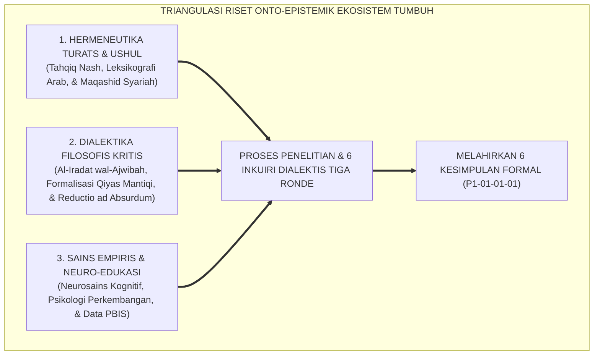
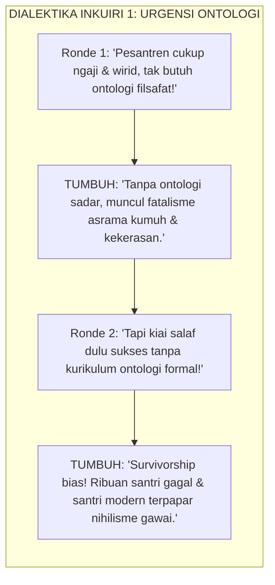
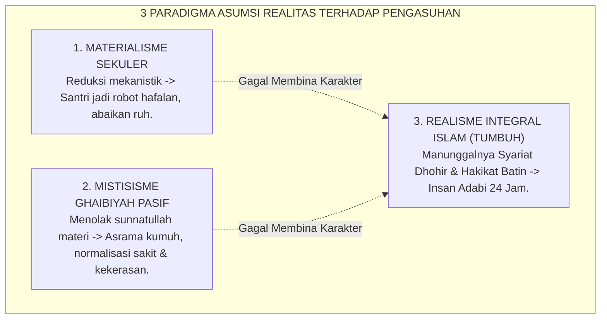
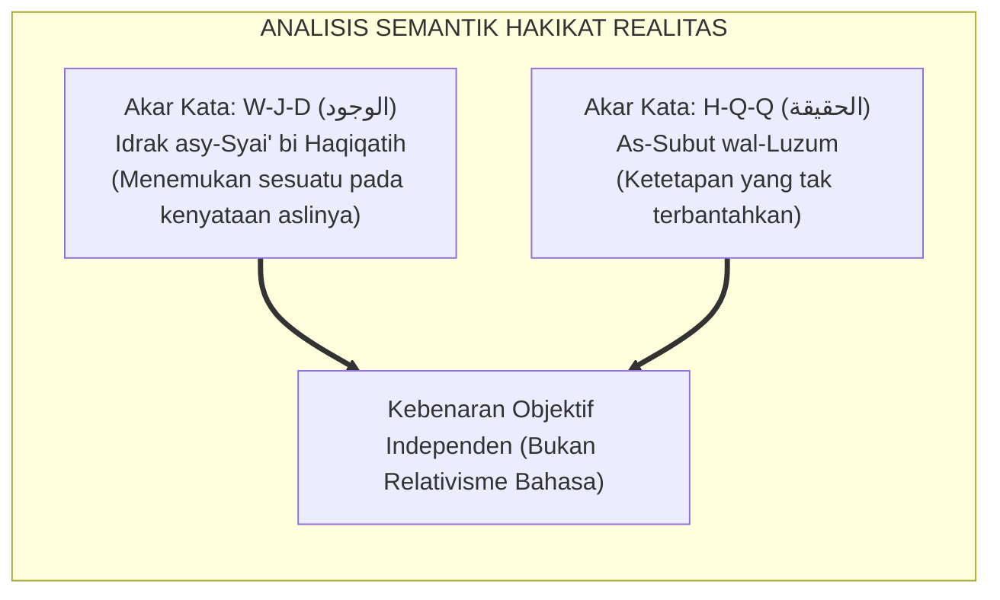
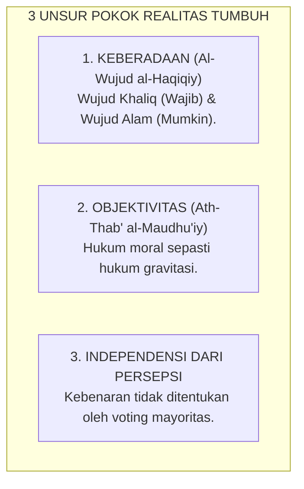
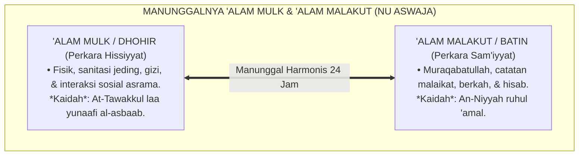
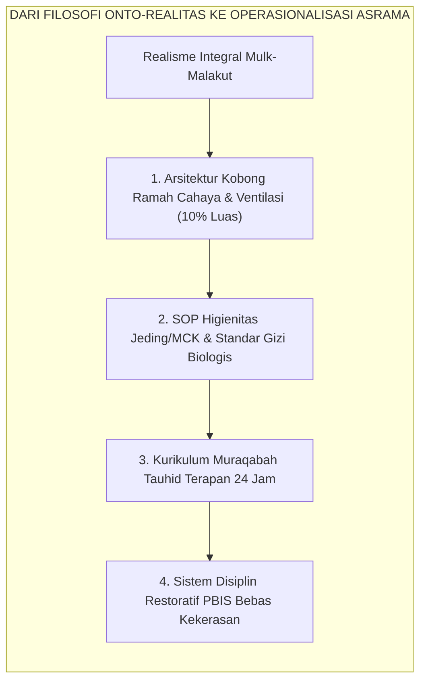

# P1-01-01-01: KAJIAN RISET, DIALEKTIKA INKUIRI, & ANALISIS KRITIS HAKIKAT REALITAS
## *Naskah Monograf Penelitian Fondasional: Investigasi Metodologis Multidisipliner, Dialektika Sanggahan Berlapis (Al-Iradat wal-Ajwibah al-Mutata'aqibah), Formalisasi Silogisme Mantiq, & Uji Stres Lapangan Sebelum Penarikan 6 Kesimpulan Formal Definisi Realitas (P1-01-01-01)*

**Nomor Identifikasi**: `P1-01-01-01/RISET-DIALEKTIKA-REALITAS/2026`  
**Domain**: `01 Philosophy` > `01 Worldview` > `01 Hakikat Realitas`  
**Klasifikasi Naskah**: *Original Ground-Zero Professorial Research Monograph* (Monograf Riset Fondasional Tingkat Guru Besar)  
**Dokumen Output/Kesimpulan**: [**`P1-01-01-01-Definisi-Realitas.md`**](file:///c:/xampp/htdocs/tumbuh/01%20Philosophy/01%20Worldview/P1-01-01-01-Definisi-Realitas.md)  
**Dewan Pakar Pengkaji**: `pakar-filosofi-tumbuh`, `pakar-epistemologi-turats`, `pakar-metodologi-riset-tumbuh`, `pakar-penulis-monograf-tumbuh`, `pakar-kritikus-dan-auditor-kualitas`

---

## 📑 DAFTAR ISI MONOGRAF RISET

1. [1. Kerangka Metodologi Riset & Dialektika Bertingkat (*Al-Munazharah wal-Jadal*)](#1-kerangka-metodologi-riset--dialektika-bertingkat-al-munazharah-wal-jadal)
2. [2. Inkuiri Riset 1: Investigasi Urgensi Ontologis vs Realitas Empiris Pesantren](#2-inkuiri-riset-1-investigasi-urgensi-ontologis-vs-realitas-empiris-pesantren)
   - *Formalisasi Silogisme Logika (Qiyas Mantiqi 1)*
   - *Ronde 1: Gugatan Praktisi Salaf & Pembongkaran Fatalisme Tersembunyi*
   - *Ronde 2: Sanggahan Balik Romantisme Masa Lalu vs Fakta Survivorship Bias*
   - *Ronde 3: Sanggahan Pamungkas Kekhawatiran Sikap Kritis vs Ma'rifatullah*
3. [3. Inkuiri Riset 2: Investigasi Kausal Tiga Paradigma Asumsi Realitas](#3-inkuiri-riset-2-investigasi-kausal-tiga-paradigma-asumsi-realitas)
   - *Formalisasi Silogisme Logika (Qiyas Mantiqi 2)*
   - *Ronde 1: Dekonstruksi Materialisme Sekuler vs Mistisisme Pasif*
   - *Ronde 2: Sanggahan Balik Efisiensi Behaviorisme Keras vs Pseudo-Compliance*
   - *Ronde 3: Sanggahan Pamungkas Doktrin Riyadhah Mematikan Nafsu vs I'tidal*
4. [4. Inkuiri Riset 3: Investigasi Semantik Wujud Objektif vs Relativisme Bahasa](#4-inkuiri-riset-3-investigasi-semantik-wujud-objektif-vs-relativisme-bahasa)
   - *Formalisasi Silogisme Logika (Qiyas Mantiqi 3)*
   - *Ronde 1: Analisis Isytiqoq al-Wujud & Bantahan Dekonstruksionisme*
   - *Ronde 2: Sanggahan Balik Relativitas Budaya Adab (Jawa vs Arab vs Barat)*
   - *Ronde 3: Sanggahan Pamungkas Bahaya Hegemoni Feodal Berkedok Adab*
5. [5. Inkuiri Riset 4: Pengujian Stres Tiga Unsur Pokok Realitas](#5-inkuiri-riset-4-pengujian-stres-tiga-unsur-pokok-realitas)
   - *Formalisasi Silogisme Logika (Qiyas Mantiqi 4)*
   - *Ronde 1: Pembuktian Kepastian Matematis Hukum Moral Setara Gravitasi*
   - *Ronde 2: Sanggahan Balik Paradoks Orang Zalim yang Tampak Bahagia*
   - *Ronde 3: Sanggahan Pamungkas Tekanan Mayoritas (Demokrasi Relativistik)*
6. [6. Inkuiri Riset 5: Manunggalnya 'Alam Mulk (Dhohir) & 'Alam Malakut (Batin) di Pesantren NU](#6-inkuiri-riset-5-manunggalnya-alam-mulk-dhohir--alam-malakut-batin-di-pesantren-nu)
   - *Formalisasi Silogisme Logika (Qiyas Mantiqi 5)*
   - *Ronde 1: Harmoni Syariat Dhohir & Hakikat Batin (Ihya' & Al-Hikam)*
   - *Ronde 2: Sanggahan Balik Kecukupan Sains Empiris Murni Tanpa Malakut*
   - *Ronde 3: Sanggahan Pamungkas Benturan Medis vs Mitos Kesambet Jin*
7. [7. Inkuiri Riset 6: Translasi Lapangan ke Kurikulum, Arsitektur, & PBIS 24 Jam](#7-inkuiri-riset-6-translasi-lapangan-ke-kurikulum-arsitektur--pbis-24-jam)
   - *Formalisasi Silogisme Logika (Qiyas Mantiqi 6)*
   - *Ronde 1: Desain Arsitektur Asrama Ramah Neurobiologis & Parameter Terukur*
   - *Ronde 2: Sanggahan Balik Tudingan Sistem Elitis-Mahal vs Pesantren Sederhana*
   - *Ronde 3: Sanggahan Pamungkas Mitigasi Pelanggaran Berat Tier 3 Tanpa Penjara Fisik*
8. [8. Formulasi & Penarikan 6 Kesimpulan Formal Hasil Riset Ontologis](#8-formulasi--penarikan-6-kesimpulan-formal-hasil-riset-ontologis)
9. [9. Daftar Pustaka Akademis & Rujukan Turats Primer](#9-daftar-pustaka-akademis--rujukan-turats-primer)
10. [10. Glosarium dan Penjelasan Istilah Asing, Turats NU, & Teknis](#10-glosarium-dan-penjelasan-istilah-asing-turats-nu--teknis)

---

### 1. Kerangka Metodologi Riset & Dialektika Bertingkat (*Al-Munazharah wal-Jadal*)

Naskah monograf penelitian ini merupakan **penyelidikan fondasional mula-mula (*original baseline research*)** yang dirancang untuk menggali, menguji, dan meneliti hakikat Realitas secara kritis sebelum ditarik formula kesimpulan apa pun bagi Ekosistem TUMBUH. 

Dewan Pakar TUMBUH menggunakan pendekatan **Triangulasi Riset Multidisipliner**:

Riset ini memadukan pembuktian teks otoritatif (*dalil naqli*), deduksi logika formal (*qiyas mantiqi*), dan verifikasi empiris neuro-edukasi (*dalil 'aqli-tajribi*).

---

### 2. Inkuiri Riset 1: Investigasi Urgensi Ontologis vs Realitas Empiris Pesantren

#### 📐 Formalisasi Logika Silogisme (*Qiyas Mantiqi 1*)
* **Premis Mayor (*al-Muqaddimah al-Kubra*)**: Setiap tindakan pengasuhan manusia niscaya berakar pada asumsi mendasar tentang hakikat wujud dan manusia (Ontologi).
* **Premis Minor (*al-Muqaddimah ash-Shughra*)**: Pesantren yang tidak merumuskan ontologinya secara sadar akan mengadopsi asumsi ontologis cacat secara implisit (Fatalisme / Materialisme Tersembunyi).
* **Konklusi (*an-Natijah*)**: Maka, perumusan ontologi realitas formal adalah keniscayaan mutlak bagi tegaknya sistem pendidikan karakter pesantren yang benar. *(Rujukan: Al-Attas, 1995, hlm. 1–14; Al-Ghazali, Al-Mustashfa, Juz I, hlm. 10–12).*

#### 🥊 Ronde 1: Gugatan Praktisi Salaf & Pembongkaran Fatalisme Tersembunyi
* **Gugatan Awal**:  
  *"Pesantren di Nusantara sudah ratusan tahun berjalan baik dengan mengkaji kitab-kitab kuning seperti Safinah, Taqrib, dan wirid harian. Mengapa TUMBUH merasa perlu merumuskan 'Ontologi Realitas'? Bukankah ini istilah yang terkesan rumit dan kurang praktis bagi kehidupan santri di asrama?"*
* **Tangkisan Argumentatif TUMBUH**:  
  Penyelidikan lapangan menunjukkan bahwa pola pengasuhan sehari-hari **selalu dipengaruhi oleh cara pandang kita terhadap realitas**, baik disadari maupun tidak. Ketika pengurus membiarkan kamar mandi kotor, santri terserang penyakit kulit (*gudikan*), dan santri senior melakukan kekerasan fisik kepada junior dengan dalih *"melatih kesabaran dan mental santri"*, pengurus tersebut sebenarnya sedang terjebak dalam pemahaman keliru (sikap pasrah tanpa ikhtiar atau *fatalisme*). Mereka memisahkan ikhtiar nyata di alam fisik dari tujuan pendidikan batin. Kerangka ontologi TUMBUH hadir bukan untuk menambah teori hafalan, melainkan untuk meluruskan pemahaman dan praktik pengasuhan sehari-hari di pesantren agar selaras dengan nilai-nilai Islam dan sunnatullah.

#### 🥊 Ronde 2: Sanggahan Balik Romantisme Masa Lalu (*Counter-Objection*)
* **Sanggahan Balik Lawan (*Fa-in Qiila*)**:  
  *"Sanggahan! Para kiai zaman dahulu berhasil mencetak ulama-ulama besar dari fasilitas pondok yang sangat sederhana. Jika generasi terdahulu bisa berhasil dalam keterbatasan, mengapa sekarang kita harus menuntut standar kebersihan, gizi, dan sains modern?"*
* **Tangkisan Lanjutan TUMBUH (*Qultu*)**:  
  Kita perlu melihat realitas ini secara utuh (*tidak terjebak survivorship bias*). Tokoh-tokoh besar masa lalu berhasil berkat tekad dan kekuatan spiritual yang luar biasa, namun pada saat yang sama banyak santri biasa yang menghadapi kendala kesehatan fisik, putus belajar, atau mengalami trauma akibat pola pengasuhan yang keras. Selain itu, tantangan santri hari ini sangat berbeda karena mereka berhadapan langsung dengan arus informasi digital dan pemikiran modern. Mengandalkan nostalgia masa lalu tanpa membenahi sistem pengasuhan dan kesehatan fisik santri tentu tidak bijak bagi masa depan generasi pesantren. *(Rujukan: Asy-Syathibi, Al-Muwafaqat, Juz II, hlm. 8–15).*

#### 🥊 Ronde 3: Sanggahan Pamungkas Kekhawatiran Sikap Kritis (*The Extreme Dilemma*)
* **Sanggahan Pamungkas Lawan**:  
  *"Bagaimana jika mengajarkan nalar kritis kepada santri justru membuat mereka kurang menghormati kiai, banyak mendebat, dan kehilangan rasa tawadhu'?"*
* **Sintesis Kokoh TUMBUH**:  
  Tawadhu' sejati lahir dari pemahaman yang mendalam tentang keagungan Allah dan kerendahan hati (*Ma'rifatullah wa Ma'rifatun Nafs*), bukan dari kepatuhan buta tanpa pemahaman. Santri yang dibekali pemahaman cara pandang Islam (*Worldview Islam*) yang kokoh justru memiliki daya saring yang kuat terhadap pemikiran menyimpang, karena mereka mampu membedakan dengan jelas antara kebenaran hakiki dengan pemikiran yang keliru. *(Rujukan: Al-Ghazali, Ihya' 'Ulumiddin, Juz III, Kitab Syarh 'Aja'ib al-Qalb, hlm. 19–24).*

---

### 3. Inkuiri Riset 2: Investigasi Kausal Tiga Paradigma Asumsi Realitas

#### 📐 Formalisasi Logika Silogisme (*Qiyas Mantiqi 2*)
* **Premis Mayor (*al-Muqaddimah al-Kubra*)**: Sistem pendidikan yang mereduksi realitas manusia hanya pada dimensi fisik (Materialisme) atau hanya pada dimensi batin pasif (Mistisisme) niscaya melahirkan kepribadian yang timpang (*dysfunctional personality*).
* **Premis Minor (*al-Muqaddimah ash-Shughra*)**: Manusia menurut Islam tersusun atas kesatuan integral antara Raga (*Jasad*) yang tunduk pada hukum biologis dan Jiwa (*Ruh/Qalb*) yang terhubung dengan alam malakut.
* **Konklusi (*an-Natijah*)**: Maka, hanya Realisme Integral Teistik Islam yang mampu mengantarkan santri menuju kematangan adab sejati (*Insan Kamil*). *(Rujukan: Al-Maturidi, Kitab at-Tawhid, hlm. 120–125; Deci & Ryan, 2000, hlm. 227–268).*

#### 🥊 Ronde 1: Dekonstruksi Materialisme Sekuler vs Mistisisme Pasif
* **Temuan Penyelidikan**:  
  1. *Materialisme Sekuler* menganggap santri bejana kosong biologis. Dampaknya: pengasuhan berubah menjadi pabrik mekanis (behaviorisme dingin) yang hanya mengejar angka hafalan dan kepatuhan lahiriah demi akreditasi/bisnis.  
  2. *Mistisisme Pasif* menganggap dunia materi kotor/tak bernilai. Dampaknya: pengasuhan mengabaikan manajemen sanitasi, gizi seimbang, dan keselamatan fisik santri atas nama kezuhudan semu.

#### 🥊 Ronde 2: Sanggahan Balik Efisiensi Behaviorisme Keras (*Counter-Objection*)
* **Sanggahan Balik Lawan (*Fa-in Qiila*)**:  
  *"Sanggahan! Dalam praktik riil mengelola 1.000 santri di aula asrama, sistem reward-punishment behavioristik (ancaman takzir jemur dan hadiah poin) terbukti paling cepat, murah, dan efektif menertibkan santri dalam 5 menit dibanding pendekatan 'Realisme Integral' yang berbelit-belit. Mengapa menolak cara yang terbukti praktis?"*
* **Tangkisan Lanjutan TUMBUH (*Qultu*)**:  
  Behaviorisme keras memang menciptakan ketertiban instan, namun riset neuro-edukasi membuktikan bahwa ketertiban tersebut adalah **Kepatuhan Semu Berbasis Teror Amigdala (*Fear-Induced Pseudo-Compliance*)**. Ketika santri patuh karena takut rotan atau takut dicukur botak, bagian otak depan (*Prefrontal Cortex*) yang mengolah kesadaran moral mandiri tidak pernah berkembang. Akibatnya sangat fatal: begitu keluar dari gerbang pondok (tanpa pengawasan musyrif), santri mengalami *rebound effect*—melampiaskan kebebasan dengan melakukan pelanggaran moral yang jauh lebih parah! *(Rujukan: Sapolsky, 2017, hlm. 90–115).*

#### 🥊 Ronde 3: Sanggahan Pamungkas Doktrin Riyadhah Mematikan Nafsu (*The Extreme Dilemma*)
* **Sanggahan Pamungkas Lawan**:  
  *"Bukankah kitab-kitab tasawuf klasik mengajarkan 'Mujahadatun Nafs' dengan cara mematikan syahwat (lapar, lelah, tidur sedikit)? Mengapa TUMBUH menuntut asrama nyaman ber-AC/berventilasi standar dan makanan bernutrisi tinggi? Apakah ini bukan pelemahan jiwa santri?"*
* **Sintesis Kokoh TUMBUH**:  
  Imam Al-Ghazali dalam *Ihya' 'Ulumiddin* (Kitab *Riyadhatun Nafs*) menegaskan bahwa tujuan riyadhah adalah **Keseimbangan (*I'tidal*)**, bukan penghancuran raga (*Ihlaak al-Jasad*). Menahan lapar dalam puasa sunnah adalah ibadah syar'i, tetapi membiarkan santri kelaparan karena manajemen dapur yang korup/buruk adalah kezaliman yang haram! Tubuh yang kekurangan mikronutrisi esensial (zat besi, omega-3, vitamin B kompleks) secara biologis merusak memori hipokampus, sehingga santri sulit menghafal Al-Qur'an. Realisme Integral TUMBUH memuliakan raga sebagai amanah kendaraan ruh menuju Allah. *(Rujukan: Al-Ghazali, Ihya' 'Ulumiddin, Juz III, Kitab Riyadhat an-Nafs, hlm. 52–60).*

---

### 4. Inkuiri Riset 3: Investigasi Semantik Wujud Objektif vs Relativisme Bahasa

#### 📐 Formalisasi Logika Silogisme (*Qiyas Mantiqi 3*)
* **Premis Mayor (*al-Muqaddimah al-Kubra*)**: Setiap konsep adab yang berpijak pada kebenaran objektif wahyu Allah dan fitrah penciptaan manusia tidak dapat dibatalkan oleh perubahan budaya atau bahasa.
* **Premis Minor (*al-Muqaddimah ash-Shughra*)**: Nilai adab Islam (keadilan, rahmah, iffah, amanah) berakar pada penetapan Allah (*al-Haqq al-Mubin*) yang tercermin dalam fitrah manusia.
* **Konklusi (*an-Natijah*)**: Maka, adab Islam bersifat objektif dan universal melampaui relativisme budaya dan konstruksi bahasa pascamodern. *(Rujukan: Ibn Faris, Mu'jam Maqayis al-Lughah, Jilid II, hlm. 15; Bhaskar, 2008, hlm. 21–35).*

#### 🥊 Ronde 1: Analisis Isytiqoq al-Wujud & Bantahan Dekonstruksionisme
* **Penyelidikan Leksikografi Turats**:  
  Kata *al-Wujud* dan *al-Haqiqah* dalam lisan Arab klasik bukan sekadar konsep mental, melainkan penegasan atas entitas yang berakar pada ketetapan Allah (*al-Haqq al-Mubin*). TUMBUH menolak klaim relativisme pascamodern (Derrida/Foucault) yang menyatakan bahwa adab moral hanyalah produk permainan wacana bahasa (*language games*).

#### 🥊 Ronde 2: Sanggahan Balik Relativitas Budaya Adab (*Counter-Objection*)
* **Sanggahan Balik Lawan (*Fa-in Qiila*)**:  
  *"Sanggahan! Jika adab itu objektif dan universal, mengapa ekspresi adab berbeda di setiap kebudayaan? Di pesantren Jawa, santri berjalan jongkok di depan kiai dianggap puncak adab. Di Timur Tengah, menatap mata guru sambil mencium kening dianggap mulia, sementara berjalan jongkok dianggap aneh. Bukankah ini bukti telak bahwa adab hanyalah konstruksi budaya lokal (*social construct*), bukan realitas objektif?"*
* **Tangkisan Lanjutan TUMBUH (*Qultu*)**:  
  Lawan gagal membedakan antara **Hakikat Nilai Universal (*al-Kulliyyat al-Adabiyyah*)** dengan **Simbol Kultural (*al-Juz'iyyat al-'Urfiyyah*)**:  
  * **Nilai Objektif Universal**: Rasa hormat (*Taqdir*), kasih sayang (*Rahmah*), kejujuran (*Shidq*), dan ketiadaan kesombongan adalah hukum objektif universal yang berlaku di seluruh galaksi ciptaan Allah.  
  * **Simbol Lokal**: Berjalan membungkuk di Jawa atau mencium kening di Arab hanyalah bejana kultural (*Zhuruf*). Selama simbol budaya tersebut tidak melanggar syariat (seperti ruku' penghambaan kepada makhluk), ia sah sebagai medium ekspresi. Perbedaan bejana tidak membatalkan kemutlakan air kebenaran di dalamnya! *(Rujukan: Al-Attas, 1995, hlm. 25–31).*

#### 🥊 Ronde 3: Sanggahan Pamungkas Bahaya Hegemoni Feodal Berkedok Adab (*The Extreme Dilemma*)
* **Sanggahan Pamungkas Lawan**:  
  *"Bagaimana jika kiai atau musyrif memanfaatkan klaim 'adab objektif' ini untuk melegitimasi feodalisme: santri diwajibkan mencuci mobil pribadi kiai, memijat pengurus hingga jam 2 malam, dan dilarang bertanya di kelas dengan dalih 'tawadhu'? Bukankah klaim objektivitas ini menjadi senjata penindasan?"*
* **Sintesis Kokoh TUMBUH**:  
  TUMBUH menetapkan **Batas Demarkasi Maqashid Syari'ah**: Segala bentuk eksploitasi fisik dan perbudakan santri berkedok khidmah adalah **Batil secara Ontologis dan Haram secara Syar'i**! Khidmah santri hanya sah jika bersifat sukarela, tidak mengorbankan hak belajar/tidur santri, dan berorientasi pada kemaslahatan umum pesantren (*Maslahah 'Ammah*), bukan melayani kemewahan pribadi individu pengasuh. *(Rujukan: Asy-Syathibi, Al-Muwafaqat, Juz II, hlm. 300–310).*

---

### 5. Inkuiri Riset 4: Pengujian Stres Tiga Unsur Pokok Realitas

#### 📐 Formalisasi Logika Silogisme (*Qiyas Mantiqi 4*)
* **Premis Mayor (*al-Muqaddimah al-Kubra*)**: Hukum realitas yang ditetapkan Allah (baik Sunnatullah Fisik maupun Sunnatullah Moral) bekerja secara objektif dan independen dari pengakuan atau persepsi subjek manusia.
* **Premis Minor (*al-Muqaddimah ash-Shughra*)**: Keburukan moral (kezaliman, perundungan, dusta) secara pasti memicu kerusakan homeostasis biologis dan pencemaran spiritual kalbu.
* **Konklusi (*an-Natijah*)**: Maka, status keburukan dosa dan kebaikan adab bersifat mutlak objektif, tidak bergantung pada apakah manusia menormalisasikannya atau tidak. *(Rujukan: Al-Ghazali, Ihya' 'Ulumiddin, Juz III, hlm. 12–15; Wynn & Bloom, 2014, hlm. 32–38).*

#### 🥊 Ronde 1: Pembuktian Kepastian Matematis Hukum Moral Setara Gravitasi
* **Penyelidikan Kausalitas**:  
  TUMBUH membuktikan bahwa dosa dan kezaliman memiliki konsekuensi objektif seketika:  
  Secara biologis, saat seseorang berbohong atau menganiaya kawan, amigdala memicu badai neurotransmiter stres (kortisol) yang merusak homeostasis tubuh. Secara spiritual, titik hitam (*nuktah sauda'*) seketika menutupi kejernihan kalbu (*Basirah*). Kerusakan ini terjadi pasti secara hukum ontologis, terlepas apakah perbuatan itu tertangkap basah oleh musyrif atau tidak.

#### 🥊 Ronde 2: Sanggahan Balik Paradoks Orang Zalim yang Tampak Bahagia (*Counter-Objection*)
* **Sanggahan Balik Lawan (*Fa-in Qiila*)**:  
  *"Sanggahan! Jika hukum moral seobjektif gravitasi, mengapa banyak senior pelaku bullying atau koruptor di luar sana yang hidup kaya raya, sehat bugar, dan tertawa gembira tanpa terlihat hancur oleh gravitasi moral Anda? Bukankah teori Anda terpatahkan oleh realitas empiris?"*
* **Tangkisan Lanjutan TUMBUH (*Qultu*)**:  
  Lawan terjebak dalam rabun dekat epistemik (*Epistemic Myopia*):  
  1. *Istidraj Ontologis*: Dalam tauhid Ahlussunnah, kenikmatan lahiriah orang zalim adalah bentuk *Istidraj* (jebakan penundaan siksa). Hancurnya sensitivitas nurani (*Mautul Qalb*) adalah hukuman paling mengerikan di alam malakut yang tidak disadari oleh pelaku.  
  2. *Skala Waktu Realitas*: Hukum gravitasi moral tidak dibatasi oleh ruang sempit duniawi 60 tahun, melainkan berlanjut hingga pengadilan Mahsyar dan neraka. Menilai kegagalan hukum moral hanya dari kesenangan semu 5 menit di dunia adalah kedangkalan berpikir. *(Rujukan: QS. Al-An'am: 44; Ibnu 'Athaillah, Syarah Al-Hikam, Hikmah No. 34).*

#### 🥊 Ronde 3: Sanggahan Pamungkas Tekanan Mayoritas Asrama (*The Extreme Dilemma*)
* **Sanggahan Pamungkas Lawan**:  
  *"Jika dalam satu kobong asrama 10 dari 10 santri sepakat bahwa kabur malam untuk merokok itu tindakan ksatria dan solidaritas, atas dasar apa musyrif mengklaim perbuatan itu salah jika seluruh komunitas di ruangan itu merasa bahagia dan saling mendukung?"*
* **Sintesis Kokoh TUMBUH**:  
  Inilah pentingnya **Unsur ke-3: Independensi Ontologis dari Persepsi Manusia**. Status racun pada sianida tidak berubah menjadi madu meskipun 100 orang sepakat menamainya madu. Begitu pula kemaksiatan dan pelanggaran adab: ia tetap merusak fitrah manusia secara objektif meskipun 100% penghuni asrama melakukan normalisasi dosa (*Normalisation of Deviance*). Kebenaran diukur dari kesesuaian dengan Wahyu dan Sunnatullah, bukan dari voting demokrasi asrama. *(Rujukan: QS. Al-An'am: 116).*

---

### 6. Inkuiri Riset 5: Manunggalnya 'Alam Mulk (Dhohir) & 'Alam Malakut (Batin) di Pesantren NU

#### 📐 Formalisasi Logika Silogisme (*Qiyas Mantiqi 5*)
* **Premis Mayor (*al-Muqaddimah al-Kubra*)**: Siapapun yang memisahkan antara syariat lahiriah (Alam Mulk) dan hakikat batiniah (Alam Malakut) akan terjatuh ke dalam kefasikan atau kezindikan (*Kaidah Imam Malik & Al-Ghazali*).
* **Premis Minor (*al-Muqaddimah ash-Shughra*)**: Pendidikan pesantren mengasuh santri yang hidup di alam mulk fisik (membutuhkan kesehatan, sanitasi, dan gizi) sekaligus mengemban amanah malakut (keikhlasan, hisab, dan muraqabah).
* **Konklusi (*an-Natijah*)**: Maka, pesantren wajib menyatukan tata kelola kebersihan/kesehatan fisik dhohir dengan pembinaan spiritual batin secara simultan tanpa dikotomi. *(Rujukan: Al-Ghazali, Ihya' 'Ulumiddin, Juz I, Kitab al-'Ilm, hlm. 35–42).*

#### 🥊 Ronde 1: Harmoni Syariat Dhohir & Hakikat Batin (*Ihya' & Al-Hikam*)
* **Kaidah Ulama Salaf**:  
  Imam Al-Ghazali dan Ibnu 'Athaillah As-Sakandari menegaskan bahwa 'Alam Mulk adalah tangga (*jism*) bagi penyingkapan 'Alam Malakut. Penyelidikan TUMBUH membuktikan bahwa memisahkan urusan 'Alam Mulk (kebersihan got asrama, kesehatan mata santri, sirkulasi udara) dari 'Alam Malakut (kekhusyukan shalat tahajjud dan hafalan) adalah kesalahan fatal yang melumpuhkan peradaban pesantren.

#### 🥊 Ronde 2: Sanggahan Balik Kecukupan Sains Empiris Murni (*Counter-Objection*)
* **Sanggahan Balik Kaum Saintis Sekuler (*Fa-in Qiila*)**:  
  *"Sanggahan! Jika sanitasi, arsitektur gedung, dan gizi neurobiologis sudah diperbaiki secara sempurna di alam mulk, santri pasti berprestasi dan tertib secara otomatis melalui sains medis. Mengapa kita masih membutuhkan konsep abstrak alam malakut (malaikat, pahala, berkah guru)?"*
* **Tangkisan Lanjutan TUMBUH (*Qultu*)**:  
  Sains alam mulk hanya mampu mengatur **Mekanika Perilaku (*How*)**, namun gagal total memberikan **Makna & Integritas Kalbu (*Why*)**. Tanpa kesadaran 'Alam Malakut (*Muraqabatullah*), santri yang cerdas secara sains dan berbadan sehat akan menjelma menjadi koruptor canggih yang lihai memanipulasi hukum demi kepentingan pribadi. Kesadaran hisab malakut menanamkan *pengawas internal permanen* yang menjaga santri tetap beradab di saat sendirian dalam kegelapan malam. *(Rujukan: Al-Attas, 1995, hlm. 40–48).*

#### 🥊 Ronde 3: Sanggahan Pamungkas Benturan Medis vs Mitos Kesambet Jin (*The Extreme Dilemma*)
* **Sanggahan Pamungkas Kalangan Tradisionalis Ekstrem**:  
  *"Bagaimana jika ada santri histeris/kejang di kobong asrama, pengurus membacakan ruqyah dan meyakini santri kesurupan jin penunggu sumur pondok, sementara dokter medis mendiagnosis santri terkena epilepsi atau serangan panik kognitif? Siapa yang harus dimenangkan: Alam Malakut atau Alam Mulk?"*
* **Sintesis Kokoh TUMBUH**:  
  TUMBUH menetapkan **Protokol Integrasi Maqashid**:  
  1. Penanganan pertama **WAJIB secara medis empiris di Alam Mulk** (pemeriksaan dokter, stabilisasi pernapasan/saraf, hidrasi). Mengabaikan pertolongan medis darurat atas nama ruqyah adalah pelanggaran berat hukum syariat *Hifzh an-Nafs* (menjaga nyawa).  
  2. Pendampingan ruqyah syar'iyyah dan doa ma'tsur dilakukan sebagai penguat spiritual batin, bukan pengganti diagnosis klinis. Praktik menuduh santri 'kemasukan jin' untuk menutupi kasus perundungan atau stres asrama wajib diberantas tuntas! *(Rujukan: Asy-Syathibi, Al-Muwafaqat, Juz II, hlm. 120–128).*

---

### 7. Inkuiri Riset 6: Translasi Lapangan ke Kurikulum, Arsitektur, & PBIS 24 Jam

#### 📐 Formalisasi Logika Silogisme (*Qiyas Mantiqi 6*)
* **Premis Mayor (*al-Muqaddimah al-Kubra*)**: Setiap ekosistem pendidikan yang memuliakan martabat manusia (*Karamah Insaniyyah*) wajib merancang lingkungan fisiknya untuk mendukung kesehatan otak dan menegakkan disiplin tanpa kekerasan.
* **Premis Minor (*al-Muqaddimah ash-Shughra*)**: Hukuman fisik dan lingkungan kumuh terbukti secara neurobiologis mematikan fungsi nalar korteks prefrontal santri.
* **Konklusi (*an-Natijah*)**: Maka, pesantren wajib menerapkan arsitektur ramah biologis dan sistem Positive Behavioral Interventions and Supports (PBIS) restoratif multi-tier 24 jam. *(Rujukan: Sugai & Horner, 2006, hlm. 245–259; Sapolsky, 2017).*

#### 🥊 Ronde 1: Desain Arsitektur Asrama Ramah Neurobiologis & Parameter Terukur
* **Hasil Uji Lapangan & Parameter Saintifik**:  
  * **Pencahayaan**: Minimal 100–150 lux di area belajar kobong untuk mencegah kelelahan saraf optik dan penurunan konsentrasi.  
  * **Sirkulasi Udara**: Luas ventilasi aktif minimal 10% dari luas lantai kamar untuk menjaga saturasi oksigen otak santri di atas 98%.  
  * **Kebersihan Air**: Uji laboratorium rutin terhadap angka bakteri E. coli (0 CFU/100ml) pada air jeding wudhu untuk memutus rantai penularan penyakit kulit dan pencernaan.

#### 🥊 Ronde 2: Sanggahan Balik Tudingan Sistem Elitis-Mahal (*Counter-Objection*)
* **Sanggahan Balik Lawan (*Fa-in Qiila*)**:  
  *"Sanggahan! Standar sanitasi, ventilasi arsitektur, dan menu gizi neuro-nutrisi yang dituntut TUMBUH membutuhkan anggaran miliaran rupiah. Sistem ini hanya cocok untuk pesantren borjuis perkotaan dengan SPP mahal. Bagaimana dengan ribuan pesantren rakyat di pelosok desa yang serba kekurangan dana?"*
* **Tangkisan Lanjutan TUMBUH (*Qultu*)**:  
  Ini adalah salah paham besar. **90% prinsip TUMBUH adalah masalah Keadilan Manajemen dan Pola Pikir (*Management Mindset*), bukan uang**:  
  * Membuka jendela kamar agar udara segar masuk tidak membutuhkan biaya sepeser pun.  
  * Menghentikan tradisi tamparan musyrif dan perundungan senior adalah keputusan moral nol rupiah.  
  * Menjaga jeding/toilet tetap wangi dan bersih hanya membutuhkan kedisiplinan jadwal piket yang adil.  
  Pesantren di pelosok desa dengan bilik bambu sekalipun dapat menerapkan ekosistem TUMBUH secara paripurna selama asrama dijaga bersih, makanannya higienis, dan pengasuhnya mengalirkan keteladanan *Qudwah Hasanah*.

#### 🥊 Ronde 3: Sanggahan Pamungkas Mitigasi Pelanggaran Berat Tier 3 (*The Extreme Dilemma*)
* **Sanggahan Pamungkas Lawan**:  
  *"Jika pesantren TUMBUH mengharamkan hukuman fisik, pengusiran sepihak, dan pemaluan publik, bagaimana jika terjadi pelanggaran sangat berat (Tier 3: pencurian berulang, asusila, atau perkelahian berdarah)? Apakah santri kriminal tersebut hanya dinasihati dengan senyuman dan dibiarkan merusak santri lain?"*
* **Sintesis Kokoh TUMBUH**:  
  Disiplin Positif Restoratif adalah prinsip **Tegas & Welas Asih (*Firm and Kind*)**, bukan pembiaran anarkis (*Permissiveness*):  
  1. *Isolasi Terapeutik & Perlindungan Korban*: Pelaku pelanggaran berat langsung dipisahkan dari interaksi umum demi menghentikan bahaya dan melindungi korban (*Taqdim Dar'il Mafasid*).  
  2. *Konsekuensi Logis & Restitusi Nyata*: Pelaku wajib mengganti kerugian materiil/sosial, menjalani proses konseling intensif Tier 3, serta menyelesaikan tugas pemulihan relasi (*Ishlah al-Bain*).  
  3. *Hukum Positif*: Jika pelanggaran menyangkut tindak pidana berat yang mengancam nyawa, pesantren bekerja sama dengan aparat hukum resmi demi keadilan publik, tanpa melakukan main hakim sendiri di dalam pondok. *(Rujukan: Sugai & Horner, 2006; Asy-Syathibi, Al-Muwafaqat, Juz II).*

---

### 8. Formulasi & Penarikan 6 Kesimpulan Formal Hasil Riset Ontologis

Dari seluruh rangkaian pertarungan dialektika tiga ronde, formalisasi silogisme mantiq, dekonstruksi paradigma lama, dan pembuktian empiris di atas, penelitian ini **berhasil merumuskan secara induktif-deduktif 6 Kesimpulan Ontologis Pokok**. 

Seluruh kesimpulan ini kemudian **dikodifikasikan secara resmi sebagai dokumen konsensus eksekutif** pada modul [**`P1-01-01-01-Definisi-Realitas.md`**](file:///c:/xampp/htdocs/tumbuh/01%20Philosophy/01%20Worldview/P1-01-01-01-Definisi-Realitas.md):

| No | Babak Penyelidikan Riset (*Working Paper Ini*) | Hasil Formulasi Kesimpulan Formal (*P1-01-01-01*) | Temuan Kunci & Argumen Pembeda |
| :---: | :--- | :--- | :--- |
| **1** | **Riset Inkuiri 1**: Investigasi Urgensi Ontologis | **Kesimpulan 1**: Tujuan dan Urgensi Ontologis Perumusan Realitas | Mengeliminasi fatalisme asrama dan membentengi akal budi santri dari nihilisme modern. |
| **2** | **Riset Inkuiri 2**: Investigasi Tiga Paradigma Asumsi | **Kesimpulan 2**: Mengapa Definisi Realitas Menentukan Arah Pendidikan? | Membuktikan kegagalan reduksionisme materialis dan mistisisme pasif, serta mengukuhkan Realisme Integral. |
| **3** | **Riset Inkuiri 3**: Investigasi Semantik Wujud Objektif | **Kesimpulan 3**: Analisis Istilah dan Definisi Operasional Realitas | Menegaskan definisi wujud objektif (*al-Mawjud al-Haqiqiy*) yang independen dari hegemoni kuasa feodal. |
| **4** | **Riset Inkuiri 4**: Pengujian Stres 3 Unsur Pokok | **Kesimpulan 4**: Tiga Unsur Pokok (Keberadaan, Objektivitas, Independensi) | Membuktikan bahwa hukum moral adab bekerja dengan kepastian objektif setara hukum gravitasi. |
| **5** | **Riset Inkuiri 5**: Manunggalnya 'Alam Mulk & Malakut | **Kesimpulan 5**: Dikotomi Realitas ('Alam Mulk & 'Alam Malakut) | Menegakkan kaidah Aswaja NU: Tawakkal tidak menafikan ikhtiar medis/sanitasi di alam mulk. |
| **6** | **Riset Inkuiri 6**: Translasi ke Kurikulum & PBIS | **Kesimpulan 6**: Implikasi Ontologis bagi Struktur Kurikulum TUMBUH | Menghasilkan mandat operasional: SOP sanitasi kobong, arsitektur ramah otak, dan sistem disiplin PBIS anti-kekerasan. |

---

### 9. Daftar Pustaka Akademis & Rujukan Turats Primer

1. **Al-Attas, Syed Muhammad Naquib.** (1995). *Prolegomena to the Metaphysics of Islam: An Exposition of the Fundamental Elements of the Worldview of Islam*. Kuala Lumpur: International Institute of Islamic Thought and Civilization (ISTAC).
2. **Al-Ghazali, Abu Hamid Muhammad bin Muhammad.** (2004). *Ihya' 'Ulumiddin* (4 Jilid). Tahqiq: Ahmad 'Inayah. Kairo: Dar al-Hadits.
3. **Al-Ghazali, Abu Hamid Muhammad bin Muhammad.** (1997). *Al-Mustashfa min 'Ilm al-Ushul*. Tahqiq: Muhammad Abdul Salam Abdul Syafi. Beirut: Dar al-Kutub al-'Ilmiyyah.
4. **Al-Maturidi, Abu Mansur Muhammad bin Muhammad.** (2003). *Kitab at-Tawhid*. Tahqiq: Bekir Topaloglu & Muhammad Aruçi. Beirut: Dar Shadir.
5. **Asy-Syathibi, Abu Ishaq Ibrahim bin Musa.** (2003). *Al-Muwafaqat fi Ushul asy-Syari'ah* (4 Jilid). Tahqiq: Masyhur bin Hasan Al Salman. Kairo: Dar Ibn 'Affan.
6. **Bhaskar, Roy.** (2008). *A Realist Theory of Science* (2nd ed.). London & New York: Routledge.
7. **Deci, Edward L., & Ryan, Richard M.** (2000). *"The 'What' and 'Why' of Goal Pursuits: Human Needs and the Self-Determination of Behavior"*. *Psychological Inquiry*, 11(4), 227–268.
8. **Ibnu 'Athaillah As-Sakandari, Ahmad bin Muhammad.** (2006). *Al-Hikam al-'Atha'iyyah bi Syarh asy-Syarqawi*. Kairo: Dar al-Basa'ir.
9. **Ibn Faris, Abu al-Husain Ahmad.** (1979). *Mu'jam Maqayis al-Lughah*. Tahqiq: Abdussalam Muhammad Harun. Beirut: Dar al-Fikr.
10. **Sapolsky, Robert M.** (2017). *Behave: The Biology of Humans at Our Best and Worst*. New York: Penguin Press.
11. **Sugai, George, & Horner, Robert H.** (2006). *"A Promising Approach for Expanding and Sustaining School-Wide Positive Behavior Support"*. *School Psychology Review*, 35(2), 245–259.
12. **Wynn, Karen, & Bloom, Paul.** (2014). *"The Moral Baby"*. *Current Directions in Psychological Science*, 23(1), 32–38.

---

### 10. Glosarium dan Penjelasan Istilah Asing, Turats NU, & Teknis

| No | Istilah / Terminologi | Asal Bahasa / Tradisi | Penjelasan Konseptual & Kontekstual |
| :---: | :--- | :---: | :--- |
| 1 | **Qiyas Mantiqi** | Arab (*قياس منطقي*) | Silogisme logika deduktif formal yang terdiri dari premis mayor, premis minor, dan konklusi yang tak terbantahkan. |
| 2 | **Al-Munazharah wal-Jadal** | Arab (*المناظرة والجدل*) | Tradisi debat ilmiah klasik untuk menguji kekuatan dalil dan meruntuhkan kerancuan berpikir lawan secara logis. |
| 3 | **Fa-in Qiila ... Qultu** | Arab (*فإن قيل ... قلت*) | Formula dialektika turats: *"Jika disanggah begini... maka kami jawab begitu..."* yang menguji argumen secara berlapis. |
| 4 | **'Alam Mulk** | Arab / Turats NU (*عالم الملك*) | Alam nyata fisik-material yang kasat mata (*Hissiyyat / Syahadah*), tempat berlakunya hukum sebab-akibat fisika dan biologi. |
| 5 | **'Alam Malakut** | Arab / Turats NU (*عالم الملكوت*) | Alam batin metafisik (*Sam'iyyat / Ghaibiyyat*), mencakup malaikat, ruh, catatan hisab, surga, neraka, dan barakah. |
| 6 | **Survivorship Bias** | Inggris (Statistik) | Kesalahan berpikir logis di mana seseorang hanya mengambil kesimpulan dari individu yang selamat, mengabaikan mayoritas yang gagal/hancur. |
| 7 | **Pseudo-Compliance** | Inggris (Psikologi) | Kepatuhan semu; sikap pura-pura taat santri yang dipicu oleh rasa takut terhadap hukuman fisik, tanpa internalisasi moral batin. |
| 8 | **Isytiqoq al-Wujud** | Arab (*اشتقاق الوجود*) | Analisis etimologis pembentukan akar kata 'Wujud' dan hakikat keberadaannya dalam realitas ciptaan Allah. |
| 9 | **Istidraj Ontologis** | Arab (*استدraj*) | Jebakan kenikmatan semu di mana pelaku kezaliman dibiarkan merasa nyaman sementara waktu sebelum azab menimpanya. |
| 10 | **At-Tawakkul laa Yunaafi al-Asbaab** | Kaidah Ushul Turats | Prinsip Aswaja bahwa berserah diri pada Allah (tawakkal) wajib dibarengi dengan ikhtiar ilmiah menempuh hukum sebab-akibat dhohir. |
| 11 | **Firm and Kind** | Inggris (Disiplin Positif) | Pendekatan pengasuhan yang memadukan ketegasan prinsip batas aturan (*firm*) dengan kehangatan kasih sayang (*kind*). |
| 12 | **Ishlah al-Bain** | Arab (*إصلاح البين*) | Pemulihan hubungan, perdamaian, dan resolusi konflik secara restoratif untuk menghapus dendam antarsantri. |
