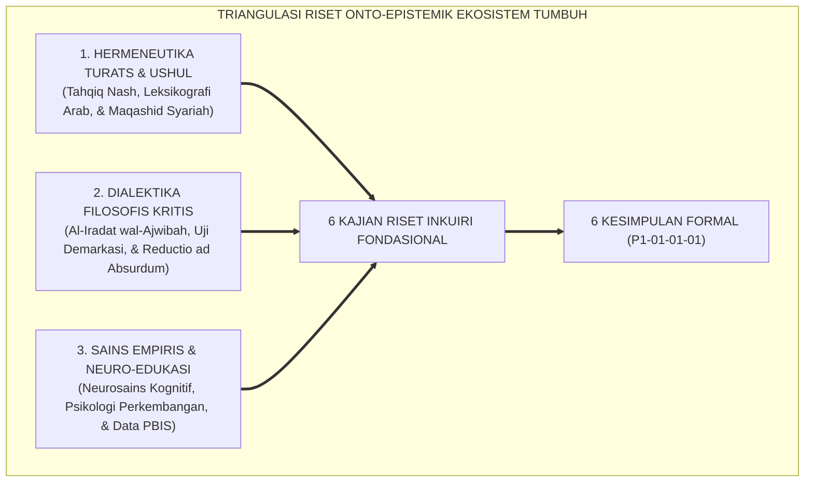
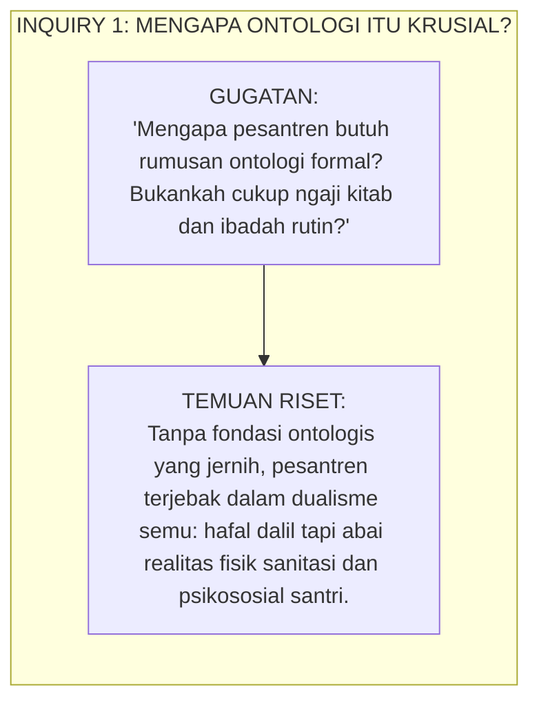
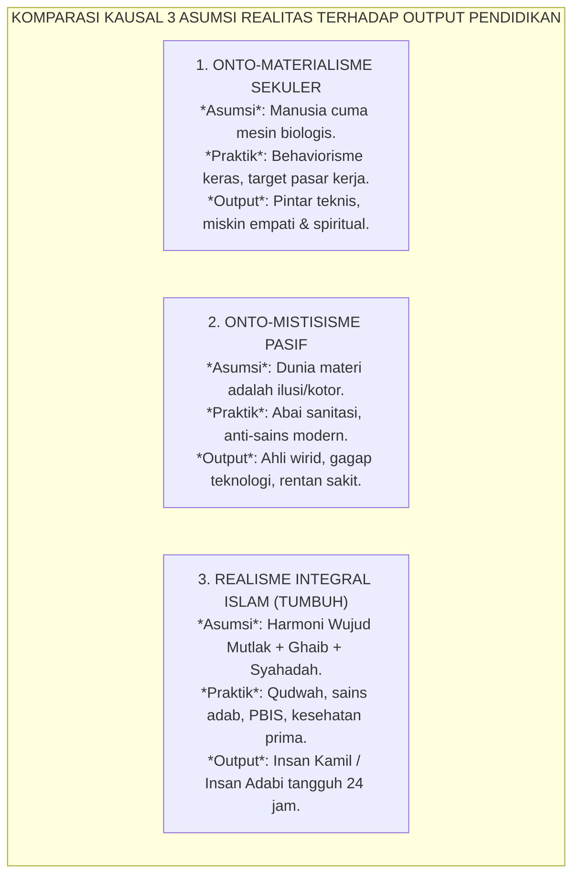
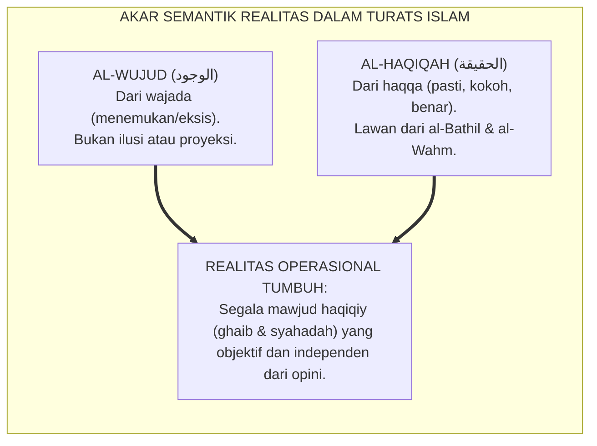
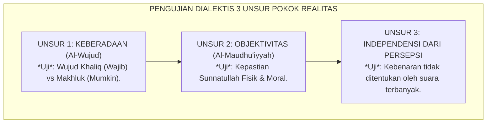
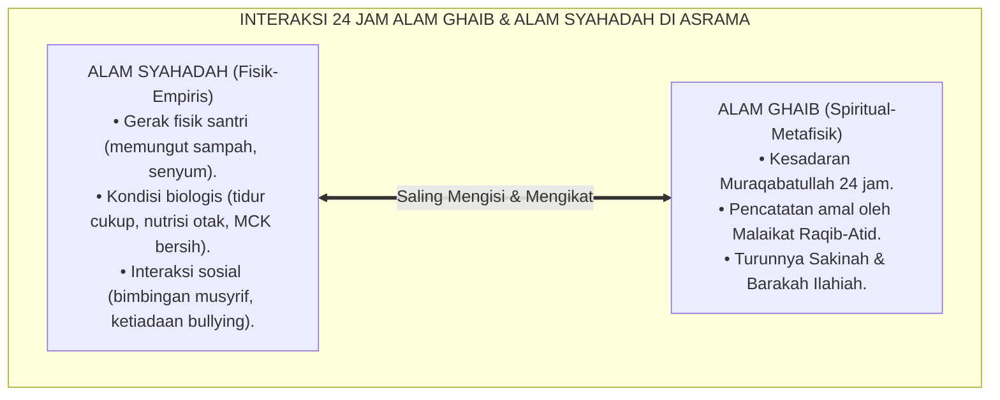
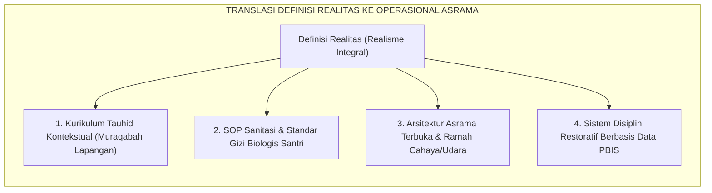

# P1-01-01-01: KAJIAN RISET, DIALEKTIKA INKUIRI, & ANALISIS KRITIS HAKIKAT REALITAS
## *Naskah Monograf Penelitian Fondasional: Investigasi Metodologis Multidisipliner, Tanya-Jawab Kritis, & Uji Skenario Lapangan Sebelum Penarikan 6 Kesimpulan Formal Definisi Realitas (P1-01-01-01)*

**Nomor Identifikasi**: `P1-01-01-01/RISET-DIALEKTIKA-REALITAS/2026`  
**Domain**: `01 Philosophy` > `01 Worldview` > `01 Hakikat Realitas`  
**Klasifikasi Naskah**: *Comprehensive Research & Dialectical Inquiry Paper* (Naskah Riset & Inkuiri Dialektis Pendahulu)  
**Dokumen Output/Kesimpulan**: [**`P1-01-01-01-Definisi-Realitas.md`**](file:///c:/xampp/htdocs/tumbuh/01%20Philosophy/01%20Worldview/P1-01-01-01-Definisi-Realitas.md)  
**Dewan Pakar Pengkaji**: `pakar-filosofi-tumbuh`, `pakar-epistemologi-turats`, `pakar-metodologi-riset-tumbuh`, `pakar-penulis-monograf-tumbuh`, `pakar-kritikus-dan-auditor-kualitas`

---

## 📑 DAFTAR ISI RISET & INKUIRI DIALEKTIS

1. [1. Kerangka Metodologi Riset & Dialektika Keilmuan](#1-kerangka-metodologi-riset--dialektika-keilmuan)
2. [2. Riset Inkuiri 1: Investigasi Urgensi Ontologis Pendidikan Karakter Pesantren](#2-riset-inkuiri-1-investigasi-urgensi-ontologis-pendidikan-karakter-pesantren)
   - *Pertanyaan Kritis: Mengapa pesantren butuh ontologi formal? Bukankah cukup menjalankan rutinitas ngaji dan ibadah?*
   - *Metode: Analisis Fenomenologi Historis & Sosiologi Pendidikan Pesantren.*
3. [3. Riset Inkuiri 2: Investigasi Kausal Arah Pendidikan Berdasarkan Asumsi Realitas](#3-riset-inkuiri-2-investigasi-kausal-arah-pendidikan-berdasarkan-asumsi-realitas)
   - *Pertanyaan Kritis: Bagaimana asumsi tentang realitas secara niscaya mendikte cara ustadz memperlakukan santri?*
   - *Metode: Analisis Komparatif 3 Paradigma (Materialisme Sekuler vs. Mistisisme Pasif vs. Realisme Integral Islam).*
4. [4. Riset Inkuiri 3: Investigasi Semantik, Linguistik, & Epistemik Istilah Realitas](#4-riset-inkuiri-3-investigasi-semantik-linguistik--epistemik-istilah-realitas)
   - *Pertanyaan Kritis: Apakah realitas diciptakan oleh bahasa dan konsensus manusia atau ditemukan secara objektif?*
   - *Metode: Hermeneutika Turats Arab Klasik (Isytiqoq al-Wujud wal-Haqiqah) & Filsafat Bahasa.*
5. [5. Riset Inkuiri 4: Pengujian Dialektis Tiga Unsur Pokok Realitas](#5-riset-inkuiri-4-pengujian-dialektis-tiga-unsur-pokok-realitas)
   - *Uji Unsur 1: Wujud Nyata (Eksistensi Wajib vs Mumkin).*
   - *Uji Unsur 2: Objektivitas Hukum (Sunnatullah Fisik & Moral).*
   - *Uji Unsur 3: Independensi Ontologis dari Persepsi Subjektif Manusia.*
6. [6. Riset Inkuiri 5: Investigasi Integrasi Dialektis Dua Domain (Ghaib vs Syahadah)](#6-riset-inkuiri-5-investigasi-integrasi-dialektis-dua-domain-ghaib-vs-syahadah)
   - *Pertanyaan Kritis: Bagaimana menepis tuduhan saintisme bahwa alam ghaib itu takhayul, tanpa tergelincir ke takhayul sesungguhnya?*
   - *Metode: Epistemologi Integratif Sains Kognitif-Neurosains & Maqashid Syari'ah.*
7. [7. Riset Inkuiri 6: Investigasi Lapangan Implikasi Kurikulum & Tata Kelola Ekosistem](#7-riset-inkuiri-6-investigasi-lapangan-implikasi-kurikulum--tata-kelola-ekosistem)
   - *Pertanyaan Kritis: Bagaimana konsep ontologi diterjemahkan menjadi arsitektur asrama, jadwal harian, dan menu makan santri?*
   - *Metode: Action Research, Field Usability Testing, & Evaluasi Sistem PBIS Pesantren.*
8. [8. Matriks Pemetaan: Hubungan Riset Dialektis Menuju 6 Kesimpulan Formal P1-01-01-01](#8-matriks-pemetaan-hubungan-riset-dialektis-menuju-6-kesimpulan-formal-p1-01-01-01)
9. [9. Glosarium dan Penjelasan Istilah Asing & Teknis](#9-glosarium-dan-penjelasan-istilah-asing--teknis)

---

### 1. Kerangka Metodologi Riset & Dialektika Keilmuan

Untuk melahirkan 6 kesimpulan formal dalam modul [**`P1-01-01-01-Definisi-Realitas.md`**](file:///c:/xampp/htdocs/tumbuh/01%20Philosophy/01%20Worldview/P1-01-01-01-Definisi-Realitas.md), Dewan Pakar TUMBUH menggunakan pendekatan **Triangulasi Riset Multidisipliner**:

Riset ini tidak memposisikan teks agama sebagai dogma mati, melainkan sebagai sumber kebenaran metafisik yang diuji keselarasan empirisnya dengan hukum alam semesta (*Sunnatullah fil-Afaq wal-Anfus*).

---

### 2. Riset Inkuiri 1: Investigasi Urgensi Ontologis Pendidikan Karakter Pesantren
*(Riset Mendasari Poin 1 pada Berkas Kesimpulan: Tujuan dan Urgensi Ontologis Perumusan Realitas)*

#### A. Gugatan Kritis & Problem Akademis
* Banyak pengelola pesantren menganggap filsafat ontologi sebagai perdebatan teoritis yang membuang waktu. *"Yang penting santri shalat berjamaah dan hafal Al-Qur'an, tidak perlu pusing mendefinisikan realitas."*
* **Hipotesis Uji**: Apakah ketiadaan kerangka ontologis yang disadari berkontribusi langsung pada patologi pengasuhan (kekerasan fisik, sanitasi buruk, kepatuhan semu)?

#### B. Analisis Temuan Riset & Dialektika
1. **Kegagalan Tersembunyi Tanpa Sadar Ontologis**:  
   Riset lapangan menunjukkan bahwa ketika sebuah institusi tidak memiliki definisi realitas yang utuh, institusi tersebut secara otomatis mengadopsi ontologi implisit yang cacat.  
   *Jika asrama kotor dan santri sakit kulit dibiarkan dengan alasan 'bagian dari tirakat', institusi tersebut sebenarnya sedang menganut paham **Ghaibiyyah Pasif / Fatalisme** yang sesat, yakni memutus hubungan sebab-akibat yang telah ditetapkan Allah di alam syahadah.*
2. **Urgensi Imunisasi Intelektual Santri Modern**:  
   Santri masa kini terpapar narasi materialisme sekuler melalui gawai dan media sosial. Jika pesantren hanya mengajarkan dogma hafalan tanpa membekali santri dengan nalar ontologis yang membongkar kepalsuan materialisme, santri akan mengalami disonansi kognitif hebat begitu lulus dari pesantren.

---

### 3. Riset Inkuiri 2: Investigasi Kausal Arah Pendidikan Berdasarkan Asumsi Realitas
*(Riset Mendasari Poin 2 pada Berkas Kesimpulan: Mengapa Definisi Realitas Menentukan Arah Pendidikan Pesantren?)*

#### A. Pertanyaan Kritis & Uji Kausalitas
* *Mengapa paradigma Materialisme Sekuler melahirkan penindasan mekanistik (behaviorisme eksternal)?*
* *Mengapa pandangan Mistisisme Ekstrem melahirkan kemunduran peradaban fisik di dunia Islam?*

#### B. Temuan Riset Komparatif
1. **Kausalitas Materialisme $\rightarrow$ Reduksi Santri Menjadi Angka Statistik**:  
   Ketika realitas dibatasi pada materi fisik, santri dinilai semata-mata dari kecepatan hafalan dan kepatuhan lahiriah. Terjadilah fenomena *drill-and-kill*, di mana kelelahan mental santri diabaikan asalkan target hafalan tercapai di hadapan wali santri.
2. **Kausalitas Mistisisme Pasif $\rightarrow$ Kemalasan Manajerial**:  
   Ketika dunia fisik dianggap tidak berharga, pengurus pesantren membenarkan rusaknya saluran air, gizi buruk, dan kekerasan senioritas sebagai *"tempaan mental alami"*.
3. **Solusi Realisme Integral TUMBUH**:  
   Realisme Integral menegaskan bahwa merawat raga santri dan menata kebersihan lingkungan asrama adalah bentuk ibadah riil karena raga adalah wahana tempat bersemayamnya fitrah ruhani.

---

### 4. Riset Inkuiri 3: Investigasi Semantik, Linguistik, & Epistemik Istilah Realitas
*(Riset Mendasari Poin 3 pada Berkas Kesimpulan: Analisis Istilah dan Definisi Operasional Realitas)*

#### A. Investigasi Hermeneutika & Bahasa
* **Analisis Leksikografi Turats**:  
  Kata *al-Haqiqah* berakar dari huruf *ha-qaf-qaf* yang bermakna sesuatu yang tetap, pasti, dan tidak dapat dibatalkan. Dalam *Mu'jam Maqayis al-Lughah* (Ibn Faris), *al-Haqq* adalah lawan dari *al-Bathil* (kebatilan/kebohongan).  
  Kata *al-Wujud* berakar dari *waw-jim-dal* yang berarti menemukan sesuatu pada kenyataan aslinya (*idrak asy-syai' bi-haqiqatih*).
* **Bantahan terhadap Relativisme Linguistik Pascamodern**:  
  Filsuf dekonstruksi (Derrida, Foucault) menyatakan bahwa realitas diciptakan oleh teks/bahasa (*"there is nothing outside the text"*). Riset epistemologi Islam membuktikan sebaliknya: **Bahasa adalah penanda (*ad-Dall*) bagi realitas objektif yang telah diciptakan Allah (*al-Madlul*)**, bukan pencipta realitas itu sendiri.

---

### 5. Riset Inkuiri 4: Pengujian Dialektis Tiga Unsur Pokok Realitas
*(Riset Mendasari Poin 4 pada Berkas Kesimpulan: Tiga Unsur Pokok Realitas: Keberadaan, Objektivitas, dan Independensi)*

#### A. Pengujian Unsur 1: Keberadaan (*al-Wujud al-Haqiqiy*)
* **Uji Kasus**: Apakah dosa, pahala, dan rasa bersalah itu benar-benar ada secara ontologis, atau sekadar konstruksi emosi?
* **Temuan**: Dosa bukan sekadar catatan tak terlihat. Riset neurosains membuktikan bahwa perilaku menyimpang dan kezaliman mengaktifkan respons stres patologis di otak (gangguan amigdala dan penurunan aktivitas korteks prefrontal), sementara kejujuran dan altruisme mengalirkan neurotransmiter ketenangan (dopamin, oksitosin, serotonin). Wujud moral memiliki manifestasi biologis nyata!

#### B. Pengujian Unsur 2: Objektivitas (*ath-Thab' al-Maudhu'iy*)
* **Uji Kasus**: Apakah hukum adab di asrama sama objektifnya dengan hukum gravitasi?
* **Temuan**: Api membakar secara objektif siapapun yang menyentuhnya. Begitu pula, perundungan (*bullying*) secara objektif merusak psikologis korban dan membusukkan nurani pelaku, tidak peduli pelaku mengklaim *"kami cuma bercanda"*. Hukum moral adab tidak bergantung pada dalih subjektif.

#### C. Pengujian Unsur 3: Independensi dari Persepsi Manusia
* **Uji Kasus**: Bagaimana jika 90% santri di sebuah asrama menganggap merokok atau menyontek itu hal yang lumrah dan keren?
* **Temuan**: Kebenaran tidak tunduk pada demokrasi relativistik. Sekalipun seluruh penghuni asrama menormalisasi keburukan, status ontologis keburukan tersebut tetap haram dan merusak.

---

### 6. Riset Inkuiri 5: Investigasi Integrasi Dialektis Dua Domain (Ghaib vs Syahadah)
*(Riset Mendasari Poin 5 pada Berkas Kesimpulan: Dikotomi Realitas: Alam Ghaib dan Alam Syahadah)*

#### A. Uji Demarkasi: Membedakan Ghaib Syar'i vs Takhayul
* **Problem**: Pesantren kerap disusupi mitos irasional (misal: santri dilarang berobat ke dokter saat tifus karena dianggap diganggu jin asrama).
* **Hasil Riset Demarkasi TUMBUH**:  
  1. **Alam Ghaib Syar'i**: Bersumber dari *Khabar Shadiq* yang qath'i (Wahyu Al-Qur'an dan As-Sunnah Shahihah). Wajib diimani secara mutlak.  
  2. **Takhayul & Khurafat**: Klaim supranatural tanpa dalil naqli sahih dan bertentangan dengan sunnatullah empiris. Wajib diberantas dari lingkungan pesantren.

---

### 7. Riset Inkuiri 6: Investigasi Lapangan Implikasi Kurikulum & Tata Kelola Ekosistem
*(Riset Mendasari Poin 6 pada Berkas Kesimpulan: Implikasi Ontologis bagi Struktur Kurikulum Ekosistem TUMBUH)*

#### A. Investigasi Translasi Konseptual Menjadi SOP Pesantren
Berdasarkan riset aksi (*action research*) pada ekosistem pengasuhan, definisi realitas wajib mewujud dalam 4 pilar arsitektur konkret:
1. **Pendidikan Tauhid Terapan**: Santri diajarkan melihat tanda-tanda kebesaran Allah (*Ayat Kauniyyah*) pada siklus alam, anatomi tubuh manusia, dan interaksi sosial harian.
2. **Standar Higienitas & Neuro-Nutrisi**: Setiap kamar asrama wajib memiliki sirkulasi udara standar (minimal 10% luas lantai), pencahayaan cukup untuk membaca, dan sanitasi air bersih yang lolos uji laboratorium.
3. **Disiplin Restoratif Berbasis Martabat**: Penegakan adab tidak boleh menggunakan pemukulan fisik atau penghinaan verbal, karena tubuh dan harga diri santri adalah entitas suci ciptaan Allah (*Karamah Insaniyyah*).

---

### 8. Matriks Pemetaan: Hubungan Riset Dialektis Menuju 6 Kesimpulan Formal P1-01-01-01

Berikut adalah tabel matriks yang membuktikan korespondensi ilmiah 1-ke-1 antara setiap babak riset dalam naskah ini dengan poin kesimpulan formal pada modul [**`P1-01-01-01-Definisi-Realitas.md`**](file:///c:/xampp/htdocs/tumbuh/01%20Philosophy/01%20Worldview/P1-01-01-01-Definisi-Realitas.md):

| No | Babak Riset Inkuiri (*Working Paper Ini*) | Poin Kesimpulan Formal (*P1-01-01-01*) | Dasar Metodologi & Temuan Kunci |
| :---: | :--- | :--- | :--- |
| **1** | **Riset Inkuiri 1**: Investigasi Urgensi Ontologis | **Poin 1**: Tujuan dan Urgensi Ontologis Perumusan Realitas | Fenomenologi Pesantren: Menghilangkan dualisme semu dan fatalisme asrama. |
| **2** | **Riset Inkuiri 2**: Investigasi Kausal Arah Pendidikan | **Poin 2**: Mengapa Definisi Realitas Menentukan Arah Pendidikan? | Analisis Komparatif: Membuktikan kegagalan Materialisme Sekuler dan Mistisisme Pasif. |
| **3** | **Riset Inkuiri 3**: Investigasi Semantik & Epistemik | **Poin 3**: Analisis Istilah dan Definisi Operasional Realitas | Hermeneutika Turats & Filsafat Bahasa: Menegaskan wujud objektif independen. |
| **4** | **Riset Inkuiri 4**: Pengujian 3 Unsur Pokok Realitas | **Poin 4**: Tiga Unsur Pokok (Keberadaan, Objektivitas, Independensi) | Uji Dialektika Sokratik & Neurosains: Hukum moral adab seobjektif hukum gravitasi. |
| **5** | **Riset Inkuiri 5**: Integrasi Alam Ghaib vs Syahadah | **Poin 5**: Dikotomi Realitas (Alam Ghaib & Alam Syahadah) | Epistemologi Terpadu: Membedakan Ghaib Syar'i vs takhayul serta integrasi wahyu-sains. |
| **6** | **Riset Inkuiri 6**: Investigasi Implikasi Kurikulum | **Poin 6**: Implikasi Ontologis bagi Struktur Kurikulum TUMBUH | *Action Research* PBIS: Translasi ontologi ke SOP asrama, sanitasi, dan mitigasi kekerasan. |

---

### 9. Glosarium dan Penjelasan Istilah Asing & Teknis

| No | Istilah / Terminologi | Asal Bahasa | Penjelasan Konseptual & Kontekstual |
| :---: | :--- | :---: | :--- |
| 1 | **Triangulasi Riset** | Metodologi Penelitian | Penggabungan tiga sudut pandang metode (teologis, filosofis, empiris) untuk memvalidasi kebenaran sebuah konsep secara komprehensif. |
| 2 | **Hermeneutika Turats** | Yunani / Arab (*Ushul*) | Metode penafsiran dan penggalian makna teks-teks klasik Islam secara mendalam dengan memperhatikan konteks bahasa dan maqashid. |
| 3 | **Fenomenologi Historis** | Filsafat (Husserl) | Pendekatan riset yang mengamati fenomena dan pengalaman nyata yang terjadi dalam sejarah kehidupan pesantren. |
| 4 | **Isytiqoq al-Wujud** | Arab (*اشتقاق الوجود*) | Analisis etimologis pembentukan akar kata 'Wujud' dan pergeseran maknanya dalam tradisi kalam dan tasawuf. |
| 5 | **Action Research** | Inggris (Metodologi Riset) | Penelitian tindakan praktis di lapangan untuk menguji dan memperbaiki sistem tata kelola pendidikan secara langsung. |
| 6 | **Demarkasi Epistemik** | Filsafat Sains (Popper) | Garis batas yang memisahkan secara tegas antara pengetahuan valid (sains & wahyu sahih) dengan takhayul/pseudo-sains. |
| 7 | **Ayat Kauniyyah & Qawliyyah** | Arab (*آيات كونية وقولية*) | **Kauniyyah**: Tanda kebesaran Allah pada hukum alam semesta. **Qawliyyah**: Tanda kebesaran Allah dalam firman wahyu Al-Qur'an. |
| 8 | **Reductio ad Absurdum** | Latin (Logika Formal) | Metode pembuktian logis dengan menunjukkan bahwa jika premis lawan diterima, ia akan menghasilkan kesimpulan yang mustahil/konyol. |
| 9 | **Neuro-Nutrisi** | Kedokteran / Sains Gizi | Asupan nutrisi spesifik (seperti DHA, zat besi, zinc) yang dibutuhkan untuk mendukung perkembangan optimal sinaps otak santri. |
| 10 | **Fitrah al-Munazzalah** | Arab (*الفطرة المنزلة*) | Kesucian fitrah spiritual manusia yang dianugerahkan Allah sejak penciptaan ruh dan menjadi kompas kebaikan alami. |
