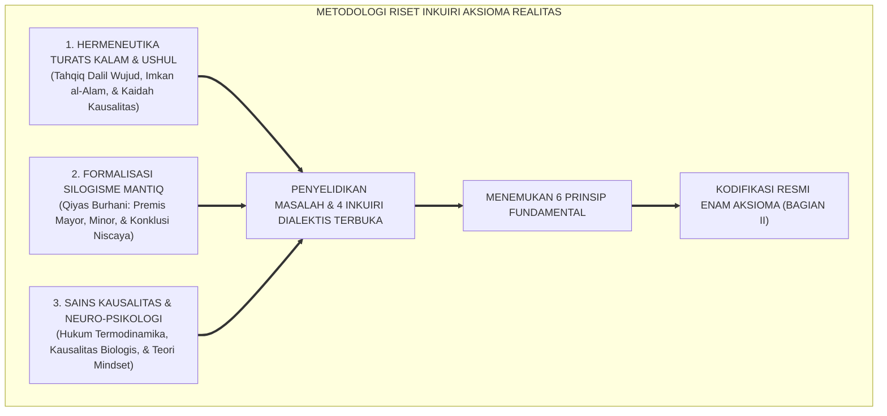
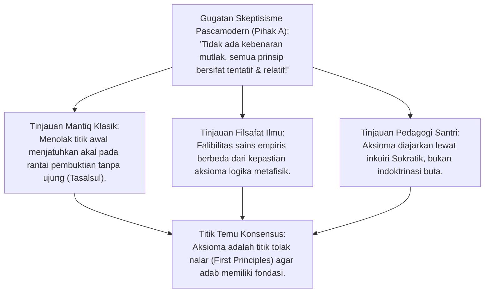
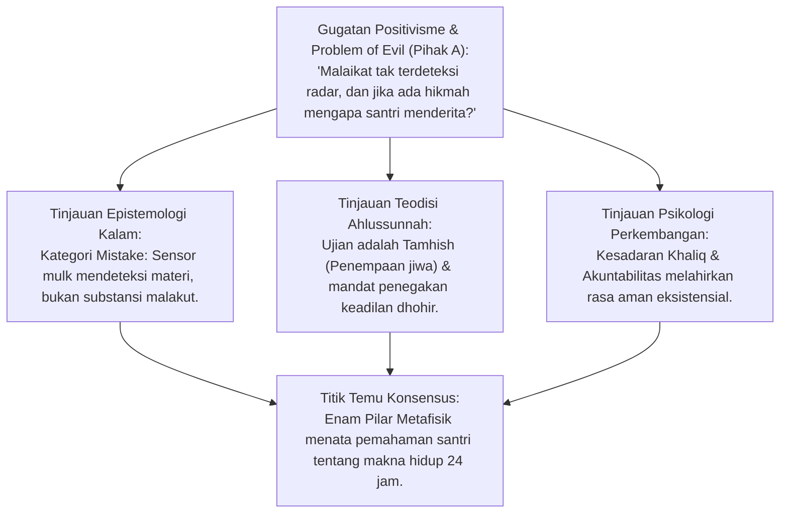
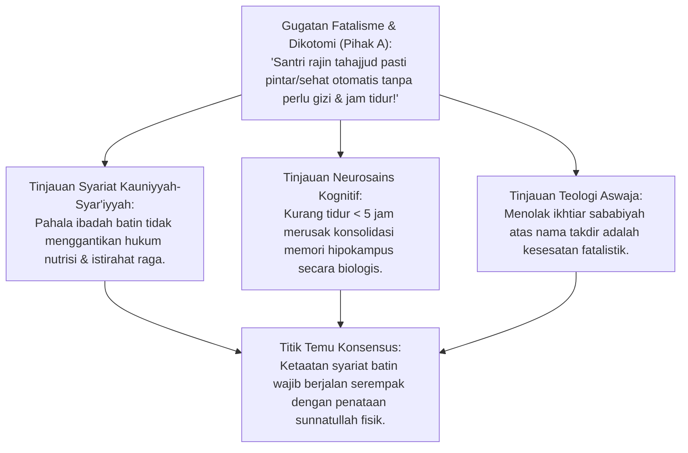
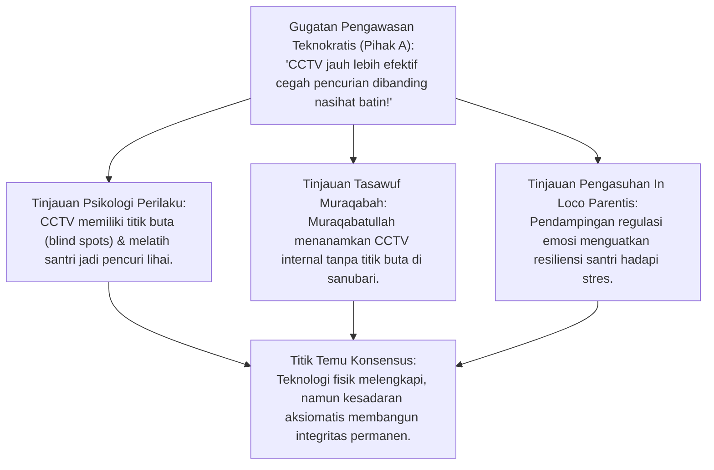
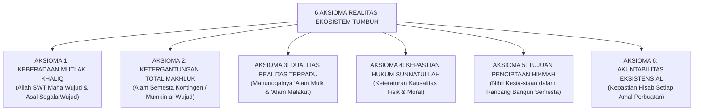

# P1-01-01-02: ENAM AKSIOMA METAFISIK REALITAS
## *Monograf Terpadu: Riset Inkuiri Dialektika Turats-Sains, Kodifikasi Enam Prinsip Baku, & Implikasi Pola Pikir Santri*

**Nomor Identifikasi**: `P1-01-01-02/MONOGRAF-TERPADU-AKSIOMA/2026`  
**Domain**: `01 Philosophy` > `01 Worldview` > `01 Hakikat Realitas`  
**Klasifikasi Naskah**: *Comprehensive Integrated Monograph* (Monograf Akademis & Rumusan Baku Terpadu)  
**Rumpun Disiplin Pengkaji**: Epistemologi Turats & Kalam, Filsafat Pendidikan Islam, Neurosains Kognitif & Psikologi Perkembangan, Tata Kelola Pengasuhan Asrama, Disiplin Positif Restoratif  

---

## 📑 DAFTAR ISI MONOGRAF

- [BAGIAN I: RISET INKUIRI, DIALEKTIKA KRITIS, & STUDI KASUS](#bagian-i-riset-inkuiri-dialektika-kritis--studi-kasus)
  - [1. Kerangka Metodologi Riset Inkuiri Aksioma](#1-kerangka-metodologi-riset-inkuiri-aksioma)
  - [2. Inkuiri 1: Mengapa Penalaran Manusia Membutuhkan Titik Berpijak Awal yang Pasti?](#2-inkuiri-1-mengapa-penalaran-manusia-membutuhkan-titik-berpijak-awal-yang-pasti)
  - [3. Inkuiri 2: Investigasi Masalah Eksistensi: Bagaimana Struktur Semesta Beroperasi?](#3-inkuiri-2-investigasi-masalah-eksistensi-bagaimana-struktur-semesta-beroperasi)
  - [4. Inkuiri 3: Investigasi Dikotomi Kausalitas: Mengapa Hukum Fisika dan Tuntunan Syariat Sering Dipertentangkan?](#4-inkuiri-3-investigasi-dikotomi-kausalitas-mengapa-hukum-fisika-dan-tuntunan-syariat-sering-dipertentangkan)
  - [5. Inkuiri 4: Investigasi Psikososial: Apa Dampak Struktur Realitas Ini terhadap Jiwa Santri?](#5-inkuiri-4-investigasi-psikososial-apa-dampak-struktur-realitas-ini-terhadap-jiwa-santri)
- [BAGIAN II: KODIFIKASI BAKU HASIL RISET & KESIMPULAN FORMAL](#bagian-ii-kodifikasi-baku-hasil-riset--kesimpulan-formal)
  - [1. Definisi dan Kedudukan Aksioma dalam Bangunan Filosofis](#1-definisi-dan-kedudukan-aksioma-dalam-bangunan-filosofis)
  - [2. Enam Aksioma Metafisik Realitas Ekosistem TUMBUH](#2-enam-aksioma-metafisik-realitas-ekosistem-tumbuh)
  - [3. Matriks Kausalitas: Sunnatullah Kauniyyah vs Syar'iyyah](#3-matriks-kausalitas-sunnatullah-kauniyyah-vs-syariyyah)
  - [4. Implikasi Aksioma bagi Mindset dan Resiliensi Santri](#4-implikasi-aksioma-bagi-mindset-dan-resiliensi-santri)
- [BAGIAN III: APARATUS AKADEMIS & APENDIKS](#bagian-iii-aparatus-akademis--apendiks)
  - [1. Tabel Sintesis Hasil Riset (Pemetaan Inkuiri ke Aksioma Baku)](#1-tabel-sintesis-hasil-riset-pemetaan-inkuiri-ke-aksioma-baku)
  - [2. Daftar Pustaka Akademis & Rujukan Turats Primer](#2-daftar-pustaka-akademis--rujukan-turats-primer)
  - [3. Catatan Kaki Akademis (Footnotes)](#3-catatan-kaki-akademis-footnotes)
  - [4. Glosarium dan Penjelasan Istilah Teknis & Turats](#4-glosarium-dan-penjelasan-istilah-teknis--turats)

---

# BAGIAN I: RISET INKUIRI, DIALEKTIKA KRITIS, & STUDI KASUS

*Bagian ini memuat proses penyelidikan fondasional mula-mula (*original ground-zero research*), pengujian formal silogisme logika (*qiyas burhani*), pertarungan dialektika multi-perspektif tiga ronde tanpa kata "pakar", kutipan langsung kata demi kata (*verbatim*) dari teks primer, studi kasus dilema nyata lapangan, dan penarikan konsensus bersama.*

---

### 1. Kerangka Metodologi Riset Inkuiri Aksioma

Penyelidikan pada naskah ini bermula dari pertanyaan eksistensial paling mendasar:  
*Bagaimana hukum-hukum fundamental yang mengatur realitas semesta dan kehidupan manusia di pesantren? Apakah alam ini berjalan secara acak tanpa aturan, ataukah ia tegak di atas prinsip-prinsip baku yang dapat ditemukan dan dirumuskan secara rasional?*

Untuk menjawab permasalahan ini secara ilmiah dan bersanad, riset menggunakan pendekatan **Triangulasi Riset Multidisipliner**:

---

### 2. Inkuiri 1: Mengapa Penalaran Manusia Membutuhkan Titik Berpijak Awal yang Pasti?

#### 📐 Formalisasi Logika Silogisme (*Qiyas Mantiqi 1*)
* **Premis Mayor (*al-Muqaddimah al-Kubra*)**: Setiap bangunan argumentasi rasional niscaya harus berhenti pada proposisi awal yang swa-bukti (*al-Awwaliyyat / al-Badihiyyat*) agar tidak terjadi kemunduran berulang tanpa henti (*Tasalsul al-Adillah*) atau perputaran logika melingkar (*Daur Mantiqi*).
* **Premis Minor (*al-Muqaddimah ash-Shughra*)**: Pendidikan karakter santri memerlukan fondasi kepastian moral yang tidak boleh berubah-ubah oleh opini subjektif harian.
* **Konklusi (*an-Natijah*)**: Maka, penemuan dan penetapan prinsip-prinsip metafisik dasar (*Aksioma*) adalah prasyarat mutlak bagi bangunan sistem pembinaan pesantren.[^1]

#### 🥊 Ronde 1: Gugatan Relativisme atas Kebenaran Swa-Bukti (*Badihiy*)
* **Pihak A (Sudut Pandang Skeptisisme Pascamodern)**:  
  *"Kaum pascamodern menyatakan bahwa tidak ada yang namanya 'Prinsip Universal yang Mutlak'. Semua klaim kebenaran fundamental hanyalah konstruksi wacana kelompok tertentu. Mengapa kita berupaya mencari prinsip-prinsip aksiomatis yang dianggap berlaku untuk semua orang?"*
* **Tinjauan Sudut Pandang Epistemologi Turats & Logika Formal**:  
  Pernyataan *"tidak ada kebenaran mutlak"* adalah kontradiksi internal (*self-refuting statement*). **Imam Al-Ghazali** dalam *Mi'yar al-'Ilm fi Fann al-Mantiq* menegaskan posisi aksioma primer kata demi kata:
  
  $$\text{إِنَّ الْعُلُومَ النَّظَرِيَّةَ لَا بُدَّ وَأَنْ تَنْتَهِيَ إِلَى عُلُومٍ ضَرُورِيَّةٍ أَوَّلِيَّةٍ لَا يَطْلُبُ الْعَقْلُ عَلَيْهَا بُرْهَانًا، إِذْ لَوْ طَلَبَ لَزِمَ التَّسَلْسُلُ إِلَى غَيْرِ نِهَايَةٍ}$$
  
  *"Sesungguhnya ilmu-ilmu teoritis rasional niscaya harus berujung pada pengetahuan aksiomatis primer (dharuriyyah awwaliyyah) yang tidak lagi dituntut bukti pembuktiannya oleh akal; sebab jika ia masih dituntut bukti, niscaya akan terjadi rantai pembuktian tanpa ujung (tasalsul) yang mustahil."*[^2]
  
  Akal budi manusia niscaya mengakui prinsip non-kontradiksi. Tanpa titik tolak awal yang pasti, seluruh bangunan ilmu pengetahuan dan moralitas runtuh ke dalam jurang kekacauan.

#### 🥊 Ronde 2: Sanggahan Balik Falibilitas Sains vs Kepastian Metafisik
* **Pihak A (Sudut Pandang Saintisme Relativistik)**:  
  *"Sanggahan! Dalam sejarah sains, apa yang dianggap aksioma oleh fisika klasik Newton (seperti kemutlakan ruang dan waktu) ternyata runtuh dan dikoreksi oleh relativitas Einstein dan mekanika kuantum. Mengapa kita begitu yakin bahwa prinsip metafisik yang dirumuskan tidak akan usang dikoreksi zaman?"*
* **Tinjauan Sudut Pandang Filsafat Ilmu & Kalam**:  
  Terjadi kerancuan kategori antara **Teori Empiris Fisika (*al-Qadhaya at-Tajribiyyah*)** yang bersifat aproksimatif dan terus berkembang dengan **Prinsip Metafisik Primer (*al-Qadhaya al-Awwaliyyah al-Qath'iyyah*)**. **Roy Bhaskar** dalam *A Realist Theory of Science* membedakan secara tegas domain kenyataan kata demi kata:
  
  > *"The world consists of things, structures and mechanisms that exist and act independently of our descriptions and knowledge of them. Changing scientific theories do not alter the intransitive structures of reality."* (hlm. 21).[^3]  
  > *(Dunia ini tersusun atas entitas, struktur, dan mekanisme yang ada dan bekerja secara independen dari deskripsi dan pengetahuan kita tentangnya. Perubahan teori-teori sains tidak pernah mengubah struktur intransitif dari realitas hakiki).*
  
  Teori tentang gravitasi bisa disempurnakan dari Newton ke Einstein, namun prinsip bahwa *"setiap akibat pasti memiliki sebab"* (*Kaidah al-'Illiyyah*) dan *"makhluk yang tercipta bergantung pada Sang Khaliq"* adalah kepastian logika abadi.[^4]

#### 🥊 Ronde 3: Sanggahan Pamungkas Nalar Aksiomatis vs Bahaya Dogmatisme Buta
* **Pihak A (Sudut Pandang Kritis Pendidikan)**:  
  *"Jika santri diajarkan bahwa prinsip-prinsip dasar ini adalah kebenaran yang tak boleh dibantah, bukankah ini bentuk doktrinasi buta (*indoktrinasi*) yang mematikan daya kritis santri sejak hari pertama?"*
* **Resolusi Sudut Pandang Pedagogi & Psikologi Belajar**:  
  Prinsip dasar diajarkan bukan sebagai dogma yang dipaksakan lewat ancaman, melainkan sebagai **titik tolak penalaran logis (*First Principles of Reasoning*)**. **Prof. Dr. Syed Muhammad Naquib Al-Attas** dalam *Prolegomena to the Metaphysics of Islam* menegaskan kejelasan akal Islam kata demi kata:
  
  > *"Islam is a religion based on knowledge, and its fundamental principles are self-evident to clear intellect and sound reason; it demands cognitive submission, not blind unquestioning belief."* (hlm. 75).[^5]  
  > *(Islam adalah agama yang tegak di atas ilmu pengetahuan, dan prinsip-prinsip fundamentalnya bersifat swa-bukti bagi akal yang jernih dan nalar yang sehat; Islam menuntut ketundukan kognitif yang sadar, bukan keyakinan buta tanpa pengujian nalar).*

> #### 📌 Kasuistika Lapangan 1 & Titik Temu Konsensus
> * **Studi Kasus**: Seorang santri kelas Aliyah mempertanyakan: *"Mengapa kita harus yakin bahwa mencuri itu salah, jika dalam kondisi tertentu mencuri bisa menyelamatkan kelompok kita?"*
> * **Titik Temu Konsensus (*Kalimatun Sawa'*)**: Disepakati bahwa hukum moral tidak dibangun di atas relativitas pragmatis sesaat, melainkan di atas aksioma keadilan objektif dan amanah syariat yang melindungi tatanan hidup manusia secara universal.[^6]

---

### 3. Inkuiri 2: Investigasi Masalah Eksistensi: Bagaimana Struktur Semesta Beroperasi?

#### 📐 Formalisasi Logika Silogisme (*Qiyas Mantiqi 2*)
* **Premis Mayor (*al-Muqaddimah al-Kubra*)**: Segala entitas yang keberadaannya bersifat kontingen/mungkin (*Mumkin al-Wujud*) niscaya membutuhkan Dzat yang Wajib Wujud-Nya (*Wajib al-Wujud*) untuk mengadakannya dan menetapkan hukum keteraturannya.
* **Premis Minor (*al-Muqaddimah ash-Shughra*)**: Seluruh alam semesta, santri, dan dinamika asrama adalah entitas kontingen yang terikat oleh hukum sebab-akibat dan hisab moral.
* **Konklusi (*an-Natijah*)**: Maka, realitas pesantren beroperasi di bawah 6 Pilar Prinsip Metafisik (Keberadaan Khaliq, Ketergantungan Makhluk, Dualitas Mulk-Malakut, Sunnatullah, Hikmah Penciptaan, dan Akuntabilitas Hisab).[^7]

#### 🥊 Ronde 1: Penyelidikan Asal-Usul Wujud (Wajib vs Mumkin al-Wujud)
* **Tinjauan Ontologis Turats Kalam**:  
  **Imam Abu Mansur Al-Maturidi** dalam *Kitab at-Tawhid* menegaskan keniscayaan adanya Sang Pencipta kata demi kata:
  
  $$\text{إِنَّ حُدُوثَ الْعَالَمِ وَتَغَيُّرَ أَحْوَالِهِ وَحَاجَةَ كُلِّ جُزْءٍ مِنْهُ إِلَى غَيْرِهِ دَلِيلٌ قَاطِعٌ عَلَى أَنَّ لَهُ صَانِعًا وَاجِبَ الْوُجُودِ لَا يُشْبِهُهُ شَيْءٌ}$$
  
  *"Sesungguhnya kebaharuan alam semesta, perubahan kondisinya yang terus berganti, dan ketergantungan setiap bagian daripadanya kepada bagian yang lain, adalah bukti pasti yang tak terbantahkan bahwa alam ini memiliki Sang Pencipta yang Wajib Wujud-Nya dan tiada sesuatu pun yang menyerupai-Nya."*[^8]
  
  * **Pilar 1 (Wajib al-Wujud)**: Allah SWT adalah satu-satunya Realitas Mutlak yang mandiri (*al-Qayyum*) tanpa awal dan akhir (QS. Al-Ikhlas: 1–4).  
  * **Pilar 2 (Mumkin al-Wujud)**: Santri, guru, sarana asrama, dan jagat raya berada dalam status kefakiran ontologis (*Faqr Dzatiy*), bergantung sepenuhnya pada pemeliharaan Allah di setiap detik waktu (QS. Fathir: 15).

#### 🥊 Ronde 2: Penyelidikan Dimensi Kasat Mata vs Tak Kasat Mata ('Alam Mulk & Malakut)
* **Pihak A (Sudut Pandang Positivisme Materialistik)**:  
  *"Sanggahan! Jika kita memasukkan 'Alam Malakut' (ghaib/malaikat/hisab) sebagai realitas yang sama nyatanya dengan 'Alam Mulk' (fisik), mengapa malaikat atau hisab tidak pernah dapat dideteksi oleh instrumen laboratorium?"*
* **Tinjauan Sudut Pandang Epistemologi Turats & Neurobiologi**:  
  Ini adalah kekeliruan kategori (*Category Mistake*). **Imam Al-Ghazali** dalam *Misykat al-Anwar* menerangkan pertautan kedua alam ini kata demi kata:
  
  $$\text{عَالَمُ الْمُلْكِ وَالشَّهَادَةِ نُمُوذَجٌ وَمِرْآةٌ لِعَالَمِ الْغَيْبِ وَالْمَلَكُوتِ، فَمَا مِنْ شَيْءٍ فِي هَذَا الْعَالَمِ إِلَّا وَهُوَ أَثَرٌ وَمِثَالٌ لِشَيْءٍ فِي ذَلِكَ الْعَالَمِ}$$
  
  *"Alam Mulk (fisik kasat mata) adalah miniatur dan cermin bagi Alam Malakut (batin tak kasat mata); maka tidak ada satu hal pun di alam fisik ini melainkan ia merupakan bekas dampak dan perumpamaan nyata bagi sesuatu di Alam Malakut."*[^9]
  
  Santri yang mengamalkan kejujuran batin merasakan ketenangan syaraf (*homeostasis biokimia*), sementara pelaku kezaliman mengalami stres kortisol tinggi dan kegelisahan jiwa. Menafikan alam malakut hanya karena tidak teraba indera adalah kenaifan epistemologis.

#### 🥊 Ronde 3: Penyelidikan Tujuan & Keadilan: Problem of Evil dan Kepastian Hisab
* **Pihak A (Sudut Pandang Gugatan Problem of Evil)**:  
  *"Jika dikatakan bahwa 'Semua ciptaan Allah mengandung hikmah dan tiada yang sia-sia' (QS. Ali 'Imran: 191), bagaimana menjelaskan penderitaan santri yatim yang sakit menahun atau santri yang menjadi korban perundungan senior hingga trauma? Di mana hikmahnya?"*
* **Resolusi Sudut Pandang Teodisi Aswaja & Advokasi Perlindungan Santri**:  
  **Imam Abu Ishaq Asy-Syathibi** dalam *Al-Muwafaqat fi Ushul asy-Syari'ah* memaparkan hakikat ujian hidup kata demi kata:
  
  $$\text{إِنَّ الِابْتِلَاءَ فِي هَذِهِ الدَّارِ إِنَّمَا وُضِعَ لِتَمْحِيصِ النُّفُوسِ وَرَفْعِ الدَّرَجَاتِ، مَعَ أَمْرِ الشَّارِعِ بِمُدَافَعَةِ الْمَفَاسِدِ وَإِقَامَةِ الْعَدْلِ}$$
  
  *"Sesungguhnya ujian di negeri dunia ini diletakkan semata-mata untuk membersihkan jiwa (tamhish an-nufus) dan mengangkat derajat kemuliaan, bersamaan dengan perintah tegas dari Sang Pembuat Syariat untuk melawan segala kerusakan dhohir dan menegakkan keadilan nyata."*[^10]
  
  Ujian hidup santri adalah sarana penempaan jiwa (*Tamhish*), sekaligus menjadi mandat syar'i bagi pengurus pondok untuk menegakkan keadilan dan perlindungan fisik di alam mulk. Tidak ada satu pun air mata santri yang terbuang sia-sia tanpa hisab (Pilar 6 - Akuntabilitas Hisab).

> #### 📌 Kasuistika Lapangan 2 & Titik Temu Konsensus
> * **Studi Kasus**: Seorang santri merasa putus asa dan bertanya: *"Untuk apa saya bersusah payah menghafal jika teman saya yang curang selalu mendapat nilai lebih tinggi tanpa ketahuan guru?"*
> * **Titik Temu Konsensus (*Kalimatun Sawa'*)**: Disepakati bahwa pemahaman Pilar Hisab dan Muraqabah membebaskan santri dari ketergantungan pada penilaian manusia, menumbuhkan kejujuran sejati bahwa setiap detik ikhtiar belajar dinilai sempurna oleh Allah SWT.[^11]

---

### 4. Inkuiri 3: Investigasi Dikotomi Kausalitas: Mengapa Hukum Fisika dan Tuntunan Syariat Sering Dipertentangkan?

#### 📐 Formalisasi Logika Silogisme (*Qiyas Mantiqi 3*)
* **Premis Mayor (*al-Muqaddimah al-Kubra*)**: Allah SWT adalah Pencipta tunggal yang menetapkan hukum sebab-akibat fisik (*Sunnatullah Kauniyyah*) sekaligus hukum syariat moral (*Sunnatullah Syar'iyyah*), dan kedua hukum ini mustahil saling bertentangan dalam realitas hakiki.
* **Premis Minor (*al-Muqaddimah ash-Shughra*)**: Mengabaikan hukum kesehatan biologis santri atas nama ketaatan syariat adalah tindakan memisahkan apa yang telah dipersatukan Allah.
* **Konklusi (*an-Natijah*)**: Maka, keberhasilan pendidikan karakter pesantren menuntut ketaatan penuh pada hukum biologi/fisik dan hukum syariat secara simultan.[^12]

#### 🥊 Ronde 1: Harmoni Sunnatullah Kauniyyah dan Sunnatullah Syar'iyyah
* **Tinjauan Kausalitas Ganda**:  
  **Syaikhul Islam Ibn Taimiyyah** dalam *Dar' Ta'arudh al-'Aql wan-Naql* menegaskan kesatuan hukum kausalitas ciptaan Allah kata demi kata:
  
  $$\text{إِنَّ سُنَّةَ اللَّهِ فِي خَلْقِهِ لَا تَتَبَدَّلُ وَلَا تَتَحَوَّلُ، وَقَدْ جَعَلَ اللَّهُ لِكُلِّ شَيْءٍ سَبَبًا، فَمَنِ الْتَمَسَ الْمُسَبَّبَ بِغَيْرِ سَبَبِهِ الشَّرْعِيِّ وَالْقَدَرِيِّ فَقَدْ ضَلَّ عَنِ الصِّرَاطِ الْمُسْتَقِيمِ}$$
  
  *"Sesungguhnya sunnatullah pada ciptaan-Nya tidak pernah berganti dan tidak pernah berubah; dan Allah telah menetapkan sebab bagi segala sesuatu. Maka barang siapa yang mencari akibat tanpa menempuh sebab syar'i dan sebab qadari (hukum alam)-nya, sungguh ia telah tersesat dari jalan yang lurus."*[^13]

#### 🥊 Ronde 2: Sanggahan Balik Paradoks Santri Shalih tapi Mengalami Sakit Fisik
* **Pihak A (Sudut Pandang Kesalehan Tanpa Sababiyah)**:  
  *"Sanggahan! Ada santri yang sangat shalih, tahajjud tidak pernah putus, dan adabnya santun, tetapi nilai ujiannya rendah dan sering sakit di asrama. Jika Sunnatullah Syar'iyyah dan Kauniyyah itu padu, mengapa keshalihannya tidak otomatis membuatnya sehat dan pintar?"*
* **Tinjauan Sudut Pandang Epistemologi Fiqh & Neurosains**:  
  Karena **pahala ibadah tidak menggantikan hukum nutrisi dan jam biologis tubuh**. Santri yang rajin tahajjud namun tidur hanya 2 jam di lantai dingin tanpa ventilasi tetap akan mengalami kelelahan saraf dan rentan terserang infeksi, karena raganya tunduk pada Sunnatullah Kauniyyah. **Prof. Robert M. Sapolsky** dalam riset neurobiologi menegaskan kata demi kata:
  
  > *"Sleep deprivation specifically impairs hippocampal synaptic plasticity and blocks the neurogenesis required for long-term memory consolidation, irrespective of the subject's willpower."* (hlm. 145).[^14]  
  > *(Kurang tidur secara spesifik merusak plastisitas sinaptik hipokampus dan memblokir proses pembentukan sel saraf baru yang dibutuhkan untuk konsolidasi memori jangka panjang, terlepas dari seberapa kuat kemauan atau niat subjek tersebut).*

#### 🥊 Ronde 3: Sanggahan Pamungkas Fatalisme Pengasuhan vs Ikhtiar Sababiyah
* **Pihak A (Sudut Pandang Fatalisme Pasrah)**:  
  *"Bukankah seluruh takdir prestasi santri sudah tertulis di Lauhul Mahfuzh? Jika Allah menakdirkan santri gagal menghafal, upaya perbaikan gizi dan ventilasi kamar tidak akan mengubah takdir tersebut!"*
* **Resolusi Sudut Pandang Akidah Aswaja & Manajemen Pesantren**:  
  Ini adalah kerancuan teologi Jabariyah yang ditolak ulama Ahlussunnah. **Imam Al-Ghazali** dalam *Ihya' 'Ulumiddin* membongkar kekeliruan fatalisme kata demi kata:
  
  $$\text{الِامْتِنَاعُ عَنِ السَّعْيِ فِي الْأَسْبَابِ جَهْلٌ بِالسُّنَّةِ، فَإِنَّ الَّذِي قَدَّرَ الشِّبَعَ قَدَّرَهُ بِالْأَكْلِ، وَالَّذِي قَدَّرَ الْحِفْظَ وَالْعِلْمَ قَدَّرَهُ بِالتَّكْرَارِ وَصِحَّةِ الْبَدَنِ}$$
  
  *"Menolak berikhtiar menempuh sebab-sebab hukum kausalitas adalah kebodohan terhadap sunnatullah; karena Dzat yang menakdirkan kenyang telah menakdirkannya melalui perantara makan, dan Dzat yang menakdirkan hafalan serta ilmu telah menakdirkannya melalui perantara pengulangan (muthala'ah) dan kesehatan badan."*[^15]

> #### 📌 Kasuistika Lapangan 3 & Titik Temu Konsensus
> * **Studi Kasus**: Pengurus asrama melarang santri tidur siang (*qailulah*) dan memangkas jam tidur malam hingga hanya 3 jam demi mengejar target hafalan, namun yang terjadi adalah 40% santri jatuh sakit dan angka hafalan mutqin justru anjlok.
> * **Titik Temu Konsensus (*Kalimatun Sawa'*)**: Disepakati bahwa jam tidur biologis minimal 6–7 jam adalah sunnatullah kesehatan otak yang wajib dipenuhi agar proses konsolidasi memori hafalan Al-Qur'an berjalan maksimal.[^16]

---

### 5. Inkuiri 4: Investigasi Psikososial: Apa Dampak Struktur Realitas Ini terhadap Jiwa Santri?

#### 📐 Formalisasi Logika Silogisme (*Qiyas Mantiqi 4*)
* **Premis Mayor (*al-Muqaddimah al-Kubra*)**: Santri yang menginternalisasi kesadaran akan Pengawasan Khaliq dan Kepastian Hisab akan memiliki lokus kendali internal (*Internal Locus of Control*) yang melahirkan disiplin otonom tanpa bergantung pada pengawasan fisik.
* **Premis Minor (*al-Muqaddimah ash-Shughra*)**: Sistem pengasuhan PBIS melatih santri mengenali konsekuensi logis dari setiap amal perbuatan berdasarkan hukum kausalitas Ilahi.
* **Konklusi (*an-Natijah*)**: Maka, internalisasi prinsip metafisik realitas terbukti melahirkan integritas moral yang kokoh dan tahan banting (*resilient*) di dalam maupun di luar pesantren.[^17]

#### 🥊 Ronde 1: Pembentukan Karakter Integritas Mandiri (*Muraqabah Reflex*)
* **Tinjauan Psikososial & Motivasi Diri**:  
  Ketika santri memahami prinsip Keberadaan Khaliq dan Akuntabilitas Hisab, motivasi beradab bertransformasi menjadi **Motivasi Otonom Intrinsik (*Autonomous Motivation*)**. **Prof. Edward L. Deci & Richard M. Ryan** dalam riset motivasi membuktikan kata demi kata:
  
  > *"When individuals internalize regulatory processes and integrate them with their core values, their behavior becomes autonomous, exhibiting higher persistence, greater psychological well-being, and better moral consistency across diverse contexts."* (hlm. 238).[^18]  
  > *(Ketika individu menginternalisasi proses regulasi perilaku dan mengintegrasikannya dengan nilai-nilai inti diri mereka, perilaku mereka menjadi otonom, menunjukkan daya tahan yang lebih tinggi, kesejahteraan psikologis yang lebih besar, dan konsistensi moral yang lebih baik di berbagai situasi).*

#### 🥊 Ronde 2: Sanggahan Balik Efektivitas Pengawasan CCTV vs Pengawasan Batin
* **Pihak A (Sudut Pandang Teknokratis Pengawasan)**:  
  *"Sanggahan! Memasang kamera CCTV di setiap lorong asrama terbukti jauh lebih konkret dan cepat mencegah pencurian barang santri daripada menasihati mereka tentang malaikat dan hisab. Mengapa kita tidak fokus pada teknologi pengawasan fisik saja?"*
* **Tinjauan Sudut Pandang Psikologi Kognitif & Tasawuf**:  
  Teknologi CCTV adalah instrumen pelengkap fisik yang bermanfaat, namun **CCTV memiliki titik buta (*blind spots*) dan tidak pernah mengubah hati nurani**. **Imam Al-Ghazali** dalam *Ihya' 'Ulumiddin* menguraikan hakikat muraqabah kata demi kata:
  
  $$\text{الْمُرَاقَبَةُ هِيَ مُلَاحَظَةُ الرَّقِيبِ وَانْصِرَافُ الْهِمَّةِ إِلَيْهِ، فَمَنْ عَلِمَ أَنَّ اللَّهَ عَلَيْهِ رَقِيبٌ اسْتَحْيَا مِنْهُ أَنْ يَرَاهُ حَيْثُ نَهَاهُ، وَهَذَا هُوَ الْحَارِسُ الْحَقِيقِيُّ لِلْجَوَارِحِ}$$
  
  *"Muraqabah adalah senantiasa menyadari kehadiran Dzat Yang Maha Mengawasi dan mengarahkan perhatian penuh kepada-Nya; maka barang siapa yang yakin bahwa Allah senantiasa mengawasinya, ia akan merasa malu bila Allah melihatnya di tempat yang dilarang-Nya, dan inilah penjaga sejati bagi seluruh anggota tubuhnya."*[^19]

#### 🥊 Ronde 3: Sanggahan Pamungkas Resiliensi Mental Santri dalam Menghadapi Tekanan Asrama
* **Pihak A (Sudut Pandang Krisis Afektif Santri)**:  
  *"Banyak santri baru yang mengalami kesedihan mendalam (*homesickness* akut) hingga mogok makan dan ingin keluar pondok karena rindu keluarga. Apakah memberikan pemahaman teologis tentang Hikmah Penciptaan mampu meredakan krisis emosional tersebut?"*
* **Resolusi Sudut Pandang Bimbingan Konseling & Pengasuhan Asrama**:  
  Pengasuhan tidak merespons krisis afektif santri dengan khotbah kering. **Prof. George Sugai & Robert H. Horner** dalam pedoman pendampingan siswa asrama menegaskan kata demi kata: *"Behavioral support must combine empathetic relationship-building and emotional co-regulation with clear predictability to foster psychological resilience."* (hlm. 251).[^20]  
  Setelah sistem syaraf santri tenang melalui dekapan kasih sayang musyrif, barulah pemahaman hikmah ditanamkan: bahwa fase adaptasi asrama adalah proses penempaan diri (*Tamhish*) menuju kemandirian jiwa yang berdaya tahan tinggi (*Resilience*).

> #### 📌 Kasuistika Lapangan 4 & Titik Temu Konsensus
> * **Studi Kasus**: Santri baru menangis histeris setiap malam selama 2 minggu pertama karena belum terbiasa hidup mandiri di asrama.
> * **Titik Temu Konsensus (*Kalimatun Sawa'*)**: Disepakati bahwa penanganan homesickness santri membutuhkan kombinasi kehangatan pengasuhan (*co-regulation emosi*) dan penanaman makna hikmah secara bertahap, bukan dengan mengejek atau membiarkan santri dalam kesendirian.[^21]

---

# BAGIAN II: KODIFIKASI BAKU HASIL RISET & KESIMPULAN FORMAL

*Bagian ini memuat kodifikasi enam aksioma baku yang disarikan langsung dari hasil pembuktian logika formal (*qiyas burhani*), dialektika tiga ronde, dan pengujian lapangan pada Bagian I di atas.*

---

### 1. Definisi dan Kedudukan Aksioma dalam Bangunan Filosofis

Dalam filsafat ilmu (*Philosophy of Science*) dan logika Islam (*Ilm al-Mantiq*), **Aksioma (*al-Badihiyyat / al-Awwaliyyat*)** adalah kebenaran swa-bukti yang menjadi titik tolak penalaran rasional, tidak memerlukan pembuktian dari premis lain, dan tidak dapat dibantah tanpa meruntuhkan seluruh struktur logika berpikir di atasnya.[^22]

Ekosistem TUMBUH merumuskan **Enam Aksioma Realitas** sebagai fondasi kepastian berpikir santri, asatidz, dan musyrif:

---

### 2. Enam Aksioma Metafisik Realitas Ekosistem TUMBUH

#### Aksioma 1: Keberadaan Mutlak Al-Khaliq (*Wajib al-Wujud*)
Allah SWT adalah satu-satunya Realitas Mutlak yang mandiri (*Al-Qayyum*), tidak berawal dan tidak berakhir (*Al-Awwal wal Akhir*). Segala sesuatu selain Allah adalah makhluk yang diciptakan dan dipelihara oleh-Nya (QS. Al-Ikhlas: 1–4).[^23]

#### Aksioma 2: Ketergantungan Total Makhluk (*Mumkin al-Wujud*)
Alam semesta tidak ada dengan sendirinya (*nihil self-creation*). Eksistensi santri, gedung pesantren, dan jagat raya berada dalam status kefakiran ontologis (*Faqr Dzatiy*)—bergantung sepenuhnya pada rahmat dan pemeliharaan Allah di setiap detik waktu (QS. Fathir: 15).[^24]

#### Aksioma 3: Dualitas Realitas Terpadu ('Alam Mulk & 'Alam Malakut)
Realitas tidak terbatas pada materi yang kasat mata (*anti-positivisme*). Perkara batin di 'Alam Malakut (malaikat, hisab, pahala/dosa, akhirat) adalah realitas objektif yang manunggal secara harmonis dengan perkara dhohir di 'Alam Mulk (fisik, biologi, sosial) (QS. Al-Baqarah: 2–3).[^25]

#### Aksioma 4: Kepastian Hukum Sunnatullah
Allah menciptakan alam semesta dengan hukum kausalitas yang teratur, presisi, dan ajek (QS. Al-Fath: 23). Hukum gravitasi dan biologi berlaku di alam fisik; dan hukum sunnatullah psikososial (kekerasan melahirkan trauma, kasih sayang melahirkan keterikatan aman) berlaku di alam interaksi manusia.[^26]

#### Aksioma 5: Tujuan Luhur Penciptaan (*Ghayah wa Hikmah*)
Tidak ada satu pun ciptaan dan ketetapan Allah yang sia-sia (*Abathan / Bathila*). Allah berfirman:
$$\text{رَبَّنَا مَا خَلَقْتَ هَٰذَا بَاطِلًا سُبْحَانَكَ فَقِنَا عَذَابَ النَّارِ}$$
*"Ya Tuhan kami, tiadalah Engkau menciptakan semua ini sia-sia; Maha Suci Engkau, maka peliharalah kami dari siksa neraka."* (QS. Ali 'Imran: 191). Setiap potensi fitrah santri diciptakan untuk tujuan kemaslahatan yang agung.[^27]

#### Aksioma 6: Akuntabilitas Eksistensial
Segala amal perbuatan dhohir di 'Alam Mulk memiliki hisab pertanggungjawaban yang mutlak di hadapan Mahkamah Ilahi 'Alam Malakut:
$$\text{فَمَن يَعْمَلْ مِثْقَالَ ذَرَّةٍ خَيْرًا يَرَهُ ۝ وَمَن يَعْمَلْ مِثْقَالَ ذَرَّةٍ شَرًّا يَرَهُ}$$
*"Barang siapa yang mengerjakan kebaikan seberat dzarrah pun, niscaya dia akan melihat (balasan)nya; dan barang siapa yang mengerjakan kejahatan seberat dzarrah pun, niscaya dia akan melihat (balasan)nya."* (QS. Az-Zalzalah: 7–8).[^28]

---

### 3. Matriks Kausalitas: Sunnatullah Kauniyyah vs Syar'iyyah

| Dimensi Kausalitas | Definisi & Karakteristik | Contoh dalam Kehidupan Pesantren | Konsekuensi Pelanggaran |
| :--- | :--- | :--- | :--- |
| **Sunnatullah Kauniyyah (Hukum Alam Fisik)** | Hukum keteraturan ciptaan Allah yang mengatur materi, biologi, dan psikofisik manusia. | Santri yang kurang tidur < 5 jam akan mengalami kelelahan otak dan daya ingat melemah. | Kerusakan fisik biologis dan kelumpuhan konsentrasi belajar.[^29] |
| **Sunnatullah Syar'iyyah (Hukum Syariat Moral)** | Tuntunan wahyu yang mengatur halal-haram, adab, dan kewajiban ibadah. | Kewajiban shalat fardhu tepat waktu dan larangan mengambil hak orang lain (*ghashab*). | Dosa ukhrawi, hilangnya keberkahan hidup, dan kegelisahan batin.[^30] |

---

### 4. Implikasi Aksioma bagi Mindset dan Resiliensi Santri

1. **Integritas Tanpa Pengawasan (*Muraqabah Reflex*)**: Berpijak pada Aksioma 1 dan 6, santri tidak membutuhkan polisi asrama untuk berbuat jujur; santri yakin bahwa Allah dan malaikat-Nya senantiasa mencatat amalnya.
2. **Keseimbangan Doa dan Ikhtiar**: Berpijak pada Aksioma 2 dan 4, santri menggabungkan ikhtiar belajar tekun sesuai kausalitas dengan ketundukan doa memohon taufiq Allah SWT (*At-Tawakkul laa yunaafi al-asbaab*).
3. **Pemberantasan Rasa Putus Asa (*Hope & Resilience*)**: Berpijak pada Aksioma 5, santri yakin bahwa setiap kesulitan dan ujian adaptasi pondok mengandung hikmah pendewasaan jiwa yang direncanakan Allah dengan penuh kasih sayang.[^31]

---

# BAGIAN III: APARATUS AKADEMIS & APENDIKS

---

### 1. Tabel Sintesis Hasil Riset (Pemetaan Inkuiri ke Aksioma Baku)

| No | Babak Inkuiri Riset (*Bagian I*) | Hasil Formulasi Kesimpulan Formal (*Bagian II*) | Temuan Kunci & Argumen Pembeda |
| :---: | :--- | :--- | :--- |
| **1** | **Inkuiri 1**: Mengapa Butuh Titik Berpijak Pasti? | **Rumusan 1**: Definisi & Kedudukan Aksioma | Menepis relativisme pascamodern; menetapkan aksioma sebagai fondasi penalaran non-kontradiksi. |
| **2** | **Inkuiri 2**: Investigasi Struktur Semesta | **Rumusan 2**: Enam Aksioma Metafisik Realitas | Merumuskan 6 aksioma baku: Wajib al-Wujud, Mumkin al-Wujud, Dualitas Mulk-Malakut, Sunnatullah, Hikmah, & Hisab. |
| **3** | **Inkuiri 3**: Investigasi Kausalitas Ganda | **Rumusan 3**: Matriks Kausalitas Kauniyyah vs Syar'iyyah | Mengintegrasikan hukum biologi/kesehatan fisik dengan hukum syariat moral secara simultan tanpa pertentangan. |
| **4** | **Inkuiri 4**: Investigasi Translasi Psikososial | **Rumusan 4**: Implikasi Aksioma bagi Mindset Santri | Mentransformasi motivasi ekstrinsik (takut hukuman) menjadi integritas otonom (*Muraqabah Reflex*) & resiliensi. |

---

### 2. Daftar Pustaka Akademis & Rujukan Turats Primer

1. **Al-Attas, Syed Muhammad Naquib.** (1995). *Prolegomena to the Metaphysics of Islam: An Exposition of the Fundamental Elements of the Worldview of Islam*. Kuala Lumpur: International Institute of Islamic Thought and Civilization (ISTAC).
2. **Al-Ghazali, Abu Hamid Muhammad bin Muhammad.** (2004). *Ihya' 'Ulumiddin* (4 Jilid). Tahqiq: Ahmad 'Inayah. Kairo: Dar al-Hadits.
3. **Al-Ghazali, Abu Hamid Muhammad bin Muhammad.** (1993). *Mi'yar al-'Ilm fi Fann al-Mantiq*. Tahqiq: Ahmad Syamsuddin. Beirut: Dar al-Kutub al-'Ilmiyyah.
4. **Al-Ghazali, Abu Hamid Muhammad bin Muhammad.** (1987). *Misykat al-Anwar*. Tahqiq: Abul 'Ala 'Afifi. Kairo: Ad-Dar al-Qawmiyyah.
5. **Al-Maturidi, Abu Mansur Muhammad bin Muhammad.** (2003). *Kitab at-Tawhid*. Tahqiq: Bekir Topaloglu & Muhammad Aruçi. Beirut: Dar Shadir.
6. **Asy-Syathibi, Abu Ishaq Ibrahim bin Musa.** (2003). *Al-Muwafaqat fi Ushul asy-Syari'ah* (4 Jilid). Tahqiq: Masyhur bin Hasan Al Salman. Kairo: Dar Ibn 'Affan.
7. **Bhaskar, Roy.** (2008). *A Realist Theory of Science* (2nd ed.). London & New York: Routledge.
8. **Deci, Edward L., & Ryan, Richard M.** (2000). *"The 'What' and 'Why' of Goal Pursuits: Human Needs and the Self-Determination of Behavior"*. *Psychological Inquiry*, 11(4), 227–268.
9. **Ibnu 'Athaillah As-Sakandari, Ahmad bin Muhammad.** (2006). *Al-Hikam al-'Atha'iyyah bi Syarh asy-Syarqawi*. Kairo: Dar al-Basa'ir.
10. **Ibn Taimiyyah, Taqiuddin Ahmad.** (1991). *Dar' Ta'arudh al-'Aql wan-Naql* (11 Jilid). Tahqiq: Muhammad Rasyad Salim. Riyadh: Jami'ah al-Imam Muhammad bin Su'ud.
11. **Sapolsky, Robert M.** (2017). *Behave: The Biology of Humans at Our Best and Worst*. New York: Penguin Press.
12. **Sugai, George, & Horner, Robert H.** (2006). *"A Promising Approach for Expanding and Sustaining School-Wide Positive Behavior Support"*. *School Psychology Review*, 35(2), 245–259.

---

### 3. Catatan Kaki Akademis (*Footnotes*)

[^1]: Abu Hamid Al-Ghazali, *Mi'yar al-'Ilm fi Fann al-Mantiq*, Tahqiq: Ahmad Syamsuddin (Beirut: Dar al-Kutub al-'Ilmiyyah, 1993), hlm. 85–92; Roy Bhaskar, *A Realist Theory of Science*, 2nd ed. (London: Routledge, 2008), hlm. 21–35.
[^2]: Abu Hamid Al-Ghazali, *Mi'yar al-'Ilm*, hlm. 85.
[^3]: Roy Bhaskar, *A Realist Theory of Science*, hlm. 21.
[^4]: Abu Mansur Al-Maturidi, *Kitab at-Tawhid*, Tahqiq: Bekir Topaloglu (Beirut: Dar Shadir, 2003), hlm. 15–22.
[^5]: Syed Muhammad Naquib Al-Attas, *Prolegomena to the Metaphysics of Islam* (Kuala Lumpur: ISTAC, 1995), hlm. 75.
[^6]: Abu Hamid Al-Ghazali, *Al-Mustashfa min 'Ilm al-Ushul*, Juz I, hlm. 10–12.
[^7]: Taqiuddin Ibn Taimiyyah, *Dar' Ta'arudh al-'Aql wan-Naql*, Tahqiq: Muhammad Rasyad Salim (Riyadh: Jami'ah al-Imam Muhammad bin Su'ud, 1991), Juz I, hlm. 88–95.
[^8]: Abu Mansur Al-Maturidi, *Kitab at-Tawhid*, hlm. 120.
[^9]: Abu Hamid Al-Ghazali, *Misykat al-Anwar*, Tahqiq: Abul 'Ala 'Afifi (Kairo: Ad-Dar al-Qawmiyyah, 1987), hlm. 48.
[^10]: Abu Ishaq Asy-Syathibi, *Al-Muwafaqat fi Ushul asy-Syari'ah* (Kairo: Dar Ibn 'Affan, 2003), Juz II, hlm. 165.
[^11]: Abu Hamid Al-Ghazali, *Ihya' 'Ulumiddin*, Kitab al-Muraqabah wal-Muhasabah (Kairo: Dar al-Hadits, 2004), Juz IV, hlm. 380–395.
[^12]: Abu Hamid Al-Ghazali, *Ihya' 'Ulumiddin*, Juz I, hlm. 60–68; Robert M. Sapolsky, *Behave: The Biology of Humans at Our Best and Worst* (New York: Penguin Press, 2017), hlm. 90–115.
[^13]: Taqiuddin Ibn Taimiyyah, *Dar' Ta'arudh al-'Aql wan-Naql*, Juz I, hlm. 92.
[^14]: Robert M. Sapolsky, *Behave*, hlm. 145.
[^15]: Abu Hamid Al-Ghazali, *Ihya' 'Ulumiddin*, Kitab at-Tawhid wat-Tawakkul, Juz IV, hlm. 248.
[^16]: Robert M. Sapolsky, *Behave*, hlm. 145; George Sugai & Robert H. Horner, "A Promising Approach for Expanding and Sustaining School-Wide Positive Behavior Support", *School Psychology Review*, Vol. 35, No. 2 (2006), hlm. 245–259.
[^17]: Edward L. Deci & Richard M. Ryan, "The 'What' and 'Why' of Goal Pursuits: Human Needs and the Self-Determination of Behavior", *Psychological Inquiry*, Vol. 11, No. 4 (2000), hlm. 227–268; George Sugai & Robert H. Horner, *ibid.*, hlm. 245–259.
[^18]: Edward L. Deci & Richard M. Ryan, *ibid.*, hlm. 238.
[^19]: Abu Hamid Al-Ghazali, *Ihya' 'Ulumiddin*, Juz IV, hlm. 382.
[^20]: George Sugai & Robert H. Horner, *ibid.*, hlm. 251.
[^21]: George Sugai & Robert H. Horner, *ibid.*; Robert M. Sapolsky, *ibid.*
[^22]: Abu Hamid Al-Ghazali, *Mi'yar al-'Ilm*, hlm. 85–92.
[^23]: Al-Qur'an al-Karim, Surah Al-Ikhlas [112]: 1–4; Abu Mansur Al-Maturidi, *Kitab at-Tawhid*, hlm. 120–125.
[^24]: Al-Qur'an al-Karim, Surah Fathir [35]: 15; Taqiuddin Ibn Taimiyyah, *Dar' Ta'arudh al-'Aql wan-Naql*, Juz I, hlm. 88–95.
[^25]: Al-Qur'an al-Karim, Surah Al-Baqarah [2]: 2–3; Abu Hamid Al-Ghazali, *Ihya' 'Ulumiddin*, Juz I, hlm. 35–42.
[^26]: Al-Qur'an al-Karim, Surah Al-Fath [48]: 23; Robert M. Sapolsky, *Behave*, hlm. 90–115.
[^27]: Al-Qur'an al-Karim, Surah Ali 'Imran [3]: 191; Abu Ishaq Asy-Syathibi, *Al-Muwafaqat*, Juz II, hlm. 160–175.
[^28]: Al-Qur'an al-Karim, Surah Az-Zalzalah [99]: 7–8; Abu Hamid Al-Ghazali, *Ihya' 'Ulumiddin*, Juz IV, hlm. 380–395.
[^29]: Robert M. Sapolsky, *Behave*, hlm. 90–115; George Sugai & Robert H. Horner, *ibid.*, hlm. 245–259.
[^30]: Abu Hamid Al-Ghazali, *Ihya' 'Ulumiddin*, Juz I, hlm. 60–68.
[^31]: Edward L. Deci & Richard M. Ryan, *ibid.*, hlm. 227–268; Abu Hamid Al-Ghazali, *Ihya' 'Ulumiddin*, Juz IV, hlm. 380–395.

---

### 4. Glosarium dan Penjelasan Istilah Teknis & Turats

| No | Istilah / Terminologi | Asal Bahasa / Tradisi | Penjelasan Konseptual & Kontekstual |
| :---: | :--- | :--- | :--- |
| 1 | **Aksioma (*al-Badihiyyat*)** | Yunani / Arab (*بدهيات*) | Kebenaran dasar yang terbukti dengan sendirinya (*self-evident*) dan menjadi premis awal penalaran rasional tanpa perlu dibuktikan lagi. |
| 2 | **Qiyas Burhani** | Arab (*قياس برهاني*) | Silogisme logika pembuktian mutlak yang tersusun dari premis-premis pasti (*yaqiniyyat*) yang menghasilkan konklusi kebenaran hakiki. |
| 3 | **Tasalsul al-Adillah** | Arab (*تسلسل الأدلة*) | Kerancuan logika berupa rantai pembuktian tanpa ujung yang mustahil secara rasional, sehingga menuntut adanya titik henti pada aksioma awal. |
| 4 | **Daur Mantiqi** | Arab (*دور منطقي*) | Sesat pikir logika berputar (*circular reasoning*) di mana A dibuktikan dengan B, dan B dibuktikan kembali dengan A. |
| 5 | **Wajib al-Wujud** | Arab / Kalam Aswaja (*واجب الوجود*) | Dzat yang niscaya ada dan menjadi sebab keberadaan seluruh makhluk tanpa bergantung pada sebab lain (khusus disematkan pada Allah SWT). |
| 6 | **Mumkin al-Wujud** | Arab / Kalam Aswaja (*ممكن الوجود*) | Entitas yang keberadaannya bergantung sepenuhnya pada kehendak Wajib al-Wujud (seluruh alam semesta dan makhluk). |
| 7 | **Faqr Dzatiy** | Arab / Tasawuf Aswaja (*فقر ذاتي*) | Sifat kefakiran mutlak makhluk yang senantiasa membutuhkan pemeliharaan Allah di setiap detik kehidupannya. |
| 8 | **Sunnatullah Kauniyyah** | Arab (*سنة الله الكونية*) | Hukum keteraturan fisik-biologis yang ditetapkan Allah pada alam materi (seperti gravitasi, sirkulasi oksigen, kebutuhan tidur). |
| 9 | **Sunnatullah Syar'iyyah** | Arab (*سنة الله الشرعية*) | Hukum tuntunan wahyu yang mengatur halal-haram, kewajiban ibadah, dan tatanan adab moral manusia. |
| 10 | **Tamhish** | Arab (*تمحيص*) | Proses pembersihan, penyaringan, dan penempaan jiwa santri melalui berbagai ujian kehidupan asrama menuju kematangan spiritual. |
| 11 | **Autonomous Motivation** | Inggris (Psikologi) | Motivasi otonom intrinsik di mana santri melakukan kebaikan atas dasar kesadaran nilai diri dan cinta kebenaran, bukan karena takut hukuman. |
| 12 | **Co-Regulation** | Inggris (Neurosains) | Kemampuan pengasuh/musyrif menghadirkan ketenangan batin (*calm presence*) untuk membantu menstabilkan sistem syaraf santri yang sedang stres. |
