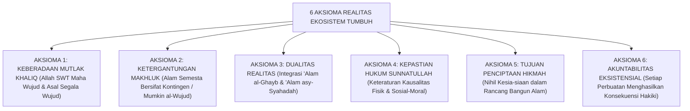

# P1-01-01-02: AKSIOMA-AKSIOMA REALITAS
## *Enam Prinsip Metafisik Baku Realitas dalam Epistemologi Islam dan Pembentukan Worldview Santri*

**Nomor Identifikasi**: `P1-01-01-02/AKSIOMA-REALITAS/2026`  
**Domain**: `01 Philosophy` > `01 Worldview` > `01 Hakikat Realitas`  
**Dewan Pakar**: `pakar-filosofi-tumbuh`, `pakar-epistemologi-turats`

---

## 📑 DAFTAR ISI ANALITIS

1. [1. Definisi dan Kedudukan Aksioma dalam Bangunan Filosofis](#1-definisi-dan-kedudukan-aksioma-dalam-bangunan-filosofis)
2. [2. Enam Aksioma Metafisik Realitas Ekosistem TUMBUH](#2-enam-aksioma-metafisik-realitas-ekosistem-tumbuh)
3. [3. Matriks Hubungan Kausalitas: Sunnatullah Kauniyyah vs Syar'iyyah](#3-matriks-hubungan-kausalitas-sunnatullah-kauniyyah-vs-syariyyah)
4. [4. Implikasi Aksioma bagi Pembentukan Pola Pikir (Mindset) Santri](#4-implikasi-aksioma-bagi-pembentukan-pola-pikir-mindset-santri)

---

### 1. Definisi dan Kedudukan Aksioma dalam Bangunan Filosofis

Dalam filsafat ilmu (*Philosophy of Science*), **Aksioma** adalah kebenaran swa-bukti (*self-evident truth*) yang menjadi premis dasar penalaran, tidak memerlukan pembuktian dari premis lain, dan tidak dapat dibantah tanpa meruntuhkan seluruh struktur logika di atasnya.

Ekosistem TUMBUH merumuskan **Enam Aksioma Realitas** sebagai pilar kepastian berpikir santri dan pendidik.

---

### 2. Enam Aksioma Metafisik Realitas Ekosistem TUMBUH

#### Aksioma 1: Keberadaan Mutlak Al-Khaliq (*Wajib al-Wujud*)
Allah SWT adalah satu-satunya Realitas Mutlak yang mandiri (*Al-Qayyum*), tidak berawal dan tidak berakhir (*Al-Awwal wal Akhir*). Segala sesuatu selain Allah adalah makhluk yang diciptakan dan dipelihara oleh-Nya (QS. Al-Ikhlas: 1–4).

#### Aksioma 2: Ketergantungan Total Makhluk (*Mumkin al-Wujud*)
Alam semesta tidak ada dengan sendirinya (*nihil self-creation*). Eksistensi santri, gedung pesantren, dan jagat raya berada dalam status kefakiran ontologis—bergantung sepenuhnya pada rahmat dan ketetapan Allah di setiap detik waktu (QS. Fathir: 15).

#### Aksioma 3: Dualitas Realitas Terpadu
Realitas tidak terbatas pada apa yang dapat dilihat mata atau ditimbang alat laboratorium (*anti-positivisme*). Alam ghaib (malaikat, takdir, pahala/dosa, akhirat) adalah realitas objektif yang sama nyatanya dengan alam fisik material (QS. Al-Baqarah: 2–3).

#### Aksioma 4: Kepastian Hukum Sunnatullah
Allah menciptakan alam semesta dengan hukum-hukum kausalitas yang teratur, presisi, dan tidak mengalami perubahan sembarangan (QS. Al-Fath: 23). Hukum gravitasi berlaku di alam fisik; dan hukum sunnatullah psikososial (kekerasan melahirkan trauma, kasih sayang melahirkan keterikatan aman) berlaku di alam interaksi manusia.

#### Aksioma 5: Tujuan Luhur Penciptaan (*Ghayah wa Hikmah*)
Tidak ada satu pun ciptaan Allah yang sia-sia (*Abathan / Bathila*). Allah berfirman:
$$\text{رَبَّنَا مَا خَلَقْتَ هَٰذَا بَاطِلًا سُبْحَانَكَ فَقِنَا عَذَابَ النَّارِ}$$
*"Ya Tuhan kami, tiadalah Engkau menciptakan semua ini sia-sia; Maha Suci Engkau, maka peliharalah kami dari siksa neraka."* (QS. Ali 'Imran: 191). Setiap potensi fitrah santri diciptakan untuk tujuan kemaslahatan yang agung.

#### Aksioma 6: Akuntabilitas Eksistensial
Segala amal perbuatan di alam syahadah memiliki hisab pertanggungjawaban yang mutlak di hadapan Mahkamah Ilahi:
$$\text{فَمَن يَعْمَلْ مِثْقَالَ ذَرَّةٍ خَيْرًا يَرَهُ ۝ وَمَن يَعْمَلْ مِثْقَالَ ذَرَّةٍ شَرًّا يَرَهُ}$$
*"Barang siapa yang mengerjakan kebaikan seberat dzarrah pun, niscaya dia akan melihat (balasan)nya; dan barang siapa yang mengerjakan kejahatan seberat dzarrah pun, niscaya dia akan melihat (balasan)nya."* (QS. Az-Zalzalah: 7–8).

---

### 3. Matriks Kausalitas: Sunnatullah Kauniyyah vs Syar'iyyah

| Dimensi Kausalitas | Definisi & Karakteristik | Contoh dalam Kehidupan Pesantren | Konsekuensi Pelanggaran |
| :--- | :--- | :--- | :--- |
| **Sunnatullah Kauniyyah (Hukum Alam Fisik)** | Hukum alam ciptaan Allah yang mengatur materi, biologi, dan psikofisik manusia. | Santri yang kurang tidur < 5 jam akan mengalami kelelahan otak dan daya ingat melemah. | Kerusakan fisik biologis dan kelumpuhan konsentrasi belajar. |
| **Sunnatullah Syar'iyyah (Hukum Syariat Moral)** | Tuntunan wahyu yang mengatur halal-haram, adab, dan kewajiban ibadah. | Kewajiban shalat fardhu tepat waktu dan larangan mengambil hak orang lain (*ghashab*). | Dosa ukhrawi, hilangnya keberkahan hidup, dan kegelisahan batin. |

---

### 4. Implikasi Aksioma bagi Mindset Santri TUMBUH

1. **Integritas Tanpa Pengawasan (*Muraqabah Reflex*)**: Berpijak pada Aksioma 1 dan 6, santri tidak membutuhkan polisi asrama untuk berbuat jujur; santri yakin bahwa Allah dan malaikat-Nya senantiasa mencatat amalnya.
2. **Keseimbangan Doa dan Ikhtiar**: Berpijak pada Aksioma 2 dan 4, santri menggabungkan ikhtiar belajar tekun sesuai kausalitas dengan ketundukan doa memohon taufiq Allah SWT.
3. **Pemberantasan Rasa Putus Asa (*Hope & Resilience*)**: Berpijak pada Aksioma 5, santri yakin bahwa setiap kesulitan dan ujian adaptasi pondok mengandung hikmah pendewasaan jiwa yang direncanakan Allah dengan penuh kasih sayang.
