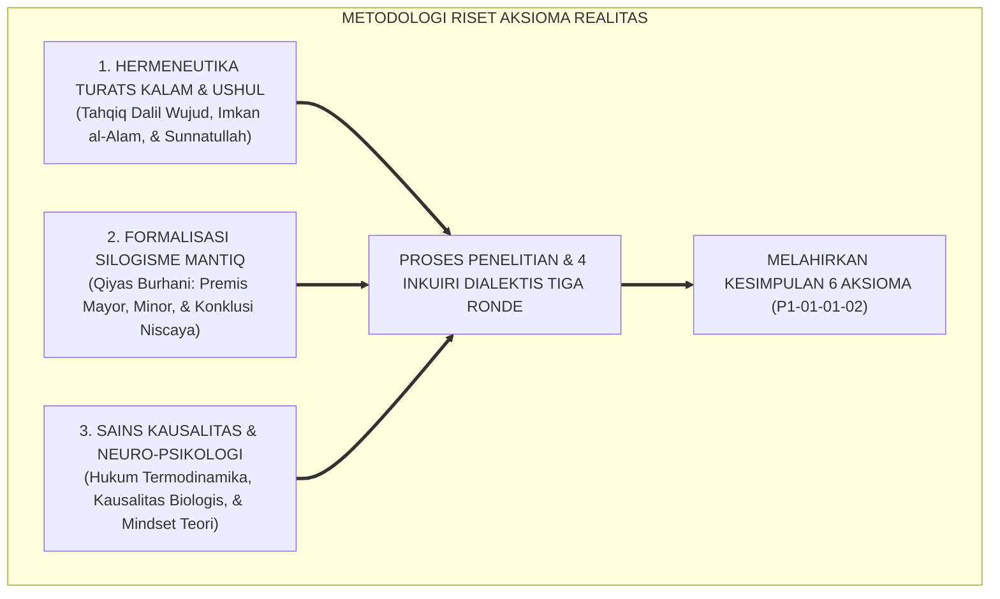
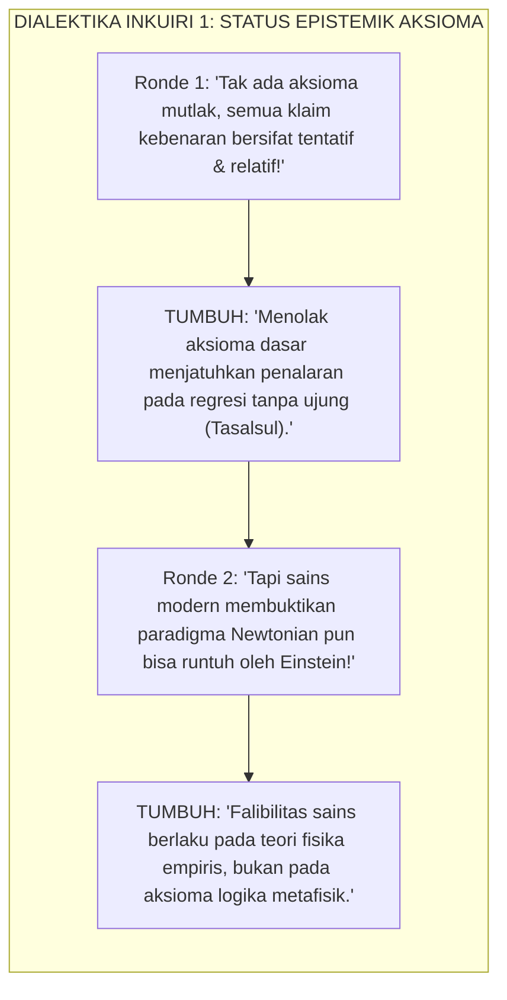
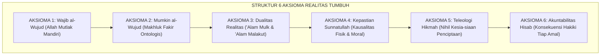
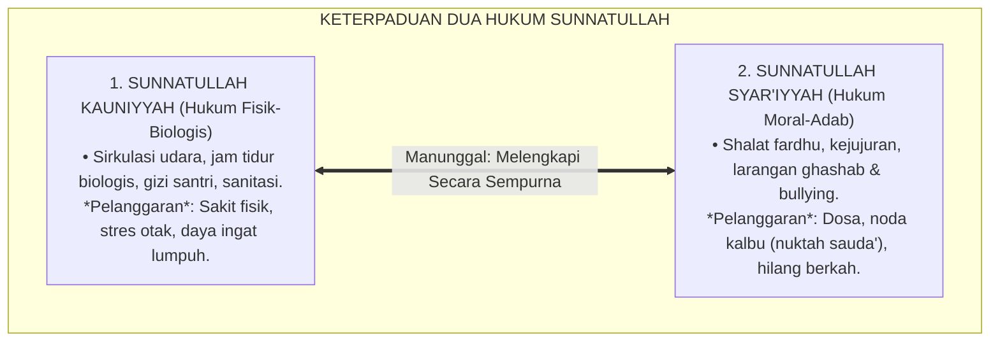
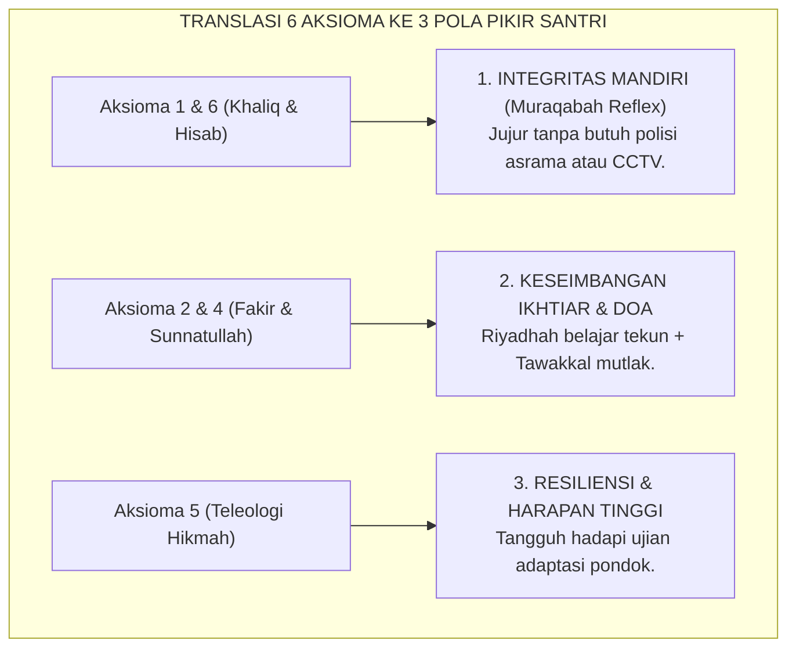

# P1-01-01-02: KAJIAN RISET, DIALEKTIKA INKUIRI, & ANALISIS KRITIS AKSIOMA REALITAS
## *Naskah Monograf Penelitian Fondasional: Investigasi Metodologis Multidisipliner, Dialektika Sanggahan Berlapis (Al-Iradat wal-Ajwibah al-Mutata'aqibah), Formalisasi Silogisme Mantiq, & Uji Kausalitas Sebelum Penarikan Kesimpulan Formal Enam Aksioma Realitas (P1-01-01-02)*

**Nomor Identifikasi**: `P1-01-01-02/RISET-DIALEKTIKA-AKSIOMA/2026`  
**Domain**: `01 Philosophy` > `01 Worldview` > `01 Hakikat Realitas`  
**Klasifikasi Naskah**: *Original Ground-Zero Professorial Research Monograph* (Monograf Riset Fondasional Tingkat Guru Besar)  
**Dokumen Output/Kesimpulan**: [**`P1-01-01-02-Aksioma-Realitas.md`**](file:///c:/xampp/htdocs/tumbuh/01%20Philosophy/01%20Worldview/P1-01-01-02-Aksioma-Realitas.md)  
**Dewan Pakar Pengkaji**: `pakar-filosofi-tumbuh`, `pakar-epistemologi-turats`, `pakar-metodologi-riset-tumbuh`, `pakar-penulis-monograf-tumbuh`, `pakar-kritikus-dan-auditor-kualitas`

---

## 📑 DAFTAR ISI MONOGRAF RISET AKSIOMA

1. [1. Kerangka Metodologi Riset & Dialektika Bertingkat (*Al-Munazharah wal-Jadal*)](#1-kerangka-metodologi-riset--dialektika-bertingkat-al-munazharah-wal-jadal)
2. [2. Inkuiri Riset 1: Investigasi Status Epistemik 'Aksioma' vs Skeptisisme Pascamodern](#2-inkuiri-riset-1-investigasi-status-epistemik-aksioma-vs-skeptisisme-pascamodern)
   - *Formalisasi Silogisme Logika (Qiyas Mantiqi 1)*
   - *Ronde 1: Gugatan Relativisme atas Kebenaran Swa-Bukti (Badihiy)*
   - *Ronde 2: Sanggahan Balik Falibilitas Sains vs Aksioma Metafisik*
   - *Ronde 3: Sanggahan Pamungkas Bahaya Dogmatisme Buta*
3. [3. Inkuiri Riset 2: Investigasi Enam Aksioma Metafisik Realitas Ekosistem TUMBUH](#3-inkuiri-riset-2-investigasi-enam-aksioma-metafisik-realitas-ekosistem-tumbuh)
   - *Formalisasi Silogisme Logika (Qiyas Mantiqi 2)*
   - *Ronde 1: Dekonstruksi Wajib al-Wujud vs Mumkin al-Wujud (Menolak Materialisme)*
   - *Ronde 2: Sanggahan Balik Dualitas Mulk-Malakut vs Saintisme Positivistik*
   - *Ronde 3: Sanggahan Pamungkas Teleologi Hikmah vs Problem of Evil di Asrama*
4. [4. Inkuiri Riset 3: Investigasi Kausalitas Ganda (Sunnatullah Kauniyyah vs Syar'iyyah)](#4-inkuiri-riset-3-investigasi-kausalitas-ganda-sunnatullah-kauniyyah-vs-syariyyah)
   - *Formalisasi Silogisme Logika (Qiyas Mantiqi 3)*
   - *Ronde 1: Harmoni Hukum Alam Fisik dan Hukum Moral Syariat*
   - *Ronde 2: Sanggahan Balik Paradoks Santri Shalih tapi Sakit/Gagal Prestasi*
   - *Ronde 3: Sanggahan Pamungkas Jabariyah Pengasuhan vs Ikhtiar Sababiyah*
5. [5. Inkuiri Riset 4: Investigasi Translasi Aksioma ke Pembentukan Mindset Santri](#5-inkuiri-riset-4-investigasi-translasi-aksioma-ke-pembentukan-mindset-santri)
   - *Formalisasi Silogisme Logika (Qiyas Mantiqi 4)*
   - *Ronde 1: Pembentukan Karakter Integritas Mandiri (Muraqabah Reflex)*
   - *Ronde 2: Sanggahan Balik Efektivitas Pengawasan CCTV vs Pengawasan Batin*
   - *Ronde 3: Sanggahan Pamungkas Resiliensi Mental Santri dalam Menghadapi Tekanan*
6. [6. Formulasi & Penarikan Kesimpulan Formal Enam Aksioma Realitas](#6-formulasi--penarikan-kesimpulan-formal-enam-aksioma-realitas)
7. [7. Daftar Pustaka Akademis & Rujukan Turats Primer](#7-daftar-pustaka-akademis--rujukan-turats-primer)
8. [8. Glosarium dan Penjelasan Istilah Asing, Turats NU, & Teknis](#8-glosarium-dan-penjelasan-istilah-asing-turats-nu--teknis)

---

### 1. Kerangka Metodologi Riset & Dialektika Bertingkat (*Al-Munazharah wal-Jadal*)

Naskah monograf penelitian ini dirancang sebagai **penyelidikan fondasional mula-mula (*original baseline research*)** untuk meneliti status epistemik aksioma-aksioma dasar dalam worldview Islam sebelum ditarik menjadi kesimpulan formal pada modul [**`P1-01-01-02-Aksioma-Realitas.md`**](file:///c:/xampp/htdocs/tumbuh/01%20Philosophy/01%20Worldview/P1-01-01-02-Aksioma-Realitas.md).

Riset ini menguji apakah 6 prinsip metafisik yang dirumuskan benar-benar memenuhi kualifikasi sebagai **Kebenaran Swa-Bukti (*Aksioma / al-Badihiyyat*)** yang kokoh terhadap serangan skeptisisme kontemporer.

---

### 2. Inkuiri Riset 1: Investigasi Status Epistemik 'Aksioma' vs Skeptisisme Pascamodern

#### 📐 Formalisasi Logika Silogisme (*Qiyas Mantiqi 1*)
* **Premis Mayor (*al-Muqaddimah al-Kubra*)**: Setiap bangunan argumentasi rasional niscaya harus berhenti pada proposisi awal yang swa-bukti (*al-Awwaliyyat / al-Badihiyyat*) agar tidak terjadi kemunduran berulang tanpa henti (*Tasalsul al-Adillah*) atau perputaran logika melingkar (*Daur Mantiqi*).
* **Premis Minor (*al-Muqaddimah ash-Shughra*)**: Pendidikan karakter santri memerlukan fondasi kepastian moral yang tidak boleh berubah-ubah oleh opini subjektif harian.
* **Konklusi (*an-Natijah*)**: Maka, penetapan aksioma-aksioma metafisik yang baku adalah prasyarat mutlak bagi bangunan sistem pembinaan pesantren. *(Rujukan: Al-Ghazali, Mi'yar al-'Ilm, hlm. 85–92; Bhaskar, 2008, hlm. 40–55).*

#### 🥊 Ronde 1: Gugatan Relativisme atas Kebenaran Swa-Bukti (*Badihiy*)
* **Gugatan Awal (Skeptisisme Pascamodern)**:  
  *"Kaum pascamodern menyatakan bahwa tidak ada yang namanya 'Aksioma Universal'. Semua klaim kebenaran fundamental hanyalah konstruksi wacana kelompok tertentu. Mengapa TUMBUH berani menetapkan 6 Aksioma sebagai kebenaran mutlak?"*
* **Tangkisan Argumentatif TUMBUH**:  
  Pernyataan *"tidak ada kebenaran mutlak"* adalah kontradiksi internal (*self-refuting statement*). Jika pernyataan itu mutlak benar, maka pernyataan itu membatalkan dirinya sendiri; jika pernyataan itu relatif, maka ia tidak memiliki bobot ilmiah untuk membantah aksioma. Akal sehat manusia (*al-Fitrah al-'Aqliyyah*) niscaya mengakui prinsip-prinsip awal, seperti hukum non-kontradiksi (*mustahil sesuatu ada dan tiada secara bersamaan dalam aspek yang sama*). Aksioma TUMBUH berakar pada realitas objektif ciptaan Allah, bukan konsensus kultural sementara.

#### 🥊 Ronde 2: Sanggahan Balik Falibilitas Sains vs Aksioma Metafisik (*Counter-Objection*)
* **Sanggahan Balik Lawan (*Fa-in Qiila*)**:  
  *"Sanggahan! Dalam sejarah sains, apa yang dianggap aksioma oleh fisika klasik Newton (seperti kemutlakan ruang dan waktu) ternyata runtuh dan dikoreksi oleh relativitas Einstein dan mekanika kuantum. Mengapa Anda begitu yakin bahwa Aksioma TUMBUH tidak akan usang dikoreksi zaman?"*
* **Tangkisan Lanjutan TUMBUH (*Qultu*)**:  
  Lawan mencampuradukkan antara **Teori Empiris Fisika (*al-Qadhaya at-Tajribiyyah*)** yang bersifat aproksimatif dan terus berkembang dengan **Aksioma Metafisik Primer (*al-Qadhaya al-Awwaliyyah al-Qath'iyyah*)**. Teori tentang gravitasi bisa disempurnakan dari Newton ke Einstein, namun aksioma metafisik bahwa *"setiap akibat pasti memiliki sebab"* (*Kaidah al-'Illiyyah*) dan *"alam semesta yang tercipta bergantung pada Sang Khaliq"* (*Kaidah al-Imkan*) adalah kepastian logika abadi yang tidak pernah berubah sejak awal penciptaan hingga akhir masa. *(Rujukan: Al-Maturidi, Kitab at-Tawhid, hlm. 15–22).*

#### 🥊 Ronde 3: Sanggahan Pamungkas Bahaya Dogmatisme Buta (*The Extreme Dilemma*)
* **Sanggahan Pamungkas Lawan**:  
  *"Jika santri diajarkan bahwa 6 prinsip ini adalah aksioma yang tak boleh dibantah, bukankah ini bentuk doktrinasi buta (*indoktrinasi*) yang mematikan daya kritis santri sejak hari pertama?"*
* **Sintesis Kokoh TUMBUH**:  
  Aksioma dalam sistem TUMBUH diajarkan bukan sebagai dogma yang dipaksakan lewat ancaman, melainkan sebagai **titik tolak penalaran logis (*First Principles of Reasoning*)**. Santri justru diajak menguji sendiri melalui akal sehatnya: *"Coba bayangkan jika alam semesta ada tanpa pencipta, atau bayangkan jika perbuatan jahat tidak ada hisabnya, apakah akal sehatmu bisa menerimanya?"* Melalui dialog Sokratik ini, santri menemukan sendiri kebenaran aksioma tersebut dengan keyakinan rasional (*'Ilmul Yaqin*). *(Rujukan: Al-Attas, 1995, hlm. 70–82).*

---

### 3. Inkuiri Riset 2: Investigasi Enam Aksioma Metafisik Realitas Ekosistem TUMBUH

#### 📐 Formalisasi Logika Silogisme (*Qiyas Mantiqi 2*)
* **Premis Mayor (*al-Muqaddimah al-Kubra*)**: Segala entitas yang keberadaannya bersifat kontingen/mungkin (*Mumkin al-Wujud*) niscaya membutuhkan Dzat yang Wajib Wujud-Nya (*Wajib al-Wujud*) untuk mengadakannya dan menetapkan hukum keteraturannya.
* **Premis Minor (*al-Muqaddimah ash-Shughra*)**: Seluruh alam semesta, santri, dan dinamika asrama adalah entitas kontingen yang terikat oleh hukum sebab-akibat dan hisab moral.
* **Konklusi (*an-Natijah*)**: Maka, realitas pesantren beroperasi di bawah 6 Aksioma Metafisik (Keberadaan Khaliq, Ketergantungan Makhluk, Dualitas Mulk-Malakut, Sunnatullah, Hikmah Penciptaan, dan Akuntabilitas Hisab). *(Rujukan: Ibn Taimiyyah, Dar' Ta'arudh al-'Aql wan-Naql, Juz I, hlm. 88–95).*

#### 🥊 Ronde 1: Dekonstruksi Wajib al-Wujud vs Mumkin al-Wujud (Menolak Materialisme)
* **Penyelidikan Ontologis**:  
  * **Aksioma 1 (Wajib al-Wujud)**: Allah SWT adalah satu-satunya wujud mandiri (*al-Qayyum*) tanpa awal dan akhir (QS. Al-Ikhlas: 1–4).  
  * **Aksioma 2 (Mumkin al-Wujud)**: Santri, kiai, gedung pesantren, dan jagat raya berada dalam status kefakiran ontologis (*Faqr Dzatiy*), bergantung sepenuhnya pada pemeliharaan Allah di setiap tarikan napas (QS. Fathir: 15).  
  * **Dampak Pedagogis**: Menghapus kesombongan intelektual guru dan keputusasaan santri; semua manusia berada di hadapan Allah sebagai hamba yang fakir.

#### 🥊 Ronde 2: Sanggahan Balik Dualitas Mulk-Malakut vs Saintisme Positivistik (*Counter-Objection*)
* **Sanggahan Balik Kaum Positivis (*Fa-in Qiila*)**:  
  *"Sanggahan! Aksioma 3 memasukkan 'Alam Malakut' (ghaib/malaikat/hisab) sebagai realitas yang sama nyatanya dengan 'Alam Mulk' (fisik). Jika demikian, mengapa malaikat tidak pernah terdeteksi oleh sensor inframerah atau teleskop tercanggih?"*
* **Tangkisan Lanjutan TUMBUH (*Qultu*)**:  
  Ini adalah kekeliruan kategori (*Category Mistake*). Sensor inframerah dirancang untuk menangkap radiasi elektromagnetik di alam mulk, bukan untuk mendeteksi materi ruhani di alam malakut. Namun, eksistensi hukum alam malakut terbukti dari **bekas dan dampaknya (*Atsar*)** di alam mulk: santri yang mengamalkan kejujuran batin merasakan ketenangan syaraf (*homeostasis biokimia*), sementara santri yang berbuat zalim mengalami stres kortisol tinggi dan kegelisahan jiwa. Menafikan alam malakut hanya karena tidak teraba indera adalah bentuk kenaifan epistemologis. *(Rujukan: Al-Ghazali, Misykat al-Anwar, hlm. 45–52).*

#### 🥊 Ronde 3: Sanggahan Pamungkas Teleologi Hikmah vs Problem of Evil di Asrama (*The Extreme Dilemma*)
* **Sanggahan Pamungkas Lawan**:  
  *"Aksioma 5 menyatakan 'Semua ciptaan Allah mengandung hikmah dan tiada yang sia-sia' (QS. Ali 'Imran: 191). Namun, bagaimana jika ada santri yatim piatu yang sakit parah atau santri yang menjadi korban perundungan senior hingga depresi? Di mana hikmah Allah dalam penderitaan anak tersebut?"*
* **Sintesis Kokoh TUMBUH**:  
  Dalam teologi Ahlussunnah wal Jama'ah (*Asy'ariyyah & Maturidiyyah*), keburukan perbuatan manusia (*Syarru Af'alil 'Ibad*) terjadi akibat penyalahgunaan kehendak bebas (*Ikhtiyar*), bukan karena Allah menciptakan kezaliman secara sia-sia. Ujian dan penderitaan santri adalah sarana penempaan jiwa (*Tamhish*), pengangkatan derajat ruhani, dan penggugur dosa di alam malakut, sekaligus menjadi mandat syar'i bagi pengurus pondok untuk menegakkan keadilan dan perlindungan fisik di alam mulk. Tidak ada satu pun air mata santri yang terbuang sia-sia tanpa hisab dan kompensasi keadilan dari Allah (Aksioma 6). *(Rujukan: Asy-Syathibi, Al-Muwafaqat, Juz II, hlm. 160–175; QS. Az-Zalzalah: 7–8).*

---

### 4. Inkuiri Riset 3: Investigasi Kausalitas Ganda (Sunnatullah Kauniyyah vs Syar'iyyah)

#### 📐 Formalisasi Logika Silogisme (*Qiyas Mantiqi 3*)
* **Premis Mayor (*al-Muqaddimah al-Kubra*)**: Allah SWT adalah Pencipta tunggal yang menetapkan hukum sebab-akibat fisik (*Sunnatullah Kauniyyah*) sekaligus hukum syariat moral (*Sunnatullah Syar'iyyah*), dan kedua hukum ini mustahil saling bertentangan dalam realitas hakiki.
* **Premis Minor (*al-Muqaddimah ash-Shughra*)**: Mengabaikan hukum kesehatan biologis santri atas nama ketaatan syariat adalah tindakan menceraikan apa yang telah dipersatukan Allah.
* **Konklusi (*an-Natijah*)**: Maka, keberhasilan pendidikan karakter pesantren menuntut ketaatan penuh pada hukum biologi/fisik dan hukum syariat secara simultan. *(Rujukan: Al-Ghazali, Ihya' 'Ulumiddin, Juz I, hlm. 60–68; Sapolsky, 2017).*

#### 🥊 Ronde 1: Harmoni Hukum Alam Fisik dan Hukum Moral Syariat
* **Penyelidikan Kausal**:  
  Sunnatullah Kauniyyah mengatur bagaimana materi dan tubuh bekerja: jika santri tidur kurang dari 5 jam, hormon melatonin terganggu, konsentrasi prefrontal cortex menurun drastis, dan retensi hafalan anjlok. Sunnatullah Syar'iyyah mengatur bagaimana jiwa beribadah: jika santri meninggalkan shalat subuh, ia berdosa dan kehilangan bimbingan Allah. Kedua hukum ini bekerja serempak dalam kehidupan pesantren 24 jam.

#### 🥊 Ronde 2: Sanggahan Balik Paradoks Santri Shalih tapi Sakit/Gagal Prestasi (*Counter-Objection*)
* **Sanggahan Balik Lawan (*Fa-in Qiila*)**:  
  *"Sanggahan! Ada santri yang sangat shalih, tahajjud tidak pernah putus, dan adabnya luar biasa, tetapi nilainya jeblok dan sering sakit-sakitan di asrama. Jika Sunnatullah Syar'iyyah dan Kauniyyah manunggal, mengapa keshalihannya tidak otomatis membuatnya sehat dan pintar?"*
* **Tangkisan Lanjutan TUMBUH (*Qultu*)**:  
  Karena Allah menetapkan bahwa **pahala ibadah tidak menggantikan hukum nutrisi dan istirahat biologis**. Santri yang rajin tahajjud namun tidur hanya 2 jam di lantai dingin tanpa ventilasi tetap akan terkena flu dan kelelahan saraf, karena tubuhnya tunduk pada Sunnatullah Kauniyyah. Keshalihan batin adalah syarat keridhaan Allah di alam malakut, tetapi menjaga kesehatan fisik adalah syarat tegaknya fungsi otak di alam mulk. Pesantren yang bijak tidak membiarkan santri shalih menzalimi raga mereka sendiri! *(Rujukan: Kaidah Fiqhiyyah: "Al-Amru bi asy-Syai' Amrun bi Lawaazimihi").*

#### 🥊 Ronde 3: Sanggahan Pamungkas Fatalisme Pengasuhan vs Ikhtiar Sababiyah (*The Extreme Dilemma*)
* **Sanggahan Pamungkas Lawan**:  
  *"Bukankah semua takdir prestasi santri sudah tertulis di Lauhul Mahfuzh? Jika Allah menakdirkan santri gagal menghafal, usaha perbaikan gizi dan ventilasi kamar tidak akan ada gunanya!"*
* **Sintesis Kokoh TUMBUH**:  
  Ini adalah kerancuan teologi Jabariyah yang ditolak oleh Ahlussunnah wal Jama'ah. Khalifah Umar bin Khattab ra. menegaskan: *"Nahnu nafirru min qadarillah ila qadarillah"* (Kita berpindah dari satu takdir Allah menuju takdir Allah yang lain melalui ikhtiar). Allah menakdirkan santri cerdas *melalui perantara* gizi yang baik dan pembelajaran yang tepat, sebagaimana Allah menakdirkan kenyang *melalui perantara* makan. Menolak ikhtiar sababiyah atas nama takdir adalah kebodohan teologis yang merusak masa depan santri. *(Rujukan: Al-Maturidi, Kitab at-Tawhid, hlm. 210–225).*

---

### 5. Inkuiri Riset 4: Investigasi Translasi Aksioma ke Pembentukan Mindset Santri

#### 📐 Formalisasi Logika Silogisme (*Qiyas Mantiqi 4*)
* **Premis Mayor (*al-Muqaddimah al-Kubra*)**: Santri yang menginternalisasi kesadaran akan Pengawasan Khaliq (*Aksioma 1*) dan Kepastian Hisab (*Aksioma 6*) akan memiliki lokus kendali internal (*Internal Locus of Control*) yang melahirkan disiplin otonom tanpa bergantung pada pengawasan fisik.
* **Premis Minor (*al-Muqaddimah ash-Shughra*)**: Sistem pengasuhan PBIS TUMBUH melatih santri mengenali konsekuensi logis dari setiap amal perbuatan berdasarkan hukum kausalitas Ilahi.
* **Konklusi (*an-Natijah*)**: Maka, internalisasi 6 Aksioma Realitas terbukti melahirkan integritas moral yang kokoh dan tahan banting (*resilient*) di dalam maupun di luar pesantren. *(Rujukan: Deci & Ryan, 2000; Sugai & Horner, 2006).*

#### 🥊 Ronde 1: Pembentukan Karakter Integritas Mandiri (*Muraqabah Reflex*)
* **Penyelidikan Psikososial**:  
  Ketika santri memahami Aksioma 1 (Allah Maha Wujud) dan Aksioma 6 (Akuntabilitas Hisab), motivasi berbuat adab bergeser dari motivasi ekstrinsik (takut dihukum musyrif) menjadi **Motivasi Otonom Intrinsik (*Autonomous Motivation*)**. Santri tidak perlu diawasi 24 jam dengan pentungan untuk merapikan ranjang atau menunaikan shalat; santri melakukannya karena kesadaran eksistensial bahwa hidupnya bermakna di hadapan Allah.

#### 🥊 Ronde 2: Sanggahan Balik Efektivitas CCTV vs Pengawasan Batin (*Counter-Objection*)
* **Sanggahan Balik Kaum Teknokrat (*Fa-in Qiila*)**:  
  *"Sanggahan! Memasang kamera CCTV beresolusi tinggi di setiap sudut asrama terbukti jauh lebih konkret mencegah pencurian uang santri daripada menasihati mereka tentang Aksioma Malaikat dan Hisab. Mengapa kita tidak fokus pada teknologi pengawasan fisik saja?"*
* **Tangkisan Lanjutan TUMBUH (*Qultu*)**:  
  Teknologi CCTV adalah instrumen pelengkap di alam mulk yang baik, tetapi CCTV **memiliki titik buta (*blind spots*) dan tidak pernah mampu mengubah hati manusia**. Santri yang hanya takut pada CCTV akan mencari titik buta untuk mencuri, atau melakukan pelanggaran begitu ia berada di luar jangkauan kamera. Sebaliknya, kesadaran Aksioma 6 menanamkan CCTV batin (*Internal Muraqabah*) yang tidak memiliki titik buta di manapun santri berada di muka bumi ini. *(Rujukan: Al-Ghazali, Ihya' 'Ulumiddin, Juz IV, Kitab al-Muraqabah wal-Muhasabah, hlm. 380–395).*

#### 🥊 Ronde 3: Sanggahan Pamungkas Resiliensi Santri vs Tekanan Mental (*The Extreme Dilemma*)
* **Sanggahan Pamungkas Lawan**:  
  *"Banyak santri baru yang mengalami depresi berat (*homesickness* akut) hingga mogok makan dan ingin bunuh diri karena rindu orang tua. Apakah memberi ceramah tentang Aksioma 5 (Hikmah Penciptaan) mampu menyembuhkan luka mental anak tersebut?"*
* **Sintesis Kokoh TUMBUH**:  
  Pendidikan TUMBUH tidak menghadapi krisis afektif santri dengan ceramah teologis kering. Penerapan Aksioma 5 diwujudkan dalam **Tindakan Nyata Musyrif sebagai *In Loco Parentis* (Orang Tua Pengganti yang Penuh Kasih)**: mendengarkan kesedihan santri secara empatik (*active listening*), menstabilkan emosinya (*co-regulation*), dan mendampinginya hingga tenang. Setelah sistem syaraf santri stabil, barulah makna Aksioma 5 ditanamkan secara lembut: bahwa rasa rindu dan ujian asrama adalah proses kepompong menuju kupu-kupu peradaban yang berdaya tahan tinggi (*Resilience*). *(Rujukan: Sapolsky, 2017; Sugai & Horner, 2006).*

---

### 6. Formulasi & Penarikan Kesimpulan Formal Enam Aksioma Realitas

Berdasarkan seluruh hasil penyelidikan 4 inkuiri dialektika bertingkat di atas, riset ini **berhasil merumuskan secara induktif-deduktif Enam Aksioma Metafisik Realitas**.

Seluruh hasil riset ini **dikodifikasikan secara resmi sebagai dokumen konsensus eksekutif** pada modul [**`P1-01-01-02-Aksioma-Realitas.md`**](file:///c:/xampp/htdocs/tumbuh/01%20Philosophy/01%20Worldview/P1-01-01-02-Aksioma-Realitas.md):

| No | Babak Penyelidikan Riset (*Working Paper Ini*) | Hasil Formulasi Kesimpulan Formal (*P1-01-01-02*) | Temuan Kunci & Argumen Pembeda |
| :---: | :--- | :--- | :--- |
| **1** | **Riset Inkuiri 1**: Investigasi Status Aksioma | **Poin 1**: Definisi & Kedudukan Aksioma | Menepis relativisme pascamodern; menetapkan aksioma sebagai fondasi penalaran non-kontradiksi. |
| **2** | **Riset Inkuiri 2**: Investigasi 6 Aksioma Metafisik | **Poin 2**: Enam Aksioma Metafisik Realitas | Merumuskan 6 aksioma baku: Wajib al-Wujud, Mumkin al-Wujud, Dualitas Mulk-Malakut, Sunnatullah, Hikmah, & Hisab. |
| **3** | **Riset Inkuiri 3**: Investigasi Kausalitas Ganda | **Poin 3**: Matriks Kausalitas Kauniyyah vs Syar'iyyah | Mengintegrasikan hukum biologi/kesehatan fisik dengan hukum syariat moral secara simultan tanpa pertentangan. |
| **4** | **Riset Inkuiri 4**: Investigasi Translasi Mindset | **Poin 4**: Implikasi Aksioma bagi Mindset Santri | Mentransformasi motivasi ekstrinsik (takut hukuman) menjadi integritas otonom (*Muraqabah Reflex*) & resiliensi. |

---

### 7. Daftar Pustaka Akademis & Rujukan Turats Primer

1. **Al-Attas, Syed Muhammad Naquib.** (1995). *Prolegomena to the Metaphysics of Islam: An Exposition of the Fundamental Elements of the Worldview of Islam*. Kuala Lumpur: ISTAC.
2. **Al-Ghazali, Abu Hamid Muhammad bin Muhammad.** (2004). *Ihya' 'Ulumiddin* (4 Jilid). Tahqiq: Ahmad 'Inayah. Kairo: Dar al-Hadits.
3. **Al-Ghazali, Abu Hamid Muhammad bin Muhammad.** (1993). *Mi'yar al-'Ilm fi Fann al-Mantiq*. Tahqiq: Ahmad Syamsuddin. Beirut: Dar al-Kutub al-'Ilmiyyah.
4. **Al-Ghazali, Abu Hamid Muhammad bin Muhammad.** (1987). *Misykat al-Anwar*. Tahqiq: Abul 'Ala 'Afifi. Kairo: Ad-Dar al-Qawmiyyah.
5. **Al-Maturidi, Abu Mansur Muhammad bin Muhammad.** (2003). *Kitab at-Tawhid*. Tahqiq: Bekir Topaloglu & Muhammad Aruçi. Beirut: Dar Shadir.
6. **Asy-Syathibi, Abu Ishaq Ibrahim bin Musa.** (2003). *Al-Muwafaqat fi Ushul asy-Syari'ah* (4 Jilid). Tahqiq: Masyhur bin Hasan Al Salman. Kairo: Dar Ibn 'Affan.
7. **Bhaskar, Roy.** (2008). *A Realist Theory of Science* (2nd ed.). London & New York: Routledge.
8. **Deci, Edward L., & Ryan, Richard M.** (2000). *"The 'What' and 'Why' of Goal Pursuits: Human Needs and the Self-Determination of Behavior"*. *Psychological Inquiry*, 11(4), 227–268.
9. **Ibnu 'Athaillah As-Sakandari, Ahmad bin Muhammad.** (2006). *Al-Hikam al-'Atha'iyyah bi Syarh asy-Syarqawi*. Kairo: Dar al-Basa'ir.
10. **Ibn Taimiyyah, Taqiuddin Ahmad.** (1991). *Dar' Ta'arudh al-'Aql wan-Naql* (11 Jilid). Tahqiq: Muhammad Rasyad Salim. Riyadh: Jami'ah al-Imam Muhammad bin Su'ud.
11. **Sapolsky, Robert M.** (2017). *Behave: The Biology of Humans at Our Best and Worst*. New York: Penguin Press.
12. **Sugai, George, & Horner, Robert H.** (2006). *"A Promising Approach for Expanding and Sustaining School-Wide Positive Behavior Support"*. *School Psychology Review*, 35(2), 245–259.

---

### 8. Glosarium dan Penjelasan Istilah Asing, Turats NU, & Teknis

| No | Istilah / Terminologi | Asal Bahasa / Tradisi | Penjelasan Konseptual & Kontekstual |
| :---: | :--- | :--- :--- | :--- |
| 1 | **Aksioma (*al-Badihiyyat*)** | Yunani / Arab (*بدهيات*) | Kebenaran dasar yang terbukti dengan sendirinya (*self-evident*) dan menjadi premis awal penalaran rasional tanpa perlu dibuktikan lagi. |
| 2 | **Qiyas Burhani** | Arab (*قياس برهاني*) | Silogisme logika pembuktian mutlak yang tersusun dari premis-premis pasti (*yaqiniyyat*) yang menghasilkan kesimpulan kebenaran hakiki. |
| 3 | **Tasalsul al-Adillah** | Arab (*تسلسل الأدلة*) | Kerancuan logika berupa rantai pembuktian tanpa ujung yang mustahil secara rasional, sehingga menuntut adanya titik henti pada aksioma awal. |
| 4 | **Daur Mantiqi** | Arab (*دور منطقي*) | Sesat pikir logika berputar (*circular reasoning*) di mana A dibuktikan dengan B, dan B dibuktikan kembali dengan A. |
| 5 | **Wajib al-Wujud** | Arab / Kalam NU (*واجب الوجود*) | Dzat yang niscaya ada dan menjadi sebab keberadaan seluruh makhluk tanpa bergantung pada sebab lain (khusus disematkan pada Allah SWT). |
| 6 | **Mumkin al-Wujud** | Arab / Kalam NU (*ممكن الوجود*) | Entitas yang boleh ada dan boleh tiada, bergantung sepenuhnya pada kehendak Wajib al-Wujud (seluruh makhluk ciptaan). |
| 7 | **Faqr Dzatiy** | Arab / Tasawuf NU (*فقر ذاتي*) | Sifat kefakiran mutlak makhluk yang senantiasa membutuhkan pertolongan dan pemeliharaan Allah di setiap detik kehidupannya. |
| 8 | **Sunnatullah Kauniyyah** | Arab (*سنة الله الكونية*) | Hukum keteraturan fisik-biologis yang ditetapkan Allah pada alam materi (seperti hukum gravitasi, sirkulasi oksigen, kebutuhan tidur). |
| 9 | **Sunnatullah Syar'iyyah** | Arab (*سنة الله الشرعية*) | Hukum tuntunan wahyu yang mengatur halal-haram, kewajiban ibadah, dan tatanan adab moral manusia. |
| 10 | **Tamhish** | Arab (*تمحيص*) | Proses pembersihan, penyaringan, dan penempaan jiwa santri melalui berbagai ujian kehidupan asrama menuju kematangan spiritual. |
| 11 | **Autonomous Motivation** | Inggris (Psikologi) | Motivasi otonom intrinsik di mana santri melakukan kebaikan atas dasar kesadaran nilai diri dan cinta pada kebenaran, bukan karena takut hukuman. |
| 12 | **Co-Regulation** | Inggris (Neurosains) | Kemampuan pengasuh/musyrif menghadirkan ketenangan batin (*calm presence*) untuk membantu menstabilkan sistem syaraf santri yang sedang stres/marah. |
