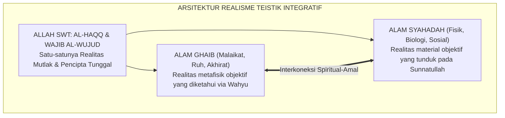

# P1-01-01-05: SINTESIS FILOSOFIS HAKIKAT REALITAS
## *Konsolidasi Ontologi Realisme Teistik Integratif: Posisi Resmi Worldview Ekosistem TUMBUH*

**Nomor Identifikasi**: `P1-01-01-05/SINTESIS-REALITAS/2026`  
**Domain**: `01 Philosophy` > `01 Worldview` > `01 Hakikat Realitas`  
**Dewan Pakar**: `pakar-filosofi-tumbuh`, `pakar-epistemologi-turats`

---

## 📑 DAFTAR ISI ANALITIS

1. [1. Deklarasi Posisi Filosofis Resmi TUMBUH](#1-deklarasi-posisi-filosofis-resmi-tumbuh)
2. [2. Empat Pilar Ontologi Realisme Teistik Integratif](#2-empat-pilar-ontologi-realisme-teistik-integratif)
3. [3. Matriks Komparasi: Realisme TUMBUH vs Aliran Ontologi Barat](#3-matriks-komparasi-realisme-tumbuh-vs-aliran-ontologi-barat)
4. [4. Implikasi Integratif bagi Tata Kelola Ekosistem Pesantren](#4-implikasi-integratif-bagi-tata-kelola-ekosistem-pesantren)

---

### 1. Deklarasi Posisi Filosofis Resmi TUMBUH

Berdasarkan sintesis antara wahyu sharih Al-Qur'an dan As-Sunnah, konsensus *Turats* para ulama mu'tabar, penalaran rasional kritis, serta temuan sains empiris yang selaras dengan syariat, Ekosistem TUMBUH mendeklarasikan posisi filosofis resminya:

> **"Realitas (*al-Haqiqah / al-Wujud*) adalah tatanan ciptaan Allah SWT yang objektif, utuh, teratur (*Sunnatullah*), dan sarat hikmah, yang mencakup dimensi alam fisik (*asy-Syahadah*) dan metafisik (*al-Ghayb*), yang menjadi panggung kosmis bagi santri untuk mengenal Allah (*Ma'rifatullah*), menyucikan fitrahnya (*Tazkiyah*), dan menunaikan amanah khilafah demi mewujudkan kemaslahatan semesta (*Rahmatan lil 'Alamin*)."**

---

### 2. Empat Pilar Ontologi Realisme Teistik Integratif

1. **Pilar Teosentrisme Hakiki**: Menegaskan bahwa Allah adalah poros dan muara dari seluruh wujud (*Inna lillahi wa inna ilaihi raji'un*). Segala aktivitas pendidikan di pesantren wajib bermuara pada keridhaan-Nya.
2. **Pilar Realisme Epistemologis**: Mengakui bahwa alam semesta dan hukum-hukumnya nyata, bukan ilusi indrawi (*bukan solipsisme*), dan dapat diketahui kebenarannya oleh akal budi manusia.
3. **Pilar Keteraturan Kosmis (*Cosmic Order / Sunnatullah*)**: Menolak pandangan kebetulan acak (*randomness*). Segala dinamika asrama memiliki hukum kausalitas yang dapat direkayasa secara ilmiah dan terencana (*Environmental Engineering*).
4. **Pilar Teleologi Makna (*Purposefulness*)**: Menolak nihilisme eksistensial. Kehidupan santri di pondok memiliki tujuan agung dan pertanggungjawaban abadi.

---

### 3. Matriks Komparasi Ontologis

| Aliran Filsafat | Pandangan atas Realitas | Pandangan atas Alam Ghaib | Dampak pada Pendidikan |
| :--- | :--- | :--- | :--- |
| **Materialisme Positivistik** | Hanya materi fisik dan data empiris laboratorium. | Ilusi tak bermakna, ditolak total. | Mereduksi manusia menjadi robot ekonomi; kehampaan ruhani. |
| **Idealisme Radikal** | Realitas hanyalah ide/pikiran manusia semata. | Terjebak dalam spekulasi abstrak tanpa bukti. | Mengabaikan kenyataan fisik, sains empiris, dan manajemen logistik. |
| **Relativisme Postmodern** | Tidak ada realitas objektif; realitas adalah konstruksi bahasa. | Menafikan kebenaran mutlak agama. | Anarki moral, hilangnya standar adab, dan kebingungan nilai. |
| **Realisme Teistik TUMBUH** | **Integrasi utuh ciptaan Allah: Alam Ghaib + Alam Syahadah.** | **Realitas objektif yang diimani melalui wahyu sharih.** | **Pendidikan seimbang: kokoh akidahnya, cemerlang sainsnya, luhur adabnya.** |

---

### 4. Implikasi Integratif bagi Tata Kelola Pesantren

1. **Penyelarasan Seluruh Aktivitas dengan Tauhid**: Manajemen asrama, kurikulum kelas, dan interaksi kantin diposisikan sebagai ladang ibadah nyata.
2. **Pendidikan Berpikir Berbasis Bukti & Wahyu**: Santri dilatih untuk selalu memverifikasi fakta (*Tabayyun*) dan menolak hoaks, takhayul, maupun mitos feodal.
3. **Penciptaan Bi'ah yang Mendukung Visi Kosmis**: Merancang lingkungan pesantren yang memancarkan keteraturan, kebersihan, dan keindahan sebagai cermin dari sifat Allah Yang Maha Indah (*Inna Allaha Jamilun Yuhibbul Jamal*).
