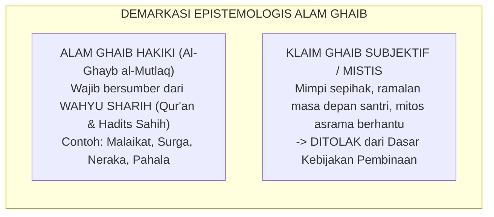

# P1-01-01-06: KRITIK INTERNAL DAN UJI KETAHANAN ONTOLOGIS
## *Evaluasi Kritis Asumsi Metafisik, Deteksi Potensi Bias Logika, dan Pertanggungjawaban Ilmiah Hakikat Realitas TUMBUH*

**Nomor Identifikasi**: `P1-01-01-06/KRITIK-INTERNAL/2026`  
**Domain**: `01 Philosophy` > `01 Worldview` > `01 Hakikat Realitas`  
**Dewan Pakar**: `pakar-kritikus-dan-auditor-kualitas`, `pakar-filosofi-tumbuh`, `pakar-epistemologi-turats`

---

## 📑 DAFTAR ISI ANALITIS

1. [1. Metodologi Uji Kritis Internal (Falsifikasi & Koherensi)](#1-metodologi-uji-kritis-internal-falsifikasi--koherensi)
2. [2. Uji Kritis 1: Batasan antara Realitas Ghaib vs Imajinasi/Khayalan](#2-uji-kritis-1-batasan-antara-realitas-ghaib-vs-imajinasikhayalan)
3. [3. Uji Kritis 2: Masalah Kejahatan (The Problem of Evil) dalam Ekosistem Asrama](#3-uji-kritis-2-masalah-kejahatan-the-problem-of-evil-dalam-ekosistem-asrama)
4. [4. Uji Kritis 3: Determinisme Takdir vs Kehendak Bebas Santri (Ikhtiar)](#4-uji-kritis-3-determinisme-takdir-vs-kehendak-bebas-santri-ikhtiar)
5. [5. Uji Kritis 4: Risiko Sakralisasi Kebijakan Manajemen](#5-uji-kritis-4-risiko-sakralisasi-kebijakan-manajemen)
6. [6. Kesimpulan Hasil Audit Kualitas Ontologis](#6-kesimpulan-hasil-audit-kualitas-ontologis)

---

### 1. Metodologi Uji Kritis Internal

Prinsip dasar filsafat ilmu menyatakan: *"Sebuah teori yang kuat bukanlah teori yang kebal dari pertanyaan, melainkan teori yang telah diuji melalui kritik internal paling tajam dan terbukti kokoh tanpa kontradiksi."*

Audit ontologis TUMBUH menerapkan empat instrumen pengujian:
1. **Uji Bebas Kontradiksi (*Non-Contradiction Test*)**: Memastikan tidak ada pertentangan logis antara satu aksioma dengan aksioma lainnya.
2. **Uji Kejelasan Batas Konsep (*Conceptual Demarcation Test*)**: Memastikan seluruh istilah terdefinisi secara presisi.
3. **Uji Konsekuensi Aksiologis (*Pragmatic Coherence Test*)**: Menguji apakah asumsi filosofis dapat diterapkan secara adil di asrama nyata.
4. **Uji Validitas Syar'i**: Memastikan tidak ada penyusupan teologi sesat (seperti Jabariyyah fatalistik atau Qadariyyah ekstrem).

---

### 2. Uji Kritis 1: Batasan Realitas Ghaib vs Khayalan

#### Pertanyaan Kritis:
Jika TUMBUH menyatakan realitas mencakup hal ghaib, bagaimana membedakan antara realitas ghaib yang hakiki dengan takhayul, klaim mistis sepihak guru, atau waham/halusinasi santri?

#### Jawaban & Solusi Metodologis TUMBUH:
TUMBUH menetapkan **Prinsip Demarkasi Wahyu**: Hanya hal ghaib yang disebutkan secara tegas dalam nash Al-Qur'an dan Hadits Sahih yang diakui sebagai realitas ontologis pembinaan. Klaim mimpi subjektif, firasat guru, atau mitos mistis **dilarang keras dijadikan dasar pengambilan keputusan disiplin santri**.

---

### 3. Uji Kritis 2: Masalah Kejahatan (The Problem of Evil) di Asrama

#### Pertanyaan Kritis:
Jika seluruh realitas diciptakan Allah dengan keteraturan dan hikmah luhur (Aksioma 5), mengapa masih terjadi kasus perundungan dan penyimpangan perilaku santri di asrama?

#### Jawaban & Solusi Metodologis TUMBUH:
* Kejahatan moral (*Moral Evil*) di asrama bukanlah ciptaan yang diridhai Allah, melainkan **akibat dari penyalahgunaan kehendak bebas (*Ikhtiar*) manusia** yang menuruti hawa nafsu primitif (*Nafs Ammarah*) dan melanggar syariat.
* Terjadinya pelanggaran justru menjadi wahana pembuktian bagi bekerjanya **Disiplin Restoratif dan Keadilan**: memberikan ruang bagi korban untuk mendapatkan hak pemulihan dan memberi kesempatan bagi pelaku untuk bertaubat (*Tazkiyah*).

---

### 4. Uji Kritis 3: Determinisme Takdir vs Kehendak Bebas Santri

#### Pertanyaan Kritis:
Apakah ketergantungan mutlak makhluk kepada Allah (Aksioma 2) membuat santri tidak memiliki kebebasan memilih, sehingga santri yang melanggar dapat berdalih bahwa "sudah ditakdirkan nakal"?

#### Jawaban & Solusi Metodologis TUMBUH:
TUMBUH berpijak pada teologi *Ahlus Sunnah wal Jama'ah* (konsep *Kasb* Imam Al-Asy'ari dan *Ikhtiar* Imam Al-Maturidi):
* Allah menciptakan potensi dan hukum kausalitas, namun manusia diberikan daya pilih (*Iradah Juz'iyyah*) dan kemampuan berusaha (*Kasb*).
* Santri bertanggung jawab penuh atas pilihan perilakunya di hadapan hukum pondok dan syariat (Aksioma 6). Dalih takdir ditolak secara mutlak untuk membenarkan maksiat.

---

### 5. Uji Kritis 4: Risiko Sakralisasi Kebijakan Manajemen

#### Pertanyaan Kritis:
Apakah pengaitan sistem pembinaan dengan dalil agama berisiko membuat kebijakan manajemen pondok disakralkan secara buta dan tidak boleh dikritik santri/wali santri?

#### Jawaban & Solusi Metodologis TUMBUH:
TUMBUH membedakan secara tegas antara **Prinsip Syar'i Transendental** (yang bersifat mutlak/abadi) dengan **SOP Operasional Manajemen** (yang bersifat ijtihadi, fleksibel, dan wajib dievaluasi terus-menerus berbasis data PBIS). Kritik konstruktif terhadap SOP asrama diposisikan sebagai wujud *Tawashau bil Haq wa Tawashau bish-Shabr*.

---

### 6. Kesimpulan Hasil Audit Kualitas Ontologis

Seluruh enam aksioma ontologis TUMBUH dinyatakan **LULUS AUDIT KUALITAS (*Passed Internal Critique Audit*)**:
* Bebas dari kontradiksi internal.
* Memiliki demarkasi epistemologis yang jernih.
* Memiliki pertanggungjawaban teologis yang kokoh selaras dengan Turats Islam.
