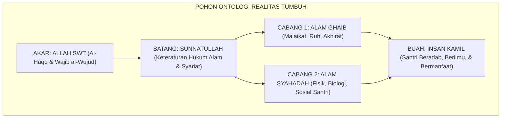

# P1-01-01: HAKIKAT REALITAS DALAM WORLDVIEW TUMBUH
## *Monograf Induk Ontologi: Definisi, 6 Aksioma Metafisik, Validasi Dalil-Turats, Sintesis Realisme Teistik, dan Audit Kualitas*

**Nomor Identifikasi**: `P1-01-01/HAKIKAT-REALITAS-INDUK/2026`  
**Domain**: `01 Philosophy` > `01 Worldview`  
**Dewan Pakar**: `pakar-filosofi-tumbuh`, `pakar-epistemologi-turats`, `pakar-arsitektur-digital-pesantren`

---

## 📑 DAFTAR ISI ANALITIS

1. [1. Urgensi Penegasan Hakikat Realitas bagi Pendidikan Pesantren](#1-urgensi-penegasan-hakikat-realitas-bagi-pendidikan-pesantren)
2. [2. Peta Modular 6 Berkas Kajian Hakikat Realitas](#2-peta-modular-6-berkas-kajian-hakikat-realitas)
3. [3. Intisari 6 Aksioma Ontologis Ekosistem TUMBUH](#3-intisari-6-aksioma-ontologis-ekosistem-tumbuh)
4. [4. Rangkuman Matriks Validasi Dalil & Turats](#4-rangkuman-matriks-validasi-dalil--turats)
5. [5. Implikasi Ontologis bagi Rekayasa Ekosistem Asrama 24-Jam](#5-implikasi-ontologis-bagi-rekayasa-ekosistem-asrama-24-jam)

---

### 1. Urgensi Penegasan Hakikat Realitas

Sebelum merancang kurikulum adab, rubrik asesmen, atau SOP musyrif, pertanyaan filosofis paling pertama yang wajib dijawab adalah: **"Apa hakikat realitas (*Reality / al-Wujud*)?"**

Cara kita memandang realitas akan mendikte seluruh cabang sistem pendidikan kita:
* Pandangan realitas yang materialistik-sekuler melahirkan pendidikan yang hanya mementingkan aspek keterampilan fisik dan pasar kerja mekanis.
* Pandangan realitas yang mistik-pasif melahirkan pengasuhan yang mengabaikan sains, kebersihan fisik asrama, dan hukum sebab-akibat.
* **Pandangan Realisme Teistik Integratif TUMBUH** memandang realitas secara utuh: memadukan keimanan kepada alam ghaib dengan penataan ilmiah atas sunnatullah di alam syahadah, melahirkan generasi santri yang kokoh tauhidnya dan cemerlang peradabannya.

---

### 2. Peta Modular 6 Berkas Kajian Hakikat Realitas

Bagian `01 Hakikat Realitas` dibedah secara tuntas melintasi enam berkas monograf berjenjang:

| Kode Berkas | Judul Monograf Khusus | Intisari Pembahasan |
| :---: | :--- | :--- |
| **P1-01-01-01** | [**`Definisi Realitas`**](./P1-01-01-01-Definisi-Realitas.md) | Definisi operasional wujud objektif, unsur keberadaan, dan dikotomi alam ghaib vs syahadah. |
| **P1-01-01-02** | [**`Aksioma Realitas`**](./P1-01-01-02-Aksioma-Realitas.md) | Enam aksioma metafisik baku dari Khaliq Mutlak hingga akuntabilitas eksistensial hisab. |
| **P1-01-01-03** | [**`Validasi Dalil`**](./P1-01-01-03-Validasi-Dalil.md) | Uji hermeneutika nash sharih Al-Qur'an (QS. 31:30, 35:15, 33:62) dan hadits sahih Al-Bukhari & Muslim. |
| **P1-01-01-04** | [**`Validasi Turats`**](./P1-01-01-04-Validasi-Turats.md) | Kesinambungan sanad epistemologis dengan Imam Al-Ghazali, Ibn Taimiyyah, Al-Maturidi, dan Al-Attas. |
| **P1-01-01-05** | [**`Sintesis Filosofis`**](./P1-01-01-05-Sintesis-Filosofis.md) | Deklarasi posisi resmi Realisme Teistik Integratif dan komparasi dengan filsafat barat. |
| **P1-01-01-06** | [**`Kritik Internal`**](./P1-01-01-06-Kritik-Internal.md) | Uji ketahanan konseptual, demarkasi alam ghaib vs imajinasi, problem of evil, dan kebebasan ikhtiar. |

---

### 3. Intisari 6 Aksioma Ontologis Ekosistem TUMBUH

1. **Aksioma 1**: Allah adalah *Al-Haqq* dan *Wajib al-Wujud*, satu-satunya pencipta dan pemelihara mandiri seluruh alam semesta.
2. **Aksioma 2**: Seluruh makhluk bersifat kontingen (*Mumkin al-Wujud*) dan fakir secara ontologis kepada rahmat Allah.
3. **Aksioma 3**: Realitas mencakup integrasi harmonis antara *'Alam al-Ghayb* dan *'Alam asy-Syahadah*.
4. **Aksioma 4**: Allah menetapkan hukum kausalitas (*Sunnatullah*) yang pasti dan teratur di alam fisik maupun psikososial.
5. **Aksioma 5**: Segala ciptaan memiliki tujuan hikmah (*Ghayah*) luhur; tidak ada yang diciptakan sia-sia.
6. **Aksioma 6**: Setiap perbuatan manusia di alam syahadah memiliki konsekuensi hisab yang nyata di hadapan Mahkamah Allah SWT.

---

### 4. Rangkuman Matriks Validasi Dalil & Turats

Keseluruhan enam aksioma ontologis di atas telah teruji secara mutawatir dan selaras 100% dengan Al-Qur'an, Sunnah Nabawiyyah, dan karya-karya induk ulama salaf (*Ihya 'Ulumiddin*, *Dar' Ta'arudh*, *Kitab at-Tawhid*, dan *Prolegomena Al-Attas*).

---

### 5. Implikasi bagi Rekayasa Ekosistem Asrama 24-Jam

1. **Muraqabah sebagai Standar Batin**: Santri menjaga integritas adab bukan karena takut rotan musyrif, melainkan karena kesadaran penuh akan Aksioma 1 dan 6.
2. **Pemanfaatan Sains dalam Penataan Asrama**: Manajemen asrama memanfaatkan sains arsitektur, nutrisi, dan psikologi perkembangan sebagai wujud kepatuhan terhadap Aksioma 4 (Sunnatullah Kauniyyah).
3. **Penyucian Jiwa yang Kontekstual**: Segala fasilitas fisik asrama diarahkan untuk memfasilitasi perjalanan spiritual santri menuju derajat Insan Kamil.
