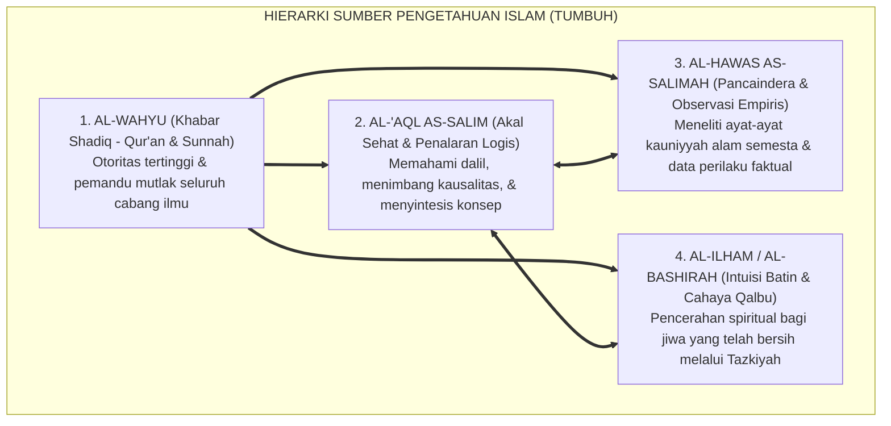

# P1-01-02-01: SUMBER-SUMBER PENGETAHUAN DALAM ISLAM
## *Struktur Hierarkis Empat Saluran Epistemologis: Wahyu, Akal Sehat, Indera Empiris, dan Intuisi Batin (Ilham/Kasyf)*

**Nomor Identifikasi**: `P1-01-02-01/SUMBER-PENGETAHUAN/2026`  
**Domain**: `01 Philosophy` > `01 Worldview` > `02 Epistemologi TUMBUH`  
**Dewan Pakar**: `pakar-epistemologi-turats`, `pakar-filosofi-tumbuh`, `pakar-pedagogi-master-guru`

---

## 📑 DAFTAR ISI ANALITIS

1. [1. Urgensi Perumusan Sumber Pengetahuan dalam Pendidikan Pesantren](#1-urgensi-perumusan-sumber-pengetahuan-dalam-pendidikan-pesantren)
2. [2. Empat Saluran Epistemologis yang Sah dalam Islam](#2-empat-saluran-epistemologis-yang-sah-dalam-islam)
3. [3. Hierarki dan Hubungan Antarsumber Pengetahuan](#3-hierarki-dan-hubungan-antarsumber-pengetahuan)
4. [4. Matriks Komparasi: Epistemologi Islam vs Rasionalisme & Empirisisme Sekuler](#4-matriks-komparasi-epistemologi-islam-vs-rasionalisme--empirisisme-sekuler)
5. [5. Implikasi bagi Metodologi Pembelajaran Santri di Pesantren](#5-implikasi-bagi-metodologi-pembelajaran-santri-di-pesantren)

---

### 1. Urgensi Perumusan Sumber Pengetahuan

Bagaimana seseorang berpikir, mengambil keputusan moral, dan mendidik santrinya ditentukan oleh apa yang ia yakini sebagai **sumber kebenaran yang sah (*valid sources of knowledge*)**.

Jika pesantren hanya mengakui wahyu secara tekstual sembari menolak akal dan sains empiris (*tekstualisme sempit*), maka pesantren akan tertinggal dari kemajuan peradaban. Sebaliknya, jika pesantren terjebak dalam empirisisme sekuler yang menolak wahyu, maka pesantren akan kehilangan ruh keimanan dan orientasi ukhrawi.

Ekosistem TUMBUH merumuskan **Epistemologi Integratif**: mengakui empat saluran pengetahuan yang saling melengkapi di bawah naungan otoritas wahyu.

---

### 2. Empat Saluran Epistemologis yang Sah dalam Islam

#### A. Wahyu Ilahi (*Al-Wahyu / Al-Khabar ash-Shadiq*)
Sumber pengetahuan transendental yang absolut dan terbebas dari kesalahan (*ma'shum*). Wahyu memberikan pengetahuan mengenai hal-hal ghaib yang tidak terjangkau oleh indera dan akal (hakikat ketuhanan, malaikat, hari akhir, syariat ibadah, dan hukum moral abadi). Allah SWT berfirman:
> $$\text{عَلَّمَ الْإِنسَانَ مَا لَمْ يَعْلَمْ}$$
> *"Dia mengajarkan kepada manusia apa yang tidak diketahuinya."* (QS. Al-'Alaq [96]: 5).

#### B. Akal Sehat (*Al-'Aql as-Salim*)
Daya intelektual yang dianugerahkan Allah untuk memahami wahyu, menyimpulkan hukum (*istimbath*), menganalisis hubungan sebab-akibat, dan menolak kontradiksi logika. Al-Qur'an berulang kali mencela mereka yang tidak menggunakan akalnya: *"Afala ta'qilun?"* (QS. Al-Baqarah: 44).

#### C. Pancaindera yang Sehat (*Al-Hawas as-Salimah*)
Pintu gerbang observasi empiris manusia terhadap alam syahadah melalui penglihatan, pendengaran, penciuman, perabaan, dan pengecapan. Indera menjadi instrumen utama dalam riset sains, pengamatan astronomi, kedokteran, dan pengumpulan data perilaku santri di asrama (QS. An-Nahl: 78).

#### D. Intuisi Batin & Cahaya Kalbu (*Al-Ilham ash-Shadiq / Al-Kasyf al-Wijdani*)
Pencerahan langsung yang dihunjamkan Allah ke dalam kalbu hamba-Nya yang bertakwa setelah melalui proses *Tazkiyatun Nafs*, dzikir yang konsisten, dan keikhlasan niat. Imam Al-Ghazali menyebutnya sebagai *"Nur yaqdzifuhullah fi al-qalb"* (Cahaya yang dilemparkan Allah ke dalam kalbu).

---

### 3. Hierarki dan Hubungan Antarsumber Pengetahuan

1. **Wahyu adalah Hakim Tertinggi (*Al-Hakim al-Mutlaq*)**: Wahyu menetapkan batas-batas etika (*the ethical boundaries*) bagi akal dan indera. Akal dan riset sains tidak boleh bertentangan dengan dalil qath'i wahyu.
2. **Akal adalah Penjelas dan Pembuktian (*Al-Mubayyin wal Burhan*)**: Akal bertugas menggali hikmah, merumuskan metodologi operasional, dan menerapkan prinsip wahyu ke dalam konteks zaman.
3. **Indera adalah Pengumpul Fakta Lapangan (*Al-Mustaqri' lil Waqi'*)**: Indera menyediakan data empiris objektif bagi akal untuk memecahkan masalah praktis asrama.
4. **Kalbu adalah Pengikat Keikhlasan (*Al-Muharrik lil Ikhlas*)**: Kalbu memastikan seluruh aktivitas pencarian ilmu berorientasi pada ridha Allah SWT.

---

### 4. Matriks Komparasi Epistemologi

| Aliran Epistemologi | Sumber yang Diakui | Sumber yang Ditolak | Dampak pada Pendidikan |
| :--- | :--- | :--- | :--- |
| **Rasionalisme Barat (Descartes)** | Akal rasional (*Ratio*) semata. | Wahyu dan indera dianggap meragukan. | Mengabaikan wahyu agama; lahirnya deisme sekuler. |
| **Empirisisme Barat (Locke, Hume)** | Indera empiris (*Sensory data*) semata. | Menolak metafisika dan wahyu ghaib. | Positivisme materialistik; menolak dosa/pahala. |
| **Tekstualisme Ekstrem / Literalisme** | Teks wahyu harfiah semata. | Mengerdilkan nalar akal dan sains empiris. | Kejumudan peradaban; menolak metodologi modern. |
| **Epistemologi Islam TUMBUH** | **Integrasi Wahyu + Akal + Indera + Ilham.** | **Menolak reduksionisme sepihak.** | **Pendidikan holistik: beriman, saintifik, & beradab.** |

---

### 5. Implikasi bagi Metodologi Pembelajaran di Pesantren

1. **Integrasi Ayat Qawliyyah dan Kauniyyah**: Santri diajarkan bahwa mempelajari biologi dan fisika adalah ibadah meneliti ayat kauniyyah Allah yang sama mulianya dengan menghafal ayat Al-Qur'an.
2. **Metode Sorogan Interaktif Berbasis Nalar**: Sorogan kitab tidak boleh menjadi indoktrinasi pasif; santri dirangsang untuk bertanya, menalar argumen, dan menguji relevansi kontekstual kitab klasik.
3. **Pengambilan Keputusan Berbasis Data Empiris**: Penanganan masalah asrama (seperti kebersihan kamar atau jam tidur) menggunakan data logbook terukur (*Indera & Akal*), sembari menjaga doa dan keikhlasan (*Wahyu & Kalbu*).
