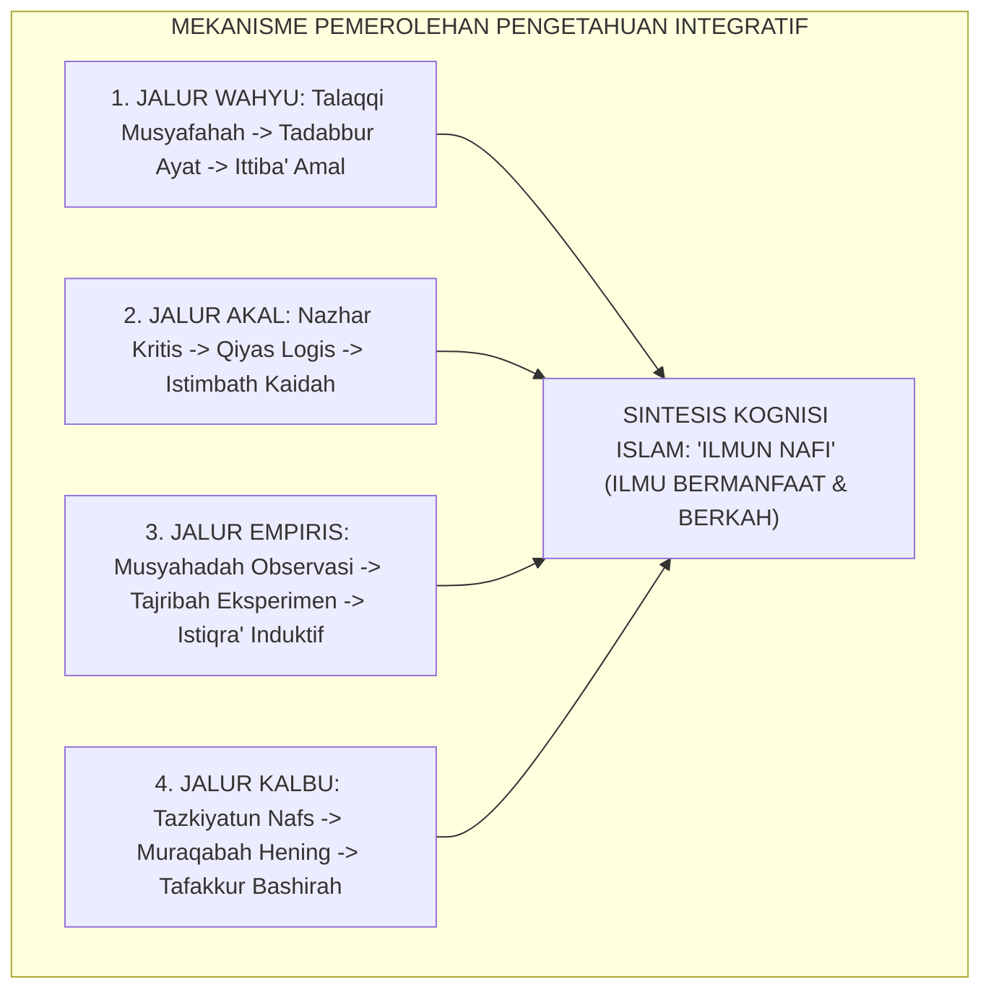

# P1-01-02-02: PROSES DAN MEKANISME MEMPEROLEH PENGETAHUAN
## *Metodologi Kognisi Islam: Talaqqi Wahyu, Nazhar Akal, Tajribah Empiris, dan Tazkiyah Kalbu dalam Pembelajaran Santri*

**Nomor Identifikasi**: `P1-01-02-02/PROSES-PENGETAHUAN/2026`  
**Domain**: `01 Philosophy` > `01 Worldview` > `02 Epistemologi TUMBUH`  
**Dewan Pakar**: `pakar-epistemologi-turats`, `pakar-psikologi-belajar`, `pakar-pedagogi-master-guru`

---

## 📑 DAFTAR ISI ANALITIS

1. [1. Urgensi Metodologi Pemerolehan Pengetahuan](#1-urgensi-metodologi-pemerolehan-pengetahuan)
2. [2. Matriks Korespondensi Sumber, Instrumen Fitrah, dan Mekanisme Belajar](#2-matriks-korespondensi-sumber-instrumen-fitrah-dan-mekanisme-belajar)
3. [3. Empat Jalur Operasional Pemrosesan Pengetahuan](#3-empat-jalur-operasional-pemrosesan-pengetahuan)
4. [4. Konvergensi dengan Cognitive Load Theory & Neurosains Memori](#4-konvergensi-dengan-cognitive-load-theory--neurosains-memori)
5. [5. Implikasi bagi Desain Pembelajaran Halaqah & Asrama Pesantren](#5-implikasi-bagi-desain-pembelajaran-halaqah--asrama-pesantren)

---

### 1. Urgensi Metodologi Pemerolehan Pengetahuan

Mengetahui adanya sumber kebenaran tidak secara otomatis membuat seseorang mampu memperoleh kebenaran. Tanpa metodologi pemerolehan yang presisi:
* Teks wahyu dapat disalahpahami secara tekstualis sempit (*literalisme ekstrem*) atau ditafsirkan liar tanpa sanad (*liberalisme hermeneutik*).
* Akal dapat terjebak dalam ilusi rasionalistik semu tanpa verifikasi data faktual.
* Observasi empiris dapat melahirkan kesimpulan yang bias dan tergesa-gesa (*hasty generalization*).
* Kalbu dapat tertipu oleh bisikan hawa nafsu yang disangka ilham spiritual (*talbis iblis*).

Ekosistem TUMBUH merumuskan **Mekanisme Kognisi Empat Jalur** yang mengintegrasikan seluruh instrumen fitrah santri.

---

### 2. Matriks Korespondensi Sumber, Instrumen Fitrah, dan Mekanisme Belajar

| Sumber Pengetahuan | Instrumen Fitrah Santri | Metode Tradisional Turats | Konsep Sains Kognitif Modern |
| :--- | :--- | :--- | :--- |
| **Wahyu Ilahi** | Pendengaran (*As-Sam'*), Penglihatan (*Al-Bashar*), Sanad. | **Talaqqi, Tahfizh, Tadabbur.** | *Auditory-Verbal Encoding & Semantic Schema.* |
| **Akal Sehat** | Daya Intelektual (*Al-Quwwah al-'Aqliyyah*). | **Nazhar, Qiyas, Istimbath, Jadal.** | *Executive Function, Working Memory, & Critical Logic.* |
| **Data Empiris** | Panca Indera (*Al-Hawas as-Salimah*). | **Musyahadah, Tajribah, Istiqra'.** | *Empirical Observation, Data Analytics, & Sensorimotor.* |
| **Kalbu / Ruhani** | Kalbu yang Suci (*Al-Qalb as-Salim*). | **Tazkiyah, Riyadhah, Muraqabah.** | *Affective Self-Regulation & Intuitive Meta-Consciousness.* |

---

### 3. Empat Jalur Operasional Pemrosesan Pengetahuan

#### A. Jalur Pemrosesan Wahyu (*Talaqqi wa Tadabbur*)
Pemerolehan ilmu wahyu dimulai dari *Talaqqi* (menerima transmisi lisan secara akurat dari guru bersanad), dilanjutkan dengan *Tadabbur* (merenungkan makna dan asbabun nuzul), dan bermuara pada *Ittiba'* (mengamalkan perintah syariat dalam adab keseharian).

#### B. Jalur Pemrosesan Akal (*Nazhar wal Istimbath*)
Akal memproses data melalui penalaran deduktif (*Qiyas*) dan induktif (*Istiqra'*), menguji premis, menimbang kemaslahatan (*Maqashid Syari'ah*), dan menyusun solusi rasional atas persoalan umat.

#### C. Jalur Pemrosesan Empiris (*Tajribah wal Musyahadah*)
Santri mengamati fakta alam dan perilaku sosial di asrama, mencatat frekuensi kejadian, menguji hipotesis melalui eksperimen laboratorium, dan menarik kesimpulan berbasis data objektif.

#### D. Jalur Pemrosesan Kalbu (*Tazkiyah wal Bashirah*)
Melalui penyucian diri dari riya' dan hasad, kalbu santri menjadi cermin jernih yang mampu menangkap hikmah mendalam (*Al-Hikmah*) dan merasakan keagungan Allah di balik setiap fenomena alam.

---

### 4. Konvergensi dengan Cognitive Load Theory & Neurosains Memori

Metodologi Islam ini selaras dengan prinsip neurosains pembelajaran:
* **Cognitive Load Theory (John Sweller, 1988)**: Membagi beban belajar menjadi *Intrinsic*, *Germane*, dan *Extraneous Load*. Desain halaqah sorogan mengurangi beban kognitif yang tidak perlu melalui pengulangan bertahap (*Spaced Repetition*).
* **Dual-Coding Theory (Allan Paivio, 1986)**: Menggabungkan stimulasi verbal (pelafalan matan kitab) dengan visual (penulisan diagram konsep di papan tulis) melipatgandakan retensi memori jangka panjang santri.

---

### 5. Implikasi bagi Desain Pembelajaran Pesantren TUMBUH

1. **Format Halaqah 4 Tahap**: Setiap sesi taklim dirancang memuat 4 fase: (1) Setoran hafalan / Talaqqi (15 menit), (2) Diskusi dialektika nalar (25 menit), (3) Analisis data studi kasus (15 menit), dan (4) Doa muhasabah niat (5 menit).
2. **Keseimbangan Menghafal dan Menalar**: Mengakhiri dikotomi masa lalu; santri diwajibkan menguasai teks hafalan (*hifzh al-matn*) sekaligus memahami argumen filosofis di balik teks tersebut (*fahm ad-dalil*).
3. **Penyelarasan Teori Kelas dan Praktik Asrama**: Konsep fiqh thaharah yang dipelajari di madrasah langsung dipraktikkan dan dinilai kebersihan kamar mandinya di asrama pada sore hari.
