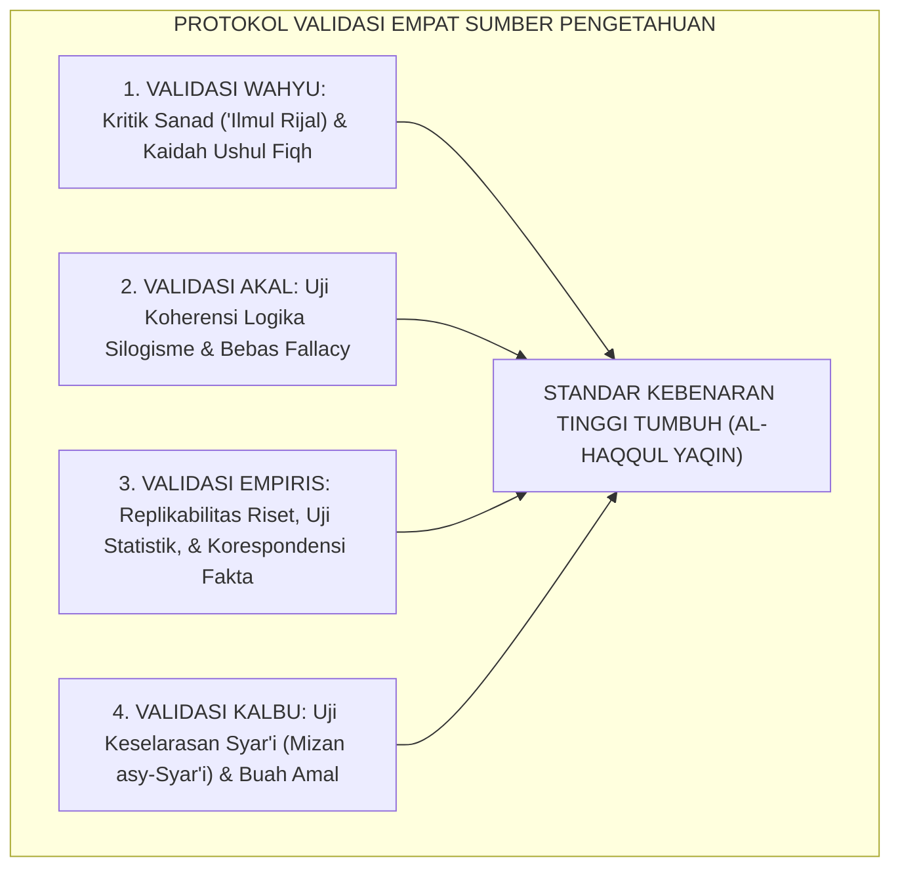
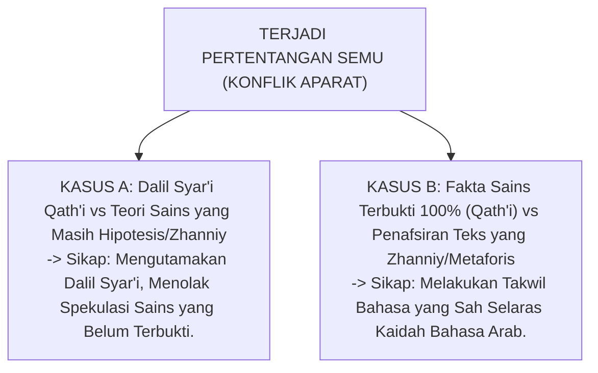

# P1-01-02-03: KRITERIA DAN PROTOKOL VALIDASI PENGETAHUAN
## *Metodologi Verifikasi Kebenaran: Kritik Sanad-Matan, Uji Koherensi Logika, Korespondensi Empiris, dan Rekonsiliasi Pertentangan Semu*

**Nomor Identifikasi**: `P1-01-02-03/VALIDASI-PENGETAHUAN/2026`  
**Domain**: `01 Philosophy` > `01 Worldview` > `02 Epistemologi TUMBUH`  
**Dewan Pakar**: `pakar-epistemologi-turats`, `pakar-metodologi-riset-tumbuh`, `pakar-psikometri-dan-validasi-instrumen`

---

## 📑 DAFTAR ISI ANALITIS

1. [1. Urgensi Validasi: Mencegah Dogmatisme Buta dan Pseudosains](#1-urgensi-validasi-mencegah-dogmatisme-buta-dan-pseudosains)
2. [2. Matriks Kriteria Validitas Berdasarkan 4 Sumber Pengetahuan](#2-matriks-kriteria-validitas-berdasarkan-4-sumber-pengetahuan)
3. [3. Teori-Teori Kebenaran dalam Epistemologi Islam (Koherensi, Korespondensi, & Pragmatis)](#3-teori-teori-kebenaran-dalam-epistemologi-islam-koherensi-korespondensi--pragmatis)
4. [4. Protokol Penyelesaian Pertentangan Semu (Ta'arudh al-Adillah)](#4-protokol-penyelesaian-pertentangan-semu-taarudh-al-adillah)
5. [5. Implikasi bagi Validitas Asesmen dan Pengambilan Keputusan PBIS](#5-implikasi-bagi-validitas-asesmen-dan-pengambilan-keputusan-pbis)

---

### 1. Urgensi Validasi: Pagar Integritas Epistemologis

Klaim pengetahuan yang tidak melalui protokol uji validitas melahirkan distorsi fatal dalam pendidikan:
* **Dogmatisme Tekstualis**: Menganggap pendapat subjektif seorang ustadz sebagai dalil mutlak wahyu yang tidak boleh diuji.
* **Pseudosains & Mitos Asrama**: Mempercayai teknik pembinaan yang tidak terbukti secara empiris (seperti mitos "menjemur santri di bawah terik matahari meningkatkan kecerdasan hafalan").
* **Kesesatan Spiritual / Halusinasi**: Membenarkan perlakuan diskriminatif terhadap santri tertentu dengan dalih "mendapat firasat gaib".

Validasi pengetahuan adalah **pagar pengaman metodologis (*epistemological safeguards*)** yang menjamin seluruh kebijakan TUMBUH dapat dipertanggungjawabkan secara syar'i, logis, dan saintifik.

---

### 2. Matriks Kriteria Validitas Berdasarkan 4 Sumber Pengetahuan

| Sumber Pengetahuan | Kriteria Validitas Inti | Instrumen Pengujian (*Testing Protocols*) | Bentuk Kesalahan yang Dieliminasi |
| :--- | :--- | :--- | :--- |
| **Wahyu Ilahi** | Otentisitas Riwayat (*Tsubut*) & Ketepatan Penafsiran (*Dilalah*). | **Takhrij Hadits, Kaidah Bahasa Arab, Ushul Fiqh, Tafsir Mu'tabar.** | Hadits palsu (*Maudhu'*), takwil batil, dan bid'ah pemikiran. |
| **Akal Rasional** | Konsistensi Logis & Ketiadaan Kontradiksi Internal. | **Logika Formal (*Mantiq*), Silogisme, Analisis Premis.** | Sesat pikir (*Logical Fallacies*), asumsi sirkular, over-generalisasi. |
| **Data Empiris** | Korespondensi Fakta & Keterulangan (*Replicability*). | **Metode Ilmiah, Uji Signifikansi Statistik, Validitas Psikometrik.** | Pseudosains, bias konfirmasi (*Confirmation Bias*), data palsu. |
| **Kalbu / Intuisi** | Keselarasan dengan Syariat & Buah Perbaikan Akhlak. | **Mizan asy-Syar'i, Muhasabah Diri, Tazkiyatun Nufus.** | Bisikan setan (*Waswas*), ilusi nafsu, arogansi spiritual (*Ghurur*). |

---

### 3. Teori Kebenaran dalam Epistemologi Islam

Epistemologi Islam memadukan tiga teori kebenaran dunia secara komprehensif:
1. **Teori Koherensi (*Coherence Theory of Truth*)**: Suatu proposisi benar jika ia konsisten secara logis dengan keseluruhan sistem ajaran tauhid dan prinsip-prinsip syariat.
2. **Teori Korespondensi (*Correspondence Theory of Truth*)**: Suatu pernyataan faktual benar jika ia bersesuaian secara akurat dengan kenyataan objektif di alam nyata (*muthabiqan lil waqi'*).
3. **Teori Pragmatis-Aksiologis (*Pragmatic-Axiological Truth*)**: Suatu ilmu dinilai sebagai ilmu yang benar (*'Ilmun Nafi'*) jika ia membuahkan kemaslahatan nyata, ketenteraman jiwa, dan peningkatan takwa kepada Allah SWT.

---

### 4. Protokol Rekonsiliasi Pertentangan Semu (Ta'arudh al-Adillah)

Bagaimana jika terjadi pertentangan antara sains empiris dengan teks agama? 

Ibn Taimiyyah dalam *Dar' Ta'arudh al-'Aql wan-Naql* dan Imam Al-Ghazali dalam *Al-Qanun al-Kulli fit-Ta'wil* menetapkan kaidah: **Tidak mungkin terjadi pertentangan hakiki antara wahyu yang sharih (*Qath'iyuts Tsubut wa ad-Dilalah*) dengan akal/sains yang qath'i**.

---

### 5. Implikasi bagi Validitas Asesmen & PBIS

1. **Uji Reliabilitas Instrumen Asesmen**: Seluruh rubrik penilaian 10 Muwashafat wajib lulus uji validitas isi (*Content Validity*) dan reliabilitas antar-penilai (*Inter-Rater Reliability*) sebelum digunakan di raport santri.
2. **Keputusan Disiplin Berdasarkan Bukti Nyata**: Sanksi Tier 3 hanya boleh dijatuhkan jika terdapat bukti rekaman fakta objektif, hasil wawancara FBA yang tervalidasi, dan kesepakatan tertulis tim konseling.
3. **Keterbukaan atas Replikasi Riset**: Seluruh data tren perilaku asrama dievaluasi secara berkala untuk memastikan efektivitas intervensi dapat diulang secara konsisten di tahun-tahun berikutnya.
