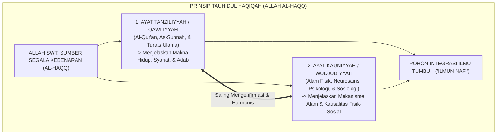
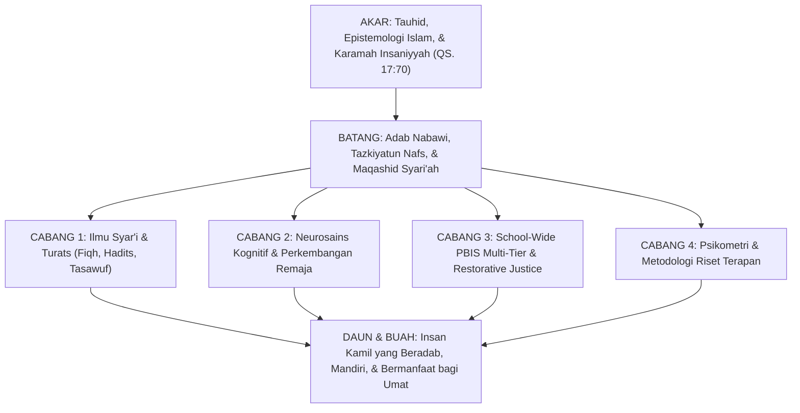

# P1-01-02-04: INTEGRASI PENGETAHUAN: TAUHIDUL HAQIQAH
## *Sintesis Organik-Transformatif: Penyatuan Ayat Tanziliyyah dan Ayat Kauniyyah, Kritik Islamisasi Label, dan Pohon Ilmu TUMBUH*

**Nomor Identifikasi**: `P1-01-02-04/INTEGRASI-PENGETAHUAN/2026`  
**Domain**: `01 Philosophy` > `01 Worldview` > `02 Epistemologi TUMBUH`  
**Dewan Pakar**: `pakar-epistemologi-turats`, `pakar-filosofi-tumbuh`, `pakar-desain-kurikulum-adab`

---

## 📑 DAFTAR ISI ANALITIS

1. [1. Problem Dikotomi Ilmu: Sekularisasi vs Isolasionisme Keilmuan](#1-problem-dikotomi-ilmu-sekularisasi-vs-isolasionisme-keilmuan)
2. [2. Kerangka Filosofis Tauhidul Haqiqah (Kesatuan Kebenaran Ilahi)](#2-kerangka-filosofis-tauhidul-haqiqah-kesatuan-kebenaran-ilahi)
3. [3. Kritik atas Model Islamisasi Label (Pseudo-Islamisasi)](#3-kritik-atas-model-islamisasi-label-pseudo-islamisasi)
4. [4. Model Integrasi Organik-Transformatif TUMBUH: Struktur Pohon Ilmu](#4-model-integrasi-organik-transformatif-tumbuh-struktur-pohon-ilmu)
5. [5. Implikasi bagi Kurikulum Madrasah dan Kepengasuhan Asrama 24-Jam](#5-implikasi-bagi-kurikulum-madrasah-dan-kepengasuhan-asrama-24-jam)

---

### 1. Problem Dikotomi Ilmu: Sekularisasi vs Isolasionisme

Krisis peradaban pendidikan modern bersumber dari dua penyakit epistemologis yang saling berlawanan:
1. **Sekularisasi & Fragmentasi Ilmu**: Memisahkan sains dan psikologi dari nilai-nilai transendental, melahirkan kemajuan teknologi yang destruktif, eksploitasi alam, dan kehampaan makna hidup (*nihilism*).
2. **Isolasionisme Tradisionalis**: Sikap apriori menolak metodologi sains modern (seperti neurosains perkembangan, Positive Behavioral Interventions, dan psikometri) karena dianggap produk "Barat", sehingga pesantren tertinggal dalam manajemen dan pembinaan santri.

Ekosistem TUMBUH mengusung paradigma **Integrasi Organik-Transformatif**: memadukan khazanah Turats Islam dengan sains kontemporer secara kritis, terstruktur, dan beradab.

---

### 2. Kerangka Filosofis Tauhidul Haqiqah

Dasar epistemologis integrasi ilmu dalam Islam berpijak pada prinsip **Tauhidul Haqiqah (Kesatuan Kebenaran)**:
* Karena Pencipta ayat-ayat Al-Qur'an adalah Dzat yang sama yang menciptakan hukum-hukum alam semesta dan anatomi otak manusia, maka **kebenaran sains yang sahih tidak akan pernah bertentangan dengan kebenaran wahyu yang sharih**.
* Jika tampak ada pertentangan, masalahnya terletak pada penafsiran teks yang keliru (*misinterpretation*) atau teori sains yang masih bersifat spekulasi belum teruji (*unproven hypothesis*).

---

### 3. Kritik atas Model Islamisasi Label (Pseudo-Islamisasi)

TUMBUH menolak model "Islamisasi Kosmetik" yang sekadar menempelkan ayat Al-Qur'an atau istilah Arab pada teori psikologi behavioristik sekuler tanpa membongkar asumsi dasarnya:

| Dimensi Analisis | Model Islamisasi Kosmetik (Ditolak) | Model Integrasi Organik TUMBUH (Diterapkan) |
| :--- | :--- | :--- |
| **Pendekatan** | Menempelkan dalil pada teori sekuler yang ada. | **Rekonstruksi mendalam dari akar ontologi dan aksiologi.** |
| **Status Teori Sekuler** | Diterima mentah-mentah lalu diberi label islami. | **Disaring (*Islah/Tahdzib*): membuang racun sekuler, mengambil faedah empirisnya.** |
| **Posisi Wahyu** | Sekadar alat pembenar (*justifikasi*) akhir. | **Pemandu utama (*Al-Hakim al-Mutlaq*) sejak perancangan awal.** |
| **Contoh Kasus** | Menggunakan token poin hadiah lalu disebut "Poin Barakah". | **Mengganti sistem token dengan internalisasi Muraqabatullah & Apresiasi Relasional 4:1.** |

---

### 4. Struktur Pohon Ilmu TUMBUH

---

### 5. Implikasi bagi Kurikulum Madrasah & Asrama Pesantren

1. **Kurikulum Terpadu Tanpa Dikotomi**: Santri diajarkan melihat kesatuan ilmu: saat belajar biologi saraf, santri mengagumi kebesaran Allah (*Subhanallah*); saat belajar fiqh mu'amalah, santri mempraktikkannya dalam kejujuran transaksi koperasi pondok.
2. **Pelatihan Sains Berbasis Nilai bagi Musyrif**: Musyrif dibekali pemahaman mengenai neurosains tidur remaja (*circadian rhythm*) agar dapat mengatur jadwal tahajud dan istirahat santri secara proporsional.
3. **Penyelarasan Total 24 Jam**: Memastikan tidak ada kontradiksi antara teori adab yang diajarkan ustadz di kelas madrasah dengan perlakuan musyrif di kamar asrama.
