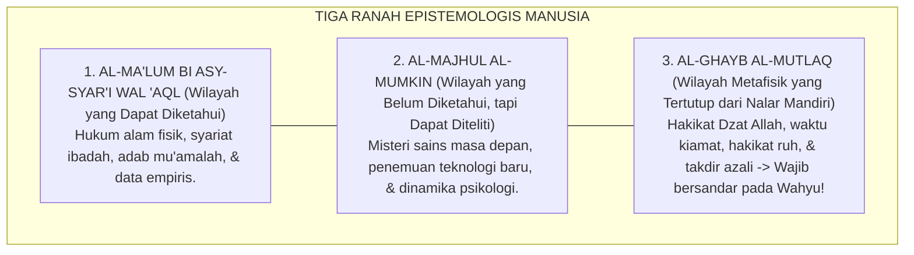

# P1-01-02-05: BATAS-BATAS PENGETAHUAN MANUSIA
## *Keterbatasan Epistemologis Insan (QS. Al-Isra': 85), Tawadhu' Intelektual, dan Demarkasi Wilayah Ijtihad vs Dogma Syar'i*

**Nomor Identifikasi**: `P1-01-02-05/BATAS-PENGETAHUAN/2026`  
**Domain**: `01 Philosophy` > `01 Worldview` > `02 Epistemologi TUMBUH`  
**Dewan Pakar**: `pakar-epistemologi-turats`, `pakar-filosofi-tumbuh`

---

## 📑 DAFTAR ISI ANALITIS

1. [1. Aksioma Keterbatasan Epistemologis Manusia](#1-aksioma-keterbatasan-epistemologis-manusia)
2. [2. Khazanah Nash: 'Wa Ma Utitum Minal 'Ilmi Illa Qalila'](#2-khazanah-nash-wa-ma-utitum-minal-ilmi-illa-qalila)
3. [3. Tiga Wilayah Epistemologis: Al-Ma'lum, Al-Majhul, dan Al-Mustahil](#3-tiga-wilayah-epistemologis-al-malum-al-majhul-dan-al-mustahil)
4. [4. Konsep Tawadhu' Intelektual vs Kesombongan Epistemis (Epistemic Arrogance)](#4-konsep-tawadhu-intelektual-vs-kesombongan-epistemis-epistemic-arrogance)
5. [5. Implikasi bagi Sikap Ilmiah Pendidik dan Santri Pesantren](#5-implikasi-bagi-sikap-ilmiah-pendidik-dan-santri-pesantren)

---

### 1. Aksioma Keterbatasan Epistemologis Manusia

Salah satu pembeda paling esensial antara filsafat humanisme sekuler dengan epistemologi Islam adalah pengakuan mutlak atas **Keterbatasan Epistemologis Manusia (*Human Epistemic Limits*)**.

Humanisme sekuler memposisikan akal manusia sebagai ukuran mutlak segala sesuatu (*Man is the measure of all things*), berilusi bahwa manusia mampu memecahkan seluruh rahasia alam semesta tanpa bantuan Tuhan. 

Sebaliknya, Islam mengajarkan bahwa sehebat apapun kecerdasan intelektual manusia, kapasitas kognisinya dibatasi oleh ruang, waktu, keterbatasan panca indera, dan kefakiran biologis. Mengakui batas pengetahuan bukanlah bentuk keputusasaan, melainkan **puncak kejujuran intelektual (*Epistemic Humility / Tawadhu' Ilmiah*)** yang mengantarkan manusia pada pengagungan Allah Yang Maha Mengetahui (*Al-'Alim*).

---

### 2. Khazanah Nash: 'Wa Ma Utitum Minal 'Ilmi Illa Qalila'

Allah SWT menegaskan batas kapasitas akal manusia dalam firman-Nya:

> $$\text{وَمَا أُوتِيتُم مِّنَ الْعِلْمِ إِلَّا قَلِيلًا}$$
> *"Dan tidaklah kamu diberi pengetahuan melainkan sedikit saja."* (QS. Al-Isra' [17]: 85).

Imam Asy-Syafi'i (w. 204 H) dalam syair terkenalnya mengabadikan prinsip kerendahan hati para ulama sejati:

> $$\text{كُلَّمَا أَدَّبَنِي الدَّهْرُ أَرَانِي نَقْصَ عَقْلِي ۝ وَإِذَا مَا ازْدَدْتُ عِلْمًا زَادَنِي عِلْمًا بِجَهْلِي}$$
> 
> *"Setiap kali zaman mendidik adabku, ia memperlihatkan kepadaku betapa banyaknya kekurangan pada akalku. Dan setiap kali bertambah ilmuku, niscaya bertambah pula pengetahuanku akan betapa besarnya kebodohanku!"* (Diwan Asy-Syafi'i, hlm. 92).

---

### 3. Tiga Wilayah Epistemologis Manusia

1. **Wilayah yang Terbuka bagi Akal dan Riset Empiris**: Bidang sains kedokteran, arsitektur asrama, teknologi informasi, dan rekayasa metode pengajaran. Di wilayah ini, santri didorong untuk berijtihad, meneliti, dan berinovasi secara bebas.
2. **Wilayah yang Tertutup bagi Spekulasi Akal (*Ta'abbudi Mahdh*)**: Tata cara rakaat shalat fardhu, kadar zakat, dan rincian alam barzakh. Di wilayah ini, sikap santri adalah *Sami'na wa Atha'na* (tunduk patuh pada wahyu).
3. **Wilayah Rahasia Allah (*Ghaib Mutlak*)**: Waktu terjadinya hari kiamat dan rincian takdir azali. Manusia dilarang membuang-buang energi memperdebatkan hal-hal yang sengaja dirahasiakan Allah SWT.

---

### 4. Tawadhu' Intelektual vs Kesombongan Epistemis

| Parameter | Kesombongan Epistemis (Ditolak) | Tawadhu' Intelektual TUMBUH (Diterapkan) |
| :--- | :--- | :--- |
| **Sikap atas Kebenaran** | Merasa pendapatnya paling benar mutlak; anti-kritik. | Menghargai perbedaan pendapat ijtihadiyah (*Ikhtilaf*). |
| **Respon saat Tidak Tahu** | Malu mengakui ketidaktahuan; mengarang jawaban palsu. | Berani mengatakan *"La Adri / Wallahu A'lam"* (separuh ilmu). |
| **Pandangan atas Ilmu** | Menjadikan ilmu sebagai alat kesombongan & debat kusir. | Menjadikan ilmu sebagai sarana takut kepada Allah (*Khasyyah*). |

---

### 5. Implikasi bagi Sikap Ilmiah Santri & Pendidik

1. **Budaya Berani Mengatakan "Wallahu A'lam"**: Musyrif dan asatidz dibiasakan untuk tidak memaksakan diri menjawab pertanyaan santri yang belum dikuasainya, melainkan menjanjikan riset rujukan terlebih dahulu.
2. **Keterbukaan atas Evaluasi Ilmiah**: Seluruh staf pengasuhan siap menerima masukan dan kritik konstruktif demi perbaikan mutu pelayanan santri.
3. **Penghapusan Fanatisme Mazhab Sempit (*Ta'ashshub*)**: Santri diajarkan lapang dada (*Tasamuh*) terhadap furu'iyyah fiqhiyyah selagi masih berada dalam koridor Ahlus Sunnah wal Jama'ah.
