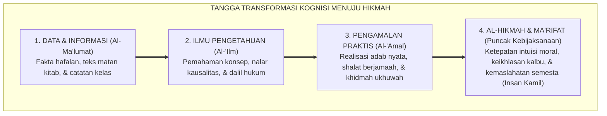

# P1-01-02-06: HIKMAH DAN KEBIJAKSANAAN DALAM PRAKSIS
## *Puncak Integrasi Ilmu dan Amal (Al-Hikmah), Konsep Adab sebagai Penempatan Segala Sesuatu pada Tempatnya, dan Formasi Insan Kamil*

**Nomor Identifikasi**: `P1-01-02-06/HIKMAH-KEBIJAKSANAAN/2026`  
**Domain**: `01 Philosophy` > `01 Worldview` > `02 Epistemologi TUMBUH`  
**Dewan Pakar**: `pakar-filosofi-tumbuh`, `pakar-epistemologi-turats`, `pakar-desain-kurikulum-adab`

---

## 📑 DAFTAR ISI ANALITIS

1. [1. Konsep Al-Hikmah: Muara Tertinggi Pencarian Ilmu](#1-konsep-al-hikmah-muara-tertinggi-pencarian-ilmu)
2. [2. Khazanah Nash: 'Wa Man Yu'tal Hikmata Faqad Utiya Khayran Katsira'](#2-khazanah-nash-wa-man-yutal-hikmata-faqad-utiya-khayran-katsira)
3. [3. Tiga Dimensi Hakikat Hikmah: 'Ilm, 'Amal, dan Hal](#3-tiga-dimensi-hakikat-hikmah-ilm-amal-dan-hal)
4. [4. Definisi Hikmah Prof. Al-Attas: Meletakkan Segala Sesuatu pada Maqamnya](#4-definisi-hikmah-prof-al-attas-meletakkan-segala-sesuatu-pada-maqamnya)
5. [5. Implikasi bagi Standar Karakter Lulusan Pesantren TUMBUH](#5-implikasi-bagi-standar-karakter-lulusan-pesantren-tumbuh)

---

### 1. Konsep Al-Hikmah: Muara Tertinggi Pencarian Ilmu

Dalam tradisi intelektual Islam, puncak capaian seorang penuntut ilmu bukanlah banyaknya tumpukan sertifikat, ijazah sanad, atau kepandaian bersilat lidah di atas panggung perdebatan. Puncak capaian ilmu adalah **Al-Hikmah (Kebijaksanaan Mendalam)**.

Banyak manusia yang memiliki informasi melimpah (*knowledge / data*), namun miskin kebijaksanaan (*wisdom / hikmah*). Mereka tahu hukum fiqh secara rinci, namun tidak bijak dalam memperlakukan manusia; mereka menguasai dalil ukhuwah, namun gemar menyakiti hati saudaranya. 

Ekosistem TUMBUH merancang seluruh proses pembelajaran di kelas dan pengasuhan di asrama untuk mengantarkan santri dari sekadar **Pencari Informasi (*Thalibul Ma'lumat*)** bertransformasi menjadi **Pemilik Kebijaksanaan Adab (*Shahibul Hikmah wal Adab*)**.

---

### 2. Khazanah Nash: 'Faqad Utiya Khayran Katsira'

Allah SWT memuji anugerah hikmah sebagai kebajikan terbesar yang dapat diraih oleh seorang manusia:

> $$\text{يُؤْتِي الْحِكْمَةَ مَن يَشَاءُ ۚ وَمَن يُؤْتَ الْحِكْمَةَ فَقَدْ أُوتِيَ خَيْرًا كَثِيرًا ۗ وَمَا يَذَّكَّرُ إِلَّا أُولُو الْأَلْبَابِ}$$
> 
> *"Allah menganugerahkan **al-Hikmah** kepada siapa yang Dia kehendaki. Dan barang siapa yang dianugerahi al-Hikmah, sungguh dia telah dianugerahi kebajikan yang amat banyak. Dan tidak ada yang dapat mengambil pelajaran melainkan Ulul Albab (orang-orang yang berakal budi mendalam)."* (QS. Al-Baqarah [2]: 269).

---

### 3. Tiga Dimensi Hakikat Hikmah

Para ulama *muhaqqiqin* mendefinisikan Hikmah sebagai keterpaduan tiga pilar:
1. **Dimensi Kognitif (*Al-'Ilm ash-Shahih*)**: Mengetahui hakikat kebenaran objektif sesuai kenyataan sebenarnya.
2. **Dimensi Konatif (*Al-'Amal ash-Shalih*)**: Kemampuan bertindak tepat, proporsional, dan adil pada saat dan situasi yang tepat.
3. **Dimensi Spiritual (*Al-Hal ash-Shadiq*)**: Kondisi kalbu yang tenang (*thuma'ninah*), ikhlas karena Allah, dan bersih dari pamrih duniawi.

---

### 4. Definisi Hikmah Prof. Syed Muhammad Naquib al-Attas

Prof. Al-Attas (1980; 1995) merumuskan korelasi erat antara **Hikmah, Keadilan, dan Adab**:

> *"Hikmah adalah ilmu yang dianugerahkan Allah yang dengannya seseorang mampu meletakkan segala sesuatu pada tempatnya yang tepat dan benar (*putting things in their proper places*). Penempatan yang tepat inilah hakikat **Keadilan ('Adl)**; dan manifestasi perilaku adil tersebut di dalam diri dan masyarakat adalah **Adab**."*

Santri yang bijak (*Hakim*) adalah santri yang:
* Menempatkan Allah sebagai satu-satunya sesembahan dan tujuan hidup (*Tauhid*).
* Menempatkan Rasulullah SAW sebagai satu-satunya teladan mutlak (*Ittiba'*).
* Menempatkan gurunya pada maqam penghormatan (*Ta'zhim*).
* Menempatkan sesama santri pada maqam kasih sayang dan perlindungan (*Ukhuwah*).
* Menempatkan alam sekitar pada maqam amanah pemeliharaan (*Imarah*).

---

### 5. Implikasi bagi Standar Karakter Lulusan TUMBUH

1. **Lulusan yang Problem-Solver**: Santri dilatih tidak sekadar menghafal teori masalah, melainkan memiliki kebijaksanaan mendamaikan konflik dan memberikan solusi nyata bagi problematika masyarakat.
2. **Keseimbangan Ketegasan dan Kasih Sayang**: Memahami kapan harus bersikap tegas menegakkan hukum (*Firm*) dan kapan harus mengedepankan pemaafan dan kelembutan (*Kind*).
3. **Kepemimpinan Berkemaslahatan (*Nafi'un Lighairihi*)**: Seluruh kecerdasan intelektual dan keilmuan yang dimiliki diwakafkan seutuhnya untuk melayani dan memakmurkan umat manusia.
