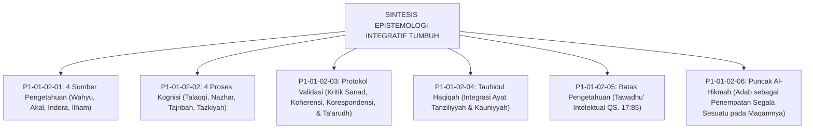

# P1-01-02-07: SINTESIS EPISTEMOLOGI DAN KRITIK INTERNAL
## *Konsolidasi Paradigma Integrasi Ilmu, Uji Falsifikasi Metodologi, dan Pertanggungjawaban Epistemologis TUMBUH*

**Nomor Identifikasi**: `P1-01-02-07/SINTESIS-EPISTEMOLOGI-KRITIK/2026`  
**Domain**: `01 Philosophy` > `01 Worldview` > `02 Epistemologi TUMBUH`  
**Dewan Pakar**: `pakar-epistemologi-turats`, `pakar-kritikus-dan-auditor-kualitas`, `pakar-filosofi-tumbuh`

---

## 📑 DAFTAR ISI ANALITIS

1. [1. Konsolidasi Sintesis Epistemologi TUMBUH](#1-konsolidasi-sintesis-epistemologi-tumbuh)
2. [2. Matriks Epistemologis Enam Pilar Keilmuan TUMBUH](#2-matriks-epistemologis-enam-pilar-keilmuan-tumbuh)
3. [3. Uji Kritis Internal: Menjawab Empat Tantangan Epistemologis](#3-uji-kritis-internal-menjawab-empat-tantangan-epistemologis)
4. [4. Kesimpulan Hasil Audit Epistemologi dan Rekomendasi Praksis](#4-kesimpulan-hasil-audit-epistemologi-dan-rekomendasi-praksis)

---

### 1. Konsolidasi Sintesis Epistemologi TUMBUH

Epistemologi TUMBUH adalah **Teori Pengetahuan Integratif-Teistik** yang menegakkan empat postulat:
1. **Otoritas Wahyu Sharih**: Al-Qur'an dan Sunnah sebagai pemandu nilai dan hakim tertinggi kebenaran.
2. **Keberdayaan Akal Sehat**: Akal budi sebagai instrumen penalaran, sintesis, dan penjelas hikmah syariat.
3. **Keabsahan Data Empiris**: Observasi indrawi dan riset sains sebagai alat membaca ayat-ayat kauniyyah.
4. **Kesucian Kalbu**: Tazkiyatun nafs sebagai syarat terbukanya pintu bashirah batin dan keberkahan ilmu.

---

### 2. Matriks Epistemologis Enam Pilar Keilmuan TUMBUH

| Modul Analisis | Fokus Pertanyaan Kunci | Dalil & Landasan Turats | Landasan Sains Kontemporer |
| :--- | :--- | :--- | :--- |
| **01 Sumber** | Apa saja saluran kebenaran sah? | QS. 96:5, Al-Ghazali (*Ihya*). | *Multi-Modal Epistemology*. |
| **02 Proses** | Bagaimana kognisi menyerap ilmu? | Talaqqi, Tadabbur, Istimbath. | *Cognitive Load & Dual-Coding*. |
| **03 Validasi** | Bagaimana menguji kebenaran? | Kritik Sanad, Kaidah Ushul Fiqh. | *Psychometrics & Scientific Method*. |
| **04 Integrasi** | Bagaimana menyatukan sains-Islam? | Tauhidul Haqiqah, Al-Attas. | *Holistic Interdisciplinary Science*. |
| **05 Batas** | Apa batas kapasitas akal? | QS. 17:85, Diwan Asy-Syafi'i. | *Epistemic Humility & Bounded Logic*. |
| **06 Hikmah** | Apa muara akhir penuntut ilmu? | QS. 2:269, Ibn Qayyim (*Madarij*). | *Wisdom Theory & Moral Action*. |

---

### 3. Uji Kritis Internal: Menjawab 4 Tantangan Epistemologis

#### Tantangan 1: Risiko Sinkretisme Keilmuan yang Liar
* **Kritik**: Apakah integrasi sains modern dengan Islam berisiko mencampuradukkan teori sekuler yang bertentangan dengan akidah?
* **Jawaban TUMBUH**: Tidak. Integrasi TUMBUH menerapkan proses **Tahdzib (Penyaringan Kritis)**: membuang asumsi materialistik-ateistik sekuler, mengambil metodologi observasi empirisnya yang valid, dan menundukkannya di bawah worldview tauhid.

#### Tantangan 2: Masalah Subjektivitas Ilham Kalbu
* **Kritik**: Bagaimana mencegah klaim ilham spiritual dijadikan alat legitimasi otoritarianisme guru?
* **Jawaban TUMBUH**: Menegakkan kaidah bahwa **Ilham tidak pernah menjadi dalil hukum syariat publik (*Laisa bi Hujjatin 'ala Ghairihi*)**. Setiap keputusan institusi wajib berlandaskan dalil nash atau data empiris objektif yang dapat diverifikasi bersama.

#### Tantangan 3: Tuduhan Antroposentrisme
* **Kritik**: Apakah pemanfaatan sains modern menggeser orientasi teosentris menjadi manusia sebagai pusat segalanya?
* **Jawaban TUMBUH**: Tidak. Seluruh sains dan neurosains diposisikan sebagai alat bantu meneliti tanda-tanda kebesaran Allah (*Ayat Kauniyyah*), memperkuat rasa takjub dan ketundukan kepada Sang Khaliq.

#### Tantangan 4: Keberlanjutan dalam Realitas Lapangan
* **Kritik**: Apakah epistemologi yang sedemikian mendalam ini dapat diterapkan oleh musyrif lapangan yang berpendidikan umum?
* **Jawaban TUMBUH**: Ya. Epistemologi ini telah diterjemahkan menjadi instrumen praktis yang mudah digunakan: **Logbook Digital PBIS, SOP Dual-Pillar, dan Rubrik Indikator Perilaku 10 Muwashafat**.

---

### 4. Kesimpulan Hasil Audit Epistemologi

Seluruh bangunan Epistemologi TUMBUH dinyatakan **VALID, KOHEREN, DAN SIAP DIOPERASIONALKAN**:
* Menjadi jembatan yang kokoh antara ranah filosofis metafisik dengan praksis operasional pengasuhan santri 24 jam.
