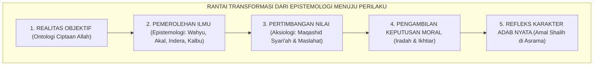

# P1-01-02: EPISTEMOLOGI EKOSISTEM TUMBUH
## *Monograf Induk Teori Pengetahuan: 4 Sumber, Proses Kognisi, Protokol Validasi, Integrasi Tauhidul Haqiqah, Batas Nalar, dan Puncak Al-Hikmah*

**Nomor Identifikasi**: `P1-01-02/EPISTEMOLOGI-INDUK/2026`  
**Domain**: `01 Philosophy` > `01 Worldview`  
**Dewan Pakar**: `pakar-epistemologi-turats`, `pakar-filosofi-tumbuh`, `pakar-pedagogi-master-guru`

---

## 📑 DAFTAR ISI ANALITIS

1. [1. Epistemologi sebagai Jembatan Ontologi Menuju Praksis Pendidikan](#1-epistemologi-sebagai-jembatan-ontologi-menuju-praksis-pendidikan)
2. [2. Peta Modular 7 Berkas Kajian Epistemologi TUMBUH](#2-peta-modular-7-berkas-kajian-epistemologi-tumbuh)
3. [3. Intisari Arsitektur Teori Pengetahuan Integratif](#3-intisari-arsitektur-teori-pengetahuan-integratif)
4. [4. Rantai Kausalitas: Dari Epistemologi Menuju Pembentukan Karakter](#4-rantai-kausalitas-dari-epistemologi-menuju-pembentukan-karakter)
5. [5. Implikasi bagi Standar Pengajaran dan Asesmen Pesantren 24-Jam](#5-implikasi-bagi-standar-pengajaran-dan-asesmen-pesantren-24-jam)

---

### 1. Epistemologi sebagai Jembatan Ontologi Menuju Praksis

Jika Ontologi menjawab pertanyaan: *"Apa hakikat realitas yang nyata?"*, maka Epistemologi menjawab pertanyaan fundamental: **"Bagaimana manusia mengetahui apa yang nyata, menguji kebenarannya, dan menerapkannya dalam kehidupan beradab?"**

Epistemologi adalah **sistem navigasi kognitif dan spiritual** yang menentukan bagaimana santri memproses informasi, membedakan kebenaran dari kepalsuan, serta mengambil keputusan moral dalam kehidupan sehari-hari di asrama dan masyarakat luas.

---

### 2. Peta Modular 7 Berkas Kajian Epistemologi TUMBUH

Bagian `02 Epistemologi TUMBUH` dibedah secara mendalam melintasi tujuh berkas monograf berjenjang:

| Kode Berkas | Judul Monograf Khusus | Intisari Pembahasan |
| :---: | :--- | :--- |
| **P1-01-02-01** | [**`Sumber Pengetahuan`**](./P1-01-02-01-Sumber-Pengetahuan.md) | Empat saluran epistemologis: Wahyu (*Khabar Shadiq*), Akal Sehat, Indera Empiris, dan Ilham Kalbu. |
| **P1-01-02-02** | [**`Proses Pengetahuan`**](./P1-01-02-02-Proses-Memperoleh-Pengetahuan.md) | Mekanisme kognisi: Talaqqi-Tadabbur, Nazhar-Istimbath, Musyahadah-Tajribah, dan Tazkiyah-Bashirah. |
| **P1-01-02-03** | [**`Validasi Pengetahuan`**](./P1-01-02-03-Validasi-Pengetahuan.md) | Kriteria kebenaran: Kritik Sanad-Matan, koherensi logika, korespondensi fakta, dan rekonsiliasi *Ta'arudh*. |
| **P1-01-02-04** | [**`Integrasi Pengetahuan`**](./P1-01-02-04-Integrasi-Pengetahuan.md) | Prinsip *Tauhidul Haqiqah*, penyatuan Ayat Tanziliyyah & Kauniyyah, dan pohon ilmu terpadu. |
| **P1-01-02-05** | [**`Batas Pengetahuan`**](./P1-01-02-05-Batas-Pengetahuan-Manusia.md) | Keterbatasan epistemologis insan (QS. 17:85), *Tawadhu' Intelektual*, dan budaya berani berkata "Wallahu A'lam". |
| **P1-01-02-06** | [**`Hikmah Kebijaksanaan`**](./P1-01-02-06-Hikmah-dan-Kebijaksanaan.md) | Puncak integrasi ilmu-amal, konsep Adab Al-Attas (menempatkan segala sesuatu pada tempatnya). |
| **P1-01-02-07** | [**`Sintesis & Kritik Internal`**](./P1-01-02-07-Sintesis-Epistemologi-dan-Kritik-Internal.md) | Konsolidasi matriks epistemologi dan pertanggungjawaban audit kualitas bebas sinkretisme. |

---

### 3. Intisari Arsitektur Teori Pengetahuan Integratif

1. **Kesatuan Sumber Kebenaran (*Tauhidul Haqiqah*)**: Menolak pemisahan ilmu agama vs ilmu umum; seluruh sains adalah sarana memahami keteraturan sunnatullah ciptaan Allah SWT.
2. **Keseimbangan Logika dan Penyucian Batin**: Mengasah kecerdasan nalar kritis (*Aql*) sembari menyucikan kalbu dari penyakit riya' dan hasad (*Tazkiyah*).
3. **Standar Kebenaran Berbasis Bukti**: Setiap klaim pengetahuan dan keputusan penegakan disiplin santri wajib didasarkan pada data faktual objektif yang tervalidasi.

---

### 4. Implikasi bagi Standar Pengajaran dan Asesmen

1. **Pedagogi Dialogis Berpikir Kritis**: Menghidupkan tradisi munazharah dan mudzakarah santri untuk melatih kemampuan problem-solving.
2. **Asesmen Berbasis Portofolio Bukti Nyata**: Mengukur kematangan santri dari pengamalan adab harian, bukan sekadar nilai ujian tertulis.
3. **Transformasi Menuju Insan Kamil**: Mengantarkan santri menjadi ulama-cendekiawan yang berintelektual tinggi, berhati lembut, dan bijaksana dalam memimpin masyarakat.
