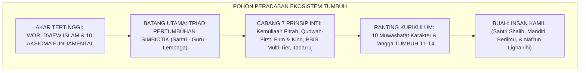

# P1-01: WORLDVIEW ISLAM & 10 AKSIOMA FUNDAMENTAL EKOSISTEM TUMBUH
## *Ru'yatul Islam lil-Wujud: Fondasi Filosofis Tertinggi, First Principles, dan Arsitektur Paradigma Pendidikan Pesantren*

**Nomor Identifikasi**: `P1-01/WORLDVIEW-TUMBUH-MASTER/2026`  
**Domain**: `01 Philosophy` > `01 Worldview`  
**Dewan Pakar**: `pakar-filosofi-tumbuh`, `pakar-epistemologi-turats`, `pakar-tata-kelola-qudwah`

---

## 📑 DAFTAR ISI ANALITIS

1. [1. Prolegomena: Worldview Islam sebagai Akar Seluruh Arsitektur TUMBUH](#1-prolegomena-worldview-islam-sebagai-akar-seluruh-arsitektur-tumbuh)
2. [2. Sepuluh Pertanyaan Eksistensial-Filosofis Peradaban Pesantren](#2-sepuluh-pertanyaan-eksistensial-filosofis-peradaban-pesantren)
3. [3. Rumusan Sepuluh Aksioma Fundamental (First Principles)](#3-rumusan-sepuluh-aksioma-fundamental-first-principles)
4. [4. Rantai Kausalitas Paradigmatis: Dari Worldview Menuju 11 Domain Operasional](#4-rantai-kausalitas-paradigmatis-dari-worldview-menuju-11-domain-operasional)
5. [5. Piagam Worldview Ekosistem TUMBUH Pesantren](#5-piagam-worldview-ekosistem-tumbuh-pesantren)

---

### 1. Prolegomena: Worldview Islam sebagai Akar Tertinggi

Setiap peradaban, sistem hukum, dan institusi pendidikan selalu bermula dari sebuah pandangan hidup (*Worldview / Weltanschauung*). Prof. Syed Muhammad Naquib al-Attas (1995) mendefinisikan Worldview Islam (*Ru'yatul Islam lil-Wujud*) sebagai:

> *"Pandangan tentang hakikat wujud dan kebenaran yang diproyeksikan oleh kalbu dan akal budi kaum beriman melalui perantara wahyu ilahi."*

Ekosistem TUMBUH menolak mengimpor asumsi-asumsi sekuler yang menceraikan pendidikan dari Tuhan. Worldview Islam menempatkan **Tauhidullah** sebagai poros sentral yang menyinari seluruh dimensi: memandang santri sebagai hamba Allah berfitrah suci, memandang ilmu sebagai amanah ibadah, memandang musyrif sebagai pelayan amanah nabawi, dan memandang pesantren sebagai miniatur peradaban Islam yang adil dan beradab.

---

### 2. Sepuluh Pertanyaan Eksistensial-Filosofis

Sebelum merumuskan SOP teknis atau aplikasi digital, Ekosistem TUMBUH menjawab sepuluh pertanyaan eksistensial dasar:

| No | Dimensi Filosofis | Pertanyaan Eksistensial | Jawaban Paradigma TUMBUH |
| :---: | :--- | :--- | :--- |
| **1** | **Ontologi** | *Apa hakikat realitas yang sebenarnya?* | Realitas objektif ciptaan Allah: keterpaduan alam ghaib dan alam syahadah. |
| **2** | **Antropologi** | *Siapa manusia dan bagaimana strukturnya?* | Hamba Allah berfitrah mulia dengan struktur Ruh, Qalb, Aql, dan Nafs. |
| **3** | **Teleologi** | *Mengapa manusia diciptakan di bumi?* | Untuk beribadah murni (*'Ibadatullah*) dan memakmurkan bumi (*'Imaratul Ardh*). |
| **4** | **Aksiologi** | *Apa sumber nilai dan standar moral tertinggi?* | Syariat Allah yang bersumber dari Al-Qur'an, Sunnah, dan Maqashid Syari'ah. |
| **5** | **Epistemologi** | *Bagaimana manusia meraih kebenaran yang sah?* | Integrasi 4 saluran: Wahyu sharih, Akal sehat, Indera empiris, dan Kalbu suci. |
| **6** | **Pedagogi** | *Apa hakikat sejati pendidikan Islam?* | *Ta'dib* holistik: penanaman adab 24-jam menyatukan ta'lim akal & tarbiyah raga. |
| **7** | **Dinamika Perubahan**| *Bagaimana transformasi karakter terjadi?* | Sunnatullah Taghyir, proses Tadarruj bertahap, dan pembiasaan habit 66-hari. |
| **8** | **Etika Penertiban** | *Bagaimana menangani kesalahan santri?* | Disiplin Restoratif (*Firm & Kind*), Konsekuensi 4R, dan rekonsiliasi *Ishlah al-Bain*. |
| **9** | **Kepemimpinan** | *Apa hakikat kepemimpinan di pesantren?* | Keteladanan *Qudwah First* dan kepemimpinan pelayan (*Sayyidul Qawmi Khadimuhum*). |
| **10**| **Tujuan Akhir** | *Apa tolok ukur keberhasilan lulusan pondok?* | Menjadi Insan Kamil yang bertakwa, mandiri, beradab, dan *Nafi'un Lighairihi*. |

---

### 3. Rumusan Sepuluh Aksioma Fundamental (*First Principles*)

1. **Aksioma 1 (Sumber Kebenaran)**: Allah SWT adalah *Al-Haqq*—sumber seluruh kebenaran absolut. Kebenaran moral tidak ditentukan oleh opini mayoritas atau tren budaya sekuler.
2. **Aksioma 2 (Kemuliaan Fitrah)**: Santri dilahirkan di atas fitrah kesucian primordial (*Fitrah al-Munazzalah*), membawa potensi tauhid dan kebaikan yang wajib dimuliakan (*Karamah Insaniyyah*).
3. **Aksioma 3 (Ketergantungan Makhluk)**: Manusia dan alam semesta bersifat kontingen (*Mumkin al-Wujud*), fakir secara ontologis, dan bergantung sepenuhnya pada rahmat Allah SWT.
4. **Aksioma 4 (Kepastian Sunnatullah)**: Allah menetapkan hukum kausalitas yang teratur dan pasti di alam fisik (*Kauniyyah*) maupun alam moral-sosial (*Syar'iyyah*).
5. **Aksioma 5 (Integrasi Ilmu & Iman)**: Tidak ada dikotomi antara sains empiris dan ilmu agama; seluruh ilmu hakiki adalah ayat-ayat Allah yang saling mengonfirmasi (*Tauhidul Haqiqah*).
6. **Aksioma 6 (Puncak Adab & Ta'dib)**: Adab adalah buah tertinggi dari ilmu; pendidikan Islam hakikatnya adalah penanaman adab (*Ta'dib*) yang menempatkan segala sesuatu pada maqamnya yang adil.
7. **Aksioma 7 (Gradualisme Tadarruj)**: Transformasi karakter manusia tunduk pada hukum pentahapan; perubahan berkelanjutan (*Adwamuha wa in Qalla*) lebih mulia daripada lonjakan sesaat.
8. **Aksioma 8 (Keadilan Restoratif)**: Kesalahan santri adalah peluang pembelajaran moral; penegakan aturan wajib bersifat *Firm & Kind* demi memulihkan ukhuwah dan martabat insan.
9. **Aksioma 9 (Keteladanan Qudwah)**: Bahasa perbuatan (*Lisanul Hal*) jauh lebih fasih daripada seribu ceramah lisan; pendidik wajib mengamalkan adab sebelum menuntutnya dari santri.
10. **Aksioma 10 (Akuntabilitas Khilafah)**: Setiap santri dan pendidik memikul mandat amanah pertanggungjawaban di hadapan Mahkamah Allah SWT demi kemaslahatan semesta alam (*Rahmatan lil 'Alamin*).

---

### 4. Rantai Kausalitas: Dari Worldview Menuju 11 Domain

```mermaid
graph TD
    WV["WORLDVIEW ISLAM (Ru'yatul Islam lil-Wujud)"]
    
    WV --> D01["01 PHILOSOPHY (Ontologi, Epistemologi, & Aksiologi)"]
    WV --> D02["02 PRINCIPLES (7 Prinsip Inti Konstitusi Pembinaan)"]
    WV --> D03["03 CAPACITY (10 Muwashafat Karakter Santri)"]
    WV --> D04["04 PROGRESSION (Tangga TUMBUH T1-T4 & 7 Tahap Kontinuum)"]
    WV --> D05["05 ASSESSMENT (Asesmen Pertumbuhan Ipsatif Berbasis Bukti)"]
    WV --> D06["06 INTERVENTION (Manual SW-PBIS Multi-Tier 1-3 & Restoratif)"]
    WV --> D07["07 IMPLEMENTATION (SOP Dual-Pillar & Manajemen Asrama 24-Jam)"]
    WV --> D08["08 INTEGRATED (Penyelarasan Total Madrasah-Asrama)"]
    WV --> D09["09 PROGRAMS (Jadwal Ritme Kehidupan & Halaqah)"]
    WV --> D10["10 METHODS (Didaktik Sorogan Interaktif & Coaching)"]
    WV --> D11["11 TOOLS (Logbook Digital PBIS & Dashboard Analitik)"]
```

---

### 5. Piagam Worldview Ekosistem TUMBUH Pesantren

> *"Dengan memohon ridha dan pertolongan Allah Subhanahu wa Ta'ala, Ekosistem TUMBUH berikrar untuk menegakkan seluruh proses pengasuhan dan pendidikan santri di atas fondasi Worldview Tauhid: memuliakan fitrah, meneladankan adab nabawi, menegakkan keadilan restoratif tanpa kekerasan, dan melahirkan generasi ulama-cendekiawan yang memancarkan cahaya peradaban bagi semesta alam."*