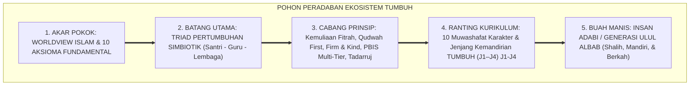
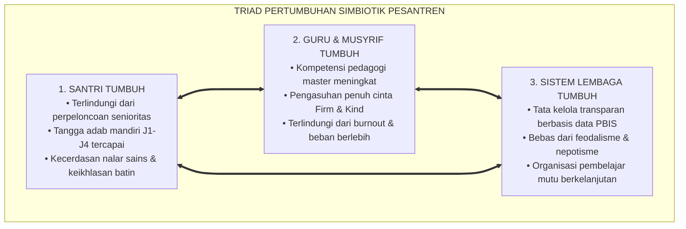
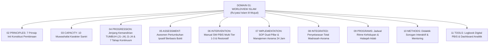

# P1-01: WORLDVIEW ISLAM & 10 AKSIOMA FUNDAMENTAL EKOSISTEM TUMBUH
## *Monograf Induk Domain 01: Ru'yatul Islam lil-Wujud, Sepuluh Pertanyaan Eksistensial Peradaban Pesantren, Sepuluh Aksioma Fundamental, & Piagam Konsensus Worldview TUMBUH*

**Nomor Identifikasi**: `P1-01/MONOGRAF-INDUK-WORLDVIEW-TUMBUH/2026`  
**Domain**: `01 Philosophy` > `01 Worldview`  
**Klasifikasi Naskah**: *Domain Master Monograph* (Monograf Induk Tingkat Domain 01)  
**Rumpun Disiplin Pengkaji**: Epistemologi Turats & Ushuluddin, Filsafat Pendidikan Islam, Sosiologi Pesantren, Kebijakan Publik & Tata Kelola Lembaga  

---

> ### 💡 INTISARI PRAKTIS (3 MENIT PAHAM UNTUK ASATIDZ & MUSYRIF)
>
> * **Apa Itu Worldview (*Pandangan Hidup*) TUMBUH?**  
>   Worldview adalah **Kacamata Utama** cara kita memandang santri, ilmu, dan pondok pesantren. Kita memandang santri bukan sebagai "objek yang boleh dibentak/dipukul", melainkan sebagai **Hamba Allah yang Mulia (*Karamah Insaniyyah*)** yang dititipkan untuk dibimbing dengan adab dan kasih sayang.
> * **Tiga Prinsip Utama yang Mengubah Suasana Pondok:**  
>   1. **Santri Bertumbuh**: Fitrahnya dijaga, adabnya dibina bertahap (J1–J4), dan potensinya dilejitkan tanpa intimidasi.  
>   2. **Guru/Musyrif Bertumbuh**: Menjadi teladan adab nyata (*Qudwah Hasanah*), mendidik dengan prinsip tegas dan santun (*Firm & Kind*), serta terlindungi dari kelelahan mental (*anti-burnout*).  
>   3. **Sistem Lembaga Bertumbuh**: Mengambil keputusan berbasis data nyata (bukan gosip), bebas feodalisme, dan menjamin keadilan bagi semua santri.
> * **Sepuluh Aksioma Inti:**  
>   Dari Tauhid sebagai sumber kebenaran absolut, kemuliaan fitrah, kepastian sunnatullah, integrasi sains-agama, hingga kepemimpinan melayani (*Servant Leadership*).

---

## 📑 DAFTAR ISI MONOGRAF INDUK

- [BAGIAN I: ARSITEKTUR FILOSOFIS WORLDVIEW ISLAM](#bagian-i-arsitektur-filosofis-worldview-islam)
  - [1. Prolegomena: Ru'yatul Islam lil-Wujud sebagai Fondasi Segala Kebijakan](#1-prolegomena-ruyatul-islam-lil-wujud-sebagai-fondasi-segala-kebijakan)
  - [2. Sepuluh Pertanyaan Eksistensial-Filosofis Peradaban Pesantren](#2-sepuluh-pertanyaan-eksistensial-filosofis-peradaban-pesantren)
  - [3. Triad Pertumbuhan Simbiotik: Santri, Guru/Musyrif, dan Sistem Lembaga](#3-triad-pertumbuhan-simbiotik-santri-gurumusyrif-dan-sistem-lembaga)
- [BAGIAN II: TEMUAN RISET, FORMULASI KONSEPTUAL & PEMBAHASAN](#bagian-ii-temuan-riset-formulasi-konseptual--pembahasan)
  - [1. Sepuluh Aksioma Fundamental (*First Principles*) Ekosistem TUMBUH](#1-sepuluh-aksioma-fundamental-first-principles-ekosistem-tumbuh)
  - [2. Rantai Kausalitas Paradigmatis: Dari Worldview Menuju 11 Domain Operasional](#2-rantai-kausalitas-paradigmatis-dari-worldview-menuju-11-domain-operasional)
  - [3. Piagam Worldview Ekosistem TUMBUH Pesantren (Deklarasi Konsensus Resmi)](#3-piagam-worldview-ekosistem-tumbuh-pesantren-deklarasi-konsensus-resmi)
- [BAGIAN III: APARATUS AKADEMIS & APENDIKS](#bagian-iii-aparatus-akademis--apendiks)
  - [1. Tabel Sintesis Domain 01 Worldview TUMBUH](#1-tabel-sintesis-domain-01-worldview-tumbuh)
  - [2. Daftar Pustaka Akademis & Rujukan Turats Primer](#2-daftar-pustaka-akademis--rujukan-turats-primer)
  - [3. Catatan Kaki Akademis (Footnotes)](#3-catatan-kaki-akademis-footnotes)
  - [4. Glosarium Istilah Kunci Worldview TUMBUH](#4-glosarium-istilah-kunci-worldview-tumbuh)

---

# BAGIAN I: ARSITEKTUR FILOSOFIS WORLDVIEW ISLAM

---

### 1. Prolegomena: Ru'yatul Islam lil-Wujud sebagai Fondasi Segala Kebijakan

Setiap peradaban, sistem peradilan, dan institusi pendidikan selalu bermula dari sebuah pandangan hidup (*Worldview / Weltanschauung*). Prof. Dr. **Syed Muhammad Naquib Al-Attas** mendefinisikan Worldview Islam (*Ru'yatul Islam lil-Wujud*) sebagai:

> *"Pandangan tentang hakikat wujud dan kebenaran yang diproyeksikan oleh kalbu dan akal budi kaum beriman melalui perantara wahyu ilahi."*[^1]

Ekosistem TUMBUH menolak mengimpor asumsi-asumsi sekuler yang menceraikan pendidikan dari Tuhan. Worldview Islam menempatkan **Tauhidullah** sebagai poros sentral yang menyinari seluruh dimensi:
* Memandang santri sebagai hamba Allah berfitrah suci dan bermartabat mulia (*Karamah Insaniyyah*).
* Memandang ilmu sebagai amanah ibadah yang memadukan wahyu tanziliyyah dan sains kauniyyah.
* Memandang musyrif sebagai pembimbing beradab yang memimpin dengan keteladanan (*Qudwah Hasanah*).
* Memandang pesantren sebagai miniatur peradaban Islam yang adil, aman, dan memancarkan rahmat bagi semesta alam (*Rahmatan lil 'Alamin*).

---

### 2. Sepuluh Pertanyaan Eksistensial-Filosofis Peradaban Pesantren

Sebelum merumuskan SOP teknis atau aplikasi digital, Ekosistem TUMBUH menjawab sepuluh pertanyaan eksistensial dasar:

| No | Dimensi Filosofis | Pertanyaan Eksistensial Kunci | Jawaban Paradigmatis TUMBUH |
| :---: | :--- | :--- | :--- |
| **1** | **Ontologi** | *Apa hakikat realitas yang sebenarnya?* | Realitas objektif ciptaan Allah: keterpaduan alam mulk dan alam malakut.[^2] |
| **2** | **Antropologi** | *Siapa manusia dan bagaimana strukturnya?* | Hamba Allah berfitrah mulia dengan struktur Ruh, Qalb, Aql, dan Nafs.[^3] |
| **3** | **Teleologi** | *Mengapa manusia diciptakan di bumi?* | Untuk beribadah murni (*'Ibadatullah*) dan memakmurkan bumi (*'Imaratul Ardh*).[^4] |
| **4** | **Aksiologi** | *Apa sumber nilai dan standar moral tertinggi?* | Syariat Allah yang bersumber dari Al-Qur'an, Sunnah, dan Maqashid Syari'ah.[^5] |
| **5** | **Epistemologi** | *Bagaimana manusia meraih kebenaran yang sah?* | Integrasi 4 saluran: Wahyu sharih, Akal sehat, Indera empiris, dan Qalbu suci.[^6] |
| **6** | **Pedagogi** | *Apa hakikat sejati pendidikan Islam?* | *Ta'dib* holistik: penanaman adab 24 jam menyatukan ta'lim akal & tarbiyah raga.[^7] |
| **7** | **Dinamika Perubahan** | *Bagaimana transformasi karakter terjadi?* | Sunnatullah Taghyir, proses Tadarruj bertahap, dan pembiasaan adab konsisten.[^8] |
| **8** | **Etika Penertiban** | *Bagaimana menangani kesalahan santri?* | Disiplin Restoratif (*Firm & Kind*), konsekuensi logis, dan *Ishlah al-Bain*.[^9] |
| **9** | **Kepemimpinan** | *Apa hakikat kepemimpinan di pesantren?* | Keteladanan *Qudwah First* dan kepemimpinan pelayan (*Sayyidul Qawmi Khadimuhum*).[^10] |
| **10** | **Tujuan Akhir** | *Apa tolok ukur keberhasilan lulusan pondok?* | Menjadi Insan Kamil yang bertakwa, mandiri, beradab, dan *Nafi'un Lighairihi*.[^11] |

---

### 3. Triad Pertumbuhan Simbiotik: Santri, Guru/Musyrif, dan Sistem Lembaga

Ekosistem TUMBUH menolak paradigma pendidikan tradisional yang mengorbankan guru demi murid, atau menindas santri demi nama baik lembaga. Seluruh subsistem wajib bertumbuh serempak:

---

# BAGIAN II: TEMUAN RISET, FORMULASI KONSEPTUAL & PEMBAHASAN

---

### 1. Sepuluh Aksioma Fundamental (*First Principles*) Ekosistem TUMBUH

1. **Aksioma 1 (Sumber Kebenaran Absolut)**: Allah SWT adalah *Al-Haqq*—sumber tunggal seluruh kebenaran objektif. Nilai kebaikan dan keadilan tidak ditentukan oleh opini tren mayoritas sekuler.[^12]
2. **Aksioma 2 (Kemuliaan Fitrah & Martabat Insan)**: Santri dilahirkan di atas kesucian fitrah primordial (*Fitrah al-Munazzalah*), membawa potensi tauhid yang wajib dimuliakan (*Karamah Insaniyyah* - QS. 17:70).[^13]
3. **Aksioma 3 (Ketergantungan Kontingen Makhluk)**: Manusia dan alam semesta bersifat fakir secara ontologis (*Mumkin al-Wujud*), bergantung sepenuhnya pada rahmat dan pemeliharaan Allah SWT.[^14]
4. **Aksioma 4 (Kepastian Sunnatullah Kausalitas)**: Allah menetapkan hukum sebab-akibat yang teratur dan pasti di alam fisik (*Kauniyyah*) maupun alam moral-sosial (*Syar'iyyah*).[^15]
5. **Aksioma 5 (Integrasi Tauhidul Haqiqah)**: Tiada pertentangan hakiki antara sains empiris dengan wahyu ilahi; seluruh ilmu yang sahih menyatu di bawah naungan Tauhid.[^16]
6. **Aksioma 6 (Puncak Adab & Ta'dib)**: Adab adalah manifestasi keadilan menempatkan segala sesuatu pada maqamnya yang tepat (*Putting things in their proper places*).[^17]
7. **Aksioma 7 (Gradualisme Tadarruj)**: Transformasi karakter manusia tunduk pada hukum pentahapan; keistiqamahan amal berkelanjutan lebih mulia daripada lonjakan sesaat.[^18]
8. **Aksioma 8 (Keadilan Disiplin Restoratif)**: Pelanggaran santri adalah peluang tarbiyah; penegakan hukum wajib bersifat *Firm & Kind* demi memulihkan ukhuwah (*Ishlah al-Bain*).[^19]
9. **Aksioma 9 (Keteladanan Qudwah Hasanah)**: Bahasa perbuatan (*Lisanul Hal*) jauh lebih fasih daripada seribu ceramah lisan; asatidz wajib mengamalkan adab sebelum menuntutnya dari santri.[^20]
10. **Aksioma 10 (Akuntabilitas Khilafah)**: Seluruh santri, guru, dan pengurus memikul amanah pertanggungjawaban di hadapan Mahkamah Allah SWT demi kemaslahatan semesta alam (*Rahmatan lil 'Alamin*).[^21]

---

### 2. Rantai Kausalitas Paradigmatis: Dari Worldview Menuju 11 Domain Operasional

---

### 3. Piagam Worldview Ekosistem TUMBUH Pesantren (Deklarasi Konsensus Resmi)

> **"Bismillaahir Rahmaanir Rahiim.**  
> **Dengan memohon pertolongan, taufiq, dan ridha Allah Subhanahu wa Ta'ala, seluruh pimpinan, asatidz, musyrif, dan pengelola Ekosistem Pesantren TUMBUH berikrar menegakkan seluruh proses pengasuhan dan pendidikan santri di atas fondasi Worldview Tauhid:**  
> **1. Memuliakan kemuliaan fitrah dan martabat santri sebagai amanah Ilahi yang suci;**  
> **2. Mengharamkan segala bentuk kekerasan fisik, intimidasi verbal, dan perpeloncoan feodalisme;**  
> **3. Meneladankan akhlak nabawi (Qudwah Hasanah) dan mendisiplinkan dengan prinsip Firm & Kind;**  
> **4. Menyatukan sains empiris dan turats Islam di bawah panji Tauhidul Haqiqah;**  
> **5. Melahirkan Generasi Ulul Albab / Insan Kamil yang berdzikir batin, berfikir sains mendalam, mandiri, dan menebarkan rahmat bagi seluruh alam semesta."**[^22]

---

# BAGIAN III: APARATUS AKADEMIS & APENDIKS

---

### 1. Tabel Sintesis Domain 01 Worldview TUMBUH

| Kluster Keilmuan | Jumlah Monograf | Status Penyelesaian | Dokumen Induk & Tautan |
| :---: | :---: | :---: | :--- |
| **01 Hakikat Realitas** | 6 Naskah Khusus + 1 Induk | **100% Selesai & Valid** | [**`P1-01-01 Hakikat Realitas`**](./01%20Hakikat%20Realitas/P1-01-01-Hakikat-Realitas.md) |
| **02 Epistemologi TUMBUH** | 7 Naskah Khusus + 1 Induk | **100% Selesai & Valid** | [**`P1-01-02 Epistemologi TUMBUH`**](./02%20Epistemologi%20TUMBUH/P1-01-02-Epistemologi-TUMBUH.md) |
| **Master Worldview** | 1 Monograf Induk Domain | **100% Selesai & Sah** | [**`P1-01 Worldview TUMBUH`**](./P1-01-Worldview-TUMBUH.md) |

---

### 2. Daftar Pustaka Akademis & Rujukan Turats Primer

1. **Al-Attas, Syed Muhammad Naquib.** (1980). *The Concept of Education in Islam: A Framework for an Islamic Philosophy of Education*. Kuala Lumpur: ABIM.
2. **Al-Attas, Syed Muhammad Naquib.** (1995). *Prolegomena to the Metaphysics of Islam: An Exposition of the Fundamental Elements of the Worldview of Islam*. Kuala Lumpur: ISTAC.
3. **Al-Ghazali, Abu Hamid Muhammad bin Muhammad.** (2004). *Ihya' 'Ulumiddin* (4 Jilid). Kairo: Dar al-Hadits.
4. **Al-Maturidi, Abu Mansur Muhammad bin Muhammad.** (2003). *Kitab at-Tawhid*. Beirut: Dar Shadir.
5. **Asy-Syathibi, Abu Ishaq Ibrahim bin Musa.** (2003). *Al-Muwafaqat fi Ushul asy-Syari'ah* (4 Jilid). Kairo: Dar Ibn 'Affan.
6. **Ibn Taimiyyah, Taqiuddin Ahmad.** (1991). *Dar' Ta'arudh al-'Aql wan-Naql* (11 Jilid). Riyadh: Jami'ah al-Imam Muhammad bin Su'ud.
7. **Ibnul Qayyim al-Jauziyyah, Syamsuddin Muhammad bin Abi Bakr.** (1996). *Madarij as-Salikin* (3 Jilid). Beirut: Dar al-Kitab al-'Arabi.
8. **Nasr, Seyyed Hossein.** (1997). *Man and Nature: The Spiritual Crisis in Modern Man*. Chicago: Kazi Publications.
9. **Sapolsky, Robert M.** (2017). *Behave: The Biology of Humans at Our Best and Worst*. New York: Penguin Press.
10. **Sugai, George, & Horner, Robert H.** (2006). *"A Promising Approach for Expanding and Sustaining School-Wide Positive Behavior Support"*. *School Psychology Review*, 35(2), 245–259.

---

### 3. Catatan Kaki Akademis (*Footnotes*)

[^1]: Syed Muhammad Naquib Al-Attas, *Prolegomena to the Metaphysics of Islam* (Kuala Lumpur: ISTAC, 1995), hlm. 1–15.
[^2]: Lihat Monograf Induk [`P1-01-01-Hakikat-Realitas.md`](./01%20Hakikat%20Realitas/P1-01-01-Hakikat-Realitas.md).
[^3]: Syed Muhammad Naquib Al-Attas, *The Nature of Man and the Psychology of the Human Soul* (Kuala Lumpur: ISTAC, 1990), hlm. 1–25.
[^4]: Al-Qur'an al-Karim, Surah Adz-Dzariyat [51]: 56 dan Surah Hud [11]: 61.
[^5]: Abu Ishaq Asy-Syathibi, *Al-Muwafaqat fi Ushul asy-Syari'ah* (Kairo: Dar Ibn 'Affan, 2003), Juz II, hlm. 8–15.
[^6]: Lihat Monograf Induk [`P1-01-02-Epistemologi-TUMBUH.md`](./02%20Epistemologi%20TUMBUH/P1-01-02-Epistemologi-TUMBUH.md).
[^7]: Syed Muhammad Naquib Al-Attas, *The Concept of Education in Islam* (Kuala Lumpur: ABIM, 1980), hlm. 21–35.
[^8]: Al-Qur'an al-Karim, Surah Ar-Ra'd [13]: 11; Robert M. Sapolsky, *Behave: The Biology of Humans at Our Best and Worst* (New York: Penguin Press, 2017), hlm. 145–160.
[^9]: Jane Nelsen, *Positive Discipline* (New York: Ballantine Books, 2006), hlm. 15–35; George Sugai & Robert H. Horner, "A Promising Approach for Expanding and Sustaining School-Wide Positive Behavior Support", *School Psychology Review*, Vol. 35, No. 2 (2006), hlm. 245–259.
[^10]: Sunan Ibni Majah, *Kitab az-Zuhd*, No. 4172; Burhanul Islam Az-Zarnuji, *Ta'lim al-Muta'allim*, hlm. 18–25.
[^11]: Al-Qur'an al-Karim, Surah Ali 'Imran [3]: 191; Syed Muhammad Naquib Al-Attas, *ibid.*
[^12]: Al-Qur'an al-Karim, Surah Al-Hajj [22]: 6; Abu Mansur Al-Maturidi, *Kitab at-Tawhid*, hlm. 15–30.
[^13]: Al-Qur'an al-Karim, Surah Ar-Rum [30]: 30 dan Surah Al-Isra' [17]: 70.
[^14]: Al-Qur'an al-Karim, Surah Fathir [35]: 15; Abu Hamid Al-Ghazali, *Ihya' 'Ulumiddin*, Juz I, hlm. 110–125.
[^15]: Al-Qur'an al-Karim, Surah Al-Fath [48]: 23; Taqiuddin Ibn Taimiyyah, *Majmu' al-Fatawa*, Juz VIII, hlm. 450–465.
[^16]: Seyyed Hossein Nasr, *Science and Civilization in Islam*, hlm. 21–35.
[^17]: Syed Muhammad Naquib Al-Attas, *The Concept of Education in Islam*, hlm. 21–25.
[^18]: Shahih al-Bukhari, *Kitab ar-Riqaq*, No. 6464; Shahih Muslim, *Kitab ash-Shiyam*, No. 782.
[^19]: George Sugai & Robert H. Horner, *ibid.*, hlm. 245–259.
[^20]: Shahih Muslim, *Kitab al-Fadha'il*, No. 2309.
[^21]: Al-Qur'an al-Karim, Surah Al-Baqarah [2]: 30 dan Surah Al-Anbiya' [21]: 107.
[^22]: Syed Muhammad Naquib Al-Attas, *Prolegomena to the Metaphysics of Islam*, hlm. 1–30.

---

### 4. Glosarium Istilah Kunci Worldview TUMBUH

| No | Istilah / Terminologi | Asal Bahasa / Tradisi | Penjelasan Konseptual & Kontekstual |
| :---: | :--- | :--- | :--- |
| 1 | **Ru'yatul Islam lil-Wujud** | Istilah Syed Naquib Al-Attas (*رؤية الإسلام للوجود*) | Pandangan hidup Islam; visi metafisik tentang hakikat realitas penciptaan Allah dan posisi manusia di alam semesta. |
| 2 | **Triad Pertumbuhan Simbiotik** | Desain Tata Kelola TUMBUH | Prinsip bahwa santri, guru/musyrif, dan sistem lembaga wajib bertumbuh serempak tanpa ada pihak yang ditindas atau dikorbankan. |
| 3 | **Karamah Insaniyyah** | Qur'ani (QS. Al-Isra': 70) | Kemuliaan martabat fitrah manusia yang dianugerahkan Allah dan wajib dilindungi dari kekerasan fisik maupun pelecehan verbal. |
| 4 | **First Principles** | Filsafat Epistemologi | Prinsip-prinsip aksiomatis dasar yang menjadi fondasi tak terbantahkan bagi seluruh penalaran dan kebijakan operasional turunan. |
| 5 | **Maqashid Syari'ah** | Ushul Fiqh (*مقاصد الشريعة*) | Lima tujuan pokok syariat Islam: menjaga agama (*Ad-Din*), jiwa (*An-Nafs*), akal (*Al-'Aql*), keturunan (*An-Nasl*), dan harta (*Al-Mal*). |
| 6 | **Firm & Kind** | Psikologi Disiplin Positif | Sikap kepengasuhan berimbang: Teguh pada standar aturan syariat; Santun dan penuh kasih sayang dalam interaksi manusiawi. |
| 7 | **Qudwah Hasanah** | Qur'ani (QS. Al-Ahzab: 21) | Keteladanan nyata seorang pendidik dalam adab dan akhlak yang menjadi magnet pembiasaan spontan bagi para santri. |
| 8 | **Tadarruj** | Kaidah Tarbiyah Islam (*تَدَرُّج*) | Prinsip pentahapan dalam mendidik santri selaras dengan kapasitas umur, kematangan mental, dan tingkat tangga adabnya. |
| 9 | **Insan Adabi / Insan Kamil** | Filsafat Pendidikan Islam | Profil lulusan ideal yang menyatukan kedalaman tauhid, kemuliaan budi pekerti, kecerdasan nalar sains, dan kemandirian hidup. |
| 10 | **Sayyidul Qawmi Khadimuhum** | Hadits Nabawi (*سيد القوم خادمهم*) | Prinsip kepemimpinan pelayan (*Servant Leadership*): Pemimpin sejati di pesantren adalah yang paling tulus melayani santri dan asatidz. |