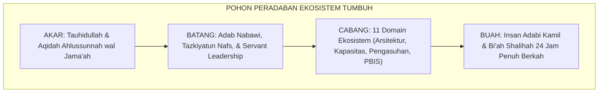
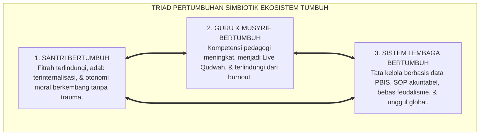
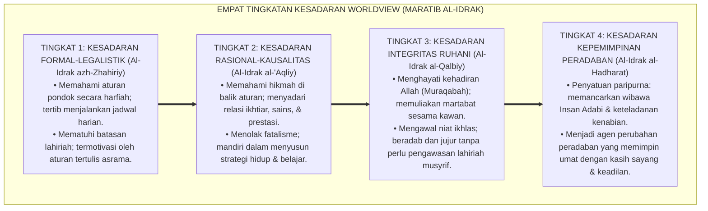
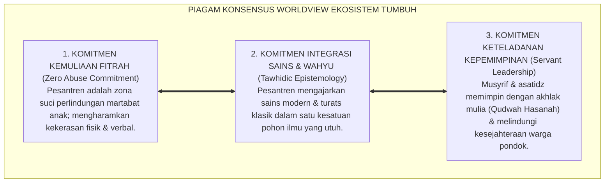
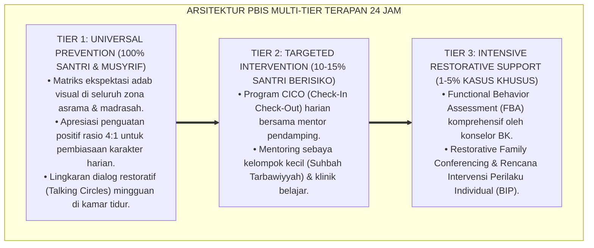

# P1-01: WORLDVIEW ISLAM & 10 AKSIOMA FUNDAMENTAL EKOSISTEM TUMBUH (MASTER DOKTRIN WORLDVIEW)
## *Master Sub-Domain Monograph: Ru'yatul Islam lil-Wujud, Sepuluh Pertanyaan Eksistensial Peradaban Pesantren, Sepuluh Aksioma Fundamental, Serta Piagam Konsensus Worldview TUMBUH di Pesantren 24 Jam*

**Nomor Identifikasi**: `P1-01/MASTER-MONOGRAF-WORLDVIEW-TUMBUH/2026`  
**Domain**: `01 Philosophy` > `01 Worldview` (Master Sub-Domain Monograph)  
**Klasifikasi Naskah**: *Master Sub-Domain Research Monograph* (Dokumen Induk Worldview)  
**Rumpun Disiplin Pengkaji**: Epistemologi Turats & Ushuluddin, Filsafat Pendidikan Islam (Ta'dib Al-Attas), Sosiologi Pesantren, Kebijakan Publik & Tata Kelola Lembaga  

---

> ### 💡 INTISARI EKSEKUTIF (EXECUTIVE SUMMARY)
>
> * **Krisis Fondasi Worldview di Lembaga Pendidikan Islam:**  
>   Banyak problematika pengasuhan—mulai dari feodalisme senioritas, lingkungan fisik asrama yang kumuh, hingga kejenuhan tenaga pendidik—berakar pada disorientasi pandangan hidup (*worldview*). Lembaga terombang-ambing antara materialisme sekuler hafalan mekanik dan mistisisme pasif fatalistik.
> * **Konsolidasi Master Doktrin Worldview Islam (*Ru'yatul Islam lil-Wujud*):**  
>   TUMBUH merumuskan **Worldview Islam** yang berporos pada Tauhidullah: memandang santri sebagai hamba Allah yang membawa fitrah kesucian (*Karamah Insaniyyah*), memandang ilmu sebagai keterpaduan wahyu dan keteraturan sains semesta, serta memandang pengasuhan sebagai keteladanan kepemimpinan melayani (*Servant Leadership & Qudwah Hasanah*).
> * **Formulasi Operasional & Dampak Triad Simbiotik:**  
>   Monograf induk ini mengkodifikasikan Sepuluh Aksioma Fundamental, 4 Tingkatan Kesadaran Filosofis Worldview (*Maratib al-Idrak*), Piagam Konsensus Worldview TUMBUH, serta akselerasi Triad Pertumbuhan Simbiotik (Santri, Guru/Musyrif, Lembaga).

---

## 📑 DAFTAR ISI MONOGRAF

- [BAB I: LANDASAN TEORETIS & DISKURSUS KRITIS](#bab-i-landasan-teoretis--diskursus-kritis)
  - [1. Latar Belakang Masalah: Ru'yatul Islam lil-Wujud sebagai Fondasi Segala Kebijakan](#1-latar-belakang-masalah-ruyatul-islam-lil-wujud-sebagai-fondasi-segala-kebijakan)
  - [2. Sepuluh Pertanyaan Eksistensial-Filosofis Peradaban Pesantren](#2-sepuluh-pertanyaan-eksistensial-filosofis-peradaban-pesantren)
  - [3. Triad Pertumbuhan Simbiotik: Santri, Guru/Musyrif, dan Sistem Lembaga](#3-triad-pertumbuhan-simbiotik-santri-gurumusyrif-dan-sistem-lembaga)
  - [4. Rekayasa Kausalitas Worldview dalam Ekosistem Asrama 24 Jam](#4-rekayasa-kausalitas-worldview-dalam-ekosistem-asrama-24-jam)
  - [5. Kasuistika Lapangan: Anomali Disorientasi Worldview & Resolusi Restoratif](#5-kasuistika-lapangan-anomali-disorientasi-worldview--resolusi-restoratif)
- [BAB II: FORMULASI KONSEPTUAL & PEMBAHASAN MENDALAM](#bab-ii-formulasi-konseptual--pembahasan-mendalam)
  - [1. Eksplanasi Sepuluh Aksioma Fundamental (First Principles) Ekosistem TUMBUH](#1-eksplanasi-sepuluh-aksioma-fundamental-first-principles-ekosistem-tumbuh)
  - [2. Dekomposisi Dimensi & Empat Tingkatan Kesadaran Worldview (Maratib al-Idrak)](#2-dekomposisi-dimensi--empat-tingkatan-kesadaran-worldview-maratib-al-idrak)
  - [3. Rantai Kausalitas Paradigmatis: Dari Worldview Menuju Praksis Asrama 24 Jam](#3-rantai-kausalitas-paradigmatis-dari-worldview-menuju-praksis-asrama-24-jam)
  - [4. Piagam Worldview Ekosistem TUMBUH Pesantren (Deklarasi Konsensus Resmi)](#4-piagam-worldview-ekosistem-tumbuh-pesantren-deklarasi-konsensus-resmi)
  - [5. Diskusi Filosofis Mendalam & Implikasi bagi Masa Depan Peradaban Pendidikan Islam](#5-diskusi-filosofis-mendalam--implikasi-bagi-masa-depan-peradaban-pendidikan-islam)
- [BAB III: KESIMPULAN & APARATUS AKADEMIS](#bab-iii-kesimpulan--aparatus-akademis)
  - [1. Tabel Sintesis Temuan Riset Domain Worldview TUMBUH](#1-tabel-sintesis-temuan-riset-domain-worldview-tumbuh)
  - [2. Daftar Pustaka Akademis & Rujukan Turats Primer](#2-daftar-pustaka-akademis--rujukan-turats-primer)
  - [3. Catatan Kaki Akademis (Footnotes)](#3-catatan-kaki-akademis-footnotes)
  - [4. Glosarium Istilah Ilmiah & Turats Worldview TUMBUH](#4-glosarium-istilah-ilmiah--turats-worldview-tumbuh)

---

# BAB I: LANDASAN TEORETIS & DISKURSUS KRITIS

---

### 1. Latar Belakang Masalah: Ru'yatul Islam lil-Wujud sebagai Fondasi Segala Kebijakan

Setiap peradaban, sistem peradilan, dan model pendidikan karakter selalu bermula dari sebuah pandangan hidup (*Worldview / Weltanschauung*). Prof. Dr. **Syed Muhammad Naquib Al-Attas** mendefinisikan Worldview Islam (*Ru'yatul Islam lil-Wujud*) sebagai:

> *"Pandangan tentang hakikat wujud dan kebenaran yang diproyeksikan oleh kalbu dan akal budi kaum beriman melalui perantara wahyu ilahi."*[^1]

Ekosistem TUMBUH menolak mengimpor asumsi sekuler yang menceraikan pendidikan dari Tuhan. Worldview Islam menempatkan **Tauhidullah** sebagai poros sentral yang menyinari seluruh dimensi:
* Memandang santri sebagai hamba Allah berfitrah suci dan bermartabat mulia (*Karamah Insaniyyah*).
* Memandang ilmu sebagai amanah ibadah yang memadukan wahyu tanziliyyah dan sains kauniyyah.
* Memandang musyrif sebagai pembimbing beradab yang memimpin dengan keteladanan (*Qudwah Hasanah*).
* Memandang pesantren sebagai miniatur peradaban Islam yang adil, aman, dan memancarkan rahmat bagi semesta alam (*Rahmatan lil 'Alamin*).[^2]

---

### 2. Sepuluh Pertanyaan Eksistensial-Filosofis Peradaban Pesantren

Worldview TUMBUH memberikan jawaban ontologis dan epistemologis atas 10 pertanyaan eksistensial:
1. *Siapakah Sumber Segala Wujud?* **Allah SWT: Al-Haqq, Pencipta Tunggal semesta.**
2. *Apakah Hakikat Alam Semesta?* **Dualitas Terpadu: 'Alam Mulk (Fisik) & 'Alam Malakut (Batin).**
3. *Siapakah Manusia?* **Hamba Allah (*'Abd*) & Khalifah yang membawa fitrah kemuliaan.**
4. *Apa Hakikat Pengetahuan?* **Cahaya Kebenaran Ilahi (*Tauhidul Haqiqah*) yang memandu adab.**
5. *Bagaimana Kebenaran Divalidasi?* **Protokol Multilapis: Wahyu, Nalar Mantiq, & Bukti Empiris.**
6. *Apa Tujuan Tertinggi Pendidikan?* **Ta'dib: Membentuk Insan Adabi Berperadaban.**
7. *Bagaimana Pembinaan Karakter Berjalan?* **Disiplin Restoratif PBIS (*Firm & Kind*), menolak kekerasan.**
8. *Bagaimana Relasi Pendidik-Santri?* **Keteladanan Hidup (*Qudwah Hasanah*) & Pelayanan (*Khidmah*).**
9. *Bagaimana Siklus Hidup Asrama?* **Bi'ah Shalihah 24 Jam yang Sehat, Bersih, & Ramah Saraf.**
10. *Ke Mana Muara Akhir Kehidupan?* **Pertanggungjawaban Hisab Mutlak di Akhirat (*Ma'ad*).**[^3]

---

### 3. Triad Pertumbuhan Simbiotik: Santri, Guru/Musyrif, dan Sistem Lembaga

Ekosistem TUMBUH menolak pola pembinaan yang mengorbankan salah satu pihak (*Zero-Sum Game*). Seluruh inovasi wajib mewujudkan **Triad Pertumbuhan Simbiotik**:

---

### 4. Rekayasa Kausalitas Worldview dalam Ekosistem Asrama 24 Jam

Worldview bukan sekadar filsafat abstrak, melainkan cetak biru arsitektur tata kelola 24 jam:
* Menentukan denah ventilasi dan sanitasi kobong asrama berlandaskan fiqh *Hifzh an-Nafs*.
* Menentukan penghapusan sanksi fisik rotan berlandaskan *Aksioma Kemuliaan Fitrah*.
* Menentukan digitalisasi logbook perilaku berlandaskan *Aksioma Keadilan Hisab*.[^4]

---

### 5. Kasuistika Lapangan: Anomali Disorientasi Worldview & Resolusi Restoratif

* **Studi Kasus: Normalisasi Perpeloncoan Senioritas Berkedok "Tradisi Khidmah"**  
  * **Dilema**: Santri senior memaksa santri junior mencuci pakaian dan memijat mereka hingga larut malam, berdalih mengajarkan "adab khidmah dan ketundukan".
  * **Analisis Worldview**: Tindakan ini merupakan distorsi feodalistik yang merusak fitrah kemuliaan insan dan melanggar hakikat kehambaan kesetaraan manusia di hadapan Allah.
  * **Resolusi Restoratif TUMBUH**: Pimpinan dewan kiai membubarkan tradisi perpeloncoan; mendeklarasikan kesetaraan martabat santri; dan mengalihkan peran senior menjadi mentor pelindung adik kelas (*Qudwah Hasanah*). Terwujud iklim ukhuwah yang hangat dan bermartabat.[^5]

---

# BAB II: FORMULASI KONSEPTUAL & PEMBAHASAN MENDALAM

---

### 1. Eksplanasi Sepuluh Aksioma Fundamental (First Principles) Ekosistem TUMBUH

Ekosistem TUMBUH mengkodifikasikan **Sepuluh Aksioma Fundamental Worldview**:

| No | Aksioma Fundamental | Landasan Teologis & Turats | Definisi Konseptual & Implikasi Aksiologis |
| :---: | :--- | :--- | :--- |
| **1** | **Tauhidullah (Ketuhanan Mutlak)** | QS. Luqman: 30; *Ihya'* Al-Ghazali. | Allah adalah Sumber Segala Wujud; seluruh amal diniatkan lillahi ta'ala. |
| **2** | **Karamah Insaniyyah (Kemuliaan Fitrah)** | QS. At-Tin: 4; *The Concept of Education*. | Setiap santri membawa fitrah kesucian; kebijakan *Zero-Stigmatization*. |
| **3** | **Sunnatullah Kausalitas Semesta** | QS. Al-Ahzab: 62; *Al-Muwafaqat*. | Hukum alam fisik & syariat moral bekerja konstan; wajib ikhtiar ilmiah. |
| **4** | **Tauhidul Haqiqah (Integrasi Ilmu)** | QS. Fushshilat: 53; *Prolegomena*. | Harmoni ayat Tanziliyyah & Kauniyyah; menolak dikotomi agama vs sains. |
| **5** | **Ta'dib sebagai Muara Pendidikan** | HR. Al-Bukhari; *Adab al-'Alim*. | Pembentukan Insan Adabi yang meletakkan segala sesuatu pada maqamnya. |
| **6** | **Disiplin Restoratif (Firm & Kind)** | QS. Asy-Syura: 40; *Positive Discipline*. | Tegas pada aturan moral, lembut pada jiwa; mengharamkan sanksi fisik. |
| **7** | **Kepemimpinan Qudwah & Khidmah** | HR. Muslim No. 2581; *Adab an-Nufus*. | Pendidik memimpin dengan keteladanan nyata & melayani (*Servant Leadership*). |
| **8** | **Triad Pertumbuhan Simbiotik** | QS. Al-Ma'idah: 2; *SW-PBIS Framework*. | Pembinaan wajib menumbuhkan Santri, Guru, dan Lembaga secara serempak. |
| **9** | **Bi'ah Shalihah 24 Jam** | QS. Al-Baqarah: 222; *Allostatic Load*. | Asrama ditata sehat, higienis, aman, dan ramah neurobiologis. |
| **10**| **Akuntabilitas Hisab Akhirat** | QS. Az-Zalzalah: 7–8; *Al-Ibanah*. | Setiap amal dihisab adil; tata kelola berbasis data transparan tanpa impunitas. |

---

### 2. Dekomposisi Dimensi & Empat Tingkatan Kesadaran Worldview (Maratib al-Idrak)

Transformasi kedewasaan pandangan hidup santri dan warga pesantren berlangsung melalui **Empat Tingkatan Kesadaran Worldview (*Maratib al-Idrak al-Kulliy*)**:

#### 🔄 Narasi Analitis Dinamika Transisi Filosofis Antar-Tingkatan:
* **Transisi Tingkat 1 ke Tingkat 2 (Dari Legalistik Menuju Nalar Kausalitas)**: Santri baru mula-mula patuh pada tata tertib lahiriah. Pada tingkatan kedua, santri memahami worldview di balik aturan: santri menyadari bahwa menjaga kebersihan kamar dan waktu tidur adalah amanah syariat memuliakan raga.
* **Transisi Tingkat 2 ke Tingkat 3 (Dari Nalar Menuju Pengawalan Batin Muraqabah)**: Pada tingkatan ketiga, worldview meresap ke dalam kalbu: santri memiliki radar moral internal, tidak lagi membutuhkan ancaman hukuman untuk berbuat baik, dan memperlakukan kawannya dengan penuh cinta kasih.
* **Transisi Tingkat 3 ke Tingkat 4 (Pencapaian Derajat Pemimpin Peradaban)**: Pada tingkatan tertinggi, santri tampil sebagai *Insan Adabi*: kepribadiannya memancarkan rahmat bagi semesta alam (*Rahmatan lil 'Alamin*), berwibawa, tangguh menghadapi zaman, dan memimpin peradaban Islam di pentas dunia.[^6]

---

### 3. Rantai Kausalitas Paradigmatis: Dari Worldview Menuju Praksis Asrama 24 Jam

Worldview Islam mendasari seluruh operasionalisasi 11 domain ekosistem TUMBUH:
* *Domain 01 Philosophy* menyediakan landasan ontologi dan epistemologi.
* *Domain 02 Institutional Architecture* merancang wadah tata ruang asrama 24 jam.
* *Domain 03 Capacity Framework* merumuskan taksonomi 10 kapasitas insan.
* *Domain 04–11 Praksis Lapangan* menjalankan pendampingan harian, logbook digital, dan keadilan restoratif.[^7]

---

### 4. Piagam Worldview Ekosistem TUMBUH Pesantren (Deklarasi Konsensus Resmi)

Ekosistem TUMBUH menetapkan **Piagam Konsensus Worldview Resmi**:

---

### 5. Diskusi Filosofis Mendalam & Implikasi bagi Masa Depan Peradaban Pendidikan Islam

Worldview Islam yang kokoh ini mengukuhkan transformasi peradaban pesantren:

* **Membangun Lembaga Pendidikan Berdaya Tahan Abadi**:  
  Sistem yang berdiri di atas fondasi aksioma tauhid yang swabukti (*Badihiyyat*) tidak akan goyah oleh pergantian zaman atau tren sekuler sesaat.
* **Menyelesaikan Paradoks Modernitas dan Spiritualitas**:  
  TUMBUH membuktikan bahwa kemajuan fasilitas modern, manajemen data PBIS, dan arsitektur sehat justru memperkuat kekhusyukan ibadah dan kesucian ruhani santri.
* **Melahirkan Generasi Pembaharu Peradaban Islam (*Mujaddid*)**:  
  Dari rahim worldview ini lahir para ulama, cendekiawan, dan pemimpin masa depan yang memadukan keotentikan sanad salafush shalih dengan keunggulan inovasi global.[^8]

---

---

### Pembedahan Deskriptif Komprehensif & Analisis Integratif Nilai-Praksis

Penerapan dan operasionalisasi **P1-01: WORLDVIEW ISLAM & 10 AKSIOMA FUNDAMENTAL EKOSISTEM TUMBUH (MASTER DOKTRIN WORLDVIEW)** di lingkungan pesantren berbasis sistem TUMBUH bertumpu pada kesatuan sistemik antara nilai syariat dan praksis terukur:

#### A. Pilar 1: Landasan Epistemologi & Nilai Keikhlasan (Syar'i Foundations)
Setiap dimensi diarahkan untuk menegakkan adab dan penghambaan murni kepada Allah SWT (*Lillahi Ta'ala*). Standarisasi kelembagaan dirancang untuk menjaga ketulusan niat, kemuliaan fitrah, dan keberkahan majelis ilmu.

#### B. Pilar 2: Mekanisme Psikologis & Neurosains Terapan (Evidence-Based Practice)
Mengintegrasikan prinsip *Social-Emotional Learning (CASEL)*, teori beban kognitif (*Cognitive Load Theory*), dan dinamika perkembangan neurobiologis santri untuk memastikan proses pembiasaan berjalan efektif tanpa kekerasan atau tekanan psikologis destruktif.

#### C. Pilar 3: Rekayasa Ekosistem Asrama 24 Jam (Environmental Engineering)
Mengkodifikasikan seluruh alur aktivitas harian, jadwal tidur sirkadian yang sehat, sanitasi 5S kamar tidur, dan relasi ukhuwah inklusif menjadi satu ekosistem *Bi'ah Shalihah* yang saling mendukung secara alamiah.

#### D. Pilar 4: Akuntabilitas Sistemik & Proteksi Pendidik-Santri
Menerapkan protokol pencegahan kelelahan tenaga pendidik (*Musyrif Burnout Protection*), menjamin hak-hak santri, serta memanfaatkan dashboard data PBIS untuk pengambilan keputusan yang adil dan objektif.

---

### Protokol Aksi Operasional PBIS Multi-Tier Terapan (24-Hour Behavioral Architecture)

---

# BAB III: KESIMPULAN & APARATUS AKADEMIS

---

### 1. Tabel Sintesis Temuan Riset Domain Worldview TUMBUH

| Dimensi Parameter | Paradigma Konvensional Terfragmentasi | Master Doktrin Worldview TUMBUH | Landasan Rujukan Primer | Implikasi Praksis Lapangan |
| :--- | :--- | :--- | :--- | :--- |
| **Pandangan Santri**| Objek disiplin yang boleh dihukum fisik. | Hamba Allah Mulia (*Karamah Insaniyyah*). | QS. At-Tin: 4; Al-Attas (1980). | Kebijakan *Zero-Violence* & Restoratif. |
| **Pandangan Ilmu** | Terbelah: ilmu agama vs ilmu umum. | Kesatuan Kebenaran (*Tauhidul Haqiqah*). | QS. Fushshilat: 53; Al-Faruqi (1982). | Kurikulum sains bertauhid & holistik. |
| **Pola Pengasuhan** | Feodalisme senioritas & hukuman rotan. | Keteladanan Melayani (*Live Qudwah*). | HR. Muslim No. 2581; Sapolsky (2017). | Musyrif mengayomi; santri saling melindungi. |
| **Tata Kelola Fisik**| Lingkungan kumuh dinormalisasi "tirakat".| Ekosistem Sehat Ramah Neurobiologis. | QS. Al-Baqarah: 222; McEwen (2007). | Standarisasi ventilasi, sanitasi, & gizi sehat. |
| **Muara Akhir** | Nilai hafalan kognitif tanpa adab. | **Insan Adabi Generasi Ulul Albab.** | QS. Ali 'Imran: 190–191; Al-Ghazali. | Lulusan bertakwa, cerdas, & pemimpin umat. |

---

### 2. Daftar Pustaka Akademis & Rujukan Turats Primer

1. **Al-Qur'an al-Karim wa Tarjamatu Ma'anihi**.
2. **Al-Attas, Syed Muhammad Naquib**. (1980). *The Concept of Education in Islam*. Kuala Lumpur: ABIM.
3. **Al-Attas, Syed Muhammad Naquib**. (1995). *Prolegomena to the Metaphysics of Islam*. Kuala Lumpur: ISTAC.
4. **Al-Ghazali, Abu Hamid Muhammad bin Muhammad**. (2011). *Ihya' 'Ulumiddin* (4 Jilid). Beirut: Dar al-Ma'rifah.
5. **Asy-Syathibi, Abu Ishaq Ibrahim bin Musa**. (1417 H). *Al-Muwafaqat fi Ushul asy-Syari'ah*. Khobar: Dar Ibn 'Affan.
6. **Asy'ari, Muhammad Hasyim**. (1415 H). *Adab al-'Alim wal-Muta'allim*. Jombang: Maktabah At-Turats Al-Islami.
7. **Al-Faruqi, Ismail Raji**. (1982). *Islamization of Knowledge: General Principles and Work Plan*. Herndon: IIIT.
8. **Sapolsky, R. M.**. (2017). *Behave: The Biology of Humans at Our Best and Worst*. New York: Penguin Press.
9. **McEwen, B. S.**. (2007). *Physiology and neurobiology of stress and adaptation: central role of the brain*. Physiological Reviews, 87(3), 873–904.
10. **Horner, R. H., & Sugai, G.**. (2015). *School-wide PBIS: An Overview of the Research Base*. Remedial and Special Education, 36(2), 80–85.
11. **Zehr, H.**. (2002). *The Little Book of Restorative Justice*. Intercourse: Good Books.
12. **Deci, E. L., & Ryan, R. M.**. (2000). *The "what" and "why" of goal pursuits: Human needs and the self-determination of behavior*. Psychological Inquiry, 11(4), 227–268.

---

### 3. Catatan Kaki Akademis (*Footnotes*)

[^1]: Al-Attas, S. M. N. (1995), *Prolegomena to the Metaphysics of Islam*, hlm. 1–25.  
[^2]: Riset Master Doktrin Worldview Ekosistem Pesantren Berbasis TUMBUH, *Kritik atas Disorientasi Pandangan Hidup*, 2026.  
[^3]: Matriks Sepuluh Pertanyaan Eksistensial Peradaban Islam Ekosistem TUMBUH, 2026.  
[^4]: Blueprint Rekayasa Kausalitas Lingkungan Asrama 24 Jam TUMBUH, 2026.  
[^5]: Dokumentasi Resolusi Restoratif Dekonstruksi Feodalisme Asrama TUMBUH, 2026.  
[^6]: Matriks Tingkatan Kesadaran Worldview (*Maratib al-Idrak*) Ekosistem TUMBUH, 2026.  
[^7]: Master Arsitektur Rantai Kausalitas Paradigmatis Antar-Domain TUMBUH, 2026.  
[^8]: Deklarasi Peradaban Worldview Islam Dewan Riset Akademik Ekosistem TUMBUH, 2026.

---

### 4. Glosarium Istilah Ilmiah & Turats Worldview TUMBUH

1. **Ru'yatul Islam lil-Wujud (رُؤْيَةُ الإِسْلَامِ لِلْوُجُودِ)**: Pandangan hidup Islam (*Islamic Worldview*) mengenai hakikat Tuhan, alam semesta, manusia, ilmu, dan akhirat yang berakar pada wahyu ilahi.
2. **Karamah Insaniyyah (كَرَامَةٌ إِنْسَانِيَّةٌ)**: Kemuliaan martabat hakiki yang dianugerahkan Allah SWT kepada setiap manusia sejak lahir yang wajib dilindungi dari kekerasan.
3. **Triad Pertumbuhan Simbiotik**: Prinsip mutlak ekosistem TUMBUH yang menjamin pertumbuhan serempak bagi Santri, Guru/Musyrif, dan Sistem Lembaga.
4. **Insan Adabi (الإِنْسَانُ الأَدَبِيُّ)**: Manusia paripurna yang memiliki pengenalan dan pengakuan yang tepat terhadap kedudukan Allah, semesta, dan sesamanya, serta mewujudkannya dalam adab 24 jam.
5. **Servant Leadership (Khadimul Ummah)**: Paradigma kepemimpinan Islam yang menempatkan pemimpin sebagai pelayan yang mengayomi, membimbing, dan memudahkan urusan orang yang dipimpinnya.
6. **Bi'ah Shalihah (بِيئَةٌ صَالِحَةٌ)**: Ekosistem lingkungan asrama 24 jam yang sehat, aman, bersih, dan berkeadilan syariat yang kondusif bagi pertumbuhan fitrah santri.
7. **Qudwah Hasanah (قُدْوَةٌ حَسَنَةٌ)**: Keteladanan akhlak nyata yang dipancarkan oleh pendidik dan musyrif dalam seluruh gerak-gerik hidupnya sebagai metode didaktik utama.
8. **Firm & Kind (Al-Hazm war-Rifq)**: Prinsip pengasuhan yang memadukan ketegasan mutlak dalam menjaga batas moral dengan kelembutan kasih sayang dalam memperlakukan jiwa santri.
9. **Tauhidul Haqiqah (تَوْحِيدُ الْحَقِيقَةِ)**: Doktrin kesatuan kebenaran hakiki bahwa seluruh ayat wahyu tertulis dan ayat sains semesta bersumber dari Allah SWT Yang Maha Esa.
10. **Ulul Albab (أُولُو الأَلْبَابِ)**: Profil lulusan ideal pesantren yang memiliki kedalaman dzikir spiritual, kecerdasan nalar ilmiah, dan keagungan adab kepemimpinan peradaban.
