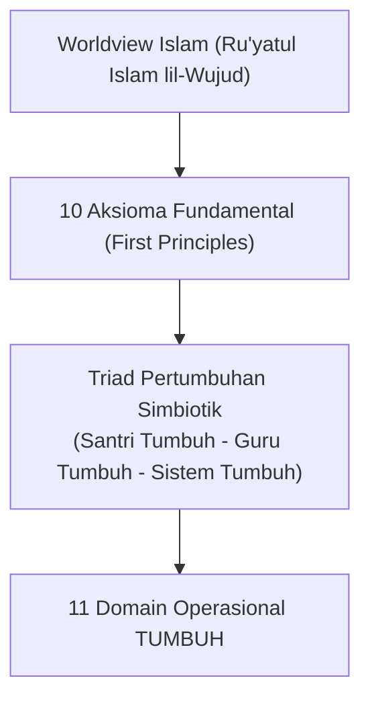

# P1-01-Worldview-TUMBUH: Pandangan Hidup Islam & 10 Aksioma Fundamental

## Tujuan Dokumen
Merumuskan prinsip-prinsip pertama (*First Principles / Aksioma Dasar*) yang membentuk **Worldview Islam (Theocentric Worldview)** sebagai landasan tertinggi seluruh perancangan sistem, kurikulum, asesmen, SOP pengasuhan, dan teknologi ekosistem TUMBUH di dunia pesantren.

---

## 1. Pertanyaan Fundamental Filosofis

Sebelum menentukan metode teknis pembinaan, sistem TUMBUH menjawab 10 pertanyaan eksistensial dasar:
1. *Apa hakikat realitas yang sebenarnya?* (Ontologi)
2. *Siapa manusia dan bagaimana strukturnya?* (Antropologi)
3. *Mengapa manusia diciptakan dan ke mana akhirnya?* (Teleologi & Eskatologi)
4. *Apa tujuan sejati kehidupan di dunia?* ('Ubudiyyah & Amanah Kepemimpinan (Qiyadah & Khidmah))
5. *Apa makna sejati pertumbuhan?* (Peningkatan Kapasitas Menyeluruh)
6. *Apa tolok ukur keberhasilan manusia?* (Transformasi Karakter & Adab)
7. *Apa hakikat pendidikan Islam?* (Trilogi Tarbiyah, Ta'dib, Ta'lim)
8. *Bagaimana dinamika perubahan perilaku terjadi?* (Sunnatullah Perubahan)
9. *Apa hakikat kepemimpinan dan relasi sosial?* (Qudwah & Ukhuwah)
10. *Bagaimana memposisikan waktu dan proses?* (Tadarruj & Istiqamah)

---

## 2. Rumusan 10 Aksioma Fundamental (*First Principles*)

### Aksioma 1: Hakikat Sumber Kebenaran
> **"Allah Subhanahu wa Ta'ala adalah sumber seluruh kebenaran absolut (*Al-Haqq*)."**
* **Implikasi**: Kebenaran moral dan nilai tidak ditentukan oleh suara mayoritas, budaya populer, atau tren sekuler. Ilmu manusia berfungsi menyingkap dan memahami kebenaran ketetapan Allah, bukan menciptakannya.
* **Konsekuensi Sistemik**: Seluruh indikator keberhasilan karakter, regulasi adab, dan kurikulum wajib selaras dengan wahyu Al-Qur'an dan Sunnah Shahihah.

### Aksioma 2: Hakikat Manusia & Fitrah
> **"Manusia adalah makhluk ciptaan Allah yang membawa modal fitrah kebaikan, potensi akal-jiwa, dan amanah taklif."**
* **Implikasi**: Santri tidak lahir sebagai "kertas kosong" (*tabula rasa*) atau "objek bermasalah", melainkan membawa benih tauhid (*Fitrah Tauhidiyyah*).
* **Konsekuensi Sistemik**: Pengasuhan berlandaskan *Husnudzan Aktif* dan pengembangan kekuatan potensi unik santri (*Strength-Based Development*).

### Aksioma 3: Tujuan Kehidupan
> **"Tujuan utama penciptaan manusia adalah beribadah kepada Allah (*'Ubudiyyah*) dan menjalankan mandat kemakmuran bumi (*Amanah Kepemimpinan (Qiyadah & Khidmah)*)."**
* **Implikasi**: Pendidikan tidak boleh berhenti pada capaian akademik kognitif semata.
* **Konsekuensi Sistemik**: Pengembangan karakter, kepemimpinan, kepedulian sosial, dan kemandirian menjadi bagian mutlak dari tujuan pendidikan pesantren.

### Aksioma 4: Makna Pertumbuhan (*Al-Inma'*)
> **"Pertumbuhan adalah proses peningkatan kapasitas manusia secara utuh (jasad, ruh, nafs, qalb, 'aql) menuju kesempurnaan fitrahnya."**
* **Implikasi**: Pertumbuhan bukan sekadar bertambahnya hafalan atau usia biologis, melainkan kedewasaan spiritual, emosional, sosial, intelektual, dan fisik.
* **Konsekuensi Sistemik**: Melahirkan **Capacity Framework** (10 Karakter Santri TUMBUH).

### Aksioma 5: Makna Keberhasilan
> **"Keberhasilan sejati diukur dari kedalaman transformasi akhlak dan adab, bukan sekadar perolehan angka ranking atau piala prestasi."**
* **Implikasi**: Indikator utama keberhasilan adalah perubahan cara berpikir (*mindset*), stabilitas regulasi diri (*self-regulation*), kejujuran, dan kontribusi nyata santri.
* **Konsekuensi Sistemik**: Asesmen santri menggunakan observasi perilaku nyata (*Positive Behavioral Interventions and Supports - PBIS*).

### Aksioma 6: Poros Gravitasi Tauhid
> **"Hubungan dengan Allah (*Hablum Minallah*) merupakan pusat orientasi dan sumber energi seluruh perkembangan manusia."**
* **Implikasi**: Seluruh amalan dan pembiasaan adab berorientasi pada pencapaian ridha Allah (*Lillahi Ta'ala*), bukan mencari pujian manusia (*Riya'*).
* **Konsekuensi Sistemik**: Sholat berjamaah, tilawah, dan dzikir diposisikan sebagai kebutuhan batiniah (*Ruh*), bukan paksaan mekanis.

### Aksioma 7: Hakikat Interaksi Sosial & Ukhuwah
> **"Manusia bertumbuh secara optimal melalui interaksi yang aman, adil, dan penuh kasih sayang dengan sesamanya (*Hablum Minannas*)."**
* **Implikasi**: Keluarga, asatidz, musyrif, dan teman sebaya adalah ekosistem pertumbuhan yang saling memengaruhi (*Ecological Systems*).
* **Konsekuensi Sistemik**: Pesantren wajib menciptakan iklim bebas intimidasi (*Psychological Safety*), menghentikan bullying dan feodalisme senioritas, serta memperkuat budaya persaudaraan (*Ukhuwah*).

### Aksioma 8: Tanggung Jawab Terhadap Alam Semesta
> **"Manusia adalah pemegang amanah untuk memelihara, memakmurkan, dan menjaga keseimbangan alam semesta (*'Imaratul Ardh*)."**
* **Implikasi**: Karakter santri mencakup kesadaran ekologis, kebersihan lingkungan hunian, dan efisiensi pemanfaatan sumber daya.
* **Konsekuensi Sistemik**: Pembiasaan sanitasi asrama, pemeliharaan sarana prasarana, hemat energi, dan adab terhadap lingkungan hidup.

### Aksioma 9: Integrasi Ilmu Pengetahuan
> **"Ilmu adalah anugerah Allah untuk mengenal-Nya, memahami sunnatullah ciptaan-Nya, dan menghadirkan kemaslahatan bagi umat."**
* **Implikasi**: Tidak ada pemisahan (*dikotomi*) esensial antara ilmu syariat dan sains alam/sosial. Sains modern adalah sarana menyingkap ayat-ayat kauniyah.
* **Konsekuensi Sistemik**: Memadukan pembelajaran kitab turats klasik dengan sains kontemporer (neurosains, psikologi belajar, teknologi digital).

### Aksioma 10: Waktu & Sunnatullah Proses Bertahap
> **"Waktu adalah amanah ilahi yang menjadi ruang bagi proses pertumbuhan manusia secara bertahap (*Tadarruj*) dan konsisten (*Istiqamah*)."**
* **Implikasi**: Perubahan karakter yang kokoh tidak terjadi secara instan, melainkan melalui repetisi kebiasaan harian (*Atomic Habits*) yang terjaga.
* **Konsekuensi Sistemik**: Melahirkan **Progression Framework (Tangga TUMBUH T1, T2, T3, T4)**.

---

## 3. Landasan Pengujian Validitas Ilmiah

Setiap aksioma ini telah melalui proses uji verifikasi multi-disiplin:
1. **Landasan Nash Al-Qur'an dan Sunnah Shahihah** (terurai pada `P1-01-01-03-Validasi-Dalil.md`).
2. **Landasan Tradisi Keilmuan Turats** (*Al-Ghazali, Ibn Taimiyyah, Ibnul Qayyim, Al-Attas* - terurai pada `P1-01-01-04-Validasi-Turats.md`).
3. **Konsensus Sains Internasional** (*Neurosains Kognitif, CASEL SEL, SW-PBIS, Self-Determination Theory* - terurai pada `P1-Pertanggungjawaban-Ilmiah-Filosofi-TUMBUH.md`).