# SUB-DOMAIN 01: WORLDVIEW (PANDANGAN HIDUP & ONTOLOGI ISLAM)
## *Sitemap Induk & Navigasi Monograf Terpadu Hakikat Realitas, Epistemologi Integratif, & 10 Aksioma Fundamental*

**Nomor Identifikasi**: `P1-01/INDEX/2026`  
**Domain**: `01 Philosophy` > `01 Worldview`  
**Klasifikasi**: Folder Monograf Induk Ontologi, Epistemologi, & Aksioma Realitas (16 Berkas Lengkap Terstruktur)

---

## 🏛️ SITEMAP & NAVIGASI SELURUH BERKAS SUB-DOMAIN 01

Sub-Domain `01 Worldview` adalah fondasi metafisik dan epistemologis tertinggi yang menjadi akar bagi seluruh arsitektur 11 Domain Ekosistem TUMBUH:

```mermaid
graph TD
    WV["SUB-DOMAIN 01: WORLDVIEW (PANDANGAN HIDUP ISLAM)"]
    
    WV --> Master["P1-01: Worldview TUMBUH Master (Ru'yatul Islam lil-Wujud & 10 Aksioma Fundamental)"]
    WV --> Onto["01 HAKIKAT REALITAS (Folder Ontologi Realisme Teistik Integratif)"]
    WV --> Epist["02 EPISTEMOLOGI TUMBUH (Folder Teori Pengetahuan Integratif 4 Saluran)"]
    
    Onto --> OInduk["P1-01-01: Hakikat Realitas Induk (Monograf Konsolidasi Ontologi)"]
    Onto --> O1["P1-01-01-01: Definisi Realitas (Monograf Terpadu & 47 Footnotes)"]
    Onto --> O2["P1-01-01-02: Aksioma Realitas (Monograf Terpadu & 31 Footnotes)"]
    Onto --> O3["P1-01-01-03: Validasi Dalil (Hermeneutika Qur'an-Hadits & 51 Footnotes)"]
    Onto --> O4["P1-01-01-04: Validasi Turats (Genealogi 6 Imam & 46 Footnotes)"]
    Onto --> O5["P1-01-01-05: Sintesis Filosofis (Posisi Resmi Realisme Teistik & 37 Footnotes)"]
    Onto --> O6["P1-01-01-06: Kritik Internal (Audit Ghaib, Teodisi, & 45 Footnotes)"]
    
    Epist --> EInduk["P1-01-02: Epistemologi TUMBUH Induk (Monograf Konsolidasi Kognisi)"]
    Epist --> E1["P1-01-02-01: Sumber Pengetahuan (Hierarki 4 Saluran & 45 Footnotes)"]
    Epist --> E2["P1-01-02-02: Proses Pengetahuan (Metodologi Kognisi & 42 Footnotes)"]
    Epist --> E3["P1-01-02-03: Validasi Pengetahuan (Filter Kebenaran & 43 Footnotes)"]
    Epist --> E4["P1-01-02-04: Integrasi Pengetahuan (Tauhidul Haqiqah & 39 Footnotes)"]
    Epist --> E5["P1-01-02-05: Batas Pengetahuan (Tawadhu' Intelektual & 43 Footnotes)"]
    Epist --> E6["P1-01-02-06: Hikmah Kebijaksanaan (Praksis Adab & 44 Footnotes)"]
    Epist --> E7["P1-01-02-07: Sintesis & Kritik Epistemologi (Audit Mutu Bebas Sinkretisme & 39 Footnotes)"]
```

---

## 📑 DAFTAR LENGKAP 16 BERKAS MONOGRAF TERPADU SUB-DOMAIN 01

Seluruh modul (16 berkas) telah distandarisasi 100% ke dalam format **Monograf Terpadu**:
* **💡 Intisari Praktis (3 Menit Paham)**: Bahasa membumi dan aplikatif untuk asatidz & musyrif sebelum daftar isi.
* **Bagian I**: Riset Inkuiri, Formalisasi Silogisme Mantiq, Dialektika Multi-Perspektif (tanpa kata "pakar"), Kutipan Teks Primer Turats & Sains Asli, serta Kasuistika Lapangan Asrama.
* **Bagian II**: Kodifikasi Baku Hasil Riset & Kesimpulan Formal (Definisi/Aksioma, Matriks, Protokol Operasional).
* **Bagian III**: Aparatus Akademis (Tabel Sintesis, Daftar Pustaka Otoritatif, 30–50 Catatan Kaki *Footnotes*, dan Glosarium Istilah Teknis Turats/Sains).

### 🏛️ Berkas Induk Domain
| No | Berkas Monograf | Judul Berkas | Fokus Kajian & Status |
| :---: | :--- | :--- | :--- |
| **00** | [**`P1-01-Worldview-TUMBUH.md`**](./P1-01-Worldview-TUMBUH.md) | Worldview Islam & 10 Aksioma Fundamental | *Ru'yatul Islam lil-Wujud*, 10 pertanyaan eksistensial, dan first principles peradaban pesantren. |

---

### 📂 Kluster 01: Hakikat Realitas (Folder: `01 Hakikat Realitas/`)
| No | Berkas Monograf | Judul Berkas | Fokus Kajian & Status |
| :---: | :--- | :--- | :--- |
| **01** | [**`P1-01-01-Hakikat-Realitas.md`**](./01%20Hakikat%20Realitas/P1-01-01-Hakikat-Realitas.md) | Monograf Induk Hakikat Realitas | Master ontologi alam mulk & malakut, pohon ontologi, serta implikasi kurikuler. |
| **02** | [**`P1-01-01-01-Definisi-Realitas.md`**](./01%20Hakikat%20Realitas/P1-01-01-01-Definisi-Realitas.md) | Hakikat & Definisi Realitas | Analisis istilah wujud, 3 unsur realitas, 6 inkuiri dialektis, studi kasus sanitasi, dan 47 catatan kaki. |
| **03** | [**`P1-01-01-02-Aksioma-Realitas.md`**](./01%20Hakikat%20Realitas/P1-01-01-02-Aksioma-Realitas.md) | Enam Aksioma Metafisik Realitas | Enam pilar aksioma baku, integrasi kausalitas Kauniyyah-Syar'iyyah, studi kasus jam biologis, dan 31 catatan kaki. |
| **04** | [**`P1-01-01-03-Validasi-Dalil.md`**](./01%20Hakikat%20Realitas/P1-01-01-03-Validasi-Dalil.md) | Validasi Dalil Naqli Aksioma Realitas | Uji hermeneutika nash sharih QS. 31:30, 35:15, 33:62, 51:56, dan hadits shahih Bukhari-Muslim (51 catatan kaki). |
| **05** | [**`P1-01-01-04-Validasi-Turats.md`**](./01%20Hakikat%20Realitas/P1-01-01-04-Validasi-Turats.md) | Validasi Turats Klasik Aksioma Realitas | Genealogi 6 Imam: Al-Ghazali, Ibn Taimiyyah, Al-Maturidi, Asy-Syathibi, Ibnu 'Athaillah, & Al-Attas (46 catatan kaki). |
| **06** | [**`P1-01-01-05-Sintesis-Filosofis.md`**](./01%20Hakikat%20Realitas/P1-01-01-05-Sintesis-Filosofis.md) | Sintesis Filosofis Hakikat Realitas | Deklarasi posisi resmi Realisme Teistik Integratif dan dekonstruksi 4 mazhab filsafat Barat (37 catatan kaki). |
| **07** | [**`P1-01-01-06-Kritik-Internal.md`**](./01%20Hakikat%20Realitas/P1-01-01-06-Kritik-Internal.md) | Kritik Internal & Uji Ketahanan Ontologis | Uji demarkasi ghaib vs takhayul, problem of evil, teodisi, Kasb vs Fatalisme, dan desakralisasi SOP (45 catatan kaki). |

---

### 📂 Kluster 02: Epistemologi TUMBUH (Folder: `02 Epistemologi TUMBUH/`)
| No | Berkas Monograf | Judul Berkas | Fokus Kajian & Status |
| :---: | :--- | :--- | :--- |
| **08** | [**`P1-01-02-Epistemologi-TUMBUH.md`**](./02%20Epistemologi%20TUMBUH/P1-01-02-Epistemologi-TUMBUH.md) | Monograf Induk Epistemologi TUMBUH | Master teori pengetahuan 4 saluran, rantai kausalitas kognisi, dan asesmen adab 24 jam. |
| **09** | [**`P1-01-02-01-Sumber-Pengetahuan.md`**](./02%20Epistemologi%20TUMBUH/P1-01-02-01-Sumber-Pengetahuan.md) | Sumber-Sumber Pengetahuan dalam Islam | Empat saluran: Wahyu (*Khabar Shadiq*), Akal Sehat, Indera Empiris, dan Ilham Kalbu (45 catatan kaki). |
| **10** | [**`P1-01-02-02-Proses-Memperoleh-Pengetahuan.md`**](./02%20Epistemologi%20TUMBUH/P1-01-02-02-Proses-Memperoleh-Pengetahuan.md) | Proses Memperoleh Pengetahuan | Mekanisme kognisi: Talaqqi-Tadabbur, Nazhar-Istimbath, Tajribah-Musyahadah, Tazkiyah-Bashirah (42 catatan kaki). |
| **11** | [**`P1-01-02-03-Validasi-Pengetahuan.md`**](./02%20Epistemologi%20TUMBUH/P1-01-02-03-Validasi-Pengetahuan.md) | Kriteria & Protokol Validasi Pengetahuan | Kritik Sanad-Matan, koherensi logika, korespondensi fakta, dan resolusi pertentangan semu (*Dar' Ta'arudh*) (43 catatan kaki). |
| **12** | [**`P1-01-02-04-Integrasi-Pengetahuan.md`**](./02%20Epistemologi%20TUMBUH/P1-01-02-04-Integrasi-Pengetahuan.md) | Integrasi Pengetahuan: Tauhidul Haqiqah | Penyatuan Ayat Tanziliyyah & Kauniyyah, kritik Islamisasi label kosmetik, dan pohon ilmu terpadu (39 catatan kaki). |
| **13** | [**`P1-01-02-05-Batas-Pengetahuan-Manusia.md`**](./02%20Epistemologi%20TUMBUH/P1-01-02-05-Batas-Pengetahuan-Manusia.md) | Batas-Batas Pengetahuan Manusia | Keterbatasan akal (QS. 17:85), *Tawadhu' Intelektual*, budaya berani berkata "Wallahu A'lam", & Dunning-Kruger (43 catatan kaki). |
| **14** | [**`P1-01-02-06-Hikmah-dan-Kebijaksanaan.md`**](./02%20Epistemologi%20TUMBUH/P1-01-02-06-Hikmah-dan-Kebijaksanaan.md) | Hikmah & Kebijaksanaan dalam Praksis | Puncak integrasi ilmu-amal (QS. 2:269), konsep Adab Al-Attas (menempatkan sesuatu pada maqamnya), & Firm-Kind (44 catatan kaki). |
| **15** | [**`P1-01-02-07-Sintesis-Epistemologi-dan-Kritik-Internal.md`**](./02%20Epistemologi%20TUMBUH/P1-01-02-07-Sintesis-Epistemologi-dan-Kritik-Internal.md) | Sintesis Epistemologi & Kritik Internal | Konsolidasi matriks epistemologi, uji falsifikasi Popper, dan pertanggungjawaban audit mutu bebas sinkretisme (39 catatan kaki). |
