# SUB-DOMAIN 01: WORLDVIEW (PANDANGAN HIDUP & ONTOLOGI ISLAM)
## *Sitemap Induk & Navigasi Monograf Terpadu Hakikat Realitas, Epistemologi Integratif, & 10 Aksioma Fundamental*

**Nomor Identifikasi**: `P1-01/INDEX/2026`  
**Domain**: `01 Philosophy` > `01 Worldview`  
**Klasifikasi**: Folder Monograf Induk Ontologi, Epistemologi, & Aksioma Realitas

---

## 🏛️ SITEMAP & NAVIGASI SELURUH BERKAS SUB-DOMAIN 01

Sub-Domain `01 Worldview` adalah fondasi metafisik dan epistemologis tertinggi yang menjadi akar bagi seluruh arsitektur 11 Domain Ekosistem TUMBUH:

```mermaid
graph TD
    WV["SUB-DOMAIN 01: WORLDVIEW (PANDANGAN HIDUP ISLAM)"]
    
    WV --> Master["P1-01: Worldview TUMBUH Master (Ru'yatul Islam lil-Wujud & 10 Aksioma Fundamental)"]
    WV --> Onto["01 HAKIKAT REALITAS (Ontologi Realisme Teistik Integratif)"]
    WV --> Epist["02 EPISTEMOLOGI TUMBUH (Teori Pengetahuan Integratif 4 Saluran)"]
    
    Onto --> O1["P1-01-01-01: Definisi Realitas (Monograf Terpadu: Riset Inkuiri, Kodifikasi Baku, & Catatan Kaki)"]
    Onto --> O2["P1-01-01-02: Aksioma Realitas (Monograf Terpadu: Riset Dialektika, 6 Aksioma Baku, & Kasuistika)"]
    Onto --> O3["P1-01-01-03: Validasi Dalil (Hermeneutika Al-Qur'an & As-Sunnah)"]
    Onto --> O4["P1-01-01-04: Validasi Turats (Al-Ghazali, Ibn Taimiyyah, Al-Maturidi, Al-Attas)"]
    Onto --> O5["P1-01-01-05: Sintesis Filosofis (Posisi Resmi Realisme Teistik TUMBUH)"]
    Onto --> O6["P1-01-01-06: Kritik Internal (Uji Demarkasi Ghaib, Problem of Evil, & Ikhtiar)"]
    Onto --> OInduk["P1-01-01: Hakikat Realitas Induk (Monograf Konsolidasi Ontologi)"]
    
    Epist --> E1["P1-01-02-01: Sumber Pengetahuan (Wahyu, Akal, Indera, Ilham Kalbu)"]
    Epist --> E2["P1-01-02-02: Proses Pengetahuan (Talaqqi, Nazhar, Tajribah, Tazkiyah)"]
    Epist --> E3["P1-01-02-03: Validasi Pengetahuan (Kritik Sanad, Koherensi, Korespondensi, & Ta'arudh)"]
    Epist --> E4["P1-01-02-04: Integrasi Pengetahuan (Tauhidul Haqiqah & Pohon Ilmu)"]
    Epist --> E5["P1-01-02-05: Batas Pengetahuan (Tawadhu' Intelektual QS. 17:85)"]
    Epist --> E6["P1-01-02-06: Hikmah Kebijaksanaan (Puncak Adab Meletakkan Sesuatu pada Maqamnya)"]
    Epist --> E7["P1-01-02-07: Sintesis & Kritik Epistemologi (Audit Kualitas Bebas Sinkretisme)"]
    Epist --> EInduk["P1-01-02: Epistemologi TUMBUH Induk (Monograf Konsolidasi Teori Pengetahuan)"]
```

---

## 📑 DAFTAR BERKAS MODULAR MONOGRAF TERPADU SUB-DOMAIN 01

Setiap modul di bawah ini disusun dalam format **Monograf Terpadu**:
* **Bagian I**: Riset Inkuiri, Dialektika Multi-Perspektif (tanpa kata "pakar"), dan Kasuistika Lapangan.
* **Bagian II**: Kodifikasi Baku Hasil Riset & Kesimpulan Formal.
* **Bagian III**: Aparatus Akademis (Tabel Sintesis, Rujukan Turats & Sains, Catatan Kaki *Footnotes*, dan Glosarium).

| No | Berkas Monograf | Judul Berkas | Fokus Kajian & Rujukan Utama |
| :---: | :--- | :--- | :--- |
| **00** | [**`P1-01-Worldview-TUMBUH.md`**](./P1-01-Worldview-TUMBUH.md) | Worldview Islam & 10 Aksioma Fundamental | *Ru'yatul Islam lil-Wujud*, 10 pertanyaan eksistensial, dan first principles peradaban pesantren. |
| **01** | [**`P1-01-01-Hakikat-Realitas.md`**](./P1-01-01-Hakikat-Realitas.md) | Monograf Induk Hakikat Realitas | Rangkuman master ontologi, integrasi alam ghaib & syahadah, serta implikasi kurikuler. |
| **02** | [**`P1-01-01-01-Definisi-Realitas.md`**](./P1-01-01-01-Definisi-Realitas.md) | Hakikat & Definisi Realitas (Monograf Terpadu) | Analisis istilah wujud, 3 unsur realitas, 6 inkuiri dialektis, studi kasus sanitasi, dan 41 catatan kaki. |
| **03** | [**`P1-01-01-02-Aksioma-Realitas.md`**](./P1-01-01-02-Aksioma-Realitas.md) | Enam Aksioma Metafisik Realitas (Monograf Terpadu) | Enam pilar aksioma baku, integrasi kausalitas Kauniyyah-Syar'iyyah, studi kasus jam biologis, dan 30 catatan kaki. |
| **04** | [**`P1-01-01-03-Validasi-Dalil.md`**](./P1-01-01-03-Validasi-Dalil.md) | Validasi Dalil Naqli Aksioma Realitas | Uji hermeneutika nash sharih QS. 31:30, 35:15, 33:62, 51:56, dan hadits sahih Bukhari-Muslim. |
| **05** | [**`P1-01-01-04-Validasi-Turats.md`**](./P1-01-01-04-Validasi-Turats.md) | Validasi Turats Klasik Aksioma Realitas | Kesinambungan sanad epistemologis Al-Ghazali (*Misykat*), Ibn Taimiyyah, Al-Maturidi, & Al-Attas. |
| **06** | [**`P1-01-01-05-Sintesis-Filosofis.md`**](./P1-01-01-05-Sintesis-Filosofis.md) | Sintesis Filosofis Hakikat Realitas | Deklarasi posisi resmi Realisme Teistik Integratif dan perbandingannya dengan ontologi Barat. |
| **07** | [**`P1-01-01-06-Kritik-Internal.md`**](./P1-01-01-06-Kritik-Internal.md) | Kritik Internal & Uji Ketahanan Ontologis | Uji demarkasi ghaib vs takhayul, problem of evil, dan determinisme takdir vs kebebasan ikhtiar. |
| **08** | [**`P1-01-02-Epistemologi-TUMBUH.md`**](./P1-01-02-Epistemologi-TUMBUH.md) | Monograf Induk Epistemologi TUMBUH | Rangkuman master teori pengetahuan 4 saluran, rantai kausalitas kognisi, dan asesmen adab. |
| **09** | [**`P1-01-02-01-Sumber-Pengetahuan.md`**](./P1-01-02-01-Sumber-Pengetahuan.md) | Sumber-Sumber Pengetahuan dalam Islam | Empat saluran: Wahyu (*Khabar Shadiq*), Akal Sehat, Indera Empiris, dan Ilham Kalbu. |
| **10** | [**`P1-01-02-02-Proses-Memperoleh-Pengetahuan.md`**](./P1-01-02-02-Proses-Memperoleh-Pengetahuan.md) | Proses Memperoleh Pengetahuan | Mekanisme kognisi: Talaqqi-Tadabbur, Nazhar-Istimbath, Musyahadah-Tajribah, Tazkiyah-Bashirah. |
| **11** | [**`P1-01-02-03-Validasi-Pengetahuan.md`**](./P1-01-02-03-Validasi-Pengetahuan.md) | Kriteria & Protokol Validasi Pengetahuan | Kritik Sanad-Matan, koherensi logika, korespondensi fakta, dan resolusi pertentangan semu (*Ta'arudh*). |
| **12** | [**`P1-01-02-04-Integrasi-Pengetahuan.md`**](./P1-01-02-04-Integrasi-Pengetahuan.md) | Integrasi Pengetahuan: Tauhidul Haqiqah | Penyatuan Ayat Tanziliyyah & Kauniyyah, kritik Islamisasi label kosmetik, dan pohon ilmu terpadu. |
| **13** | [**`P1-01-02-05-Batas-Pengetahuan-Manusia.md`**](./P1-01-02-05-Batas-Pengetahuan-Manusia.md) | Batas-Batas Pengetahuan Manusia | Keterbatasan akal (QS. 17:85), *Tawadhu' Intelektual*, dan budaya berani berkata "Wallahu A'lam". |
| **14** | [**`P1-01-02-06-Hikmah-dan-Kebijaksanaan.md`**](./P1-01-02-06-Hikmah-dan-Kebijaksanaan.md) | Hikmah & Kebijaksanaan dalam Praksis | Puncak integrasi ilmu-amal (QS. 2:269), konsep Adab Al-Attas (menempatkan sesuatu pada maqamnya). |
| **15** | [**`P1-01-02-07-Sintesis-Epistemologi-dan-Kritik-Internal.md`**](./P1-01-02-07-Sintesis-Epistemologi-dan-Kritik-Internal.md) | Sintesis Epistemologi & Kritik Internal | Konsolidasi matriks epistemologi dan pertanggungjawaban audit mutu bebas sinkretisme. |
