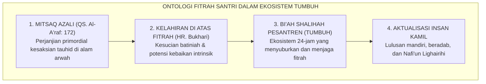
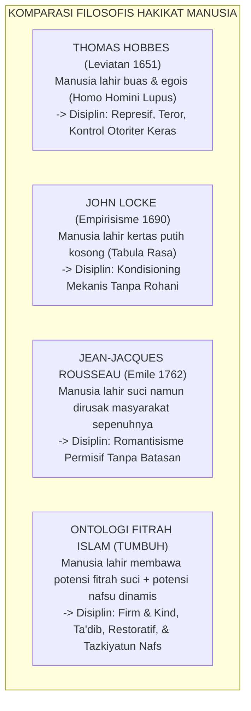
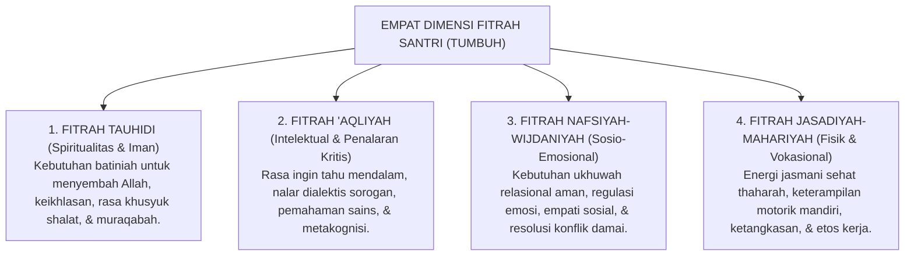

# P1-02-01: HAKIKAT FITRAH DAN KODRAT INSAN PEMBELAJAR
## *Analisis Ontologis Potensi Primordial Manusia, Hermeneutika Mitsaq Azali, dan Kritik atas Reduksionisme Sekuler*

**Nomor Identifikasi**: `P1-02-01/ONTOLOGI-FITRAH/2026`  
**Domain**: `01 Philosophy` > `02 Human Nature`  
**Dewan Pakar**: `pakar-filosofi-tumbuh`, `pakar-epistemologi-turats`, `pakar-neurosains-perkembangan`

---

## 📑 DAFTAR ISI ANALITIS

1. [1. Pendahuluan & Urgensi Ontologis Konsep Fitrah](#1-pendahuluan--urgensi-ontologis-konsep-fitrah)
2. [2. Hermeneutika Ayat dan Hadits Fitrah](#2-hermeneutika-ayat-dan-hadits-fitrah)
3. [3. Sintesis Khazanah Turats: Ibn Taimiyyah, Al-Ghazali, & Al-Attas](#3-sintesis-khazanah-turats-ibn-taimiyyah-al-ghazali--al-attas)
4. [4. Dialog Epistemologis: Teologi Islam vs Tabula Rasa & Dosa Asal](#4-dialog-epistemologis-teologi-islam-vs-tabula-rasa--dosa-asal)
5. [5. Empat Dimensi Fitrah Santri dalam Ekosistem TUMBUH](#5-empat-dimensi-fitrah-santri-dalam-ekosistem-tumbuh)
6. [6. Implikasi Operasional bagi Ekosistem Pengasuhan Pesantren 24-Jam](#6-implikasi-operasional-bagi-ekosistem-pengasuhan-pesantren-24-jam)
7. [7. Uji Kritis & Pertanggungjawaban Ilmiah (Internal Critique)](#7-uji-kritis--pertanggungjawaban-ilmiah-internal-critique)

---

### 1. Pendahuluan & Urgensi Ontologis Konsep Fitrah

Setiap sistem pendidikan, baik disadari maupun tidak, selalu dibangun di atas sebuah postulat ontologis mengenai **hakikat kodrat manusia (*human nature*)**. Jika manusia dipandang secara keliru sebagai makhluk liar yang pada dasarnya jahat (*homo homini lupus*), maka sistem pendidikan yang lahir niscaya akan bercorak represif, sarat dengan instrumen kekerasan, kecurigaan kronis, dan pengawasan berbasis ketakutan. Sebaliknya, jika manusia dipandang secara naif sebagai makhluk sempurna tanpa potensi keburukan, maka pendidikan akan kehilangan arah disiplin, mengabaikan realitas hawa nafsu, dan membiarkan anarki sosial.

Ekosistem **TUMBUH** meletakkan konsep **Fitrah** sebagai batu penjuru (*cornerstone*) ontologi pendidikannya. Dalam worldview Islam, santri bukanlah bejana kosong yang pasif (*tabula rasa*), bukan pula makhluk yang memikul kutukan dosa sejak lahir. Santri adalah **hamba Allah yang dimuliakan (*mukarram*)**, yang lahir ke alam fana membawa modalitas suci berupa kecenderungan alami menuju kebenaran tauhid (*hanif*), kepekaan moral bawaan, dan potensi kebajikan yang menuntut pengasuhan (*tarbiyah wa ta'dib*) agar mekar secara paripurna.

---

### 2. Hermeneutika Ayat dan Hadits Fitrah

Landasan teologis konsep fitrah ditegakkan di atas nash-nash sharih Al-Qur'an dan As-Sunnah yang melintasi dimensi transendental:

#### A. Ayat Mandat Fitrah (QS. Ar-Rum [30]: 30)
> $$\text{فَأَقِمْ وَجْهَكَ لِلدِّينِ حَنِيفًا ۚ فِطْرَتَ اللَّهِ الَّتِي فَطَرَ النَّاسَ عَلَيْهَا ۚ لَا تَبْدِيلَ لِخَلْقِ اللَّهِ ۚ ذَٰلِكَ الدِّينُ الْقَيِّمُ وَلَٰكِنَّ أَكْثَرَ النَّاسِ لَا يَعْلَمُونَ}$$
> 
> *"Maka hadapkanlah wajahmu dengan lurus kepada agama Allah; (tetaplah atas) fitrah Allah yang telah menciptakan manusia menurut fitrah itu. Tidak ada perubahan pada ciptaan Allah. (Itulah) agama yang lurus, tetapi kebanyakan manusia tidak mengetahui."*

Kata *Fathara* secara etimologis berakar dari makna membelah, memunculkan, atau menciptakan sesuatu pertama kali dalam bentuk aslinya yang murni tanpa contoh sebelumnya. Fitrah Allah pada ayat ini adalah **cetak biru kesucian (*divine primordial constitution*)** yang telah dipatrikan pada setiap sel eksistensi manusia.

#### B. Ayat Perjanjian Primordial (QS. Al-A'raf [7]: 172)
> $$\text{وَإِذْ أَخَذَ رَبُّكَ مِن بَنِي آدَمَ مِن ظُهُورِهِمْ ذُرِّيَّتَهُمْ وَأَشْهَدَهُمْ عَلَىٰ أَنفُسِهِمْ أَلَسْتُ بِرَبِّكُمْ ۖ قَالُوا بَلَىٰ ۛ شَهِدْنَا}$$
> 
> *"Dan (ingatlah) ketika Tuhanmu mengeluarkan keturunan anak-anak Adam dari sulbi mereka dan Allah mengambil kesaksian terhadap jiwa mereka: 'Bukankah Aku ini Tuhanmu?' Mereka menjawab: 'Benar (Engkau Tuhan kami), kami menjadi saksi.' "*

Ayat ini menegaskan bahwa sebelum kontak indrawi pertama di alam dunia terjadi, ruh santri telah memiliki **pengetahuan intuitif ma'rifatullah (*innate intuitive gnosis*)**. Pendidikan adab di pesantren hakikatnya adalah proses **tadzakkur (mengingat kembali)** dan mengaktualisasikan komitmen azali tersebut.

#### C. Hadits Otentik Fitrah Bayi (HR. Al-Bukhari & Muslim)
> $$\text{عَنْ أَبِي هُرَيْرَةَ رَضِيَ اللَّهُ عَنْهُ قَالَ: قَالَ رَسُولُ اللَّهِ صَلَّى اللَّهُ عَلَيْهِ وَسَلَّمَ: كُلُّ مَوْلُودٍ يُولَدُ عَلَى الْفِطْرَةِ، فَأَبَوَاهُ يُهَوِّدَانِهِ أَوْ يُنَصِّرَانِهِ أَوْ يُمَجِّسَانِهِ، كَمَثَلِ الْبَهِيمَةِ تُنْتَجُ الْبَهِيمَةَ هَلْ تَرَى فِيهَا جَدْعَاءَ}$$
> 
> *Dari Abu Hurairah RA, Rasulullah SAW bersabda: "Setiap anak dilahirkan di atas fitrah. Maka kedua orang tuanyalah yang menjadikannya beragama Yahudi, Nasrani, atau Majusi—sebagaimana binatang ternak melahirkan anaknya dalam keadaan utuh sempurna, adakah engkau melihat padanya cacat telinga terpotong?"* (HR. Bukhari no. 1385, Muslim no. 2658).

Hadits ini memberikan perumpamaan fisik yang luar biasa: sebagaimana anak hewan lahir dengan anatomi fisik utuh tanpa cacat, jiwa anak manusia lahir dengan anatomi spiritual dan moral yang utuh sempurna tanpa cacat dosa. Perilaku menyimpang (*deviance*) yang kelak muncul adalah "cacat buatan" akibat salah asuh lingkungan luar.

---

### 3. Sintesis Khazanah Turats: Ibn Taimiyyah, Al-Ghazali, & Al-Attas

Para ulama besar Islam telah mengkristalisasikan pemahaman fitrah ini menjadi doktrin pendidikan yang kokoh:

1. **Syaikhul Islam Ibn Taimiyyah (*Dar' Ta'arudh al-'Aql wan-Naql*, Jilid VIII, hlm. 446)**:  
   Ibn Taimiyyah membantah pandangan bahwa fitrah itu netral kosong. Beliau menegaskan bahwa fitrah bersifat **aktif-positif**: fitrah memiliki daya tarik bawaan terhadap kebenaran tauhid dan kebajikan moral, sebagaimana lidah yang sehat secara alami merasakan manisnya madu dan mata yang sehat secara alami condong pada keindahan cahaya.
2. **Hujjatul Islam Imam Al-Ghazali (*Ihya 'Ulumiddin*, Jilid III, hlm. 72)**:  
   Kalbu anak diibaratkan laksana permata murni (*jawharah nafisah sadhijah*) yang siap menerima ukiran. Pengasuhan yang buruk akan mengotori permata tersebut dengan debu kegelapan, sementara pengasuhan yang beradab (*Ta'dib*) akan menggosok permata itu hingga memancarkan kilau cahaya ilahiah.
3. **Prof. Syed Muhammad Naquib al-Attas (*The Concept of Education in Islam*, 1980)**:  
   Al-Attas menyintesiskan konsep fitrah dengan **Keadilan (*'Adl*) dan Adab**. Adab adalah pengenalan dan pengakuan yang tepat terhadap posisi segala sesuatu dalam tatanan wujud Allah. Ketika santri dibimbing sesuai fitrahnya, ia akan menempatkan Tuhannya, gurunya, sesama santri, dan alam sekitar pada kedudukan yang adil dan beradab.

---

### 4. Dialog Epistemologis: Teologi Islam vs Filsafat Barat

* **Kritik atas Hobbesianisme**: Memandang santri sebagai objek berbahaya melahirkan militerisme asrama dan siklus kekerasan fisik yang mematikan fungsi otak moral (*Prefrontal Cortex*).
* **Kritik atas Lockeanisme**: Menganggap santri sekadar kertas kosong mereduksi pendidikan adab menjadi transaksi poin hadiah-hukuman mekanis yang mematikan keikhlasan niat.
* **Kritik atas Rousseauianisme Permisif**: Membiarkan santri tanpa aturan tegas (*laissez-faire*) mengabaikan keberadaan daya nafsu ammarah yang membutuhkan bimbingan batasan hukum (*hududullah*).

---

### 5. Empat Dimensi Fitrah Santri dalam Ekosistem TUMBUH

Ekosistem TUMBUH mengoperasionalkan konsep fitrah ke dalam **Empat Dimensi Kapasitas Insaniyah**:

---

### 6. Implikasi Operasional bagi Ekosistem Pesantren 24-Jam

1. **Paradigma Husnudzan Edukatif Aktif**:  
   Musyrif memandang santri yang melakukan pelanggaran bukan sebagai "anak nakal yang berniat jahat", melainkan sebagai **jiwa berfitrah yang sedang mengalami disfungsi lingkungan atau kekacauan regulasi emosi**. Tindakan pendisiplinan diarahkan untuk memulihkan fungsi regulasinya, bukan menghukum fitrahnya.
2. **Desain Bi'ah Shalihah sebagai Katalisator Fitrah**:  
   Kamar asrama yang bersih, jadwal istirahat malam 6 jam yang terjamin, makanan halal-thayyib, dan interaksi yang bebas dari caci-maki adalah prasyarat ekologis agar benih fitrah santri dapat berfotosintesis moral dengan optimal.
3. **Pemberian Ruang Pertumbuhan Tangga T1–T4**:  
   Kematangan fitrah membutuhkan proses bertahap (*Tadarruj*). Santri baru tidak dituntut langsung memiliki adab sempurna di bulan pertama, melainkan didampingi menapaki Tangga T1 (Adaptasi) menuju T4 (Transformasi).

---

### 7. Uji Kritis & Pertanggungjawaban Ilmiah (Internal Critique)

* **Potensi Bias Romantisisme Fitrah**: Ada kekhawatiran bahwa jika pendidik terlalu memuja konsep fitrah, pendidik menjadi terlalu longgar (*lax / permisif*) saat santri melakukan kejahatan perundungan.
* **Jawaban Ilmiah TUMBUH**: Konsep fitrah dalam Islam tidak menafikan keberadaan daya *Nafs Ammarah bi as-Su'* dan godaan setan. Oleh karena itu, pendekatan TUMBUH berkarakter **Firm & Kind** (teguh memegang batas aturan syar'i dan keselamatan bersama, namun penuh kehangatan dalam metode pemulihan jiwa santri).
