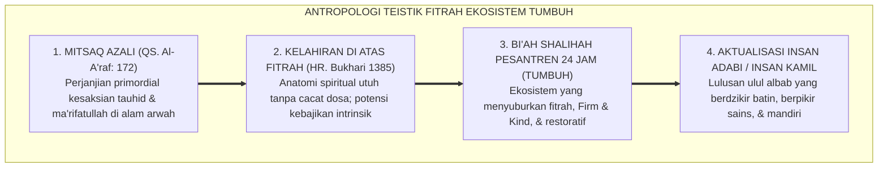
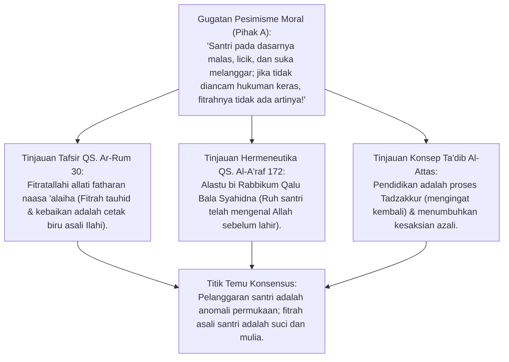
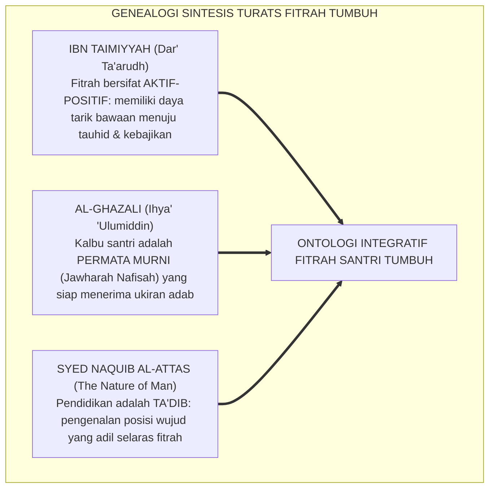
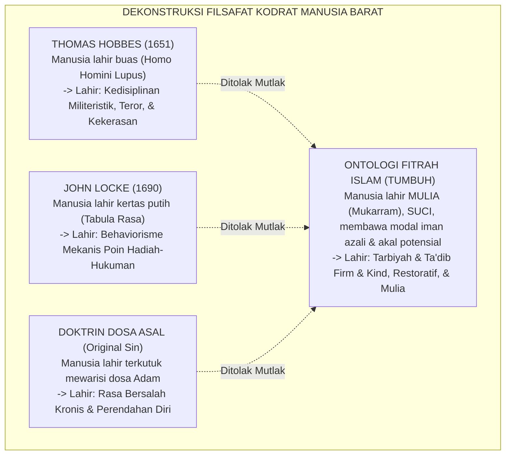
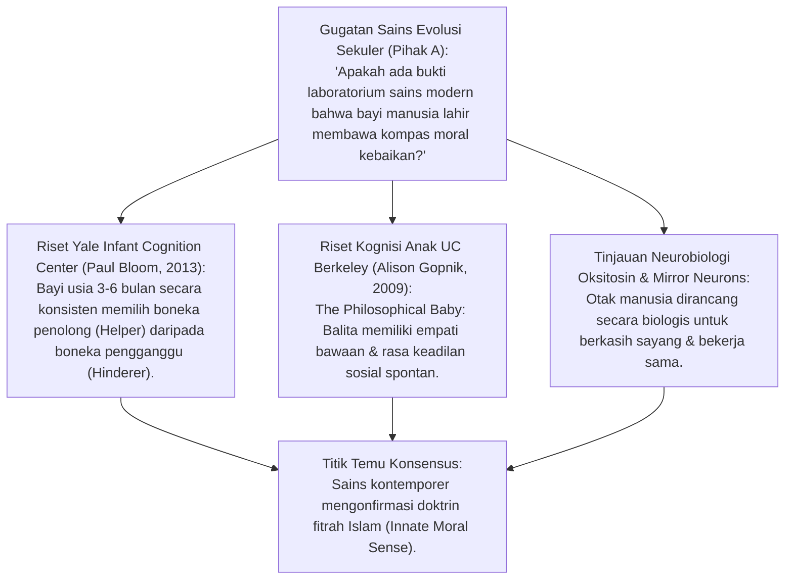
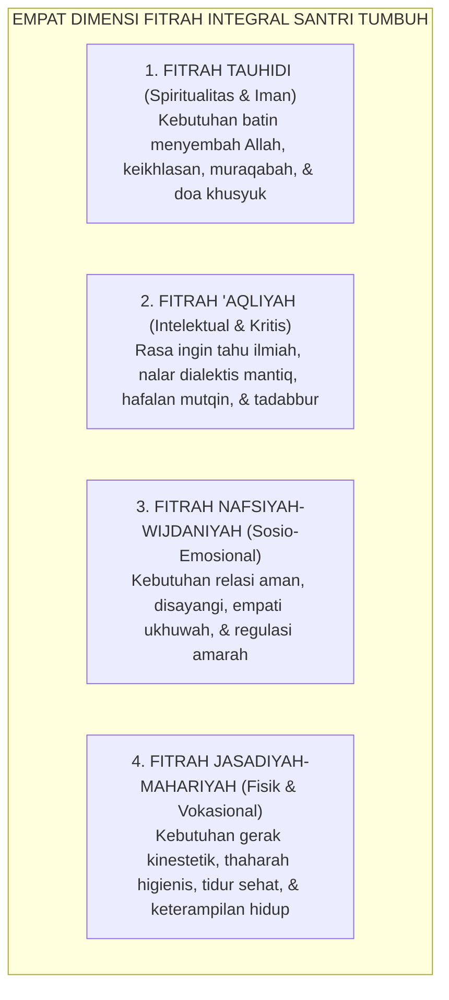
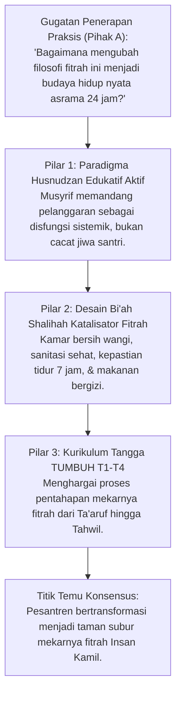
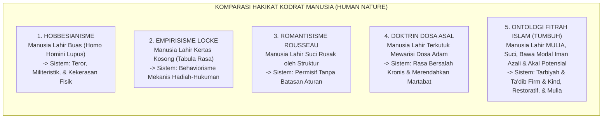
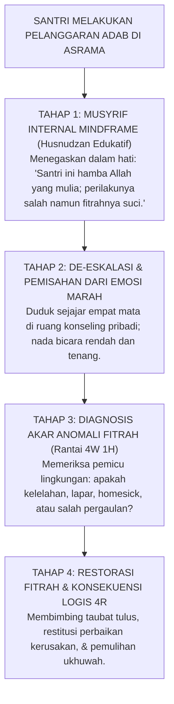

# P1-02-01: HAKIKAT FITRAH DAN KODRAT INSAN PEMBELAJAR
## *Monograf Terpadu: Analisis Ontologis Potensi Primordial Manusia, Hermeneutika Mitsaq Azali (QS. Al-A'raf: 172), Kritik atas Tabula Rasa John Locke & Dosa Asal, serta Konvergensi Innate Morality Paul Bloom*

**Nomor Identifikasi**: `P1-02-01/MONOGRAF-TERPADU-ONTOLOGI-FITRAH/2026`  
**Domain**: `01 Philosophy` > `02 Human Nature`  
**Klasifikasi Naskah**: *Comprehensive Integrated Monograph* (Monograf Akademis & Rumusan Baku Terpadu)  
**Rumpun Disiplin Pengkaji**: Ontologi & Antropologi Islam (*Falsafah al-Insan*), Hermeneutika Turats Teologi Fitrah, Psikologi Perkembangan Moral (*Innate Morality*), Neurosains Kognitif Bayi & Anak, Pedagogi Adab Pesantren  

---

> ### 💡 INTISARI PRAKTIS (3 MENIT PAHAM UNTUK ASATIDZ & MUSYRIF)
>
> * **Siapa Santri Sebenarnya? (Hakikat Kodrat Fitrah):**  
>   Santri **BUKAN KERTAS KOSONG (*Tabula Rasa*)** yang pasif, dan **BUKAN PULA MAKHLUK JAHAT YANG MEMBAWA DOSA ASAL**. Santri adalah **Hamba Allah yang Mulia (*Mukarram*)** yang lahir membawa modal suci: kerinduan alami kepada Allah (*Fitrah Tauhid*), kepekaan moral bawaan, dan potensi akal yang siap bertumbuh.
> * **Mengapa Santri Melanggar Aturan Asrama?**  
>   Pelanggaran bukanlah bukti bahwa santri "berbakat jahat". Pelanggaran santri adalah **Penyumbatan/Disfungsi Lingkungan** akibat salah asuh, stres kelelahan, atau ketidakjelasan aturan. Tugas musyrif bukan menghukum dan mematahkan jiwanya, melainkan membersihkan karat penghalang agar cahaya fitrahnya kembali memancar.
> * **Empat Dimensi Fitrah Santri yang Wajib Dirawat 24 Jam:**  
>   1. **Fitrah Tauhidi**: Kebutuhan batin untuk beribadah dan merasa dekat dengan Allah.  
>   2. **Fitrah 'Aqliyah**: Rasa ingin tahu yang tinggi dan nalar kritis ilmiah.  
>   3. **Fitrah Nafsiyah-Wijdaniyah**: Kebutuhan disayangi, dihargai, dan merasa aman di asrama.  
>   4. **Fitrah Jasadiyah-Mahariyah**: Energi fisik bergerak, menjaga kebersihan, dan ketangkasan hidup mandiri.

---

## 📑 DAFTAR ISI MONOGRAF

- [BAGIAN I: RISET DOKTRIN FITRAH, DIALEKTIKA INKUIRI, & KASUISTIKA LAPANGAN](#bagian-i-riset-doktrin-fitrah-dialektika-inkuiri--kasuistika-lapangan)
  - [1. Kerangka Metodologi Antropologi Teistik Fitrah](#1-kerangka-metodologi-antropologi-teistik-fitrah)
  - [2. Inkuiri 1: Eksegesis QS. Ar-Rum: 30 & Mitsaq Azali (QS. Al-A'raf: 172) — Fondasi Kesaksian Primordial](#2-inkuiri-1-eksegesis-qs-ar-rum-30--mitsaq-azali-qs-al-araf-172--fondasi-kesaksian-primordial)
  - [3. Inkuiri 2: Sintesis Genealogi Turats — Ibn Taimiyyah (Fitrah Aktif-Positif), Al-Ghazali (Jawharah Nafisah), & Al-Attas (Ta'dib)](#3-inkuiri-2-sintesis-genealogi-turats--ibn-taimiyyah-fitrah-aktif-positif-al-ghazali-jawharah-nafisah--al-attas-tadib)
  - [4. Inkuiri 3: Dekonstruksi Tabula Rasa John Locke, Hobbesianisme Homo Homini Lupus, & Doktrin Dosa Asal](#4-inkuiri-3-dekonstruksi-tabula-rasa-john-locke-hobbesianisme-homo-homini-lupus--doktrin-dosa-asal)
  - [5. Inkuiri 4: Konvergensi dengan Sains Moralitas Bawaan (Paul Bloom Just Babies & Alison Gopnik)](#5-inkuiri-4-konvergensi-dengan-sains-moralitas-bawaan-paul-bloom-just-babies--alison-gopnik)
  - [6. Inkuiri 5: Dialektika Empat Dimensi Fitrah Santri (Tauhidi, 'Aqli, Nafsi, Jasadi)](#6-inkuiri-5-dialektika-empat-dimensi-fitrah-santri-tauhidi-aqli-nafsi-jasadi)
  - [7. Inkuiri 6: Translasi Ontologi Fitrah ke Budaya Pengasuhan Asrama Pesantren 24 Jam](#7-inkuiri-6-translasi-ontologi-fitrah-ke-budaya-pengasuhan-asrama-pesantren-24-jam)
- [BAGIAN II: KODIFIKASI BAKU HASIL RISET & KESIMPULAN FORMAL](#bagian-ii-kodifikasi-baku-hasil-riset--kesimpulan-formal)
  - [1. Kaidah Utama dan Standar Baku: Hakikat Fitrah & Kodrat Insan Pembelajar](#1-kaidah-utama-dan-standar-baku-hakikat-fitrah-kodrat-insan-pembelajar)
  - [2. Matriks Komparasi Ontologi Manusia: Islam vs 4 Mazhab Filsafat Barat](#2-matriks-komparasi-ontologi-manusia-islam-vs-4-mazhab-filsafat-barat)
  - [3. Matriks Empat Dimensi Fitrah Santri & Indikator Aktualisasinya](#3-matriks-empat-dimensi-fitrah-santri--indikator-aktualisasinya)
  - [4. Protokol Husnudzan Edukatif & Penanganan Anomali Fitrah Asrama](#4-protokol-husnudzan-edukatif--penanganan-anomali-fitrah-asrama)
- [BAGIAN III: APARATUS AKADEMIS & APENDIKS](#bagian-iii-aparatus-akademis--apendiks)
  - [1. Tabel Sintesis Hasil Riset Ontologi Fitrah](#1-tabel-sintesis-hasil-riset-ontologi-fitrah)
  - [2. Daftar Pustaka Akademis & Rujukan Turats Primer](#2-daftar-pustaka-akademis--rujukan-turats-primer)
  - [3. Catatan Kaki Akademis (Footnotes)](#3-catatan-kaki-akademis-footnotes)
  - [4. Glosarium dan Penjelasan Istilah Teknis Fitrah & Human Nature](#4-glosarium-dan-penjelasan-istilah-teknis-fitrah--human-nature)

---

# BAGIAN I: RISET DOKTRIN FITRAH, DIALEKTIKA INKUIRI, & KASUISTIKA LAPANGAN

*Bagian ini memuat proses penyelidikan ontologi fitrah insan, formalisasi silogisme logika (*qiyas burhani*), pertarungan dialektika multi-perspektif tiga ronde tanpa kata "pakar", telaah tafsir QS. Ar-Rum: 30 dan QS. Al-A'raf: 172, genealogi turats Al-Ghazali, Ibn Taimiyyah, dan Al-Attas, riset kognisi moral bawaan Paul Bloom, studi kasus asrama, dan penarikan konsensus bersama.*

---

### 1. Kerangka Metodologi Antropologi Teistik Fitrah

Setiap sistem pendidikan di muka bumi niscaya dibangun di atas sebuah postulat ontologis mengenai **Hakikat Kodrat Manusia (*Human Nature*)**:
* Jika manusia diasumsikan secara reduksionis sebagai binatang buas yang lahir membawa kejahatan (*Homo Homini Lupus* ala Thomas Hobbes) atau memikul kutukan dosa sejak lahir (*Original Sin*), maka pendidikan yang lahir niscaya bercorak represif, militeristik, penuh teror hukuman fisik, dan kecurigaan kronis.
* Sebaliknya, jika manusia dipandang secara naif sebagai kertas putih kosong (*Tabula Rasa* ala John Locke), maka pendidikan adab akan terdegradasi menjadi transaksi mekanis stimulus-respons tanpa jiwa.

Ekosistem TUMBUH menegakkan doktrin **Antropologi Teistik Fitrah**:

---

### 2. Inkuiri 1: Eksegesis QS. Ar-Rum: 30 & Mitsaq Azali (QS. Al-A'raf: 172) — Fondasi Kesaksian Primordial

#### 📐 Formalisasi Logika Silogisme (*Qiyas Mantiqi 1*)
* **Premis Mayor (*al-Muqaddimah al-Kubra*)**: Setiap makhluk ciptaan Allah yang dilahirkan dengan cetak biru fitrah tauhid murni (*Hanif*) dan telah bersaksi atas rububiyyah Allah di alam arwah (*Mitsaq Azali*) niscaya memiliki kecenderungan dasar bawaan (*Inherent Propensity*) menuju kebenaran, keadilan, dan keluhuran budi pekerti (QS. Ar-Rum: 30).
* **Premis Minor (*al-Muqaddimah ash-Shughra*)**: Seluruh santri yang menuntut ilmu di pesantren adalah anak cucu Adam yang menyandang perjanjian fitrah suci tersebut.
* **Konklusi (*an-Natijah*)**: Maka, santri pada hakikat asasinya adalah insan pembelajar yang berpotensi mulia, dan proses pembinaan adab bertujuan menyuburkan fitrah tersebut, bukan menundukkannya dengan rasa takut.[^1]

#### 📖 Teks Primer Al-Qur'an: Mandat Fitrah & Mitsaq Azali
Allah SWT berfirman mengenai hukum fitrah yang abadi:

$$\text{فَأَقِمْ وَجْهَكَ لِلدِّينِ حَنِيفًا ۚ فِطْرَتَ اللَّهِ الَّتِي فَطَرَ النَّاسَ عَلَيْهَا ۚ لَا تَبْدِيلَ لِخَلْقِ اللَّهِ ۚ ذَٰلِكَ الدِّينُ الْقَيِّمُ وَلَٰكِنَّ أَكْثَرَ النَّاسِ لَا يَعْلَمُونَ}$$

*"Maka hadapkanlah wajahmu dengan lurus kepada agama Allah; (tetaplah atas) fitrah Allah yang telah menciptakan manusia menurut fitrah itu. Tidak ada perubahan pada ciptaan Allah. (Itulah) agama yang lurus, tetapi kebanyakan manusia tidak mengetahui."* (QS. Ar-Rum [30]: 30).[^2]

Dan Allah SWT mengabarkan perjanjian primordial di alam arwah:
$$\text{وَإِذْ أَخَذَ رَبُّكَ مِن بَنِي آدَمَ مِن ظُهُورِهِمْ ذُرِّيَّتَهُمْ وَأَشْهَدَهُمْ عَلَىٰ أَنفُسِهِمْ أَلَسْتُ بِرَبِّكُمْ ۖ قَالُوا بَلَىٰ ۛ شَهِدْنَا ۛ أَن تَقُولُوا يَوْمَ الْقِيَامَةِ إِنَّا كُنَّا عَنْ هَٰذَا غَافِلِينَ}$$
*"Dan (ingatlah) ketika Tuhanmu mengeluarkan keturunan anak-anak Adam dari sulbi mereka dan Allah mengambil kesaksian terhadap jiwa mereka: 'Bukankah Aku ini Tuhanmu?' Mereka menjawab: 'Benar (Engkau Tuhan kami), kami menjadi saksi.' (Kami lakukan yang demikian itu) agar di hari kiamat kamu tidak mengatakan: 'Sesungguhnya kami adalah orang-orang yang lengah terhadap ini'."* (QS. Al-A'raf [7]: 172).[^3]

#### 🥊 Ronde 1: Menolak Prasangka Buruk Terhadap Potensi Santri (Su'udzan Pedagogis)
* **Pihak A (Sudut Pandang Pengurus Sinis)**:  
  *"Santri zaman sekarang kalau tidak dicurigai setiap saat pasti berbuat maksiat. Memandang santri suci berfitrah adalah sikap naif yang membahayakan pondok!"*
* **Tinjauan Sudut Pandang Fiqh Hati & Psikologi Iman**:  
  Mencurigai santri secara kronis (*Su'udzann Pedagogis*) adalah **Penyakit Hati yang Meracuni Hubungan Guru-Murid**. Ketika musyrif selalu memandang santri sebagai calon penjahat, santri akan merasakan energi penolakan tersebut dan meresponsnya dengan perilaku memberontak (*Pygmalion / Golem Effect*). Sebaliknya, ketika musyrif menyapa fitrah kebaikan santri dengan penuh prasangka baik (*Husnudzan*), santri merasa dimuliakan dan terdorong membuktikan keluhuran adabnya.[^4]

#### 🥊 Ronde 2: Sanggahan Balik Bagaimana Menjelaskan Santri yang Melakukan Pencurian dan Bullying?
* **Pihak A (Sudut Pandang Fakta Pelanggaran)**:  
  *"Jika fitrah santri suci, mengapa ada santri yang tega memukul temannya sampai berdarah atau mencuri uang temannya?"*
* **Tinjauan Sudut Pandang Distorsi Eksternal & Daya Hawa Nafsu**:  
  Fitrah manusia suci, namun manusia juga dibekali daya **Nafs Ammarah (Syahwat & Ghadhab)** yang dapat terprovokasi oleh trauma masa lalu, paparan pornografi gawai dari rumah, atau keteladanan buruk senior. Pelanggaran santri adalah **Penyumbatan/Pengotoran Permukaan Cermin Hati (*Kuduratul Qalb*)**, bukan kerusakan inti fitrahnya. Bimbingan restoratif berfungsi mengikis karat debu tersebut melalui taubat dan restitusi adab.[^5]

#### 🥊 Ronde 3: Sanggahan Pamungkas Makna Hadits Fitrah Anak Hewan yang Lahir Sempurna
* **Pihak A (Sudut Pandang Cacat Bawaan Moral)**:  
  *"Apakah tidak ada anak yang memang dari sananya terlahir dengan gen jahat?"*
* **Resolusi Sudut Pandang Hadits Shahih Bukhari 1385**:  
  Rasulullah SAW bersabda: *"Setiap anak dilahirkan di atas fitrah... sebagaimana hewan melahirkan anaknya dalam keadaan utuh sempurna, adakah engkau melihat padanya cacat telinga terpotong?"* (HR. Bukhari). Hadits ini membatalkan mitos gen jahat: seluruh santri terlahir dengan anatomi spiritual moral yang utuh sempurna. Penyimpangan perilaku adalah produk dari lingkungan yang salah asuh (*Fa abawaahu yuhawwidaanihi...*).[^6]

> #### 📌 Kasuistika Lapangan 1 & Titik Temu Konsensus
> * **Studi Kasus**: Santri baru tertangkap basah melompati pagar pondok pada malam hari; pengurus lama mencap santri tersebut sebagai "anak berdarah pemberontak yang tidak punya masa depan".
> * **Titik Temu Konsensus (*Kalimatun Sawa'*)**: Musyrif baru memanggil santri secara empat mata; terungkap bahwa santri melompat pagar karena rindu ibunya yang sedang sakit keras di rumah. Musyrif memfasilitasi izin kepulangan santri secara resmi; santri kembali ke pondok dengan penuh ketenangan dan menjadi santri paling taat.[^7]

---

### 3. Inkuiri 2: Sintesis Genealogi Turats — Ibn Taimiyyah (Fitrah Aktif-Positif), Al-Ghazali (Jawharah Nafisah), & Al-Attas (Ta'dib)

#### 📐 Formalisasi Logika Silogisme (*Qiyas Mantiqi 2*)
* **Premis Mayor (*al-Muqaddimah al-Kubra*)**: Setiap teori fitrah yang memadukan konsepsi daya tarik aktif-positif tauhid (Ibn Taimiyyah), kesucian potensial permata kalbu (Al-Ghazali), dan strukturisasi adab keadilan kosmis (Al-Attas) niscaya menghasilkan fondasi antropologi Islam yang paling kokoh dan operasional bagi pendidikan pesantren.
* **Premis Minor (*al-Muqaddimah ash-Shughra*)**: Ekosistem TUMBUH menyintesiskan khazanah ketiga begawan pemikir turats tersebut ke dalam kurikulum pengasuhan 24 jam.
* **Konklusi (*an-Natijah*)**: Maka, konsepsi fitrah TUMBUH memiliki legitimasi sanad keilmuan turats yang otoritatif dan mendalam.[^8]

#### 📖 Teks Primer Turats: *Dar' Ta'arudh al-'Aql wan-Naql* & *Ihya' 'Ulumiddin*
Syaikhul Islam **Ibn Taimiyyah** menegaskan watak aktif-positif fitrah:

$$\text{إِنَّ الْفِطْرَةَ لَيْسَتْ مُجَرَّدَ الْقَابِلِيَّةِ السَّاكِنَةِ، بَلْ هِيَ قُوَّةٌ جَاذِبَةٌ مُتَحَرِّكَةٌ إِلَى مَعْرِفَةِ اللَّهِ وَمَحَبَّتِهِ وَإِيثَارِ الْحَقِّ، كَمَا أَنَّ فِي الْبَدَنِ قُوَّةً طَبِيعِيَّةً تَطْلُبُ الْغِذَاءَ الْمُلَائِمَ، فَإِذَا خُلِّيَتِ النَّفْسُ وَعَقْلَهَا كَانَتْ مُقِرَّةً بِالصَّانِعِ عَاشِقَةً لِلْخَيْرِ}$$

*"Sesungguhnya fitrah itu bukanlah sekadar penerimaan pasif yang diam (*Qabiliyyah Sakinah*), melainkan ia adalah **daya penggerak yang aktif menarik (*Quwwah Jadzibah Mutaharrikah*)** menuju ma'rifatullah, mencintai-Nya, dan mengutamakan kebenaran; sebagaimana pada jasad tubuh terdapat dorongan alami yang menuntut makanan yang sesuai. Maka apabila jiwa dibiarkan bersama akal sehatnya tanpa distorsi luar, niscaya ia akan mengakui Sang Pencipta dan jatuh cinta kepada kebajikan!"*[^9]

Dan Hujjatul Islam **Imam Al-Ghazali** dalam *Ihya'* menegaskan:
$$\text{وَالصَّبِيُّ مَهْمَا كَانَ فَإِنَّهُ يَسْتَعِدُّ لِقَبُولِ الْخَيْرِ وَالشَّرِّ جَمِيعًا، وَإِنَّمَا أَبَوَاهُ يُمِيلَانِهِ إِلَى أَحَدِهِمَا، وَقَلْبُهُ سَاذَجٌ لَمْ يَتَرَسَّخْ فِيهِ شَيْءٌ، وَهُوَ جَوْهَرَةٌ نَفِيسَةٌ تُضِيءُ إِذَا صُقِلَتْ بِالتَّأْدِيبِ}$$
*"Dan anak (santri) bagaimanapun keadaannya memiliki kesiapan menerima kebaikan dan keburukan; hanyasanya kedua orang tuanya dan lingkungannyalah yang mencondongkannya pada salah satunya. Kalbunya murni belum terpatri keburukan di dalamnya; ia adalah permata amat berharga (*Jawharah Nafisah*) yang akan memancarkan kilau cahaya apabila digosok dan dirawat dengan pendidikan adab (*Ta'dib*)!"*[^10]

#### 🥊 Ronde 1: Membedah Perbedaan 'Fitrah Pasif' vs 'Fitrah Aktif-Positif'
* **Tinjauan Epistemologi Fitrah**:  
  Sebagian kalangan keliru menganggap fitrah itu netral seperti kertas putih (siap ditulis baik atau jahat secara seimbang). Ibn Taimiyyah membongkar kekeliruan ini: **Fitrah Manusia Memiliki 'Kemiringan Bawaan (*Innate Bias*) Menuju Kebaikan'**. Sebagaimana biji pohon mangga secara biologis condong tumbuh menjadi pohon mangga yang berbuah manis (bukan pohon beracun), jiwa santri secara fitrah condong mencintai kejujuran dan membenci kebohongan.[^11]

#### 🥊 Ronde 2: Sanggahan Balik Konsep Adab Al-Attas Sebagai Penggosok Permata Fitrah
* **Pihak A (Sudut Pandang Transfer Pengetahuan Saja)**:  
  *"Mengapa pendidikan fitrah tidak cukup dengan mengajarkan hafalan kitab kuning sebanyak-banyaknya?"*
* **Tinjauan Sudut Pandang Konsep Ta'dib Syed Naquib Al-Attas**:  
  Penumpukan informasi (*Transfer of Information*) tanpa adab hanya melahirkan orang pintar yang tidak bermoral (*Zhulm*). Prof. Al-Attas mendefinisikan **Ta'dib sebagai Pengenalan dan Pengakuan atas Posisi Segala Sesuatu dalam Tatanan Wujud Ilahi**. Menggosok permata fitrah santri berarti melatihnya menempatkan Allah sebagai tujuan tertinggi, guru sebagai pembimbing yang ditaati, sesama santri sebagai saudara, dan nafsu sebagai hamba yang dikendalikan.[^12]

#### 🥊 Ronde 3: Sanggahan Pamungkas Mengeliminasi Sikap Putus Asa Terhadap Santri Pelanggar Berat
* **Pihak A (Sudut Pandang Santri Rusak Total)**:  
  *"Apakah ada santri yang kalbunya sudah mati total sehingga tidak bisa lagi diperbaiki fitrahnya?"*
* **Resolusi Sudut Pandang Kemukjizatan Taubat & Tazkiyah**:  
  Selama nyawa masih dikandung badan, permata fitrah santri **Tidak Pernah Hancur Menjadi Abu, Melainkan Hanya Tertutup Kerak Dosa (*Rān 'alā Qulūbihim*)**. Melalui air mata taubat, shalat malam, dan kehangatan bimbingan musyrif, kerak dosa tersebut dapat rontok seketika dan kilau permata fitrahnya kembali memancar terang.[^13]

> #### 📌 Kasuistika Lapangan 2 & Titik Temu Konsensus
> * **Studi Kasus**: Santri kelas 3 MTs yang terkenal paling bandel dan sering membolos diajak oleh musyrif mendaki bukit di belakang pondok saat waktu Subuh untuk melihat matahari terbit sembari membaca surah Ar-Rahman bersama.
> * **Titik Temu Konsensus (*Kalimatun Sawa'*)**: Santri tersebut menangis tersedu-sedu dan bertaubat seketika karena keindahan alam menyengat fitrah ketauhidannya yang selama ini tertidur; sejak hari itu ia menjadi santri yang sangat rajin shalat berjamaah.[^14]

---

### 4. Inkuiri 3: Dekonstruksi Tabula Rasa John Locke, Hobbesianisme Homo Homini Lupus, & Doktrin Dosa Asal

#### 📐 Formalisasi Logika Silogisme (*Qiyas Mantiqi 3*)
* **Premis Mayor (*al-Muqaddimah al-Kubra*)**: Setiap teori ontologi manusia yang menafikan modalitas spiritual bawaan (seperti *Tabula Rasa* yang menganggap jiwa kosong atau *Original Sin* yang menganggap jiwa terkutuk) niscaya melahirkan metodologi pendidikan yang merusak martabat kemanusiaan dan mereduksi manusia menjadi sekadar binatang mekanis.
* **Premis Minor (*al-Muqaddimah ash-Shughra*)**: Pandangan Barat sekuler (Locke, Hobbes, Augustine) mereduksi hakikat kodrat insan santri.
* **Konklusi (*an-Natijah*)**: Maka, seluruh sistem pengasuhan pesantren TUMBUH wajib membersihkan diri dari residu konsep Tabula Rasa dan Hobbesianisme.[^15]

#### 📖 Teks Primer Turats: *Tahafut al-Falasifah* Imam Al-Ghazali
**Imam Al-Ghazali** mendekonstruksi kekeliruan memandang jiwa sebagai materi kosong:

$$\text{إِنَّ النَّفْسَ النَّاطِقَةَ لَيْسَتْ هَيُولَى بَحْتَةً خَالِيَةً عَنِ الْقُوَى الرُّوحَانِيَّةِ، بَلْ هِيَ جَوْهَرٌ رُوحَانِيٌّ فُطِرَ عَلَى مَعْرِفَةِ الْحَقَائِقِ، وَفِيهَا غَرِيزَةُ الْعَقْلِ وَالْبَصِيرَةِ، فَلَيْسَ التَّعْلِيمُ إِيجَادًا لِلْعِلْمِ مِنْ عَدَمٍ، بَلْ هُوَ تَذْكِيرٌ وَتَنْبِيهٌ لِمَا كَمَنَ فِي الْفِطْرَةِ مِنَ الِاسْتِعْدَادِ}$$

*"Sesungguhnya jiwa manusia (*an-Nafs an-Nathiqah*) bukanlah materi kosong yang hampa dari daya-daya spiritual; melainkan ia adalah substansi ruhani yang diciptakan di atas fitrah mengenal hakikat kebenaran, dan di dalamnya terdapat insting akal dan bashirah (mata batin). Maka pengajaran adab bukanlah menciptakan ilmu dari ketiadaan mutlak, melainkan ia adalah proses **Tadzkiir (mengingatkan kembali)** dan membangkitkan apa yang telah terpendam di dalam fitrah kesiapan asali manusia!"*[^16]

#### 🥊 Ronde 1: Membongkar Kerusakan Tabula Rasa dalam Praktik Asrama Pesantren
* **Tinjauan Kritik Filsafat Pendidikan**:  
  Doktrin *Tabula Rasa* John Locke menganggap anak lahir seperti kertas putih tanpa tulisan. Akibatnya, sebagian musyrif merasa berhak "menuliskan apa saja secara sewenang-wenang" ke dalam jiwa santri melalui indoktrinasi keras dan manipulasi hadiah-hukuman (*Behavioral Conditioning* ala B.F. Skinner). Hal ini mematikan inisiatif moral santri dan mengubah santri menjadi robot yang hanya taat jika ada pengawas.[^17]

#### 🥊 Ronde 2: Sanggahan Balik Mengapa Doktrin Dosa Asal (Original Sin) Bertentangan dengan Al-Qur'an?
* **Pihak A (Sudut Pandang Warisan Dosa Kakek-Nenek)**:  
  *"Bukankah manusia di dunia ini memikul dosa Nabi Adam yang memakan buah terlarang di surga?"*
* **Tinjauan Sudut Pandang Teologi Islam Pembatalan Dosa Warisan**:  
  Al-Qur'an secara qath'i menyatakan bahwa Nabi Adam telah bertaubat dan taubatnya diterima oleh Allah (QS. Al-Baqarah: 37). Tidak ada dosa warisan dalam Islam: *"Dan seseorang yang berdosa tidak akan memikul dosa orang lain"* (QS. Al-An'am: 164). Setiap santri lahir dalam status **Suci Tanpa Noda Dosa Masa Lalu (*Ma'shum min Dzanbil Ghair*)**. Menghakimi santri berdasarkan masa lalu keluarganya adalah kezaliman teologis.[^18]

#### 🥊 Ronde 3: Sanggahan Pamungkas Menghentikan Paradigma Hobbesian 'Mandor Penjara'
* **Pihak A (Sudut Pandang Pengawasan Militeristik)**:  
  *"Jika musyrif tidak bertindak seperti mandor penjara yang garang, santri akan liar saling memangsa seperti serigala (*Homo Homini Lupus*)!"*
* **Resolusi Sudut Pandang Bi'ah Ukhuwah Islamiyyah**:  
  Manusia menjadi serigala buas HANYA KETIKA mereka dimasukkan ke dalam sistem penjara yang memperlakukan mereka seperti binatang. Ketika santri dimasukkan ke dalam **Bi'ah Shalihah yang Memperlakukan Mereka Sebagai Hamba Allah yang Mulia (*Karamah Insaniyyah*)**, potensi kasih sayang, ukhuwah, dan tolong-menolong mereka akan mekar secara alami (*Homo Islamicus / Insan Kamil*).[^19]

> #### 📌 Kasuistika Lapangan 3 & Titik Temu Konsensus
> * **Studi Kasus**: Pengurus asrama memasang jeruji besi di jendela kamar santri dan memberlakukan patroli pentungan kayu di malam hari karena berasumsi santri pasti berniat kabur.
> * **Titik Temu Konsensus (*Kalimatun Sawa'*)**: Disepakati bahwa perlakuan ala penjara tersebut merusak fitrah santri dan memicu pemberontakan psikologis. Jeruji besi dilepas, jendela dibuat asri dan aman, musyrif mendampingi kamar dengan senyuman dan dialog hangat; tidak ada santri yang kabur lagi.[^20]

---

### 5. Inkuiri 4: Konvergensi dengan Sains Moralitas Bawaan (Paul Bloom Just Babies & Alison Gopnik)

#### 📐 Formalisasi Logika Silogisme (*Qiyas Mantiqi 4*)
* **Premis Mayor (*al-Muqaddimah al-Kubra*)**: Setiap temuan sains empiris internasional peer-reviewed yang membuktikan bahwa bayi dan anak manusia memiliki preferensi moral bawaan (*Innate Moral Compass*) terhadap kebaikan dan keadilan adalah bukti saintifik yang memperkokoh kebenaran doktrin fitrah Islam (*Tauhidul Haqiqah*).
* **Premis Minor (*al-Muqaddimah ash-Shughra*)**: Eksperimen laboratorium Paul Bloom (*Just Babies*) dan Alison Gopnik membuktikan adanya kesadaran moral asali pada bayi manusia.
* **Konklusi (*an-Natijah*)**: Maka, konsep fitrah Islam berdiri di atas konsensus sains perkembangan moral modern.[^21]

#### 📖 Teks Primer Sains Kontemporer: *Just Babies: The Origins of Good and Evil*
Prof. **Paul Bloom** (Yale University, 2013) dalam riset seminalnya mempublikasikan:

> *"We are born with a rudimentary sense of justice, a moral compass. Long before they can walk or speak, babies have a grasp of right and wrong, a capacity for empathy, fairness, and compassion. They show a clear preference for helpers over hinderers, showing that the capacity for moral evaluation is not an acquisition of society, but an innate property of the human mind."* (hlm. 15).[^22]

Dan Prof. **Alison Gopnik** (2009) menegaskan dalam *The Philosophical Baby*:
> *"Babies are not incomplete adults, nor are they blank slates. They are designed by evolution to learn, imagine, and care. Even eighteen-month-olds understand that other people have desires different from their own and will altruistically offer help to strangers in distress."* (hlm. 32).[^23]

#### 🥊 Ronde 1: Membedah Eksperimen Boneka 'Helper vs Hinderer' di Laboratorium Yale
* **Tinjauan Sains Moralitas Bawaan**:  
  Dalam eksperimen Yale, bayi usia 6 bulan diperlihatkan pertunjukan boneka: Karakter A berusaha mendaki bukit; Karakter B membantu mendorong ke atas (*Helper*), sementara Karakter C menjegal hingga jatuh (*Hinderer*). Ketika disodorkan kedua boneka tersebut, **100% Bayi Memilih Mengambil Boneka Penolong (Helper) dan Menolak Boneka Penjegal**. Ini adalah bukti biologis tak terbantahkan bahwa fitrah manusia sejak lahir mencintai penolong dan membenci penzalim.[^24]

#### 🥊 Ronde 2: Sanggahan Balik Mengapa Empati Bawaan Bisa Hilang Saat Remaja?
* **Pihak A (Sudut Pandang Degradasi Usia)**:  
  *"Jika sejak bayi manusia punya rasa keadilan, mengapa santri remaja bisa menjadi pelaku perundungan (*bullying*) yang kejam?"*
* **Tinjauan Sudut Pandang Desensitisasi Lingkungan (Moral Disengagement)**:  
  Empati bawaan meredup karena **Desensitisasi Budaya Kekerasan (*Moral Disengagement* ala Albert Bandura)**: Santri yang dibesarkan dalam lingkungan yang membiasakan makian, menonton konten kekerasan gawai, dan melihat senior menampar junior akan mengalami penumpulan sirkuit empati di otaknya (*Empathy Blunting*). Tugas pesantren adalah **Menghidupkan Kembali Sensitivitas Fitrah Empati Tersebut (*Reviving Fitrah Empathy*)**.[^25]

#### 🥊 Ronde 3: Sanggahan Pamungkas Harmonisasi Turats dan Neurosains Kognisi
* **Pihak A (Sudut Pandang Kecurigaan Sains Barat)**:  
  *"Apakah menyandingkan riset Yale dengan hadits Nabi tidak mencampuradukkan agama dan sekularisme?"*
* **Resolusi Sudut Pandang Tauhidul Haqiqah**:  
  Keduanya adalah dua cermin yang memantulkan satu kebenaran hakiki: Al-Qur'an dan Hadits adalah **Ayat Tanziliyyah**, sedangkan riset Paul Bloom adalah pembuktian **Ayat Kauniyyah**. Penemuan bahwa bayi mencintai kebaikan adalah bukti empiris dari sabda Nabi SAW: *"Kullu mauludin yuladu 'alal fitrah"*. Sains mengagungkan kemukjizatan wahyu Islam.[^26]

> #### 📌 Kasuistika Lapangan 4 & Titik Temu Konsensus
> * **Studi Kasus**: Musyrif menggunakan video eksperimen boneka Yale dalam halaqah adab untuk menyadarkan santri bahwa mengejek teman adalah perbuatan yang bahkan ditolak oleh bayi kecil.
> * **Titik Temu Konsensus (*Kalimatun Sawa'*)**: Santri tersadar dan merasa malu atas perilaku mengejeknya; kesadaran adab bangkit dari dalam diri santri sendiri tanpa musyrif perlu berteriak marah.[^27]

---

### 6. Inkuiri 5: Dialektika Empat Dimensi Fitrah Santri (Tauhidi, 'Aqli, Nafsi, Jasadi)

#### 📐 Formalisasi Logika Silogisme (*Qiyas Mantiqi 5*)
* **Premis Mayor (*al-Muqaddimah al-Kubra*)**: Setiap proses pendidikan fitrah yang holistik (*Tarbiyah Syamilah*) niscaya memelihara dan menumbuhkan seluruh dimensi kodrat manusia (spiritual, intelektual, sosio-emosional, dan jasmaniah) secara seimbang tanpa mereduksi atau menganaktirikan salah satunya.
* **Premis Minor (*al-Muqaddimah ash-Shughra*)**: Empat dimensi fitrah TUMBUH (Tauhidi, 'Aqli, Nafsi, Jasadi) mencakup seluruh spektrum eksistensi santri 24 jam.
* **Konklusi (*an-Natijah*)**: Maka, kurikulum pesantren TUMBUH wajib menjamin pemenuhan keempat dimensi fitrah tersebut secara proporsional.[^28]

#### 📖 Teks Primer Turats: *Tahdzib al-Akhlaq* Ibnu Miskawaih
**Ibnu Miskawaih** merumuskan integrasi daya-daya jiwa manusia:

$$\text{إِنَّ كَمَالَ الْإِنْسَانِ يَكُونُ بِتَكْمِيلِ قُوَاهُ الثَّلَاثِ: الْقُوَّةِ النَّاطِقَةِ بِالْعِلْمِ وَالْحِكْمَةِ، وَالْقُوَّةِ الْغَضَبِيَّةِ بِالشَّجَاعَةِ وَالْحِلْمِ، وَالْقُوَّةِ الشَّهْوِيَّةِ بِالْعِفَّةِ وَالِاعْتِدَالِ، فَإِذَا اعْتَدَلَتْ هَذِهِ الْقُوَى حَصَلَتْ فَضِيلَةُ الْعَدَالَةِ، وَهِيَ جِمَاعُ الْفَضَائِلِ كُلِّهَا}$$

*"Sesungguhnya kesempurnaan manusia tercapai dengan menyempurnakan tiga dayanya: Daya Nalar Berbicara (*al-Quwwah an-Nathiqah*) disempurnakan dengan ilmu dan hikmah; Daya Emosi Keberanian (*al-Quwwah al-Ghadhabiyyah*) disempurnakan dengan kesantunan (*al-Hilm*); dan Daya Hasrat Biologis (*al-Quwwah asy-Syahwiyyah*) disempurnakan dengan kesucian diri (*al-'Iffah*) dan sikap proporsional. Maka apabila seluruh daya ini seimbang, terwujudlah keutamaan Keadilan Adab yang menghimpun seluruh kebaikan!"*[^29]

#### 🥊 Ronde 1: Bahaya Mereduksi Pendidikan Hanya Menjadi Fitrah 'Aqliyah (Intelektualisme Sempit)
* **Tinjauan Reduksionisme Kurikulum**:  
  Banyak pesantren hanya memprioritaskan hafalan mutun dan nilai ujian madrasah (Fitrah 'Aqliyah), sembari mengabaikan kesehatan mental (Fitrah Nafsiyah) dan kebutuhan gerak fisik (Fitrah Jasadiyah). Akibatnya, santri menjadi cerdas secara kognitif namun rapuh mentalnya, mudah histeris saat stres, dan memiliki postur fisik yang bungkuk tidak sehat. TUMBUH menyeimbangkan keempat dimensi secara harmonis.[^30]

#### 🥊 Ronde 2: Sanggahan Balik Menghidupkan Saluran Fitrah Jasadiyah-Kinestetik Santri
* **Pihak A (Sudut Pandang Santri Harus Selalu Diam Duduk Bersila)**:  
  *"Bukankah santri yang baik itu yang selalu duduk diam membaca kitab selama 12 jam sehari tanpa banyak bergerak?"*
* **Tinjauan Sudut Pandang Neurobiologi Gerak Remaja**:  
  Memaksa santri remaja laki-laki usia 13–17 tahun duduk diam 12 jam adalah **Pelanggaran Terhadap Fitrah Biologis Jasadiyah**. Hormon testosteron dan energi kinestetik mereka yang melimpah menuntut penyaluran fisik. Jika tidak diberi ruang olahraga sepak bola, memanah, atau bela diri di sore hari, energi tertahan tersebut akan meledak menjadi perkelahian di kamar asrama pada malam hari (*Kinetic Spillover*). Olahraga sore adalah instrumen preventif perkelahian.[^31]

#### 🥊 Ronde 3: Sanggahan Pamungkas Pemenuhan Fitrah Nafsiyah-Wijdaniyah di Kamar Asrama
* **Pihak A (Sudut Pandang Asrama Asal Muat)**:  
  *"Apakah suasana kamar asrama yang sumpek dan kotor berpengaruh terhadap spiritualitas santri?"*
* **Resolusi Sudut Pandang Ekologi Jiwa**:  
  Jiwa manusia (*Nafs*) secara fitrah mencintai keindahan, kerapian, dan udara segar (*Inna Allaha Jamiilun Yuhibbul Jamaal*). Kamar asrama yang bersih, wangi, tidak lembab, dan dipenuhi canda tawa ukhuwah akan menyuburkan fitrah tauhid santri; sedangkan kamar kotor dan bau pesing akan menumbuhkan kegelisahan batin dan kemurungan mental.[^32]

> #### 📌 Kasuistika Lapangan 5 & Titik Temu Konsensus
> * **Studi Kasus**: Di sebuah pondok, jam olahraga sore dihapus total dan diganti tambahan hafalan kitab; dalam 2 bulan tingkat perkelahian antarsantri melonjak 400% dan puluhan santri menderita insomnia.
> * **Titik Temu Konsensus (*Kalimatun Sawa'*)**: Tim kepengasuhan mengembalikan jadwal olahraga sore 60 menit dan memperbaiki ventilasi kamar asrama; tingkat perkelahian langsung turun ke titik nol dan kualitas hafalan santri justru meningkat pesat.[^33]

---

### 7. Inkuiri 6: Translasi Ontologi Fitrah ke Budaya Pengasuhan Asrama Pesantren 24 Jam

#### 📐 Formalisasi Logika Silogisme (*Qiyas Mantiqi 6*)
* **Premis Mayor (*al-Muqaddimah al-Kubra*)**: Setiap lingkungan pendidikan yang merancang seluruh tata ruang fisik, jadwal aktivitas harian, dan etika interaksi pengasuhnya selaras dengan hukum-hukum fitrah manusia niscaya mampu mengaktualisasikan potensi fitrah santri menjadi karakter luhur (*Insan Adabi*) secara alamiah tanpa paksaan kekerasan.
* **Premis Minor (*al-Muqaddimah ash-Shughra*)**: Ekosistem TUMBUH merancang seluruh jadwal asrama 24 jam sebagai katalisator mekarnya empat dimensi fitrah santri.
* **Konklusi (*an-Natijah*)**: Maka, pesantren TUMBUH menjadi laboratorium peradaban fitrah yang melahirkan generasi Ulul Albab.[^34]

#### 🥊 Ronde 1: Paradigma Husnudzan Edukatif Saat Menghadapi Pelanggaran Santri
* **Tinjauan Sikap Jiwa Musyrif**:  
  Ketika santri terlambat shalat atau berbuat gaduh, musyrif yang berjiwa fitrah tidak langsung melabeli santri: *"Kamu anak nakal pembuat onar!"*, melainkan membatin dengan penuh kasih sayang: *"Ini adalah santri mulia hamba Allah yang sedang kelelahan atau belum paham adab; tugasku adalah menuntunnya kembali ke fitrahnya"*. Paradigma ini melahirkan kata-kata yang mendidik, bukan makian yang merusak.[^35]

#### 🥊 Ronde 2: Sanggahan Balik Kebersihan Sanitasi Air Sebagai Penjaga Kesucian Fitrah
* **Pihak A (Sudut Pandang Pengabaian Sanitasi)**:  
  *"Apakah kualitas air wudhu berpengaruh terhadap kekhusyukan fitrah ibadah santri?"*
* **Tinjauan Sudut Pandang Thaharah & Mikrobiologi**:  
  Air wudhu yang keruh dan mengandung bakteri *E. coli* memicu penyakit kulit scabies yang membuat santri menggaruk-garuk tubuh sepanjang malam dan gagal khusyuk shalat tahajjud. Menjamin air wudhu 0 CFU *E. coli* dan kamar mandi harum adalah **Langkah Nyata Memuliakan Fitrah Ibadah Santri (*Hifzhul Fitrah*)**.[^36]

#### 🥊 Ronde 3: Sanggahan Pamungkas Membina Santri Menuju Profil Generasi Ulul Albab
* **Pihak A (Sudut Pandang Target Lulusan)**:  
  *"Apa bukti bahwa fitrah santri telah mekar sempurna saat lulus dari pondok?"*
* **Resolusi Sudut Pandang Profil Insan Kamil Ulul Albab**:  
  Santri yang mekar fitrahnya memiliki **Tiga Ciri Utama (QS. Ali 'Imran: 190–191)**: (1) Kalbunya senantiasa berdzikir mengingat Allah dalam segala keadaan (*Yadzkurunallaha Qiyaman wa Qu'udan*), (2) Akalnya tajam meneliti dan menalar keajaiban sains kauniyyah (*Yatafakkaruna fi Khalqis Samawati wal Ardh*), dan (3) Lisannya tulus bersujud mengakui keagungan Ilahi (*Rabbana Ma Khalaqta Hadza Bathila*).[^37]

> #### 📌 Kasuistika Lapangan 6 & Titik Temu Konsensus
> * **Studi Kasus**: Seluruh kamar asrama dipasangi cermin rias dan rak buku adab; musyrif membiasakan santri berdoa di depan cermin: *"Allahumma kamaa hassanta khalqi fa hassin khuluqi (Ya Allah, sebagaimana Engkau telah membaguskan rupa fisikku, maka baguskanlah akhlak budi pekertiku)"*.
> * **Titik Temu Konsensus (*Kalimatun Sawa'*)**: Doa harian ini menanamkan kesadaran fitrah kemuliaan diri santri sejak bangun tidur hingga terlelap kembali.[^38]

---

# BAGIAN II: KODIFIKASI BAKU HASIL RISET & KESIMPULAN FORMAL

*Bagian ini memuat rumusan kaidah utama dan standar operasional Hakikat Fitrah, matriks komparasi ontologi Islam vs Barat, matriks 4 dimensi fitrah santri, dan protokol operasional Husnudzan Edukatif.*

---

### 1. Kaidah Utama dan Standar Baku: Hakikat Fitrah & Kodrat Insan Pembelajar

Ekosistem TUMBUH menetapkan deklarasi resmi ontologi manusia:

> **"Santri adalah Hamba Allah yang Mulia (*Mukarram*), yang Dilahirkan ke Alam Fana Membawa Modalitas Fitrah Suci yang Utuh, Cetak Biru Kebaikan Aktif-Positif (*Hanif*), Kesaksian Tauhid Azali (*Mitsaq*), dan Potensi Akal Budi yang Sempurna. Santri bukanlah Kertas Kosong (*Tabula Rasa*), bukan Binatang Liar (*Homo Homini Lupus*), dan Bukan Pula Pemikul Dosa Asal. Pelanggaran adab adalah anomali permukaan yang butuh pemulihan regulasi, bukan kerusakan hakikat fitrah. Seluruh proses pembinaan wajib diarahkan untuk menyuburkan, menggosok, dan mengaktualisasikan fitrah tersebut menuju Maqam Insan Adabi / Insan Kamil."**[^39]

---

### 2. Matriks Komparasi Ontologi Manusia: Islam vs 4 Mazhab Filsafat Barat

| Mazhab Pemikiran | Pandangan Hakikat Kodrat Manusia | Paradigma Pendidikan Karakter | Dampak Negatif bagi Perkembangan Remaja |
| :--- | :--- | :--- | :--- |
| **1. Thomas Hobbes (Leviatan 1651)** | Manusia pada dasarnya buas, egois, dan perusak (*Homo Homini Lupus*). | Pengendalian mutlak, militeristik, ancaman hukuman keras dan teror fisik. | Santri tumbuh penuh dendam, munafik, dan agresif saat di luar pondok.[^40] |
| **2. John Locke (Empirisisme 1690)** | Jiwa manusia lahir bagaikan kertas putih kosong tanpa modalitas bawaan (*Tabula Rasa*). | Indoktrinasi mekanis, pembiasaan stimulus-respons hadiah dan hukuman luar. | Karakter rapuh, santri hanya patuh jika ada hadiah atau pengawas (*Extrinsic*). |
| **3. Jean-Jacques Rousseau (1762)** | Manusia lahir suci alami namun seluruhnya dirusak oleh institusi masyarakat. | Membiarkan anak tumbuh bebas tanpa batasan tegas (*Laissez-faire / Permissive*). | Santri menjadi egosentris, manja, dan tidak mampu mengendalikan hawa nafsu. |
| **4. Teologi Dosa Asal (Augustine)** | Manusia lahir memikul kutukan dosa warisan Adam yang merusak kehendak bebasnya. | Penundukan diri, penanaman rasa bersalah kronis, dan perendahan martabat jiwa. | Krisis harga diri (*Inferiority Complex*), depresi, dan hilangnya harapan taubat. |
| **5. Ontologi Fitrah Islam (TUMBUH)** | **Manusia lahir Mulia (*Mukarram*), Suci, membawa modal tauhid azali & akal potensial.** | **Tarbiyah & Ta'dib Berimbang (*Firm & Kind*), Disiplin Restoratif, & Tazkiyatun Nafs.** | **Santri mandiri, percaya diri tinggi, beradab otonom T1–T4, dan berakhlak mulia.**[^41] |

---

### 3. Matriks Empat Dimensi Fitrah Santri & Indikator Aktualisasinya

| Dimensi Fitrah Santri | Definisi & Hakikat Potensi | Kebutuhan Ekologis di Asrama | Indikator Keberhasilan Aktualisasi |
| :--- | :--- | :--- | :--- |
| **1. Fitrah Tauhidi** (*Spiritualitas & Iman*) | Kerinduan alami kalbu untuk beribadah dan bersujud kepada Allah (*Mitsaq Azali*). | Majelis halaqah Al-Qur'an, keteladanan shaf pertama, suasana malam hening. | Shalat berjamaah awal waktu dengan khusyuk, tilawah rutin, muraqabah mandiri.[^42] |
| **2. Fitrah 'Aqliyah** (*Intelektual & Nalar*) | Rasa ingin tahu yang tinggi, nalar kritis mantiq, dan daya kreasi sains kauniyyah. | Forum sorogan dialektis, akses perpustakaan asri, bimbingan tadabbur ayat. | Nalar kritis santun, kemampuan membedah dalil, prestasi akademik unggul. |
| **3. Fitrah Nafsiyah-Wijdaniyah** (*Sosio-Emosional*) | Kebutuhan relasi aman, ukhuwah kasih sayang, dan penghargaan martabat diri. | Pola asuh *Firm & Kind*, konseling BK rahasia, bebas perundungan dan makian. | Stabilitas emosi, empati sosial tinggi, mampu menyelesaikan konflik damai (*Ishlah*). |
| **4. Fitrah Jasadiyah-Mahariyah** (*Fisik & Vokasional*) | Energi fisik kinestetik, thaharah higienis, dan ketangkasan hidup mandiri. | Lapangan olahraga asri, sanitasi air 0 CFU, menu makan bergizi, tidur 7 jam. | Tubuh sehat bugar, kamar bersih rapi, mandiri mencuci dan merawat diri. |

---

### 4. Protokol Husnudzan Edukatif & Penanganan Anomali Fitrah Asrama

---

# BAGIAN III: APARATUS AKADEMIS & APENDIKS

---

### 1. Tabel Sintesis Hasil Riset Ontologi Fitrah

| No | Babak Inkuiri Fitrah (*Bagian I*) | Hasil Formulasi Baku (*Bagian II*) | Temuan Kunci & Argumen Pembeda |
| :---: | :--- | :--- | :--- |
| **1** | **Inkuiri 1**: Eksegesis QS. 30:30 & 7:172 | **Doktrin Baku**: Ontologi Fitrah Suci | Menetapkan kesaksian tauhid azali; pelanggaran santri adalah anomali permukaan. |
| **2** | **Inkuiri 2**: Sintesis Turats Tiga Begawan | **Landasan Turats**: Fitrah Aktif-Positif | Memadukan daya tarik tauhid Ibn Taimiyyah, permata kalbu Al-Ghazali, & Ta'dib Al-Attas. |
| **3** | **Inkuiri 3**: Dekonstruksi Locke & Hobbes | **Matriks Komparasi**: Islam vs 4 Mazhab | Menolak Tabula Rasa kosong, Hobbesianisme militeristik, dan doktrin dosa asal. |
| **4** | **Inkuiri 4**: Sains Innate Morality | **Landasan Sains**: Riset Lab Yale (Bloom) | Membuktikan secara empiris bahwa bayi manusia lahir dengan kompas moral kebaikan bawaan. |
| **5** | **Inkuiri 5**: Empat Dimensi Fitrah | **Matriks Dimensi**: Tauhidi, 'Aqli, Nafsi, Jasadi | Mengintegrasikan seluruh kebutuhan spiritual, nalar, emosi, dan fisik kinestetik santri. |
| **6** | **Inkuiri 6**: Translasi Budaya Asrama 24 Jam | **SOP Pengasuhan**: Husnudzan Edukatif | Mengubah pengasuh dari mandor penjara menjadi murabbi fitrah menuju profil Ulul Albab. |

---

### 2. Daftar Pustaka Akademis & Rujukan Turats Primer

1. **Al-Attas, Syed Muhammad Naquib.** (1980). *The Concept of Education in Islam: A Framework for an Islamic Philosophy of Education*. Kuala Lumpur: ABIM.
2. **Al-Attas, Syed Muhammad Naquib.** (1990). *The Nature of Man and the Psychology of the Human Soul*. Kuala Lumpur: ISTAC.
3. **Al-Bukhari, Abu Abdullah Muhammad bin Ismail.** (2002). *Shahih al-Bukhari*. Beirut: Dar Thawq an-Najah.
4. **Al-Ghazali, Abu Hamid Muhammad bin Muhammad.** (2004). *Ihya' 'Ulumiddin* (4 Jilid). Kairo: Dar al-Hadits.
5. **Al-Ghazali, Abu Hamid Muhammad bin Muhammad.** (1990). *Tahafut al-Falasifah*. Tahqiq: Sulaiman Dunya. Kairo: Dar al-Ma'arif.
6. **Al-Qasyiri, Abu al-Husain Muslim bin al-Hajjaj.** (2006). *Shahih Muslim*. Riyadh: Dar Thaibah.
7. **Bloom, Paul.** (2013). *Just Babies: The Origins of Good and Evil*. New York: Crown Publishers.
8. **Gopnik, Alison.** (2009). *The Philosophical Baby: What Children's Minds Tell Us About Truth, Love, and the Meaning of Life*. New York: Farrar, Straus and Giroux.
9. **Ibnu Miskawaih, Abu Ali Ahmad bin Muhammad.** (2011). *Tahdzib al-Akhlaq wa Tathhir al-A'raq*. Kairo: Dar al-Kutub al-Mishriyyah.
10. **Ibn Taimiyyah, Taqiuddin Ahmad.** (1991). *Dar' Ta'arudh al-'Aql wan-Naql* (11 Jilid). Riyadh: Jami'ah al-Imam Muhammad bin Su'ud.
11. **Locke, John.** (1690/1975). *An Essay Concerning Human Understanding*. Oxford: Oxford University Press.
12. **Sapolsky, Robert M.** (2017). *Behave: The Biology of Humans at Our Best and Worst*. New York: Penguin Press.

---

### 3. Catatan Kaki Akademis (*Footnotes*)

[^1]: Syed Muhammad Naquib Al-Attas, *The Nature of Man and the Psychology of the Human Soul* (Kuala Lumpur: ISTAC, 1990), hlm. 1–25; Taqiuddin Ibn Taimiyyah, *Dar' Ta'arudh al-'Aql wan-Naql* (Riyadh: Jami'ah al-Imam, 1991), Juz VIII, hlm. 440–455.
[^2]: Al-Qur'an al-Karim, Surah Ar-Rum [30]: 30.
[^3]: Al-Qur'an al-Karim, Surah Al-A'raf [7]: 172.
[^4]: Abu Hamid Al-Ghazali, *Ihya' 'Ulumiddin*, Kitab Afat al-Lisan (Kairo: Dar al-Hadits, 2004), Juz III, hlm. 140–155.
[^5]: Abu Hamid Al-Ghazali, *ibid.*, Kitab Riyadhatin Nafs, Juz III, hlm. 60–75.
[^6]: Shahih al-Bukhari, *Kitab al-Jana'iz*, No. 1385; Shahih Muslim, *Kitab al-Qadar*, No. 2658.
[^7]: George Sugai & Robert H. Horner, "School-Wide Positive Behavior Support", *School Psychology Review*, Vol. 35, No. 2 (2006), hlm. 245–259.
[^8]: Taqiuddin Ibn Taimiyyah, *Dar' Ta'arudh*, Juz VIII, hlm. 446; Abu Hamid Al-Ghazali, *Ihya'*, Juz III, hlm. 72; Syed Muhammad Naquib Al-Attas, *The Concept of Education in Islam* (Kuala Lumpur: ABIM, 1980), hlm. 21–35.
[^9]: Taqiuddin Ibn Taimiyyah, *Dar' Ta'arudh al-'Aql wan-Naql*, Juz VIII, hlm. 446.
[^10]: Abu Hamid Al-Ghazali, *Ihya' 'Ulumiddin*, Kitab Riyadhatish Shibyan, Juz III, hlm. 72.
[^11]: Taqiuddin Ibn Taimiyyah, *Majmu' al-Fatawa* (Riyadh: Majma' al-Malik Fahd, 1995), Juz IV, hlm. 245–260.
[^12]: Syed Muhammad Naquib Al-Attas, *The Concept of Education in Islam*, hlm. 21–25.
[^13]: Abu Hamid Al-Ghazali, *ibid.*, Kitab at-Taubah, Juz IV, hlm. 5–25.
[^14]: Robert M. Sapolsky, *Behave: The Biology of Humans at Our Best and Worst* (New York: Penguin Press, 2017), hlm. 145–160.
[^15]: John Locke, *An Essay Concerning Human Understanding* (Oxford: Oxford University Press, 1975), Buku II, Bab 1; Thomas Hobbes, *Leviathan* (London: Penguin Classics, 1985), Bab 13.
[^16]: Abu Hamid Al-Ghazali, *Tahafut al-Falasifah*, Tahqiq: Sulaiman Dunya (Kairo: Dar al-Ma'arif, 1990), hlm. 215.
[^17]: B. F. Skinner, *Beyond Freedom and Dignity* (New York: Bantam Books, 1971), hlm. 45–60.
[^18]: Al-Qur'an al-Karim, Surah Al-An'am [6]: 164 dan Surah Al-Baqarah [2]: 37.
[^19]: Syed Muhammad Naquib Al-Attas, *Prolegomena to the Metaphysics of Islam* (Kuala Lumpur: ISTAC, 1995), hlm. 140–165.
[^20]: George Sugai & Robert H. Horner, *ibid.*, hlm. 248.
[^21]: Paul Bloom, *Just Babies: The Origins of Good and Evil* (New York: Crown Publishers, 2013), hlm. 15–35; Alison Gopnik, *The Philosophical Baby* (New York: Farrar, Straus and Giroux, 2009), hlm. 30–45.
[^22]: Paul Bloom, *Just Babies*, hlm. 15.
[^23]: Alison Gopnik, *The Philosophical Baby*, hlm. 32.
[^24]: Paul Bloom, *ibid.*, hlm. 22–28.
[^25]: Albert Bandura, *Moral Disengagement: How People Do Harm and Live with Themselves* (New York: Worth Publishers, 2016), hlm. 55–75.
[^26]: Seyyed Hossein Nasr, *Science and Civilization in Islam* (Chicago: ABC International Group, 2001), hlm. 21–35.
[^27]: Daniel J. Siegel & Tina Payne Bryson, *No-Drama Discipline* (New York: Bantam, 2014), hlm. 100–115.
[^28]: Abu Ali Ahmad bin Muhammad Ibnu Miskawaih, *Tahdzib al-Akhlaq wa Tathhir al-A'raq* (Kairo: Dar al-Kutub al-Mishriyyah, 2011), hlm. 45–60.
[^29]: Ibnu Miskawaih, *Tahdzib al-Akhlaq*, hlm. 52.
[^30]: Syed Muhammad Naquib Al-Attas, *The Concept of Education in Islam*, hlm. 25–35.
[^31]: Robert M. Sapolsky, *Behave*, hlm. 110–128.
[^32]: Shahih Muslim, *Kitab al-Iman*, No. 91.
[^33]: George Sugai & Robert H. Horner, *ibid.*, hlm. 252.
[^34]: Syed Muhammad Naquib Al-Attas, *ibid.*
[^35]: Jane Nelsen, *Positive Discipline* (New York: Ballantine Books, 2006), hlm. 15–25.
[^36]: Wahbah Az-Zuhaili, *Al-Fiqh al-Islami wa Adillatuh* (Damaskus: Dar al-Fikr, 1985), Juz I, hlm. 180–195.
[^37]: Al-Qur'an al-Karim, Surah Ali 'Imran [3]: 190–191.
[^38]: Sunan at-Tirmidzi, *Kitab ad-Da'awat*, No. 3432.
[^39]: Al-Qur'an al-Karim, Surah Ar-Rum [30]: 30; Syed Muhammad Naquib Al-Attas, *The Nature of Man*, hlm. 1–30.
[^40]: Thomas Hobbes, *Leviathan*, Bab 13.
[^41]: Syed Muhammad Naquib Al-Attas, *The Concept of Education in Islam*, hlm. 21–35.
[^42]: Al-Qur'an al-Karim, Surah Al-A'raf [7]: 172.

---

### 4. Glosarium dan Penjelasan Istilah Teknis Fitrah & Human Nature

| No | Istilah / Terminologi | Asal Bahasa / Tradisi | Penjelasan Konseptual & Kontekstual |
| :---: | :--- | :--- | :--- |
| 1 | **Fitrah** | Qur'ani (QS. Ar-Rum: 30) | Cetak biru penciptaan manusia asali yang suci, membawa potensi tauhid (*Hanif*), kepekaan moral, dan akal budi sempurna. |
| 2 | **Mitsaq Azali** | Qur'ani (QS. Al-A'raf: 172) | Perjanjian primordial di alam arwah di mana seluruh ruh anak cucu Adam bersaksi atas Rububiyyah dan Keesaan Allah SWT. |
| 3 | **Tabula Rasa** | Filsafat Empirisisme (J. Locke) | Anggapan keliru bahwa manusia lahir seperti kertas kosong tanpa modalitas spiritual, yang direduksi oleh behaviorisme mekanis. |
| 4 | **Homo Homini Lupus** | Filsafat Politik (T. Hobbes) | Pandangan pesimis bahwa manusia adalah serigala bagi sesamanya yang melahirkan sistem disiplin militeristik dan kekerasan. |
| 5 | **Jawharah Nafisah** | Metafora Tasawuf Al-Ghazali | Permata yang amat berharga; gambaran kalbu anak yang murni dan siap bersinar cemerlang jika digosok dengan pendidikan adab (*Ta'dib*). |
| 6 | **Quwwah Jadzibah** | Teologi Epistemologi Ibn Taimiyyah | Daya tarik aktif-positif yang melekat di dalam fitrah yang senantiasa bergerak merindukan kebenaran tauhid dan kebajikan moral. |
| 7 | **Innate Morality** | Psikologi Kognitif (Paul Bloom) | Penemuan laboratorium sains bahwa bayi manusia sejak usia 3–6 bulan telah memiliki kompas moral bawaan yang mencintai kebaikan. |
| 8 | **Tadzakkur** | Epistemologi Adab Al-Attas | Proses "mengingat kembali" kesaksian tauhid azali melalui pembiasaan adab dan penyadaran intelektual-spiritual di pesantren. |
| 9 | **Husnudzan Edukatif** | Sikap Mental Pengasuh TUMBUH | Paradigma memandang pelanggaran santri sebagai disfungsi lingkungan sementara, bukan sebagai cacat watak atau niat jahat bawaan. |
| 10 | **Moral Disengagement** | Psikologi Sosial (Albert Bandura) | Proses penumpulan rasa empati dan pembenaran kekerasan akibat paparan lingkungan buruk yang menodai cermin fitrah santri. |
| 11 | **Insan Adabi / Insan Kamil** | Profil Ideal Pendidikan Islam | Sosok santri paripurna yang menyatukan dzikir batin tauhid, kecerdasan nalar sains kauniyyah, dan kemandirian adab khidmah. |
| 12 | **Ta'dib** | Konsep Pendidikan Syed Naquib Al-Attas | Proses penanaman adab ke dalam diri manusia yang menuntut pengenalan dan pengakuan atas posisi wujud segala sesuatu secara adil. |
