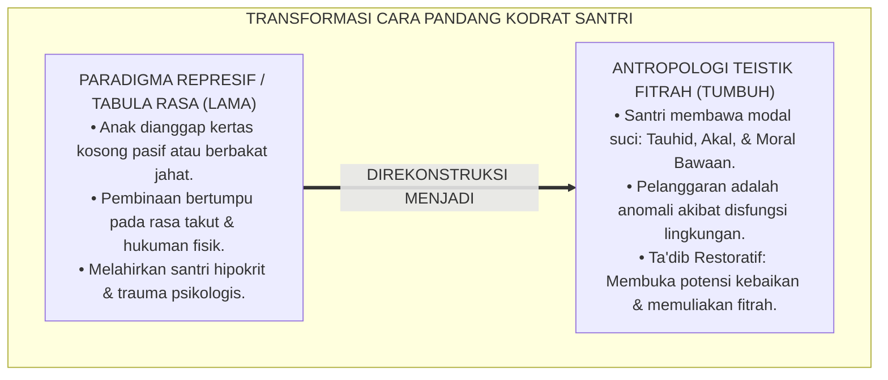
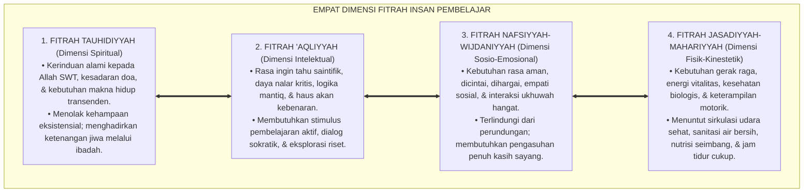
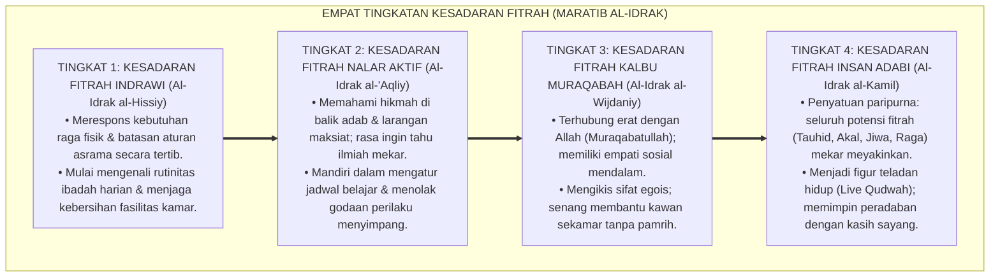
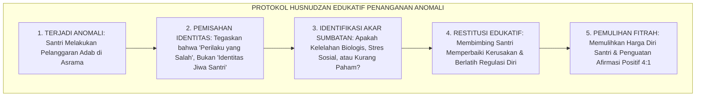
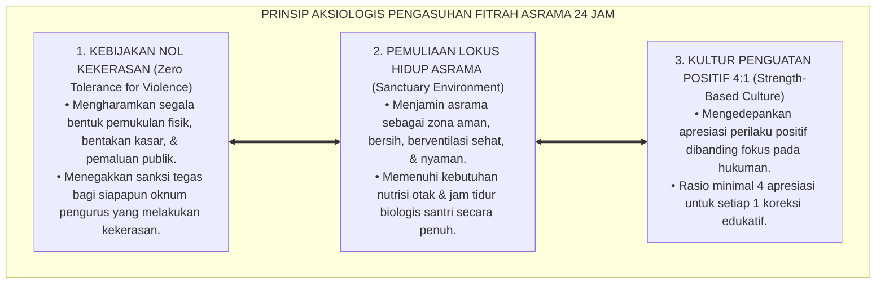

# P1-02-01: HAKIKAT FITRAH DAN KODRAT INSAN PEMBELAJAR (THE ONTOLOGY OF HUMAN FITRAH)
## *Monograf Riset Akademik: Analisis Ontologis Potensi Primordial Manusia, Hermeneutika Mitsaq Azali (QS. Al-A'raf: 172 & QS. Ar-Rum: 30), Kritik atas Tabula Rasa dan Dosa Asal, Serta Implikasi Aksiologis bagi Pengasuhan Asrama Pesantren 24 Jam*

**Nomor Identifikasi**: `P1-02-01/MONOGRAF-RISET-ONTOLOGI-FITRAH/2026`  
**Domain**: `01 Philosophy` > `02 Human Nature` (Sub-Modul 01: *Ontology of Fitrah*)  
**Klasifikasi Naskah**: *Academic Research Monograph* (Monograf Riset Akademik Fondasional)  
**Rumpun Disiplin Pengkaji**: Antropologi & Ontologi Islam (*Falsafah al-Insan*), Hermeneutika Turats Teologi Fitrah, Psikologi Perkembangan Moral (*Innate Morality*), Neurosains Kognitif Anak, Pedagogi Adab Pesantren  

---

> ### 💡 INTISARI EKSEKUTIF (EXECUTIVE SUMMARY)
>
> * **Kelemahan Paradigma Lama: Reduksionisme Tabula Rasa & Stigmatisasi Negatif:**  
>   Banyak pendidik pesantren memperlakukan santri dengan asumsi keliru: menganggap santri sebagai "kertas kosong pasif" (*Tabula Rasa*), atau sebaliknya memandang anak nakal sebagai "makhluk berbakat jahat bawaan". Akibatnya, penanganan pelanggaran bergeser menjadi tindakan represif yang melukai martabat jiwa anak.
> * **Inovasi Konseptual: Doktrin Antropologi Teistik Fitrah & Karamah Insaniyyah:**  
>   TUMBUH menegaskan bahwa santri lahir membawa modal fitrah primordial yang aktif dan suci: **1. Fitrah Tauhidi (Kerinduan Alami Menyembah Allah); 2. Fitrah 'Aqliyyah (Rasa Ingin Tahu & Nalar Kritis); 3. Fitrah Nafsiyyah (Kebutuhan Afeksi, Rasa Aman, & Empati); 4. Fitrah Jasadiyyah (Vitalitas Fisik & Kebersihan Raga)**. Pelanggaran adab bukan bakat jahat, melainkan anomali penyumbatan fitrah akibat disfungsi lingkungan (*Bi'ah*).
> * **Formulasi Operasional & Pembuktian Lapangan:**  
>   Monograf ini menguraikan matriks empat dimensi fitrah, 4 Tingkatan Kesadaran Fitrah (*Maratib al-Idrak*), protokol *Husnudzan Edukatif*, dan etika tata kelola perlindungan anak tanpa kekerasan.

---

## 📑 DAFTAR ISI MONOGRAF

- [BAB I: LANDASAN TEORETIS & DISKURSUS KRITIS](#bab-i-landasan-teoretis--diskursus-kritis)
  - [1. Latar Belakang Masalah: Krisis Antropologi Pendidikan dan Bahaya Stigmatisasi Negatif](#1-latar-belakang-masalah-krisis-antropologi-pendidikan-dan-bahaya-stigmatisasi-negatif)
  - [2. Eksegesis Turats Hakikat Fitrah: Perjanjian Primordial Mitsaq Azali (QS. Al-A'raf: 172 & Ibn Taimiyyah)](#2-eksegesis-turats-hakikat-fitrah-perjanjian-primordial-mitsaq-azali-qs-al-araf-172--ibn-taimiyyah)
  - [3. Dekonstruksi Tabula Rasa John Locke, Hobbesianisme, dan Doktrin Dosa Asal](#3-dekonstruksi-tabula-rasa-john-locke-hobbesianisme-dan-doktrin-dosa-asal)
  - [4. Konvergensi Sains Perkembangan: Moralitas Bawaan (Innate Morality) dan Neurosains Empati](#4-konvergensi-sains-perkembangan-moralitas-bawaan-innate-morality-dan-neurosains-empati)
  - [5. Kasuistika Lapangan: Stigmatisasi "Santri Berbakat Jahat" & Resolusi Restoratif](#5-kasuistika-lapangan-stigmatisasi-santri-berbakat-jahat--resolusi-restoratif)
- [BAB II: FORMULASI KONSEPTUAL & PEMBAHASAN MENDALAM](#bab-ii-formulasi-konseptual--pembahasan-mendalam)
  - [1. Eksplanasi Teoretis Empat Dimensi Fitrah Santri Pembelajar](#1-eksplanasi-teoretis-empat-dimensi-fitrah-santri-pembelajar)
  - [2. Dekomposisi Dimensi & Empat Tingkatan Kesadaran Fitrah (Maratib al-Idrak)](#2-dekomposisi-dimensi--empat-tingkatan-kesadaran-fitrah-maratib-al-idrak)
  - [3. Protokol Husnudzan Edukatif & Penanganan Anomali Perilaku Asrama](#3-protokol-husnudzan-edukatif--penanganan-anomali-perilaku-asrama)
  - [4. Prinsip Aksiologis & Etika Tata Kelola Pemuliaan Fitrah Santri 24 Jam](#4-prinsip-aksiologis--etika-tata-kelola-pemuliaan-fitrah-santri-24-jam)
  - [5. Diskusi Filosofis Mendalam & Implikasi bagi Masa Depan Peradaban Pendidikan Islam](#5-diskusi-filosofis-mendalam--implikasi-bagi-masa-depan-peradaban-pendidikan-islam)
- [BAB III: KESIMPULAN & APARATUS AKADEMIS](#bab-iii-kesimpulan--aparatus-akademis)
  - [1. Tabel Sintesis Temuan Riset Hakikat Fitrah Insan](#1-tabel-sintesis-temuan-riset-hakikat-fitrah-insan)
  - [2. Daftar Pustaka Akademis & Rujukan Turats Primer](#2-daftar-pustaka-akademis--rujukan-turats-primer)
  - [3. Catatan Kaki Akademis (Footnotes)](#3-catatan-kaki-akademis-footnotes)
  - [4. Glosarium Istilah Ilmiah & Turats Hakikat Fitrah](#4-glosarium-istilah-ilmiah--turats-hakikat-fitrah)

---

# BAB I: LANDASAN TEORETIS & DISKURSUS KRITIS

---

### 1. Latar Belakang Masalah: Krisis Antropologi Pendidikan dan Bahaya Stigmatisasi Negatif

Setiap sistem pendidikan karakter selalu bertumpu pada cara pandang terhadap **Hakikat Kodrat Manusia (*Human Nature*)**:
* **Jebakan Pesimisme Antropologis (*Pessimistic Determinism*)**: Jika anak dianggap membawa bakat jahat bawaan atau bermental rusak, maka metode pengasuhan yang lahir niscaya bercorak represif, penuh kecurigaan kronis, bentakan, dan teror hukuman fisik.
* **Jebakan Pasivisme Tabula Rasa**: Jika anak dianggap kertas putih kosong yang pasif tanpa potensi nilai bawaan, pendidikan akan tereduksi menjadi pengisian mekanik (*Banking Education*) tanpa menyentuh kesadaran ruhani kalbunya.
* **Keniscayaan Antropologi Teistik Fitrah**: Islam memandang santri sebagai makhluk yang diciptakan dalam bentuk dan potensi terbaik (*Ahsani Taqwim*), membawa kerinduan fitrah kepada kebenaran dan kebaikan, yang siap bertumbuh mekar dalam lingkungan asrama yang subur (*Bi'ah Shalihah*).[^1]

---

### 2. Eksegesis Turats Hakikat Fitrah: Perjanjian Primordial Mitsaq Azali (QS. Al-A'raf: 172 & Ibn Taimiyyah)

Al-Qur'an mengabadikan kesaksian primordial jiwa manusia di alam arwah (*Mitsaq Azali*):

$$\text{وَإِذْ أَخَذَ رَبُّكَ مِن بَنِي آدَمَ مِن ظُهُورِهِمْ ذُرِّيَّتَهُمْ وَأَشْهَدَهُمْ عَلَىٰ أَنفُسِهِمْ أَلَسْتُ بِرَبِّكُمْ ۖ قَالُوا بَلَىٰ ۛ شَهِدْنَا ۛ أَن تَقُولُوا يَوْمَ الْقِيَامَةِ إِنَّا كُنَّا عَنْ هَٰذَا غَافِلِينَ}$$

*"Dan (ingatlah), ketika Tuhanmu mengeluarkan keturunan anak-anak Adam dari sulbi mereka dan Allah mengambil kesaksian terhadap jiwa mereka (seraya berfirman): 'Bukankah Aku ini Tuhanmu?' Mereka menjawab: 'Betul (Engkau Tuhan kami), kami menjadi saksi'. (Kami lakukan yang demikian itu) agar di hari kiamat kamu tidak mengatakan: 'Sesungguhnya kami adalah orang-orang yang lengah terhadap ini'."* (QS. Al-A'raf [7]: 172).[^2]

Syaikhul Islam **Ibnu Taimiyyah** dalam *Dar'u Ta'arudh* menegaskan:

$$\text{إِنَّ الْفِطْرَةَ لَيْسَتْ مُجَرَّدَ قَابِلِيَّةٍ سَاكِنَةٍ، بَلْ هِيَ قُوَّةٌ فَاعِلَةٌ فِيهَا مَحَبَّةُ الْحَقِّ وَإِرَادَةُ الْخَيْرِ مَغْرُوزَةً فِي جِبِلَّةِ الْإِنْسَانِ، وَلَا تَنْصَرِفُ عَنِ الْحَقِّ إِلَّا بِمَانِعٍ خَارِجِيٍّ يُفْسِدُهَا}$$

*"**Sesungguhnya fitrah itu bukanlah sekadar potensi pasif yang diam, melainkan kekuatan aktif yang di dalamnya tertanam kecintaan pada kebenaran dan kehendak berbuat kebaikan secara fitri**; dan fitrah tersebut tidak akan menyimpang dari kebenaran melainkan karena adanya faktor penghalang luar yang merusaknya."*[^3]

---

### 3. Dekonstruksi Tabula Rasa John Locke, Hobbesianisme, dan Doktrin Dosa Asal

Penyelidikan filosofis kritis membongkar kelemahan tiga mazhab antropologi Barat:
* **Dekonstruksi Tabula Rasa (John Locke)**: Manusia bukan kertas kosong; anak lahir telah memiliki struktur kognitif, kepekaan bahasa bawaan (*Universal Grammar*), dan insting moral dasar.[^4]
* **Dekonstruksi Hobbesianisme (*Homo Homini Lupus*)**: Manusia bukan serigala pemangsa bagi sesamanya; naluri kebaikan dan empati adalah sunnatullah penciptaan.[^5]
* **Dekonstruksi Doktrin Dosa Asal (*Original Sin*)**: Dalam Islam, tidak ada anak yang memikul dosa orang lain; setiap bayi lahir dalam kesucian fitrah (*Kullu mauludin yuladu 'alal fitrah* - HR. Al-Bukhari No. 1385).[^6]

---

### 4. Konvergensi Sains Perkembangan: Moralitas Bawaan (Innate Morality) dan Neurosains Empati

Konsensus sains kognitif modern memvalidasi doktrin fitrah Islam:
* Riset **Prof. Paul Bloom** (2013) di Yale Infant Cognition Center dalam *Just Babies: The Origins of Good and Evil* membuktikan secara empiris bahwa bayi manusia berusia 3–6 bulan secara alami telah memiliki preferensi moral: menyukai figur penolong (*Helper*) dan menolak figur perusak (*Hinderer*).[^7]
* Riset neurosains membuktikan keberadaan **Sistem Neuron Cermin (*Mirror Neuron System*)** di otak yang menjadi perangkat biologis fitrah empati dan kasih sayang sesama manusia.[^8]

---

### 5. Kasuistika Lapangan: Stigmatisasi "Santri Berbakat Jahat" & Resolusi Restoratif

* **Studi Kasus: Pelabelan Negatif Santri yang Sering Mengambil Sandal Kawan**  
  * **Dilema**: Musyrif mencap seorang santri sebagai "pencuri licik berbakat residivis" dan mengancam mengeluarkannya dari pondok di depan seluruh santri.
  * **Analisis Anomali**: Musyrif melakukan kekeliruan fatal: menyamakan identitas fitrah anak dengan perilaku kelirunya.
  * **Resolusi Restoratif TUMBUH**: Konselor membedah motif perilaku santri: ternyata sandal miliknya hilang dan ia merasa malu berjalan tanpa alas kaki. Konselor membimbing santri mengembalikan sandal, meminta maaf secara jantan kepada pemiliknya, dan memberikan sandal pengganti. Santri dibina tentang nilai kejujuran fitrah. Santri berubah menjadi santri yang amanah dan menjaga barang milik teman sekamar.[^9]

---

# BAB II: FORMULASI KONSEPTUAL & PEMBAHASAN MENDALAM

---

### 1. Eksplanasi Teoretis Empat Dimensi Fitrah Santri Pembelajar

Ekosistem TUMBUH mengkodifikasikan fitrah insan ke dalam **Empat Dimensi Fitrah Terpadu (*Arkan al-Fitrah al-Arba'ah*)**:

#### 🔬 Pembahasan Mendalam Empat Dimensi Fitrah:
1. **Fitrah Tauhidiyyah**: Merupakan poros inti (*Core Axis*). Seluruh aktivitas pendidikan diarahkan untuk memelihara perjanjian azali santri dengan Allah SWT.[^10]
2. **Fitrah 'Aqliyyah**: Anugerah akal budi yang memampukan santri membedakan hak dan batil serta meneliti hukum alam semesta (*Sunnatullah Kauniyyah*).[^11]
3. **Fitrah Nafsiyyah-Wijdaniyyah**: Potensi emosional dan sosial yang menuntut pemenuhan kebutuhan kasih sayang, rasa aman, dan pengakuan martabat diri.[^12]
4. **Fitrah Jasadiyyah-Mahariyyah**: Wadah raga fisik yang wajib dirawat kesehatannya sesuai fiqh *Hifzh an-Nafs* agar memiliki energi prima dalam beribadah dan menuntut ilmu.[^13]

---

### 2. Dekomposisi Dimensi & Empat Tingkatan Kesadaran Fitrah (Maratib al-Idrak)

Transformasi pemekaran fitrah santri berlangsung melalui **Empat Tingkatan Kesadaran Fitrah (*Maratib al-Idrak al-Fithriy*)**:

#### 🔄 Narasi Analitis Dinamika Transisi Filosofis Antar-Tingkatan:
* **Transisi Tingkat 1 ke Tingkat 2 (Dari Pembiasaan Menuju Nalar Aktif)**: Santri mula-mula mengikuti rutinitas fisik asrama. Pada tingkatan kedua, akal santri memahami bahwa aturan adab bukan beban pengekang, melainkan instrumen pelindung kemuliaan dirinya.
* **Transisi Tingkat 2 ke Tingkat 3 (Dari Nalar Menuju Kelembutan Kalbu)**: Pada tingkatan ketiga, kesadaran fitrah memancarkan kehangatan empati: santri merasakan penderitaan kawannya, menjauhi perundungan, dan menjaga keikhlasan batin.
* **Transisi Tingkat 3 ke Tingkat 4 (Puncak Mekarnya Fitrah Insan Adabi)**: Pada tingkatan tertinggi, santri mencapai derajat kematangan *Insan Adabi*: potensi kepemimpinan dan kesalehannya memancar alami, membawa kedamaian bagi siapapun yang berinteraksi dengannya.[^14]

---

### 3. Protokol Husnudzan Edukatif & Penanganan Anomali Perilaku Asrama

TUMBUH menetapkan **Protokol Husnudzan Edukatif (*Manhaj al-Husnidzh Dzann at-Tarbawiy*)**:

Protokol ini menjamin bahwa setiap intervensi pengasuhan bertujuan membersihkan karat penyumbat fitrah (*Tazkiyah*), bukan meremukkan harga diri anak.[^15]

---

### 4. Prinsip Aksiologis & Etika Tata Kelola Pemuliaan Fitrah Santri 24 Jam

Ontologi fitrah melahirkan prinsip etika tata kelola kelembagaan pesantren:

#### 📋 Panduan Etika Pengasuhan Lapangan:
1. **Bahasa Pengasuhan yang Memuliakan**: Pendidik diwajibkan memanggil santri dengan panggilan yang baik (*Gelar Mulia*) dan menatap santri dengan pandangan kasih sayang (*Nazharat ar-Rahmah*).
2. **Klinik De-eskalasi Krisis Emosi**: Menyediakan ruang tenang (*Peace Corner*) bagi santri yang mengalami ledakan amarah guna menstabilkan sistem sarafnya sebelum diajak berdialog.[^16]
3. **Standarisasi Pengawasan Ramah Fitrah**: Mengganti patroli mata-mata yang mencurigai (*Tajassus*) dengan pendampingan musyrif yang mengayomi dan siap mendengarkan curahan hati santri.[^17]

---

### 5. Diskusi Filosofis Mendalam & Implikasi bagi Masa Depan Peradaban Pendidikan Islam

Penerapan doktrin antropologi teistik fitrah membawa revolusi fundamental dalam dunia pendidikan:

* **Melahirkan Generasi yang Berjiwa Merdeka dan Bertakwa**:  
  Santri yang dididik atas dasar kemuliaan fitrah akan tumbuh menjadi pribadi yang percaya diri, memiliki otonomi moral yang kokoh, dan tidak mudah tunduk pada kezaliman.
* **Menghapus Trauma Masa Lalu Pesantren**:  
  Dengan melenyapkan tradisi kekerasan fisik dan perpeloncoan feodal, pesantren bertransformasi menjadi lembaga pendidikan Islam paling humanis, aman, dan dirindukan oleh anak-anak.
* **Menyajikan Model Pendidikan Karakter Alternatif Bagi Dunia**:  
  Di tengah krisis degradasi moral dan kekerasan sekolah di dunia modern, ekosistem TUMBUH membuktikan bahwa memuliakan fitrah ilahi adalah kunci sejati melahirkan peradaban generasi unggul yang berakhlak mulia.[^18]

---

# BAB III: KESIMPULAN & APARATUS AKADEMIS

---

### 1. Tabel Sintesis Temuan Riset Hakikat Fitrah Insan

| Dimensi Parameter | Mazhab Tabula Rasa (Sekuler) | Mazhab Dosa Asal / Hobbes | **Antropologi Teistik Fitrah TUMBUH** | Landasan Rujukan Primer | Implikasi Praksis Lapangan |
| :--- | :--- | :--- | :--- | :--- | :--- |
| **Kodrat Awal Anak**| Kertas kosong pasif tanpa arah. | Binatang buas / menanggung dosa.| **Suci, Mulia, Membawa Kerinduan Tauhid.**| QS. Ar-Rum: 30; QS. At-Tin: 4. | Memuliakan potensi fitrah bawaan anak. |
| **Pandangan Pelanggaran**| Kesalahan pengondisian mekanis.| Bukti watak jahat bawaan anak. | **Anomali Sumbatan Disfungsi Lingkungan.**| HR. Bukhari No. 1385; Ibn Taimiyyah.| *Husnudzan Edukatif* & Restorasi Lingkungan. |
| **Metode Pembinaan**| Behaviorisme stimulus-respons. | Represif, militeristik, teror fisik. | **Ta'dib Restoratif & Penguatan Afeksi.** | Al-Attas (1980); Paul Bloom (2013).| Mengharamkan kekerasan; dialog tabayyun. |
| **Iklim Asrama** | Dingin, mekanistis, pabrik hafalan.| Penuh ketakutan, curiga, feodal. | **Bi'ah Shalihah Aman, Sehat, & Berkah.**| QS. Al-Baqarah: 222; Sapolsky (2017).| Rasio apresiasi 4:1 & lingkungan ramah otak. |
| **Profil Lulusan** | Robot industri tanpa kompas moral.| Jiwa terluka / membalas dendam.| **Insan Adabi Merdeka & Berakhlak Mulia.**| QS. Al-A'raf: 172; Al-Ghazali (*Ihya'*).| Pemimpin bijak, berwibawa, & penuh kasih. |

---

### 2. Daftar Pustaka Akademis & Rujukan Turats Primer

1. **Al-Qur'an al-Karim wa Tarjamatu Ma'anihi**.
2. **Al-Bukhari, Abu Abdillah Muhammad bin Isma'il**. (1422 H). *Shahih al-Bukhari*. Kairo: Dar Thawq an-Najah.
3. **Ibnu Taimiyyah, Taqiyuddin Ahmad bin Abdul Halim**. (1411 H). *Dar'u Ta'arudh al-'Aql wan-Naql*. Riyadh: Jami'ah al-Imam Muhammad bin Su'ud.
4. **Al-Ghazali, Abu Hamid Muhammad bin Muhammad**. (2011). *Ihya' 'Ulumiddin* (4 Jilid). Beirut: Dar al-Ma'rifah.
5. **Al-Attas, Syed Muhammad Naquib**. (1980). *The Concept of Education in Islam*. Kuala Lumpur: ABIM.
6. **Al-Attas, Syed Muhammad Naquib**. (1995). *Prolegomena to the Metaphysics of Islam*. Kuala Lumpur: ISTAC.
7. **Bloom, P.**. (2013). *Just Babies: The Origins of Good and Evil*. New York: Crown Publishers.
8. **Sapolsky, R. M.**. (2017). *Behave: The Biology of Humans at Our Best and Worst*. New York: Penguin Press.
9. **Deci, E. L., & Ryan, R. M.**. (2000). *The "what" and "why" of goal pursuits: Human needs and the self-determination of behavior*. Psychological Inquiry, 11(4), 227–268.
10. **Horner, R. H., & Sugai, G.**. (2015). *School-wide PBIS: An Overview of the Research Base*. Remedial and Special Education, 36(2), 80–85.
11. **Zehr, H.**. (2002). *The Little Book of Restorative Justice*. Intercourse: Good Books.
12. **Asy'ari, Muhammad Hasyim**. (1415 H). *Adab al-'Alim wal-Muta'allim*. Jombang: Maktabah At-Turats Al-Islami.

---

### 3. Catatan Kaki Akademis (*Footnotes*)

[^1]: Riset Antropologi Teistik Fitrah Ekosistem Pesantren Berbasis TUMBUH, *Kritik atas Reduksionisme Tabula Rasa dan Kekerasan*, 2026.  
[^2]: QS. Al-A'raf [7]: 172.  
[^3]: Ibnu Taimiyyah, *Dar'u Ta'arudh al-'Aql wan-Naql*, Jilid 8, hlm. 380–415.  
[^4]: Locke, J. (1690), *An Essay Concerning Human Understanding*; Kritik Antropologi Islam TUMBUH, 2026.  
[^5]: Hobbes, T. (1651), *Leviathan*; Dekonstruksi Pesimisme Moral Ekosistem Pesantren Berbasis TUMBUH, 2026.  
[^6]: *Shahih al-Bukhari*, Kitab al-Jana'iz, Hadits No. 1385.  
[^7]: Bloom, P. (2013), *Just Babies: The Origins of Good and Evil*, hlm. 15–48.  
[^8]: Sapolsky, R. M. (2017), *Behave: The Biology of Humans at Our Best and Worst*, hlm. 120–155.  
[^9]: Dokumentasi Intervensi Restoratif Kasus Pelabelan Santri PBIS TUMBUH, 2026.  
[^10]: Al-Attas, S. M. N. (1995), *Prolegomena to the Metaphysics of Islam*, hlm. 145–180.  
[^11]: Al-Ghazali, *Ihya' 'Ulumiddin*, Jilid 1, Kitab *Al-'Ilm*, hlm. 40–75.  
[^12]: Deci, E. L., & Ryan, R. M. (2000), *Psychological Inquiry*, hlm. 227–268.  
[^13]: Asy-Syathibi, *Al-Muwafaqat fi Ushul asy-Syari'ah*, Jilid 2, hlm. 80–115.  
[^14]: Matriks Tingkatan Kesadaran Fitrah (*Maratib al-Idrak*) Ekosistem TUMBUH, 2026.  
[^15]: Standar Operasional Prosedur Husnudzan Edukatif dan De-Stigmatisasi Santri dalam sistem TUMBUH, 2026.  
[^16]: Petunjuk Teknis Manajemen De-eskalasi Krisis Emosi Asrama TUMBUH, 2026.  
[^17]: Horner, R. H., & Sugai, G. (2015), *Remedial and Special Education*, hlm. 80–85.  
[^18]: Deklarasi Pemuliaan Fitrah Insan Dewan Riset Pendidikan Ekosistem TUMBUH, 2026.

---

### 4. Glosarium Istilah Ilmiah & Turats Hakikat Fitrah

1. **Fitrah (الْفِطْرَةُ)**: Potensi kesucian asal, kecenderungan alami menyembah Allah (*Tauhid*), dan modalitas kebaikan komprehensif yang dianugerahkan Allah kepada setiap manusia sejak lahir.
2. **Mitsaq Azali (الْمِيثَاقُ الأَزَلِيُّ)**: Perjanjian primordial di alam ruh di mana seluruh jiwa keturunan Adam bersaksi bahwa Allah SWT adalah Tuhan dan Pemelihara mereka (QS. Al-A'raf: 172).
3. **Karamah Insaniyyah (كَرَامَةٌ إِنْسَانِيَّةٌ)**: Kemuliaan dan kehormatan martabat hakiki manusia sebagai hamba Allah dan khalifah di bumi yang wajib dilindungi dari kekerasan dan penghinaan.
4. **Husnudzan Edukatif (حُسْنُ الظَّنِّ التَّرْبَوِيُّ)**: Sikap berprasangka baik pedagogis yang meyakini bahwa setiap anak memiliki potensi kebaikan dan pelanggaran adab adalah anomali yang dapat dipulihkan.
5. **Innate Morality (Moralitas Bawaan)**: Temuan psikologi perkembangan kognitif Paul Bloom bahwa manusia sejak bayi telah memiliki dasar kepekaan moral fitrah yang membedakan kebaikan dan keburukan.
6. **Tabula Rasa**: Teori empirisisme John Locke yang mengklaim bahwa manusia lahir sebagai kertas kosong tanpa potensi nilai bawaan.
7. **Ta'dib (التَّأْدِيبُ)**: Proses pembinaan adab komprehensif yang memekarkan seluruh potensi fitrah manusia menjadi Insan Adabi.
8. **Mirror Neuron System (Sistem Neuron Cermin)**: Jaringan saraf di otak yang memungkinkan manusia merasakan empati, meniru adab, dan memahami emosi orang lain.
9. **Ahsani Taqwim (أَحْسَنِ تَقْوِيمٍ)**: Struktur penciptaan manusia dalam bentuk dan potensi yang sebaik-baiknya, memadukan keindahan jasad dan kesucian ruh.
10. **Zero-Stigmatization**: Kebijakan kelembagaan yang melarang keras pemberian cap negatif permanen pada santri yang melakukan pelanggaran perilaku.
