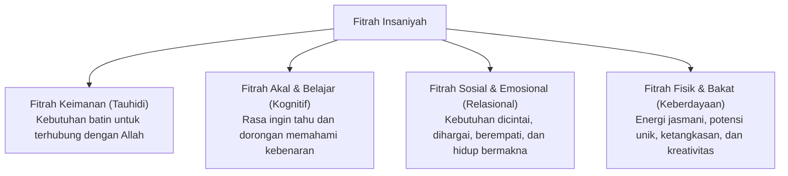

# P1-02-01-Hakikat-Fitrah

## Tujuan
Merumuskan pemahaman mendasar mengenai konsep **Fitrah** sebagai fondasi ontologis hakikat manusia dan santri dalam ekosistem TUMBUH di dunia pesantren.

---

## Mengapa Konsep Fitrah Penting?
Dalam sistem pembinaan konvensional yang kaku, santri sering kali dipandang sebagai "kertas kosong" (*tabula rasa*) yang harus diisi atau "objek bermasalah" yang harus dikontrol dengan hukuman. 

Paradigma TUMBUH menegaskan bahwa:
* Santri lahir membawa modal dasar kebaikan, kecenderungan tauhid, dan potensi luhur (*fitrah*).
* Pendidikan (*tarbiyah & ta'dib*) bukanlah memaksakan bentuk luar yang asing, melainkan menjaga kesucian fitrah, menyuburkan bibit kebaikan, dan mengarahkan potensi fitrah agar mekar secara optimal.
* Kerusakan perilaku (*deviance*) bukanlah hakikat asli manusia, melainkan akibat distorsi lingkungan, trauma, kelemahan regulasi diri, atau bisikan hawa nafsu yang menutup fitrah aslinya.

---

## Dalil dan Rujukan Turats

### 1. Dalil Al-Qur'an
> *"Maka hadapkanlah wajahmu dengan lurus kepada agama Allah; (tetaplah atas) fitrah Allah yang telah menciptakan manusia menurut fitrah itu. Tidak ada perubahan pada fitrah Allah. (Itulah) agama yang lurus, tetapi kebanyakan manusia tidak mengetahui."*  
> **(QS. Ar-Rum [30]: 30)**

> *"Dan (ingatlah) ketika Tuhanmu mengeluarkan keturunan anak-anak Adam dari sulbi mereka dan Allah mengambil kesaksian terhadap jiwa mereka (seraya berfirman): 'Bukankah Aku ini Tuhanmu?' Mereka menjawab: 'Betul (Engkau Tuhan kami), kami menjadi saksi.'..."*  
> **(QS. Al-A'raf [7]: 172)**

### 2. Hadis Nabawi
> *"Setiap anak dilahirkan di atas fitrah. Maka kedua orang tuanyalah yang menjadikannya Yahudi, Nasrani, atau Majusi..."*  
> **(HR. Bukhari no. 1385 & Muslim no. 2658)**

### 3. Khazanah Turats
* **Imam Ibn Taimiyyah** (*Dar' Ta'arud al-'Aql wa an-Naql*): Fitrah adalah kesiapan inheren dalam diri manusia untuk menerima kebenaran dan mencintai kebaikan, sebagaimana mata memiliki kesiapan inheren untuk melihat cahaya.
* **Imam Al-Ghazali** (*Ihya' 'Ulumiddin*): Hati anak laksana mutiara murni yang belum terukir. Ia menerima segala ukiran yang digoreskan padanya dan condong kepada apa yang dibiasakan kepadanya.
* **Syed Muhammad Naquib al-Attas**: Fitrah terikat dengan perjanjian primordial (*Mitsaq*), di mana pengakuan terhadap Rabb menuntut penyerahan diri secara adil dan beradab (*Ta'dib*).

---

## Dimensi Fitrah dalam Diri Santri

Dalam framework TUMBUH, fitrah santri dipetakan ke dalam 4 dimensi esensial:

1. **Fitrah Tauhidi (Spiritual)**: Kebutuhan dasar untuk mengabdi kepada Sang Pencipta, ketenangan dalam dzikir, dan rasa rindu akan keridhaan ilahi.
2. **Fitrah Intelektual ('Aqliyah)**: Dorongan alami untuk mencari kebenaran, menalar, berpikir kritis, dan memahami hukum sebab-akibat (sunnatullah).
3. **Fitrah Sosial-Emosional (Nafsiyah & Ruhiyah)**: Kebutuhan akan relasi yang aman (*secure attachment*), rasa diterima dalam komunitas (*sense of belonging*), dan kemampuan berempati.
4. **Fitrah Ragawi & Bakat (Jasmaniyah & Maharah)**: Potensi unik setiap santri dalam bidang ketangkasan fisik, kepemimpinan, seni, literasi, atau keteknikan.

---

## Implikasi bagi Ekosistem Pesantren TUMBUH

1. **Prinsip Pengasuhan Berbasis Husnudzan Aktif**: Pembina dan musyrif memandang setiap santri memiliki potensi kebaikan yang dapat ditumbuhkan, bukan memandang santri sebagai objek yang dicurigai.
2. **Lingkungan yang Memulihkan (*Restorative Environment*)**: Jika santri melakukan pelanggaran, tugas pesantren bukan menghancurkan harga dirinya melalui kekerasan/pelecehan verbal, melainkan membimbingnya membersihkan noda yang menutupi fitrahnya melalui konsekuensi logis dan pembiasaan positif.
3. **Personalisasi Pendampingan**: Mengakui bahwa manifestasi fitrah dan bakat setiap santri beragam, sehingga kurikulum pembinaan tidak boleh menyeragamkan secara kaku, melainkan mengarahkan pada potensi terbaik masing-masing.
