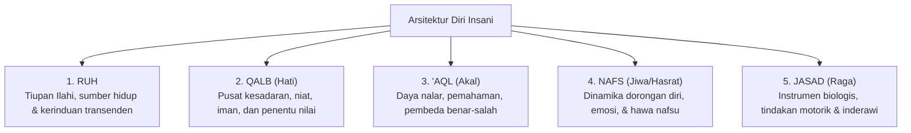

# P1-02-02-Struktur-Diri-Insani

## Tujuan
Membedah arsitektur internal manusia menurut khazanah Islam (*Jasad, Ruh, Nafs, Qalb, 'Aql*) sebagai peta antropologis untuk memahami perilaku, emosi, dan dinamika pertumbuhan santri.

---

## Arsitektur Jiwa dalam Khazanah Islam

Manusia bukanlah makhluk biologis semata, melainkan kesatuan integral dari dimensi fisik, rasional, emosional, dan spiritual.

---

## Penjelasan Komponen & Dinamikanya

### 1. Ruh (*The Spiritual Core*)
* Hakikat metafisik yang ditiupkan Allah kepada janin (*QS. Al-Hijr [15]: 29, QS. Al-Isra [17]: 85*).
* Sumber fitrah spiritual yang senantiasa mendambakan hubungan dengan Allah. 
* Dalam ekosistem pesantren, ruh dirawat melalui ibadah, dzikir, tilawah, dan perenungan (*tafakkur*).

### 2. Qalb (*The Center of Consciousness & Will*)
* Pusat kesadaran moral dan penentu arah seluruh tindakan (*"Ketahuilah bahwa dalam jasad ada segumpal daging..." - HR. Bukhari*).
* Sifat dasar Qalb adalah berbolak-balik (*yataqallab*), peka terhadap cahaya kebaikan (*nur*) maupun bintik dosa (*nuktah sauda'*).
* Menjadi target utama **Tazkiyatun Nafs** dan pembinaan adab.

### 3. 'Aql (*The Cognitive & Discernment Faculty*)
* Daya nalar untuk memahami argumentasi, menangkap hikmah, menimbang konsekuensi sebab-akibat, dan mengikat dorongan nafsu (*'aql* secara bahasa bermakna "pengikat").
* Selaras dengan fungsi kognitif tingkat tinggi (*Executive Function & Responsible Decision-Making* dalam SEL).

### 4. Nafs (*The Dynamic Self & Drives*)
* Totalitas diri manusia yang memiliki gradasi perkembangan moral:
  1. **Nafs Ammaarah bis-Su'** (*QS. Yusuf [12]: 53*): Jiwa yang tunduk pada dorongan hewani, egoistis, dan impulsif.
  2. **Nafs Lawwaamah** (*QS. Al-Qiyamah [75]: 2*): Jiwa yang memiliki kesadaran diri (*self-awareness*), mencela kesalahan diri, dan bertekad memperbaiki diri.
  3. **Nafs Muthmainnah** (*QS. Al-Fajr [89]: 27-28*): Jiwa yang tenang, stabil, tunduk pada kebenaran, dan berakhlak mulia (*self-regulation paripurna*).

### 5. Jasad (*The Physical Vessel & Instrument*)
* Wadah ragawi tempat seluruh aktivitas batiniah termanifestasi dalam bentuk gerak, ucapan, dan kebiasaan (*habits*).
* Membutuhkan nutrisi halal-thayyib, istirahat cukup, dan kesehatan fisik agar mampu menopang ibadah dan pembelajaran.

---

## Integrasi dengan Sistem TUMBUH

| Komponen Jiwa | Padanan dalam Framework Modern | Implementasi di Pesantren TUMBUH |
| :--- | :--- | :--- |
| **Ruh** | *Spiritual Meaning & Purpose* | Mentoring/Tarbiyah ruhiyah, sholat khusyuk, tahajjud |
| **Qalb** | *Emotional Intelligence & Core Values* | Pembinaan adab, muhasabah, empati persaudaraan (*ukhuwah*) |
| **'Aql** | *Cognitive Mastery & Critical Thinking* | Penguasaan kurikulum, dialog hikmah, problem-solving |
| **Nafs** | *Self-Regulation & Behavioral Drives* | Disiplin Positif, manajemen dorongan emosi, PBIS |
| **Jasad** | *Physical Health & Daily Routines* | SOP kebersihan asrama, olahraga, nutrisi, adab makan & tidur |

---

## Implikasi Pembinaan
Kegagalan perilaku pada santri bukanlah cacat permanen, melainkan tanda adanya ketidakseimbangan antara dorongan **Nafs**, bimbingan **'Aql**, dan kesehatan **Qalb**. Pendekatan TUMBUH berfokus pada melatih 'Aql dan membersihkan Qalb, bukan sekadar menghukum Jasad.
