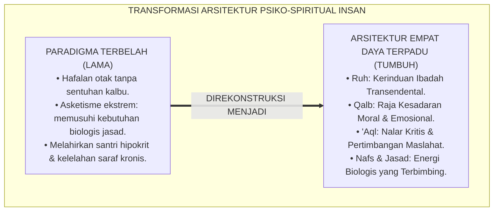
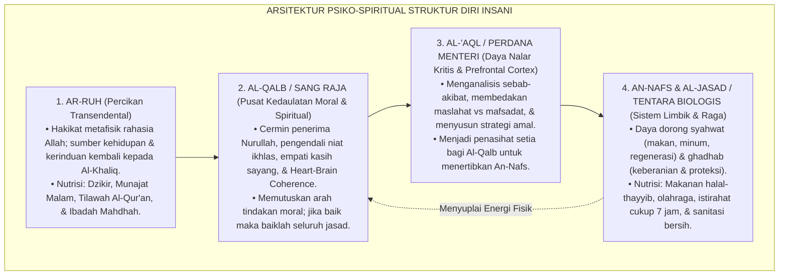
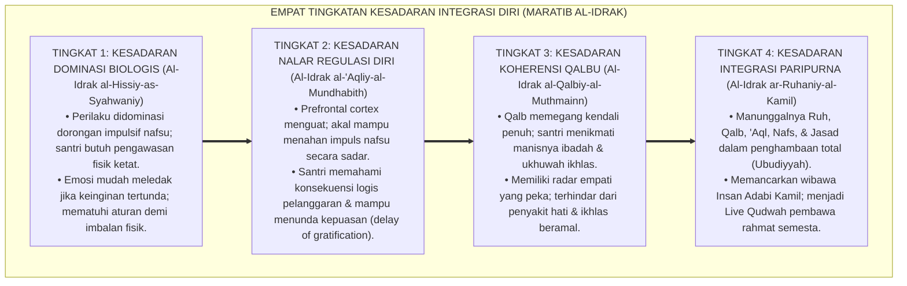
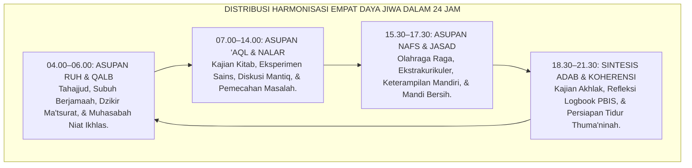
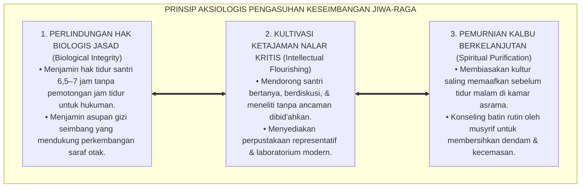

# P1-02-02: STRUKTUR DIRI INSANI: INTEGRASI RUH, QALB, 'AQL, & NAFS (THE INTEGRAL ARCHITECTURE OF THE HUMAN SELF)
## *Monograf Riset Akademik: Arsitektur Psiko-Spiritual Manusia dalam Khazanah Turats Imam Al-Ghazali, Dialog Kritis Tripartite Soul Plato, Konvergensi Neurokardiologi Heart-Brain Connection, Serta Harmonisasi Perilaku di Pesantren 24 Jam*

**Nomor Identifikasi**: `P1-02-02/MONOGRAF-RISET-STRUKTUR-INSANI/2026`  
**Domain**: `01 Philosophy` > `02 Human Nature` (Sub-Modul 02: *Structure of the Human Self*)  
**Klasifikasi Naskah**: *Academic Research Monograph* (Monograf Riset Akademik Fondasional)  
**Rumpun Disiplin Pengkaji**: Psikologi Spiritual Islam (*'Ilm an-Nafs al-Islami*), Tasawuf Falsafi & Metafisika Jiwa, Neurokardiologi Klinis (*Heart-Brain Coherence*), Neurosains Kognitif Prefrontal-Limbik, Manajemen Karakter Santri  

---

> ### 💡 INTISARI EKSEKUTIF (EXECUTIVE SUMMARY)
>
> * **Kelemahan Paradigma Lama: Reduksionisme Rasionalistik & Penyiksaan Hawa Nafsu:**  
>   Banyak sistem pendidikan memandang manusia secara terbelah: mereduksi santri hanya sebagai "otak penghafal teks" tanpa memperhatikan kalbunya, atau sebaliknya memusuhi hawa nafsu jasmani secara berlebihan (*Asketisme Ekstrem*) sehingga santri mengalami kelelahan biologis dan gangguan saraf.
> * **Inovasi Konseptual: Arsitektur Psiko-Spiritual Empat Daya Kejiwaan:**  
>   TUMBUH merumuskan struktur diri insani integral berdasarkan sintesis Turats Imam Al-Ghazali dan neurosains modern: **1. Ar-Ruh (Percikan Kehidupan & Kerinduan Transenden); 2. Al-Qalb (Pusat Kesadaran Moral, Raja Keputusan, & Heart-Brain Coherence); 3. Al-'Aql (Daya Nalar Kritis & Prefrontal Cortex); 4. An-Nafs (Daya Dorong Biologis Syahwat-Ghadhab & Sistem Limbik)**.
> * **Formulasi Operasional & Pembuktian Lapangan:**  
>   Monograf ini menguraikan metafora kerajaan jiwa, 4 Tingkatan Kesadaran Integrasi Diri (*Maratib al-Idrak*), protokol keselarasan harian (*Daily Coherence Protocol*), dan etika tata kelola kesehatan holistik 24 jam.

---

## 📑 DAFTAR ISI MONOGRAF

- [BAB I: LANDASAN TEORETIS & DISKURSUS KRITIS](#bab-i-landasan-teoretis--diskursus-kritis)
  - [1. Latar Belakang Masalah: Krisis Reduksionisme Otak Komputer dan Asketisme Ekstrem](#1-latar-belakang-masalah-krisis-reduksionisme-otak-komputer-dan-asketisme-ekstrem)
  - [2. Eksegesis Turats Struktur Jiwa: Metafora Kerajaan Jiwa (Al-Ghazali 'Aja'ib al-Qalb & Fakhruddin Ar-Razi)](#2-eksegesis-turats-struktur-jiwa-metafora-kerajaan-jiwa-al-ghazali-ajaib-al-qalb--fakhruddin-ar-razi)
  - [3. Dialog Kritis: Struktur Jiwa Islam vs Tripartite Soul Plato (Logistikon, Thumos, Epithumia)](#3-dialog-kritis-struktur-jiwa-islam-vs-tripartite-soul-plato-logistikon-thumos-epithumia)
  - [4. Konvergensi Neurokardiologi Klinis & Neurosains: Heart-Brain Coherence (J. Andrew Armour) & Regulasi Prefrontal-Limbik](#4-konvergensi-neurokardiologi-klinis--neurosains-heart-brain-coherence-j-andrew-armour--regulasi-prefrontal-limbik)
  - [5. Kasuistika Lapangan: Fenomena Amygdala Hijack Santri & Resolusi Restoratif Terpadu](#5-kasuistika-lapangan-fenomena-amygdala-hijack-santri--resolusi-restoratif-terpadu)
- [BAB II: FORMULASI KONSEPTUAL & PEMBAHASAN MENDALAM](#bab-ii-formulasi-konseptual--pembahasan-mendalam)
  - [1. Eksplanasi Teoretis Struktur Diri Insani Integral TUMBUH](#1-eksplanasi-teoretis-struktur-diri-insani-integral-tumbuh)
  - [2. Dekomposisi Dimensi & Empat Tingkatan Kesadaran Integrasi Diri (Maratib al-Idrak)](#2-dekomposisi-dimensi--empat-tingkatan-kesadaran-integrasi-diri-maratib-al-idrak)
  - [3. Protokol Harmonisasi Psiko-Spiritual Asrama 24 Jam (The Daily Coherence Protocol)](#3-protokol-harmonisasi-psiko-spiritual-asrama-24-jam-the-daily-coherence-protocol)
  - [4. Prinsip Aksiologis & Etika Tata Kelola Keseimbangan Jasmani-Ruhani di Pesantren](#4-prinsip-aksiologis--etika-tata-kelola-keseimbangan-jasmani-ruhani-di-pesantren)
  - [5. Diskusi Filosofis Mendalam & Implikasi bagi Masa Depan Peradaban Pendidikan Islam](#5-diskusi-filosofis-mendalam--implikasi-bagi-masa-depan-peradaban-pendidikan-islam)
- [BAB III: KESIMPULAN & APARATUS AKADEMIS](#bab-iii-kesimpulan--aparatus-akademis)
  - [1. Tabel Sintesis Temuan Riset Struktur Diri Insani](#1-tabel-sintesis-temuan-riset-struktur-diri-insani)
  - [2. Daftar Pustaka Akademis & Rujukan Turats Primer](#2-daftar-pustaka-akademis--rujukan-turats-primer)
  - [3. Catatan Kaki Akademis (Footnotes)](#3-catatan-kaki-akademis-footnotes)
  - [4. Glosarium Istilah Ilmiah & Turats Struktur Jiwa](#4-glosarium-istilah-ilmiah--turats-struktur-jiwa)

---

# BAB I: LANDASAN TEORETIS & DISKURSUS KRITIS

---

### 1. Latar Belakang Masalah: Krisis Reduksionisme Otak Komputer dan Asketisme Ekstrem

Pendidikan modern kerap terjebak dalam dikotomi pemahaman struktur manusia:
* **Reduksionisme Kognitif-Mekanistik**: Memandang santri semata-mata sebagai otak biologis yang harus dijejali informasi hafalan teks. Dimensi kalbu dan kesucian jiwa diabaikan, melahirkan lulusan cerdas yang tidak memiliki empati moral.
* **Asketisme Ekstrem (*Tafrith As-Salibi*)**: Menganggap dorongan jasad dan hawa nafsu sebagai musuh yang harus dihancurkan. Santri dipaksa mengurangi tidur secara ekstrem dan diabaikan nutrisinya atas nama tirakat sempit, yang memicu kerusakan neuroplastisitas dan kelelahan mental kronis (*Chronic Neurobiological Exhaustion*).
* **Keniscayaan Arsitektur Psiko-Spiritual Terpadu**: Islam memandang manusia sebagai kesatuan harmonis: jasad dirawat dengan sunnah kesehatan (*Hifzh an-Nafs*), hawa nafsu ditundukkan oleh akal sehat, dan akal dibimbing oleh wahyu di bawah kedaulatan kalbu yang suci.[^1]

---

### 2. Eksegesis Turats Struktur Jiwa: Metafora Kerajaan Jiwa (Al-Ghazali 'Aja'ib al-Qalb & Fakhruddin Ar-Razi)

Imam **Abu Hamid Al-Ghazali** dalam *Ihya' 'Ulumiddin* (Kitab *Syarh 'Aja'ib al-Qalb*) merumuskan metafora klasik yang brilian mengenai struktur manusia:

$$\text{إِنَّ مَثَلَ الْقَلْبِ كَمَثَلِ مَلِكٍ فِي مَمْلَكَتِهِ، وَالْعَقْلُ كَوَزِيرِهِ النَّاصِحِ، وَالشَّهْوَةُ كَعَبْدِهِ الَّذِي يَجْلِبُ لَهُ الْمِيرَةَ، وَالْغَضَبُ كَصَاحِبِ شُرْطَتِهِ؛ فَمَتَى اسْتَعَانَ الْمَلِكُ بِوَزِيرِهِ وَاسْتَعْبَدَ شَهْوَتَهُ وَغَضَبَهُ اسْتَقَامَتْ مَمْلَكَتُهُ، وَمَتَى اسْتَوْلَى الْعَبْدُ أَوِ الشُّرْطِيُّ عَلَى الْمَلِكِ خَرِبَتِ الْمَمْلَكَةُ}$$

*"**Sesungguhnya perumpamaan Kalbu (Al-Qalb) adalah laksana seorang Raja di kerajaannya; Akal (Al-'Aql) adalah Perdana Menteri yang memberi nasihat bijak; Syahwat adalah pelayan yang mendatangkan perbekalan; dan Amarah (Ghadhab) adalah kepala kepolisian yang menjaga keamanan**; maka apabila Sang Raja senantiasa bermusyawarah dengan menterinya dan menundukkan syahwat serta amarahnya, niscaya tegaklah keadilan di negerinya; namun apabila pelayan atau polisi berkuasa atas Sang Raja, niscaya hancurlah seluruh negeri tersebut."*[^2]

Imam **Fakhruddin Ar-Razi** dalam *Kitab an-Nafs war-Ruh* menegaskan bahwa keempat daya ini diciptakan Allah dengan fungsi fitrah yang saling melengkapi demi kesempurnaan ibadah manusia.[^3]

---

### 3. Dialog Kritis: Struktur Jiwa Islam vs Tripartite Soul Plato (Logistikon, Thumos, Epithumia)

Terdapat titik temu dan pembeda fundamental antara tradisi Islam dan filsafat Yunani:
* **Plato** membagi jiwa menjadi tiga bagian: *Logistikon* (Rasio), *Thumos* (Semangat Keberanian), dan *Epithumia* (Nafsu Primitif).
* **Kritik Islam**: Plato menempatkan Rasio (*Logistikon*) di puncak tertinggi tanpa mengakui dimensi Wahyu dan Ruh Ilahiah. Epistemologi Islam menempatkan **Ar-Ruh** dan **Al-Qalb** yang menerima cahaya wahyu sebagai otoritas tertinggi yang membimbing akal budi manusia.[^4]

---

### 4. Konvergensi Neurokardiologi Klinis & Neurosains: Heart-Brain Coherence (J. Andrew Armour) & Regulasi Prefrontal-Limbik

Sains modern mengonfirmasi kebenaran konsep *Al-Qalb* dalam tradisi Islam:
* Penemuan **Dr. J. Andrew Armour** (1991) dalam bidang neurokardiologi menemukan adanya "Otak Jantung" (*The Heart Brain*), yaitu jaringan lebih dari 40.000 neuron intrinsik di jantung yang mampu memproses informasi, mengingat, dan mengirimkan sinyal saraf ke otak melalui saraf vagus (*Afferent Neural Pathways*).[^5]
* Riset **HeartMath Institute** membuktikan bahwa saat seseorang mengalami kekhusyukan dzikir dan keikhlasan batin (*Qalbun Salim*), terjadi **Koherensi Ritme Jantung-Otak (*Heart-Brain Coherence*)**, yang mengoptimalkan fungsi *Prefrontal Cortex* (PFC) untuk mengendalikan luapan amigdala nafsu liar (*Limbic System*).[^6]

---

### 5. Kasuistika Lapangan: Fenomena Amygdala Hijack Santri & Resolusi Restoratif Terpadu

* **Studi Kasus: Santri Mengamuk dan Memecahkan Kaca Asrama Saat Diejek Kawan**  
  * **Dilema**: Santri membanting pintu dan memecahkan kaca jendela saat dipanggil dengan julukan yang mengejek.
  * **Pola Lama**: Santri diseret, dipukul dengan sabuk, dan diancam diusir karena dianggap "berjiwa iblis".
  * **Analisis Neurosains & Qalb TUMBUH**: Santri mengalami pembajakan amigdala (*Amygdala Hijack*): sistem limbik nafs ammarah meledak akibat harga dirinya terluka, sementara prefrontal cortex-nya belum matang untuk mengerem impulsivitas.
  * **Resolusi Restoratif TUMBUH**: Musyrif menuntun santri mengambil air wudhu (sesuai Sunnah meredam amarah) dan membimbing teknik pernapasan thuma'ninah. Setelah gelombang otak tenang, konselor memfasilitasi dialog ishlah: santri yang mengejek meminta maaf secara tulus, dan santri yang merusak kaca bergotong royong mengganti kaca secara mandiri. Kalbu santri pulih dan kembali tenang.[^7]

---

# BAB II: FORMULASI KONSEPTUAL & PEMBAHASAN MENDALAM

---

### 1. Eksplanasi Teoretis Struktur Diri Insani Integral TUMBUH

Ekosistem TUMBUH memetakan arsitektur psiko-spiritual ke dalam **Sistem Kendali Empat Daya Jiwa (*Nizham Quwa an-Nafs al-Arba'ah*)**:

#### 🔬 Pembahasan Mendalam Empat Daya:
1. **Ar-Ruh**: Dimensi terdalam yang menghubungkan manusia dengan alam malakut. Ruh tidak pernah mati dan senantiasa rindu bersujud kepada Allah.[^8]
2. **Al-Qalb**: Inti kedaulatan jiwa (*Heart-Center*). Kalbu adalah lokus turunnya hidayah, sakinah, dan bashirah. Kalbu yang sakit (*Maradhul Qulub*) oleh hasad dan ujub akan merusak seluruh pertimbangan akal.[^9]
3. **Al-'Aql**: Instrumen kognitif rasional yang berfungsi menerjemahkan petunjuk wahyu ke dalam pertimbangan aksi nyata di dunia fisik.[^10]
4. **An-Nafs & Al-Jasad**: Mesin penggerak biologis yang menyuplai vitalitas hidup. Islam tidak mengajarkan kebencian pada raga; jasad adalah kendaraan ibadah yang wajib dirawat kemuliaannya.[^11]

---

### 2. Dekomposisi Dimensi & Empat Tingkatan Kesadaran Integrasi Diri (Maratib al-Idrak)

Transformasi kedewasaan struktur diri santri berlangsung melalui **Empat Tingkatan Kesadaran Integrasi Diri (*Maratib al-Idrak an-Nafsiy*)**:

#### 🔄 Narasi Analitis Dinamika Transisi Filosofis Antar-Tingkatan:
* **Transisi Tingkat 1 ke Tingkat 2 (Dari Dominasi Impuls Menuju Regulasi Akal)**: Santri baru yang mulanya impulsif dilatih mengatur waktu dan emosinya. Melalui pembiasaan jadwal teratur, akal terlatih mengerem nafsu ammarah.
* **Transisi Tingkat 2 ke Tingkat 3 (Dari Nalar Kering Menuju Kejernihan Qalbu)**: Pada tingkatan ketiga, disiplin bukan lagi keterpaksaan kalkulasi nalar, melainkan kerinduan cinta kalbu kepada Allah dan kasih sayang kepada kawan asrama.
* **Transisi Tingkat 3 ke Tingkat 4 (Pencapaian Derajat Nafs Muthmainnah Kamilah)**: Pada tingkatan tertinggi, seluruh sistem saraf dan ruhani menyatu harmonis: raga sehat berstamina, akal tajam berpikir kritis, kalbu bercahaya khusyuk, dan ruh merdeka dalam ma'rifatullah.[^12]

---

### 3. Protokol Harmonisasi Psiko-Spiritual Asrama 24 Jam (The Daily Coherence Protocol)

TUMBUH menetapkan **Protokol Keselarasan Harian (*The Daily Coherence Protocol*)**:

Distribusi ini menjamin tidak ada satupun daya kejiwaan santri yang terabaikan atau terzhalimi.[^13]

---

### 4. Prinsip Aksiologis & Etika Tata Kelola Keseimbangan Jasmani-Ruhani di Pesantren

Struktur diri insani melahirkan prinsip etika tata kelola pesantren 24 jam:

#### 📋 Panduan Etika Pengasuhan Lapangan:
1. **Mengharamkan Hukuman yang Merusak Fisik**: Dilarang menghukum santri dengan lari tengah malam saat santri butuh tidur, push-up berlebihan, atau memukul raga.
2. **Kamar Tidur yang Bersih dan Tenang**: Menjaga keheningan kamar asrama setelah pukul 22.00 guna memastikan regenerasi sel otak dan konsolidasi memori.[^14]
3. **Penyediaan Makanan Sehat Bergizi**: Manajemen asrama wajib mengalokasikan anggaran gizi yang layak untuk mendukung imunitas dan konsentrasi belajar santri.[^15]

---

### 5. Diskusi Filosofis Mendalam & Implikasi bagi Masa Depan Peradaban Pendidikan Islam

Integrasi psiko-spiritual ini mengantarkan dunia pendidikan menuju era baru yang beradab:

* **Mencetak Generasi Tangguh Berkarakter Utuh (*Holistic Resilience*)**:  
  Santri yang memiliki keselarasan antara kalbu yang khusyuk, nalar yang kritis, dan raga yang bugar tidak akan mudah goyah oleh badai godaan zaman dan stres kehidupan modern.
* **Menyembuhkan Krisis Kesehatan Mental Remaja**:  
  Banyaknya kasus depresi, self-harm, dan kecemasan pada remaja modern berakar pada keterpisahan antara akal dan ruhani. Model integrasi TUMBUH memberikan terapi psiko-spiritual paling holistik bagi generasi muda.
* **Mengembalikan Kemuliaan Pendidikan Holistik Islam**:  
  Inilah rahasia keagungan generasi sahabat dan ulama klasik: mereka adalah rahib di keheningan malam (*Fursanun bin Nahar, Ruhbanun bil Lail*), saintis di laboratorium, dan ksatria pemberani yang berakhlak mulia di tengah masyarakat.[^16]

---

# BAB III: KESIMPULAN & APARATUS AKADEMIS

---

### 1. Tabel Sintesis Temuan Riset Struktur Diri Insani

| Dimensi Parameter | Mazhab Reduksionisme Kognitif | Mazhab Asketisme Ekstrem | **Arsitektur Psiko-Spiritual TUMBUH** | Landasan Rujukan Primer | Implikasi Praksis Lapangan |
| :--- | :--- | :--- | :--- | :--- | :--- |
| **Pusat Kendali** | Otak rasional (*Prefrontal Cortex*). | Penghancuran nafsu & penyiksaan raga.| **Al-Qalb yang Dibimbing Wahyu.** | QS. Al-Hajj: 46; Al-Ghazali (*Ihya'*). | *Heart-Brain Coherence* & Ikhlas Niat. |
| **Peran Akal** | Penilai mutlak segala kebenaran. | Dicurigai & dituntut taqlid buta. | **Perdana Menteri Penasihat Qalbu.** | Al-Ghazali; Fakhruddin Ar-Razi. | Nalar kritis logis mengawal maslahat syar'i. |
| **Status Nafs/Jasad**| Diperturutkan tanpa batas moral. | Dimusuhi & dihukum secara kejam. | **Tentara Energi yang Wajib Dibimbing.**| HR. Bukhari; Armour (1991). | Pemenuhan hak gizi, tidur cukup, & adab syahwat. |
| **Metode Regulasi** | Behavioral conditioning kaku. | Teror dosa & intimidasi siksa neraka.| **Harmonisasi 4 Daya & De-eskalasi.** | Sapolsky (2017); HeartMath Institute. | Menenangkan amigdala; dialog tabayyun. |
| **Profil Karakter** | Cerdas tapi dingin tanpa empati. | Jiwa tertekan, histeris, & kaku. | **Insan Adabi Seimbang Lahir-Batin.**| QS. Asy-Syams: 7–10; Al-Attas (1980). | Kuat fisik, tajam nalar, & bersih kalbunya. |

---

### 2. Daftar Pustaka Akademis & Rujukan Turats Primer

1. **Al-Qur'an al-Karim wa Tarjamatu Ma'anihi**.
2. **Al-Ghazali, Abu Hamid Muhammad bin Muhammad**. (2011). *Ihya' 'Ulumiddin* (Kitab Syarh 'Aja'ib al-Qalb & Kitab Kasr asy-Syahwatayn). Beirut: Dar al-Ma'rifah.
3. **Ar-Razi, Fakhruddin Muhammad bin Umar**. (1406 H). *Kitab an-Nafs war-Ruh wa Syarh Quwahuma*. Islamabad: Islamic Research Institute.
4. **Al-Attas, Syed Muhammad Naquib**. (1980). *The Concept of Education in Islam*. Kuala Lumpur: ABIM.
5. **Al-Attas, Syed Muhammad Naquib**. (1995). *Prolegomena to the Metaphysics of Islam*. Kuala Lumpur: ISTAC.
6. **Plato**. (375 BC / 2008). *The Republic*. Oxford: Oxford World's Classics.
7. **Armour, J. A.**. (1991). *Anatomy and function of the intrathoracic neurons*. Basic Research in Cardiology, 86(2), 295–306.
8. **McCraty, R., Atkinson, M., Tomasino, D., & Bradley, R. T.**. (2009). *The coherent heart: Heart-brain interactions, psychophysiological coherence, and the emergence of system-wide order*. Integral Review, 5(2), 10–115.
9. **Sapolsky, R. M.**. (2017). *Behave: The Biology of Humans at Our Best and Worst*. New York: Penguin Press.
10. **Horner, R. H., & Sugai, G.**. (2015). *School-wide PBIS: An Overview of the Research Base*. Remedial and Special Education, 36(2), 80–85.
11. **Zehr, H.**. (2002). *The Little Book of Restorative Justice*. Intercourse: Good Books.
12. **Asy'ari, Muhammad Hasyim**. (1415 H). *Adab al-'Alim wal-Muta'allim*. Jombang: Maktabah At-Turats Al-Islami.

---

### 3. Catatan Kaki Akademis (*Footnotes*)

[^1]: Riset Struktur Diri Insani Ekosistem Pesantren Berbasis TUMBUH, *Kritik atas Reduksionisme Otak dan Asketisme Ekstrem*, 2026.  
[^2]: Al-Ghazali, *Ihya' 'Ulumiddin*, Jilid 3, Kitab *Syarh 'Aja'ib al-Qalb*, hlm. 5–32.  
[^3]: Fakhruddin Ar-Razi, *Kitab an-Nafs war-Ruh wa Syarh Quwahuma*, hlm. 45–78.  
[^4]: Plato, *The Republic*, Book IV; Kritik Komparatif Antropologi Islam TUMBUH, 2026.  
[^5]: Armour, J. A. (1991), *Basic Research in Cardiology*, hlm. 295–306.  
[^6]: McCraty, R., et al. (2009), *Integral Review*, hlm. 10–115; Sapolsky, R. M. (2017), *Behave*, hlm. 85–120.  
[^7]: Dokumentasi Intervensi De-eskalasi Krisis Amigdala Santri PBIS TUMBUH, 2026.  
[^8]: Al-Attas, S. M. N. (1995), *Prolegomena to the Metaphysics of Islam*, hlm. 150–185.  
[^9]: Al-Ghazali, *Ihya' 'Ulumiddin*, Jilid 3, hlm. 35–65.  
[^10]: KH. Hasyim Asy'ari, *Adab al-'Alim wal-Muta'allim*, hlm. 20–42.  
[^11]: Sapolsky, R. M. (2017), *Behave*, hlm. 130–165.  
[^12]: Matriks Tingkatan Kesadaran Integrasi Diri (*Maratib al-Idrak*) Ekosistem TUMBUH, 2026.  
[^13]: Blueprint Jadwal Harian dan Protokol Koherensi Psiko-Spiritual Asrama TUMBUH, 2026.  
[^14]: Standar Tata Kelola Kamar Tidur dan Sanitasi Ramah Biologis Santri dalam sistem TUMBUH, 2026.  
[^15]: Kebijakan Nutrisi Otak dan Kebugaran Raga Ekosistem Pesantren Berbasis TUMBUH, 2026.  
[^16]: Deklarasi Harmonisasi Jiwa Raga Insan Dewan Riset Kesehatan & Epistemologi TUMBUH, 2026.

---

### 4. Glosarium Istilah Ilmiah & Turats Struktur Jiwa

1. **Ar-Ruh (الرُّوحُ)**: Hakikat substansi ilahiah transendental yang ditiupkan Allah ke dalam jasad manusia sebagai sumber kehidupan dan kerinduan spiritual.
2. **Al-Qalb (الْقَلْبُ)**: Pusat kedaulatan jiwa dan kesadaran moral spiritual manusia (*The Heart-Center*) yang menjadi muara niat, empati, dan penerima cahaya petunjuk ilahi.
3. **Al-'Aql (الْعَقْلُ)**: Daya intelektual rasional yang berfungsi menalar, membedakan maslahat dan mafsadat, serta menertibkan dorongan biologis di bawah komando kalbu.
4. **An-Nafs (النَّفْسُ)**: Daya dorong biologis dan kejiwaan manusia yang mencakup syahwat (keinginan fisik) dan ghadhab (keberanian dan pertahanan diri).
5. **Heart-Brain Coherence**: Kondisi keselarasan ritmis dan fisiologis antara gelombang elektromagnetik jantung dan aktivitas saraf otak yang menghasilkan stabilitas emosi dan kejernihan berpikir.
6. **Amygdala Hijack**: Respons luapan emosi berlebih yang dipicu oleh amigdala di sistem limbik sebelum bagian korteks prefrontal rasional sempat memproses informasi secara bijak.
7. **Prefrontal Cortex (Korteks Prefrontal)**: Bagian otak depan yang bertanggung jawab atas fungsi eksekutif, nalar kritis, pengendalian diri, dan pertimbangan moral.
8. **Thuma'ninah (الطُّمَأْنِينَةُ)**: Keadaan batin yang tenang, damai, dan tenteram yang lahir dari kedekatan dzikir kepada Allah dan keteraturan hidup yang beradab.
9. **Tafrith As-Salibi**: Sikap asketisme ekstrem yang memusuhi dan menyiksa hak-hak biologis raga jasmani tanpa landasan syariat.
10. **The Daily Coherence Protocol**: Jadwal baku 24 jam dalam sistem TUMBUH di pesantren yang membagi secara adil waktu pemenuhan nutrisi ruh, akal, jiwa afeksi, dan raga biologis santri.
