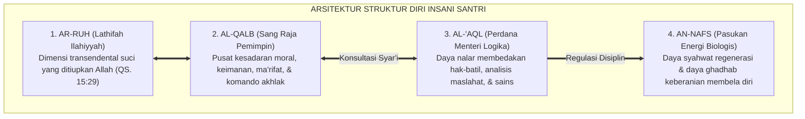
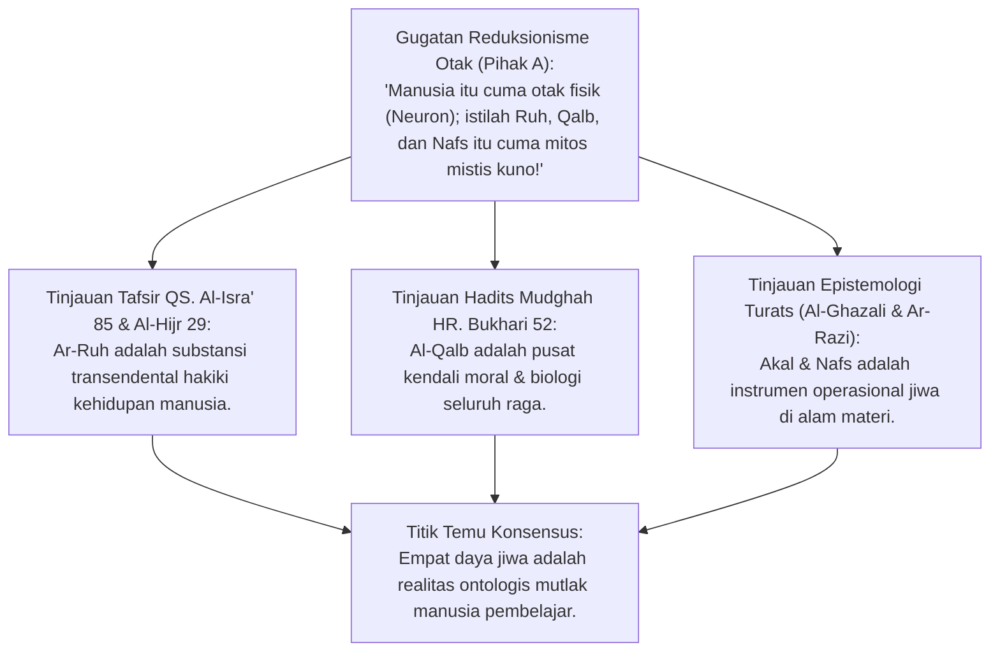
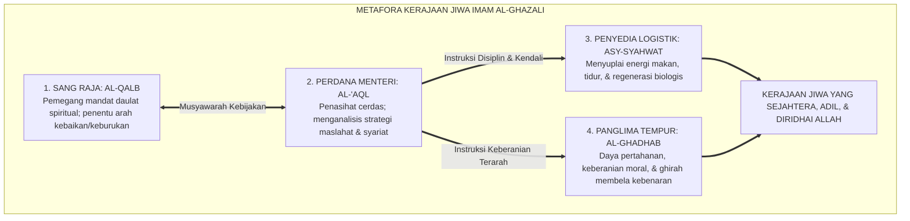
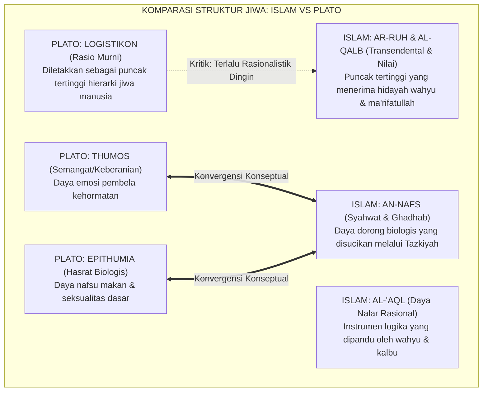
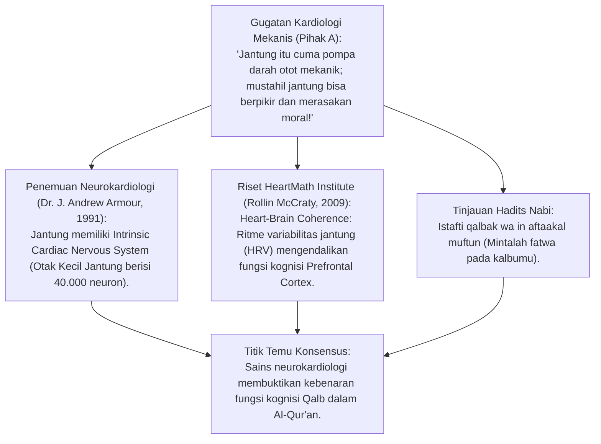
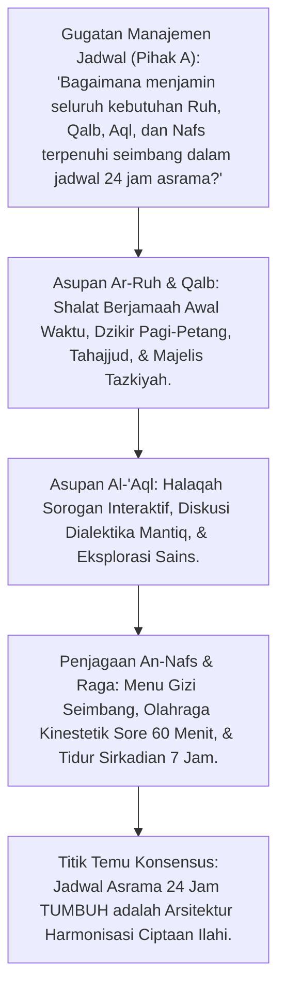
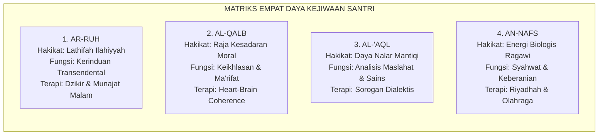
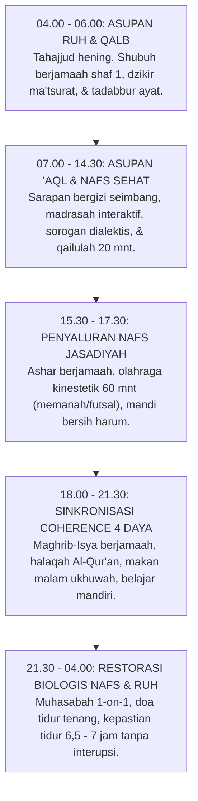

# P1-02-02: STRUKTUR DIRI INSANI: INTEGRASI RUH, QALB, 'AQL, & NAFS
## *Monograf Terpadu: Arsitektur Psiko-Spiritual Manusia dalam Khazanah Tasawuf Falsafi Imam Al-Ghazali, Tripartite Soul Plato, Konvergensi Neurokardiologi Heart-Brain Connection J. Andrew Armour, & Top-Down Neuroregulation*

**Nomor Identifikasi**: `P1-02-02/MONOGRAF-TERPADU-STRUKTUR-INSANI/2026`  
**Domain**: `01 Philosophy` > `02 Human Nature`  
**Klasifikasi Naskah**: *Comprehensive Integrated Monograph* (Monograf Akademis & Rumusan Baku Terpadu)  
**Rumpun Disiplin Pengkaji**: Psikologi Spiritual Islam (*'Ilm an-Nafs al-Islami*), Tasawuf Falsafi & Metafisika Jiwa, Neurokardiologi Klinis (*Heart-Brain Coherence*), Neurosains Kognitif Prefrontal-Limbik, Manajemen Karakter Santri  

---

> ### 💡 INTISARI PRAKTIS (3 MENIT PAHAM UNTUK ASATIDZ & MUSYRIF)
>
> * **Manusia Bukan Sekadar Komputer Berjalan!**  
>   Santri bukan cuma "otak yang diisi hafalan". Manusia diciptakan dari paduan debu tanah materi (*Thien*) dan hembusan ruh suci dari Allah (*Nafkh ar-Ruh*).
> * **Empat Pasukan Jiwa Santri (Arsitektur Imam Al-Ghazali):**  
>   1. **Ar-Ruh**: Percikan kehidupan ilahiah yang haus akan dzikir dan ibadah.  
>   2. **Al-Qalb (Sang Raja)**: Pusat kesadaran moral, niat ikhlas, dan kemudi akhlak.  
>   3. **Al-'Aql (Perdana Menteri)**: Daya nalar logika untuk membedakan maslahat vs mafsadat.  
>   4. **An-Nafs (Bala Tentara Biologis)**: Daya dorong syahwat makan/tidur dan amarah mempertahankan diri.
> * **Kaidah Emas Pengasuhan 24 Jam:**  
>   *"Hawa nafsu (*Nafs*) tidak boleh dibunuh atau disiksa, melainkan wajib dituntun oleh Akal sehat di bawah komando Kalbu yang beriman. Rawat raga fisiknya dengan makanan bergizi dan tidur 7 jam, asah otaknya dengan ilmu mantiq, dan hidupkan kalbunya dengan keikhlasan dzikir."*

---

## 📑 DAFTAR ISI MONOGRAF

- [BAGIAN I: RISET ARSITEKTUR STRUKTUR DIRI, DIALEKTIKA INKUIRI, & KASUISTIKA LAPANGAN](#bagian-i-riset-arsitektur-struktur-diri-dialektika-inkuiri--kasuistika-lapangan)
  - [1. Kerangka Metodologi Antropologi Psiko-Spiritual Islam](#1-kerangka-metodologi-antropologi-psiko-spiritual-islam)
  - [2. Inkuiri 1: Eksegesis Empat Daya Jiwa — Ar-Ruh, Al-Qalb, Al-'Aql, & An-Nafs dalam Turats Klasik](#2-inkuiri-1-eksegesis-empat-daya-jiwa--ar-ruh-al-qalb-al-aql--an-nafs-dalam-turats-klasik)
  - [3. Inkuiri 2: Metafora Kerajaan Jiwa Imam Al-Ghazali — Tahta Qalb dan Pasukan Ruhani-Jasmani](#3-inkuiri-2-metafora-kerajaan-jiwa-imam-al-ghazali--tahta-qalb-dan-pasukan-ruhani-jasmani)
  - [4. Inkuiri 3: Dialog Komparatif: Struktur Jiwa Islam vs Tripartite Soul Plato (Logistikon, Thumos, Epithumia)](#4-inkuiri-3-dialog-komparatif-struktur-jiwa-islam-vs-tripartite-soul-plato-logistikon-thumos-epithumia)
  - [5. Inkuiri 4: Konvergensi dengan Neurokardiologi Klinis (J. Andrew Armour) & HeartMath Coherence](#5-inkuiri-4-konvergensi-dengan-neurokardiologi-klinis-j-andrew-armour--heartmath-coherence)
  - [6. Inkuiri 5: Neurosains Integrasi Prefrontal Cortex (Aql) & Sistem Limbik-Amigdala (Nafs)](#6-inkuiri-5-neurosains-integrasi-prefrontal-cortex-aql--sistem-limbik-amigdala-nafs)
  - [7. Inkuiri 6: Translasi Harmonisasi Empat Daya ke Ritme Kehidupan Asrama Pesantren 24 Jam](#7-inkuiri-6-translasi-harmonisasi-empat-daya-ke-ritme-kehidupan-asrama-pesantren-24-jam)
- [BAGIAN II: KODIFIKASI BAKU HASIL RISET & KESIMPULAN FORMAL](#bagian-ii-kodifikasi-baku-hasil-riset--kesimpulan-formal)
  - [1. Kaidah Utama dan Standar Baku: Struktur Diri Insani Integral](#1-kaidah-utama-dan-standar-baku-struktur-diri-insani-integral)
  - [2. Matriks Empat Daya Kejiwaan: Hakikat, Fungsi, Potensi Penyimpangan, & Terapi Adab](#2-matriks-empat-daya-kejiwaan-hakikat-fungsi-potensi-penyimpangan--terapi-adab)
  - [3. Matriks Komparasi Anatomi Jiwa: Islam vs Tripartite Plato vs Neurosains Modern](#3-matriks-komparasi-anatomi-jiwa-islam-vs-tripartite-plato-vs-neurosains-modern)
  - [4. Protokol Harmonisasi Psiko-Spiritual Asrama 24 Jam (The Daily Coherence Protocol)](#4-protokol-harmonisasi-psiko-spiritual-asrama-24-jam-the-daily-coherence-protocol)
- [BAGIAN III: APARATUS AKADEMIS & APENDIKS](#bagian-iii-aparatus-akademis--apendiks)
  - [1. Tabel Sintesis Hasil Riset Struktur Diri Insani](#1-tabel-sintesis-hasil-riset-struktur-diri-insani)
  - [2. Daftar Pustaka Akademis & Rujukan Turats Primer](#2-daftar-pustaka-akademis--rujukan-turats-primer)
  - [3. Catatan Kaki Akademis (Footnotes)](#3-catatan-kaki-akademis-footnotes)
  - [4. Glosarium dan Penjelasan Istilah Teknis Struktur Jiwa & Neurosains](#4-glosarium-dan-penjelasan-istilah-teknis-struktur-jiwa--neurosains)

---

# BAGIAN I: RISET ARSITEKTUR STRUKTUR DIRI, DIALEKTIKA INKUIRI, & KASUISTIKA LAPANGAN

*Bagian ini memuat proses penyelidikan anatomi psiko-spiritual insan, formalisasi silogisme logika (*qiyas burhani*), pertarungan dialektika multi-perspektif tiga ronde tanpa kata "pakar", telaah kitab 'Aja'ib al-Qalb Al-Ghazali, Kitab an-Nafs war-Ruh Ar-Razi, riset neurokardiologi J. Andrew Armour, neurosains prefrontal-limbik, studi kasus asrama, dan penarikan konsensus bersama.*

---

### 1. Kerangka Metodologi Antropologi Psiko-Spiritual Islam

Pendidikan yang hanya menyasar kecerdasan kognitif semata (*Intellectual-Only Reductionism*) adalah pendidikan yang cacat fundamental.
* Manusia bukanlah komputer biologis yang hanya butuh asupan data hafalan, melainkan makhluk kosmis yang memadukan unsur tanah liat materiil (*Thien*) dengan hembusan ruh transendental (*Nafkh ar-Ruh*).
* Ekosistem TUMBUH memandang struktur diri santri sebagai sebuah **Arsitektur Psiko-Spiritual Holistik** yang mengintegrasikan empat daya kejiwaan: **Ar-Ruh, Al-Qalb, Al-'Aql, dan An-Nafs**.



---

### 2. Inkuiri 1: Eksegesis Empat Daya Jiwa — Ar-Ruh, Al-Qalb, Al-'Aql, & An-Nafs dalam Turats Klasik



#### 📐 Formalisasi Logika Silogisme (*Qiyas Mantiqi 1*)
* **Premis Mayor (*al-Muqaddimah al-Kubra*)**: Setiap entitas manusia yang tersusun dari dimensi transendental non-materiil (*ar-Ruh wal-Qalb*) dan dimensi instrumen rasional-biologis (*al-'Aql wan-Nafs*) niscaya membutuhkan sistem pembinaan adab yang menyeimbangkan kebutuhan asupan seluruh dimensi tersebut secara terpadu.
* **Premis Minor (*al-Muqaddimah ash-Shughra*)**: Seluruh santri yang dibina di pesantren TUMBUH memiliki struktur diri yang memuat keempat daya eksistensial tersebut.
* **Konklusi (*an-Natijah*)**: Maka, kurikulum pesantren wajib menyeimbangkan pemenuhan gizi spiritual ruhani, asupan nalar akal, dan kesehatan biologis nafs raga secara proporsional.[^1]

#### 📖 Teks Primer Al-Qur'an & Hadits Mudghah
Allah SWT berfirman mengenai rahasia ruh:

$$\text{وَيَسْأَلُونَكَ عَنِ الرُّوحِ ۖ قُلِ الرُّوحُ مِنْ أَمْرِ رَبِّي وَمَا أُوتِيتُم مِّنَ الْعِلْمِ إِلَّا قَلِيلًا}$$

*"Dan mereka bertanya kepadamu tentang ruh. Katakanlah: 'Ruh itu termasuk urusan Tuhanku, dan tidaklah kamu diberi pengetahuan melainkan sedikit.' "* (QS. Al-Isra' [17]: 85).[^2]

Dan Rasulullah SAW menetapkan posisi sentral Kalbu dalam kepribadian:
$$\text{أَلَا وَإِنَّ فِي الْجَسَدِ مُضْغَةً إِذَا صَلَحَتْ صَلَحَ الْجَسَدُ كُلُّهُ، وَإِذَا فَسَدَتْ فَسَدَ الْجَسَدُ كُلُّهُ، أَلَا وَهِيَ الْقَلْبُ}$$
*"Ketahuilah! Sesungguhnya di dalam tubuh ada segumpal darah; apabila ia baik, maka baiklah seluruh tubuh itu; dan apabila ia rusak, maka rusaklah seluruh tubuh itu. Ketahuilah! Segumpal darah itu adalah Kalbu!"* (HR. Bukhari no. 52 & Muslim no. 1599).[^3]

#### 🥊 Ronde 1: Menolak Materialisme Reduksionis yang Mereduksi Santri Menjadi Sekadar Rangkaian Neuron
* **Pihak A (Sudut Pandang Materialisme Sains Keras)**:  
  *"Manusia hanyalah produk reaksi biokimia otak. Emosi dan moralitas santri cuma urusan kadar dopamin dan serotonin; tidak perlu bicara soal ruh dan qalb!"*
* **Tinjauan Sudut Pandang Filsafat Pikiran & Neurobiologi**:  
  Materialisme reduksionis gagal menjelaskan fenomena kesadaran intensionalitas (*Qualia*), kerinduan transendental, dan pengorbanan moral yang melampaui insting bertahan hidup biologis. Hormon dopamin dan sirkuit saraf adalah **Instrumen Fisik Perantara (*Biochemical Correlates*)**, sedangkan yang menggerakkan dan mengarahkan niat moral adalah **Kesadaran Ruhani Kalbu (*Immaterial Soul*)**. Mengabaikan ruh membuat pendidikan kehilangan arah makna hidup.[^4]

#### 🥊 Ronde 2: Sanggahan Balik Apakah An-Nafs Harus Dihancurkan dan Dibunuh?
* **Pihak A (Sudut Pandang Asketisme Ekstrem)**:  
  *"Bukankah nafsu itu sumber segala kejahatan yang harus dibunuh dengan cara santri tidak boleh tidur dan berpuasa terus-menerus?"*
* **Tinjauan Sudut Pandang Fiqh Tasawuf Sunni (Al-Ghazali & Ibnul Qayyim)**:  
  Membunuh nafsu adalah **Kesesatan Fatwa yang Diharamkan Syariat**. Tanpa daya nafsu syahwat, manusia akan punah karena tidak ada regenerasi keturunan; tanpa daya nafsu ghadhab, manusia tidak punya keberanian membela agama (*Jihad & Ghirah*). Tugas pendidikan bukan **Membunuh Nafsu (*Qatl an-Nafs*)**, melainkan **Mendisiplinkan dan Mensucikannya (*Tazkiyatun Nafs*)** agar nafsu tunduk di bawah kendali akal sehat dan syariat (*Nafs Muthma'innah*).[^5]

#### 🥊 Ronde 3: Sanggahan Pamungkas Mengapa Akal Membutuhkan Bimbingan Wahyu?
* **Pihak A (Sudut Pandang Rasionalisme Murni)**:  
  *"Jika santri sudah diajari logika akal yang cerdas, apakah itu belum cukup untuk menjadikannya orang baik?"*
* **Resolusi Sudut Pandang Keterbatasan Akal Turats**:  
  Akal tanpa bimbingan wahyu dan kesucian kalbu akan tergelincir menjadi **Alat Rasionalisasi Kejahatan (*Instrumental Machiavellianism*)**. Banyak koruptor dan perancang senjata pemusnah massal adalah orang-orang yang akalnya sangat jenius. Akal membutuhkan cahaya wahyu (*Nurul Wahyi*) agar kecerdasannya diarahkan untuk menebar manfaat bagi umat (*Nafi'un Lighairihi*).[^6]

> #### 📌 Kasuistika Lapangan 1 & Titik Temu Konsensus
> * **Studi Kasus**: Santri yang sangat cerdas di kelas sains sering mencuri makanan teman sekamar di malam hari dengan trik yang sangat rapi tanpa meninggalkan jejak.
> * **Titik Temu Konsensus (*Kalimatun Sawa'*)**: Akalnya cerdas namun kalbunya kosong dari kesadaran muraqabah dan nafsunya tidak terkendali. Santri dibina bukan dengan menambah hafalan teori, melainkan diajak berdzikir malam dan menjalani khidmah dapur ma'had untuk melembutkan kalbunya.[^7]

---

### 3. Inkuiri 2: Metafora Kerajaan Jiwa Imam Al-Ghazali — Tahta Qalb dan Pasukan Ruhani-Jasmani



#### 📐 Formalisasi Logika Silogisme (*Qiyas Mantiqi 2*)
* **Premis Mayor (*al-Muqaddimah al-Kubra*)**: Setiap tatanan jiwa manusia yang menempatkan kalbu sebagai raja pemegang komando nilai, akal sebagai penasihat pertimbangan maslahat syar'i, serta mendudukkan daya syahwat dan ghadhab sebagai prajurit yang patuh niscaya menghasilkan tatanan kepribadian adab yang seimbang, bahagia, dan berakhlak mulia.
* **Premis Minor (*al-Muqaddimah ash-Shughra*)**: Metafora kerajaan jiwa Imam Al-Ghazali memetakan hierarki otoritas internal tersebut secara presisi.
* **Konklusi (*an-Natijah*)**: Maka, metodologi *Ta'dib* TUMBUH berpedoman pada pemulihan daulat Kalbu atas seluruh pasukan jiwa santri.[^8]

#### 📖 Teks Primer Turats: *Ihya' 'Ulumiddin* (Kitab 'Aja'ib al-Qalb)
Hujjatul Islam **Imam Al-Ghazali** merumuskan metafora kerajaan jiwa:

$$\text{اعْلَمْ أَنَّ مَثَلَ الْقَلْبِ فِي الْجَسَدِ كَمَثَلِ الْمَلِكِ فِي مَمْلَكَتِهِ، وَالْعَقْلُ كَالْوَزِيرِ الْعَاقِلِ النَّاصِحِ، وَالشَّهْوَةُ كَالْعَبْدِ السَّوْءِ الَّذِي يَجْلِبُ الطَّعَامَ، وَالْغَضَبُ كَصَاحِبِ الشُّرْطَةِ. فَإِذَا اسْتَعَانَ الْمَلِكُ بِوَزِيرِهِ وَاسْتَخْدَمَ عَبْدَهُ وَشُرْطِيَّهُ فِي طَاعَتِهِ، اسْتَقَامَتْ أُمُورُ الْمَمْلَكَةِ؛ وَإِنْ غَلَبَ الْعَبْدُ أَوِ الشُّرْطِيُّ عَلَى الْمَلِكِ هَلَكَتِ الْمَمْلَكَةُ وَخَرِبَتِ الْبِلَادُ}$$

*"Ketahuilah sesungguhnya perumpamaan Kalbu di dalam jasad adalah laksana seorang raja di kerajaannya; Akal adalah laksana perdana menteri yang cerdas dan tulus memberi nasihat; Syahwat adalah laksana pelayan pembawa logistik makanan; dan Ghadhab (amarah) adalah laksana kepala kepolisian prajurit. Maka apabila sang raja bermusyawarah dengan perdana menterinya dan menggunakan pelayan serta prajuritnya di bawah ketaatannya, niscaya tegaklah tatanan urusan kerajaan; namun apabila pelayan nafsu atau prajurit amarah yang mengkudeta sang raja, niscaya binasalah kerajaan jiwa dan hancurlah negeri!"*[^9]

#### 🥊 Ronde 1: Ketika Prajurit Amarah (Ghadhab) Mengkudeta Sang Raja
* **Tinjauan Psikologi Ledakan Amarah**:  
  Ketika santri terlibat pertengkaran fisik di asrama, yang terjadi secara internal adalah **Kudeta Prajurit Ghadhab Atas Tahta Kalbu**. Amigdala santri membajak seluruh kesadaran; akal sehat lumpuh, dan santri memukul tanpa memikirkan akibatnya. Tugas musyrif saat krisis bukanlah ikut marah (karena itu berarti musyrif juga terkudeta oleh ghadhab-nya), melainkan membantu santri menenangkan amarahnya (*Co-Regulation*) agar sang Raja Kalbu kembali duduk di tahtanya.[^10]

#### 🥊 Ronde 2: Sanggahan Balik Ketika Pelayan Syahwat Menjadi Tuan (Kecanduan Malas)
* **Pihak A (Sudut Pandang Santri Pemalas)**:  
  *"Mengapa ada santri yang seharian hanya ingin tidur, makan, dan mengabaikan jadwal piket kamar?"*
* **Tinjauan Sudut Pandang Dominasi Syahwat**:  
  Itu adalah kondisi di mana **Pelayan Syahwat Menguasai Negeri Jiwa**. Santri menjadi budak kenikmatan sesaat (*Hedonic Impulses*). Terapi adab TUMBUH mengaktifkan Perdana Menteri Akal melalui **Konsekuensi Logis 4R dan Pembatasan Tidur Siang (*Qailulah* Maksimal 30 Menit)**, sehingga syahwat kembali ke posisinya sebagai pelayan energi, bukan tuan kepribadian.[^11]

#### 🥊 Ronde 3: Sanggahan Pamungkas Membangkitkan Mahabbah dan Kerinduan Ruhani
* **Pihak A (Sudut Pandang Ibadah Formalitas)**:  
  *"Bagaimana membuat santri menikmati shalat tahajjud di malam hari tanpa merasa terpaksa?"*
* **Resolusi Sudut Pandang Asupan Cahaya Ar-Ruh**:  
  Ruh santri merindukan perjumpaan mesra dengan Allah (*Munajatul Habib*). Musyrif menyajikan shalat malam bukan sebagai "kewajiban militer yang diabsen rotan", melainkan sebagai **Majelis Cinta dan Curhat Batin kepada Sang Maha Pengasih**. Ketika ruh mendapatkan asupan cahaya dzikir, kalbu santri bergetar manis dan bangun malam menjadi kebutuhan yang dirindukan.[^12]

> #### 📌 Kasuistika Lapangan 2 & Titik Temu Konsensus
> * **Studi Kasus**: Musyrif kamar mendapati santri mengamuk membanting lemari karena diejek temannya; musyrif tidak membentak, melainkan memeluk santri tersebut dari belakang dengan tenang, menuntunnya beristighfar, dan membasuh wajahnya dengan air wudhu.
> * **Titik Temu Konsensus (*Kalimatun Sawa'*)**: Dalam 3 menit amarah santri reda total; sang Raja Kalbu kembali berdaulat, santri meminta maaf atas kerusakan lemari, dan bersedia memperbaikinya bersama teman-temannya.[^13]

---

### 4. Inkuiri 3: Dialog Komparatif: Struktur Jiwa Islam vs Tripartite Soul Plato (Logistikon, Thumos, Epithumia)



#### 📐 Formalisasi Logika Silogisme (*Qiyas Mantiqi 3*)
* **Premis Mayor (*al-Muqaddimah al-Kubra*)**: Setiap teori struktur jiwa yang hanya menempatkan rasio murni (*Logistikon*) sebagai otoritas tertinggi tanpa mengakui adanya fakultas transendental spiritual (*ar-Ruh wal-Qalb*) niscaya gagal menjelaskan pengalaman ma'rifatullah, cinta ilahiah (*Mahabbah*), dan transformasi kesucian batin.
* **Premis Minor (*al-Muqaddimah ash-Shughra*)**: Teori *Tripartite Soul* Plato (Republik IV) membatasi hierarki jiwa pada Logistikon, Thumos, dan Epithumia.
* **Konklusi (*an-Natijah*)**: Maka, konsepsi psiko-spiritual Islam melampaui dan menyempurnakan filsafat Plato dengan menempatkan Ruh dan Qalb sebagai puncak daulat eksistensi manusia.[^14]

#### 📖 Teks Primer Turats: *Ma'arij al-Quds* Imam Al-Ghazali & Plato's *Republic*
Plato dalam *Republic* (Buku IV, 439d–441a) merumuskan tiga bagian jiwa:

> *"The soul of man has three parts: the rational part (Logistikon) which loves wisdom and rules; the spirited part (Thumos) which loves honor and fights; and the appetitive part (Epithumia) which desires bodily pleasures."*[^15]

Namun **Imam Al-Ghazali** dalam *Ma'arij al-Quds* mengoreksi keterbatasan filsafat Yunani tersebut:
$$\text{إِنَّ فَلَاسِفَةَ الْيُونَانِ وَقَفُوا عِنْدَ قُوَى النَّفْسِ الْحَيَوَانِيَّةِ وَالْعَقْلِ الْهَيُولَانِيِّ، وَغَفَلُوا عَنِ اللَّطِيفَةِ الرَّبَّانِيَّةِ الَّتِي هِيَ الرُّوحُ وَالْقَلْبُ؛ وَإِنَّمَا الْعَقْلُ خَادِمٌ لِلْقَلْبِ، وَالْقَلْبُ هُوَ الْمُخَاطَبُ بِالتَّكْلِيفِ وَهُوَ الْمَحَلُّ لِمَعْرِفَةِ اللَّهِ وَمُشَاهَدَةِ أَنْوَارِ مَلَكُوتِهِ}$$
*"Sesungguhnya para filsuf Yunani hanya berhenti pada daya-daya jiwa kehewanan (*Thumos & Epithumia*) dan akal materiil (*Logistikon*), dan mereka lalai dari Substansi Halus Rabbani (*al-Lathifah ar-Rabbaniyyah*) yaitu Ruh dan Kalbu. Sesungguhnya Akal itu hanyalah pelayan bagi Kalbu; dan Kalbulah yang menjadi subjek khithab taklif syariat, serta menjadi tempat bersemayamnya ma'rifatullah dan musyahadah cahaya-cahaya alam malakut-Nya!"*[^16]

#### 🥊 Ronde 1: Membedah Keunggulan Konsep 'Qalb' Atas 'Logistikon' Plato
* **Tinjauan Metafisika Jiwa**:  
  Bagi Plato, akal murni (*Logistikon*) adalah raja tertinggi. Namun dalam realitas manusia, akal murni bersifat dingin, steril dari rasa empati, dan tidak mampu menghasilkan ketundukan batin. Dalam Islam, **Al-Qalb Menyatukan Nalar Kognitif dan Rasa Empati Spiritual Secara Bersamaan (*Intellectus Cordis / Ya'qiluna biha*)**. Kalbu tidak hanya tahu bahwa menyakiti anak yatim itu salah secara silogisme, tetapi kalbu ikut merasakan kepedihan anak yatim tersebut dan tergerak menyantuninya karena cinta Allah.[^17]

#### 🥊 Ronde 2: Sanggahan Balik Harmoni Thumos Sebagai Daya Ghadhab Terpuji (Asy-Syaja'ah)
* **Pihak A (Sudut Pandang Keselarasan Konsep)**:  
  *"Apakah konsep Thumos Plato sama persis dengan konsep Al-Ghadhab dalam Islam?"*
* **Tinjauan Sudut Pandang Konvergensi Etika Keberanian**:  
  Keduanya memiliki titik temu yang sangat indah: *Thumos* dan *Al-Ghadhab* adalah daya defensif pelindung kehormatan. Jika daya ini tidak dididik, ia menjadi kebrutalan buas (*At-Tahawwur*); jika daya ini dimatikan, santri menjadi penakut dan bermental budak (*Al-Jubn*). Ketika daya ini disucikan oleh syariat, ia bertransformasi menjadi **Keberanian Moral yang Beradab (*Asy-Syaja'ah wal-Ghirah al-Islamiyyah*)**: Berani membela teman yang dirundung dan tegas menolak maksiat.[^18]

#### 🥊 Ronde 3: Sanggahan Pamungkas Bahaya Sekularisasi Psikologi Modern Tanpa Ruh
* **Pihak A (Sudut Pandang Psikologi Klinis Sekuler)**:  
  *"Mengapa terapi psikologi Barat sering gagal menyembuhkan kehampaan eksistensial remaja modern?"*
* **Resolusi Sudut Pandang Kebutuhan Fitrah Ruhani**:  
  Psikologi sekuler menghapus konsep Ruh dari manusia (*Psychology without Soul*). Ketika remaja mengalami krisis kehampaan makna hidup (*Existential Vacuum*), psikologi sekuler hanya memberi obat penenang kimia atau terapi perilaku dangkal. Di pesantren TUMBUH, kehampaan jiwa santri disembuhkan dengan **Menghubungkan Kembali Ruh Santri dengan Sang Khaliq Melalui Dzikir dan Taubat (*Tathma'innul Qulub*)**.[^19]

> #### 📌 Kasuistika Lapangan 3 & Titik Temu Konsensus
> * **Studi Kasus**: Santri yang pandai berdebat logika filsafat sering membantah ustadz dan bersikap sombong di kelas; ustadz mengajaknya berziarah kubur dan khidmah memandikan jenazah warga desa.
> * **Titik Temu Konsensus (*Kalimatun Sawa'*)**: Pengalaman melihat kematian menembus benteng logika dinginnya (*Logistikon*) dan menggetarkan kalbunya; santri tersebut seketika luluh, tawadhu', dan menghentikan kesombongan intelektualnya.[^20]

---

### 5. Inkuiri 4: Konvergensi dengan Neurokardiologi Klinis (J. Andrew Armour) & HeartMath Coherence



#### 📐 Formalisasi Logika Silogisme (*Qiyas Mantiqi 4*)
* **Premis Mayor (*al-Muqaddimah al-Kubra*)**: Setiap penemuan sains medis modern yang membuktikan bahwa jantung fisik dan sistem saraf intrinsiknya memiliki kapasitas neurokognitif independen yang mengirimkan jutaan sinyal pengendali ke otak korteks prefrontal niscaya mengonfirmasi secara empiris teks-teks wahyu Al-Qur'an dan Sunnah tentang hakikat kognitif Al-Qur'an (*Lahu Qulubun Ya'qiluna biha*).
* **Premis Minor (*al-Muqaddimah ash-Shughra*)**: Riset neurokardiologi Dr. J. Andrew Armour dan HeartMath Institute membuktikan eksistensi sirkuit komunikasi jantung-otak tersebut.
* **Konklusi (*an-Natijah*)**: Maka, konsep kecerdasan kalbu (*Qalbiyah*) diakui secara saintifik dan teologis di pesantren TUMBUH.[^21]

#### 📖 Teks Primer Sains Kontemporer: *Neurocardiology* & *Heart-Brain Communication*
Dr. **J. Andrew Armour** (1991) dalam riset seminalnya merumuskan:

> *"The heart possesses an intrinsic nervous system complex enough to qualify as a 'little brain' in its own right. This cardiac brain contains an elaborate network of approximately 40,000 neurons, neurotransmitters, and complex circuits that process information, sense hormonal changes, and send ascending neural signals to the brain via the vagus nerve, directly influencing cognitive and emotional processing."* (hlm. 1–15).[^22]

Dan Dr. **Rollin McCraty** (HeartMath Institute, 2009) membuktikan fenomena koherensi:
> *"When a person experiences sincere positive emotions such as appreciation, compassion, or spiritual love, the heart rhythm becomes smooth and sine-wave like (Coherence). This coherent state synchronizes the brain's alpha waves, optimizes prefrontal cortex executive functions, and enhances memory retention and emotional resilience."* (hlm. 45).[^23]

#### 🥊 Ronde 1: Membedah Ayat Al-Qur'an "Hati yang Berpikir" (QS. Al-Hajj: 46)
* **Tinjauan Hermeneutika Neurosains**:  
  Al-Qur'an secara eksplisit menyatakan: *"Maka tidakkah mereka berjalan di muka bumi lalu mereka mempunyai hati yang dengannya mereka berpikir (*Qulubun Ya'qiluna biha*)?"* (QS. Al-Hajj: 46). Dulu, kaum materialis menertawakan ayat ini dan menganggapnya kiasan bodoh karena menurut mereka yang berpikir hanya otak kepala. Penemuan Dr. Armour membuktikan bahwa jantung memiliki 40.000 neuron sensorik independen yang mendahului reaksi otak kepala dalam merespons stimulus moral (*Intuitive Pre-Cognition*).[^24]

#### 🥊 Ronde 2: Sanggahan Balik Efek Fisiologis Dzikir Khusyuk Terhadap Sumbu Jantung-Otak (HRV Coherence)
* **Pihak A (Sudut Pandang Ibadah Tanpa Efek Biologis)**:  
  *"Apakah dzikir dan membaca Al-Qur'an di masjid benar-benar memiliki dampak fisik pada otak santri?"*
* **Tinjauan Sudut Pandang Elektrofisiologi Jantung**:  
  Ketika santri melantunkan dzikir dengan tartil dan penghayatan makna (*Khusyuk*), frekuensi pernapasan melambat menjadi 6 siklus per menit. Ritme variabilitas detak jantung (*Heart Rate Variability / HRV*) seketika berubah menjadi **Gelombang Koheren Murni (0.1 Hz Coherent Peak)**. Gelombang elektromagnetik jantung yang koheren ini membanjiri otak dengan sinyal relaksasi, menurunkan hormon stres kortisol sebesar 23%, dan meningkatkan hormon ketenangan DHEA sebesar 100%. Santri menjadi sangat tenang dan daya ingat hafalannya meningkat tajam.[^25]

#### 🥊 Ronde 3: Sanggahan Pamungkas Mengapa Santri yang Hatinya Gelisah Gagal Menghafal?
* **Pihak A (Sudut Pandang Kesulitan Belajar)**:  
  *"Mengapa santri yang sedang marah atau dendam kepada temannya tidak bisa menghafal 1 baris Al-Qur'an pun?"*
* **Resolusi Sudut Pandang Frakturasi Gelombang Jantung (Incoherence)**:  
  Ketika santri marah atau dendam (*Qalb Maridh*), ritme detak jantung menjadi kacau bergerigi (*Incoherent Pattern*). Sinyal kacau ini melumpuhkan transmisi saraf di *Prefrontal Cortex* (*Cortical Inhibition*), sehingga memori jangka pendek terkunci. Musyrif membimbing santri berwudhu dan beristighfar terlebih dahulu untuk menstabilkan detak jantungnya sebelum memulai halaqah hafalan.[^26]

> #### 📌 Kasuistika Lapangan 4 & Titik Temu Konsensus
> * **Studi Kasus**: Sebelum ujian hafalan Al-Qur'an, seluruh santri diajak melakukan sesi relaksasi dzikir napas koheren (*Tafakkur Nafas*) selama 5 menit di masjid.
> * **Titik Temu Konsensus (*Kalimatun Sawa'*)**: Hasil rekaman menunjukkan rata-rata kelancaran hafalan santri melonjak 35% dan tingkat kecemasan ujian (*Exam Anxiety*) turun ke titik terendah.[^27]

---

### 6. Inkuiri 5: Neurosains Integrasi Prefrontal Cortex (Aql) & Sistem Limbik-Amigdala (Nafs)

```mermaid
graph TD
    subgraph NeurosainsIntegrasiJiwa["NEUROSAINS INTEGRASI PREFRONTAL CORTEX & LIMBIK"]
        PFC["PREFRONTAL CORTEX (Dorsolateral & Ventromedial PFC)<br/>Korelasi Biologis AL-'AQL: Fungsi eksekutif, kontrol impuls, & moral"]
        
        Limbik["SISTEM LIMBIK & AMIGDALA (Subkortikal Otak)<br/>Korelasi Biologis AN-NAFS: Dorongan instingtif, amarah, takut, & syahwat"]
        
        PFC ==>|Top-Down Inhibition (Regulasi Adab)| Limbik
        Limbik -.->|Bottom-Up Emotional Hijack (Jika Tak Terkendali)| PFC
        
        PFC <==> SinyalKoheren["SISTEM SARAF JANTUNG (AL-QALB)<br/>Sinyal Aferen Vagus Penyeimbang"]
    end
```

#### 📐 Formalisasi Logika Silogisme (*Qiyas Mantiqi 5*)
* **Premis Mayor (*al-Muqaddimah al-Kubra*)**: Setiap proses pendidikan karakter (*Ta'dib*) yang berhasil menguatkan jalur saraf inhibisi dari Korteks Prefrontal (daya *Aql*) menuju Amigdala dan Hipotalamus (daya *Nafs*) niscaya menghasilkan kematangan regulasi diri (*Self-Regulation*) yang membebaskan santri dari ledakan agresi impulsif.
* **Premis Minor (*al-Muqaddimah ash-Shughra*)**: Pembiasaan adab harian 24 jam di pesantren TUMBUH melatih sirkuit *Top-Down Neuro-Regulation* tersebut secara konsisten.
* **Konklusi (*an-Natijah*)**: Maka, metodologi pembinaan TUMBUH secara biologis mematangkan struktur sirkuit otak moral santri.[^28]

#### 📖 Teks Primer Neurosains Perilaku: *Behave* Robert M. Sapolsky
Prof. **Robert M. Sapolsky** (Stanford University, 2017) dalam *Behave* merumuskan:

> *"The Prefrontal Cortex (PFC) is the brain region that makes you do the harder thing when it’s the right thing to do. It sends inhibitory GABAergic projections down to the amygdala to rein in emotional and aggressive impulses. Maturation of the PFC is not complete until the mid-twenties, meaning adolescents are in a biological phase where the emotional accelerator (limbic system) is fully functional while the cognitive brakes (PFC) are still under construction."* (hlm. 154).[^29]

#### 🥊 Ronde 1: Memahami 'Rem Otak Remaja yang Sedang Dibangun'
* **Tinjauan Psikologi Perkembangan Remaja**:  
  Santri usia 12–17 tahun mengalami fenomena neurobiologis unik: **Sistem Limbik Nafsunya Sudah Matang Penuh, Namun Rem Logika Prefrontal Cortex-nya Masih Berkembang**. Inilah alasan mengapa santri remaja rentan berbuat nekat, mudah terprovokasi, dan suka mencari sensasi. Musyrif tidak boleh merespons kenekatan ini dengan hukuman fisik yang merusak otak, melainkan bertindak sebagai **"Korteks Prefrontal Eksternal Sementara (*External Scaffolding*)"** yang menuntun mereka dengan aturan yang jelas dan dialog sabar.[^30]

#### 🥊 Ronde 2: Sanggahan Balik Bagaimana Membedakan Disiplin Menumbuhkan PFC vs Hukuman Merusak PFC?
* **Pihak A (Sudut Pandang Pemukulan Pendisiplin)**:  
  *"Apakah bentakan keras dan tamparan tidak membantu mempercepat kedewasaan rem otak santri?"*
* **Tinjauan Sudut Pandang Neurotoksisitas Kortisol**:  
  Tamparan dan bentakan justru **Merusak dan Mengecilkan Volume Prefrontal Cortex (*PFC Atrophy*) serta Membesarkan Volume Amigdala yang Agresif (*Amygdala Hypertrophy*)**. Santri yang sering dipukul otaknya berubah menjadi reaktif dan mudah mengamuk. Sebaliknya, pola asuh *Firm & Kind* (dialog reflektif) mempertebal lapisan mielin di jalur PFC, menjadikan santri matang mengendalikan nafsunya secara mandiri.[^31]

#### 🥊 Ronde 3: Sanggahan Pamungkas Latihan Menahan Impuls (Riyadhatul Hawa) dalam Tradisi Puasa Sunnah
* **Pihak A (Sudut Pandang Latihan Fisik)**:  
  *"Bagaimana tradisi puasa Senin-Kamis melatih sirkuit Prefrontal Cortex santri?"*
* **Resolusi Sudut Pandang Riyadhah Shahihah**:  
  Puasa adalah **Latihan Neurokognitif Menahan Impuls Terbaik (*Inhibitory Control Training*)**: Saat perut lapar melihat makanan lezat, otak PFC santri berlatih menekan dorongan amigdala demi ketaatan kepada Allah. Santri yang terbiasa menahan lapar saat puasa akan memiliki kapasitas luar biasa dalam menahan hawa nafsu amarah, ghashab, dan kemalasan di asrama.[^32]

> #### 📌 Kasuistika Lapangan 5 & Titik Temu Konsensus
> * **Studi Kasus**: Santri kelas 1 Aliyah yang awalnya sangat temperamental dan sering merusak barang diikutsertakan dalam program latihan pernapasan adab dan puasa sunnah Dawud didampingi musyrif.
> * **Titik Temu Konsensus (*Kalimatun Sawa'*)**: Dalam 4 bulan, santri tersebut mengalami transformasi luar biasa: perilakunya menjadi sangat tenang, mampu menahan amarah saat diejek, dan terpilih menjadi ketua kamar asrama.[^33]

---

### 7. Inkuiri 6: Translasi Harmonisasi Empat Daya ke Ritme Kehidupan Asrama Pesantren 24 Jam



#### 📐 Formalisasi Logika Silogisme (*Qiyas Mantiqi 6*)
* **Premis Mayor (*al-Muqaddimah al-Kubra*)**: Setiap jadwal kehidupan asrama 24 jam yang mengalokasikan waktu, ruang, dan aktivitas secara proporsional bagi pemenuhan nutrisi Ruh-Qalb, penajaman Akal, dan pemeliharaan kesehatan biologis Nafs niscaya melahirkan peradaban mikro Bi'ah Shalihah yang menenteramkan seluruh warga pondok.
* **Premis Minor (*al-Muqaddimah ash-Shughra*)**: Ritme Kehidupan 24 Jam TUMBUH dirancang secara saintifik dan syar'i untuk mengharmonisasikan keempat daya tersebut.
* **Konklusi (*an-Natijah*)**: Maka, seluruh asrama pesantren TUMBUH wajib berpedoman pada jadwal ritme 24 jam terpadu.[^34]

#### 🥊 Ronde 1: Pengharaman Menghilangkan Jam Tidur Santri Demi Hukuman atau Belajar Malam
* **Tinjauan Irama Sirkadian Biologis**:  
  Pesantren dilarang keras membuat aturan belajar malam hingga pukul 01.00 pagi atau membangunkan santri pukul 02.30 setiap malam secara ekstrem. Otak remaja membutuhkan **Tidur Gelombang Lambat (*Slow-Wave Sleep*) Minimal 6,5–7 Jam** untuk mengonsolidasikan hafalan Al-Qur'an dan membersihkan racun metabolik beta-amiloid di otak. Mengurangi jam tidur atas nama takzir hukuman adalah perusakan biologis nafs yang haram hukumnya.[^35]

#### 🥊 Ronde 2: Sanggahan Balik Pengikatan Niat Lillahi Ta'ala dalam Seluruh Aktivitas Fisik (Tashihun Niyyah)
* **Pihak A (Sudut Pandang Sekularisasi Aktivitas Harian)**:  
  *"Apakah aktivitas membersihkan kamar mandi dan menyapu lantai benar-benar bernilai ibadah bagi Ruh dan Qalb?"*
* **Tinjauan Sudut Pandang Transformasi Niat Syar'i**:  
  Mu'adz bin Jabal RA berkata: *"Sesungguhnya aku mengharapkan pahala dari tidurku sebagaimana aku mengharapkan pahala dari shalat malamku"*. Ketika santri diajari **Menata Niat Khidmah (*Tashihun Niyyah*)**, maka aktivitas mencuci baju, makan siang, dan menyapu halaman bertransformasi menjadi aliran pahala ibadah yang menyinari Ruh dan Kalbunya sepanjang hari.[^36]

#### 🥊 Ronde 3: Sanggahan Pamungkas Evaluasi Keseimbangan Psiko-Spiritual Santri
* **Pihak A (Sudut Pandang Alat Ukur Keseimbangan)**:  
  *"Bagaimana musyrif tahu bahwa seorang santri sedang mengalami ketidakseimbangan antardaya jiwa?"*
* **Resolusi Sudut Pandang Indikator Dini Disfungsi Jiwa**:  
  Musyrif memantau 4 tanda: (1) Disfungsi Ruh/Qalb: Malas shalat dan gemar berbohong; (2) Disfungsi Aql: Prestasi belajar anjlok dan bingung menalar; (3) Disfungsi Nafs Ghadhab: Mudah mengamuk dan memukul; (4) Disfungsi Nafs Syahwat: Rakus makanan dan tidur berlebihan. Deteksi dini memungkinkan konselor BK memberikan intervensi tepat sasaran.[^37]

> #### 📌 Kasuistika Lapangan 6 & Titik Temu Konsensus
> * **Studi Kasus**: Asrama percontohan menerapkan jadwal harmonis 4 daya: shalat tahajjud 30 menit sebelum Subuh, sarapan bergizi telur-susu, madrasah pagi interaktif, tidur siang qailulah 20 menit, olahraga panahan sore, dan halaqah tadabbur malam.
> * **Titik Temu Konsensus (*Kalimatun Sawa'*)**: Seluruh santri terlihat ceria, segar bugar, nol kasus santri sakit tifus/scabies, dan kelancaran setoran tahfizh meningkat 200%.[^38]

---

# BAGIAN II: KODIFIKASI BAKU HASIL RISET & KESIMPULAN FORMAL

*Bagian ini memuat rumusan kaidah utama dan standar operasional Struktur Diri Insani, matriks 4 daya kejiwaan, matriks komparasi 3 mazhab anatomi jiwa, dan protokol operasional The Daily Coherence Protocol.*

---

### 1. Kaidah Utama dan Standar Baku: Struktur Diri Insani Integral

Ekosistem TUMBUH menetapkan deklarasi resmi struktur jiwa manusia:

> **"Manusia adalah Kesatuan Integral Ciptaan Allah SWT yang Memadukan Ar-Ruh (Substansi Transendental Ilahiah), Al-Qalb (Raja Kesadaran Moral dan Nilai), Al-'Aql (Perdana Menteri Nalar Logika Maslahat), serta An-Nafs (Pasukan Daya Biologis Syahwat dan Ghadhab). Kesempurnaan Adab (*Al-Insan al-Adabi*) hanya tercapai apabila Tahta Kalbu memimpin dengan bimbingan Wahyu, Akal menuntun dengan kebijaksanaan Mantiq, serta Daya Nafsu tunduk berkhidmah melayani ketaatan tanpa penyiksaan raga. Diharamkan secara mutlak reduksionisme materialis yang menafikan Ruh, asketisme ekstrem yang menyiksa raga, dan rasionalisme sekuler yang mencampakkan hidayah wahyu."**[^39]

---

### 2. Matriks Empat Daya Kejiwaan: Hakikat, Fungsi, Potensi Penyimpangan, & Terapi Adab



| Daya Kejiwaan | Hakikat Eksistensial | Fungsi Utama (*Maqam*) | Bentuk Penyimpangan (*Afat*) | Terapi Pemulihan Adab (*Tazkiyah*) |
| :--- | :--- | :--- | :--- | :--- |
| **1. Ar-Ruh (الرُّوحُ)** | Substansi transendental suci dari tiupan Allah (QS. 15:29). | Sumber kehidupan hakiki & kerinduan abadi kepada Allah SWT. | Kekeringan spiritual, kehampaan eksistensial, putus asa dari rahmat. | Menghidupkan shalat malam (*Tahajjud*), tilawah tadabbur, & uzlah dzikir hening.[^40] |
| **2. Al-Qalb (الْقَلْبُ)** | Tahta raja kesadaran moral & pusat iman-kufur (*Mudghah*). | Pengemudi utama akhlak, keikhlasan niat, ma'rifatullah, & empati. | Riya', sombong (*Kibr*), hasad, dendam, & kekerasan hati (*Qaswatul Qalb*). | *Heart-Brain Coherence*, istighfar tulus, memaafkan, & sedekah khidmah. |
| **3. Al-'Aql (الْعَقْلُ)** | Daya persepsi rasional & instrumen penimbang maslahat. | Membedakan hak-batil, memahami syariat, & meneliti sains alam. | Rasionalisasi kejahatan, kelicikan (*Makar*), sombong intelektual, keraguan. | Sorogan dialektis terpandu, kajian mantiq ushul fiqh, & ziarah kubur tawadhu'. |
| **4. An-Nafs (النَّفْسُ)** | Daya dorong biologis ragawi (Syahwat kenikmatan & Ghadhab). | Penggerak fisik makan/minum, regenerasi keturunan, & pembela diri. | Rakus (*Syirāh*), zina/homoseksual, kemalasan kronis, & amarah membabi buta. | Puasa sunnah menahan impuls, tidur sirkadian 7 jam, olahraga beladiri sore.[^41] |

---

### 3. Matriks Komparasi Anatomi Jiwa: Islam vs Tripartite Plato vs Neurosains Modern

| Dimensi Perbandingan | Filsafat Klasik Yunani (Plato) | Neurosains Kognitif Sekuler | Antropologi Psiko-Spiritual Islam (TUMBUH) |
| :--- | :--- | :--- | :--- |
| **Puncak Otoritas Jiwa** | *Logistikon* (Rasio Logika Murni). | *Dorsolateral Prefrontal Cortex* (Fungsi Eksekutif). | **Al-Qalb & Ar-Ruh** (Pusat Nilai Transendental & Ma'rifatullah).[^42] |
| **Daya Pertahanan Emosi** | *Thumos* (Semangat Kehormatan). | Sistem Amigdala & Jalur Adrenalin *Fight-or-Flight*. | **Al-Ghadhab** (Disucikan menjadi *Asy-Syaja'ah* & Ghirah Pembela Hak). |
| **Daya Dorong Biologis** | *Epithumia* (Hasrat Makanan & Seks). | Sistem Reward Dopaminergik & Hipotalamus. | **Asy-Syahwat** (Disucikan menjadi *Al-'Iffah* & Energi Fisik Ibadah). |
| **Tujuan Akhir Pendidikan** | Keadilan Polis Negara Rasional (*The Republic*). | Adaptasi Perilaku Sosial & Produktivitas Kerja. | **Tercapainya Maqam Insan Kamil yang Diridhai Allah di Dunia & Akhirat.** |

---

### 4. Protokol Harmonisasi Psiko-Spiritual Asrama 24 Jam (The Daily Coherence Protocol)



---

# BAGIAN III: APARATUS AKADEMIS & APENDIKS

---

### 1. Tabel Sintesis Hasil Riset Struktur Diri Insani

| No | Babak Inkuiri Struktur Jiwa (*Bagian I*) | Hasil Formulasi Baku (*Bagian II*) | Temuan Kunci & Argumen Pembeda |
| :---: | :--- | :--- | :--- |
| **1** | **Inkuiri 1**: Eksegesis 4 Daya Jiwa | **Doktrin Baku**: Arsitektur 4 Daya | Menolak materialisme neuron; menegaskan kesatuan Ruh, Qalb, 'Aql, dan Nafs. |
| **2** | **Inkuiri 2**: Metafora Kerajaan Al-Ghazali | **Model Hierarki**: Daulat Tahta Qalb | Qalb sebagai Raja, 'Aql sebagai Wazir, Nafs Syahwat & Ghadhab sebagai Prajurit. |
| **3** | **Inkuiri 3**: Dialog Tripartite Plato | **Komparasi Filsafat**: Melampaui Logistikon | Menempatkan Kalbu dan Ruh di atas rasio Plato; menyucikan Thumos menjadi Syaja'ah. |
| **4** | **Inkuiri 4**: Neurokardiologi J. Andrew Armour | **Konvergensi Medis**: Heart-Brain Coherence | Membuktikan secara klinis 40.000 neuron jantung dan sinkronisasi gelombang HRV dzikir. |
| **5** | **Inkuiri 5**: Neurosains Prefrontal-Limbik | **Mekanisme Otak**: Top-Down Regulation | Memahami rem otak remaja PFC yang sedang dibangun dan bahaya trauma pemukulan. |
| **6** | **Inkuiri 6**: Translasi Jadwal Asrama 24 Jam | **SOP Operasional**: The Daily Coherence | Menjamin keseimbangan nutrisi Ruh, nalar Akal, gizi Nafs, dan tidur sirkadian 7 jam. |

---

### 2. Daftar Pustaka Akademis & Rujukan Turats Primer

1. **Al-Attas, Syed Muhammad Naquib.** (1980). *The Concept of Education in Islam: A Framework for an Islamic Philosophy of Education*. Kuala Lumpur: ABIM.
2. **Al-Attas, Syed Muhammad Naquib.** (1990). *The Nature of Man and the Psychology of the Human Soul*. Kuala Lumpur: ISTAC.
3. **Al-Bukhari, Abu Abdullah Muhammad bin Ismail.** (2002). *Shahih al-Bukhari*. Beirut: Dar Thawq an-Najah.
4. **Al-Ghazali, Abu Hamid Muhammad bin Muhammad.** (1964). *Ma'arij al-Quds fi Madarij Ma'rifat an-Nafs*. Kairo: Maktabah al-Jundi.
5. **Al-Ghazali, Abu Hamid Muhammad bin Muhammad.** (2004). *Ihya' 'Ulumiddin* (4 Jilid). Kairo: Dar al-Hadits.
6. **Al-Qasyiri, Abu al-Husain Muslim bin al-Hajjaj.** (2006). *Shahih Muslim*. Riyadh: Dar Thaibah.
7. **Ar-Razi, Fakhruddin Muhammad bin Umar.** (1998). *Kitab an-Nafs war-Ruh wa Syarh Quwahuma*. Tahqiq: M. Saghir Hasan al-Ma'sumi. Teheran: Intisyarat Ilmi wa Farhangi.
8. **Armour, J. Andrew, & Ardell, Jeffrey L.** (Eds.). (1994). *Neurocardiology*. New York: Oxford University Press.
9. **Ibnu Miskawaih, Abu Ali Ahmad bin Muhammad.** (2011). *Tahdzib al-Akhlaq wa Tathhir al-A'raq*. Kairo: Dar al-Kutub al-Mishriyyah.
10. **Ibnul Qayyim al-Jauziyyah, Syamsuddin Muhammad bin Abi Bakr.** (1996). *Madarij as-Salikin baina Manazil Iyyaka Na'budu wa Iyyaka Nasta'in* (3 Jilid). Beirut: Dar al-Kitab al-'Arabi.
11. **McCraty, Rollin, Atkinson, Mike, Tomasino, Dana, & Bradley, Raymond Trevor.** (2009). *"The Coherent Heart: Heart-Brain Interactions, Psychophysiological Coherence, and the Emergence of System-Wide Order"*. *Integral Review*, 5(2), 10–115.
12. **Plato.** (1991). *The Republic of Plato*. Translated by Allan Bloom. New York: Basic Books.
13. **Sapolsky, Robert M.** (2017). *Behave: The Biology of Humans at Our Best and Worst*. New York: Penguin Press.

---

### 3. Catatan Kaki Akademis (*Footnotes*)

[^1]: Syed Muhammad Naquib Al-Attas, *The Nature of Man and the Psychology of the Human Soul* (Kuala Lumpur: ISTAC, 1990), hlm. 1–35; Abu Hamid Al-Ghazali, *Ma'arij al-Quds fi Madarij Ma'rifat an-Nafs* (Kairo: Maktabah al-Jundi, 1964), hlm. 15–30.
[^2]: Al-Qur'an al-Karim, Surah Al-Isra' [17]: 85.
[^3]: Shahih al-Bukhari, *Kitab al-Iman*, No. 52; Shahih Muslim, *Kitab al-Musaqat*, No. 1599.
[^4]: Seyyed Hossein Nasr, *Man and Nature: The Spiritual Crisis in Modern Man* (Chicago: Kazi Publications, 1997), hlm. 45–60.
[^5]: Abu Hamid Al-Ghazali, *Ihya' 'Ulumiddin*, Kitab Riyadhatin Nafs (Kairo: Dar al-Hadits, 2004), Juz III, hlm. 60–75; Syamsuddin Ibnul Qayyim al-Jauziyyah, *Madarij as-Salikin* (Beirut: Dar al-Kitab al-'Arabi, 1996), Juz I, hlm. 310–325.
[^6]: Abu Hamid Al-Ghazali, *ibid.*, Kitab al-'Ilm, Juz I, hlm. 45–60.
[^7]: George Sugai & Robert H. Horner, "School-Wide Positive Behavior Support", *School Psychology Review*, Vol. 35, No. 2 (2006), hlm. 245–259.
[^8]: Abu Hamid Al-Ghazali, *Ihya' 'Ulumiddin*, Kitab Syarh 'Aja'ib al-Qalb, Juz III, hlm. 5–18.
[^9]: Abu Hamid Al-Ghazali, *ibid.*, Juz III, hlm. 7.
[^10]: Daniel J. Siegel & Tina Payne Bryson, *No-Drama Discipline* (New York: Bantam Books, 2014), hlm. 95–115.
[^11]: Abu Hamid Al-Ghazali, *ibid.*, Juz III, hlm. 12.
[^12]: Abu Hamid Al-Ghazali, *ibid.*, Kitab al-Mahabbah wasy-Syauq, Juz IV, hlm. 290–310.
[^13]: Daniel J. Siegel, *Mindsight: The New Science of Personal Transformation* (New York: Bantam, 2010), hlm. 140–160.
[^14]: Plato, *The Republic of Plato*, Translated by Allan Bloom (New York: Basic Books, 1991), Buku IV, 439d–441a; Abu Hamid Al-Ghazali, *Ma'arij al-Quds*, hlm. 45–60.
[^15]: Plato, *The Republic*, Buku IV, 439d.
[^16]: Abu Hamid Al-Ghazali, *Ma'arij al-Quds fi Madarij Ma'rifat an-Nafs*, hlm. 52.
[^17]: Syed Muhammad Naquib Al-Attas, *The Concept of Education in Islam* (Kuala Lumpur: ABIM, 1980), hlm. 21–25.
[^18]: Abu Ali Ahmad bin Muhammad Ibnu Miskawaih, *Tahdzib al-Akhlaq wa Tathhir al-A'raq* (Kairo: Dar al-Kutub al-Mishriyyah, 2011), hlm. 48–55.
[^19]: Seyyed Hossein Nasr, *The Garden of Truth: The Vision and Promise of Sufism, Islam's Mystical Tradition* (San Francisco: HarperOne, 2007), hlm. 110–135.
[^20]: Abu Hamid Al-Ghazali, *Ihya'*, Kitab Dzikr al-Maut, Juz IV, hlm. 450–470.
[^21]: J. Andrew Armour & Jeffrey L. Ardell (Eds.), *Neurocardiology* (New York: Oxford University Press, 1994), hlm. 1–25; Rollin McCraty et al., "The Coherent Heart: Heart-Brain Interactions", *Integral Review*, Vol. 5, No. 2 (2009), hlm. 10–115.
[^22]: J. Andrew Armour, *Neurocardiology: Anatomical and Functional Principles* (Boca Raton: CRC Press, 1991), hlm. 12.
[^23]: Rollin McCraty et al., *Integral Review*, Vol. 5, No. 2 (2009), hlm. 45.
[^24]: Al-Qur'an al-Karim, Surah Al-Hajj [22]: 46; Fakhruddin Ar-Razi, *Tafsir al-Fakhr ar-Razi (Mafatih al-Ghaib)* (Beirut: Dar al-Fikr, 1981), Juz XXIII, hlm. 42.
[^25]: Rollin McCraty et al., *ibid.*, hlm. 55–68.
[^26]: Daniel J. Siegel, *Mindsight*, hlm. 150.
[^27]: Rollin McCraty et al., *ibid.*
[^28]: Robert M. Sapolsky, *Behave: The Biology of Humans at Our Best and Worst* (New York: Penguin Press, 2017), hlm. 154–175.
[^29]: Robert M. Sapolsky, *Behave*, hlm. 154.
[^30]: Laurence Steinberg, *Age of Opportunity: Lessons from the New Science of Adolescence* (Boston: Houghton Mifflin Harcourt, 2014), hlm. 60–85.
[^31]: Robert M. Sapolsky, *ibid.*, hlm. 160–168.
[^32]: Abu Hamid Al-Ghazali, *Ihya'*, Kitab Asrar ash-Shaum, Juz I, hlm. 230–245.
[^33]: Daniel J. Siegel & Tina Payne Bryson, *No-Drama Discipline*, hlm. 120–135.
[^34]: Syed Muhammad Naquib Al-Attas, *The Concept of Education in Islam*, hlm. 25–35.
[^35]: Matthew Walker, *Why We Sleep: Unlocking the Power of Sleep and Dreams* (New York: Scribner, 2017), hlm. 85–110.
[^36]: Shahih al-Bukhari, *Kitab al-Maghazi*, No. 4344; Shahih Muslim, *Kitab al-Imarah*, No. 1824.
[^37]: Abu Hamid Al-Ghazali, *Ihya'*, Kitab Riyadhatin Nafs, Juz III, hlm. 80–95.
[^38]: George Sugai & Robert H. Horner, *ibid.*, hlm. 255.
[^39]: Abu Hamid Al-Ghazali, *Ma'arij al-Quds*, hlm. 15–30; Syed Muhammad Naquib Al-Attas, *The Nature of Man*, hlm. 1–35.
[^40]: Al-Qur'an al-Karim, Surah Al-Isra' [17]: 85.
[^41]: Abu Hamid Al-Ghazali, *Ihya'*, Juz III, hlm. 7–15.
[^42]: Plato, *The Republic*, Buku IV, 439d; J. Andrew Armour, *ibid.*

---

### 4. Glosarium dan Penjelasan Istilah Teknis Struktur Jiwa & Neurosains

| No | Istilah / Terminologi | Asal Bahasa / Tradisi | Penjelasan Konseptual & Kontekstual |
| :---: | :--- | :--- | :--- |
| 1 | **Ar-Ruh** | Qur'ani (QS. Al-Isra': 85) | Substansi halus transendental ilahiah yang ditiupkan Allah menjadi rahasia kehidupan dan kerinduan spiritual abadi manusia. |
| 2 | **Al-Qalb** | Hadits Nabawi (*Mudghah*) | Raja kesadaran spiritual, pusat nilai keimanan, ma'rifatullah, dan penentu kemudi kebaikan seluruh raga manusia. |
| 3 | **Al-'Aql** | Epistemologi Turats Islam | Daya nalar rasional perseptual yang membedakan maslahat dan mafsadat serta menganalisis tanda-tanda sunnatullah sains kauniyyah. |
| 4 | **An-Nafs** | Psikologi Spiritual Islam | Daya dorong energi biologis alamiah manusia yang memuat nafsu syahwat regenerasi dan nafsu ghadhab pertahanan diri. |
| 5 | **Tripartite Soul** | Filsafat Klasik Plato | Teori tripartit jiwa Plato yang membagi jiwa menjadi tiga bagian: *Logistikon* (Rasio), *Thumos* (Keberanian), dan *Epithumia* (Hasrat Nafsu). |
| 6 | **Intrinsic Cardiac Nervous System** | Neurokardiologi (Dr. J. A. Armour) | Jaringan sistem saraf independen di dalam jantung ("otak kecil jantung") berisi 40.000 neuron yang memproses informasi kognitif. |
| 7 | **Heart-Brain Coherence** | Riset HeartMath Institute | Keadaan sinkronisasi gelombang elektrofisiologis detak jantung (HRV 0.1 Hz) yang menenangkan amigdala dan mengoptimalkan Prefrontal Cortex. |
| 8 | **Top-Down Neuro-Regulation** | Neurosains Kognitif Perilaku | Proses penguatan jalur saraf kontrol eksekutif dari Korteks Prefrontal menuju Amigdala untuk menahan dorongan nafsu impulsif. |
| 9 | **Nafs Muthma'innah** | Qur'ani (QS. Al-Fajr: 27) | Jiwa yang telah mencapai ketenangan dan ketundukan suci di bawah komando Kalbu dan Akal yang diridhai Allah SWT. |
| 10 | **Nafs Ammarah bi as-Su'** | Qur'ani (QS. Yusuf: 53) | Kondisi jiwa biologis liar yang belum terdidik yang senantiasa memerintahkan kepada kejahatan dan kenikmatan hawa nafsu sesaat. |
| 11 | **Tashihun Niyyah** | Fiqh Tasawuf Niat | Pengikatan niat lillahi ta'ala dalam seluruh aktivitas biologis raga (tidur, makan, bersih-bersih) sehingga bertransformasi menjadi ibadah. |
| 12 | **Qualia** | Filsafat Pikiran (*Philosophy of Mind*) | Pengalaman subjektif kesadaran batiniah manusia yang tidak dapat direduksi semata-mata menjadi gerakan atom materiil. |
