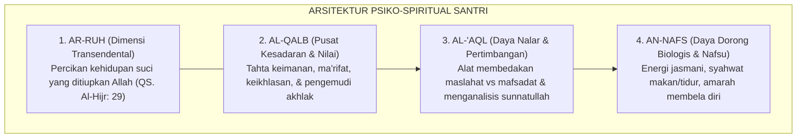
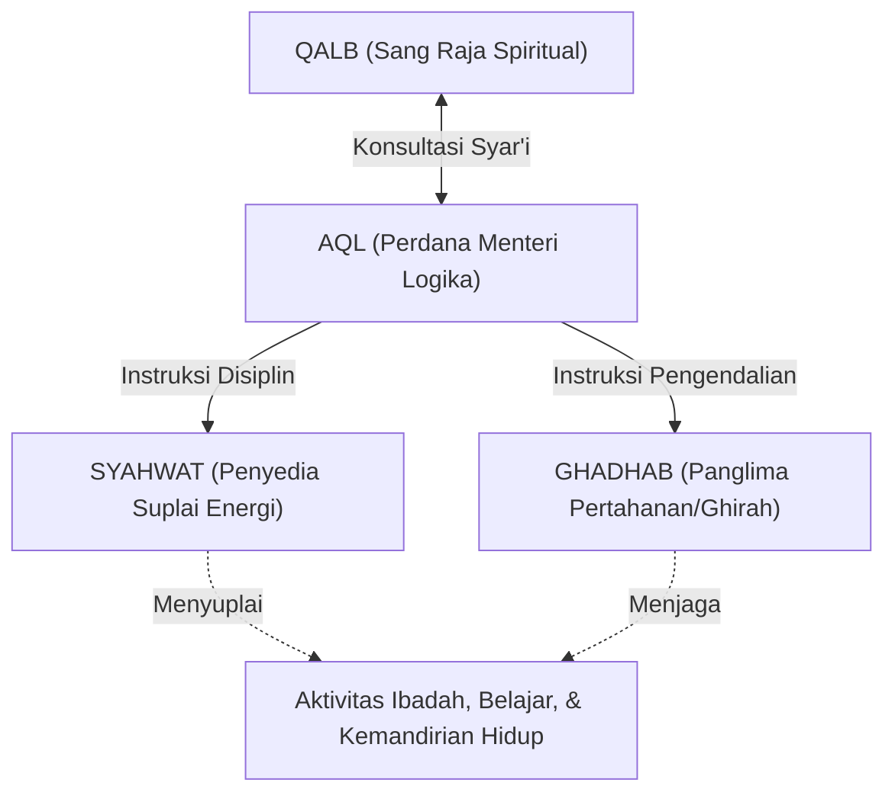

# P1-02-02: STRUKTUR DIRI INSANI: INTEGRASI NAFS, AQL, QALB, & RUH
## *Arsitektur Psiko-Spiritual Manusia dalam Khazanah Tasawuf Falsafi dan Sumbu Komunikasi Jantung-Otak Modern*

**Nomor Identifikasi**: `P1-02-02/STRUKTUR-INSANI/2026`  
**Domain**: `01 Philosophy` > `02 Human Nature`  
**Dewan Pakar**: `pakar-filosofi-tumbuh`, `pakar-epistemologi-turats`, `pakar-neurosains-perkembangan`

---

## 📑 DAFTAR ISI ANALITIS

1. [1. Pendahuluan: Kompleksitas Eksistensial Diri Manusia](#1-pendahuluan-kompleksitas-eksistensial-diri-manusia)
2. [2. Empat Dimensi Diri Insani dalam Turats Klasik](#2-empat-dimensi-diri-insani-dalam-turats-klasik)
3. [3. Dinamika Hubungan Antardaya: Tahta Qalb dan Pasukan Jiwa](#3-dinamika-hubungan-antardaya-tahta-qalb-dan-pasukan-jiwa)
4. [4. Konvergensi Neurosains Kognitif & Neurokardiologi Modern](#4-konvergensi-neurosains-kognitif--neurokardiologi-modern)
5. [5. Implikasi bagi Model Pengasuhan Asrama Pesantren 24-Jam](#5-implikasi-bagi-model-pengasuhan-asrama-pesantren-24-jam)
6. [6. Uji Kritis & Mitigasi Reduksionisme (Internal Critique)](#6-uji-kritis--mitigasi-reduksionisme-internal-critique)

---

### 1. Pendahuluan: Kompleksitas Eksistensial Diri Manusia

Pendidikan yang hanya menyasar aspek kognitif-intelektual semata hakikatnya adalah pendidikan yang cacat sejak dalam pikiran. Manusia bukanlah sekadar "komputer biologis berjalan" yang hanya membutuhkan transfer data logika, melainkan entitas kosmis ciptaan Allah yang memadukan unsur debu tanah materi (*Thien*) dengan hembusan ruh ilahi (*Nafkh ar-Ruh*).

Ekosistem TUMBUH memandang struktur diri santri sebagai sebuah **arsitektur psiko-spiritual holistik**. Keberhasilan penanaman adab bergantung secara mutlak pada kemampuan sistem pendidikan dalam menyeimbangkan, mendisiplinkan, dan mengharmonisasikan interaksi antara empat daya kejiwaan: **ar-Ruh, al-Qalb, al-'Aql, dan an-Nafs**.

---

### 2. Empat Dimensi Diri Insani dalam Turats Klasik

Para ulama *muhaqqiqin* seperti Hujjatul Islam Imam Al-Ghazali dalam *Ma'arij al-Quds fi Madarij Ma'rifat an-Nafs* dan *Ihya 'Ulumiddin* (Kitab *'Aja'ib al-Qalb*), serta Imam Fakhruddin ar-Razi dalam *Kitab an-Nafs war-Ruh*, merumuskan hakikat keempat dimensi ini:

#### A. Ar-Ruh (الرُّوحُ)
Ruh adalah substansi halus ilahiah (*Lathifah Ilahiyyah*) yang menjadi hakikat rahasia kehidupan manusia. Allah SWT berfirman:
> $$\text{وَيَسْأَلُونَكَ عَنِ الرُّوحِ ۖ قُلِ الرُّوحُ مِنْ أَمْرِ رَبِّي وَمَا أُوتِيتُم مِّنَ الْعِلْمِ إِلَّا قَلِيلًا}$$
> 
> *"Dan mereka bertanya kepadamu tentang ruh. Katakanlah: 'Ruh itu termasuk urusan Tuhanku, dan tidaklah kamu diberi pengetahuan melainkan sedikit.' "* (QS. Al-Isra' [17]: 85).
Ruh adalah sumber kerinduan abadi manusia kepada Sang Pencipta yang tidak akan pernah terpuaskan oleh kenikmatan materiil duniawi.

#### B. Al-Qalb (الْقَلْبُ)
Bukan sekadar segumpal daging fisik (*al-Lahm ash-Shanaubari*), melainkan pusat kesadaran spiritual dan pemegang komando moral kepribadian insan. Rasulullah SAW bersabda:
> $$\text{أَلَا وَإِنَّ فِي الْجَسَدِ مُضْغَةً إِذَا صَلَحَتْ صَلَحَ الْجَسَدُ كُلُّهُ وَإِذَا فَسَدَتْ فَسَدَ الْجَسَدُ كُلُّهُ أَلَا وَهِيَ الْقَلْبُ}$$
> 
> *"Ketahuilah, sesungguhnya di dalam tubuh ada segumpal darah; apabila ia baik, maka baiklah seluruh tubuh itu, dan apabila ia rusak, maka rusaklah seluruh tubuh itu. Ketahuilah, segumpal darah itu adalah Kalbu!"* (HR. Bukhari no. 52, Muslim no. 1599).

#### C. Al-'Aql (الْعَقْلُ)
Daya intelek dan persepsi rasional yang membedakan manusia dari binatang. Akal bertugas membedakan hak dan batil, menimbang kemaslahatan jangka panjang, dan memahami syariat. Namun, akal harus dipandu oleh wahyu; akal yang terputus dari bimbingan kalbu dapat tergelincir menjadi alat licik pembenaran kezaliman.

#### D. An-Nafs (النَّفْسُ)
Daya dorong biologis alamiah manusia yang memuat energi syahwat (*syahwatul bathn wal farj*) dan daya defensif amarah (*al-Quwwah al-Ghadhabiyyah*). Nafs adalah kendaraan raga manusia di alam dunia yang harus didisiplinkan melalui *Riyadhah* dan *Mujahadah*, bukan dibunuh.

---

### 3. Dinamika Hubungan Antardaya: Tahta Qalb dan Pasukan Jiwa

Imam Al-Ghazali melukiskan relasi internal ini dalam metafora sebuah negara yang berdaulat:

> $$\text{الْقَلْبُ مَلِكٌ مُطَاعٌ، وَالْعَقْلُ وَزِيرُهُ الْأَمِينُ، وَالشَّهْوَةُ وَالْغَضَبُ جُنُودُهُ وَأَتْبَاعُهُ. فَإِذَا اسْتَقَامَ الْمَلِكُ بِعَدْلِ الْوَزِيرِ وَانْقَادَ الْجُنُودُ لِأَمْرِهِمَا، حَصَلَتِ السَّعَادَةُ وَاسْتَقَامَتِ الْمَمْلَكَةُ}$$
> 
> *"Kalbu adalah raja yang ditaati, akal adalah perdana menteri yang terpercaya, serta syahwat dan amarah adalah bala tentara dan pengikutnya. Tatkala sang raja memimpin dengan keadilan sang perdana menteri, dan seluruh prajurit tunduk patuh pada perintah keduanya, niscaya tercapailah kebahagiaan sejati dan tegaklah keadilan di seluruh negeri jiwa."*

---

### 4. Konvergensi Neurosains Kognitif & Neurokardiologi Modern

Pemetaan klasik para ulama salaf ini menemukan konvergensi empiris yang menakjubkan dalam sains kontemporer:

1. **Neurokardiologi Klinis (*The Heart's Brain*)**:  
   Dr. J. Andrew Armour (1991) dalam *Neurocardiology* menemukan adanya sistem saraf jantung intrinsik (*intrinsic cardiac nervous system*) yang beroperasi sebagai "otak kecil di dalam jantung". Jantung mengirimkan jutaan sinyal aferen setiap menit melalui saraf vagus menuju pusat-pusat emosi dan logika di otak (amigdala, talamus, dan korteks prefrontal).
2. **Koherensi Jantung-Otak (*HeartMath Institute*, McCraty et al., 2009)**:  
   Ketika seorang santri melakukan dzikir, shalat dengan khusyuk, dan menata niat ikhlas (*keadaan Qalb Salim*), ritme variabilitas detak jantung (*HRV*) mengalami sinkronisasi gelombang koheren. Kondisi koheren ini secara instan memfasilitasi optimalisasi *Dorsolateral Prefrontal Cortex* (dlPFC), meningkatkan konsentrasi belajar, dan meredakan impuls agresi sistem limbik.
3. **Integrasi Korteks Prefrontal (PFC) & Sistem Limbik**:  
   Daya *Aql* terpetakan pada fungsi eksekutif korteks prefrontal, sementara daya *Nafs* terpetakan pada struktur subkortikal limbik dan batang otak (*Hypothalamus & Amygdala*). Pembiasaan adab (*Ta'dib*) adalah proses biologis penguatan jalur saraf inhibisi dari PFC ke amigdala (*Top-Down Neuro-Regulation*).

---

### 5. Implikasi bagi Model Pengasuhan Asrama Pesantren 24-Jam

1. **Pengasuhan Menyeluruh Tanpa Reduksi**:  
   Pesantren tidak boleh hanya mengurusi hafalan santri (*Aql*) sembari membiarkan kondisi fisik santri kurang gizi dan kurang tidur (*Nafs*), atau mengabaikan kebutuhan dzikir dan kedekatan dengan Allah (*Qalb & Ruh*).
2. **Harmonisasi Ritme 24 Jam**:  
   Jadwal harian diatur berimbang: waktu halaqah ilmu (asupan *Aql*), waktu shalat berjamaah dan wirid (asupan *Qalb & Ruh*), serta waktu makan bergizi, olahraga sunnah, dan tidur 6 jam penuh (penjagaan *Nafs & Raga*).
3. **Penyelarasan Niat di Setiap Aktivitas**:  
   Musyrif membiasakan santri untuk mengubah rutinitas biologis nafs (seperti makan, mandi, dan tidur) menjadi ibadah bernilai ruhani melalui pengikatan niat lillahi ta'ala (*Tashihun Niyyah*).

---

### 6. Uji Kritis & Mitigasi Reduksionisme (Internal Critique)

* **Bahaya Mistisisme Ekstrem**: Ada kecenderungan sebagian kalangan sufi ekstrem untuk menyiksa tubuh fisik (*mortifikasi raga*) dengan mengurangi makan dan tidur secara tidak proporsional.
* **Koreksi Ilmiah TUMBUH**: Islam melarang keras penyiksaan diri (*La dharara wa la dhirar*). Raga santri memiliki hak biologis yang wajib ditunaikan. Menjaga kebugaran jasmani adalah bagian dari memuliakan amanah Allah SWT (*Qowiyyul Jismi*).
