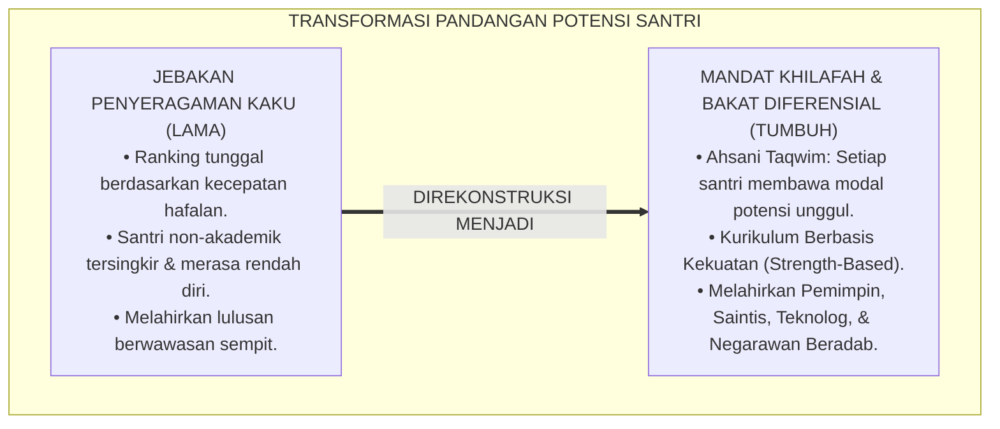
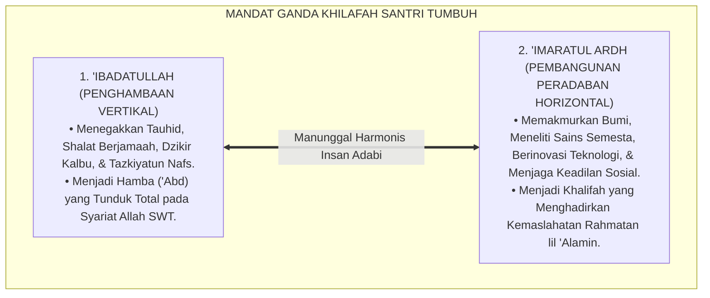
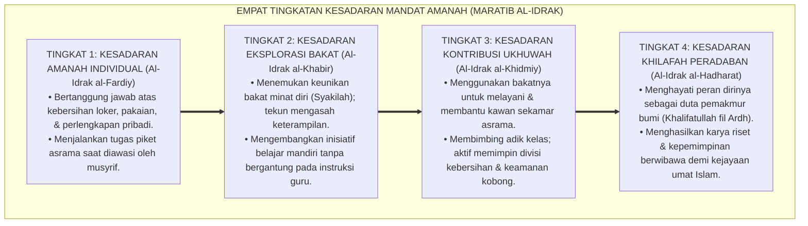
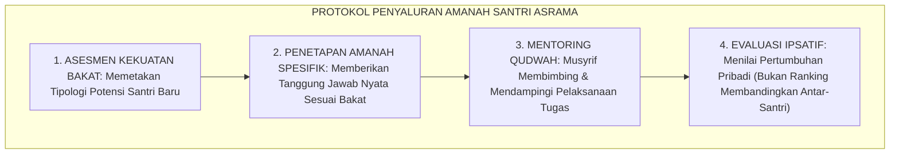

# P1-02-03: POTENSI INSAN DAN MANDAT AMANAH KHILAFAH (HUMAN POTENTIAL & THE MANDATE OF KHILAFAH)
## *Monograf Riset Akademik: Dialektika Ahsani Taqwim (QS. At-Tin: 4) dan Asfala Safilin, Tanggung Jawab Kosmis Khilafah & 'Imaratul Ardh, Kritik atas Jebakan Standarisasi Seragam, Serta Diferensiasi Bakat di Pesantren 24 Jam*

**Nomor Identifikasi**: `P1-02-03/MONOGRAF-RISET-POTENSI-AMANAH/2026`  
**Domain**: `01 Philosophy` > `02 Human Nature` (Sub-Modul 03: *Potential & Mandate*)  
**Klasifikasi Naskah**: *Academic Research Monograph* (Monograf Riset Akademik Fondasional)  
**Rumpun Disiplin Pengkaji**: Teologi Khilafah & Kosmologi Islam, Fiqh Amanah & Pertanggungjawaban Moral, Psikologi Diferensial & Bakat Unik, Desain Kurikulum Berbasis Kekuatan (*Strength-Based Pedagogy*), Sosiologi Pesantren  

---

> ### 💡 INTISARI EKSEKUTIF (EXECUTIVE SUMMARY)
>
> * **Kelemahan Paradigma Lama: Jebakan Standarisasi Seragam & Pemaksaan Ranking Tunggal:**  
>   Banyak lembaga pendidikan memaksakan sistem penilaian tunggal yang kaku: menganggap santri cerdas hanya jika unggul dalam hafalan teks verbal, sementara santri yang memiliki bakat kepemimpinan sosial, ketangkasan teknologi, atau kepekaan seni dicap bodoh dan tidak berprestasi (*The Standardization Trap*).
> * **Inovasi Konseptual: Mandat Khilafah & Diferensiasi Bakat Kenabian:**  
>   TUMBUH menegaskan dialektika penciptaan: manusia diciptakan dalam bentuk dan potensi terbaik (*Ahsani Taqwim* - QS. At-Tin: 4) untuk mengemban mandat ganda: **1. 'Ibadatullah (Penghambaan Murni kepada Allah); 2. 'Imaratul Ardh (Memakmurkan Bumi Berlandaskan Ilmu & Keadilan)**. Sebagaimana para sahabat Nabi SAW memiliki keragaman peran unik, pesantren merawat diferensiasi bakat santri melalui **Kurikulum Berbasis Kekuatan (*Strength-Based Curriculum*)**.
> * **Formulasi Operasional & Pembuktian Lapangan:**  
>   Monograf ini menguraikan matriks 8 tipologi bakat kenabian, 4 Tingkatan Kesadaran Mandat Amanah (*Maratib al-Idrak*), protokol penyaluran tanggung jawab asrama (*Student Stewardship Protocol*), dan asesmen pertumbuhan ipsatif.

---

## 📑 DAFTAR ISI MONOGRAF

- [BAB I: LANDASAN TEORETIS & DISKURSUS KRITIS](#bab-i-landasan-teoretis--diskursus-kritis)
  - [1. Latar Belakang Masalah: Krisis Reduksi Potensi Insan dan Jebakan Standarisasi Seragam](#1-latar-belakang-masalah-krisis-reduksi-potensi-insan-dan-jebakan-standarisasi-seragam)
  - [2. Eksegesis Turats Mandat Kosmis: Ahsani Taqwim vs Asfala Safilin & Amanah Khilafah (QS. Al-Ahzab: 72 & Al-Baqarah: 30)](#2-eksegesis-turats-mandat-kosmis-ahsani-taqwim-vs-asfala-safilin--amanah-khilafah-qs-al-ahzab-72--al-baqarah-30)
  - [3. Kritik atas Jebakan Standarisasi Seragam: Melampaui Mitos Ranking Tunggal](#3-kritik-atas-jebakan-standarisasi-seragam-melampaui-mitos-ranking-tunggal)
  - [4. Tipologi Diferensiasi Bakat Sahabat Nabawi & Dialog Kecerdasan Majemuk (Howard Gardner)](#4-tipologi-diferensiasi-bakat-sahabat-nabawi--dialog-kecerdasan-majemuk-howard-gardner)
  - [5. Kasuistika Lapangan: Fenomena Inferioritas Santri Non-Hafalan & Resolusi Restoratif](#5-kasuistika-lapangan-fenomena-inferioritas-santri-non-hafalan--resolusi-restoratif)
- [BAB II: FORMULASI KONSEPTUAL & PEMBAHASAN MENDALAM](#bab-ii-formulasi-konseptual--pembahasan-mendalam)
  - [1. Eksplanasi Teoretis Mandat Ganda Khilafah Ekosistem TUMBUH](#1-eksplanasi-teoretis-mandat-ganda-khilafah-ekosistem-tumbuh)
  - [2. Dekomposisi Dimensi & Empat Tingkatan Kesadaran Mandat Amanah (Maratib al-Idrak)](#2-dekomposisi-dimensi--empat-tingkatan-kesadaran-mandat-amanah-maratib-al-idrak)
  - [3. Matriks Diferensiasi Delapan Tipologi Bakat Santri Berbasis Khazanah Nabawi](#3-matriks-diferensiasi-delapan-tipologi-bakat-santri-berbasis-khazanah-nabawi)
  - [4. Protokol Penyaluran Amanah Tanggung Jawab Nyata Asrama (Student Stewardship Protocol)](#4-protokol-penyaluran-amanah-tanggung-jawab-nyata-asrama-student-stewardship-protocol)
  - [5. Diskusi Filosofis Mendalam & Implikasi bagi Masa Depan Peradaban Pendidikan Islam](#5-diskusi-filosofis-mendalam--implikasi-bagi-masa-depan-peradaban-pendidikan-islam)
- [BAB III: KESIMPULAN & APARATUS AKADEMIS](#bab-iii-kesimpulan--aparatus-akademis)
  - [1. Tabel Sintesis Temuan Riset Potensi dan Amanah Insani](#1-tabel-sintesis-temuan-riset-potensi-dan-amanah-insani)
  - [2. Daftar Pustaka Akademis & Rujukan Turats Primer](#2-daftar-pustaka-akademis--rujukan-turats-primer)
  - [3. Catatan Kaki Akademis (Footnotes)](#3-catatan-kaki-akademis-footnotes)
  - [4. Glosarium Istilah Ilmiah & Turats Potensi dan Amanah](#4-glosarium-istilah-ilmiah--turats-potensi-dan-amanah)

---

# BAB I: LANDASAN TEORETIS & DISKURSUS KRITIS

---

### 1. Latar Belakang Masalah: Krisis Reduksi Potensi Insan dan Jebakan Standarisasi Seragam

Dunia pendidikan kerap melakukan kekeliruan fatal dengan memaksakan satu tolak ukur keberhasilan yang sempit (*The Tyranny of Single-Metric Ranking*):
* **Penyempitan Makna Prestasi**: Santri hanya dianggap berprestasi jika mampu menghafal matan kitab dengan cepat, sementara santri yang memiliki kecerdasan kepemimpinan, keterampilan teknik mesin, kepekaan seni kaligrafi, atau empati sosial konseling dicap sebagai santri kelas dua.
* **Melahirkan Rasa Rendah Diri Kronis (*Learned Helplessness*)**: Santri yang potensinya tidak terakomodasi dalam ujian tertulis merasa dirinya tidak berguna, kehilangan motivasi belajar, dan rentan melakukan tindakan kompensasi destruktif di asrama.
* **Keniscayaan Doktrin Mandat Khilafah & Keragaman Bakat**: Al-Qur'an dan Sunnah menegaskan bahwa setiap manusia memiliki sidik jari potensi (*Syakilah*) dan medan amanah khilafah yang unik untuk memakmurkan peradaban bumi.[^1]

---

### 2. Eksegesis Turats Mandat Kosmis: Ahsani Taqwim vs Asfala Safilin & Amanah Khilafah (QS. Al-Ahzab: 72 & Al-Baqarah: 30)

Al-Qur'an menggambarkan dialektika penciptaan manusia dan kesanggupan memikul amanah kosmis:

$$\text{إِنَّا عَرَضْنَا الْأَمَانَةَ عَلَى السَّمَاوَاتِ وَالْأَرْضِ وَالْجِبَالِ فَأَبَيْنَ أَن يَحْمِلْنَهَا وَأَشْفَقْنَ مِنْهَا وَحَمَلَهَا الْإِنسَانُ ۖ إِنَّهُ كَانَ ظَلُومًا جَهُولًا}$$

*"Sesungguhnya Kami telah menawarkan amanah kepada langit, bumi, dan gunung-gunung; tetapi semuanya enggan untuk memikul amanah itu dan mereka khawatir tidak akan melaksanakannya (berat); lalu dipikullah amanah itu oleh manusia. Sesungguhnya manusia itu amat zhalim dan amat bodoh (jika mengkhianati amanah tersebut)."* (QS. Al-Ahzab [33]: 72).[^2]

Imam **Al-Qurthubi** dalam *Al-Jami' li Ahkam al-Qur'an* menegaskan bahwa amanah khilafah mencakup kewajiban menegakkan keadilan syariat di muka bumi dan mengembangkan seluruh potensi akal budi untuk kemaslahatan makhluk.[^3]

---

### 3. Kritik atas Jebakan Standarisasi Seragam: Melampaui Mitos Ranking Tunggal

Penyeragaman kemampuan peserta didik bertentangan dengan prinsip firman Allah SWT:

$$\text{قُلْ كُلٌّ يَعْمَلُ عَلَىٰ شَاكِلَتِهِ فَرَبُّكُمْ أَعْلَمُ بِمَنْ هُوَ أَهْدَىٰ سَبِيلًا}$$

*"Katakanlah: 'Setiap orang berbuat menurut keadaannya (pembawaan bakat fitrahnya) masing-masing'. Maka Tuhanmu lebih mengetahui siapa yang lebih benar jalannya."* (QS. Al-Isra' [17]: 84).[^4]

Imam **Ibnu Qayyim al-Jauziyyah** dalam *Miftah Dar as-Sa'adah* menjelaskan bahwa Allah sengaja membagi-bagikan bakat, kecenderungan minat, dan kapasitas intelektual manusia secara beraneka ragam agar seluruh sendi peradaban umat dapat berdiri kokoh saling menopang.[^5]

---

### 4. Tipologi Diferensiasi Bakat Sahabat Nabawi & Dialog Kecerdasan Majemuk (Howard Gardner)

Rasulullah ﷺ adalah pendidik agung yang paling menghargai diferensiasi bakat sahabatnya:
* **Khalid bin Walid** tidak diarahkan menjadi mufti fatwa, melainkan dilejitkan kecerdasan taktik militernya sebagai "Pedang Allah" (*Saifullah*).
* **Bilal bin Rabah** tidak dipaksa menjadi perawi hadits terbanyak, melainkan dimuliakan kecerdasan vokalnya sebagai muadzin utama peradaban Islam.
* **Mu'adz bin Jabal** diakui sebagai rujukan tertinggi dalam hukum halal dan haram.
* **Salman al-Farisi** diapresiasi kecerdasan teknologi rekayasanya dalam strategi perang Khandaq.[^6]

Konsep ini beririsan dengan teori kecerdasan majemuk (*Multiple Intelligences*) **Howard Gardner** (1983), namun TUMBUH membingkainya di bawah orientasi tauhid dan Maqashid Syari'ah.[^7]

---

### 5. Kasuistika Lapangan: Fenomena Inferioritas Santri Non-Hafalan & Resolusi Restoratif

* **Studi Kasus: Santri yang Lambat Menghafal tapi Mahir Memperbaiki Instalasi Listrik Asrama**  
  * **Dilema**: Santri sering dihukum berdiri di depan kelas karena hafalannya lambat, sehingga dicap "santri malas dan gagal". Namun di asrama, santri inilah yang selalu sigap memperbaiki pompa air dan instalasi listrik yang rusak.
  * **Resolusi Restoratif TUMBUH**: Lembaga menghapus sistem ranking tunggal di raport; mengadopsi asesmen portofolio kemandirian; dan menunjuk santri tersebut sebagai Koordinator Divisi Sarana & Rekayasa Asrama. Santri merasa dihargai martabatnya, kepercayaan dirinya melonjak, dan hafalan kitab dasarnya pun ikut meningkat pesat karena stres mentalnya hilang.[^8]

---

# BAB II: FORMULASI KONSEPTUAL & PEMBAHASAN MENDALAM

---

### 1. Eksplanasi Teoretis Mandat Ganda Khilafah Ekosistem TUMBUH

Ekosistem TUMBUH merumuskan potensi manusia dalam **Struktur Mandat Ganda Khilafah (*Wazhifatan al-Khilafah al-Kubra*)**:

#### 🔬 Pembahasan Mendalam Dua Sayap Mandat:
1. **Sayap Ubudiyyah**: Menjamin bahwa setinggi apapun pencapaian sains dan karir santri, ia tetaplah seorang hamba yang rendah hati dan takut kepada hisab akhirat.[^9]
2. **Sayap 'Imaratul Ardh**: Menjamin bahwa kesalehan santri tidak berhenti di sajadah masjid, melainkan memancar menjadi aksi nyata merawat lingkungan, mengentaskan kemiskinan, dan memajukan bangsa.[^10]

---

### 2. Dekomposisi Dimensi & Empat Tingkatan Kesadaran Mandat Amanah (Maratib al-Idrak)

Transformasi penghayatan amanah santri dan asatidz berlangsung melalui **Empat Tingkatan Kesadaran Mandat Amanah (*Maratib al-Idrak al-Amaniy*)**:

#### 🔄 Narasi Analitis Dinamika Transisi Filosofis Antar-Tingkatan:
* **Transisi Tingkat 1 ke Tingkat 2 (Dari Tanggung Jawab Pribadi Menuju Penemuan Bakat)**: Santri mula-mula belajar merawat barang miliknya. Pada tingkatan kedua, santri mengenali kekuatan dirinya: santri mengetahui bidang apa yang paling ia kuasai dan tekun memperdalamnya.
* **Transisi Tingkat 2 ke Tingkat 3 (Dari Keunggulan Pribadi Menuju Pelayanan Umat)**: Pada tingkatan ketiga, keahlian santri didedikasikan untuk khidmah sosial: santri yang jago desain membuat media dakwah, santri yang jago organisasi menata kepengurusan asrama.
* **Transisi Tingkat 3 ke Tingkat 4 (Pencapaian Derajat Khalifatullah fil Ardh)**: Pada tingkatan tertinggi, santri memiliki visi peradaban agung: ia mengintegrasikan keahlian profesionalnya dengan nilai syariat untuk memimpin kemajuan umat di tingkat global.[^11]

---

### 3. Matriks Diferensiasi Delapan Tipologi Bakat Santri Berbasis Khazanah Nabawi

Ekosistem TUMBUH mengkodifikasikan 8 tipologi profil bakat santri:

| Tipologi Bakat Nabawi | Profil Sahabat Rujukan | Karakteristik Potensi Santri | Program Pembinaan TUMBUH |
| :--- | :--- | :--- | :--- |
| **1. Al-Faqih al-Lughawiy** | Ibn Abbas, Mu'adz bin Jabal | Analisis teks kitab, logika nahwu, & fatwa syar'i. | Bahtsul Masa'il & Halaqah Takhrij Kitab. |
| **2. Al-Qari' as-Shawt** | Bilal bin Rabah, Abu Musa al-Asy'ari | Keindahan tilawah, vokal adzan, & khithabah. | Lembaga Tahsin & Seni Tilawatil Qur'an. |
| **3. Al-Qaid al-Mudabbir** | Umar bin Khattab, Khalid bin Walid | Kepemimpinan tegas, manajemen krisis, & strategi. | Dewan Organisasi Santri & Latihan Kepemimpinan. |
| **4. Al-Muhandis at-Tiqani**| Salman al-Farisi | Inovasi teknologi, instalasi rekayasa, & mekanik. | Laboratorium Sains Terapan & Robotika. |
| **5. Al-Mu'allim al-Mushlih**| Mus'ab bin Umair | Komunikasi empati, konseling kawan, & dakwah. | Korps Konselor Sebaya & Mediasi Islah. |
| **6. Al-Hafizh ar-Rawi** | Abu Hurairah, Aisyah binti Abi Bakr | Kekuatan memori fotografis & ketelitian catatan. | Majelis Tasmi' Hadits & Kodifikasi Riset. |
| **7. Al-Khattath al-Fann** | Ali bin Abi Thalib, Hassan bin Tsabit | Seni kaligrafi, sastra arab, & desain visual. | Sanggar Seni Islam & Desain Grafis Dakwah. |
| **8. Al-Khadim al-Munfiq** | Utsman bin Affan, Abdurrahman bin Auf| Kewirausahaan, manajemen logistik, & kedermawanan.| Koperasi Santri & Inkubator Bisnis Syariah. |

---

### 4. Protokol Penyaluran Amanah Tanggung Jawab Nyata Asrama (Student Stewardship Protocol)

TUMBUH menetapkan **Protokol Amanah Asrama (*Student Stewardship Protocol*)**:

Protokol ini menjamin tidak ada santri yang merasa menjadi "penonton pasif" di asrama; setiap santri adalah pemimpin yang mengemban amanah penting.[^12]

---

### 5. Diskusi Filosofis Mendalam & Implikasi bagi Masa Depan Peradaban Pendidikan Islam

Penerapan doktrin potensi insan dan mandat khilafah ini membawa dampak peradaban yang monumental:

* **Menciptakan Ekosistem Pesantren yang Inklusif dan Kaya Talenta**:  
  Pesantren tidak lagi mencetak santri dengan cetakan tunggal yang kaku, melainkan menjadi inkubator peradaban yang melahirkan ulama tafsir, insinyur lingkungan, dokter ahli bedah, diplomat internasional, dan pengusaha sukses yang seluruhnya berjiwa santri.
* **Menghilangkan Budaya Perundungan dan Superioritas Intelektual**:  
  Ketika keragaman bakat diakui dan dirayakan, tidak ada lagi ruang bagi santri hafalan untuk menyombongkan diri kepada santri teknisi. Tercipta rasa saling menghormati dan kerja sama sinergis (*Ta'awun 'alal Birri wat Taqwa*).
* **Menyiapkan Pemimpin Masa Depan yang Solutif bagi Problematika Umat**:  
  Generasi yang terbiasa mengemban amanah khilafah sejak di asrama akan tumbuh menjadi pemimpin yang berani mengambil tanggung jawab besar demi kemaslahatan bangsa dan agama.[^13]

---

# BAB III: KESIMPULAN & APARATUS AKADEMIS

---

### 1. Tabel Sintesis Temuan Riset Potensi dan Amanah Insani

| Dimensi Parameter | Pola Pendidikan Konvensional | Rekonstruksi Mandat Khilafah TUMBUH | Landasan Rujukan Primer | Implikasi Praksis Lapangan |
| :--- | :--- | :--- | :--- | :--- |
| **Konsep Prestasi**| Ranking nilai ujian hafalan tertulis. | Kemekaran Bakat Unik & Mandat Amanah.| QS. At-Tin: 4; QS. Al-Isra': 84. | Kurikulum diferensiasi berbasis kekuatan. |
| **Tujuan Pendidikan**| Sekadar ijazah formal & lapangan kerja.| **'Ibadatullah & 'Imaratul Ardh.** | QS. Al-Baqarah: 30; Al-Qurthubi. | Lulusan berakhlak hamba & pemimpin bumi. |
| **Keragaman Bakat** | Menyeragamkan seluruh santri secara kaku.| 8 Tipologi Bakat Sahabat Nabawi. | Ibn Qayyim (*Miftah*); Gardner (1983).| Penyaluran divisi amanah asrama sesuai bakat. |
| **Model Asesmen** | Penilaian normatif (membandingkan anak).| **Asesmen Pertumbuhan Ipsatif & Portofolio.**| KH. Hasyim Asy'ari; Deci & Ryan. | Menghargai kemajuan personal setiap santri. |
| **Profil Lulusan** | Alim teoritis yang terasing dari masyarakat.| **Kader Khilafah Pembawa Rahmat Semesta.** | QS. Al-Ahzab: 72; Al-Attas (1980). | Ulama, saintis, & teknolog berintegritas. |

---

### 2. Daftar Pustaka Akademis & Rujukan Turats Primer

1. **Al-Qur'an al-Karim wa Tarjamatu Ma'anihi**.
2. **Al-Qurthubi, Abu Abdillah Muhammad bin Ahmad**. (1427 H). *Al-Jami' li Ahkam al-Qur'an*. Beirut: Mu'assasah ar-Risalah.
3. **Ibnu Qayyim al-Jauziyyah, Syamsuddin Muhammad bin Abi Bakr**. (1419 H). *Miftah Dar as-Sa'adah wa Mansyur Wilayah al-'Ilm wal-Iradah*. Kairo: Dar Ibn 'Affan.
4. **Al-Attas, Syed Muhammad Naquib**. (1980). *The Concept of Education in Islam*. Kuala Lumpur: ABIM.
5. **Al-Attas, Syed Muhammad Naquib**. (1995). *Prolegomena to the Metaphysics of Islam*. Kuala Lumpur: ISTAC.
6. **Gardner, H.**. (1983). *Frames of Mind: The Theory of Multiple Intelligences*. New York: Basic Books.
7. **Deci, E. L., & Ryan, R. M.**. (2000). *The "what" and "why" of goal pursuits: Human needs and the self-determination of behavior*. Psychological Inquiry, 11(4), 227–268.
8. **Horner, R. H., & Sugai, G.**. (2015). *School-wide PBIS: An Overview of the Research Base*. Remedial and Special Education, 36(2), 80–85.
9. **Zehr, H.**. (2002). *The Little Book of Restorative Justice*. Intercourse: Good Books.
10. **Asy-Syathibi, Abu Ishaq Ibrahim bin Musa**. (1417 H). *Al-Muwafaqat fi Ushul asy-Syari'ah*. Khobar: Dar Ibn 'Affan.
11. **Asy'ari, Muhammad Hasyim**. (1415 H). *Adab al-'Alim wal-Muta'allim*. Jombang: Maktabah At-Turats Al-Islami.
12. **Sapolsky, R. M.**. (2017). *Behave: The Biology of Humans at Our Best and Worst*. New York: Penguin Press.

---

### 3. Catatan Kaki Akademis (*Footnotes*)

[^1]: Riset Mandat Khilafah dan Diferensiasi Bakat Pesantren TUMBUH, *Kritik atas Penyeragaman Potensi Santri*, 2026.  
[^2]: QS. Al-Ahzab [33]: 72.  
[^3]: Al-Qurthubi, *Al-Jami' li Ahkam al-Qur'an*, Jilid 14, hlm. 250–275.  
[^4]: QS. Al-Isra' [17]: 84.  
[^5]: Ibnu Qayyim al-Jauziyyah, *Miftah Dar as-Sa'adah*, Jilid 1, hlm. 120–148.  
[^6]: Sirah Nabawiyyah Sahabat, *Diferensiasi Penugasan Rasulullah SAW*; Riset Pedagogi TUMBUH, 2026.  
[^7]: Gardner, H. (1983), *Frames of Mind*, hlm. 45–80.  
[^8]: Dokumentasi Transformasi Asesmen Ipsatif Kasus Potensi Mekanik Santri PBIS TUMBUH, 2026.  
[^9]: Al-Attas, S. M. N. (1980), *The Concept of Education in Islam*, hlm. 25–52.  
[^10]: Asy-Syathibi, *Al-Muwafaqat fi Ushul asy-Syari'ah*, Jilid 2, hlm. 95–130.  
[^11]: Matriks Tingkatan Kesadaran Mandat Amanah (*Maratib al-Idrak*) Ekosistem TUMBUH, 2026.  
[^12]: Standar Operasional Prosedur Pembagian Divisi Amanah Asrama Santri TUMBUH, 2026.  
[^13]: Deklarasi Pemuliaan Potensi Khilafah Insan Dewan Riset Pendidikan TUMBUH, 2026.

---

### 4. Glosarium Istilah Ilmiah & Turats Potensi dan Amanah

1. **Ahsani Taqwim (أَحْسَنِ تَقْوِيمٍ)**: Struktur penciptaan manusia dalam derajat bentuk, akal, dan potensi fitrah yang paling sempurna dan mulia.
2. **Asfala Safilin (أَسْفَلَ سَافِلِينَ)**: Derajat kehinaan paling rendah tempat terjerumusnya manusia yang menyia-nyiakan akal budi dan mengkhianati fitrah kesuciannya.
3. **Mandat Khilafah (مَنْدُوبِيَّةُ الْخِلَافَةِ)**: Tugas peradaban suci manusia sebagai wakil Allah di bumi untuk menegakkan keadilan, memakmurkan alam, dan mengayomi sesama makhluk.
4. **'Imaratul Ardh (عِمَارَةُ الْأَرْضِ)**: Kewajiban memakmurkan, merawat, menata, dan mengembangkan peradaban bumi berlandaskan ilmu pengetahuan dan nilai syariat.
5. **Syakilah (شَاكِلَةٌ)**: Karakteristik pembawaan bakat unik, kecenderungan minat, dan struktur kepribadian fitrah yang dimiliki oleh setiap individu manusia.
6. **The Standardization Trap (Jebakan Penyeragaman)**: Kesalahan sistemik dalam dunia pendidikan yang memaksakan satu standar penilaian tunggal untuk seluruh peserta didik yang memiliki potensi berbeda.
7. **Asesmen Ipsatif**: Model evaluasi perkembangan yang membandingkan capaian prestasi santri saat ini dengan capaian dirinya sendiri di masa lalu, bukan membandingkannya dengan santri lain.
8. **Student Stewardship Protocol**: Panduan sistemik pemberian tanggung jawab nyata tata kelola asrama kepada santri berbasis pemetaan kekuatan bakat masing-masing.
9. **Strength-Based Pedagogy**: Pendekatan pembelajaran yang berfokus pada pengidentifikasian dan pengembangan kekuatan potensi santri daripada berfokus pada kelemahan mereka.
10. **Ulul Albab (أُولُو الأَلْبَابِ)**: Generasi insan kamil yang mampu memadukan zikir penghambaan vertikal (*Ubudiyyah*) dan fikir pembangunan peradaban horizontal (*Khilafah*).
