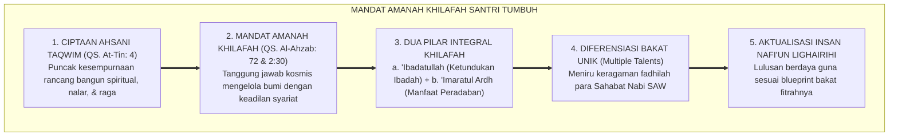
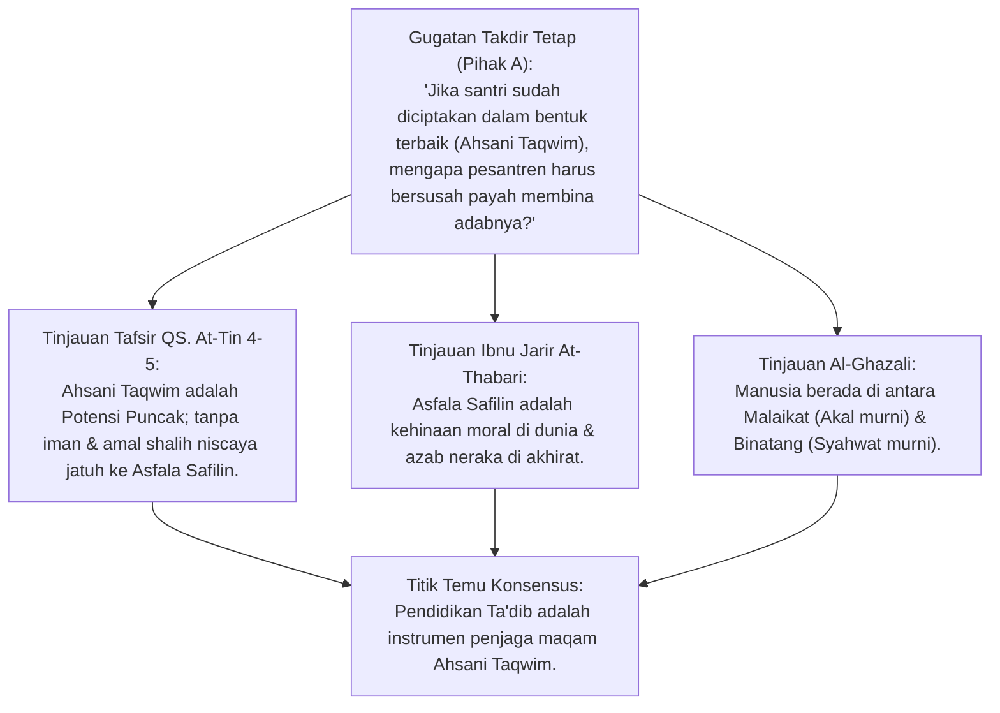
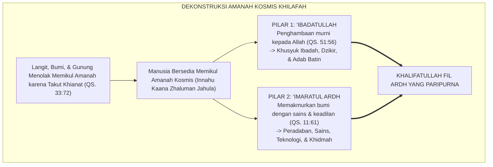
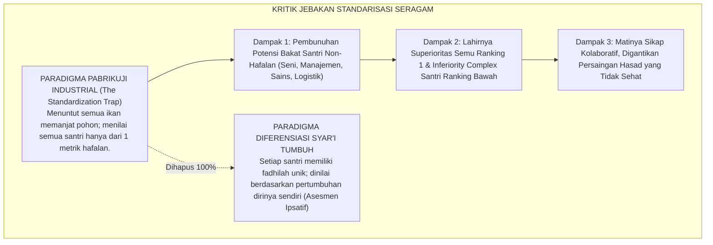
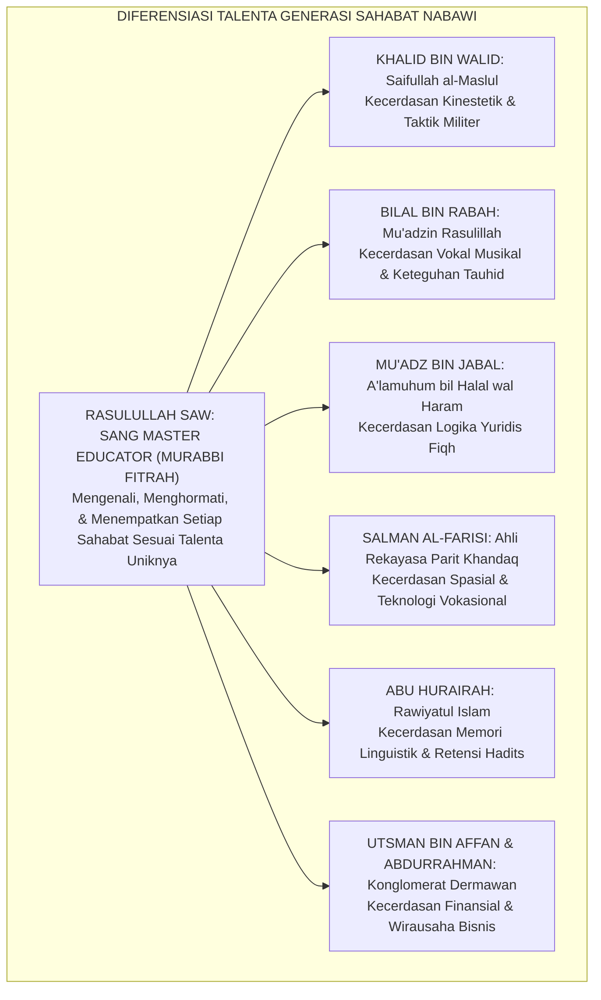
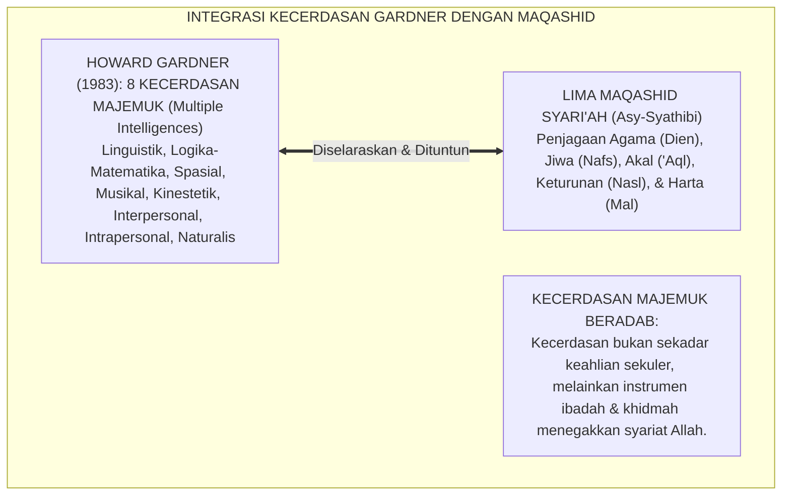
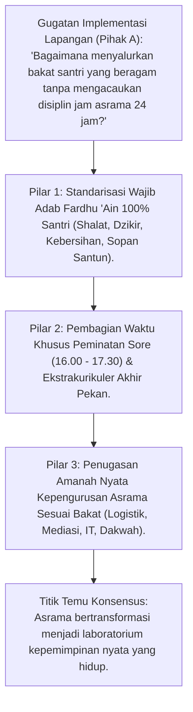
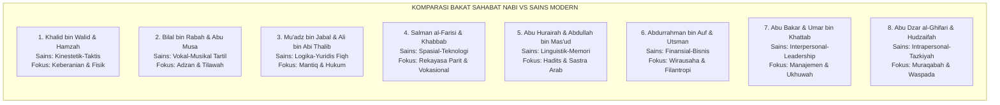
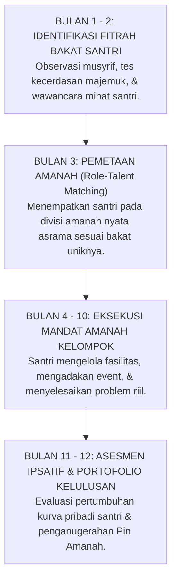

# P1-02-03: POTENSI INSAN DAN MANDAT AMANAH KHILAFAH
## *Monograf Terpadu: Dialektika Ahsani Taqwim (QS. At-Tin: 4) vs Asfala Safilin, Tanggung Jawab Kosmis Khilafah & 'Imaratul Ardh, Kritik atas Jebakan Standarisasi Seragam, serta Diferensiasi Bakat Sahabat Nabawi*

**Nomor Identifikasi**: `P1-02-03/MONOGRAF-TERPADU-POTENSI-AMANAH/2026`  
**Domain**: `01 Philosophy` > `02 Human Nature`  
**Klasifikasi Naskah**: *Comprehensive Integrated Monograph* (Monograf Akademis & Rumusan Baku Terpadu)  
**Rumpun Disiplin Pengkaji**: Teologi Khilafah & Kosmologi Islam, Fiqh Amanah & Pertanggungjawaban Moral, Psikologi Diferensial & Bakat Unik (*Multiple Intelligences*), Desain Kurikulum Berbasis Kekuatan (*Strength-Based Pedagogy*), Sosiologi Pesantren  

---

> ### 💡 INTISARI PRAKTIS (3 MENIT PAHAM UNTUK ASATIDZ & MUSYRIF)
>
> * **Kemuliaan Tertinggi & Bahaya Kejatuhan:**  
>   Santri diciptakan dalam bentuk dan potensi terbaik (*Ahsani Taqwim*, QS. At-Tin: 4). Namun jika hawa nafsunya dibiarkan liar, ia bisa jatuh ke derajat yang lebih hina dari binatang (*Asfala Safilin*, QS. At-Tin: 5). Pesantren adalah benteng penjaga kemuliaan tersebut.
> * **Mandat Khilafah: Dua Tugas Agung Santri di Muka Bumi:**  
>   1. **'Ibadatullah**: Menghambakan diri secara ikhlas kepada Allah (Shalat, Dzikir, Adab).  
>   2. **'Imaratul Ardh**: Memakmurkan bumi dan memberi manfaat seluas-luasnya bagi umat (*Nafi'un Lighairihi*).
> * **Setiap Santri Memiliki Sidik Jari Bakat yang Berbeda!**  
>   Jangan menyamaratakan seluruh santri hanya pada kepintaran menghafal matan kitab. Sahabat Nabi SAW memiliki keunikan berbeda: Khalid unggul di strategi perang, Bilal di suara adzan, Mu'adz di hukum fiqh, dan Salman di rekayasa teknologi parit. Hormati bakat unik setiap santri melalui **Kurikulum Berbasis Kekuatan (*Strength-Based Curriculum*)**!

---

## 📑 DAFTAR ISI MONOGRAF

- [BAGIAN I: RISET POTENSI & AMANAH, DIALEKTIKA INKUIRI, & KASUISTIKA LAPANGAN](#bagian-i-riset-potensi--amanah-dialektika-inkuiri--kasuistika-lapangan)
  - [1. Kerangka Metodologi Teologi Mandat Khilafah](#1-kerangka-metodologi-teologi-mandat-khilafah)
  - [2. Inkuiri 1: Eksegesis Ahsani Taqwim (QS. At-Tin: 4) & Dialektika Ancaman Asfala Safilin](#2-inkuiri-1-eksegesis-ahsani-taqwim-qs-at-tin-4--dialektika-ancaman-asfala-safilin)
  - [3. Inkuiri 2: Dekonstruksi Amanah Kosmis (QS. Al-Ahzab: 72) & Mandat 'Imaratul Ardh (QS. Al-Baqarah: 30)](#3-inkuiri-2-dekonstruksi-amanah-kosmis-qs-al-ahzab-72--mandat-imaratul-ardh-qs-al-baqarah-30)
  - [4. Inkuiri 3: Kritik atas Jebakan Standarisasi Seragam (The Standardization Trap) & Pemaksaan Ranking Tunggal](#4-inkuiri-3-kritik-atas-jebakan-standarisasi-seragam-the-standardization-trap--pemaksaan-ranking-tunggal)
  - [5. Inkuiri 4: Tipologi Diferensiasi Bakat Sahabat Nabawi (Khalid, Bilal, Mu'adz, Salman, Abu Hurairah)](#5-inkuiri-4-tipologi-diferensiasi-bakat-sahabat-nabawi-khalid-bilal-muadz-salman-abu-hurairah)
  - [6. Inkuiri 5: Dialog Kritis Multiple Intelligences Howard Gardner dalam Bingkai Maqashid Syari'ah](#6-inkuiri-5-dialog-kritis-multiple-intelligences-howard-gardner-dalam-bingkai-maqashid-syariah)
  - [7. Inkuiri 6: Translasi Kurikulum Berbasis Kekuatan (Strength-Based) ke Budaya Pesantren 24 Jam](#7-inkuiri-6-translasi-kurikulum-berbasis-kekuatan-strength-based-ke-budaya-pesantren-24-jam)
- [BAGIAN II: KODIFIKASI BAKU HASIL RISET & KESIMPULAN FORMAL](#bagian-ii-kodifikasi-baku-hasil-riset--kesimpulan-formal)
  - [1. Deklarasi Doktrin Baku: Potensi Insan & Mandat Amanah Khilafah](#1-deklarasi-doktrin-baku-potensi-insan--mandat-amanah-khilafah)
  - [2. Matriks Komparasi 8 Tipologi Bakat Sahabat Nabi vs Kecerdasan Majemuk Modern](#2-matriks-komparasi-8-tipologi-bakat-sahabat-nabi-vs-kecerdasan-majemuk-modern)
  - [3. Matriks Kurikulum Diferensiasi Adab & Asesmen Pertumbuhan Ipsatif](#3-matriks-kurikulum-diferensiasi-adab--asesmen-pertumbuhan-ipsatif)
  - [4. Protokol Penyaluran Amanah Tanggung Jawab Nyata Asrama (The Student Stewardship Protocol)](#4-protokol-penyaluran-amanah-tanggung-jawab-nyata-asrama-the-student-stewardship-protocol)
- [BAGIAN III: APARATUS AKADEMIS & APENDIKS](#bagian-iii-aparatus-akademis--apendiks)
  - [1. Tabel Sintesis Hasil Riset Potensi & Amanah Insani](#1-tabel-sintesis-hasil-riset-potensi--amanah-insani)
  - [2. Daftar Pustaka Akademis & Rujukan Turats Primer](#2-daftar-pustaka-akademis--rujukan-turats-primer)
  - [3. Catatan Kaki Akademis (Footnotes)](#3-catatan-kaki-akademis-footnotes)
  - [4. Glosarium dan Penjelasan Istilah Teknis Amanah, Khilafah, & Diferensiasi](#4-glosarium-dan-penjelasan-istilah-teknis-amanah-khilafah--diferensiasi)

---

# BAGIAN I: RISET POTENSI & AMANAH, DIALEKTIKA INKUIRI, & KASUISTIKA LAPANGAN

*Bagian ini memuat proses penyelidikan potensi eksistensial insan, formalisasi silogisme logika (*qiyas burhani*), pertarungan dialektika multi-perspektif tiga ronde tanpa kata "pakar", telaah tafsir QS. At-Tin: 4–6, QS. Al-Ahzab: 72, QS. Al-Baqarah: 30, diferensiasi talenta sahabat Nabi SAW, kritik penyeragaman ranking tunggal, riset multiple intelligences Howard Gardner, studi kasus asrama, dan penarikan konsensus bersama.*

---

### 1. Kerangka Metodologi Teologi Mandat Khilafah

Pendidikan pesantren hakikatnya adalah wahana kaderisasi khalifah Allah di muka bumi:
* Manusia diciptakan bukan sekadar untuk bertahan hidup biologis, melainkan untuk mengemban **Mandat Amanah Kosmis (*Al-Amanah al-Ilahiyyah*)** yang menyatukan penghambaan spiritual (*'Ibadatullah*) dan pembangunan peradaban kemakmuran bumi (*'Imaratul Ardh*).
* Ekosistem TUMBUH menolak keras pandangan reduksionis yang memaksakan seluruh santri menjadi seragam (*Standardization Fallacy*), dan menegakkan doktrin **Keunikan Potensi Amanah Insani**.

---

### 2. Inkuiri 1: Eksegesis Ahsani Taqwim (QS. At-Tin: 4) & Dialektika Ancaman Asfala Safilin

#### 📐 Formalisasi Logika Silogisme (*Qiyas Mantiqi 1*)
* **Premis Mayor (*al-Muqaddimah al-Kubra*)**: Setiap makhluk yang diciptakan dalam puncak kesempurnaan potensi (*Ahsani Taqwim*) namun memiliki kerentanan jatuh ke derajat terendah (*Asfala Safilin*) apabila hawa nafsunya tidak dididik niscaya membutuhkan sistem pembinaan adab (*Ta'dib*) yang mengikatnya dalam keimanan dan amal kebajikan secara konsisten (QS. At-Tin: 4–6).
* **Premis Minor (*al-Muqaddimah ash-Shughra*)**: Seluruh santri pesantren berada dalam dinamika potensi naik-turun eksistensial tersebut.
* **Konklusi (*an-Natijah*)**: Maka, kurikulum pesantren wajib berfungsi sebagai benteng perlindungan agar santri tidak tergelincir ke derajat *Asfala Safilin*.[^1]

#### 📖 Teks Primer Al-Qur'an: Ayat Kemuliaan & Kejatuhan
Allah SWT mendeklarasikan arsitektur penciptaan manusia:

$$\text{لَقَدْ خَلَقْنَا الْإِنسَانَ فِي أَحْسَنِ تَقْوِيمٍ ۝ ثُمَّ رَدَدْنَاهُ أَسْفَلَ سَافِلِينَ ۝ إِلَّا الَّذِينَ آمَنُوا وَعَمِلُوا الصَّالِحَاتِ فَلَهُمْ أَجْرٌ غَيْرُ مَمْنُونٍ}$$

*"Sesungguhnya Kami telah menciptakan manusia dalam bentuk yang sebaik-baiknya. Kemudian Kami kembalikan dia ke tempat yang serendah-rendahnya, kecuali orang-orang yang beriman dan mengerjakan amal kebajikan; maka bagi mereka pahala yang tidak putus-putusnya."* (QS. At-Tin [95]: 4–6).[^2]

#### 🥊 Ronde 1: Membedah Hakikat 'Ahsani Taqwim'
* **Tinjauan Tafsir & Antropologi Al-Qur'an**:  
  Imam **Fakhruddin Ar-Razi** dalam *Mafatih al-Ghaib* menjelaskan bahwa *Ahsani Taqwim* mencakup tiga kesempurnaan: (1) Kesempurnaan Fisik: Postur tubuh tegak simetris yang indah; (2) Kesempurnaan Akal: Kemampuan menalar sains dan hikmah; (3) Kesempurnaan Jiwa: Kesiapan menerima pancaran cahaya makrifatullah. Santri diciptakan sebagai mahakarya terbaik ciptaan Allah di muka bumi.[^3]

#### 🥊 Ronde 2: Sanggahan Balik Realitas 'Asfala Safilin' Lebih Hina dari Binatang Ternak
* **Pihak A (Sudut Pandang Kesombongan Manusia)**:  
  *"Bukankah manusia yang berbuat jahat tetap lebih mulia daripada binatang karena punya akal?"*
* **Tinjauan Sudut Pandang Al-Qur'an (QS. Al-A'raf: 179)**:  
  Al-Qur'an membantah keras anggapan tersebut: Manusia yang diberi mata namun tidak melihat kebenaran, diberi telinga namun tidak mendengar ayat Allah, dan diberi kalbu namun tidak memahami adab, derajatnya **Lebih Hina dan Lebih Sesat daripada Binatang Ternak (*Ulaa-ika kal an'aami bal hum adhall*)**. Binatang bertindak liar karena memang tidak diberi taklif akal; sedangkan manusia yang berbuat zalim telah mengkhianati amanah akalnya.[^4]

#### 🥊 Ronde 3: Sanggahan Pamungkas Mengapa Iman dan Amal Shalih Menjadi Satu-Satunya Pengecualian?
* **Pihak A (Sudut Pandang Humanisme Sekuler)**:  
  *"Apakah orang yang pintar sains dan kaya raya tanpa iman bisa selamat dari Asfala Safilin?"*
* **Resolusi Sudut Pandang Tauhid Ilahi**:  
  Kecerdasan sains dan kekayaan tanpa iman hanya akan melahirkan keangkuhan tiranik (seperti Fir'aun dan Qarun). Hanya **Iman yang Menancap di Kalbu dan Amal Shalih yang Nyata (*Alladzina Aamanu wa 'Amilush Shaalihaat*)** yang mampu menopang manusia tetap berada di puncak kemuliaan *Ahsani Taqwim* di dunia dan akhirat.[^5]

> #### 📌 Kasuistika Lapangan 1 & Titik Temu Konsensus
> * **Studi Kasus**: Seorang santri yang memiliki IQ 145 menggunakan kecerdasannya untuk membobol akun media sosial temannya dan menyebarkan fitnah.
> * **Titik Temu Konsensus (*Kalimatun Sawa'*)**: Kecerdasan akal tanpa iman telah menjatuhkan santri tersebut ke jurang *Asfala Safilin*. Pembinaan difokuskan pada tazkiyatun nafs dan penanaman rasa takut kepada Allah (*Khaufullah*), bukan menambah beban hafalan logika.[^6]

---

### 3. Inkuiri 2: Dekonstruksi Amanah Kosmis (QS. Al-Ahzab: 72) & Mandat 'Imaratul Ardh (QS. Al-Baqarah: 30)

#### 📐 Formalisasi Logika Silogisme (*Qiyas Mantiqi 2*)
* **Premis Mayor (*al-Muqaddimah al-Kubra*)**: Setiap insan mukallaf yang memikul amanah kosmis khilafah di muka bumi wajib menyeimbangkan pelaksanaan kewajiban ritual transendental (*'Ibadatullah*) dan kewajiban pembangunan sosial-ekologis peradaban (*'Imaratul Ardh*) demi mewujudkan kemaslahatan rahmatan lil 'alamin.
* **Premis Minor (*al-Muqaddimah ash-Shughra*)**: Seluruh santri pesantren dididik untuk menjadi khalifah Allah yang memakmurkan umat.
* **Konklusi (*an-Natijah*)**: Maka, kurikulum pesantren dilarang memisahkan antara kesalehan ritual dan kepedulian sosial-peradaban.[^7]

#### 📖 Teks Primer Al-Qur'an: Ayat Amanah Kosmis & Khilafah
Allah SWT berfirman mengenai beratnya beban amanah:

$$\text{إِنَّا عَرَضْنَا الْأَمَانَةَ عَلَى السَّمَاوَاتِ وَالْأَرْضِ وَالْجِبَالِ فَأَبَيْنَ أَن يَحْمِلْنَهَا وَأَشْفَقْنَ مِنْهَا وَحَمَلَهَا الْإِنسَانُ ۖ إِنَّهُ كَانَ ظَلُومًا جَهُولًا}$$

*"Sesungguhnya Kami telah menawarkan amanah kepada langit, bumi, dan gunung-gunung; tetapi semuanya enggan untuk memikulnya dan mereka khawatir tidak akan mampu memenuhinya, lalu dipikullah amanah itu oleh manusia. Sesungguhnya manusia itu amat zalim dan amat bodoh (jika mengkhianatinya)."* (QS. Al-Ahzab [33]: 72).[^8]

Dan Allah SWT berfirman mengenai mandat pemakmuran bumi:
$$\text{هُوَ أَنشَأَكُم مِّنَ الْأَرْضِ وَاسْتَعْمَرَكُمْ فِيهَا فَاسْتَغْفِرُوهُ ثُمَّ تُوبُوا إِلَيْهِ}$$
*"Dia telah menciptakan kamu dari bumi (tanah) dan menugaskan kamu untuk memakmurkannya (*Ista'marakum Fiiha*), maka mohonlah ampunan-Nya, kemudian bertaubatlah kepada-Nya."* (QS. Hud [11]: 61).[^9]

#### 🥊 Ronde 1: Mengikis Sikap 'Zhaluman Jahula' Melalui Ilmu dan Adab
* **Tinjauan Tafsir Ibnu Katsir**:  
  Manusia disebut *Zhaluman* (amat zalim) karena sering menzalimi dirinya sendiri dengan memperturutkan hawa nafsu, dan *Jahula* (amat bodoh) karena tidak menyadari dahsyatnya pertanggungjawaban di hari kiamat. Pendidikan pesantren hadir untuk **Menghapus Kezaliman dengan Adab (*Ta'dib*) dan Menghapus Kebodohan dengan Ilmu Syar'i & Kauniyyah (*Ta'lim*)**, sehingga santri bertransformasi menjadi khalifah yang adil dan berilmu (*'Aaliman 'Aadila*).[^10]

#### 🥊 Ronde 2: Sanggahan Balik Kesalahan Membatasi Makna Khilafah Hanya Pada Perebutan Kekuasaan Politik
* **Pihak A (Sudut Pandang Politisasi Khilafah)**:  
  *"Bukankah khilafah itu artinya sistem negara khilafah politik global yang wajib diperjuangkan santri?"*
* **Tinjauan Sudut Pandang Hakikat Epistemologi Khilafah Islam**:  
  Khilafah dalam ontologi Al-Qur'an berakar pada **Mandat Eksistensial Setiap Individu Insan Menjadi Wakil Allah (*Khalifah*) dalam Menegakkan Keadilan, Memakmurkan Bumi, dan Menyebarkan Kasih Sayang**. Santri yang membersihkan sampah lingkungan, mengobati orang sakit, mengajar anak yatim, dan merawat alam adalah pejuang khilafah sejati dalam arti *'Imaratul Ardh*. Mereduksi khilafah semata-mata menjadi gerakan politik kekuasaan adalah penyempitan amanah Al-Qur'an yang fatal.[^11]

#### 🥊 Ronde 3: Sanggahan Pamungkas Membangun Jiwa Khidmah Sosial Santri
* **Pihak A (Sudut Pandang Santri Eksklusif Menara Gading)**:  
  *"Apakah santri perlu diterjunkan membantu masyarakat desa, bukankah tugas santri hanya membaca kitab di kamar?"*
* **Resolusi Sudut Pandang Khidmah Umat Nabawi**:  
  Rasulullah SAW bersabda: *"Sebaik-baik manusia adalah yang paling bermanfaat bagi sesamanya"* (HR. Thabrani). Santri yang hanya membaca kitab tanpa peduli pada kemiskinan dan kezaliman di sekitarnya adalah santri mandul peradaban. TUMBUH mewajibkan program **Khidmah Sosial dan KKN Santri Berkala** sebagai bukti nyata amanah *'Imaratul Ardh*.[^12]

> #### 📌 Kasuistika Lapangan 2 & Titik Temu Konsensus
> * **Studi Kasus**: Santri pondok mendesain sistem filtrasi air bersih tenaga surya untuk mengatasi krisis kekeringan di desa sekitar pesantren.
> * **Titik Temu Konsensus (*Kalimatun Sawa'*)**: Proyek ini memadukan ilmu fiqh thaharah, sains teknologi fisika, dan amanah *'Imaratul Ardh*; santri merasakan kebahagiaan sejati saat melihat warga desa tersenyum meminum air bersih.[^13]

---

### 4. Inkuiri 3: Kritik atas Jebakan Standarisasi Seragam (The Standardization Trap) & Pemaksaan Ranking Tunggal

#### 📐 Formalisasi Logika Silogisme (*Qiyas Mantiqi 3*)
* **Premis Mayor (*al-Muqaddimah al-Kubra*)**: Setiap sistem evaluasi pendidikan yang memaksakan satu metrik tunggal (*Single Uniform Metric*) untuk menilai ribuan manusia yang memiliki keragaman fitrah bakat ciptaan Allah niscaya melakukan kezaliman epistemologis (*Zhulm*) dan membunuh potensi keberagaman khalifah Allah di muka bumi.
* **Premis Minor (*al-Muqaddimah ash-Shughra*)**: Praktik perankingan tunggal konvensional menganggap santri yang tidak juara hafalan sebagai "santri bodoh/gagal".
* **Konklusi (*an-Natijah*)**: Maka, Ekosistem TUMBUH menghapus mutlak perankingan tunggal dan memberlakukan kurikulum berbasis kekuatan (*Strength-Based Curriculum*).[^14]

#### 📖 Teks Primer Turats: *Jami' Bayan al-'Ilmi wa Fadhlih* Ibnu Abdil Barr
Imam **Ibnu Abdil Barr** meriwayatkan nasehat emas Imam Malik bin Anas kepada Abdullah al-'Umari:

$$\text{إِنَّ اللَّهَ قَسَمَ الْأَعْمَالَ كَمَا قَسَمَ الْأَرْزَاقَ، فَرُبَّ رَجُلٍ فُتِحَ لَهُ فِي الصَّلَاةِ وَلَمْ يُفْتَحْ لَهُ فِي الصَّوْمِ، وَآخَرَ فُتِحَ لَهُ فِي الصَّدَقَةِ وَلَمْ يُفْتَحْ لَهُ فِي الصَّلَاةِ، وَآخَرَ فُتِحَ لَهُ فِي الْجِهَادِ، وَنَشْرُ الْعِلْمِ مِنْ أَفْضَلِ أَعْمَالِ الْبِرِّ، وَقَدْ رَضِيتُ بِمَا فَتَحَ اللَّهُ لِي فِيهِ، وَمَا أَظُنُّ مَا أَنَا فِيهِ بِدُونِ مَا أَنْتَ فِيهِ، وَأَرْجُو أَنْ يَكُونَ كِلَانَا عَلَى خَيْرٍ وَبِرٍّ}$$

*"Sesungguhnya Allah membagikan pintu amal kebajikan sebagaimana Dia membagikan rezeki. Maka betapa banyak orang yang dibukakan pintu keutamaan shalat sunnah namun tidak dibukakan pintu puasa sunnah; orang lain dibukakan pintu sedekah namun tidak dalam shalat; orang lain dibukakan pintu jihad; dan menyebarkan ilmu adalah termasuk amal kebajikan paling agung. Dan aku telah ridha dengan pintu yang telah dibukakan Allah untukku ini, dan aku tidak mengira apa yang aku tekuni ini lebih rendah derajatnya dari apa yang engkau tekuni, dan aku berharap kita berdua sama-sama berada di atas kebaikan dan pahala!"*[^15]

#### 🥊 Ronde 1: Menolak Mitos 'Semua Ikan Harus Bisa Memanjat Pohon' (Albert Einstein)
* **Tinjauan Kritik Pedagogi Pabrik**:  
  Albert Einstein berkata: *"Semua anak adalah jenius. Tetapi jika engkau menilai seekor ikan dari kemampuannya memanjat pohon, maka seumur hidupnya ikan itu akan merasa bodoh"*. Pesantren yang hanya menghargai ranking 1 hafalan nahwu dan mencemooh santri yang berbakat kepemimpinan lapangan atau robotika teknologi hakikatnya sedang melakukan pembunuhan potensi umat (*Intellectual Massacre*).[^16]

#### 🥊 Ronde 2: Sanggahan Balik Apakah Menghapus Ranking Menghilangkan Semangat Berkompetisi?
* **Pihak A (Sudut Pandang Kompetisi Ranking)**:  
  *"Jika tidak ada ranking 1, 2, 3 di kelas, bagaimana santri terdorong untuk bersaing menjadi yang terbaik?"*
* **Tinjauan Sudut Pandang Fastabiqul Khairat Sejati**:  
  Persaingan ranking kelas konvensional melahirkan **Persaingan Toksik (*Hasad, Riak, & Sombong*)**. TUMBUH mengganti persaingan antar-santri dengan **Kompetisi Melawan Diri Sendiri Kemarin (*Asesmen Ipsatif*)**. Santri termotivasi melampaui capaian dirinya di bulan lalu, sembari bekerja sama saling menolong (*Ta'awun*) dengan temannya. Tidak ada santri yang merasa kalah; semua bertumbuh di jalurnya masing-masing.[^17]

#### 🥊 Ronde 3: Sanggahan Pamungkas Apresiasi Portofolio Prestasi Multidimensi
* **Pihak A (Sudut Pandang Standarisasi Ijazah)**:  
  *"Bagaimana mengukur kelulusan santri jika bakatnya berbeda-beda?"*
* **Resolusi Sudut Pandang Portofolio Karakter & Keahlian Khusus**:  
  Setiap santri lulus dengan **Dua Dokumen Resmi**: (1) *Syahadah Kompetensi Fardhu 'Ain Adab Dasar* (standar minimum ibadah, akhlak, dan thaharah yang wajib dikuasai 100% santri), dan (2) *Portofolio Keunggulan Fardhu Kifayah* (menampilkan karya kaligrafi, riset sains, sertifikat qari', buku karya tulis, atau prototipe bisnis santri). Seluruh santri lulus dengan rasa percaya diri yang tinggi.[^18]

> #### 📌 Kasuistika Lapangan 3 & Titik Temu Konsensus
> * **Studi Kasus**: Santri yang selalu mendapat nilai rendah di ujian hafalan nadham Imrithi ternyata menjadi juara 1 Olimpiade Robotika Nasional mewakili pesantren.
> * **Titik Temu Konsensus (*Kalimatun Sawa'*)**: Pimpinan pondok memberikan piagam penghargaan di depan seluruh santri dan menyediakan laboratorium komputer khusus; santri tersebut merasa sangat dihargai dan termotivasi memperbaiki adabnya di asrama.[^19]

---

### 5. Inkuiri 4: Tipologi Diferensiasi Bakat Sahabat Nabawi (Khalid, Bilal, Mu'adz, Salman, Abu Hurairah)

#### 📐 Formalisasi Logika Silogisme (*Qiyas Mantiqi 4*)
* **Premis Mayor (*al-Muqaddimah al-Kubra*)**: Setiap metodologi pendidikan Islam yang meneladani sunnah pedagogi Rasulullah SAW dalam mengidentifikasi, memuliakan, dan mengoptimalkan keragaman bakat para sahabat (*Diversity of Talents*) niscaya berhasil melahirkan peradaban umat yang memiliki ketahanan multi-sektor yang lengkap dan berdaya saing tinggi.
* **Premis Minor (*al-Muqaddimah ash-Shughra*)**: Model pengasuhan TUMBUH mengadopsi secara utuh diferensiasi talenta sahabat Nabawi.
* **Konklusi (*an-Natijah*)**: Maka, kurikulum pesantren TUMBUH menjadi miniatur peradaban sahabat yang kaya akan variasi keahlian umat.[^20]

#### 📖 Teks Primer Hadits Nabawi: Pemetaan Keunggulan Umat (HR. At-Tirmidzi & Ibnu Majah)
Rasulullah SAW bersabda memetakan spesialisasi keunggulan para sahabatnya:

$$\text{أَرْحَمُ أُمَّتِي بِأُمَّتِي أَبُو بَكْرٍ، وَأَشَدُّهُمْ فِي أَمْرِ اللَّهِ عُمَرُ، وَأَصْدَقُهُمْ حَيَاءً عُثْمَانُ، وَأَقْضَاهُمْ عَلِيٌّ، وَأَقْرَؤُهُمْ لِكِتَابِ اللَّهِ أُبَيُّ بْنُ كَعْبٍ، وَأَفْرَضُهُمْ زَيْدُ بْنُ ثَابِتٍ، وَأَعْلَمُهُمْ بِالْحَلَالِ وَالْحَرَامِ مُعَاذُ بْنُ جَبَلٍ، أَلَا وَإِنَّ لِكُلِّ أُمَّةٍ أَمِينًا، وَأَمِينُ هَذِهِ الْأُمَّةِ أَبُو عُبَيْدَةَ بْنُ الْجَرَّاحِ}$$

*"Orang yang paling penyayang di antara umatku terhadap umatku adalah Abu Bakar; yang paling tegas dalam menegakkan perintah Allah adalah Umar; yang paling pemalu adalah Utsman; yang paling mahir memutuskan perkara hukum adalah Ali; yang paling mahir membaca Al-Qur'an adalah Ubay bin Ka'ab; yang paling pakar dalam ilmu waris fara'idh adalah Zaid bin Tsabit; yang paling mengerti tentang halal dan haram adalah Mu'adz bin Jabal; dan ketahuilah sesungguhnya setiap umat memiliki orang kepercayaan terpercaya, dan orang terpercaya umat ini adalah Abu Ubaidah bin al-Jarrah!"* (HR. At-Tirmidzi no. 3790 & Ibnu Majah no. 154).[^21]

#### 🥊 Ronde 1: Mengapa Rasulullah SAW Tidak Memaksa Khalid Menjadi Qari' atau Bilal Menjadi Panglima?
* **Tinjauan Kearifan Pedagogi Nabawi**:  
  Rasulullah SAW tidak pernah memaksakan Khalid bin Walid (yang jarang meriwayatkan hadits) untuk duduk berlama-lama menghafal teks hadits, melainkan mengangkatnya menjadi Panglima Pedang Allah (*Saifullah*). Rasulullah juga tidak memaksa Bilal bin Rabah menjadi hakim peradilan, melainkan menunjuknya menjadi Mu'adzin abadi Madinah. **Rasulullah Memuliakan Setiap Sahabat di Posisi Puncak Kekuatan Fitrahnya (*Peak Strength Alignment*)**.[^22]

#### 🥊 Ronde 2: Sanggahan Balik Bahaya Memaksa Santri Menjadi Salinan Fotokopi Kiai
* **Pihak A (Sudut Pandang Kloning Guru)**:  
  *"Bukankah semua santri harus bercita-cita menjadi kiai ulama yang membaca kitab kuning?"*
* **Tinjauan Sudut Pandang Kebutuhan Ekologis Peradaban Islam**:  
  Jika seluruh santri hanya menjadi kiai penceramah, maka siapa yang akan menjadi dokter spesialis bedah Muslim, siapa yang menjadi insinyur teknologi, siapa yang menjadi menteri keuangan yang jujur, dan siapa yang menjadi pengusaha konglomerat pembayar zakat miliaran rupiah? **Umat Islam Membutuhkan Seluruh Spektrum Keahlian Khilafah**. Pesantren TUMBUH mendidik calon kiai, calon insinyur, calon dokter, dan calon wirausahawan beradab dalam satu asrama.[^23]

#### 🥊 Ronde 3: Sanggahan Pamungkas Fiqh Fardhu 'Ain vs Fardhu Kifayah
* **Pihak A (Sudut Pandang Batasan Syariat)**:  
  *"Bagaimana menjaga agar keberagaman bakat tidak melanggar batasan syariat Islam?"*
* **Resolusi Sudut Pandang Integrasi Fardhu 'Ain & Kifayah**:  
  Hukum syariat membagi ilmu menjadi dua: (1) **Fardhu 'Ain (Wajib bagi Setiap Individu)**: Seluruh santri (baik calon insinyur maupun calon kiai) wajib sama-sama menguasai akidah tauhid, thaharah, shalat khusyuk, dan adab akhlak mulia. (2) **Fardhu Kifayah (Keahlian Spesialisasi)**: Santri bebas memilih mendalami tafsir, coding kecerdasan buatan, agribisnis, atau jurnalistik. Sinergi ini menjamin kemurnian moral dan kemajuan peradaban.[^24]

> #### 📌 Kasuistika Lapangan 4 & Titik Temu Konsensus
> * **Studi Kasus**: Di asrama santri dibentuk 5 klub peminatan: Klub Ulama Tafaqquh, Klub Jurnalis & Sastra, Klub Robotika Sains, Klub Wirausaha Mandiri, dan Klub Panahan-Bela Diri.
> * **Titik Temu Konsensus (*Kalimatun Sawa'*)**: Seluruh santri menemukan ruang aktualisasi diri yang membahagiakan; tidak ada lagi santri yang merasa minder atau terpinggirkan.[^25]

---

### 6. Inkuiri 5: Dialog Kritis Multiple Intelligences Howard Gardner dalam Bingkai Maqashid Syari'ah

#### 📐 Formalisasi Logika Silogisme (*Qiyas Mantiqi 5*)
* **Premis Mayor (*al-Muqaddimah al-Kubra*)**: Setiap teori psikologi kognitif modern yang mendeskripsikan keragaman modalitas kecerdasan manusia (*Multiple Intelligences*) apabila disucikan dari kerangka sekularisme dan diselaraskan di bawah bimbingan maqashid syari'ah niscaya menjadi instrumen metodologis yang sangat bermanfaat bagi pemetaan potensi santri.
* **Premis Minor (*al-Muqaddimah ash-Shughra*)**: Teori Howard Gardner memetakan 8 modalitas kecerdasan yang sejalan dengan keragaman fadhilah sahabat Nabi SAW.
* **Konklusi (*an-Natijah*)**: Maka, Ekosistem TUMBUH mengintegrasikan teori Multiple Intelligences dalam asesmen bakat santri.[^26]

#### 📖 Teks Primer Sains Kontemporer: *Frames of Mind* Howard Gardner
Prof. **Howard Gardner** (Harvard University, 1983) dalam buku monumentalnya merumuskan:

> *"Human cognitive competence is better described in terms of a set of abilities, talents, or mental skills, which we call 'multiple intelligences.' Individuals differ in the strength of these intelligence profiles. An educational system that treats everybody the same way is the most unfair system imaginable."* (hlm. 12–25).[^27]

#### 🥊 Ronde 1: Meluruskan Aspek Sekularistik Teori Gardner (Menambahkan Dimensi Fitrah Spiritual)
* **Tinjauan Kritik Islamisasi Sains**:  
  Howard Gardner memetakan 8 kecerdasan (Linguistik, Logika, Spasial, Kinestetik, Musikal, Interpersonal, Intrapersonal, Naturalis), namun ia ragu-ragu memasukkan kecerdasan spiritual. TUMBUH melengkapi keterbatasan ini dengan **Meletakkan Fitrah Tauhid Spiritual Sebagai Induk Jiwa Pengarah (*The Spiritual Master Controller*)** bagi kedelapan modalitas kecerdasan tersebut.[^28]

#### 🥊 Ronde 2: Sanggahan Balik Kecerdasan Kinestetik dalam Ibadah dan Olahraga Sunnah
* **Pihak A (Sudut Pandang Olahraga Tidak Berpahala)**:  
  *"Apakah santri yang mahir sepak bola atau bela diri bisa bernilai pahala setara dengan santri yang menghafal Qur'an?"*
* **Tinjauan Sudut Pandang Hadits Mukmin Kuat**:  
  Rasulullah SAW bersabda: *"Mukmin yang kuat fisiknya lebih baik dan lebih dicintai Allah daripada mukmin yang lemah, dan pada masing-masing ada kebaikan"* (HR. Muslim). Santri berkecerdasan kinestetik yang menggunakan kekuatan fisiknya untuk menjaga keamanan pesantren, sigap menolong korban bencana, dan menegakkan shalat tahajjud dengan berdiri kokoh meraih pahala kemuliaan yang agung di sisi Allah SWT.[^29]

#### 🥊 Ronde 3: Sanggahan Pamungkas Mengeliminasi Arogansi Kecerdasan
* **Pihak A (Sudut Pandang Kesombongan Bakat)**:  
  *"Bagaimana jika santri merasa bakat robotikanya lebih hebat daripada bakat seni kaligrafi temannya?"*
* **Resolusi Sudut Pandang Hakikat Titipan Amanah**:  
  Musyrif menanamkan doktrin Tauhid: **Bakat Bukan Alasan Sombong, Melainkan Beban Amanah Pertanggungjawaban (*Istidraj vs Ni'mah*)**. Semakin tinggi bakat yang diberikan Allah, semakin berat hisab pertanggungjawabannya di akhirat. Kesadaran ini melahirkan sikap tawadhu' dan saling melengkapi antar-santri (*Tafadhul wa Ta'awun*).[^30]

> #### 📌 Kasuistika Lapangan 5 & Titik Temu Konsensus
> * **Studi Kasus**: Asesmen bakat awal masuk santri menggunakan kombinasi tes psikologi Multiple Intelligences dan observasi adab halaqah untuk menyusun Profil Pertumbuhan Individual santri.
> * **Titik Temu Konsensus (*Kalimatun Sawa'*)**: Setiap santri memiliki Rencana Pembelajaran Pribadi (*Individualized Learning Plan*) yang membantunya berkembang maksimal tanpa rasa cemas dibanding-bandingkan.[^31]

---

### 7. Inkuiri 6: Translasi Kurikulum Berbasis Kekuatan (Strength-Based) ke Budaya Pesantren 24 Jam

#### 📐 Formalisasi Logika Silogisme (*Qiyas Mantiqi 6*)
* **Premis Mayor (*al-Muqaddimah al-Kubra*)**: Setiap lembaga pendidikan asrama yang memberikan ruang penyaluran mandat tanggung jawab nyata (*Stewardship Responsibility*) kepada para peserta didik sesuai profil kekuatan bakatnya niscaya berhasil menumbuhkan kemandirian, regulasi diri, dan etos khidmah peradaban yang paripurna.
* **Premis Minor (*al-Muqaddimah ash-Shughra*)**: Ekosistem TUMBUH mendesain tata kelola asrama 24 jam berbasis penyaluran amanah nyata santri.
* **Konklusi (*an-Natijah*)**: Maka, santri lulus menjadi pemimpin yang berkarakter dan siap memimpin masyarakat.[^32]

#### 🥊 Ronde 1: Melibatkan Santri dalam Kepengurusan Fasilitas Asrama (Bukan Kerja Paksa Feodal)
* **Tinjauan Manajemen Asrama Modern**:  
  Penyaluran amanah di TUMBUH **Bukan Eksploitasi Feodal / Perpeloncoan Senioritas**, melainkan **Laboratorium Kepemimpinan Mandiri**: Santri yang berbakat akuntansi dilatih mengelola kas kantin kejujuran; santri berbakat media ditugaskan mendokumentasikan buletin dakwah; santri berbakat elektro merawat mikrofon masjid; dan santri berbakat sosial menjadi konselor sebaya (*Peer Mediator*).[^33]

#### 🥊 Ronde 2: Sanggahan Balik Menangani Santri yang Merasa Tidak Memiliki Bakat Sama Sekali
* **Pihak A (Sudut Pandang Santri Minder Krisis Percaya Diri)**:  
  *"Bagaimana membina santri yang merasa dirinya bodoh, tidak punya bakat, dan selalu gagal dalam segala hal?"*
* **Tinjauan Sudut Pandang Eksplorasi Fitrah Tersembunyi**:  
  Tidak ada satupun ciptaan Allah yang sia-sia (*Rabbana Ma Khalaqta Hadza Bathila*). Santri yang merasa tidak berbakat hanyalah **Jiwa yang Belum Menemukan Pintu Amal yang Cocok untuknya**. Musyrif mendampinginya mencoba berbagai aktivitas (memasak di dapur, merawat tanaman kebun, melantunkan adzan, atau mengetik naskah) hingga mata santri tersebut berbinar-binar menemukan panggilan jiwanya (*Spark of Passion*).[^34]

#### 🥊 Ronde 3: Sanggahan Pamungkas Jaminan Kelulusan Beradab dan Nafi'un Lighairihi
* **Pihak A (Sudut Pandang Standar Mutu Lulusan)**:  
  *"Apa standar keberhasilan akhir dari pendidikan potensi dan amanah ini?"*
* **Resolusi Sudut Pandang Profil Insan Nafi'un Lighairihi**:  
  Al-Imam Al-Hasan Al-Bashri berkata: *"Tanda bahwa Allah berpaling dari seorang hamba adalah Allah menyibukkannya dengan hal yang tidak bermanfaat baginya"*. Santri lulusan TUMBUH dinyatakan berhasil apabila ia **Memiliki Kepribadian yang Sibuk Menebar Manfaat Bagi Sesama (*Nafi'un Lighairihi*)** menggunakan instrumen bakat terbaik yang dianugerahkan Allah kepadanya.[^35]

> #### 📌 Kasuistika Lapangan 6 & Titik Temu Konsensus
> * **Studi Kasus**: Pengurus asrama menyerahkan sepenuhnya pengelolaan kebun sayur hidroponik pondok kepada santri-santri yang kurang tertarik hafalan matan; santri tersebut berhasil memanen 500 kg sayur segar dan menjualnya ke pasar setempat.
> * **Titik Temu Konsensus (*Kalimatun Sawa'*)**: Santri tersebut dinobatkan sebagai Santri Pelopor Wirausaha dan rasa percaya dirinya melonjak drastis; perilakunya di kamar berubah menjadi sangat disiplin dan beradab.[^36]

---

# BAGIAN II: KODIFIKASI BAKU HASIL RISET & KESIMPULAN FORMAL

*Bagian ini memuat deklarasi doktrin baku Potensi Insan & Amanah, matriks komparasi 8 tipologi bakat sahabat Nabi vs modern, matriks kurikulum diferensiasi adab, dan protokol operasional Student Stewardship.*

---

### 1. Deklarasi Doktrin Baku: Potensi Insan & Mandat Amanah Khilafah

Ekosistem TUMBUH menetapkan deklarasi resmi potensi dan mandat manusia:

> **"Santri adalah Ciptaan Allah SWT yang Maha Sempurna dalam Potensi (*Ahsani Taqwim*), yang Diberi Tanggung Jawab Kosmis Mengemban Amanah Khilafah untuk Menegakkan 'Ibadatullah (Ketundukan Spiritual Murni) dan 'Imaratul Ardh (Pembangunan Kemakmuran dan Keadilan Peradaban). Santri Diciptakan dengan Keragaman Sidik Jari Bakat Unik Sebagaimana Para Sahabat Rasulullah SAW. Diharamkan Memaksakan Penyeragaman Ranking Tunggal yang Menindas Keragaman Fitrah. Seluruh Potensi Santri Wajib Diidentifikasi, Dihormati, dan Dioptimalkan Menjadi Instrumen Khidmah Menuju Derajat Insan yang Paling Bermanfaat bagi Umat (*Khairunnas Anfa'uhum lin-Naas*)."**[^37]

---

### 2. Matriks Komparasi 8 Tipologi Bakat Sahabat Nabi vs Kecerdasan Majemuk Modern

| No | Figur Sahabat Nabawi | Modalitas Kecerdasan Modern (Gardner) | Fadhilah Keunggulan Turats | Penyaluran Khidmah Nyata di Pesantren |
| :---: | :--- | :--- | :--- | :--- |
| **1** | **Khalid bin Walid & Hamzah** | Kecerdasan Kinestetik & Taktik Fisik. | *Saifullah al-Maslul* & *Asadullah* (Keberanian). | Keamanan asrama, panahan, beladiri, & SAR penolong bencana.[^38] |
| **2** | **Bilal bin Rabah & Abu Musa** | Kecerdasan Vokal-Musikal Qur'ani. | *Mu'adzin Rasulillah* & Suara Seruling Dawud. | Mu'adzin utama ma'had, imam shalat tahsin, & qasidah Islami. |
| **3** | **Mu'adz bin Jabal & Ali bin Abi Thalib** | Kecerdasan Logika-Matematika & Fiqh. | *A'lamuhum bil Halal wal Haram* & Gerbang Ilmu. | Bahtsul masail kitab kuning, olimpiade matematika/sains, mantiq. |
| **4** | **Salman al-Farisi & Khabbab** | Kecerdasan Spasial & Rekayasa Teknik. | Penggagas Parit Khandaq & Ahli Metalurgi. | Robotika, IT jaringan, hidroponik, & perawatan fasilitas pondok. |
| **5** | **Abu Hurairah & Ibnu Abbas** | Kecerdasan Linguistik & Retensi Memori. | *Rawiyatul Islam* & *Turjumanul Qur'an*. | Tahfizh 30 juz mutqin, jurnalistik majalah pondok, debat bahasa Arab/Inggris. |
| **6** | **Abdurrahman bin Auf & Utsman** | Kecerdasan Finansial & Wirausaha Bisnis. | Saudagar Dermawan Pembeli Sumur Ruma. | Pengelola kantin santri, koperasi wirausaha, & bendahara bakti sosial. |
| **7** | **Abu Bakar & Umar bin Khattab** | Kecerdasan Interpersonal & Kepemimpinan. | *As-Siddiq* & *Al-Faruq* (Servant Leaders). | Ketua Organisasi Santri (OSIS/ISMI), lurah asrama, konselor sebaya. |
| **8** | **Abu Dzar & Hudzaifah al-Yamani** | Kecerdasan Intrapersonal & Spiritual. | *Zuhud* & Penjaga Rahasia Nabawi. | Khidmah kebersihan masjid hening, pemelihara adab malam, tadabbur.[^39] |

---

### 3. Matriks Kurikulum Diferensiasi Adab & Asesmen Pertumbuhan Ipsatif

| Dimensi Kurikulum | Standar Capaian Wajib Fardhu 'Ain (100% Santri) | Ruang Diferensiasi Fardhu Kifayah (Peminatan Bakat) |
| :--- | :--- | :--- |
| **1. Pembinaan Aqidah & Ibadah** | Shalat 5 waktu berjamaah awal waktu, thaharah benar, akidah tauhid lurus, dzikir pagi-petang. | Pendalaman sanad tajwid qira'at sab'ah, tahsin irama, atau kajian ushuluddin falsafi.[^40] |
| **2. Pengasuhan Adab & Karakter** | Sopan santun kepada guru, anti-bullying, jujur, menjaga kebersihan kamar, tertib jadwal 24 jam. | Menjadi Duta Adab asrama, mentor konselor sebaya, atau ketua divisi ketertiban disiplin positif. |
| **3. Pembelajaran Akademik** | Lulus standar kompetensi dasar bahasa, literasi mantiq, matematika dasar, dan fiqh ibadah harian. | Eksplorasi riset sains olimpiade, penulisan novel/opini, coding IT, atau kajian kitab turats tingkat tinggi. |
| **4. Keterampilan Mandiri (Life Skills)** | Mandiri mencuci pakaian, membersihkan piring sendiri, merapikan ranjang tidur, dan P3K dasar. | Manajemen logistik dapur, agribisnis kebun, tata kelola koperasi, kaligrafi murni, atau mekanik kelistrikan. |

---

### 4. Protokol Penyaluran Amanah Tanggung Jawab Nyata Asrama (The Student Stewardship Protocol)

---

# BAGIAN III: APARATUS AKADEMIS & APENDIKS

---

### 1. Tabel Sintesis Hasil Riset Potensi & Amanah Insani

| No | Babak Inkuiri Potensi-Amanah (*Bagian I*) | Hasil Formulasi Baku (*Bagian II*) | Temuan Kunci & Argumen Pembeda |
| :---: | :--- | :--- | :--- |
| **1** | **Inkuiri 1**: Eksegesis QS. 95:4–6 | **Doktrin Baku**: Ahsani Taqwim | Menegaskan kemuliaan puncak ciptaan; benteng pencegah kejatuhan Asfala Safilin. |
| **2** | **Inkuiri 2**: Amanah Kosmis Khilafah | **Dua Mandat**: 'Ibadah & 'Imarah | Memadukan kesalehan spiritual transendental dan pemakmuran peradaban bumi. |
| **3** | **Inkuiri 3**: Kritik Standarisasi Ranking | **Reformasi Evaluasi**: Asesmen Ipsatif | Menghapus ranking tunggal toksik; mengukur pertumbuhan santri terhadap dirinya sendiri. |
| **4** | **Inkuiri 4**: Tipologi Bakat Sahabat Nabi | **Matriks 8 Bakat**: Sunnah Nabawi | Meneladani Rasulullah SAW yang memuliakan keragaman Khalid, Bilal, Mu'adz, & Salman. |
| **5** | **Inkuiri 5**: Multiple Intelligences Gardner | **Integrasi Sains**: Maqashid Syari'ah | Mengadopsi kecerdasan majemuk di bawah bimbingan fitrah tauhid spiritual. |
| **6** | **Inkuiri 6**: Translasi Budaya 24 Jam | **SOP Lapangan**: Student Stewardship | Memberikan mandat tanggung jawab nyata asrama untuk membentuk Insan Nafi'un Lighairihi. |

---

### 2. Daftar Pustaka Akademis & Rujukan Turats Primer

1. **Al-Attas, Syed Muhammad Naquib.** (1980). *The Concept of Education in Islam: A Framework for an Islamic Philosophy of Education*. Kuala Lumpur: ABIM.
2. **Al-Bukhari, Abu Abdullah Muhammad bin Ismail.** (2002). *Shahih al-Bukhari*. Beirut: Dar Thawq an-Najah.
3. **Al-Ghazali, Abu Hamid Muhammad bin Muhammad.** (2004). *Ihya' 'Ulumiddin* (4 Jilid). Kairo: Dar al-Hadits.
4. **Al-Qasyiri, Abu al-Husain Muslim bin al-Hajjaj.** (2006). *Shahih Muslim*. Riyadh: Dar Thaibah.
5. **Ar-Razi, Fakhruddin Muhammad bin Umar.** (1981). *Tafsir al-Fakhr ar-Razi (Mafatih al-Ghaib)* (32 Jilid). Beirut: Dar al-Fikr.
6. **Asy-Syathibi, Abu Ishaq Ibrahim bin Musa.** (2003). *Al-Muwafaqat fi Ushul asy-Syari'ah* (4 Jilid). Kairo: Dar Ibn 'Affan.
7. **At-Tirmidzi, Abu Isa Muhammad bin Isa.** (1998). *Sunan at-Tirmidzi*. Tahqiq: Ahmad Syakir. Beirut: Dar Ihya' at-Turats al-'Arabi.
8. **Gardner, Howard.** (1983). *Frames of Mind: The Theory of Multiple Intelligences*. New York: Basic Books.
9. **Ibnu Abdil Barr, Abu Umar Yusuf bin Abdillah.** (1994). *Jami' Bayan al-'Ilmi wa Fadhlih*. Dammam: Dar Ibn al-Jauzi.
10. **Ibnu Jarir at-Thabari, Muhammad bin Jarir.** (2001). *Tafsir at-Thabari (Jami' al-Bayan 'an Ta'wil Ayi al-Qur'an)* (26 Jilid). Kairo: Dar Hijr.
11. **Ibnu Katsir, Abu al-Fida' Ismail bin Umar.** (1999). *Tafsir al-Qur'an al-'Azhim* (8 Jilid). Riyadh: Dar Thaibah.
12. **Ibnu Majah, Abu Abdullah Muhammad bin Yazid.** (2009). *Sunan Ibnu Majah*. Kairo: Dar ar-Risalah al-'Alamiyyah.

---

### 3. Catatan Kaki Akademis (*Footnotes*)

[^1]: Muhammad bin Jarir At-Thabari, *Tafsir at-Thabari (Jami' al-Bayan)* (Kairo: Dar Hijr, 2001), Juz XXIV, hlm. 510–520; Abu Hamid Al-Ghazali, *Ihya' 'Ulumiddin* (Kairo: Dar al-Hadits, 2004), Juz III, hlm. 5–15.
[^2]: Al-Qur'an al-Karim, Surah At-Tin [95]: 4–6.
[^3]: Fakhruddin Ar-Razi, *Tafsir al-Fakhr ar-Razi (Mafatih al-Ghaib)* (Beirut: Dar al-Fikr, 1981), Juz XXXII, hlm. 10–18.
[^4]: Al-Qur'an al-Karim, Surah Al-A'raf [7]: 179; Ibnu Katsir, *Tafsir al-Qur'an al-'Azhim* (Riyadh: Dar Thaibah, 1999), Juz III, hlm. 505–512.
[^5]: Syed Muhammad Naquib Al-Attas, *Islam and Secularism* (Kuala Lumpur: ABIM, 1978), hlm. 65–85.
[^6]: Abu Hamid Al-Ghazali, *Ihya'*, Kitab al-'Ilm, Juz I, hlm. 45–60.
[^7]: Abu Ishaq Asy-Syathibi, *Al-Muwafaqat fi Ushul asy-Syari'ah* (Kairo: Dar Ibn 'Affan, 2003), Juz II, hlm. 8–25.
[^8]: Al-Qur'an al-Karim, Surah Al-Ahzab [33]: 72.
[^9]: Al-Qur'an al-Karim, Surah Hud [11]: 61.
[^10]: Ibnu Katsir, *Tafsir al-Qur'an al-'Azhim*, Juz VI, hlm. 488–495.
[^11]: Yusuf Al-Qaradhawi, *Madkhal li Dirasat asy-Syari'ah al-Islamiyyah* (Kairo: Maktabah Wahbah, 1997), hlm. 120–135.
[^12]: Al-Mu'jam al-Ausath lith-Thabrani, No. 5787; dishahihkan oleh Al-Albani dalam *Silsilah al-Ahadits ash-Shahihah*, No. 426.
[^13]: Syed Muhammad Naquib Al-Attas, *The Concept of Education in Islam* (Kuala Lumpur: ABIM, 1980), hlm. 25–35.
[^14]: Howard Gardner, *Frames of Mind: The Theory of Multiple Intelligences* (New York: Basic Books, 1983), hlm. 12–35.
[^15]: Ibnu Abdil Barr al-Qurthubi, *Jami' Bayan al-'Ilmi wa Fadhlih* (Dammam: Dar Ibn al-Jauzi, 1994), Juz I, hlm. 154–156.
[^16]: Ken Robinson, *Creative Schools: The Grassroots Revolution That’s Transforming Education* (New York: Penguin Books, 2015), hlm. 45–70.
[^17]: Al-Qur'an al-Karim, Surah Al-Baqarah [2]: 148; Dylan Wiliam, *Embedded Formative Assessment* (Bloomington: Solution Tree Press, 2011), hlm. 110–130.
[^18]: George Sugai & Robert H. Horner, "School-Wide Positive Behavior Support", *School Psychology Review*, Vol. 35, No. 2 (2006), hlm. 245–259.
[^19]: Howard Gardner, *The Unschooled Mind: How Children Think and How Schools Should Teach* (New York: Basic Books, 1991), hlm. 80–105.
[^20]: Muhammad Fu'ad Abdul Baqi, *Al-Lu'lu' wal Marjan fima Ittafaqa 'alaihisy Syaikhan* (Kairo: Dar al-Hadits, 1997), Juz III, hlm. 140–165.
[^21]: Sunan at-Tirmidzi, *Abwab al-Manaqib*, No. 3790; Sunan Ibnu Majah, *Muqaddimah*, No. 154; dishahihkan oleh Syaikh Al-Albani.
[^22]: Ibnu Hajar al-'Asqalani, *Al-Ishabah fi Tamyiz ash-Shahabah* (Beirut: Dar al-Kutub al-'Ilmiyyah, 1995), Juz II, hlm. 250–265.
[^23]: Yusuf Al-Qaradhawi, *Fiqh al-Jihad* (Kairo: Maktabah Wahbah, 2009), Juz II, hlm. 890–910.
[^24]: Abu Hamid Al-Ghazali, *Ihya' 'Ulumiddin*, Kitab al-'Ilm, Juz I, hlm. 20–35.
[^25]: Ken Robinson, *Finding Your Element* (New York: Viking, 2013), hlm. 55–80.
[^26]: Howard Gardner, *Multiple Intelligences: New Horizons* (New York: Basic Books, 2006), hlm. 20–45.
[^27]: Howard Gardner, *Frames of Mind*, hlm. 12.
[^28]: Syed Muhammad Naquib Al-Attas, *The Nature of Man and the Psychology of the Human Soul* (Kuala Lumpur: ISTAC, 1990), hlm. 15–30.
[^29]: Shahih Muslim, *Kitab al-Qadar*, No. 2664.
[^30]: Al-Qur'an al-Karim, Surah Al-Qashash [28]: 76–83.
[^31]: Carol S. Dweck, *Mindset: The New Psychology of Success* (New York: Ballantine Books, 2006), hlm. 60–85.
[^32]: Peter M. Senge, *The Fifth Discipline: The Art and Practice of the Learning Organization* (New York: Doubleday, 1990), hlm. 120–145.
[^33]: George Sugai & Robert H. Horner, *ibid.*, hlm. 252.
[^34]: Ken Robinson, *The Element: How Finding Your Passion Changes Everything* (New York: Penguin, 2009), hlm. 35–60.
[^35]: Abu Nu'aim al-Ashbahani, *Hilyat al-Auliya' wa Thabaqat al-Ashfiya'* (Kairo: Dar al-Kutub al-'Ilmiyyah, 1988), Juz II, hlm. 135.
[^36]: Howard Gardner, *Multiple Intelligences*, hlm. 75–90.
[^37]: Al-Qur'an al-Karim, Surah At-Tin [95]: 4; Shahih Muslim, No. 2664; Al-Mu'jam al-Ausath, No. 5787.
[^38]: Sunan at-Tirmidzi, No. 3790; Ibnu Hajar, *Al-Ishabah*, Juz II, hlm. 255.
[^39]: Howard Gardner, *Frames of Mind*, hlm. 12–25; Ibnu Abdil Barr, *Jami' Bayan al-'Ilmi*, Juz I, hlm. 155.
[^40]: Abu Hamid Al-Ghazali, *Ihya'*, Juz I, hlm. 25.

---

### 4. Glosarium dan Penjelasan Istilah Teknis Amanah, Khilafah, & Diferensiasi

| No | Istilah / Terminologi | Asal Bahasa / Tradisi | Penjelasan Konseptual & Kontekstual |
| :---: | :--- | :--- | :--- |
| 1 | **Ahsani Taqwim** | Qur'ani (QS. At-Tin: 4) | Puncak kesempurnaan rancang bangun penciptaan manusia yang memadukan keindahan fisik, kecerdasan nalar, dan kemuliaan potensi ruhani. |
| 2 | **Asfala Safilin** | Qur'ani (QS. At-Tin: 5) | Derajat kejatuhan moral dan eksistensial terendah yang lebih hina dari binatang akibat memperturutkan hawa nafsu tanpa iman. |
| 3 | **Al-Amanah al-Ilahiyyah** | Qur'ani (QS. Al-Ahzab: 72) | Tanggung jawab kosmis ketuhanan yang dipikul manusia untuk menegakkan syariat, menjaga fitrah, dan memakmurkan alam semesta. |
| 4 | **'Imaratul Ardh** | Qur'ani (QS. Hud: 61) | Tugas eksistensial manusia untuk memakmurkan bumi, membangun peradaban adil, meneliti sains alam, dan mengentaskan penderitaan umat. |
| 5 | **Multiple Intelligences** | Psikologi Kognitif (H. Gardner) | Teori kecerdasan majemuk yang mengakui 8 modalitas bakat unik manusia dan menolak reduksi kecerdasan pada tes IQ semata. |
| 6 | **Standardization Trap** | Kritik Filsafat Pendidikan | Kesesatan sistem pendidikan konvensional yang memaksakan kurikulum dan ranking seragam pada peserta didik yang berfitrah majemuk. |
| 7 | **Asesmen Ipsatif** | Psikometri Pendidikan Modern | Metode penilaian yang mengukur pertumbuhan santri dengan membandingkan performa dirinya saat ini terhadap capaian dirinya di masa lalu. |
| 8 | **Student Stewardship** | Manajemen Tata Kelola Asrama | Penyerahan mandat tanggung jawab nyata pengelolaan fasilitas pondok kepada santri sesuai profil keunggulan bakat uniknya. |
| 9 | **Nafi'un Lighairihi** | Karakter Sahabat Nabawi | Sikap kepribadian luhur yang senantiasa berorientasi memberikan manfaat, solusi, dan kebaikan seluas-luasnya bagi masyarakat. |
| 10 | **Peak Strength Alignment** | Pedagogi Manajemen Bakat | Penempatan peserta didik pada posisi tugas dan bidang keahlian yang selaras dengan puncak potensi fitrah alaminya. |
| 11 | **Zhaluman Jahula** | Qur'ani (QS. Al-Ahzab: 72) | Potensi kelemahan manusia yang bertindak zalim dan bodoh jika tidak dibimbing oleh wahyu dan pendidikan adab (*Ta'dib*). |
| 12 | **Fardhu Kifayah** | Ushul Fiqh Islam | Kewajiban kolektif umat untuk menguasai berbagai spesialisasi keahlian peradaban (kedokteran, teknologi, ekonomi, dan militer). |
