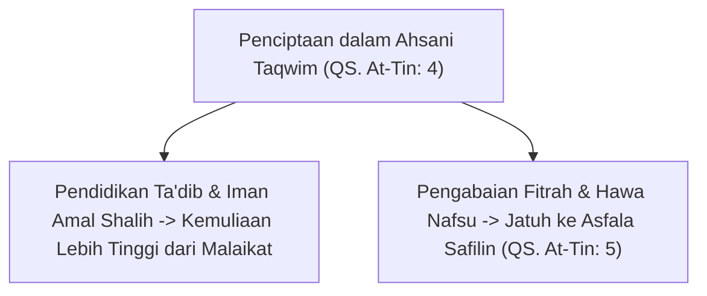
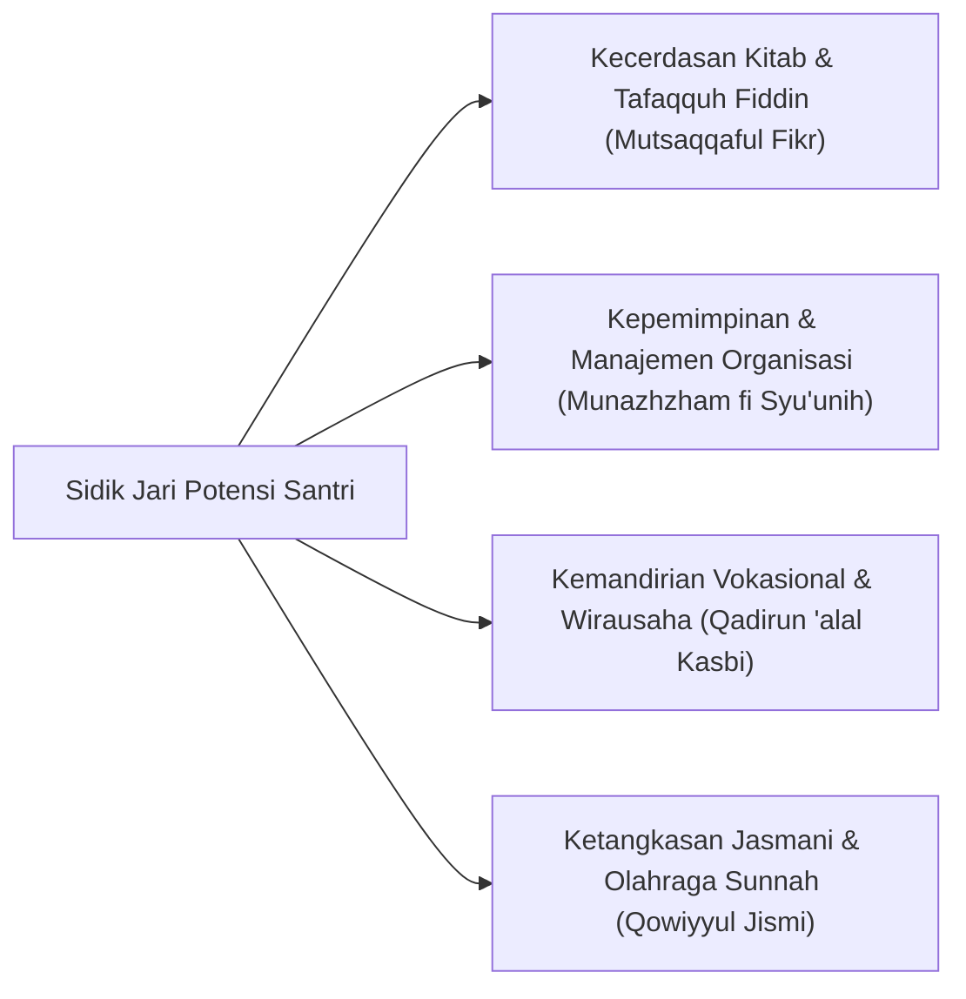

# P1-02-03: POTENSI INSAN DAN MANDAT AMANAH KHILAFAH
## *Dialektika Potensi Tak Terbatas, Konsep 'Ahsani Taqwim', dan Pertanggungjawaban Eksistensial Santri*

**Nomor Identifikasi**: `P1-02-03/POTENSI-AMANAH/2026`  
**Domain**: `01 Philosophy` > `02 Human Nature`  
**Dewan Pakar**: `pakar-filosofi-tumbuh`, `pakar-desain-kurikulum-adab`, `pakar-epistemologi-turats`

---

## 📑 DAFTAR ISI ANALITIS

1. [1. Konsep Ahsani Taqwim: Puncak Kesempurnaan Ciptaan](#1-konsep-ahsani-taqwim-puncak-kesempurnaan-ciptaan)
2. [2. Mandat Amanah Khilafah & Imarah al-Ardh (QS. Al-Ahzab: 72 & Al-Baqarah: 30)](#2-mandat-amanah-khilafah--imarah-al-ardh-qs-al-ahzab-72--al-baqarah-30)
3. [3. Dialektika Asfala Safilin: Ancaman Kejatuhan Moral](#3-dialektika-asfala-safilin-ancaman-kejatuhan-moral)
4. [4. Teori Talenta Unik (*Multiple Intelligences & Giftedness*) dalam Bingkai Syar'i](#4-teori-talenta-unik-multiple-intelligences--giftedness-dalam-bingkai-syari)
5. [5. Implikasi bagi Kurikulum Diferensiasi Adab TUMBUH](#5-implikasi-bagi-kurikulum-diferensiasi-adab-tumbuh)

---

### 1. Konsep Ahsani Taqwim: Puncak Kesempurnaan Ciptaan

Al-Qur'an mendeklarasikan kemuliaan rancang bangun penciptaan manusia:

> $$\text{لَقَدْ خَلَقْنَا الْإِنسَانَ فِي أَحْسَنِ تَقْوِيمٍ}$$
> 
> *"Sesungguhnya Kami telah menciptakan manusia dalam bentuk yang sebaik-baiknya."* (QS. At-Tin [95]: 4).

*Ahsani Taqwim* tidak hanya merujuk pada keindahan postur fisik simetris manusia yang tegak berdiri, melainkan terutama pada **kesempurnaan susunan potensi ruhani, moral, dan akal budi**. Santri diciptakan sebagai karya cipta teragung Allah di alam semesta yang dibekali instrumen internal untuk meraih derajat spiritual yang melampaui para malaikat.

---

### 2. Mandat Amanah Khilafah & Imarah al-Ardh

Manusia ditunjuk oleh Allah SWT untuk memikul **Amanah Khilafah**—sebuah mandat kosmis yang bahkan ditolak oleh langit, bumi, dan gunung-gunung karena beratnya konsekuensi pertanggungjawaban (QS. Al-Ahzab: 72).

Sebagai *Khalifatullah fil Ardh* (QS. Al-Baqarah: 30), setiap santri dididik di pesantren untuk mengemban dua tugas eksistensial:
1. **'Ibadatullah**: Menghambakan diri seutuhnya kepada Allah SWT dengan tauhid murni (*Salimul Aqidah & Shahihul Ibadah*).
2. **'Imaratul Ardh**: Memakmurkan bumi, membangun peradaban yang adil, mengentaskan kebodohan, dan menyebarkan rahmat bagi semesta alam (*Nafi'un Lighairihi*).

---

### 3. Dialektika Asfala Safilin: Ancaman Kejatuhan Moral

Namun, Al-Qur'an juga mengingatkan potensi kejatuhan eksistensial:
> $$\text{ثُمَّ رَدَدْنَاهُ أَسْفَلَ سَافِلِينَ ۝ إِلَّا الَّذِينَ آمَنُوا وَعَمِلُوا الصَّالِحَاتِ فَلَهُمْ أَجْرٌ غَيْرُ مَمْنُونٍ}$$
> 
> *"Kemudian Kami kembalikan dia ke tempat yang serendah-rendahnya, kecuali orang-orang yang beriman dan mengerjakan amal kebajikan; maka bagi mereka pahala yang tidak putus-putusnya."* (QS. At-Tin [95]: 5–6).

Manusia yang menyia-nyiakan potensi fitrahnya dan membiarkan nafsunya liar akan jatuh ke derajat yang lebih hina dari binatang ternak (*Bal Hum Adhall*, QS. Al-A'raf: 179). Inilah mengapa pesantren hadir: bukan untuk mengubah kodrat manusia, melainkan menjadi benteng penyelamat yang menjaga santri agar tetap berada di puncak *Ahsani Taqwim* melalui wahana iman dan amal shalih.

---

### 4. Teori Talenta Unik dalam Bingkai Syar'i

Ekosistem TUMBUH menolak penyeragaman bakat (*standardization fallacy*). Sebagaimana para sahabat Nabi SAW memiliki keunikan potensi yang beragam—Khalid bin Walid unggul dalam kepemimpinan militer, Bilal bin Rabah unggul dalam suara adzan, Mu'adz bin Jabal unggul dalam hukum halal-haram, dan Abu Hurairah unggul dalam hafalan hadits—setiap santri memiliki **sidik jari bakat (*unique talent blueprint*)**:

---

### 5. Implikasi bagi Kurikulum Diferensiasi Adab TUMBUH

1. **Kurikulum Berbasis Kekuatan (*Strength-Based Curriculum*)**: Menghargai santri yang berprestasi di bidang seni kaligrafi atau keorganisasian sama tingginya dengan santri yang berprestasi dalam hafalan nahwu-sharaf.
2. **Peniadaan Sistem Perankingan Tunggal**: Menghapus budaya membanding-bandingkan santri (*social comparison*); setiap santri dievaluasi berdasarkan kurva pertumbuhan dirinya sendiri (*Asesmen Ipsatif*).
3. **Penyaluran Mandat Tanggung Jawab Nyata**: Memberikan amanah pengelolaan fasilitas pondok, kepanitiaan bakti sosial, dan mentoring adik kelas kepada santri sesuai kecenderungan bakat unik mereka.
