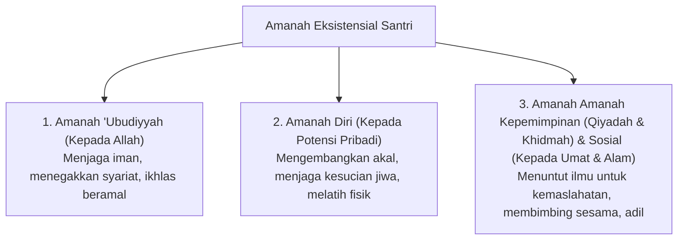

# P1-02-03-Potensi-dan-Amanah

## Tujuan
Menjelaskan hubungan antara **Potensi Ciptaan (Bakat/Kapasitas)** dan **Amanah Taklif (Tanggung Jawab Syar'i & Sosial)** yang diemban oleh santri dalam kerangka antropologi Islam.

---

## Hakikat Amanah dan Potensi Manusia

Allah Subhanahu wa Ta'ala menciptakan manusia dengan kelengkapan potensi terbaik (*Ahsani Taqwim*) dan mengamanahkan bumi untuk dimakmurkan (*Amanah Kepemimpinan (Qiyadah & Khidmah)*).

> *"Sesungguhnya Kami telah menawarkan amanah kepada langit, bumi, dan gunung-gunung; tetapi semuanya enggan untuk memikul amanah itu dan mereka khawatir tidak akan melaksanakannya (berat), lalu dipikullah amanah itu oleh manusia..."*  
> **(QS. Al-Ahzab [33]: 72)**

> *"Dan Dialah yang menjadikan kamu sebagai khalifah-khalifah di bumi dan Dia meninggikan sebagian kamu atas sebagian yang lain beberapa derajat, untuk menguji kamu tentang apa yang diberikan-Nya kepadamu..."*  
> **(QS. Al-An'am [6]: 165)**

---

## 3 Dimensi Amanah Santri

---

## Keragaman Potensi: Hikmah di Balik Perbedaan

Sistem TUMBUH menolak penyeragaman mutlak (*one-size-fits-all*). Dalam khazanah Islam, para sahabat Nabi SAW memiliki keragaman potensi dan peran:
* **Khalid bin Walid**: Potensi kepemimpinan militer dan ketegasan (*Saifullah*).
* **Abu Hurairah & Abdullah bin Abbas**: Potensi hafalan, transmisi riwayat, dan kedalaman tafsir.
* **Utsman bin Affan & Abdurrahman bin Auf**: Potensi kewirausahaan, diplomasi, dan filantropi.
* **Mus'ab bin Umair**: Potensi diplomasi dakwah dan kecakapan komunikasi.

### Konsekuensi bagi Pesantren TUMBUH:
1. **Identifikasi Potensi Sejak Dini (T1 & T2)**: Santri dibantu mengenali keunikan bakat dan minatnya (akademik, kepemimpinan, riset, dakwah, seni, teknologi).
2. **Pengembangan Berbasis Kekuatan (*Strength-Based Development*)**: Fokus pembinaan adalah mengoptimalkan kekuatan fitrah santri seraya memastikan standar minimum adab dan fardhu 'ain terpenuhi.
3. **Potensi Adalah Titipan yang Dipertanggungjawabkan**: Santri dididik bahwa kecerdasan dan keahlian bukanlah untuk kesombongan, melainkan sarana pengabdian (*khidmah*).
