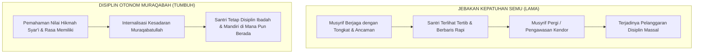
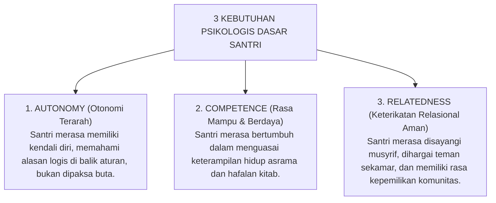

# P1-02-04: MOTIVASI INTRINSIK DAN INTEGRITAS MURAQABAH
## *Konvergensi Self-Determination Theory dengan Teologi Muraqabatullah dalam Formasi Disiplin Mandiri Santri*

**Nomor Identifikasi**: `P1-02-04/MOTIVASI-INTRINSIK/2026`  
**Domain**: `01 Philosophy` > `02 Human Nature`  
**Dewan Pakar**: `pakar-filosofi-tumbuh`, `pakar-social-emotional-learning`, `pakar-psikologi-belajar`

---

## 📑 DAFTAR ISI ANALITIS

1. [1. Problem Kepatuhan Semu: Ketika Disiplin Bergantung pada Pengawasan](#1-problem-kepatuhan-semu-ketika-disiplin-bergantung-pada-pengawasan)
2. [2. Tiga Kebutuhan Psikologis Dasar (Deci & Ryan) dalam Konteks Pesantren](#2-tiga-kebutuhan-psikologis-dasar-deci--ryan-dalam-konteks-pesantren)
3. [3. Konsep Muraqabatullah: Puncak Motivasi Otonom Spiritual](#3-konsep-muraqabatullah-puncak-motivasi-otonom-spiritual)
4. [4. Matriks Transformasi Motivasi: Dari Teror Menuju Cinta Ibadah](#4-matriks-transformasi-motivasi-dari-teror-menuju-cinta-ibadah)
5. [5. Implikasi Pedagogis bagi Musyrif dan Wali Kelas](#5-implikasi-pedagogis-bagi-musyrif-dan-wali-kelas)

---

### 1. Problem Kepatuhan Semu: Ketika Disiplin Bergantung pada Pengawasan

Salah satu penyakit paling kronis dalam manajemen disiplin pesantren konvensional adalah **Kepatuhan Berbasis Pengawasan (*Surveillance-Dependent Compliance*)**. Santri bergegas ke masjid saat musyrif memegang tongkat, namun begitu musyrif berbalik badan atau sedang dinas luar kota, shaf shalat langsung menyusut dan asrama menjadi kacau.

Fenomena ini membuktikan bahwa santri belum memiliki motivasi intrinsik. Disiplin mereka bersifat ekstrinsik semata—dimotivasi oleh rasa takut akan hukuman (*fear of punishment*) atau keinginan mencari pujian (*approval seeking*).

---

### 2. Tiga Kebutuhan Psikologis Dasar dalam Konteks Pesantren

Self-Determination Theory (Deci & Ryan, 2000; 2017) membuktikan bahwa motivasi intrinsik manusia hanya akan mekar jika **Tiga Kebutuhan Psikologis Dasar (*Basic Psychological Needs*)** terpenuhi:

Ketika pesantren memberlakukan aturan represif yang membunuh otonomi dan merusak relasi, sistem tersebut sesungguhnya sedang menyabotase fondasi biologis motivasi intrinsik santri.

---

### 3. Konsep Muraqabatullah: Puncak Motivasi Otonom Spiritual

Turats tasawuf Islam menyempurnakan teori motivasi modern melalui konsep **Muraqabatullah** (kesadaran bahwa Allah senantiasa mengawasi dan menyertai hamba-Nya). Imam Al-Qusyairi dalam *Ar-Risalah al-Qusyairiyyah* mendefinisikan muraqabah:

> $$\text{الْمُرَاقَبَةُ هِيَ عِلْمُ الْعَبْدِ بِاطِّلَاعِ الرَّبِّ سُبْحَانَهُ عَلَيْهِ فِي كُلِّ لَحْظَةٍ، وَاسْتِدَامَةُ هَذَا الْعِلْمِ حَتَّى يَسْتَوِيَ عِنْدَهُ ظَاهِرُهُ وَبَاطِنُهُ}$$
> 
> *"Muraqabah adalah keyakinan teguh seorang hamba akan pengawasan Allah SWT atas dirinya dalam setiap detak waktu, dan menjaga kelestarian kesadaran ini hingga keadaan lahiriahnya sama persis dengan keadaan batiniahnya di tempat sepi."*

Santri yang telah mencapai maqam muraqabah tidak membutuhkan musyrif bersenjata tongkat di belakang punggungnya. Ia merapikan kasurnya, menjaga lisannya dari ghibah, dan mendirikan tahajud di keheningan malam semata-mata karena kalbunya merasa malu dan rindu kepada Allah SWT.

---

### 4. Matriks Transformasi Motivasi Disiplin

| Parameter | Disiplin Berbasis Teror (Otoriter) | Disiplin Berbasis Reward Token (Behavioris) | Disiplin Berbasis Muraqabah (TUMBUH) |
| :--- | :--- | :--- | :--- |
| **Pemicu Utama** | Ketakutan akan rasa sakit fisik/malu. | Keinginan mengumpulkan kupon/bintang. | **Cinta kepada Allah, hikmah akal, & kesadaran fitrah.** |
| **Perilaku di Tempat Sepi** | Melanggar aturan secara ekstrem. | Apatis jika tidak ada imbalan poin. | **Tetap istiqamah menjaga adab dan amanah.** |
| **Karakter Pendidik** | Polisi/Hakim yang mengawasi kesalahan. | Kasir yang menghitung transaksi poin. | **Murabbi Qudwah yang menyuburkan kesadaran qalb.** |
| **Daya Tahan Karakter** | Rusak seketika saat keluar pondok. | Lenyap saat sistem poin berakhir. | **Melekat permanen seumur hidup (*Matinul Khuluq*).** |

---

### 5. Implikasi Pedagogis bagi Musyrif dan Guru

1. **Memberikan Penjelasan Al-Hikmah**: Musyrif tidak pernah memberikan instruksi adab tanpa menjelaskan hikmah syar'i dan manfaat rasionalnya bagi santri (*Autonomy-Supportive Didactics*).
2. **Menghidupkan Muhasabah Kamar Malam Hari**: Sesi 10 menit sebelum tidur diisi dengan refleksi batin tenang: mengevaluasi niat dan memohon ampunan kepada Allah SWT.
3. **Membangun Budaya Apresiasi Relasional 4:1**: Menghargai inisiatif kemandirian santri secara tulus untuk menguatkan rasa kompetensi dan keterikatan batin.
