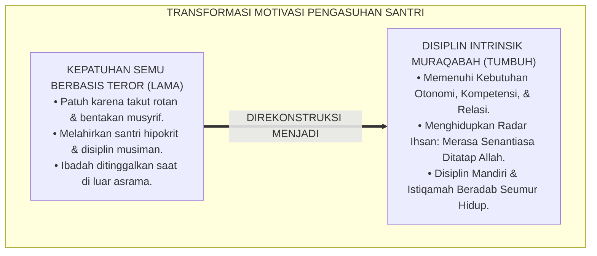
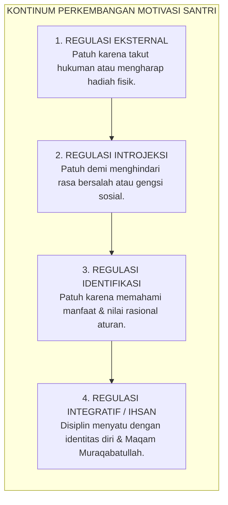
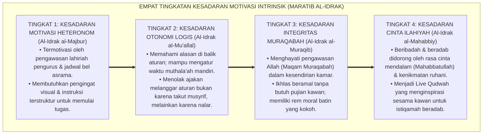
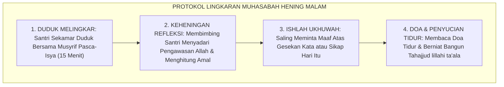
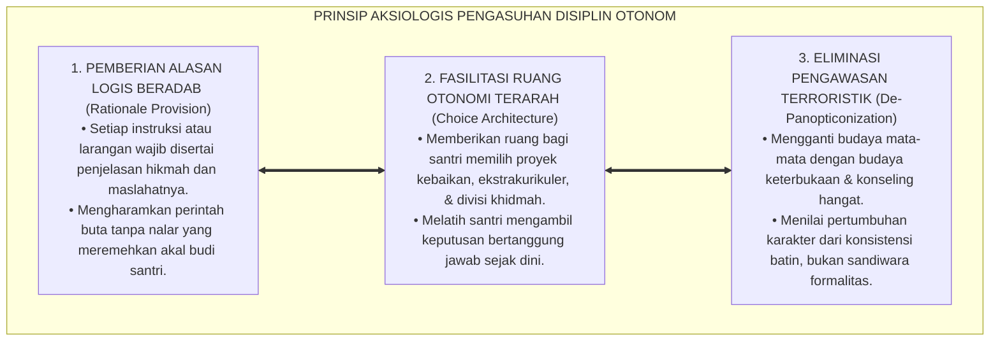

# P1-02-04: MOTIVASI INTRINSIK DAN INTEGRITAS MURAQABAH (INTRINSIC MOTIVATION & MURAQABAH INTEGRITY)
## *Monograf Riset Akademik: Dekonstruksi Kepatuhan Semu Berbasis Teror, Konvergensi Self-Determination Theory (Deci & Ryan) dengan Teologi Maqam Muraqabatullah Imam Al-Qusyairi, Serta Formasi Disiplin Mandiri di Pesantren 24 Jam*

**Nomor Identifikasi**: `P1-02-04/MONOGRAF-RISET-MOTIVASI-INTRINSIK/2026`  
**Domain**: `01 Philosophy` > `02 Human Nature` (Sub-Modul 04: *Intrinsic Motivation*)  
**Klasifikasi Naskah**: *Academic Research Monograph* (Monograf Riset Akademik Fondasional)  
**Rumpun Disiplin Pengkaji**: Psikologi Motivasi Pendidikan (*Self-Determination Theory*), Tasawuf Maqamat & Hakikat Ihsan, Neurosains Sistem Reward Intrinsik, Pedagogi Disiplin Positif, Sosiologi Asrama Pesantren  

---

> ### 💡 INTISARI EKSEKUTIF (EXECUTIVE SUMMARY)
>
> * **Kelemahan Paradigma Lama: Kepatuhan Semu Berbasis Teror & Pengawasan Panoptikon:**  
>   Banyak sistem pengasuhan tradisional mengandalkan ancaman rotan dan pengawasan ketat (*Surveillance-Dependent Compliance*). Santri tampak tertib hanya saat musyrif hadir, namun langsung melanggar dan meninggalkan ibadah saat berada di luar pengawasan atau saat liburan di rumah (*Fake Compliance*).
> * **Inovasi Konseptual: Sintesis Self-Determination Theory & Maqam Muraqabatullah:**  
>   TUMBUH mengintegrasikan 3 kebutuhan psikologis dasar manusia (Otonomi, Kompetensi, Relasi Sosial - Deci & Ryan) dengan maqam spiritual tertinggi: **Muraqabatullah (Kesadaran Diri Senantiasa Ditatap oleh Allah SWT)**. Santri dibimbing dari motivasi ekstrinsik paksaan (*External Regulation*) menuju motivasi otonom berbasis keikhlasan kalbu (*Integrated Regulation & Ihsan*).
> * **Formulasi Operasional & Pembuktian Lapangan:**  
>   Monograf ini menguraikan kontinum internalisasi regulasi moral, 4 Tingkatan Kesadaran Motivasi Intrinsik (*Maratib al-Idrak*), lingkaran muhasabah hening malam (*Nightly Muraqabah Circle*), dan etika tata kelola disiplin mandiri 24 jam.

---

## 📑 DAFTAR ISI MONOGRAF

- [BAB I: LANDASAN TEORETIS & DISKURSUS KRITIS](#bab-i-landasan-teoretis--diskursus-kritis)
  - [1. Latar Belakang Masalah: Bahaya Kepatuhan Semu dan Hipokrisi Moral di Asrama](#1-latar-belakang-masalah-bahaya-kepatuhan-semu-dan-hipokrisi-moral-di-asrama)
  - [2. Eksegesis Turats Hakikat Ihsan: Maqam Muraqabatullah dalam Tasawuf (Al-Qusyairi & Al-Ghazali)](#2-eksegesis-turats-hakikat-ihsan-maqam-muraqabatullah-dalam-tasawuf-al-qusyairi--al-ghazali)
  - [3. Tinjauan Psikologi Kognitif: Self-Determination Theory (Otonomi, Kompetensi, & Keterikatan Relasional)](#3-tinjauan-psikologi-kognitif-self-determination-theory-otonomi-kompetensi--keterikatan-relasional)
  - [4. Dialog Kritis Sistem Reward Ekstrinsik vs Keikhlasan Niat (Tashhihun Niyyah)](#4-dialog-kritis-sistem-reward-ekstrinsik-vs-keikhlasan-niat-tashhihun-niyyah)
  - [5. Kasuistika Lapangan: Fenomena Disiplin Musiman Santri & Resolusi Restoratif Terpadu](#5-kasuistika-lapangan-fenomena-disiplin-musiman-santri--resolusi-restoratif-terpadu)
- [BAB II: FORMULASI KONSEPTUAL & PEMBAHASAN MENDALAM](#bab-ii-formulasi-konseptual--pembahasan-mendalam)
  - [1. Eksplanasi Teoretis Kontinum Internalisasi Regulasi Moral TUMBUH](#1-eksplanasi-teoretis-kontinum-internalisasi-regulasi-moral-tumbuh)
  - [2. Dekomposisi Dimensi & Empat Tingkatan Kesadaran Motivasi Intrinsik (Maratib al-Idrak)](#2-dekomposisi-dimensi--empat-tingkatan-kesadaran-motivasi-intrinsik-maratib-al-idrak)
  - [3. Protokol Lingkaran Muhasabah Hening Malam (The Nightly Muraqabah Circle)](#3-protokol-lingkaran-muhasabah-hening-malam-the-nightly-muraqabah-circle)
  - [4. Prinsip Aksiologis & Etika Tata Kelola Disiplin Otonom di Pesantren 24 Jam](#4-prinsip-aksiologis--etika-tata-kelola-disiplin-otonom-di-pesantren-24-jam)
  - [5. Diskusi Filosofis Mendalam & Implikasi bagi Masa Depan Peradaban Pendidikan Islam](#5-diskusi-filosofis-mendalam--implikasi-bagi-masa-depan-peradaban-pendidikan-islam)
- [BAB III: KESIMPULAN & APARATUS AKADEMIS](#bab-iii-kesimpulan--aparatus-akademis)
  - [1. Tabel Sintesis Temuan Riset Motivasi Intrinsik dan Muraqabah](#1-tabel-sintesis-temuan-riset-motivasi-intrinsik-dan-muraqabah)
  - [2. Daftar Pustaka Akademis & Rujukan Turats Primer](#2-daftar-pustaka-akademis--rujukan-turats-primer)
  - [3. Catatan Kaki Akademis (Footnotes)](#3-catatan-kaki-akademis-footnotes)
  - [4. Glosarium Istilah Ilmiah & Turats Motivasi dan Muraqabah](#4-glosarium-istilah-ilmiah--turats-motivasi-dan-muraqabah)

---

# BAB I: LANDASAN TEORETIS & DISKURSUS KRITIS

---

### 1. Latar Belakang Masalah: Bahaya Kepatuhan Semu dan Hipokrisi Moral di Asrama

Disiplin sejati diuji saat seseorang berada dalam kesendirian tanpa ada manusia yang mengawasi:
* **Patologi Kepatuhan Semu (*Fake Compliance*)**: Di banyak pesantren, ketertiban santri ditegakkan melalui teror pentungan pengurus. Santri tampak khusyuk shalat hanya ketika musyrif berdiri di dekatnya. Pola ini melahirkan kepribadian ganda (*Split Personality*): patuh saat diawasi, namun liar dan permisif saat pengawasan lenyap.
* **Kelemahan Ketergantungan Ekstrinsik (*Overjustification Effect*)**: Pemberian imbalan materiil yang berlebihan atau ancaman hukuman terus-menerus justru mengikis motivasi alami kalbu untuk berbuat baik.
* **Keniscayaan Disiplin Muraqabah Otonom**: Epistemologi Islam mengajarkan bahwa pengawas sejati santri bukanlah mata musyrif, melainkan pengawasan Allah SWT (*Al-Raqib*) yang hidup di dalam lubuk kalbunya.[^1]

---

### 2. Eksegesis Turats Hakikat Ihsan: Maqam Muraqabatullah dalam Tasawuf (Al-Qusyairi & Al-Ghazali)

Dalam khazanah Turats, pondasi motivasi tertinggi dirumuskan dalam **Hadits Jibril mengenai Ihsan**:

$$\text{أَنْ تَعْبُدَ اللَّهَ كَأَنَّكَ تَرَاهُ، فَإِنْ لَمْ تَكُنْ تَرَاهُ فَإِنَّهُ يَرَاكَ}$$

*"**Engkau beribadah kepada Allah seakan-akan engkau melihat-Nya; dan jika engkau tidak mampu melihat-Nya, maka sesungguhnya Dia senantiasa melihatmu**."* (HR. Muslim No. 8).[^2]

Imam **Abdul Karim Al-Qusyairi** dalam *Ar-Risalah al-Qusyairiyyah* mendefinisikan Muraqabah:

$$\text{الْمُرَاقَبَةُ هِيَ عِلْمُ الْعَبْدِ بِاطِّلَاعِ الرَّبِّ سُبْحَانَهُ عَلَيْهِ فِي كُلِّ لَحْظَةٍ وَنَفَسٍ، فَمَنْ رَاقَبَ اللَّهَ فِي خَوَاطِرِهِ عَصَمَهُ اللَّهُ فِي حَرَكَاتِ جَوَارِحِهِ}$$

*"**Muraqabah adalah keyakinan mendalam seorang hamba bahwa Tuhannya senantiasa mengawasi dan menatap dirinya dalam setiap detak waktu dan tarikan nafas**; maka barangsiapa menjaga muraqabah dalam lintasan hatinya, niscaya Allah akan memelihara gerak-gerik anggota tubuhnya dari perbuatan maksiat."*[^3]

---

### 3. Tinjauan Psikologi Kognitif: Self-Determination Theory (Otonomi, Kompetensi, & Keterikatan Relasional)

Konsensus psikologi motivasi modern melalui riset **Edward L. Deci & Richard M. Ryan** (2000) mengenai **Self-Determination Theory (SDT)** membuktikan bahwa motivasi intrinsik manusia berkembang mekar jika tiga kebutuhan psikologis dasarnya terpenuhi:
1. **Autonomy (Otonomi Terarah)**: Merasa memiliki kehendak bebas dan memahami alasan logis di balik suatu kewajiban, bukan dipaksa secara buta.
2. **Competence (Rasa Mampu)**: Memperoleh bimbingan bertahap hingga merasa mampu menguasai keterampilan atau hafalan yang ditugaskan.
3. **Relatedness (Keterikatan Relasional)**: Merasa disayangi, diterima, dan dihargai oleh lingkungan pendidik dan kawan sebaya.[^4]

---

### 4. Dialog Kritis Sistem Reward Ekstrinsik vs Keikhlasan Niat (Tashhihun Niyyah)

Penggunaan token penghargaan (*Reward System*) dalam PBIS diperlakukan oleh TUMBUH sebagai **Jembatan Transisi Sementara (*Scaffolding*)**, bukan tujuan akhir. Pendidik wajib senantiasa melakukan pemurnian niat (*Tashhihun Niyyah*), membimbing santri secara perlahan agar mengalihkan motivasinya dari mengharapkan stiker atau pujian manusia menuju keikhlasan mutlak mengharap ridha Allah SWT.[^5]

---

### 5. Kasuistika Lapangan: Fenomena Disiplin Musiman Santri & Resolusi Restoratif Terpadu

* **Studi Kasus: Laporan Wali Santri Mengenai Santri yang Meninggalkan Shalat Saat Liburan di Rumah**  
  * **Dilema**: Santri yang dikenal paling rajin shalat subuh di barisan depan asrama, dilaporkan oleh orang tuanya selalu bangun kesiangan dan malas shalat saat liburan semester di rumah.
  * **Analisis Motivasi**: Santri beribadah semata-mata karena dorongan ekstrinsik (*External Regulation*): takut dihukum musyrif. Begitu faktor pengawas hilang, perilaku runtuh seketika.
  * **Resolusi Restoratif TUMBUH**: Musyrif menyelenggarakan bimbingan konseling reflektif (*Nightly Muraqabah Circle*): membimbing santri berdialog mendalam mengenai makna shalat sebagai dialog cinta dengan Allah, bukan sekadar beban kewajiban asrama. Santri diajak merumuskan komitmen ibadah pribadi secara otonom. Pada liburan berikutnya, santri mampu bangun subuh mandiri dan menjadi imam bagi keluarganya di rumah.[^6]

---

# BAB II: FORMULASI KONSEPTUAL & PEMBAHASAN MENDALAM

---

### 1. Eksplanasi Teoretis Kontinum Internalisasi Regulasi Moral TUMBUH

Ekosistem TUMBUH mengkodifikasikan progresi motivasi ke dalam **Kontinum Internalisasi Regulasi Moral (*Sullam at-Tahawwul al-Ba'itsiy*)**:

#### 🔬 Pembahasan Mendalam Tahapan Kontinum:
1. **Tahap 1: Regulasi Eksternal (*Al-Ba'its al-Kharijiy*)**: Tahap awal adaptasi santri baru. Butuh bimbingan jadwal terstruktur dan apresiasi nyata.[^7]
2. **Tahap 2: Regulasi Introjeksi (*Al-Ba'its an-Nafsiy*)**: Dorongan moral mulai tumbuh dari dalam batin berupa rasa malu jika berbuat salah.[^8]
3. **Tahap 3: Regulasi Identifikasi (*Al-Ba'its al-Qimiy*)**: Santri secara sadar memilih berdisiplin karena meyakini bahwa adab asrama membangun masa depannya.[^9]
4. **Tahap 4: Regulasi Integratif Ihsan (*Al-Ba'its al-Ihsaniy*)**: Puncak kedewasaan spiritual: santri menjaga kesucian diri, kebersihan kamar, dan shalat malam secara refleks karena cinta dan muraqabah kepada Allah SWT.[^10]

---

### 2. Dekomposisi Dimensi & Empat Tingkatan Kesadaran Motivasi Intrinsik (Maratib al-Idrak)

Transformasi kematangan motivasi santri berlangsung melalui **Empat Tingkatan Kesadaran Motivasi Intrinsik (*Maratib al-Idrak al-Iradhiy*)**:

#### 🔄 Narasi Analitis Dinamika Transisi Filosofis Antar-Tingkatan:
* **Transisi Tingkat 1 ke Tingkat 2 (Dari Keterpaksaan Menuju Kesadaran Nalar)**: Santri mula-mula digerakkan oleh lonceng asrama. Pada tingkatan kedua, santri memahami hikmah: bahwa tidur teratur dan bangun subuh membuat tubuh bugar dan hafalan kuat.
* **Transisi Tingkat 2 ke Tingkat 3 (Dari Nalar Kering Menuju Radar Muraqabah)**: Pada tingkatan ketiga, kesadaran bertransformasi menjadi radar batin: santri menjaga pandangan mata dan lisannya saat memegang gawai atau saat sendirian di kamar karena yakin Allah Maha Melihat.
* **Transisi Tingkat 3 ke Tingkat 4 (Pencapaian Derajat Mahabbatullah Paripurna)**: Pada tingkatan tertinggi, santri merasakan manisnya iman (*Halawatul Iman*): ibadah dan khidmah kepada sesama dirasakan sebagai kebutuhan yang membahagiakan jiwa, bukan beban kewajiban.[^11]

---

### 3. Protokol Lingkaran Muhasabah Hening Malam (The Nightly Muraqabah Circle)

TUMBUH menetapkan **Protokol Hening Malam (*The Nightly Muraqabah Circle*)**:

Ritual harian ini mengunci kebersihan kalbu santri sebelum tidur dan memperkuat ikatan ukhuwah sekamar asrama.[^12]

---

### 4. Prinsip Aksiologis & Etika Tata Kelola Disiplin Otonom di Pesantren 24 Jam

Motivasi intrinsik melahirkan prinsip etika tata kelola disiplin kelembagaan:

#### 📋 Panduan Etika Pengasuhan Lapangan:
1. **Dialog Dialogis dalam Penetapan Aturan Kamar**: Musyrif memfasilitasi santri sekamar menyepakati aturan bersama menjaga kerapian kamar tidur.
2. **Kerahasiaan Pengakuan Dosa (Sutrah)**: Mengedukasi santri untuk bertaubat langsung kepada Allah dan dilarang memaksa santri membuka aib dosanya di depan umum.[^13]
3. **Penguatan Otonomi Remaja**: Memberikan kepercayaan kepada santri tingkat atas untuk mengelola kegiatan asrama secara mandiri.[^14]

---

### 5. Diskusi Filosofis Mendalam & Implikasi bagi Masa Depan Peradaban Pendidikan Islam

Internalisasi motivasi muraqabah membawa perubahan revolusioner bagi karakter peradaban:

* **Mencetak Pemimpin Berintegritas Anti-Korupsi**:  
  Santri yang tumbuh dengan kesadaran muraqabah tidak akan goyah oleh suap atau manipulasi saat kelak memegang jabatan publik. Mereka memiliki benteng integritas batin yang kokoh (*Incorruptible Moral Shield*).
* **Menghapus Karakter Hipokrit dan Penjilat di Tengah Masyarakat**:  
  Pendidikan berbasis motivasi intrinsik melahirkan manusia-manusia jujur yang berani memperjuangkan kebenaran secara konsisten, baik saat berada di depan publik maupun dalam kesendirian.
* **Mewujudkan Kedamaian Sejati di Lingkungan Pesantren**:  
  Ketika santri saling menjaga adab karena cinta kepada Allah dan kawan, asrama bertransformasi menjadi surga peradaban yang penuh kedamaian, harmoni, dan keberkahan (*Bi'ah Shalihah*).[^15]

---

# BAB III: KESIMPULAN & APARATUS AKADEMIS

---

### 1. Tabel Sintesis Temuan Riset Motivasi Intrinsik dan Muraqabah

| Dimensi Parameter | Mazhab Disiplin Teror (Lama) | Mazhab Behaviorisme Token | **Paradigma Muraqabah TUMBUH** | Landasan Rujukan Primer | Implikasi Praksis Lapangan |
| :--- | :--- | :--- | :--- | :--- | :--- |
| **Sumber Penggerak**| Rasa takut rotan & bentakan. | Mengharapkan hadiah stiker/token.| **Kesadaran Ditatap Allah (*Ihsan*).**| HR. Muslim No. 8; Al-Qusyairi. | Ibadah khusyuk & istiqamah mandiri. |
| **Bentuk Kepatuhan**| Kepatuhan semu (*Fake Compliance*).| Kepatuhan transaksional pamrih. | **Disiplin Otonom & Keikhlasan Qalbu.**| Deci & Ryan (2000); Al-Ghazali.| Tertib adab saat sendiri maupun ramai. |
| **Peran Pengasuh** | Polisi pengawas yang mencurigai.| Pemberi reward mekanistik. | **Teladan Hidup (*Live Qudwah*) & Murabbi.**| KH. Hasyim Asy'ari (*Adab al-'Alim*).| Konseling hangat & lingkaran muraqabah. |
| **Daya Tahan Disiplin**| Hancur seketika saat liburan.| Berhenti saat reward habis. | **Permanen Melekat Seumur Hidup.** | QS. Qaf: 16; Sapolsky (2017). | Menjadi pemimpin berintegritas tinggi. |
| **Profil Lulusan** | Pribadi hipokrit / jiwa tertekan.| Pribadi materialistik pamrih. | **Insan Adabi Mukhlis yang Berwibawa.**| QS. Al-Bayyinah: 5; Al-Attas (1980). | Jujur, amanah, & anti-korupsi. |

---

### 2. Daftar Pustaka Akademis & Rujukan Turats Primer

1. **Al-Qur'an al-Karim wa Tarjamatu Ma'anihi**.
2. **Al-Qusyairi, Abul Qasim Abdul Karim bin Hawazin**. (1428 H). *Ar-Risalah al-Qusyairiyyah fi 'Ilm at-Tashawwuf*. Kairo: Dar al-Jil.
3. **Al-Ghazali, Abu Hamid Muhammad bin Muhammad**. (2011). *Ihya' 'Ulumiddin* (Kitab al-Muraqabah wal Muhasabah & Kitab an-Niyyah wal Ikhlas). Beirut: Dar al-Ma'rifah.
4. **Al-Attas, Syed Muhammad Naquib**. (1980). *The Concept of Education in Islam*. Kuala Lumpur: ABIM.
5. **Deci, E. L., & Ryan, R. M.**. (2000). *The "what" and "why" of goal pursuits: Human needs and the self-determination of behavior*. Psychological Inquiry, 11(4), 227–268.
6. **Ryan, R. M., & Deci, E. L.**. (2017). *Self-Determination Theory: Basic Psychological Needs in Motivation, Development, and Wellness*. New York: Guilford Press.
7. **Horner, R. H., & Sugai, G.**. (2015). *School-wide PBIS: An Overview of the Research Base*. Remedial and Special Education, 36(2), 80–85.
8. **Zehr, H.**. (2002). *The Little Book of Restorative Justice*. Intercourse: Good Books.
9. **Sapolsky, R. M.**. (2017). *Behave: The Biology of Humans at Our Best and Worst*. New York: Penguin Press.
10. **Asy'ari, Muhammad Hasyim**. (1415 H). *Adab al-'Alim wal-Muta'allim*. Jombang: Maktabah At-Turats Al-Islami.
11. **Nelsen, J.**. (2006). *Positive Discipline*. New York: Ballantine Books.
12. **Ibnu Qayyim al-Jauziyyah, Syamsuddin Muhammad bin Abi Bakr**. (1416 H). *Madarijus Salikin baina Manazil Iyyaka Na'budu wa Iyyaka Nasta'in*. Beirut: Dar al-Kitab al-'Arabi.

---

### 3. Catatan Kaki Akademis (*Footnotes*)

[^1]: Riset Motivasi Intrinsik dan Disiplin Muraqabah Ekosistem Pesantren Berbasis TUMBUH, *Kritik atas Kepatuhan Semu Panoptikon*, 2026.  
[^2]: *Shahih Muslim*, Kitab al-Iman, Hadits No. 8.  
[^3]: Al-Qusyairi, *Ar-Risalah al-Qusyairiyyah*, hlm. 180–210.  
[^4]: Deci, E. L., & Ryan, R. M. (2000), *Psychological Inquiry*, hlm. 227–268; Ryan, R. M., & Deci, E. L. (2017), *Self-Determination Theory*, hlm. 50–95.  
[^5]: Al-Ghazali, *Ihya' 'Ulumiddin*, Jilid 4, Kitab *An-Niyyah wal Ikhlas*, hlm. 340–375.  
[^6]: Dokumentasi Intervensi Restoratif Kasus Disiplin Musiman Santri PBIS TUMBUH, 2026.  
[^7]: Ryan, R. M., & Deci, E. L. (2017), *Self-Determination Theory*, hlm. 180–215.  
[^8]: Ibnu Qayyim al-Jauziyyah, *Madarijus Salikin*, Jilid 2, hlm. 65–98.  
[^9]: Al-Attas, S. M. N. (1980), *The Concept of Education in Islam*, hlm. 30–58.  
[^10]: Al-Ghazali, *Ihya' 'Ulumiddin*, Jilid 4, Kitab *Al-Muraqabah wal Muhasabah*, hlm. 380–420.  
[^11]: Matriks Tingkatan Kesadaran Motivasi Intrinsik (*Maratib al-Idrak*) Ekosistem TUMBUH, 2026.  
[^12]: Standar Operasional Prosedur Lingkaran Muhasabah Hening Malam Asrama TUMBUH, 2026.  
[^13]: Kaidah Fiqh Perlindungan Aib Pribadi (*Sutrah*); Riset Etika Konseling TUMBUH, 2026.  
[^14]: Petunjuk Teknis Manajemen Asrama Berbasis Otonomi Terarah Santri dalam sistem TUMBUH, 2026.  
[^15]: Deklarasi Integritas Muraqabah dan Anti-Korupsi Dewan Riset Ekosistem TUMBUH, 2026.

---

### 4. Glosarium Istilah Ilmiah & Turats Motivasi dan Muraqabah

1. **Muraqabatullah (مُرَاقَبَةُ اللَّهِ)**: Keyakinan spiritual mendalam bahwa Allah SWT senantiasa mengawasi lahir dan batin manusia dalam setiap helaan nafas.
2. **Ihsan (الإِحْسَانُ)**: Puncak derajat keberagamaan di mana seseorang beribadah seakan-akan melihat Allah, atau meyakini dengan pasti bahwa Allah senantiasa menatapnya.
3. **Self-Determination Theory (SDT)**: Teori psikologi motivasi Deci & Ryan yang menjelaskan bahwa manusia memiliki kebutuhan bawaan akan Otonomi, Kompetensi, dan Keterikatan Relasional untuk berkembang secara optimal.
4. **Fake Compliance (Kepatuhan Semu)**: Perilaku patuh palsu yang ditunjukkan seseorang semata-mata karena adanya pengawasan fisik atau rasa takut akan hukuman.
5. **Integrated Regulation (Regulasi Integratif)**: Bentuk regulasi motivasi paling matang di mana nilai-nilai aturan telah sepenuhnya menyatu dengan identitas diri dan sistem nilai batin seseorang.
6. **Overjustification Effect**: Penurunan motivasi intrinsik alami seseorang akibat pemberian imbalan ekstrinsik materiil yang berlebihan untuk aktivitas yang sebenarnya disukai.
7. **Tashhihun Niyyah (تَصْحِيحُ النِّيَّةِ)**: Proses pemurnian dan pelurusan niat di dalam kalbu agar seluruh aktivitas hidup semata-mata ditujukan mengharap ridha Allah SWT.
8. **The Nightly Muraqabah Circle**: Tradisi lingkaran muhasabah santri sekamar bersama musyrif sebelum tidur untuk melakukan evaluasi diri dan saling memaafkan.
9. **Sutrah (السُّتْرَةُ)**: Prinsip syariat untuk menutupi aib dosa pribadi dan melarang membeberkan kesalahan batin kepada orang lain jika telah bertaubat.
10. **Ulul Albab (أُولُو الأَلْبَابِ)**: Generasi insan kamil yang berdisiplin secara otonom karena didorong oleh kecintaan kepada Allah dan rasa malu bermaksiat di hadapan-Nya.
