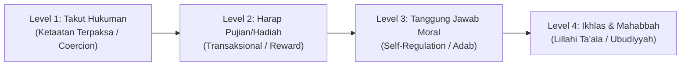

# P1-02-04-Motivasi-Intrinsik-Santri

## Tujuan
Merumuskan fondasi psikologis dan teologis mengenai pergeseran motivasi santri: dari ketaatan semu karena paksaan (*eksternal/fear-based*) menuju motivasi intrinsik berbasis keikhlasan, kesadaran diri, dan cinta kepada Allah (*internal/mahabba-based*).

---

## Masalah Sistemik: Jeratan Kontrol Eksternal

Dalam pola pembinaan lama di dunia pesantren yang bersifat koersif:
* Santri disiplin hanya ketika diawasi oleh musyrif atau pengurus (*fear of punishment*).
* Santri berprestasi hanya demi pujian atau hadiah (*extrinsic reward*).
* Akibatnya: Begitu keluar dari gerbang pesantren atau saat tidak ada pengawasan, terjadi *relapse* (perilaku menyimpang kembali muncul karena nilai belum terinternalisasi).

---

## Spektrum Motivasi dalam Khazanah Islam & Disiplin Positif

### 1. Ibadah Tingkat 'Ubbad (Level Dasar)
Menyembah karena takut azab (*Khauf*) atau mengharap imbalan surga semata (*Raja'*). Ini sah sebagai pintu masuk (*T1/T2*), namun tidak boleh berhenti di sini.

### 2. Ibadah Tingkat 'Arifin & Muhibbin (Level Matang)
Menyembah Allah atas dasar cinta (*Mahabbah*), rasa syukur (*Syukr*), dan pemenuhan fitrah kehambaan. 

> *"Tidakkah patut aku menjadi hamba yang banyak bersyukur?"*  
> **(Sabda Rasulullah SAW ketika ditanya tentang sholat malamnya hingga kakinya bengkak - HR. Bukhari & Muslim)**

---

## Landasan Sains Global: Self-Determination Theory & Logoterapi

Menurut riset motivasi global **Self-Determination Theory (Deci & Ryan, 2000)** yang selaras dengan nilai Islam, motivasi intrinsik santri tumbuh jika 3 kebutuhan psikologis dasar terpenuhi:

1. **Keterikatan Relasi Bermakna (*Relatedness / Ukhuwah*)**:
   - Santri merasa diterima, disayangi, dan dihargai martabatnya oleh pembina tanpa syarat (*unconditional positive regard - Carl Rogers, 1961*).
2. **Rasa Mampu & Bertumbuh (*Competence / Kafa'ah*)**:
   - Santri diberikan tantangan yang sesuai tingkatannya dan dibimbing hingga berhasil (*Zone of Proximal Development - Vygotsky*), membentuk *Growth Mindset* (Carol Dweck, 2006) alih-alih dilabeli negatif.
3. **Otonomi Bertanggung Jawab (*Autonomy / Mas'uliyyah*)**:
   - Santri dilibatkan dalam menentukan target, merancang kesepakatan asrama, dan menemukan makna hidup (*Will to Meaning - Viktor Frankl, 1946*).

---

## Bahaya Neurobiologis Kontrol Koersif (Punitive Punishment)
Riset neurosains kognitif (*McLaughlin et al., 2019; Teicher et al., 2016*) membuktikan bahwa ancaman hukuman dan kekerasan verbal/fisik memicu respon stres akut (*amygdala hijacking*), menghambat aliran darah ke *prefrontal cortex*, dan mematikan kapasitas refleksi moral. Kontrol eksternal hanya menghasilkan kepatuhan semu sesaat (*compliance under duress*) yang justru meningkatkan risiko deviasi moral jangka panjang saat santri berada di luar pengawasan.

---

## Prinsip Penerapan di Pesantren TUMBUH
* **Menghindari Hukuman yang Merendahkan**: Hukuman fisik atau mempermalukan santri di depan umum hanya mematikan motivasi intrinsik dan menumbuhkan rasa dendam (*resentment*).
* **Menggunakan Konsekuensi Logis & Dialog Reflektif**: Membantu santri menghubungkan pilihan tindakannya dengan akibat nyata.
* **Pemberian Umpan Balik (*Encouragement* vs *Empty Praise*)**: Mengapresiasi usaha, ketekunan, dan proses perubahan akhlak santri.
