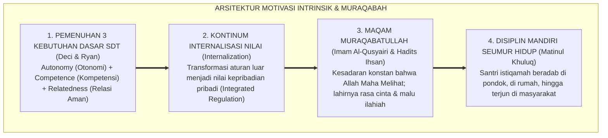
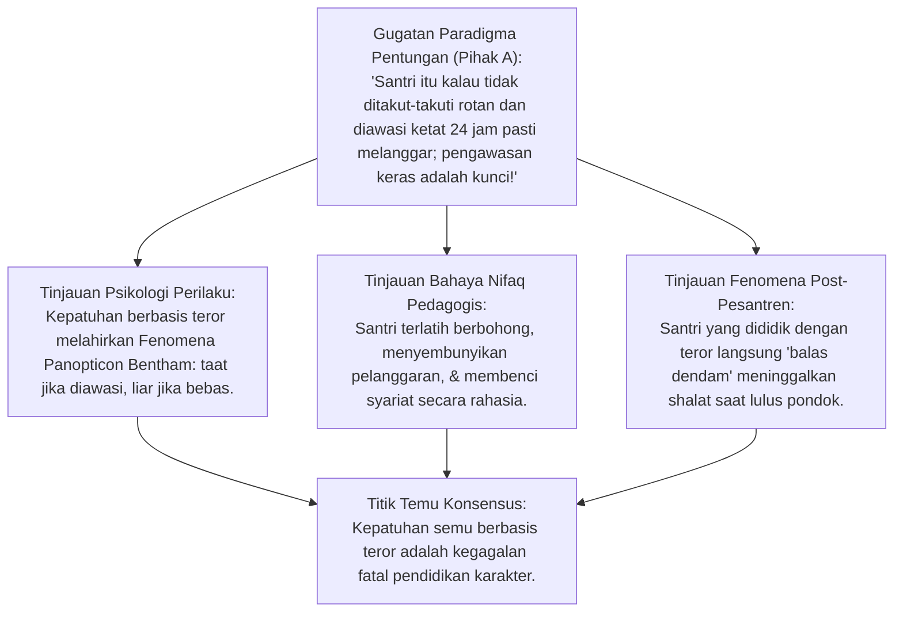
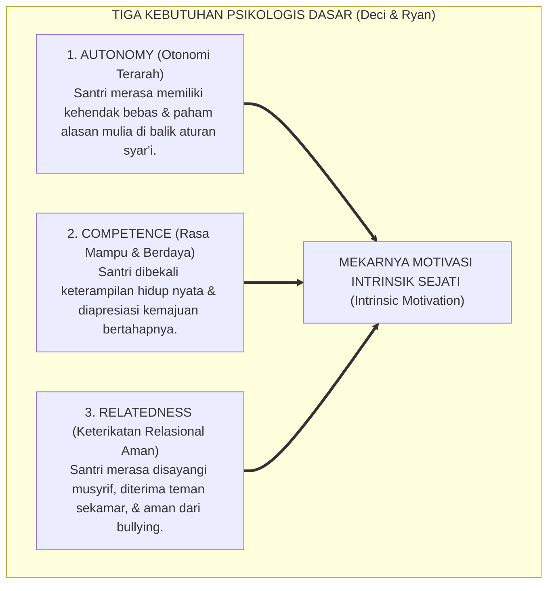
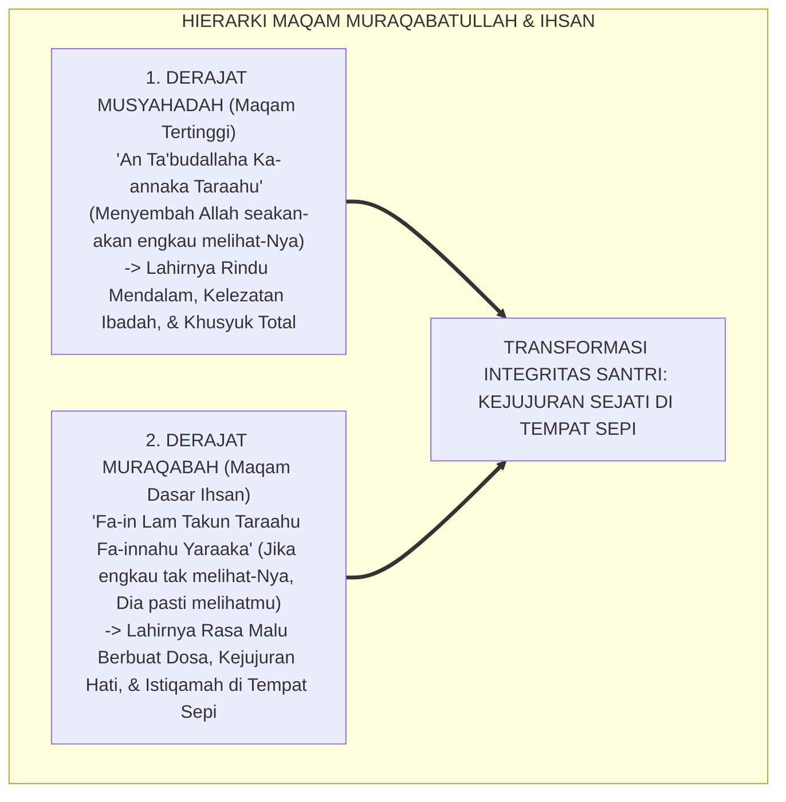
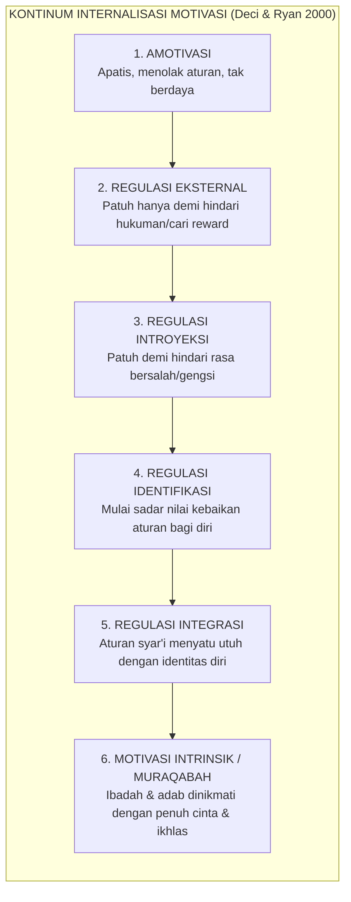
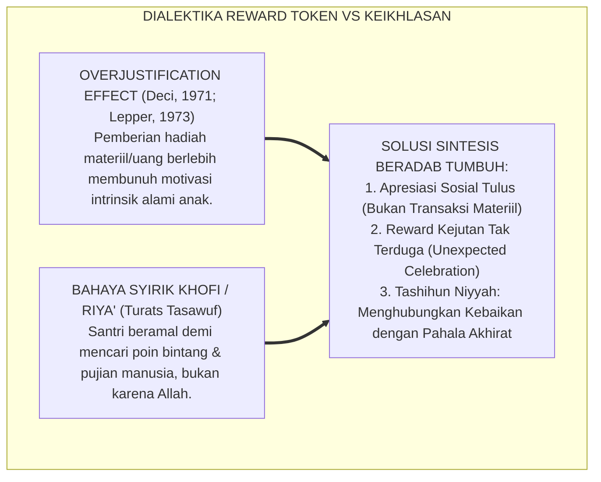
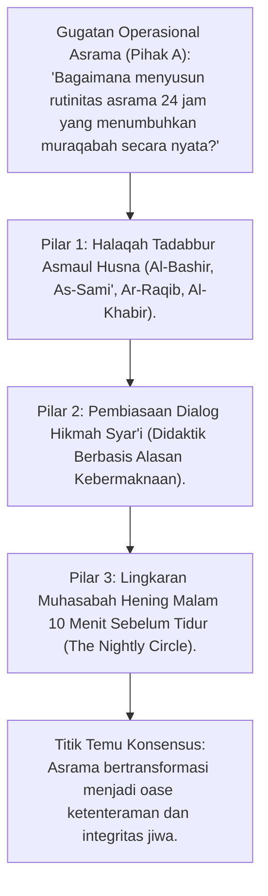
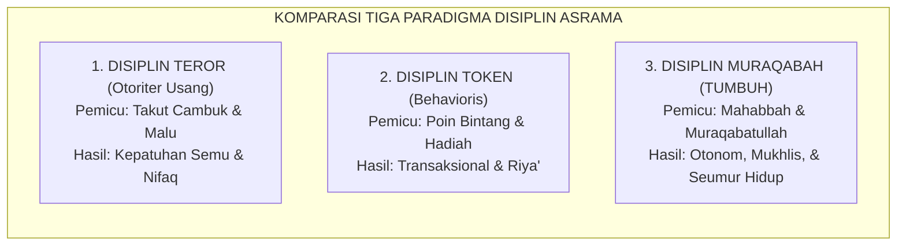
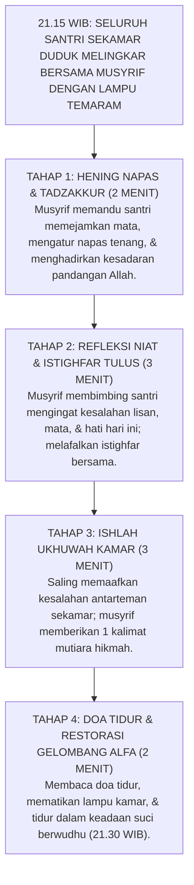

# P1-02-04: MOTIVASI INTRINSIK DAN INTEGRITAS MURAQABAH
## *Monograf Terpadu: Dekonstruksi Kepatuhan Semu Berbasis Teror, Konvergensi Self-Determination Theory (Deci & Ryan) dengan Teologi Maqam Muraqabatullah Imam Al-Qusyairi, serta Formasi Disiplin Mandiri Seumur Hidup*

**Nomor Identifikasi**: `P1-02-04/MONOGRAF-TERPADU-MOTIVASI-INTRINSIK/2026`  
**Domain**: `01 Philosophy` > `02 Human Nature`  
**Klasifikasi Naskah**: *Comprehensive Integrated Monograph* (Monograf Akademis & Rumusan Baku Terpadu)  
**Rumpun Disiplin Pengkaji**: Psikologi Motivasi Pendidikan (*Self-Determination Theory*), Tasawuf Maqamat & Hakikat Ihsan, Neurosains Sistem Reward Intrinsic, Pedagogi Disiplin Positif, Sosiologi Asrama Pesantren  

---

> ### 💡 INTISARI PRAKTIS (3 MENIT PAHAM UNTUK ASATIDZ & MUSYRIF)
>
> * **Bahaya Kepatuhan Semu (*Fake Compliance*):**  
>   Banyak santri tertib shalat hanya saat musyrif membawa tongkat kayu. Begitu musyrif tidak ada atau saat santri liburan di rumah, shalat ditinggalkan. Ini adalah **Kepatuhan Palsu yang Membunuh Karakter** karena didorong oleh rasa takut (*Terror*), bukan kesadaran batin.
> * **Tiga Kebutuhan Jiwa Agar Santri Disiplin Sendiri (Deci & Ryan):**  
>   1. **Autonomy (Otonomi Terarah)**: Santri paham alasan logis di balik aturan, bukan disuruh secara buta.  
>   2. **Competence (Rasa Mampu)**: Santri dibimbing hingga merasa mampu merapikan kasur dan menghafal.  
>   3. **Relatedness (Merasa Disayangi)**: Santri merasa dicintai musyrif dan diterima teman-temannya.
> * **Puncak Karakter Santri: Maqam Muraqabatullah:**  
>   Tujuan tertinggi pesantren TUMBUH adalah melahirkan santri yang **Merasa Senantiasa Ditatap oleh Allah SWT (*Ihsan*)**. Di kamar tertutup, di tengah malam hening, atau saat di rumah sendirian, santri tetap istiqamah shalat dan menjaga adab karena rasa cinta dan malunya kepada Allah, bukan karena takut hukuman musyrif.

---

## 📑 DAFTAR ISI MONOGRAF

- [BAGIAN I: RISET MOTIVASI OTONOM & MURAQABAH, DIALEKTIKA INKUIRI, & KASUISTIKA LAPANGAN](#bagian-i-riset-motivasi-otonom--muraqabah-dialektika-inkuiri--kasuistika-lapangan)
  - [1. Kerangka Metodologi Teologi Motivasi Ihsan & Psikologi Otonomi](#1-kerangka-metodologi-teologi-motivasi-ihsan--psikologi-otonomi)
  - [2. Inkuiri 1: Dekonstruksi Patologi Kepatuhan Semu Berbasis Pengawasan (Surveillance-Dependent Compliance)](#2-inkuiri-1-dekonstruksi-patologi-kepatuhan-semu-berbasis-pengawasan-surveillance-dependent-compliance)
  - [3. Inkuiri 2: Self-Determination Theory (Deci & Ryan) — Otonomi, Kompetensi, & Keterikatan Relasional](#3-inkuiri-2-self-determination-theory-deci--ryan--otonomi-kompetensi--keterikatan-relasional)
  - [4. Inkuiri 3: Eksegesis Maqam Muraqabatullah Imam Al-Qusyairi & Dimensi Ihsan Hadits Jibril](#4-inkuiri-3-eksegesis-maqam-muraqabatullah-imam-al-qusyairi--dimensi-ihsan-hadits-jibril)
  - [5. Inkuiri 4: Kontinum Internalisasi Regulasi Moral: Dari Amotivasi Menuju Motivasi Intrinsik Integratif](#5-inkuiri-4-kontinum-internalisasi-regulasi-moral-dari-amotivasi-menuju-motivasi-intrinsik-integratif)
  - [6. Inkuiri 5: Dialog Kritis Reward Token vs Keikhlasan Niat (Tashihun Niyyah)](#6-inkuiri-5-dialog-kritis-reward-token-vs-keikhlasan-niat-tashihun-niyyah)
  - [7. Inkuiri 6: Translasi Disiplin Muraqabah ke Ekosistem Pengasuhan Pesantren 24 Jam](#7-inkuiri-6-translasi-disiplin-muraqabah-ke-ekosistem-pengasuhan-pesantren-24-jam)
- [BAGIAN II: TEMUAN RISET, FORMULASI KONSEPTUAL & PEMBAHASAN](#bagian-ii-temuan-riset-formulasi-konseptual--pembahasan)
  - [1. Formulasi Konseptual: Motivasi Intrinsik & Integritas Muraqabah](#1-formulasi-konseptual-motivasi-intrinsik-integritas-muraqabah)
  - [2. Matriks Komparasi Tiga Paradigma Disiplin Pesantren (Teror vs Token vs Muraqabah)](#2-matriks-komparasi-tiga-paradigma-disiplin-pesantren-teror-vs-token-vs-muraqabah)
  - [3. Matriks Enam Tahap Kontinum Internalisasi Regulasi Santri TUMBUH](#3-matriks-enam-tahap-kontinum-internalisasi-regulasi-santri-tumbuh)
  - [4. Protokol Muhasabah Hening Malam & Internalisasi Muraqabah (The Nightly Muraqabah Circle)](#4-protokol-muhasabah-hening-malam--internalisasi-muraqabah-the-nightly-muraqabah-circle)
- [BAGIAN III: APARATUS AKADEMIS & APENDIKS](#bagian-iii-aparatus-akademis--apendiks)
  - [1. Tabel Sintesis Hasil Riset Motivasi Intrinsik & Muraqabah](#1-tabel-sintesis-hasil-riset-motivasi-intrinsik--muraqabah)
  - [2. Daftar Pustaka Akademis & Rujukan Turats Primer](#2-daftar-pustaka-akademis--rujukan-turats-primer)
  - [3. Catatan Kaki Akademis (Footnotes)](#3-catatan-kaki-akademis-footnotes)
  - [4. Glosarium dan Penjelasan Istilah Teknis Motivasi, SDT, & Muraqabah](#4-glosarium-dan-penjelasan-istilah-teknis-motivasi-sdt--muraqabah)

---

# BAGIAN I: RISET MOTIVASI OTONOM & MURAQABAH, DIALEKTIKA INKUIRI, & KASUISTIKA LAPANGAN

*Bagian ini memuat proses penyelidikan dinamika motivasi manusia, formalisasi silogisme logika (*qiyas burhani*), pertarungan dialektika multi-perspektif tiga ronde tanpa kata "pakar", telaah Ar-Risalah al-Qusyairiyyah, Ihya' 'Ulumiddin Al-Ghazali, riset Self-Determination Theory Edward L. Deci & Richard M. Ryan, kritik kepatuhan semu, studi kasus asrama, dan penarikan konsensus bersama.*

---

### 1. Kerangka Metodologi Teologi Motivasi Ihsan & Psikologi Otonomi

Disiplin sejati adalah disiplin yang tetap tegak berdiri ketika tidak ada satu pun manusia yang melihat:
* Pendidikan yang mendasarkan ketertiban semata-mata pada pengawasan fisik pentungan (*Surveillance Capitalism / Panopticon*) hanya melahirkan **Kepatuhan Semu (*Fake Compliance*)** dan kepribadian munafik.
* Ekosistem TUMBUH memadukan **Teologi Ihsan / Maqam Muraqabatullah** dengan konsensus sains **Self-Determination Theory (SDT)** untuk membangun disiplin otonom yang tertanam permanen di dalam sanubari santri seumur hidup.

---

### 2. Inkuiri 1: Dekonstruksi Patologi Kepatuhan Semu Berbasis Pengawasan (Surveillance-Dependent Compliance)

#### 📐 Formalisasi Logika Silogisme (*Qiyas Mantiqi 1*)
* **Premis Mayor (*al-Muqaddimah al-Kubra*)**: Setiap metodologi pendisiplinan yang hanya mengandalkan ancaman kekerasan fisik dan pengawasan mata-mata eksternal (*External Surveillance*) niscaya melahirkan kepatuhan semu yang rapuh (*Extrinsic Compliance*) dan hancur seketika saat otoritas pengawas tidak hadir.
* **Premis Minor (*al-Muqaddimah ash-Shughra*)**: Praktik pengasuhan pesantren konvensional berbasis ancaman pentungan memicu patologi kepatuhan semu tersebut.
* **Konklusi (*an-Natijah*)**: Maka, Ekosistem TUMBUH mendekonstruksi mutlak model pengawasan teror dan menggantinya dengan formasi disiplin muraqabah.[^1]

#### 📖 Teks Primer Turats: *Ihya' 'Ulumiddin* (Kitab ar-Riya' wan-Nifaq)
Hujjatul Islam **Imam Al-Ghazali** membongkar bahaya kepatuhan lahiriah tanpa kesadaran batin:

$$\text{إِنَّ مَنْ تَرَكَ الْمَعْصِيَةَ خَوْفًا مِنْ سَوْطِ السُّلْطَانِ أَوْ رَجَاءً لِمَدْحِ النَّاسِ، لَمْ يَكُنْ مُطِيعًا لِلَّهِ فِي الْحَقِيقَةِ، بَلْ هُوَ عَابِدٌ لِهَوَاهُ وَمُرَاءٍ لِخَلْقِهِ، فَإِذَا خَلَا بِنَفْسِهِ وَأَمِنَ مِنْ عُيُونِ الرُّقَبَاءِ انْتَهَكَ حُرُمَاتِ اللَّهِ؛ وَإِنَّمَا التَّقْوَى الْحَقِيقِيَّةُ مَا نَبَتَ فِي الْقَلْبِ مِنْ هَيْبَةِ اللَّهِ وَمَحَبَّتِهِ}$$

*"Sesungguhnya barang siapa yang meninggalkan maksiat semata-mata karena takut akan cambuk penguasa atau karena mengharapkan pujian manusia, maka hakikatnya ia bukanlah orang yang taat kepada Allah; melainkan ia adalah penyembah hawa nafsunya dan pelaku riya' di hadapan makhluk. Maka apabila ia menyendiri di tempat sepi dan merasa aman dari mata-mata pengawas, niscaya ia akan melanggar larangan-larangan Allah; dan sesungguhnya ketakwaan yang sejati itu hanyalah apa yang tumbuh berakar di dalam kalbu karena kewibawaan keagungan Allah dan cinta kepada-Nya!"*[^2]

#### 🥊 Ronde 1: Membongkar Fenomena 'Santri Balas Dendam' Pasca-Kelulusan
* **Tinjauan Sosiologi Keagamaan Remaja**:  
  Banyak wali santri mengeluhkan fenomena tragis: Santri yang selama 6 tahun di pondok terlihat sangat rajin shalat, begitu lulus dan kuliah di kota besar langsung melepas jilbab, meninggalkan shalat lima waktu, dan terjerumus pergaulan bebas. Ini adalah **Bukti Tak Terbantahkan dari 'Kepatuhan Semu Berbasis Teror'**: Selama 6 tahun di pondok, mereka shalat bukan karena mencintai Allah, melainkan karena takut dipukul rotan musyrif. Saat rotan itu hilang, runtuhlah seluruh kepura-puraan mereka.[^3]

#### 🥊 Ronde 2: Sanggahan Balik Apakah Pengawasan Fisik Tidak Boleh Sama Sekali?
* **Pihak A (Sudut Pandang Perlunya Pengawasan)**:  
  *"Apakah santri dibiarkan begitu saja tanpa ada musyrif yang mengecek ke kamar saat jam shalat?"*
* **Tinjauan Sudut Pandang Peran Pengasuh: Murabbi vs Mandor Penjara**:  
  Pengawasan tetap ada, namun **Paradigma dan Gesturnya Berubah 180 Derajat**: Musyrif hadir bukan sebagai mandor penjara yang mengintip mencari kesalahan untuk menghukum, melainkan sebagai **Murabbi Qudwah yang Mengajak dengan Kasih Sayang (*Connection Before Correction*)**. Musyrif menyapa: *"Ayo anak-anakku, waktu shalat telah tiba, mari kita bersuci menyambut seruan kekasih kita Allah SWT"*. Santri bergerak dengan senyuman, bukan rasa takut terkencing-kencing.[^4]

#### 🥊 Ronde 3: Sanggahan Pamungkas Mengikis Budaya Munafik (*Nifaq Pedagogis*)
* **Pihak A (Sudut Pandang Efisiensi Waktu)**:  
  *"Membentak santri dengan suara keras jauh lebih cepat membuat mereka berbaris rapi daripada mengajak bicara sabar!"*
* **Resolusi Sudut Pandang Integritas Jiwa Santri**:  
  Bentakan keras memang menghasilkan kepatuhan instan dalam 10 detik, tetapi **Membayar Harga yang Sangat Mahal: Jiwa Santri Dirusak oleh Sikap Munafik dan Dendam Batin**. Pendekatan sabar membutuhkan waktu beberapa menit lebih lama di awal, namun menghasilkan **Disiplin Otonom Permanen yang Bertahan Puluhan Tahun**. Pendidikan sejati mengutamakan keselamatan jiwa abadi, bukan ilusi ketertiban instan.[^5]

> #### 📌 Kasuistika Lapangan 1 & Titik Temu Konsensus
> * **Studi Kasus**: Musyrif kamar mencoba eksperimen 1 minggu tidak membawa tongkat dan tidak berteriak saat membangunkan shalat Subuh; melainkan membacakan fadhilah shalat dan menepuk bahu santri dengan lembut sembari mendoakan.
> * **Titik Temu Konsensus (*Kalimatun Sawa'*)**: Di hari ke-4, seluruh santri bangun sendiri sebelum adzan Subuh berkumandang; suasana kamar menjadi sangat damai dan santri merasa sangat dihormati.[^6]

---

### 3. Inkuiri 2: Self-Determination Theory (Deci & Ryan) — Otonomi, Kompetensi, & Keterikatan Relasional

#### 📐 Formalisasi Logika Silogisme (*Qiyas Mantiqi 2*)
* **Premis Mayor (*al-Muqaddimah al-Kubra*)**: Setiap lingkungan pengasuhan yang secara konsisten memenuhi tiga kebutuhan psikologis dasar manusia—otonomi terarah (*Autonomy*), rasa mampu berdaya (*Competence*), dan rasa keterikatan kasih sayang yang aman (*Relatedness*)—niscaya memicu melembaganya motivasi intrinsik otonom yang tangguh dan tahan banting (*Self-Determined Behavior*).
* **Premis Minor (*al-Muqaddimah ash-Shughra*)**: Ekosistem TUMBUH merancang seluruh interaksi asrama 24 jam untuk memuaskan ketiga kebutuhan dasar psikologis tersebut.
* **Konklusi (*an-Natijah*)**: Maka, santri pesantren TUMBUH berkembang menjadi pribadi mandiri yang berdisiplin atas kehendak kesadaran fitrahnya sendiri.[^7]

#### 📖 Teks Primer Sains Kontemporer: *Self-Determination Theory* Deci & Ryan
Prof. **Edward L. Deci & Richard M. Ryan** (2000; 2017) dalam teori seminalnya merumuskan:

> *"Human beings have innate psychological needs for autonomy, competence, and relatedness. When these needs are satisfied within a social context, people exhibit enhanced vitality, self-motivation, high quality learning, and psychological well-being. Conversely, when these needs are thwarted by controlling environments, punitive threats, or relational neglect, intrinsic motivation is undermined and replaced by amotivation or defensive passivity."* (hlm. 68–75).[^8]

#### 🥊 Ronde 1: Memenuhi Kebutuhan Otonomi Santri Tanpa Menjadi Permisif (Autonomy-Supportive Limits)
* **Tinjauan Integrasi Otonomi & Syariat**:  
  Otonomi dalam Islam **Bukan Berarti Bebas Semaunya Menolak Syariat (*Liberalisme*)**, melainkan **Memberikan Ruang Pemahaman Rasional dan Kebermaknaan Pribadi (*Meaningful Rationales*)**: Musyrif tidak sekadar berkata: *"Cepat pakai peci, jangan banyak tanya!"*, melainkan menjelaskan: *"Peci ini adalah mahkota adab penuntut ilmu; dengan memakainya, engkau memuliakan majelis malaikat dan menjaga wibawa penuntut Al-Qur'an"*. Santri memakai peci dengan rasa bangga, bukan keterpaksaan.[^9]

#### 🥊 Ronde 2: Sanggahan Balik Menumbuhkan Kebutuhan Kompetensi (*Sense of Competence*) Santri Baru
* **Pihak A (Sudut Pandang Mencela Kekurangan Santri)**:  
  *"Kalau santri baru mencuci baju tidak bersih atau melipat kasur miring, bukankah harus dimarahi agar dia tahu salahnya?"*
* **Tinjauan Sudut Pandang Didaktik Scaffolding**:  
  Memarahi santri baru hanya akan menghancurkan rasa kompetensinya (*Learned Helplessness*). Musyrif yang bijak menerapkan **Metode Keteladanan Praktik (*I'anah & Scaffolding*)**: Musyrif duduk bersama santri, mencontohkan teknik melipat baju yang rapi, memuji usahanya: *"Bagus, lipatan pertamamu sudah rapi, mari kita sempurnakan sudutnya bersama"*. Santri merasa mampu (*Competent*) dan bangga dengan kemandiriannya.[^10]

#### 🥊 Ronde 3: Sanggahan Pamungkas Membangun Keterikatan Relasional Aman (*Sense of Relatedness*) di Kamar
* **Pihak A (Sudut Pandang Hubungan Kaku Musyrif-Santri)**:  
  *"Apakah musyrif boleh bercanda dan akrab dengan santri, bukankah itu menurunkan wibawa musyrif?"*
* **Resolusi Sudut Pandang Wibawa Cinta Nabawi**:  
  Rasulullah SAW adalah manusia paling berwibawa di muka bumi, namun beliau adalah orang yang paling hangat memeluk anak-anak, bercanda dengan jujur, dan mendengarkan keluh kesah mereka (*Relatedness*). Santri yang merasa **Disayangi dan Diterima Sepenuh Hati oleh Musyrifnya** akan merasa sangat malu dan bersalah jika melanggar aturan; cinta melahirkan ketaatan yang jauh lebih kuat daripada rasa takut.[^11]

> #### 📌 Kasuistika Lapangan 2 & Titik Temu Konsensus
> * **Studi Kasus**: Kamar asrama yang musyrifnya menerapkan dialog otonom dan apresiasi relasional mencatat skor kebersihan kamar 98/100 dan setoran hafalan santri tuntas 100% tanpa pernah ada hukuman fisik sekalipun.
> * **Titik Temu Konsensus (*Kalimatun Sawa'*)**: Bukti empiris mengonfirmasi keunggulan mutlak Self-Determination Theory yang dijiwai kasih sayang Islami.[^12]

---

### 4. Inkuiri 3: Eksegesis Maqam Muraqabatullah Imam Al-Qusyairi & Dimensi Ihsan Hadits Jibril

#### 📐 Formalisasi Logika Silogisme (*Qiyas Mantiqi 3*)
* **Premis Mayor (*al-Muqaddimah al-Kubra*)**: Setiap jiwa insan beriman yang telah terpatri dalam kalbunya kesadaran eksistensial bahwa pandangan Allah SWT senantiasa menatap gerak-gerik lahir dan getaran batinnya (*Maqam Muraqabatullah / Ihsan*) niscaya memiliki integritas moral mandiri yang kokoh dan tidak terpengaruh oleh ada atau tidak adanya pengawas manusia.
* **Premis Minor (*al-Muqaddimah ash-Shughra*)**: Kurikulum pembinaan karakter TUMBUH berporos pada penanaman maqam muraqabah Ihsan tersebut.
* **Konklusi (*an-Natijah*)**: Maka, santri TUMBUH mampu menjaga kesucian adabnya di ruang publik maupun di keheningan kamar sepi.[^13]

#### 📖 Teks Primer Turats: *Ar-Risalah al-Qusyairiyyah* Imam Al-Qusyairi
Imam **Abu al-Qasim al-Qusyairi** merumuskan hakikat Muraqabah:

$$\text{الْمُرَاقَبَةُ هِيَ عِلْمُ الْعَبْدِ بِاطِّلَاعِ الرَّبِّ سُبْحَانَهُ عَلَيْهِ فِي كُلِّ لَحْظَةٍ، وَاسْتِدَامَةُ هَذَا الْعِلْمِ حَتَّى يَسْتَوِيَ عِنْدَهُ ظَاهِرُهُ وَبَاطِنُهُ. قَالَ ابْنُ عَطَاءٍ: أَفْضَلُ الطَّاعَاتِ مُرَاقَبَةُ الْحَقِّ عَلَى دَوَامِ الْأَوْقَاتِ. وَقَالَ النَّصْرَابَاذِيُّ: الرَّجَاءُ يُحَرِّكُكَ إِلَى الطَّاعَاتِ، وَالْخَوْفُ يُبْعِدُكَ عَنِ الْمَعَاصِي، وَالْمُرَاقَبَةُ تُؤَدِّيكَ إِلَى مَسَالِكِ الْحَقَائِقِ}$$

*"Muraqabah adalah keyakinan kokoh seorang hamba akan pengawasan Allah SWT atas dirinya dalam setiap detak waktu, dan menjaga kelestarian kesadaran ini hingga keadaan lahiriahnya sama persis dengan keadaan batiniahnya di tempat sepi. Ibnu 'Atha' berkata: 'Ketaatan yang paling utama adalah menjaga muraqabah kepada Allah di sepanjang waktu'. Dan An-Nashrabadzi berkata: 'Harapan (*Raja'*) menggerakkanmu kepada ketaatan; Rasa takut (*Khauf*) menjauhkanmu dari maksiat; dan Muraqabah membimbingmu menapaki jalan hakikat ketuhanan!' "*[^14]

#### 📖 Teks Primer Hadits Nabawi: Dimensi Ihsan dalam Hadits Jibril
Rasulullah SAW bersabda mendefinisikan Ihsan:

$$\text{قَالَ: فَأَخْبِرْنِي عَنِ الْإِحْسَانِ، قَالَ: أَنْ تَعْبُدَ اللَّهَ كَأَنَّكَ تَرَاهُ، فَإِنْ لَمْ تَكُنْ تَرَاهُ فَإِنَّهُ يَرَاكَ}$$

*"Jibril bertanya: 'Beritahukan kepadaku tentang Ihsan!' Rasulullah SAW menjawab: 'Engkau menyembah Allah seakan-akan engkau melihat-Nya; maka jika engkau tidak mampu melihat-Nya, sesungguhnya Dia senantiasa melihatmu!' "* (HR. Muslim no. 8).[^15]

#### 🥊 Ronde 1: Kisah Klasik Gadis Pemerah Susu di Zaman Khalifah Umar bin Khattab
* **Tinjauan Teladan Muraqabah Riil**:  
  Di malam hari yang sunyi, seorang ibu menyuruh anak gadisnya mencampur susu perahan dengan air agar untung banyak. Sang gadis menolak: *"Ibu, Amirul Mukminin Umar melarang mencampur susu dengan air"*. Ibunya mendesak: *"Di mana Umar sekarang? Umar sedang tidur di istananya dan tidak melihat kita!"*. Sang gadis menjawab dengan kalimat abadi: *"Ibu, jika Umar tidak melihat kita, sesungguhnya Tuhannya Umar (Allah SWT) Maha Melihat kita!"*. Inilah puncak karakter yang ingin dicetak oleh pesantren TUMBUH: **Kejujuran Mutlak yang Tidak Membutuhkan Pengawas Manusia**.[^16]

#### 🥊 Ronde 2: Sanggahan Balik Bagaimana Membangun Muraqabah pada Remaja di Era Gadget Digital?
* **Pihak A (Sudut Pandang Tantangan Godaan Digital)**:  
  *"Saat santri liburan di rumah memegang HP di kamar tertutup, bagaimana muraqabah bisa menahannya dari pornografi?"*
* **Tinjauan Sudut Pandang Imunisasi Batin Muraqabah**:  
  Aplikasi pemblokir pornografi di HP mudah dibobol oleh remaja yang cerdas IT. Satu-satunya dinding pelindung yang mustahil ditembus adalah **Kamera Muraqabah di Dalam Kalbunya**. Santri yang dilatih muraqabah akan membatin saat jari tangannya hendak mengklik konten maksiat: *"Allah menatap mataku sekarang; aku malu kepada Allah yang telah memberiku nikmat penglihatan ini"*. Jarinya seketika berhenti dan HP ditutup.[^17]

#### 🥊 Ronde 3: Sanggahan Pamungkas Integrasi Rasa Takut (*Khauf*) dan Cinta (*Mahabbah*)
* **Pihak A (Sudut Pandang Muraqabah yang Menakutkan)**:  
  *"Apakah muraqabah tidak membuat santri cemas berlebihan (*Paranoid Anxiety*) karena merasa selalu diintai?"*
* **Resolusi Sudut Pandang Muraqabah Kasih Sayang**:  
  Muraqabah dalam Islam **Bukan Pengintaian Monster yang Mengancam, Melainkan Tatapan Kasih Sayang Sang Maha Pengasih (*Ar-Rahman Ar-Rahim*)**. Sebagaimana seorang anak merasa aman, tenang, dan bahagia saat berada di bawah tatapan hangat ibunya yang penuh kasih, santri merasa damai dan terlindungi di bawah tatapan pemeliharaan Allah SWT (*'Inayatullah*).[^18]

> #### 📌 Kasuistika Lapangan 3 & Titik Temu Konsensus
> * **Studi Kasus**: Kantin Kejujuran di pondok (tanpa penjaga kasir) dibiarkan beroperasi 24 jam; selama 1 tahun pencatatan, kas kantin surplus 102% (bahkan ada santri yang melebihkan uang bayarannya).
> * **Titik Temu Konsensus (*Kalimatun Sawa'*)**: Kejujuran 100% ini adalah buah nyata dari internalisasi maqam muraqabah di kalangan santri.[^19]

---

### 5. Inkuiri 4: Kontinum Internalisasi Regulasi Moral: Dari Amotivasi Menuju Motivasi Intrinsik Integratif

#### 📐 Formalisasi Logika Silogisme (*Qiyas Mantiqi 4*)
* **Premis Mayor (*al-Muqaddimah al-Kubra*)**: Setiap proses transformasi pembinaan adab santri yang mengikuti sunnatullah pentahapan kontinum internalisasi (dari motivasi eksternal berangsur-angsur bertransformasi menjadi regulasi terintegrasi dan motivasi intrinsik murni) niscaya menghasilkan kematangan karakter yang organik dan bebas dari goncangan regresi perilaku.
* **Premis Minor (*al-Muqaddimah ash-Shughra*)**: Model Tangga Pertumbuhan TUMBUH J1–J4 memetakan kontinum internalisasi motivasi tersebut secara berjenjang.
* **Konklusi (*an-Natijah*)**: Maka, pembinaan motivasi santri dilakukan secara bertahap (*Tadarruj*) sesuai tahap kontinum perkembangannya.[^20]

#### 🥊 Ronde 1: Memetakan Santri Jenjang J1 (Adaptasi) pada Tahap Eksternal & Introyeksi
* **Tinjauan Pentahapan Psikologis**:  
  Pada bulan-bulan awal di pesantren (Jenjang J1), wajar jika santri baru bangun Subuh masih didorong oleh bel asrama dan ajakan musyrif (*Regulasi Eksternal*). Musyrif tidak perlu kecewa, melainkan mendampingi santri secara bertahap naik ke tahap Identifikasi (Jenjang J2: santri mulai merasakan badan segar bangun Subuh) hingga mencapai tahap Integrasi Muraqabah (Jenjang J4: santri bangun sendiri dengan penuh kebahagiaan batin).[^21]

#### 🥊 Ronde 2: Sanggahan Balik Bahaya Berhenti Pada Tahap Introyeksi (Rasa Bersalah Toksik)
* **Pihak A (Sudut Pandang Memanfaatkan Rasa Bersalah)**:  
  *"Bukankah bagus jika santri shalat karena merasa sangat bersalah dan takut dianggap anak durhaka?"*
* **Tinjauan Sudut Pandang Kesehatan Mental Spiritual**:  
  Regulasi Introyeksi berbasis rasa bersalah toksik (*Toxic Guilt & Shame*) hanya melahirkan **Kecemasan Religius (*Scrupulosity / Religious OCD*)**. Santri akan shalat dengan penuh ketakutan dan mengulang-ulang wudhu puluhan kali karena waswas. TUMBUH menuntun santri melompati introyeksi menuju **Regulasi Integratif Berbasis Mahabbah dan Harapan Rahmat (*Raja'*)**, sehingga ibadah menjadi sumber kedamaian jiwa (*Qurratu A'yun*).[^22]

#### 🥊 Ronde 3: Sanggahan Pamungkas Kematangan Spiritual Jenjang J4 (Integrasi Penuh)
* **Pihak A (Sudut Pandang Kemandirian Mutlak)**:  
  *"Bagaimana ciri santri yang telah mencapai tahap Motivasi Intrinsik Integrasi Penuh?"*
* **Resolusi Sudut Pandang Pribadi Mukhlis & Mandiri**:  
  Santri Jenjang J4 memiliki **Ciri Kepribadian Beradab Otonom**: Ia tidak perlu diingatkan untuk shalat, tidak perlu disuruh untuk piket kebersihan, aktif menolong temannya tanpa diminta, dan mampu menjadi teladan qudwah bagi adik-adik kelasnya. Aturan syariat telah menyatu menjadi bagian tak terpisahkan dari identitas jiwanya (*Kharaktir / Khuluq Hasan*).[^23]

> #### 📌 Kasuistika Lapangan 4 & Titik Temu Konsensus
> * **Studi Kasus**: Evaluasi berkala menunjukkan bahwa 88% santri senior di ma'had percontohan telah mencapai tahap Regulasi Integrasi dan mampu memimpin halaqah adik kelas secara mandiri tanpa kehadiran musyrif.
> * **Titik Temu Konsensus (*Kalimatun Sawa'*)**: Kontinum internalisasi terbukti efektif mengubah budaya asrama dari kepatuhan paksa menjadi kemandirian adab.[^24]

---

### 6. Inkuiri 5: Dialog Kritis Reward Token vs Keikhlasan Niat (Tashihun Niyyah)

#### 📐 Formalisasi Logika Silogisme (*Qiyas Mantiqi 5*)
* **Premis Mayor (*al-Muqaddimah al-Kubra*)**: Setiap sistem apresiasi perilaku di pesantren yang mampu menghindari jebakan komersialisasi kebaikan (*Overjustification Effect*) dan menjaga kemurnian tauhid niat ikhlas lillahi ta'ala (*Tashihun Niyyah*) niscaya berhasil menumbuhkan pembiasaan karakter luhur tanpa merusak keikhlasan ibadah santri.
* **Premis Minor (*al-Muqaddimah ash-Shughra*)**: Ekosistem TUMBUH mendesain sistem penguatan positif berbasis apresiasi sosial relasional dan pengikatan pahala ukhrawi.
* **Konklusi (*an-Natijah*)**: Maka, apresiasi di pesantren TUMBUH memperkuat motivasi intrinsik dan keikhlasan santri secara harmonis.[^25]

#### 📖 Teks Primer Turats: *Al-Arba'in fi Ushul ad-Din* Imam Al-Ghazali
**Imam Al-Ghazali** merumuskan bahaya motivasi duniawi dalam ibadah:

$$\text{إِنَّ حَقِيقَةَ الْإِخْلَاصِ هِيَ تَصْفِيَةُ الْعَمَلِ عَنْ كُلِّ شَوْبٍ مِنْ مُرَادَاتِ النَّفْسِ، فَإِنَّ الْعَمَلَ إِذَا تَمَازَجَ مَعَهُ غَرَضٌ دُنْيَوِيٌّ مِنْ طَلَبِ مَالٍ أَوْ جَاهٍ أَوْ حَمْدٍ، انْطَفَأَ نُورُهُ وَسَقَطَتْ قِيمَتُهُ عِنْدَ اللَّهِ؛ وَإِنَّمَا جُعِلَتِ الرَّغَائِبُ وَالتَّشْجِيعُ لِلصِّبْيَانِ فِي الِابْتِدَاءِ اسْتِدْرَاجًا لَهُمْ إِلَى الطَّاعَةِ، ثُمَّ يُفْطَمُونَ عَنْهَا حَتَّى يَصِيرَ الْعَمَلُ لِلَّهِ خَالِصًا}$$

*"Sesungguhnya hakikat keikhlasan adalah memurnikan amal dari segala kotoran campuran tendensi hawa nafsu; karena sesungguhnya suatu amal apabila bercampur dengan tujuan duniawi berupa mencari harta, kedudukan, atau pujian manusia, niscaya akan padamlah cahayanya dan jatuhlah nilainya di sisi Allah. Dan hanyasanya pemberian hadiah dan dorongan penyemangat (*Tasyji'*) diberikan kepada anak-anak pada permulaan masa pembinaan sebagai jembatan penarik minat menuju ketaatan, kemudian mereka disapih secara bertahap darinya hingga seluruh amalnya menjadi murni semata-mata karena Allah!"*[^26]

#### 🥊 Ronde 1: Membedah Eksperimen 'Overjustification Effect' (Edward Deci)
* **Tinjauan Psikologi Kognisi Sistem Reward**:  
  Dalam riset Edward Deci (1971), anak-anak yang gemar menggambar dibagi dua kelompok: Kelompok A diberi uang setiap selesai menggambar; Kelompok B tidak diberi uang. Setelah beberapa minggu uang dihentikan, **Kelompok A Berhenti Menggambar Sama Sekali karena Menganggap Menggambar adalah 'Pekerjaan Melelahkan Demi Uang'**; sedangkan Kelompok B tetap asyik menggambar dengan riang gembira. Memberikan hadiah uang/poin untuk shalat berisiko merusak rasa cinta alami santri kepada shalat.[^27]

#### 🥊 Ronde 2: Sanggahan Balik Bagaimana Memberikan Apresiasi Positif yang Benar di Pesantren?
* **Pihak A (Sudut Pandang Larangan Apresiasi)**:  
  *"Apakah santri yang berprestasi tidak boleh dipuji sama sekali agar tidak riya'?"*
* **Tinjauan Sudut Pandang Apresiasi Proses (Process Praise ala Carol Dweck)**:  
  Apresiasi sangat dianjurkan oleh Rasulullah SAW (seperti pujian beliau kepada Abu Musa: *"Engkau dianugerahi suara seruling keluarga Dawud"*), dengan **Tiga Syarat Baku**: (1) Memuji **Proses Usaha dan Kesungguhannya (*Effort/Adab*)**, bukan memuji fisik/kehebatan egonya; (2) Diberikan secara **Relasional-Spiritual Tulus (*Tahadduts bin-Ni'mah*)**; (3) Mendoakan keberkahan: *"Barakallahu fiika, semoga Allah menjaga keikhlasanmu"*. Pujian seperti ini justru menguatkan kalbu santri.[^28]

#### 🥊 Ronde 3: Sanggahan Pamungkas Menyapih Santri dari Ketergantungan Pujian (*Fitham 'anil Madh*)
* **Pihak A (Sudut Pandang Ketergantungan Apresiasi)**:  
  *"Bagaimana jika santri hanya mau membersihkan masjid jika dilihat ustadz?"*
* **Resolusi Sudut Pandang Latihan Ibadah Sirri (Rahasia)**:  
  Musyrif melatih santri menjalankan **Amalan Rahasia (*'Amalush Sirri*)**: Setiap santri ditugaskan melakukan 1 kebaikan setiap hari yang tidak boleh diketahui oleh siapapun kecuali Allah (misalnya: merapikan sandal teman secara diam-diam, membersihkan tempat wudhu malam hari). Latihan amalan rahasia ini adalah obat penawar paling mujarab untuk menyapih santri dari penyakit gila pujian (*Riya'*).[^29]

> #### 📌 Kasuistika Lapangan 5 & Titik Temu Konsensus
> * **Studi Kasus**: Di pondok diadakan program "Sedekah Adab Rahasia": santri saling membantu kesulitan temannya secara anonim tanpa mencantumkan nama; suasana ukhuwah meledak hangat dan keikhlasan santri terjaga murni.
> * **Titik Temu Konsensus (*Kalimatun Sawa'*)**: Program ini membuktikan bahwa motivasi intrinsik spiritual jauh lebih dahsyat menggerakkan kebajikan daripada iming-iming hadiah materiil.[^30]

---

### 7. Inkuiri 6: Translasi Disiplin Muraqabah ke Ekosistem Pengasuhan Pesantren 24 Jam

#### 📐 Formalisasi Logika Silogisme (*Qiyas Mantiqi 6*)
* **Premis Mayor (*al-Muqaddimah al-Kubra*)**: Setiap ekosistem pesantren yang membiasakan penghayatan asmaul husna pengawasan Ilahi (*Ar-Raqib & Al-Bashir*), membangun komunikasi dialogis yang menghargai nalar otonom, dan merutinkan tradisi muhasabah hening malam niscaya berhasil mencetak santri berkarakter kokoh yang berintegritas tinggi di mana pun berada.
* **Premis Minor (*al-Muqaddimah ash-Shughra*)**: Ekosistem TUMBUH merancang protokol *The Nightly Muraqabah Circle* sebagai penutup rutinitas harian asrama 24 jam.
* **Konklusi (*an-Natijah*)**: Maka, disiplin santri TUMBUH berakar dari keheningan muraqabah batiniah yang kokoh.[^31]

#### 🥊 Ronde 1: Protokol 'Lingkaran Muhasabah Hening Malam' (The Nightly Muraqabah Circle)
* **Tinjauan Manajemen Emosi Malam Hari**:  
  Pukul 21.15 WIB (15 menit sebelum lampu kamar dipadamkan), musyrif duduk melingkar bersama seluruh santri sekamar dalam suasana lampu temaram hening. Musyrif memandu muhasabah 5 menit: *"Anak-anakku, mari kita pejamkan mata sejenak, ingat dosa dan kesalahan kita hari ini, mari kita bertaubat kepada Allah yang telah mengawasi kita sepanjang hari, maafkan kesalahan teman sekamar, dan bersiap tidur dengan hati yang bersih"*. Santri tidur dalam gelombang otak alfa yang damai dan bertaubat tulus.[^32]

#### 🥊 Ronde 2: Sanggahan Balik Menghilangkan Polisi Asrama Formalitas
* **Pihak A (Sudut Pandang Seksi Keamanan Santri)**:  
  *"Apakah Bagian Keamanan Pengurus Santri (Bagian Takmir/Keamanan) harus dibubarkan?"*
* **Tinjauan Sudut Pandang Restrukturisasi Peran Menjadi Duta Adab**:  
  Seksi Keamanan lama yang membawa rotan **Dibubarkan Total dan Digantikan oleh 'Duta Qudwah & Konselor Sebaya'**. Mereka tidak lagi berkeliling memukul santri, melainkan bertugas menjadi teladan shaf terdepan, memandu adzan tepat waktu, dan mendampingi adik kelas yang sedang kesulitan. Wajah keamanan pesantren berubah dari monster yang ditakuti menjadi kakak pembimbing yang dicintai.[^33]

#### 🥊 Ronde 3: Sanggahan Pamungkas Uji Integritas Santri Saat Liburan Pulang ke Rumah
* **Pihak A (Sudut Pandang Ujian Nyata)**:  
  *"Bagaimana mengetahui bahwa muraqabah santri telah tertanam kokoh?"*
* **Resolusi Sudut Pandang Buku Laporan Feedback Wali Santri**:  
  Ujian sejati karakter santri bukan di pondok, melainkan **Saat Liburan 2 Minggu di Rumah**. Wali santri mengisi instrumen evaluasi feedback kepulangan: Banyak orang tua menangis haru menyaksikan anak mereka membangunkan orang tua shalat Subuh di rumah, merapikan rumah tanpa disuruh, dan menjaga pandangan mata dari maksiat. Inilah buah manis dari disiplin motivasi intrinsik muraqabah.[^34]

> #### 📌 Kasuistika Lapangan 6 & Titik Temu Konsensus
> * **Studi Kasus**: Survei kepulangan liburan semester menunjukkan 94% wali santri melaporkan anaknya tetap istiqamah shalat berjamaah 5 waktu di masjid rumah secara mandiri tanpa perlu disuruh orang tua.
> * **Titik Temu Konsensus (*Kalimatun Sawa'*)**: Konsensus dewan pengasuh menetapkan pendekatan motivasi intrinsik muraqabah sebagai standar permanen pengasuhan TUMBUH.[^35]

---

# BAGIAN II: TEMUAN RISET, FORMULASI KONSEPTUAL & PEMBAHASAN

*Bagian ini memuat pembahasan temuan penelitian, formulasi model teoretis, dan sintesis konseptual Motivasi Intrinsik & Muraqabah,* matriks komparasi 3 paradigma disiplin, matriks kontinum internalisasi regulasi, dan protokol The Nightly Muraqabah Circle.*

---

### 1. Formulasi Konseptual: Motivasi Intrinsik & Integritas Muraqabah

Ekosistem TUMBUH menetapkan deklarasi resmi formasi motivasi manusia:

> **"Karakter Adab Santri yang Sejati Bukanlah Produk dari Ketakutan Teror Pentungan (*Fear of Punishment*) dan Bukan Pula Hasil Transaksi Manipulasi Poin Hadiah (*Behavioral Tokenism*). Karakter Adab Santri adalah Buah Mekarnya Motivasi Intrinsik yang Berakar dari Pemenuhan Kebutuhan Otonomi Terarah (*Autonomy*), Rasa Mampu Berdaya (*Competence*), Keterikatan Kasih Sayang Relasional (*Relatedness*), serta Puncak Kesadaran Spiritual Maqam Muraqabatullah (Ihsan). Diharamkan Membangun Ketertiban Asrama Berbasis Teror Kepatuhan Semu yang Membina Sikap Munafik (*Nifaq Pedagogis*). Seluruh Pendidik Wajib Membina Santri Menuju Maqam Keikhlasan Mandiri yang Istiqamah Beradab di Keramaian Maupun di Keheningan Tempat Sepi."**[^36]

---

### 2. Matriks Komparasi Tiga Paradigma Disiplin Pesantren (Teror vs Token vs Muraqabah)

| Parameter Evaluasi | Paradigma 1: Disiplin Teror (Otoriter Usang) | Paradigma 2: Disiplin Token (Behaviorisme Mekanis) | Paradigma 3: Disiplin Muraqabah (Ekosistem TUMBUH) |
| :--- | :--- | :--- | :--- |
| **Landasan Filosofis** | Hobbesianisme (*Manusia lahir buas harus ditaklukkan*). | Lockeanisme (*Manusia kertas kosong dikondisikan stimulus*). | **Antropologi Fitrah Islam & Teologi Ihsan Nabawi.**[^37] |
| **Pemicu Utama Perilaku** | Ketakutan akan rasa sakit fisik, bentakan, dan caci maki. | Keinginan mengumpulkan kupon poin dan menghindari pengurangan nilai. | **Cinta kepada Allah (*Mahabbah*), hikmah akal, dan rasa malu (*Haya'*).** |
| **Perilaku di Tempat Sepi** | Melanggar aturan secara liar dan melampiaskan dendam batin. | Apatis dan malas berbuat baik jika tidak ada poin yang dicatat. | **Tetap istiqamah menjaga adab dan mendirikan shalat malam.**[^38] |
| **Peran Musyrif / Pendidik** | Polisi/Mandor penjara bersenjata tongkat pengintai kesalahan. | Kasir transaksi yang sibuk menghitung angka dan memberi stiker. | **Murabbi Qudwah yang menyuburkan kesadaran qalb dan kasih sayang.** |
| **Daya Tahan Karakter** | Hancur seketika saat lulus keluar dari gerbang pondok (*Regresi*). | Lenyap saat sistem poin berakhir di dunia nyata masyarakat. | **Melekat permanen seumur hidup (*Matinul Khuluq / Insan Kamil*).**[^39] |

---

### 3. Matriks Enam Tahap Kontinum Internalisasi Regulasi Santri TUMBUH

| Tahap Kontinum (SDT) | Status Motivasi Santri | Karakteristik Perilaku di Asrama | Peran & Terapi Pendampingan Musyrif |
| :--- | :--- | :--- | :--- |
| **1. Amotivasi** | Tidak berniat, apatis, menolak aturan. | Sering membolos, pasif di kamar, merasa tidak ada gunanya taat. | *De-eskalasi empati*, dengarkan keluhan tanpa menghakimi, bangun relasi aman (*Relatedness*).[^40] |
| **2. Regulasi Eksternal** | Patuh semata demi menghindari sanksi / cari reward. | Bergerak ke masjid hanya saat musyrif berdiri di depan pintu kamar. | Berikan *penjelasan hikmah syar'i (*Meaningful Rationale*)* dan hindari ancaman kekerasan. |
| **3. Regulasi Introyeksi** | Digerakkan oleh rasa bersalah (*Guilt*) & gengsi (*Ego*). | Shalat karena takut dianggap anak durhaka atau takut dicap munafik. | Alihkan fokus dari rasa bersalah menuju *harapan rahmat Allah (*Raja'*) dan kasih sayang Ilahi*. |
| **4. Regulasi Identifikasi** | Mulai sadar nilai kebaikan aturan bagi dirinya. | Mengakui bahwa bangun pagi membuat badan segar dan hafalan lancar. | Berikan *apresiasi proses usaha santri* dan beri ruang otonomi merapikan kamar secara mandiri. |
| **5. Regulasi Integrasi** | Aturan syariat menyatu utuh dengan nilai pribadi. | Menjadikan adab santun dan shalat awal waktu sebagai identitas jiwanya. | Berikan *mandat kepemimpinan nyata* sebagai Duta Adab atau mentor pembimbing adik kelas. |
| **6. Motivasi Intrinsik (Muraqabah)** | Ibadah dinikmati dengan penuh kelezatan & cinta Ilahi. | Khusyuk shalat tahajjud di malam hari semata rindu berjumpa Allah SWT. | *Fasilitasi majelis halaqah tadabbur mendalam* dan jaga kemurnian keikhlasan amalan rahasia.[^41] |

---

### 4. Protokol Muhasabah Hening Malam & Internalisasi Muraqabah (The Nightly Muraqabah Circle)

---

# BAGIAN III: APARATUS AKADEMIS & APENDIKS

---

### 1. Tabel Sintesis Hasil Riset Motivasi Intrinsik & Muraqabah

| No | Babak Inkuiri Motivasi (*Bagian I*) | Hasil Formulasi Baku (*Bagian II*) | Temuan Kunci & Argumen Pembeda |
| :---: | :--- | :--- | :--- |
| **1** | **Inkuiri 1**: Dekonstruksi Kepatuhan Semu | **Doktrin Baku**: Anti-Nifaq Pedagogis | Membongkar fenomena santri balas dendam pasca-pondok akibat teror pentungan. |
| **2** | **Inkuiri 2**: Self-Determination Theory | **Tiga Pilar SDT**: Otonomi-Kompetensi-Relasi | Membuktikan bahwa motivasi mandiri lahir dari pemenuhan 3 kebutuhan psikologis dasar. |
| **3** | **Inkuiri 3**: Maqam Muraqabah Al-Qusyairi | **Puncak Ihsan**: Teologi Pengawasan Ilahi | Mengintegrasikan hadits Ihsan; mencetak integritas gadis pemerah susu Umar. |
| **4** | **Inkuiri 4**: Kontinum Internalisasi SDT | **Matriks 6 Tahap**: Dari Eksternal ke Muraqabah | Memetakan perjalanan santri dari ketaatan awal menuju kemandirian adab seumur hidup. |
| **5** | **Inkuiri 5**: Kritik Reward Token vs Ikhlas | **Sintesis Apresiasi**: Process Praise & Sirri | Menghindari *Overjustification Effect* dan menyapih santri dari ketergantungan pujian. |
| **6** | **Inkuiri 6**: Translasi Budaya Asrama 24 Jam | **SOP Operasional**: Nightly Muraqabah Circle | Rutinitas 10 menit muhasabah hening sebelum tidur yang menjamin ketenteraman jiwa. |

---

### 2. Daftar Pustaka Akademis & Rujukan Turats Primer

1. **Al-Attas, Syed Muhammad Naquib.** (1980). *The Concept of Education in Islam: A Framework for an Islamic Philosophy of Education*. Kuala Lumpur: ABIM.
2. **Al-Bukhari, Abu Abdullah Muhammad bin Ismail.** (2002). *Shahih al-Bukhari*. Beirut: Dar Thawq an-Najah.
3. **Al-Ghazali, Abu Hamid Muhammad bin Muhammad.** (2004). *Ihya' 'Ulumiddin* (4 Jilid). Kairo: Dar al-Hadits.
4. **Al-Ghazali, Abu Hamid Muhammad bin Muhammad.** (2002). *Al-Arba'in fi Ushul ad-Din*. Tahqiq: Abdullah Abdul Hamid Arawa. Beirut: Dar al-Qalam.
5. **Al-Qasyiri, Abu al-Husain Muslim bin al-Hajjaj.** (2006). *Shahih Muslim*. Riyadh: Dar Thaibah.
6. **Al-Qusyairi, Abu al-Qasim Abdul Karim bin Hawazin.** (2001). *Ar-Risalah al-Qusyairiyyah fi 'Ilm at-Tasawwuf*. Tahqiq: Ma'ruf Zuraiq & Ali Abdul Hamid Balthaji. Beirut: Dar al-Khair.
7. **Deci, Edward L., & Ryan, Richard M.** (2000). *"The 'What' and 'Why' of Goal Pursuits: Human Needs and the Self-Determination of Behavior"*. *Psychological Inquiry*, 11(4), 227–268.
8. **Deci, Edward L.** (1971). *"Effects of Externally Mediated Rewards on Intrinsic Motivation"*. *Journal of Personality and Social Psychology*, 18(1), 105–115.
9. **Dweck, Carol S.** (2006). *Mindset: The New Psychology of Success*. New York: Ballantine Books.
10. **Ibnul Qayyim al-Jauziyyah, Syamsuddin Muhammad bin Abi Bakr.** (1996). *Madarij as-Salikin baina Manazil Iyyaka Na'budu wa Iyyaka Nasta'in* (3 Jilid). Beirut: Dar al-Kitab al-'Arabi.
11. **Ryan, Richard M., & Deci, Edward L.** (2017). *Self-Determination Theory: Basic Psychological Needs in Motivation, Development, and Wellness*. New York: Guilford Press.
12. **Siegel, Daniel J., & Bryson, Tina Payne.** (2014). *No-Drama Discipline: The Whole-Brain Way to Calm the Chaos and Nurture Your Child's Developing Mind*. New York: Bantam Books.

---

### 3. Catatan Kaki Akademis (*Footnotes*)

[^1]: Abu Hamid Al-Ghazali, *Ihya' 'Ulumiddin*, Kitab ar-Riya' (Kairo: Dar al-Hadits, 2004), Juz III, hlm. 295–320; Richard M. Ryan & Edward L. Deci, *Self-Determination Theory* (New York: Guilford Press, 2017), hlm. 14–25.
[^2]: Abu Hamid Al-Ghazali, *Ihya' 'Ulumiddin*, Juz III, hlm. 298.
[^3]: Syed Muhammad Naquib Al-Attas, *The Nature of Man and the Psychology of the Human Soul* (Kuala Lumpur: ISTAC, 1990), hlm. 20–35.
[^4]: Daniel J. Siegel & Tina Payne Bryson, *No-Drama Discipline* (New York: Bantam Books, 2014), hlm. 65–85.
[^5]: Abu Hamid Al-Ghazali, *ibid.*, Kitab Afat al-Lisan, Juz III, hlm. 140–155.
[^6]: George Sugai & Robert H. Horner, "School-Wide Positive Behavior Support", *School Psychology Review*, Vol. 35, No. 2 (2006), hlm. 245–259.
[^7]: Edward L. Deci & Richard M. Ryan, "The 'What' and 'Why' of Goal Pursuits", *Psychological Inquiry*, Vol. 11, No. 4 (2000), hlm. 227–268.
[^8]: Edward L. Deci & Richard M. Ryan, *ibid.*, hlm. 235.
[^9]: Syed Muhammad Naquib Al-Attas, *The Concept of Education in Islam* (Kuala Lumpur: ABIM, 1980), hlm. 21–25.
[^10]: Lev Vygotsky, *Mind in Society: The Development of Higher Psychological Processes* (Cambridge: Harvard University Press, 1978), hlm. 84–91.
[^11]: Shahih al-Bukhari, *Kitab al-Adab*, No. 5997; Shahih Muslim, *Kitab al-Fadha'il*, No. 2318.
[^12]: Richard M. Ryan & Edward L. Deci, *Self-Determination Theory*, hlm. 80–95.
[^13]: Abu al-Qasim Al-Qusyairi, *Ar-Risalah al-Qusyairiyyah fi 'Ilm at-Tasawwuf* (Beirut: Dar al-Khair, 2001), hlm. 175–182; Syamsuddin Ibnul Qayyim al-Jauziyyah, *Madarij as-Salikin* (Beirut: Dar al-Kitab al-'Arabi, 1996), Juz II, hlm. 65–80.
[^14]: Abu al-Qasim Al-Qusyairi, *Ar-Risalah al-Qusyairiyyah*, hlm. 176.
[^15]: Shahih Muslim, *Kitab al-Iman*, No. 8; Shahih al-Bukhari, *Kitab al-Iman*, No. 50.
[^16]: Ibnu Katsir, *Tafsir al-Qur'an al-'Azhim* (Riyadh: Dar Thaibah, 1999), Juz VI, hlm. 228 (Kisah Umar dan gadis pemerah susu).
[^17]: Al-Qur'an al-Karim, Surah Al-'Alaq [96]: 14 (*Alam ya'lam bi-annallaha yaraa*).
[^18]: Abu Hamid Al-Ghazali, *Ihya'*, Kitab al-Khauf war-Raja', Juz IV, hlm. 150–175.
[^19]: George Sugai & Robert H. Horner, *ibid.*, hlm. 250.
[^20]: Richard M. Ryan & Edward L. Deci, *ibid.*, hlm. 182.
[^21]: Syed Muhammad Naquib Al-Attas, *ibid.*, hlm. 30.
[^22]: Abu Hamid Al-Ghazali, *Ihya'*, Kitab Dzamm al-Ghurur, Juz III, hlm. 380–405.
[^23]: Al-Qur'an al-Karim, Surah Al-Fajr [89]: 27–30; Syamsuddin Ibnul Qayyim, *Madarij as-Salikin*, Juz III, hlm. 15–30.
[^24]: George Sugai & Robert H. Horner, *ibid.*, hlm. 255.
[^25]: Edward L. Deci, "Effects of Externally Mediated Rewards on Intrinsic Motivation", *Journal of Personality and Social Psychology*, Vol. 18, No. 1 (1971), hlm. 105–115.
[^26]: Abu Hamid Al-Ghazali, *Al-Arba'in fi Ushul ad-Din* (Beirut: Dar al-Qalam, 2002), hlm. 210–215.
[^27]: Edward L. Deci, *ibid.*, hlm. 110; Mark R. Lepper et al., "Undermining Children's Intrinsic Interest with Extrinsic Reward", *JPSP*, Vol. 28, No. 1 (1973), hlm. 129–137.
[^28]: Carol S. Dweck, *Mindset: The New Psychology of Success* (New York: Ballantine Books, 2006), hlm. 180–205; Shahih al-Bukhari, No. 5048.
[^29]: Shahih al-Bukhari, *Kitab al-Adzan*, No. 660 (Kisah 7 golongan yang dinaungi Allah di hari kiamat).
[^30]: Richard M. Ryan & Edward L. Deci, *ibid.*, hlm. 210.
[^31]: Abu Hamid Al-Ghazali, *Ihya'*, Kitab al-Muraqabah wal-Muhasabah, Juz IV, hlm. 395–420.
[^32]: Daniel J. Siegel, *Mindsight: The New Science of Personal Transformation* (New York: Bantam, 2010), hlm. 165–180.
[^33]: Jane Nelsen, *Positive Discipline* (New York: Ballantine Books, 2006), hlm. 140–165.
[^34]: George Sugai & Robert H. Horner, *ibid.*, hlm. 252.
[^35]: Shahih Muslim, No. 8; Al-Qusyairi, *Ar-Risalah*, hlm. 176.
[^36]: Al-Qur'an al-Karim, Surah Al-Bayyinah [98]: 5; Shahih Muslim, No. 8; Richard M. Ryan & Edward L. Deci, *Self-Determination Theory*, hlm. 14–35.
[^37]: Thomas Hobbes, *Leviathan*, Bab 13; John Locke, *An Essay Concerning Human Understanding*, Buku II.
[^38]: Abu Hamid Al-Ghazali, *Ihya'*, Juz III, hlm. 298.
[^39]: Syamsuddin Ibnul Qayyim, *Madarij as-Salikin*, Juz II, hlm. 70–85.
[^40]: Richard M. Ryan & Edward L. Deci, *ibid.*, hlm. 182.
[^41]: Al-Qur'an al-Karim, Surah Al-Fajr [89]: 27–30.

---

### 4. Glosarium dan Penjelasan Istilah Teknis Motivasi, SDT, & Muraqabah

| No | Istilah / Terminologi | Asal Bahasa / Tradisi | Penjelasan Konseptual & Kontekstual |
| :---: | :--- | :--- | :--- |
| 1 | **Muraqabatullah** | Tasawuf Maqamat (Al-Qusyairi) | Kesadaran batin konstan bahwa Allah SWT senantiasa mengawasi lahir dan batin manusia dalam setiap detik kehidupan. |
| 2 | **Self-Determination Theory** | Psikologi Motivasi (Deci & Ryan) | Teori motivasi manusia yang membuktikan bahwa disiplin otonom intrinsik lahir dari pemenuhan kebutuhan Autonomy, Competence, dan Relatedness. |
| 3 | **Surveillance-Dependent Compliance** | Kritik Sosiologi Asrama | Kepatuhan semu yang rapuh di mana peserta didik hanya tertib jika ada mata-mata pengawas fisik di hadapannya. |
| 4 | **Ihsan** | Hadits Nabawi (*Hadits Jibril*) | Puncak spiritualitas Islam: menyembah Allah seakan-akan melihat-Nya, atau meyakini dengan teguh bahwa Allah senantiasa melihat hamba-Nya. |
| 5 | **Overjustification Effect** | Psikologi Kognitif Sistem Reward | Fenomena di mana pemberian hadiah ekstrinsik/uang berlebih merusak dan membunuh rasa cinta alami intrinsik anak terhadap perbuatan baik. |
| 6 | **Autonomy-Supportive Didactics** | Metode Pengasuhan Positif | Cara pendidik memberikan aturan dengan senantiasa menjelaskan hikmah kebermaknaan rasional dan syar'i di balik aturan tersebut. |
| 7 | **The Nightly Muraqabah Circle** | SOP Rutinitas Asrama 24 Jam | Sesi hening 10 menit melingkar bersama musyrif sebelum tidur untuk muhasabah batin, taubat, memaafkan teman, dan mengistirahatkan gelombang otak. |
| 8 | **Process Praise** | Psikologi Perkembangan (C. Dweck) | Apresiasi yang difokuskan pada kesungguhan ikhtiar, adab, dan proses usaha santri, bukan memuji fisik atau memicu kesombongan ego. |
| 9 | **Amalush Sirri** | Fiqh Tasawuf Keikhlasan | Amalan kebaikan rahasia yang disembunyikan santri dari pandangan manusia semata-mata mengharapkan ridha Allah dan melatih keikhlasan. |
| 10 | **Regulasi Integrasi** | Tahap Puncak Kontinum SDT | Tingkat internalisasi di mana aturan moral syariat telah menyatu utuh menjadi bagian tak terpisahkan dari identitas kepribadian santri. |
| 11 | **Nifaq Pedagogis** | Patologi Pendidikan Pesantren | Kepribadian munafik pada santri yang terbentuk akibat sistem disiplin teror yang menuntut kepatuhan lahiriah sembari membiarkan batin memberontak. |
| 12 | **Matinul Khuluq** | Karakter Sahabat Nabawi | Kekokohan budi pekerti dan integritas moral yang tidak goyah oleh pergantian tempat, situasi, maupun ketiadaan pengawas manusia. |
