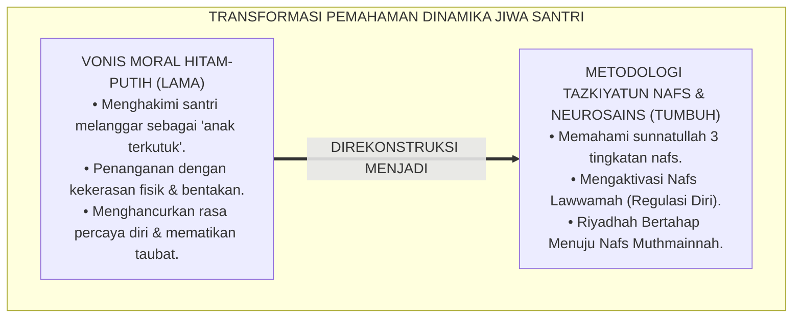
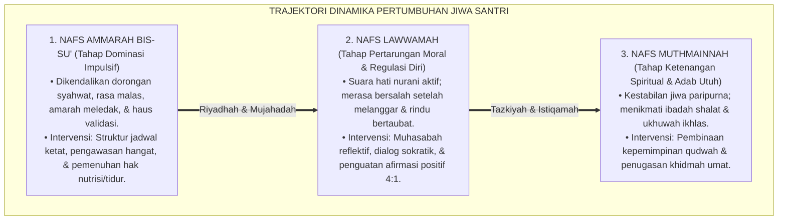
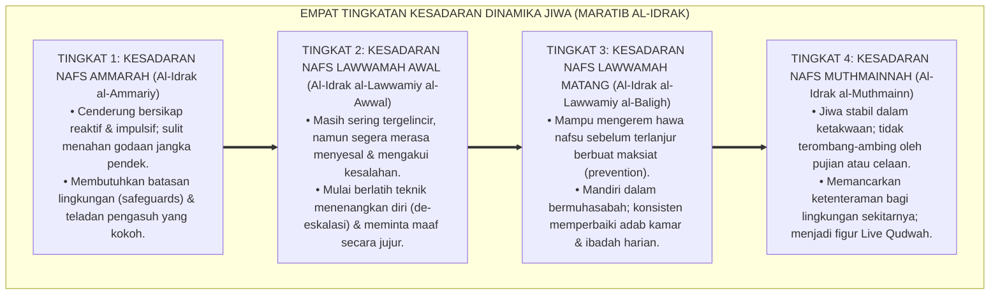
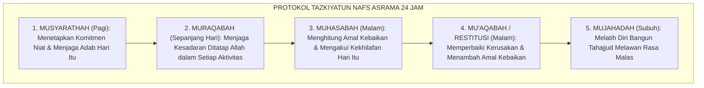
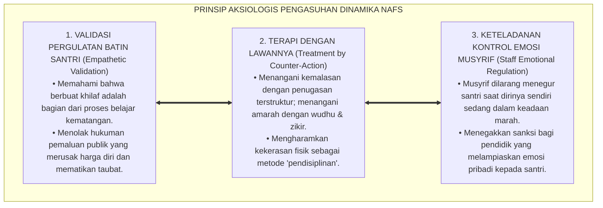

# P1-02-05: DINAMIKA NAFS AMMARAH, LAWWAMAH, DAN MUTHMAINNAH (THE PSYCHODYNAMICS OF NAFS)
## *Monograf Riset Akademik: Epistemologi Tiga Tingkatan Jiwa (QS. Yusuf: 53, Al-Qiyamah: 2, & Al-Fajr: 27–28), Integrasi Neurosains Dual-Systems Model & Kematangan Prefrontal Cortex, Metodologi Riyadhah Tazkiyatun Nafs Al-Ghazali, Serta Terapi Adab di Pesantren 24 Jam*

**Nomor Identifikasi**: `P1-02-05/MONOGRAF-RISET-DINAMIKA-NAFS/2026`  
**Domain**: `01 Philosophy` > `02 Human Nature` (Sub-Modul 05: *Dynamics of Nafs*)  
**Klasifikasi Naskah**: *Academic Research Monograph* (Monograf Riset Akademik Fondasional)  
**Rumpun Disiplin Pengkaji**: Psikologi Islam (*'Ilm an-Nafs al-Islami*), Neurosains Afektif & Kognitif, Filsafat Etika Moral (*Tahdzib al-Akhlaq*), Psikologi Perkembangan Remaja, Manajemen Pengasuhan Asrama  

---

> ### 💡 INTISARI EKSEKUTIF (EXECUTIVE SUMMARY)
>
> * **Kelemahan Paradigma Lama: Pandangan Statis & Stigmatisasi Pelanggaran:**  
>   Banyak pengasuh memandang santri secara biner yang kaku: santri yang rajin dianggap "anak suci", sedangkan santri yang melanggar langsung divonis "anak rusak/terkutuk". Pandangan ini mengabaikan sunnatullah dinamika pergulatan jiwa manusia (*Khaula wa Idbarun Nafs*).
> * **Inovasi Konseptual: Tiga Tingkatan Nafs & Integrasi Neurosains Dual-Systems:**  
>   TUMBUH membedah anatomi tiga keadaan jiwa: **1. Nafs Ammarah bis-Su' (Dorongan Biologis & Impuls Amigdala); 2. Nafs Lawwamah (Radar Suara Hati, Regulasi Diri, & Prefrontal Cortex); 3. Nafs Muthmainnah (Kestabilan Spiritual, Ketenangan Batin, & Kenikmatan Adab)**. Pendidik bertindak sebagai dokter jiwa yang mengaktivasi potensi *Lawwamah* menuju *Muthmainnah*.
> * **Formulasi Operasional & Pembuktian Lapangan:**  
>   Monograf ini menguraikan matriks integrasi tiga tingkatan nafs, 4 Tingkatan Kesadaran Dinamika Jiwa (*Maratib al-Idrak*), protokol tazkiyah harian musyrif-santri, dan etika tata kelola disiplin restoratif 24 jam.

---

## 📑 DAFTAR ISI MONOGRAF

- [BAB I: LANDASAN TEORETIS & DISKURSUS KRITIS](#bab-i-landasan-teoretis--diskursus-kritis)
  - [1. Latar Belakang Masalah: Krisis Pandangan Statis dan Patologi Vonis Hitam-Putih](#1-latar-belakang-masalah-krisis-pandangan-statis-dan-patologi-vonis-hitam-putih)
  - [2. Eksegesis Turats Tiga Tingkatan Nafs: QS. Yusuf: 53, Al-Qiyamah: 2, & Al-Fajr: 27–28](#2-eksegesis-turats-tiga-tingkatan-nafs-qs-yusuf-53-al-qiyamah-2--al-fajr-2728)
  - [3. Konvergensi Neurosains Afektif: Dual-Systems Model & Kesenjangan Maturasi Prefrontal-Limbik](#3-konvergensi-neurosains-afektif-dual-systems-model--kesenjangan-maturasi-prefrontal-limbik)
  - [4. Metodologi Riyadhah & Mujahadatun Nafs dalam Khazanah Al-Ghazali dan Ibnu Qayyim](#4-metodologi-riyadhah--mujahadatun-nafs-dalam-khazanah-al-ghazali-dan-ibnu-qayyim)
  - [5. Kasuistika Lapangan: Ledakan Impuls Remaja & Resolusi Restoratif Terpadu](#5-kasuistika-lapangan-ledakan-impuls-remaja--resolusi-restoratif-terpadu)
- [BAB II: FORMULASI KONSEPTUAL & PEMBAHASAN MENDALAM](#bab-ii-formulasi-konseptual--pembahasan-mendalam)
  - [1. Eksplanasi Teoretis Dinamika Tiga Tingkat Nafs Santri Pembelajar](#1-eksplanasi-teoretis-dinamika-tiga-tingkat-nafs-santri-pembelajar)
  - [2. Dekomposisi Dimensi & Empat Tingkatan Kesadaran Dinamika Jiwa (Maratib al-Idrak)](#2-dekomposisi-dimensi--empat-tingkatan-kesadaran-dinamika-jiwa-maratib-al-idrak)
  - [3. Protokol Tazkiyatun Nafs Harian Musyrif & Santri (Muhasabah & Riyadhah 24 Jam)](#3-protokol-tazkiyatun-nafs-harian-musyrif--santri-muhasabah--riyadhah-24-jam)
  - [4. Prinsip Aksiologis & Etika Tata Kelola Terapi Jiwa di Pesantren 24 Jam](#4-prinsip-aksiologis--etika-tata-kelola-terapi-jiwa-di-pesantren-24-jam)
  - [5. Diskusi Filosofis Mendalam & Implikasi bagi Masa Depan Peradaban Pendidikan Islam](#5-diskusi-filosofis-mendalam--implikasi-bagi-masa-depan-peradaban-pendidikan-islam)
- [BAB III: KESIMPULAN & APARATUS AKADEMIS](#bab-iii-kesimpulan--aparatus-akademis)
  - [1. Tabel Sintesis Temuan Riset Dinamika Nafs Insani](#1-tabel-sintesis-temuan-riset-dinamika-nafs-insani)
  - [2. Daftar Pustaka Akademis & Rujukan Turats Primer](#2-daftar-pustaka-akademis--rujukan-turats-primer)
  - [3. Catatan Kaki Akademis (Footnotes)](#3-catatan-kaki-akademis-footnotes)
  - [4. Glosarium Istilah Ilmiah & Turats Dinamika Jiwa](#4-glosarium-istilah-ilmiah--turats-dinamika-jiwa)

---

# BAB I: LANDASAN TEORETIS & DISKURSUS KRITIS

---

### 1. Latar Belakang Masalah: Krisis Pandangan Statis dan Patologi Vonis Hitam-Putih

Banyak problematika pengasuhan asrama bersumber dari pemahaman psikologis yang keliru:
* **Penilaian Moral Hitam-Putih**: Santri yang sedang mengalami gejolak emosi pubertas dicap sebagai anak pembangkang yang tidak punya harapan bertobat. Pengurus gagal melihat bahwa di balik pelanggaran tersebut terdapat pergulatan batin yang sengit (*Internal Moral Struggle*).
* **Mengabaikan Hukum Kematangan Biologis**: Sistem saraf remaja memiliki karakteristik khusus: bagian emosi (*Amigdala*) berkembang lebih dini dibanding bagian kontrol rasional (*Prefrontal Cortex*). Membentak dan memukul santri saat emosinya meluap justru mematikan fungsi nalar dan memperkuat naluri pemberontakan.
* **Keniscayaan Metodologi Tazkiyah Ilmiah**: Islam menyediakan peta jalan penyucian jiwa (*Tazkiyatun Nafs*) yang sistematis, menuntun santri melewati fase gejolak hewani menuju ketenteraman jiwa yang bertakwa.[^1]

---

### 2. Eksegesis Turats Tiga Tingkatan Nafs: QS. Yusuf: 53, Al-Qiyamah: 2, & Al-Fajr: 27–28

Al-Qur'an secara eksplisit mengklasifikasikan tiga tingkatan kondisi jiwa:

1. **Nafs Ammarah bis-Su' (Jiwa yang Mengajak Kejahatan)**:
   $$\text{وَمَا أُبَرِّئُ نَفْسِي ۚ إِنَّ النَّفْسَ لَأَمَّارَةٌ بِالسُّوءِ إِلَّا مَا رَحِمَ رَبِّي ۚ إِنَّ رَبِّي غَفُورٌ رَّحِيمٌ}$$
   *"Dan aku tidak (menyatakan) diriku bebas dari kesalahan, karena sesungguhnya nafsu itu selalu mendorong kepada kejahatan, kecuali nafsu yang diberi rahmat oleh Tuhanku. Sesungguhnya Tuhanku Maha Pengampun lagi Maha Penyayang."* (QS. Yusuf [12]: 53).[^2]

2. **Nafs Lawwamah (Jiwa yang Menyesal dan Mengkritik Diri)**:
   $$\text{وَلَا أُقْسِمُ بِالنَّفْسِ اللَّوَّامَةِ}$$
   *"Dan aku bersumpah demi jiwa yang amat menyesali (dirinya sendiri setelah berbuat dosa)."* (QS. Al-Qiyamah [75]: 2).[^3]

3. **Nafs Muthmainnah (Jiwa yang Tenang dalam Ketaatan)**:
   $$\text{يَا أَيَّتُهَا النَّفْسُ الْمُطْمَئِنَّةُ ارْجِعِي إِلَىٰ رَبِّكِ رَاضِيَةً مَّرْضِيَّةً فَادْخُلِي فِي عِبَادِي وَادْخُلِي جَنَّتِي}$$
   *"Wahai jiwa yang tenang! Kembalilah kepada Tuhanmu dengan hati yang ridha lagi diridhai-Nya. Maka masuklah ke dalam golongan hamba-hamba-Ku, dan masuklah ke dalam surga-Ku."* (QS. Al-Fajr [89]: 27–30).[^4]

---

### 3. Konvergensi Neurosains Afektif: Dual-Systems Model & Kesenjangan Maturasi Prefrontal-Limbik

Sains neurobiologi kontemporer (Casey et al., 2008; Steinberg, 2014) mengonfirmasi pemetaan Turats melalui **Model Sistem Ganda (*Dual-Systems Model*)**:
* **Sistem Sosio-Emosional / Limbik (Nafs Ammarah)**: Matang pada awal masa pubertas (usia 11–14 tahun), memicu pencarian sensasi, sensitivitas terhadap teman sebaya, dan luapan dorongan impulsif.
* **Sistem Kontrol Kognitif / Prefrontal Cortex (Nafs Lawwamah)**: Mengalami perkembangan bertahap hingga usia 20–25 tahun. 
* Oleh karena itu, pelanggaran santri bukanlah tanda "kerusakan fitrah", melainkan cerminan dari kesenjangan kecepatan maturasi saraf (*Neurodevelopmental Mismatch*) yang membutuhkan pendampingan sabar dan beradab.[^5]

---

### 4. Metodologi Riyadhah & Mujahadatun Nafs dalam Khazanah Al-Ghazali dan Ibnu Qayyim

Imam **Abu Hamid Al-Ghazali** dalam *Ihya' 'Ulumiddin* (Kitab *Riyadhatun Nafs*) menguraikan terapi penyucian jiwa:

$$\text{إِنَّ مُعَالَجَةَ النَّفْسِ تَكُونُ بِضِدِّ مَا تَهْوَاهُ، فَإِنَّ الْمَرَضَ يُعَالَجُ بِضِدِّهِ؛ فَمَنْ غَلَبَتْ عَلَيْهِ شَهْوَةُ الْغَضَبِ عُولِجَ بِالْحِلْمِ وَالْكَظْمِ، وَمَنْ غَلَبَتْ عَلَيْهِ شَهْوَةُ الشَّرَهِ عُولِجَ بِالصِّيَامِ وَالْقَنَاعَةِ}$$

*"**Sesungguhnya terapi penyembuhan nafsu itu adalah dengan melatihnya melakukan hal yang berlawanan dengan hawa nafsunya (*'Ilaj bi adh-Dhidd*)**, karena sesungguhnya penyakit itu diobati dengan lawannya; barangsiapa didominasi oleh nafsu amarah, maka diobati dengan latihan santun (*Hilm*) dan menahan marah (*Kazhm*); dan barangsiapa didominasi nafsu kerakusan, maka diobati dengan puasa dan qana'ah."*[^6]

---

### 5. Kasuistika Lapangan: Ledakan Impuls Remaja & Resolusi Restoratif Terpadu

* **Studi Kasus: Santri Remaja Membanting Lemari karena Kalah Bermain Sepak Bola**  
  * **Dilema**: Santri fase perkembangan remaja awal mengamuk dan menendang pintu lemari hingga penyok saat timnya kalah dalam turnamen olahraga.
  * **Pola Lama**: Santri diseret ke lapangan, dijemur, dan dicap "anak temperamen perusak".
  * **Resolusi Restoratif TUMBUH**: Musyrif membawa santri ke ruang tenang, memberikan air minum, dan membiarkan denyut nadinya stabil. Setelah tenang, konselor mengaktivasi *Nafs Lawwamah*-nya dengan pertanyaan reflektif: *"Apa yang sebenarnya terjadi di hatimu? Apakah merusak pintu membuat timmu menang?"*. Santri menangis menyadari kekhilafannya, meminta maaf kepada teman sekamarnya, dan sukarela memperbaiki engsel lemari yang rusak. Santri diajarkan teknik zikir istirja' saat emosi memuncak.[^7]

---

# BAB II: FORMULASI KONSEPTUAL & PEMBAHASAN MENDALAM

---

### 1. Eksplanasi Teoretis Dinamika Tiga Tingkat Nafs Santri Pembelajar

Ekosistem TUMBUH memetakan trajektori pertumbuhan jiwa ke dalam **Siklus Transformasi Nafs (*Daurat at-Tazkiyah wat-Tarqiyah*)**:

#### 🔬 Pembahasan Mendalam Tiga Keadaan Jiwa:
1. **Nafs Ammarah**: Bukan entitas musuh yang harus dibinasakan, melainkan energi biologis mentah (*Raw Biological Energy*) yang wajib diarahkan dan dijinakkan oleh akal budi.[^8]
2. **Nafs Lawwamah**: Mesin koreksi diri (*Self-Correction Engine*). Keberadaan rasa bersalah dan penyesalan adalah bukti bahwa fitrah santri masih hidup dan bercahaya.[^9]
3. **Nafs Muthmainnah**: Puncak kematangan manusia, di mana dorongan nafsu telah tunduk sepenuhnya kepada kehendak Allah SWT, melahirkan kepribadian yang teduh, sabar, dan penuh kasih sayang.[^10]

---

### 2. Dekomposisi Dimensi & Empat Tingkatan Kesadaran Dinamika Jiwa (Maratib al-Idrak)

Transformasi kedewasaan jiwa santri berlangsung melalui **Empat Tingkatan Kesadaran Dinamika Jiwa (*Maratib al-Idrak an-Nafsiy*)**:

#### 🔄 Narasi Analitis Dinamika Transisi Filosofis Antar-Tingkatan:
* **Transisi Tingkat 1 ke Tingkat 2 (Dari Dominasi Ammarah Menuju Penyesalan Lawwamah)**: Santri mula-mula membela diri saat bersalah. Melalui dialog konseling hangat, santri mulai berani mengakui kekeliruannya dan merasakan penyesalan yang sehat.
* **Transisi Tingkat 2 ke Tingkat 3 (Dari Penyesalan Pasca-Kejadian Menuju Regulasi Diri Preventif)**: Pada tingkatan ketiga, santri memiliki rem moral sebelum bertindak: saat merasa marah, santri langsung berwudhu dan diam menahan lisan.
* **Transisi Tingkat 3 ke Tingkat 4 (Pencapaian Derajat Nafs Muthmainnah)**: Pada tingkatan tertinggi, santri meraih kemerdekaan jiwa: beribadah menjadi kenikmatan batin, berakhlak mulia menjadi karakter otomatis, dan hatinya senantiasa tenteram bersama Allah SWT.[^11]

---

### 3. Protokol Tazkiyatun Nafs Harian Musyrif & Santri (Muhasabah & Riyadhah 24 Jam)

TUMBUH menetapkan **Protokol Tazkiyah Harian 24 Jam**:

Penta-tahapan Tazkiyah ini memastikan bahwa pertumbuhan karakter santri terpelihara secara berkelanjutan setiap hari.[^12]

---

### 4. Prinsip Aksiologis & Etika Tata Kelola Terapi Jiwa di Pesantren 24 Jam

Dinamika nafs melahirkan prinsip etika tata kelola pengasuhan kelembagaan:

#### 📋 Panduan Etika Pengasuhan Lapangan:
1. **Aturan 24 Jam Penundaan Sanksi Emosional**: Musyrif diwajibkan menunda pengambilan keputusan disiplin berat selama 24 jam agar amigdala pengurus dan santri kembali tenang.
2. **Kamar Damai (*Peace Room*)**: Menyediakan fasilitas konseling yang nyaman dan terbebas dari kebisingan untuk sesi muhasabah santri.[^13]
3. **Pelatihan Regulasi Emosi Asatidz**: Memberikan pelatihan neurosains pengasuhan dan teknik mindfulness Islam (*Thuma'ninah*) bagi seluruh jajaran musyrif.[^14]

---

### 5. Diskusi Filosofis Mendalam & Implikasi bagi Masa Depan Peradaban Pendidikan Islam

Penerapan doktrin psikodinamika Islam ini mengantarkan pendidikan pesantren menjadi pusat peradaban ruhani:

* **Mencetak Generasi Pemimpin yang Matang Secara Emosional dan Spiritual**:  
  Pemimpin yang memiliki *Nafs Muthmainnah* tidak akan mudah diprovokasi, tidak haus kekuasaan, dan senantiasa mengutamakan kemaslahatan rakyat dengan kepala dingin dan hati yang jernih.
* **Menyembuhkan Krisis Ledakan Agresivitas Remaja**:  
  Dengan mengganti metode kekerasan dengan metode *Tazkiyatun Nafs*, angka perkelahian, tawuran, dan kenakalan remaja dapat ditekan hingga titik nol (*Zero-Incident*).
* **Membangkitkan Tradisi Keilmuan Kedokteran Jiwa Islam (*Thibbul Qulub*)**:  
  Pesantren membuktikan bahwa khazanah tasawuf klasik Al-Ghazali dan Ibnu Qayyim adalah sains psikoterapi tingkat tinggi yang jauh melampaui teori psikoanalisis Freud yang reduksionis.[^15]

---

# BAB III: KESIMPULAN & APARATUS AKADEMIS

---

### 1. Tabel Sintesis Temuan Riset Dinamika Nafs Insani

| Dimensi Parameter | Mazhab Vonis Hitam-Putih | Mazhab Psikoanalisis Freud | **Dinamika Tazkiyatun Nafs TUMBUH** | Landasan Rujukan Primer | Implikasi Praksis Lapangan |
| :--- | :--- | :--- | :--- | :--- | :--- |
| **Kondisi Jiwa** | Statis: anak baik vs anak jahat. | Determinis: dikendalikan Id hewani.| **Dinamis: Ammarah, Lawwamah, Muthmainnah.**| QS. Yusuf: 53; QS. Al-Qiyamah: 2. | Memvalidasi pergulatan batin santri. |
| **Respon Pelanggaran**| Murka, pukulan rotan, & cap buruk.| Pesimistis; menuruti nafsu naluriah.| **Aktivasi Lawwamah & Riyadhah Adab.** | Al-Ghazali (*Ihya'*); Steinberg (2014).| Dialog sokratik & restitusi positif. |
| **Sistem Saraf** | Merusak otak anak dengan teror. | Menganggap naluri tak bisa diubah.| **Sinergi Prefrontal Cortex & Kalbu.** | Sapolsky (2017); Casey et al. (2008).| De-eskalasi emosi & lingkungan damai. |
| **Metode Terapi** | Balas dendam & pemaluan publik. | Terapi bebas nilai tanpa arah moral.| **Penta-Tazkiyah: Musyarathah s/d Mujahadah.**| Ibnu Qayyim (*Madarij*); Al-Attas. | Pembiasaan zikir, istirja', & taubat. |
| **Profil Karakter** | Jiwa trauma, hipokrit, / dendam. | Manusia permisif tanpa rem syariat.| **Insan Adabi Berjiwa Muthmainnah.** | QS. Al-Fajr: 27–30; KH. Hasyim Asy'ari.| Tenang, adil, bijak, & Live Qudwah. |

---

### 2. Daftar Pustaka Akademis & Rujukan Turats Primer

1. **Al-Qur'an al-Karim wa Tarjamatu Ma'anihi**.
2. **Al-Ghazali, Abu Hamid Muhammad bin Muhammad**. (2011). *Ihya' 'Ulumiddin* (Kitab Riyadhatun Nafs & Kitab Kasr asy-Syahwatayn). Beirut: Dar al-Ma'rifah.
3. **Ibnu Qayyim al-Jauziyyah, Syamsuddin Muhammad bin Abi Bakr**. (1416 H). *Madarijus Salikin baina Manazil Iyyaka Na'budu wa Iyyaka Nasta'in*. Beirut: Dar al-Kitab al-'Arabi.
4. **Ibnu Qayyim al-Jauziyyah, Syamsuddin Muhammad bin Abi Bakr**. (1418 H). *Al-Jawab al-Kafi liman Sa'ala 'an ad-Dawa' asy-Syafi (Ad-Da' wad Dawa')*. Kairo: Dar Ibn 'Affan.
5. **Al-Attas, Syed Muhammad Naquib**. (1980). *The Concept of Education in Islam*. Kuala Lumpur: ABIM.
6. **Steinberg, L.**. (2014). *Age of Opportunity: Lessons from the New Science of Adolescence*. Boston: Houghton Mifflin Harcourt.
7. **Casey, B. J., Getz, S., & Galvan, A.**. (2008). *The adolescent brain*. Developmental Review, 28(1), 62–77.
8. **Sapolsky, R. M.**. (2017). *Behave: The Biology of Humans at Our Best and Worst*. New York: Penguin Press.
9. **Horner, R. H., & Sugai, G.**. (2015). *School-wide PBIS: An Overview of the Research Base*. Remedial and Special Education, 36(2), 80–85.
10. **Zehr, H.**. (2002). *The Little Book of Restorative Justice*. Intercourse: Good Books.
11. **Asy'ari, Muhammad Hasyim**. (1415 H). *Adab al-'Alim wal-Muta'allim*. Jombang: Maktabah At-Turats Al-Islami.
12. **Deci, E. L., & Ryan, R. M.**. (2000). *The "what" and "why" of goal pursuits: Human needs and the self-determination of behavior*. Psychological Inquiry, 11(4), 227–268.

---

### 3. Catatan Kaki Akademis (*Footnotes*)

[^1]: Riset Psikodinamika Jiwa dan Neurosains Ekosistem Pesantren Berbasis TUMBUH, *Kritik atas Reduksionisme Vonis Hitam-Putih*, 2026.  
[^2]: QS. Yusuf [12]: 53.  
[^3]: QS. Al-Qiyamah [75]: 2.  
[^4]: QS. Al-Fajr [89]: 27–30.  
[^5]: Casey, B. J., et al. (2008), *Developmental Review*, hlm. 62–77; Steinberg, L. (2014), *Age of Opportunity*, hlm. 40–85.  
[^6]: Al-Ghazali, *Ihya' 'Ulumiddin*, Jilid 3, Kitab *Riyadhatun Nafs*, hlm. 55–92.  
[^7]: Dokumentasi Intervensi De-eskalasi Krisis Emosi Remaja PBIS TUMBUH, 2026.  
[^8]: Ibnu Qayyim al-Jauziyyah, *Ad-Da' wad Dawa'*, hlm. 45–80.  
[^9]: Al-Attas, S. M. N. (1980), *The Concept of Education in Islam*, hlm. 28–50.  
[^10]: Ibnu Qayyim al-Jauziyyah, *Madarijus Salikin*, Jilid 2, hlm. 110–145.  
[^11]: Matriks Tingkatan Kesadaran Dinamika Jiwa (*Maratib al-Idrak*) Ekosistem TUMBUH, 2026.  
[^12]: Standar Operasional Prosedur Penta-Tazkiyah Asrama 24 Jam TUMBUH, 2026.  
[^13]: Petunjuk Teknis Fasilitas Ruang Damai dan Regulasi Emosi Santri dalam sistem TUMBUH, 2026.  
[^14]: Silabus Pelatihan Regulasi Diri dan Neurosains Remaja Asatidz TUMBUH, 2026.  
[^15]: Deklarasi Pemuliaan Dinamika Jiwa Remaja Dewan Riset Pendidikan Islam TUMBUH, 2026.

---

### 4. Glosarium Istilah Ilmiah & Turats Dinamika Jiwa

1. **Nafs Ammarah (النَّفْسُ الأَمَّارَةُ بِالسُّوءِ)**: Keadaan jiwa yang didominasi oleh dorongan biologis hewani dan impuls emosional tanpa kontrol nalar yang cenderung membawa kepada keburukan.
2. **Nafs Lawwamah (النَّفْسُ اللَّوَّامَةُ)**: Keadaan jiwa yang memiliki kepekaan suara hati nurani (*Conscience*) yang senantiasa menyesali kesalahan dan mendorong manusia untuk memperbaiki diri.
3. **Nafs Muthmainnah (النَّفْسُ الْمُطْمَئِنَّةُ)**: Puncak ketenteraman jiwa di mana hawa nafsu telah tunduk sepenuhnya kepada kehendak syariat Allah SWT dalam ketenangan iman.
4. **Dual-Systems Model**: Model neurosains perkembangan yang menjelaskan kesenjangan waktu kematangan antara sistem limbik sosio-emosional dan korteks prefrontal kognitif pada masa remaja.
5. **Riyadhah (الرِّيَاضَةُ)**: Latihan spiritual dan pembiasaan adab secara terencana dan konsisten untuk mendidik dan menjinakkan hawa nafsu.
6. **Mujahadatun Nafs (مُجَاهَدَةُ النَّفْسِ)**: Perjuangan sungguh-sungguh melawan kecenderungan hawa nafsu hewani demi meraih keridhaan Allah SWT.
7. **Penta-Tazkiyah**: Lima langkah harian penyucian jiwa dalam tasawuf klasik: Musyarathah (komitmen), Muraqabah (pengawasan), Muhasabah (evaluasi), Mu'aqabah (restitusi), dan Mujahadah (kesungguhan).
8. **'Ilaj bi adh-Dhidd (الْعِلَاجُ بِالضِّدِّ)**: Prinsip terapi pengobatan penyakit batin Imam Al-Ghazali dengan melatih jiwa melakukan kebalikan dari kecenderungan hawa nafsunya.
9. **De-eskalasi Emosi**: Tindakan sistematis menenangkan sistem saraf dan amigdala seseorang yang sedang marah sebelum melakukan komunikasi rasional.
10. **Ulul Albab (أُولُو الأَلْبَابِ)**: Profil lulusan paripurna yang berhasil mencapai derajat Nafs Muthmainnah, berakhlak mulia, dan berwibawa memimpin masyarakat.
