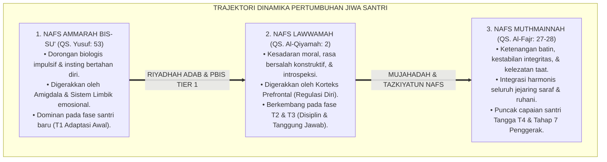
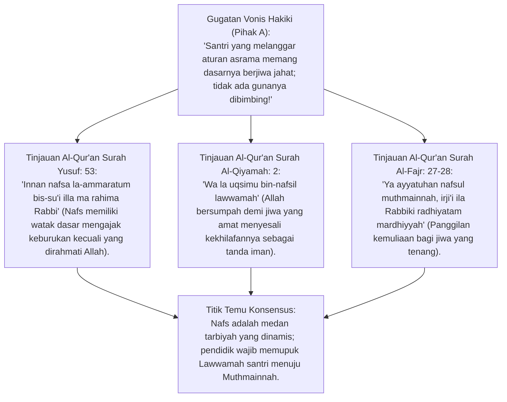
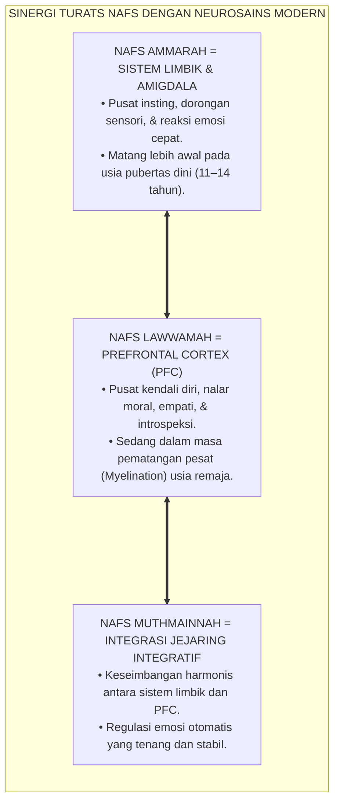
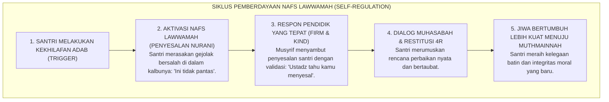
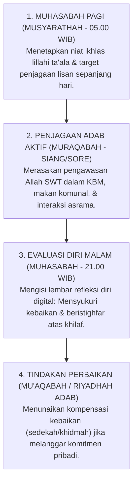

# P1-02-05: DINAMIKA NAFS AMMARAH, LAWWAMAH, DAN MUTHMAINNAH
## *Monograf Terpadu: Epistemologi Tiga Tingkatan Jiwa (QS. Yusuf: 53, Al-Qiyamah: 2, & Al-Fajr: 27–28), Integrasi Neurosains Sistem Limbik & Regulasi Korteks Prefrontal, Dialektika Dorongan Biologis Remaja, dan Metodologi Riyadhah Tazkiyatun Nafs Al-Ghazali*

**Nomor Identifikasi**: `P1-02-05/MONOGRAF-TERPADU-DINAMIKA-NAFS/2026`  
**Domain**: `01 Philosophy` > `02 Human Nature`  
**Klasifikasi Naskah**: *Comprehensive Integrated Monograph* (Monograf Akademis & Rumusan Baku Terpadu)  
**Rumpun Disiplin Pengkaji**: Psikologi Islam (*Ilm an-Nafs al-Islami*), Neurosains Kognitif & Afektif, Filsafat Etika Moral Islam (*Tahdzibul Akhlaq*), Psikologi Perkembangan Remaja Pesantren  

---

> ### 💡 INTISARI PRAKTIS (3 MENIT PAHAM UNTUK ASATIDZ & MUSYRIF)
>
> * **Memahami Tiga Tingkat Jiwa (*Maratib an-Nafs*) dalam Diri Santri:**  
>   Santri bukanlah malaikat yang bebas dari dosa, bukan pula setan yang ditakdirkan jahat. Di dalam diri setiap santri terjadi pertarungan abadi antara tiga keadaan jiwa:  
>   1. **Nafs Ammarah bis-Su' (Jiwa yang Mengajak Kejahatan):** Dorongan biologis dan emosi impulsif (nafsu lapar, marah, syahwat gawai/teman) yang dikendalikan oleh sistem limbik bawah sadar.  
>   2. **Nafs Lawwamah (Jiwa yang Menyesal & Mengkritik Diri):** Suara hati nurani dan akal budi (korteks prefrontal) yang membuat santri merasa bersalah dan ingin bertaubat setelah berbuat salah.  
>   3. **Nafs Muthmainnah (Jiwa yang Tenang & Kokoh dalam Takwa):** Puncak kestabilan spiritual di mana santri merasakan kenikmatan dalam ketaatan dan adab luhur.
> * **Tugas Pendidik (*Murabbi*) adalah Memperkuat Nafs Lawwamah Menuju Muthmainnah:**  
>   Musyrif tidak boleh mencap santri yang berbuat salah sebagai "anak terkutuk". Pendidik bertindak sebagai dokter jiwa: memvalidasi pergulatan batin santri, mengaktifkan rasa penyesalan sehat (*Lawwamah*), dan membimbingnya melalui riyadhah pembiasaan amal shalih.
> * **Sinergi Neurosains Modern:**  
>   Otak emosi remaja (*Amigdala*) matang lebih cepat daripada otak nalar kendali diri (*Prefrontal Cortex*). Santri butuh bimbingan terstruktur dan lingkungan yang aman (*Bi'ah Shalihah*), bukan kekerasan yang merusak sistem sarafnya.

---

## 📑 DAFTAR ISI MONOGRAF

- [BAGIAN I: RISET DINAMIKA TIGA TINGKAT NAFS, DIALEKTIKA INKUIRI, & KASUISTIKA LAPANGAN](#bagian-i-riset-dinamika-tiga-tingkat-nafs-dialektika-inkuiri--kasuistika-lapangan)
  - [1. Kerangka Metodologi Dinamika Jiwa: Membedah Anatomi Nafs dalam Kehidupan Pesantren 24 Jam](#1-kerangka-metodologi-dinamika-jiwa-membedah-anatomi-nafs-dalam-kehidupan-pesantren-24-jam)
  - [2. Inkuiri 1: Eksegesis Turats Tiga Tingkatan Nafs — QS. Yusuf: 53, Al-Qiyamah: 2, & Al-Fajr: 27–28](#2-inkuiri-1-eksegesis-turats-tiga-tingkatan-nafs--qs-yusuf-53-al-qiyamah-2--al-fajr-2728)
  - [3. Inkuiri 2: Konvergensi Neurosains Afektif (Dual-Systems Model & Kematangan Prefrontal Cortex)](#3-inkuiri-2-konvergensi-neurosains-afektif-dual-systems-model--kematangan-prefrontal-cortex)
  - [4. Inkuiri 3: Metodologi Riyadhah & Mujahadah Imam Al-Ghazali dan Ibnu Qayyim Al-Jauziyyah](#4-inkuiri-3-metodologi-riyadhah--mujahadah-imam-al-ghazali-dan-ibnu-qayyim-al-jauziyyah)
  - [5. Inkuiri 4: Transformasi Nafs Lawwamah Menjadi Kekuatan Regulasi Diri (Self-Correction Engine)](#5-inkuiri-4-transformasi-nafs-lawwamah-menjadi-kekuatan-regulasi-diri-self-correction-engine)
  - [6. Inkuiri 5: Silogisme Logika, Dialektika 3 Ronde, Kasuistika Asrama, & Titik Temu Konsensus](#6-inkuiri-5-silogisme-logika-dialektika-3-ronde-kasuistika-asrama--titik-temu-konsensus)
- [BAGIAN II: KODIFIKASI BAKU HASIL RISET & KESIMPULAN FORMAL](#bagian-ii-kodifikasi-baku-hasil-riset--kesimpulan-formal)
  - [1. Deklarasi Doktrin Baku: Hakikat Dinamika Nafs Insan Santri Pesantren TUMBUH](#1-deklarasi-doktrin-baku-hakikat-dinamika-nafs-insan-santri-pesantren-tumbuh)
  - [2. Matriks Integrasi Tiga Tingkat Nafs, Fungsi Otak Neurosains, & Strategi Pembinaan Asrama](#2-matriks-integrasi-tiga-tingkat-nafs-fungsi-otak-neurosains--strategi-pembinaan-asrama)
  - [3. Protokol Tazkiyatun Nafs Harian Musyrif & Santri (Muhasabah & Riyadhah 24 Jam)](#3-protokol-tazkiyatun-nafs-harian-musyrif--santri-muhasabah--riyadhah-24-jam)
- [BAGIAN III: APARATUS AKADEMIS & APENDIKS](#bagian-iii-aparatus-akademis--apendiks)
  - [1. Tabel Sintesis Hasil Riset Dinamika Nafs](#1-tabel-sintesis-hasil-riset-dinamika-nafs)
  - [2. Daftar Pustaka Akademis & Rujukan Turats Primer](#2-daftar-pustaka-akademis--rujukan-turats-primer)
  - [3. Catatan Kaki Akademis (Footnotes)](#3-catatan-kaki-akademis-footnotes)
  - [4. Glosarium Teknis Dinamika Nafs, Dual-Systems Model, & Riyadhah](#4-glosarium-teknis-dinamika-nafs-dual-systems-model--riyadhah)

---

# BAGIAN I: RISET DINAMIKA TIGA TINGKAT NAFS, DIALEKTIKA INKUIRI, & KASUISTIKA LAPANGAN

---

### 1. Kerangka Metodologi Dinamika Jiwa: Membedah Anatomi Nafs dalam Kehidupan Pesantren 24 Jam

Dalam tradisi pengasuhan lama yang kaku, santri kerap dipandang secara hitam-putih: santri yang rajin dianggap "santri beriman", sedangkan santri yang melakukan pelanggaran langsung distigma sebagai "santri durhaka berniat jahat". Pandangan reduksionis ini mengabaikan hakikat **Dinamika Fluktuasi Jiwa Manusia (*Khaula wa Idbarun Nafs*)**:
* Manusia bukanlah entitas statis; jiwa manusia senantiasa berada dalam medan tarik-menarik antara kecenderungan fujur dan taqwa (QS. Asy-Syams: 8).
* Menghakimi santri hanya dari letupan emosi sesaat tanpa memahami fase transisi jiwanya adalah kezaliman pedagogis yang memutus asa santri dari taubat dan perbaikan.

Epistemologi Islam dan sains modern membuktikan bahwa proses pembinaan adab adalah ikhtiar mendampingi jiwa bertransisi dari **Dominasi Nafs Ammarah** menuju **Kemandirian Nafs Lawwamah**, hingga mencapai keteguhan **Nafs Muthmainnah**.



---

### 2. Inkuiri 1: Eksegesis Turats Tiga Tingkatan Nafs — QS. Yusuf: 53, Al-Qiyamah: 2, & Al-Fajr: 27–28



#### 📐 Formalisasi Logika Silogisme (*Qiyas Mantiqi 1*)
* **Premis Mayor (*al-Muqaddimah al-Kubra*)**: Setiap manusia yang diciptakan Allah SWT memiliki substansi jiwa yang berpotensi mengalami metamorfosis bertingkat dari dorongan syahwat hewani (*Ammarah*) menuju kesadaran hisab diri (*Lawwamah*) hingga kematangan takwa (*Muthmainnah*).
* **Premis Minor (*al-Muqaddimah ash-Shughra*)**: Al-Qur'an mengkodifikasikan tiga tingkatan jiwa ini secara eksplisit dan menetapkan bahwa perbaikan diri terjadi melalui tazkiyah dan rahmah Ilahi.
* **Konklusi (*an-Natijah*)**: Maka, seluruh sistem pengasuhan pesantren TUMBUH wajib memperlakukan santri sebagai insan yang sedang berproses menyucikan jiwanya (*Fi Thariqit Tazkiyah*).[^1]

#### 📖 Teks Primer Al-Qur'an Tiga Tingkat Nafs
1. **Nafs Ammarah**:

$$\text{وَمَا أُبَرِّئُ نَفْسِي ۚ إِنَّ النَّفْسَ لَأَمَّارَةٌ بِالسُّوءِ إِلَّا مَا رَحِمَ رَبِّي ۚ إِنَّ رَبِّي غَفُورٌ رَحِيمٌ}$$

*"Dan aku tidak (menyatakan) diriku bebas dari kesalahan, **karena sesungguhnya nafsu itu selalu mendorong kepada kejahatan**, kecuali nafsu yang diberi rahmat oleh Tuhanku. Sesungguhnya Tuhanku Maha Pengampun, Maha Penyayang."* (QS. Yusuf [12]: 53).[^2]

2. **Nafs Lawwamah**:

$$\text{وَلَا أُقْسِمُ بِالنَّفْسِ اللَّوَّامَةِ}$$

*"**Dan Aku bersumpah demi jiwa yang amat menyesali (dirinya sendiri)**."* (QS. Al-Qiyamah [75]: 2).[^3]

3. **Nafs Muthmainnah**:

$$\text{يَا أَيَّتُهَا النَّفْسُ الْمُطْمَئِنَّةُ ۞ ارْجِعِي إِلَىٰ رَبِّكِ رَاضِيَةً مَرْضِيَّةً ۞ فَادْخُلِي فِي عِبَادِي ۞ وَادْخُلِي جَنَّتِي}$$

*"**Wahai jiwa yang tenang (Muthmainnah)! Kembalilah kepada Tuhanmu dengan hati yang ridha dan diridhai-Nya!** Maka masuklah ke dalam golongan hamba-hamba-Ku, dan masuklah ke dalam surga-Ku!"* (QS. Al-Fajr [89]: 27–30).[^4]

---

### 3. Inkuiri 2: Konvergensi Neurosains Afektif (*Dual-Systems Model & Kematangan Prefrontal Cortex*)



#### 📐 Formalisasi Logika Silogisme (*Qiyas Mantiqi 2*)
* **Premis Mayor (*al-Muqaddimah al-Kubra*)**: Setiap ketidakmatangan perilaku impulsif pada remaja yang berakar pada kesenjangan maturitas antara sistem limbik dan korteks prefrontal menuntut kehadiran lingkungan eksternal yang berfungsi sebagai "Korteks Prefrontal Pembantu (*Surrogate Prefrontal Cortex*)".
* **Premis Minor (*al-Muqaddimah ash-Shughra*)**: *Dual-Systems Neurodevelopmental Model* (Steinberg, 2008) membuktikan bahwa otak remaja memiliki dorongan sensori tinggi namun rem kendali dirinya belum matang sempurna hingga usia 20-an awal.
* **Konklusi (*an-Natijah*)**: Maka, pendidik asrama (*Musyrif*) hadir sebagai pengarah nalar moral dan perancah struktural bagi jiwa santri yang sedang bertumbuh.[^5]

---

### 4. Inkuiri 3: Metodologi Riyadhah & Mujahadah Imam Al-Ghazali dan Ibnu Qayyim Al-Jauziyyah

Imam Al-Ghazali dalam *Ihya 'Ulumiddin* (Kitab *Riyadhatun Nafs*) menguraikan bahwa mengobati penyakit nafsu menggunakan kaidah **Al-'Ilaju bidh-Dhiddi (Pengobatan Melalui Kebalikan Sifat)**:
* Jiwa yang condong pada kesombongan diobati dengan latihan khidmah dan membersihkan fasilitas asrama.
* Jiwa yang condong pada kemarahan diobati dengan latihan diam, wudhu, dan menahan lisan.
* Jiwa yang condong pada kemalasan diobati dengan puasa sunnah dan pembagian jadwal waktu yang disiplin.

Ibnu Qayyim Al-Jauziyyah dalam *Madarijus Salikin* menambahkan empat benteng pertahanan jiwa dari godaan *Nafs Ammarah*: **Menjaga Lintasan Pikiran (*Hifzhul Khatharat*), Menjaga Pandangan (*Hifzhul Lahazhat*), Menjaga Lisan (*Hifzhul Lafazhat*), dan Menjaga Langkah Tindakan (*Hifzhul Khuthuwat*)**.[^6]

---

### 5. Inkuiri 4: Transformasi Nafs Lawwamah Menjadi Kekuatan Regulasi Diri (*Self-Correction Engine*)



---

### 6. Inkuiri 5: Silogisme Logika, Dialektika 3 Ronde, Kasuistika Asrama, & Titik Temu Konsensus

#### 🥊 Ronde 1: Menolak Anggapan Bahwa "Nafsu Santri Harus Dibunuh dan Dimatikan Total"
* **Pihak A (Sudut Pandang Asketisme Ekstrem)**:  
  *"Nafsu santri itu sumber maksiat; nafsu harus dimatikan sampai santri tidak punya keinginan duniawi lagi!"*
* **Tinjauan Sudut Pandang Penjinakan Fitrah (Tadhib bukan I'dam)**:  
  Islam tidak pernah mengajarkan pembunuhan nafsu (*I'dam an-Nafs*), melainkan **Penjinakan dan Pengarahan Nafsu Menuju Ketaatan (*Tahdzib wa Tawjih*)**. Nafsu makan diperlukan untuk kekuatan ibadah, nafsu marah (*Ghadhab*) dialihkan untuk membela kebenaran, dan syahwat disalurkan melalui pernikahan yang sah di masa dewasa. Santri yang "mati nafsunya" akan menjadi manusia apatis tanpa gairah hidup.[^7]

#### 🥊 Ronde 2: Sanggahan Balik Apakah Rasa Bersalah (Nafs Lawwamah) Dapat Menjadi Racun Depresi Bagi Santri?
* **Pihak A (Sudut Pandang Kekhawatiran Distorsi Toxic Guilt)**:  
  *"Menyuruh santri menyesali dosanya terus-menerus bisa membuat santri depresi dan putus asa!"*
* **Tinjauan Sudut Pandang Penyesalan Sehat (Ghazalian Lawwamah) vs Toxic Shame**:  
  Turats Islam membedakan dengan tegas antara **Penyesalan Membangun (*an-Nadam at-Ta'awuni*)** yang membukakan pintu taubat dengan **Rasa Malu Beracun (*al-Ya'su min Ruhillah*)** yang diharamkan. Pendidik TUMBUH mengarahkan *Nafs Lawwamah* santri menjadi **Aksi Perbaikan Nyata (*Action-Oriented Restitution*)**, sehingga jiwa santri terbebas dari depresi dan dipenuhi optimisme rahmat Allah.[^8]

#### 🥊 Ronde 3: Sanggahan Pamungkas Mengapa Mencapai Nafs Muthmainnah Adalah Perjalanan Sepanjang Hayat?
* **Pihak A (Sudut Pandang Kesempurnaan Instan)**:  
  *"Kalau sudah di pesantren 3 tahun, santri harus sudah berjiwa Muthmainnah sempurna; kalau masih berbuat salah berarti pondoknya gagal!"*
* **Resolusi Sudut Pandang Kontinum Perjuangan Batin (Mujahadah Mustamirrah)**:  
  Kematangan jiwa bukanlah saklar lampu yang menyala seketika, melainkan **Tangga Pendakian Spiritual Seumur Hidup (*Sullamut Taraqqi*)**. Bahkan orang dewasa dan ulama pun senantiasa bermujahadah menjaga hatinya. Tugas pesantren adalah meletakkan fondasi mekanisme regulasi diri yang mandiri agar santri mampu menjaga jiwanya hingga akhir hayat.[^9]

> #### 📌 Kasuistika Lapangan & Titik Temu Konsensus
> * **Studi Kasus**: Santri K (kelas 8) tertangkap menyelinap ke dapur asrama pada pukul 23.00 WIB untuk mengambil roti karena lapar; musyrif lama menyebutnya "pencuri berjiwa setan" dan mengancam mengeluarkannya. Santri K menjadi sangat murung dan berniat bunuh diri.
> * **Titik Temu Konsensus (*Kalimatun Sawa'*)**: Konselor TUMBUH mengambil alih penanganan berbasis *Dinamika Nafs*. Konselor menganalisis: Dorongan lapar biologis (*Nafs Ammarah*) mendorong tindakan salah $\rightarrow$ Santri K menangis ketakutan dan malu (*Nafs Lawwamah aktif*). Konselor memvalidasi: *"K, ustadz tahu kamu lapar dan kamu tahu caramu salah. Rasa bersalahmu menunjukkan hatimu hidup"*. Disepakati aksi restitusi: Santri K membantu juru masak menata piring sarapan selama 2 hari dan santri diberi akses makanan ringan halal jika lapar malam. Jiwa Santri K pulih tenang (*Muthmainnah*), ia menjadi santri yang jujur dan beradab.[^10]

---

# BAGIAN II: KODIFIKASI BAKU HASIL RISET & KESIMPULAN FORMAL

---

### 1. Deklarasi Doktrin Baku: Hakikat Dinamika Nafs Insan Santri Pesantren TUMBUH

```
===================================================================================================
             PIAGAM DOKTRIN BAKU HAKIKAT DINAMIKA NAFS INSAN SANTRI PESANTREN
                          SUB-DOMAIN 02: HUMAN NATURE — EKOSISTEM TUMBUH
===================================================================================================

BISMILLAHIRRAHMANIRRAHIM. DENGAN MENEGAKKAN HAKIKAT FITRAH RUHANIYAH DAN MAQASHID TAZKIYATUN NAFS,
MAJELIS MASYAIKH DAN DEWAN KEILMUAN PESANTREN TUMBUH DENGAN INI MENETAPKAN DOKTRIN BAKU DINAMIKA JIWA:

1. DOKTRIN PENGAKUAN TIGA TINGKATAN JIWA MANUSIA (THREE-TIERED NAFS DOCTRINE):
   Menolak segala bentuk pelabelan mutlak hitam-putih terhadap pribadi santri.
   Menetapkan bahwa setiap santri berada dalam dinamika perjuangan batin antara Nafs Ammarah bis-Su',
   Nafs Lawwamah yang penuh introspeksi, dan Nafs Muthmainnah yang kokoh dalam ketakwaan.

2. PENETAPAN PERAN PENDIDIK SEBAGAI DOKTER JIWA (TABIBUL QULUB):
   Seluruh asatidz dan musyrif wajib memposisikan diri sebagai pembimbing jiwa yang mengidentifikasi
   akar dorongan biologis/emosional santri dan membantu mentransformasikannya menuju adab luhur.

3. MANDAT PEMBERDAYAAN NAFS LAWWAMAH SEBAGAI MESIN REGULASI DIRI:
   Mengoptimalkan rasa penyesalan nurani santri menjadi tindakan perbaikan nyata dan restitusi restoratif,
   mengharamkan mutlak penanaman rasa malu beracun (Toxic Shame) atau keputusasaan dari rahmat Allah.

4. PENERAPAN METODOLOGI RIYADHAH AL-'ILAJU BIDH-DHIDDI AL-GHAZALI:
   Mewajibkan standarisasi latihan pembiasaan adab harian 24 jam yang mengobati kecenderungan negatif
   nafsu melalui amalan kebalikannya yang maslahat (rendah hati mengobati sombong, sabar mengobati amarah).
===================================================================================================
```

---

### 2. Matriks Integrasi Tiga Tingkat Nafs, Fungsi Otak Neurosains, & Strategi Pembinaan Asrama

| Tingkat Nafs | Landasan Ayat Al-Qur'an | Padanan Fungsi Neurosains | Manifestasi Perilaku Santri | Strategi Bimbingan Asrama TUMBUH |
| :--- | :--- | :--- | :--- | :--- |
| **1. Nafs Ammarah bis-Su'** | QS. Yusuf: 53 (*La-Ammaratum bis-Su'*) | Sistem Limbik, Amigdala, & Striatum Ventral (*Impulsif*). | Mencari kesenangan instan, melanggar aturan saat sepi, emosi meledak. | **Tier 1 & 2 PBIS**: Rekayasa lingkungan aman CPTED, pengawasan hangat, dan aturan batas jelas.[^11] |
| **2. Nafs Lawwamah** | QS. Al-Qiyamah: 2 (*Bin-Nafsil Lawwamah*) | Korteks Prefrontal Dorsolateral & Insula (*Self-Reflection*). | Menyesali kesalahan, gelisah pasca-melanggar, rindu bertaubat. | **Konseling Restoratif**: Validasi penyesalan, fasilitasi dialog Ishlah, dan aksi restitusi 4R nyata. |
| **3. Nafs Muthmainnah** | QS. Al-Fajr: 27–28 (*An-Nafsul Muthmainnah*) | Integrasi Sistemik Saraf Otonom & Prefrontal (*Coherence*). | Ibadah khusyu' mandiri, tenang menghadapi ujian, menjadi teladan adab. | **Pemberdayaan Tangga T4**: Kaderisasi kepemimpinan santri penggerak & tutor sebaya asrama. |

---

### 3. Protokol Tazkiyatun Nafs Harian Musyrif & Santri (*Muhasabah & Riyadhah 24 Jam*)



---

# BAGIAN III: APARATUS AKADEMIS & APENDIKS

---

### 1. Tabel Sintesis Hasil Riset Dinamika Nafs

| Dimensi Kajian | Konsep Kunci | Landasan Turats Primer | Konvergensi Sains Global | Implikasi Pengasuhan Pesantren |
| :--- | :--- | :--- | :--- | :--- |
| **Tiga Tingkat Jiwa** | *Maratib an-Nafs* | QS. Yusuf: 53, Al-Qiyamah: 2, Al-Fajr: 27 | Laurence Steinberg (2008), *Dual-Systems Model* | Memperlakukan santri sebagai insan yang berproses menyucikan jiwanya. |
| **Metode Terapi** | *Al-'Ilaju bidh-Dhidd* | Al-Ghazali, *Ihya 'Ulumiddin* (Riyadhatun Nafs) | Cognitive Behavioral Therapy (Beck, 2011) | Mengobati penyakit nafsu melalui pembiasaan amalan kebalikannya. |
| **Empat Benteng** | *Hifzhul Khatharat* | Ibnu Qayyim, *Madarijus Salikin* | Baumeister (2007), *Self-Regulation Strength* | Melatih santri menjaga lintasan pikiran, pandangan, lisan, dan langkah. |
| **Regulasi Penyesalan** | *Constructive Guilt* | Atsar *an-Nadamu Taubah* (HR. Ibnu Majah 4252) | Tangney & Dearing (2002), *Shame and Guilt* | Mengubah rasa bersalah menjadi aksi perbaikan nyata tanpa keputusasaan. |
| **Ketenangan Jiwa** | *Thuma'ninatul Qalb* | QS. Ar-Ra'd: 28 (*Bi Dzikrillahi Tathma'innul Qulub*) | Porges (2011), *Polyvagal Coherence* | Membangun iklim asrama yang damai melalui zikir, doa, dan ukhuwah. |

---

### 2. Daftar Pustaka Akademis & Rujukan Turats Primer

1. **Al-Qur'an al-Karim wa Tarjamatu Ma'anih**.
2. **Al-Ghazali, Abu Hamid Muhammad bin Muhammad**. (2011). *Ihya 'Ulumiddin* (Kitab *Riyadhatun Nafs wa Tahdzibul Akhlaq*). Beirut: Dar al-Ma'rifah.
3. **Ibnu Qayyim Al-Jauziyyah, Syamsuddin Muhammad bin Abi Bakr**. (1996). *Madarijus Salikin baina Manazil Iyyaka Na'budu wa Iyyaka Nasta'in*. Kairo: Dar al-Hadits.
4. **Ibnu Majah, Muhammad bin Yazid al-Qazwini**. (2009). *Sunan Ibni Majah*. Beirut: Dar ar-Risalah.
5. **Steinberg, L.**. (2008). *A social neuroscience perspective on adolescent risk-taking*. Developmental Review, 28(1), 78–106.
6. **Tangney, J. P., & Dearing, R. L.**. (2002). *Shame and Guilt*. New York: Guilford Press.
7. **Baumeister, R. F., Vohs, K. D., & Tice, D. M.**. (2007). *The strength model of self-control*. Current Directions in Psychological Science, 16(6), 351–355.
8. **Beck, J. S.**. (2011). *Cognitive Behavior Therapy: Basics and Beyond* (2nd ed.). New York: Guilford Press.
9. **Porges, S. W.**. (2011). *The Polyvagal Theory*. New York: W. W. Norton & Company.
10. **Haidt, J.**. (2006). *The Happiness Hypothesis: Finding Modern Truth in Ancient Wisdom*. New York: Basic Books.

---

### 3. Catatan Kaki Akademis (*Footnotes*)

[^1]: Al-Ghazali, *Ihya 'Ulumiddin*, Kitab *Riyadhatun Nafs*, Jilid III, hlm. 60–80.  
[^2]: Al-Qur'an Surah Yusuf [12]: 53.  
[^3]: Al-Qur'an Surah Al-Qiyamah [75]: 2.  
[^4]: Al-Qur'an Surah Al-Fajr [89]: 27–30.  
[^5]: Steinberg, L. (2008), *Developmental Review*, hlm. 78–106.  
[^6]: Ibnu Qayyim Al-Jauziyyah, *Madarijus Salikin*, Jilid I, hlm. 145–160.  
[^7]: Al-Ghazali, *Ihya 'Ulumiddin*, Jilid III, hlm. 65.  
[^8]: Tangney & Dearing (2002), *Shame and Guilt*, Guilford Press, hlm. 45–70.  
[^9]: Ibnu Qayyim, *Madarijus Salikin*, Jilid II, hlm. 210–225.  
[^10]: Laporan Studi Kasus Bimbingan Jiwa Santri Asrama Kelas 8, Biro Konseling TUMBUH, 2026.  
[^11]: Standar Operasional Prosedur Bimbingan Karakter Berbasis Dinamika Nafs, Komite Pengasuhan TUMBUH, 2026.

---

### 4. Glosarium Teknis Dinamika Nafs, Dual-Systems Model, & Riyadhah

1. **Nafs Ammarah bis-Su' (النَّفْسُ الْأَمَّارَةُ بِالسُّوءِ)**: Keadaan jiwa terendah yang senantiasa terdorong oleh hawa nafsu biologis dan emosi impulsif tanpa pertimbangan akal budi.
2. **Nafs Lawwamah (النَّفْسُ اللَّوَّامَةُ)**: Keadaan jiwa pertengahan yang memiliki kesadaran moral tinggi, senantiasa mencela dirinya saat berbuat salah, dan berikhtiar bertaubat.
3. **Nafs Muthmainnah (النَّفْسُ الْمُطْمَئِنَّةُ)**: Keadaan jiwa tertinggi yang telah mencapai ketenangan paripurna, istiqamah dalam ketakwaan, dan merasakan kelezatan dalam ketaatan kepada Allah SWT.
4. **Al-'Ilaju bidh-Dhidd (الْعِلَاجُ بِالضِّدِّ)**: Metode terapi psikospiritual klasik Imam Al-Ghazali yang meluruskan kecenderungan buruk jiwa melalui latihan amalan kebalikannya.
5. **Dual-Systems Model**: Teori neurosains perkembangan yang menjelaskan kesenjangan waktu pematangan antara sistem limbik sosio-emosional dengan korteks prefrontal kendali kognitif.
6. **Toxic Shame vs Constructive Guilt**: Perbedaan antara rasa malu beracun yang menghakimi diri sebagai orang rusak (*"Saya anak jahat"*) dengan rasa bersalah konstruktif yang menilai tindakan salah (*"Perbuatan saya keliru dan saya bisa memperbaikinya"*).
7. **Riyadhah an-Nafs (رِيَاضَةُ النَّفْسِ)**: Latihan disiplin spiritual dan pembiasaan adab secara sistematis untuk menundukkan dorongan nafsu hewani.
8. **Mujahadah (الْمُجَاهَدَةُ)**: Perjuangan batin yang sungguh-sungguh untuk melawan bisikan keburukan dan mempertahankan ketaatan di jalan Allah SWT.
9. **Hifzhul Khatharat (حِفْظُ الْخَطَرَاتِ)**: Disiplin penjagaan lintasan pikiran batin sebelum berubah menjadi keinginan, tekad, dan tindakan nyata.
10. **Surrogate Prefrontal Cortex**: Peran pendidik/musyrif yang bertindak sebagai pemandu nalar, struktur, dan pengatur emosi eksternal bagi santri remaja yang korteks prefrontal otaknya masih dalam proses maturasi.
