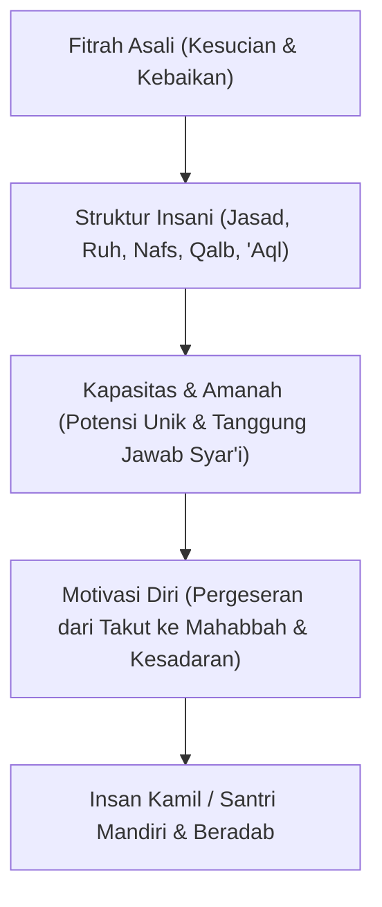

# P1-02-05-Sintesis-Human-Nature

## Rangkuman Integratif: Hakikat Manusia dalam TUMBUH

Dokumen ini menyintesiskan seluruh aksioma dan pemahaman tentang hakikat manusia (*Human Nature*) yang menjadi fondasi antropologis ekosistem TUMBUH:

---

## 5 Aksioma Kunci Hakikat Manusia (Human Nature)

1. **Aksioma Kesucian Asal (*Ashalah al-Khair*)**: Setiap santri memiliki fitrah bawaan yang condong pada kebenaran dan kebaikan. Perilaku menyimpang adalah anomali akibat distorsi lingkungan atau kelemahan keterampilan diri.
2. **Aksioma Keutuhan Jiwa-Raga (*Takamul al-Insan*)**: Santri adalah satu kesatuan jasad, ruh, nafs, qalb, dan 'aql. Pengasuhan yang hanya mendisiplinkan fisik tanpa menyentuh hati dan akal akan gagal membentuk karakter yang kokoh.
3. **Aksioma Keunikan Amanah (*Tanawwu' al-Isti'dad*)**: Setiap santri memiliki kombinasi bakat dan kecerdasan yang unik. Keadilan pembinaan terletak pada menumbuhkan potensi terbaik masing-masing santri, bukan memaksakan keseragaman.
4. **Aksioma Regulasi Diri (*Iradah & Self-Regulation*)**: Target akhir pembinaan adalah lahirnya santri yang mampu mengendalikan dirinya secara sadar di hadapan Allah (*Muraqabatullah*), bukan santri yang patuh hanya karena takut hukuman pengawas.
5. **Aksioma Kemuliaan Martabat (*Karamah Insaniyyah*)**: Setiap santri berhak diperlakukan dengan penuh penghormatan martabat. Pembinaan dan penegakan tata tertib wajib dilakukan dengan ketegasan yang adil dan kehangatan yang mendidik (*Firm & Kind*).
