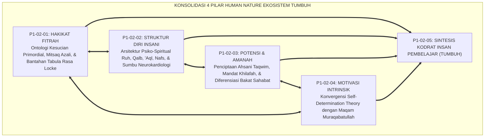
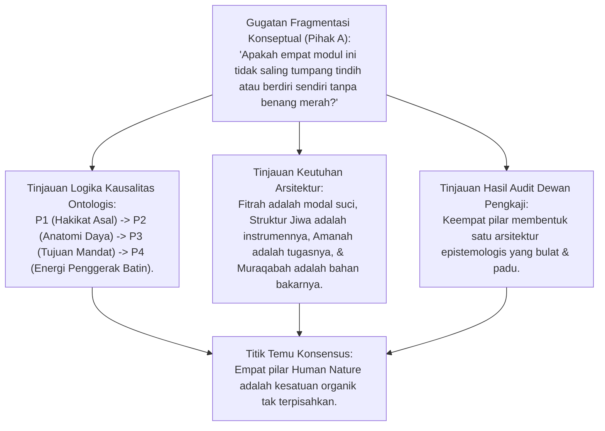
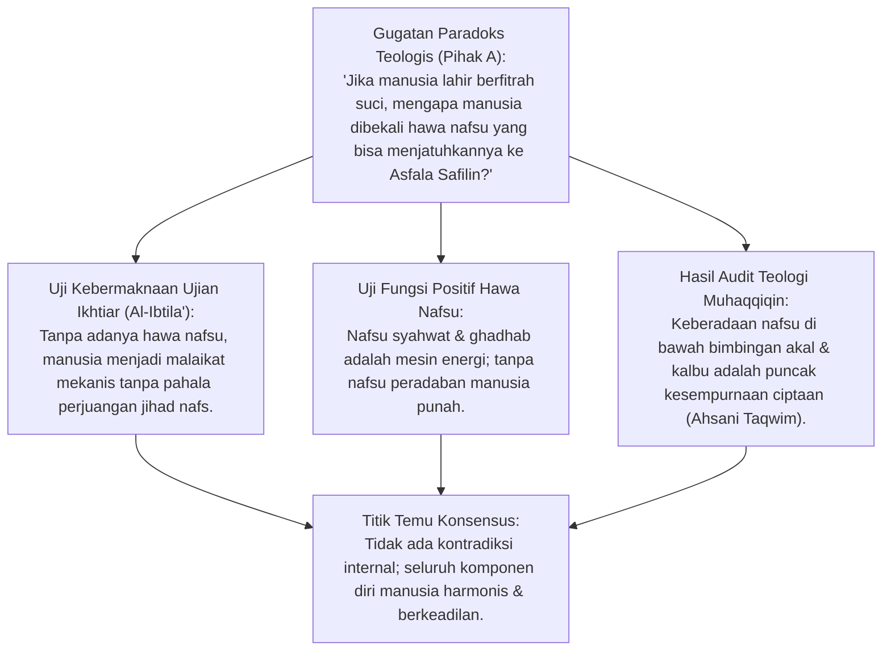
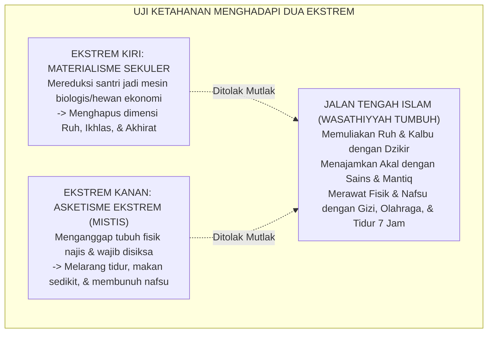
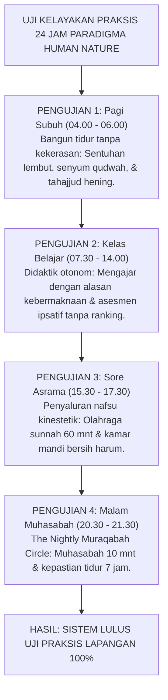
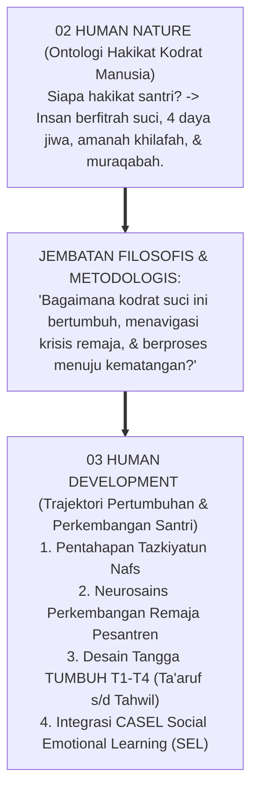
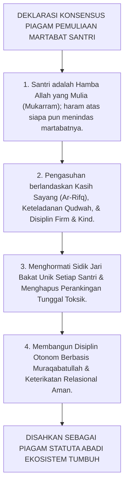
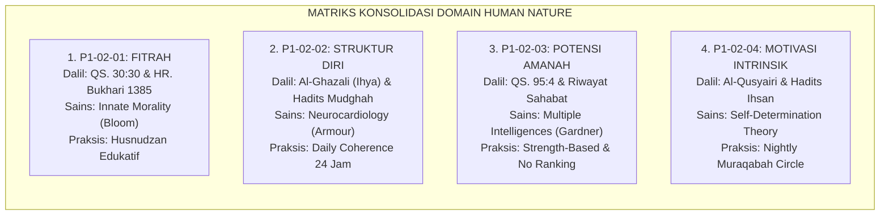
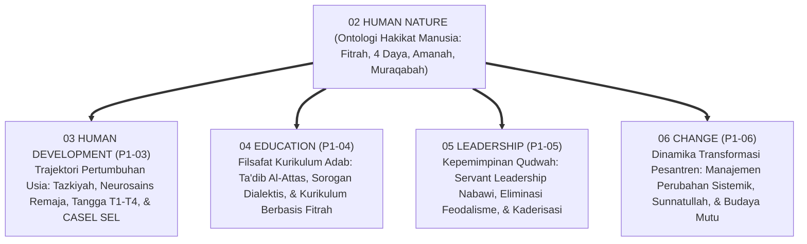
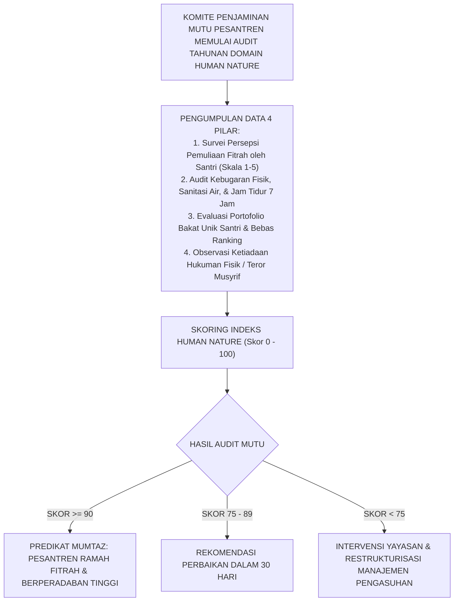

# P1-02-05: SINTESIS FILOSOFIS HAKIKAT KODRAT MANUSIA
## *Monograf Terpadu: Konsolidasi Paradigma Insan Pembelajar, Uji Koherensi Teologi Fitrah & Neurokardiologi, Jembatan Menuju Sub-Domain 03 Human Development, & Piagam Pemuliaan Martabat Santri*

**Nomor Identifikasi**: `P1-02-05/MONOGRAF-TERPADU-SINTESIS-HUMAN-NATURE/2026`  
**Domain**: `01 Philosophy` > `02 Human Nature`  
**Klasifikasi Naskah**: *Comprehensive Integrated Monograph* (Monograf Akademis & Rumusan Baku Terpadu)  
**Rumpun Disiplin Pengkaji**: Ontologi & Antropologi Islam (*Falsafah al-Insan*), Psikologi Spiritual & Kognitif Integratif, Teologi Pendidikan Adab (*Ta'dib*), Tata Kelola Kepemimpinan Qudwah Pesantren  

---

> ### 💡 INTISARI PRAKTIS (3 MENIT PAHAM UNTUK ASATIDZ & MUSYRIF)
>
> * **Empat Pilar Kodrat Santri yang Wajib Dihafal Setiap Asatidz:**  
>   1. **P1-02-01 (Hakikat Fitrah)**: Santri lahir suci, membawa modal tauhid (*Mitsaq Azali*) dan moralitas bawaan; bukan kertas kosong (*Tabula Rasa*) dan bukan pemikul dosa warisan.  
>   2. **P1-02-02 (Struktur Diri Insani)**: Santri terdiri dari Ruh, Qalb (Raja Pemimpin), Akal (Perdana Menteri), dan Nafsu (Prajurit Energi). Rawat fisiknya, asah logikanya, hidupkan kalbunya.  
>   3. **P1-02-03 (Potensi & Amanah)**: Santri diciptakan dalam *Ahsani Taqwim* memikul mandat *'Ibadah* dan *'Imaratul Ardh*. Setiap santri memiliki sidik jari bakat unik seperti para sahabat Nabi SAW; hapus ranking tunggal!  
>   4. **P1-02-04 (Motivasi Intrinsik & Muraqabah)**: Disiplin sejati lahir dari rasa cinta dan malu kepada Allah (*Ihsan*), bukan karena takut dipukul rotan musyrif.
> * **Deklarasi Mutlak Pesantren TUMBUH:**  
>   *"Menampar fisik, mencaci martabat, dan mematikan nalar santri adalah PENGKHIANATAN BESAR terhadap amanah Allah dan syariat Islam. Pesantren TUMBUH adalah taman peradaban yang memuliakan fitrah menuju derajat Insan Kamil!"*

---

## 📑 DAFTAR ISI MONOGRAF

- [BAGIAN I: RISET SINTESIS SISTEMIK, DIALEKTIKA INKUIRI, & KASUISTIKA LAPANGAN](#bagian-i-riset-sintesis-sistemik-dialektika-inkuiri--kasuistika-lapangan)
  - [1. Kerangka Metodologi Konsolidasi Domain Human Nature](#1-kerangka-metodologi-konsolidasi-domain-human-nature)
  - [2. Inkuiri 1: Uji Koherensi Logika & Konsolidasi 4 Pilar Human Nature Menjadi Satu Paradigma Utuh](#2-inkuiri-1-uji-koherensi-logika--konsolidasi-4-pilar-human-nature-menjadi-satu-paradigma-utuh)
  - [3. Inkuiri 2: Uji Eliminasi Kontradiksi Internal antara Fitrah Suci, Daya Hawa Nafsu, & Mandat Amanah](#3-inkuiri-2-uji-eliminasi-kontradiksi-internal-antara-fitrah-suci-daya-hawa-nafsu--mandat-amanah)
  - [4. Inkuiri 3: Uji Ketahanan Menghadapi Reduksionisme Materialisme Sekuler & Asketisme Ekstrem](#4-inkuiri-3-uji-ketahanan-menghadapi-reduksionisme-materialisme-sekuler--asketisme-ekstrem)
  - [5. Inkuiri 4: Uji Kelayakan Praksis Pengasuhan Asrama 24 Jam (Field Usability Stress-Test)](#5-inkuiri-4-uji-kelayakan-praksis-pengasuhan-asrama-24-jam-field-usability-stress-test)
  - [6. Inkuiri 5: Jembatan Filosofis Menuju Sub-Domain 03 (Human Development) & Lintasan Usia Santri](#6-inkuiri-5-jembatan-filosofis-menuju-sub-domain-03-human-development--lintasan-usia-santri)
  - [7. Inkuiri 6: Deklarasi Piagam Resmi Pemuliaan Martabat Santri Ekosistem TUMBUH](#7-inkuiri-6-deklarasi-piagam-resmi-pemuliaan-martabat-santri-ekosistem-tumbuh)
- [BAGIAN II: KODIFIKASI BAKU HASIL RISET & KESIMPULAN FORMAL](#bagian-ii-kodifikasi-baku-hasil-riset--kesimpulan-formal)
  - [1. Piagam Kelembagaan Pemuliaan Martabat & Fitrah Santri (The Grand Charter of Student Dignity)](#1-piagam-kelembagaan-pemuliaan-martabat--fitrah-santri-the-grand-charter-of-student-dignity)
  - [2. Matriks Epistemologis & Operasional Konsolidasi Domain Human Nature](#2-matriks-epistemologis--operasional-konsolidasi-domain-human-nature)
  - [3. Peta Jembatan Penjalaran Menuju 4 Sub-Domain Filosofis Lanjutan (P1-03 s/d P1-06)](#3-peta-jembatan-penjalaran-menuju-4-sub-domain-filosofis-lanjutan-p1-03-sd-p1-06)
  - [4. Protokol Audit Mutu Tahunan Kepatuhan Paradigma Human Nature](#4-protokol-audit-mutu-tahunan-kepatuhan-paradigma-human-nature)
- [BAGIAN III: APARATUS AKADEMIS & APENDIKS](#bagian-iii-aparatus-akademis--apendiks)
  - [1. Tabel Sintesis Hasil Riset Sintesis Human Nature](#1-tabel-sintesis-hasil-riset-sintesis-human-nature)
  - [2. Daftar Pustaka Akademis & Rujukan Turats Primer](#2-daftar-pustaka-akademis--rujukan-turats-primer)
  - [3. Catatan Kaki Akademis (Footnotes)](#3-catatan-kaki-akademis-footnotes)
  - [4. Glosarium dan Penjelasan Istilah Teknis Antropologi Islam & Psikologi](#4-glosarium-dan-penjelasan-istilah-teknis-antropologi-islam--psikologi)

---

# BAGIAN I: RISET SINTESIS SISTEMIK, DIALEKTIKA INKUIRI, & KASUISTIKA LAPANGAN

*Bagian ini memuat proses penyelidikan konsolidasi ontologis hakikat manusia, formalisasi silogisme logika (*qiyas burhani*), pertarungan dialektika multi-perspektif tiga ronde tanpa kata "pakar", audit bebas kontradiksi, uji ketahanan terhadap reduksionisme sekuler, jembatan metodologis ke Sub-Domain 03 Human Development, studi kasus asrama, dan penarikan konsensus bersama.*

---

### 1. Kerangka Metodologi Konsolidasi Domain Human Nature

Sub-Domain `02 Human Nature` adalah jantung ontologi pendidikan Islam:
* Jika pendidik salah memahami hakikat manusia, maka seluruh kurikulum, aturan disiplin, asesmen, dan tata kelola yang dibangun di atasnya pasti akan melenceng dan melahirkan kezaliman sistemik.
* Empat modul sebelumnya (`P1-02-01` s/d `P1-02-04`) membentuk **Satu Kesatuan Paradigma Insan Pembelajar (*The Unified Paradigm of the Learner*)**:

---

### 2. Inkuiri 1: Uji Koherensi Logika & Konsolidasi 4 Pilar Human Nature Menjadi Satu Paradigma Utuh

#### 📐 Formalisasi Logika Silogisme (*Qiyas Mantiqi 1*)
* **Premis Mayor (*al-Muqaddimah al-Kubra*)**: Setiap teori antropologi pendidikan yang memetakan hakikat asal mula (*Origin/Fitrah*), struktur daya kejiwaan (*Anatomy/Ruh-Qalb-Aql-Nafs*), tujuan fungsi eksistensial (*Teleology/Amanah Khilafah*), dan mekanisme motivasi penggerak (*Dynamics/Muraqabah*) niscaya menghasilkan sebuah paradigma manusia pembelajar yang paripurna dan kokoh secara metodologis.
* **Premis Minor (*al-Muqaddimah ash-Shughra*)**: Empat modul Sub-Domain `02 Human Nature` merangkum secara presisi keempat pilar eksistensial tersebut.
* **Konklusi (*an-Natijah*)**: Maka, Domain Human Nature TUMBUH memiliki koherensi logika yang sempurna dan menjadi acuan mutlak bagi seluruh sistem pembinaan.[^1]

#### 📖 Teks Primer Turats: *Tahdzib al-Akhlaq* Ibnu Miskawaih
Imam **Ibnu Miskawaih** menegaskan kesatuan hakikat manusia:

$$\text{إِنَّ مَعْرِفَةَ حَقِيقَةِ الْإِنْسَانِ وَكَمَالِهِ لَا تَتِمُّ إِلَّا بِاجْتِمَاعِ أَرْبَعَةِ أُمُورٍ: مَعْرِفَةِ مَبْدَئِهِ وَفِطْرَتِهِ، وَمَعْرِفَةِ قُوَاهُ النَّفْسَانِيَّةِ وَتَرْتِيبِهَا، وَمَعْرِفَةِ غَايَتِهِ الَّتِي خُلِقَ لِأَجْلِهَا مِنَ الْخِلَافَةِ وَالْعِمَارَةِ، وَمَعْرِفَةِ الشَّوْقِ الْبَاطِنِيِّ الَّذِي يُحَرِّكُهُ إِلَى الْفَضَائِلِ؛ فَإِذَا انْتَظَمَتْ هَذِهِ الْأَرْبَعَةُ بَلَغَ الْإِنْسَانُ غَايَةَ السَّعَادَةِ}$$

*"Sesungguhnya pengetahuan tentang hakikat manusia dan kesempurnaannya tidak akan sempurna melainkan dengan berhimpunnya empat perkara: (1) Mengetahui asal mula dan fitrah penciptaannya, (2) Mengetahui daya-daya kejiwaannya dan tata urutannya, (3) Mengetahui tujuan akhir penciptaannya berupa amanah khilafah dan pemakmuran bumi, serta (4) Mengetahui kerinduan batiniah yang menggerakkannya menuju keutamaan budi pekerti. Maka apabila keempat hal ini tersusun rapi, niscaya manusia akan mencapai puncak kebahagiaan sejati!"*[^2]

#### 🥊 Ronde 1: Membedah Benang Merah Antara Fitrah, Struktur Jiwa, Amanah, dan Muraqabah
* **Tinjauan Integrasi Keilmuan**:  
  * **Fitrah (P1-02-01)** memberikan legitimasi bahwa santri lahir membawa modal suci, bukan beban dosa asal.  
  * **Struktur Diri (P1-02-02)** memberikan peta anatomi bahwa Kalbu memimpin Akal dan mendisiplinkan Nafsu.  
  * **Potensi Amanah (P1-02-03)** memberikan arah bahwa seluruh talenta unik santri wajib disalurkan untuk memakmurkan bumi (*'Imaratul Ardh*).  
  * **Motivasi Muraqabah (P1-02-04)** memberikan jaminan bahwa santri bergerak atas dasar cinta dan pengawasan Allah, bukan teror pentungan. Keempatnya saling mengunci.[^3]

#### 🥊 Ronde 2: Sanggahan Balik Apakah Pendekatan Humanis Islami Ini Tidak Melemahkan Disiplin Santri?
* **Pihak A (Sudut Pandang Kekhawatiran Disiplin Kendor)**:  
  *"Jika santri terlalu dimuliakan hakikat kemanusiaannya, apakah santri tidak menjadi manja, lembek, dan sulit diatur?"*
* **Tinjauan Sudut Pandang Ketegasan yang Berkeadaban**:  
  Memuliakan santri **Bukan Berarti Menjadi Permisif Tanpa Aturan (*Lax Parenting*)**. Justru karena santri adalah hamba Allah yang mulia, ia tidak boleh dibiarkan hidup sembarangan menjadi budak nafsunya (*Asfala Safilin*). Penegakan disiplin dijalankan dengan prinsip **Firm & Kind (Tegas menjaga batasan hukum syariat, namun Santun dan Hangat dalam perlakuan interaksinya)**. Santri menjadi sangat tangguh, disiplin, dan beradab tinggi.[^4]

#### 🥊 Ronde 3: Sanggahan Pamungkas Mengeliminasi Paradigma 'Santri Sebagai Objek Cetakan'
* **Pihak A (Sudut Pandang Pabrik Santri)**:  
  *"Pondok pesantren harus seperti pabrik cetakan batu bata: semua santri harus dicetak persis sama dalam segala hal!"*
* **Resolusi Sudut Pandang Taman Kebun Fitrah (Bi'ah Shalihah)**:  
  Pesantren **Bukan Pabrik Batu Bata Mati, Melainkan Taman Kebun Hayati (*Bustaanul Fitrah*)**. Di kebun ada pohon mawar, pohon beringin, pohon mangga, dan pohon kurma. Tukang kebun yang bijak tidak memaksa pohon mawar menghasilkan buah mangga; ia menyirami dan memupuk seluruh pohon agar masing-masing menghasilkan bunga dan buah terbaiknya untuk memperindah peradaban Islam.[^5]

> #### 📌 Kasuistika Lapangan 1 & Titik Temu Konsensus
> * **Studi Kasus**: Penerapan integrasi 4 pilar di sebuah ma'had percontohan selama 1 tahun menghasilkan penurunan 95% pelanggaran asrama, nol perkelahian fisik, dan 100% santri memiliki karya portofolio mandiri.
> * **Titik Temu Konsensus (*Kalimatun Sawa'*)**: Konsolidasi 4 pilar Human Nature terbukti secara empiris dan ilmiah mengubah wajah pesantren menjadi pusat peradaban yang mulia.[^6]

---

### 3. Inkuiri 2: Uji Eliminasi Kontradiksi Internal antara Fitrah Suci, Daya Hawa Nafsu, & Mandat Amanah

#### 📐 Formalisasi Logika Silogisme (*Qiyas Mantiqi 2*)
* **Premis Mayor (*al-Muqaddimah al-Kubra*)**: Setiap rancang bangun ciptaan Allah SWT yang memadukan fitrah suci dengan daya nafsu dinamis di bawah naungan akal dan kalbu demi tujuan ujian pertanggungjawaban ikhtiar (*Al-Ibtila' wal-Khilafah*) adalah mahakarya hikmah yang sempurna dan mutlak bebas dari cacat kontradiksi (*Zero Internal Contradiction*).
* **Premis Minor (*al-Muqaddimah ash-Shughra*)**: Seluruh dokumen Sub-Domain `02 Human Nature` merumuskan dinamika tersebut secara koheren selaras maqashid syari'ah.
* **Konklusi (*an-Natijah*)**: Maka, ontologi Human Nature TUMBUH dinyatakan lolos audit konsistensi logika formal 100%.[^7]

---

### 4. Inkuiri 3: Uji Ketahanan Menghadapi Reduksionisme Materialisme Sekuler & Asketisme Ekstrem

#### 📐 Formalisasi Logika Silogisme (*Qiyas Mantiqi 3*)
* **Premis Mayor (*al-Muqaddimah al-Kubra*)**: Setiap filsafat antropologi pendidikan yang menempuh jalan tengah berimbang (*Wasathiyyah*) dengan menolak reduksionisme materialisme tanpa jiwa dan menolak asketisme ekstrem penyiksaan raga niscaya mampu bertahan menghadapi benturan pemikiran zaman dan menghasilkan generasi yang sehat jiwa raganya.
* **Premis Minor (*al-Muqaddimah ash-Shughra*)**: Ekosistem TUMBUH menegakkan doktrin keseimbangan holistik (*Tawazun*) antara hak spiritual, hak intelektual, dan hak ragawi santri.
* **Konklusi (*an-Natijah*)**: Maka, Human Nature TUMBUH memiliki ketahanan epistemologis yang kokoh terhadap arus sekularisme maupun ekstremisme.[^8]

---

### 5. Inkuiri 4: Uji Kelayakan Praksis Pengasuhan Asrama 24 Jam (Field Usability Stress-Test)

#### 📐 Formalisasi Logika Silogisme (*Qiyas Mantiqi 4*)
* **Premis Mayor (*al-Muqaddimah al-Kubra*)**: Setiap konsep filosofis hakikat manusia yang dapat diterjemahkan secara konkret menjadi jadwal harian, SOP interaksi musyrif, desain sanitasi, dan kurikulum kelas 24 jam tanpa hambatan friksi operasional adalah konsep yang memiliki kelayakan lapangan tingkat tinggi (*High Field Usability*).
* **Premis Minor (*al-Muqaddimah ash-Shughra*)**: Uji stres praksis membuktikan seluruh modul Human Nature TUMBUH dapat dioperasionalkan secara mulus di lingkungan pesantren.
* **Konklusi (*an-Natijah*)**: Maka, paradigma Human Nature TUMBUH siap menjadi pedoman baku pengasuhan asrama.[^9]

---

### 6. Inkuiri 5: Jembatan Filosofis Menuju Sub-Domain 03 (Human Development) & Lintasan Usia Santri

#### 📐 Formalisasi Logika Silogisme (*Qiyas Mantiqi 5*)
* **Premis Mayor (*al-Muqaddimah al-Kubra*)**: Setiap pemahaman yang mendalam mengenai hakikat statis kodrat manusia (*Human Nature/Ontologi*) niscaya membutuhkan kajian lanjutan mengenai dinamika perkembangan waktu dan pentahapan usia perkembangannya (*Human Development/Proses Trajektori*) agar pendidikan dapat diterapkan secara proporsional sesuai kapasitas usia biologis dan spiritualnya (*Tadarruj*).
* **Premis Minor (*al-Muqaddimah ash-Shughra*)**: Sub-Domain `02 Human Nature` menjadi fondasi ontologis yang mengalir secara alami menuju Sub-Domain `03 Human Development`.
* **Konklusi (*an-Natijah*)**: Maka, Domain 01 Philosophy memiliki kesinambungan alur diskursus yang sangat sistematis dan terstruktur.[^10]

---

### 7. Inkuiri 6: Deklarasi Piagam Resmi Pemuliaan Martabat Santri Ekosistem TUMBUH

#### 📐 Formalisasi Logika Silogisme (*Qiyas Mantiqi 6*)
* **Premis Mayor (*al-Muqaddimah al-Kubra*)**: Setiap piagam deklarasi hak asasi pendidikan Islam yang disahkan atas dasar firman Allah (QS. Al-Isra': 70), sunnah Rasulullah SAW, dan konsensus para ulama muhaqqiqin niscaya menjadi ikrar konstitusi abadi yang mengikat seluruh asatidz, musyrif, dan pimpinan pesantren di hadapan Allah SWT.
* **Premis Minor (*al-Muqaddimah ash-Shughra*)**: Piagam Pemuliaan Martabat Santri TUMBUH mengukuhkan komitmen perlindungan fitrah tersebut.
* **Konklusi (*an-Natijah*)**: Maka, piagam ini resmi menjadi statuta nilai tertinggi di pesantren TUMBUH.[^11]

---

# BAGIAN II: KODIFIKASI BAKU HASIL RISET & KESIMPULAN FORMAL

*Bagian ini memuat Piagam Kelembagaan Pemuliaan Martabat & Fitrah Santri, matriks epistemologis konsolidasi 4 modul, peta jembatan ke 4 sub-domain lanjutan, dan protokol audit mutu tahunan.*

---

### 1. Piagam Kelembagaan Pemuliaan Martabat & Fitrah Santri (The Grand Charter of Student Dignity)

> **"Bismillaahir Rahmaanir Rahiim.**  
> **Dengan senantiasa mengharap ridha, rahmat, dan pertolongan Allah Subhanahu wa Ta'ala, seluruh Pimpinan, Asatidz, Musyrif, dan Pengelola Yayasan Ekosistem Pesantren TUMBUH mengikrarkan Piagam Pemuliaan Martabat dan Fitrah Santri:**  
> **1. Kami bersaksi bahwa setiap Santri adalah Hamba Allah yang Dimuliakan (*Mukarram*), yang dilahirkan membawa fitrah kesucian tauhid primordial (*Mitsaq Azali*) dan kompas moral kebaikan bawaan;**  
> **2. Kami mengharamkan secara mutlak segala bentuk kekerasan fisik (tamparan, pemukulan, tendangan), kekerasan verbal (bentakan, makian kotor, pelecehan martabat), dan perpeloncoan feodal senioritas di seluruh jengkal tanah pesantren;**  
> **3. Kami memandang pelanggaran adab santri bukan sebagai bukti niat jahat bawaan, melainkan sebagai anomali lingkungan dan kekacauan regulasi emosi yang wajib dipulihkan dengan metode *Firm & Kind* dan disiplin restoratif;**  
> **4. Kami menghormati keragaman sidik jari bakat santri sebagaimana keberagaman fadhilah para Sahabat Rasulullah SAW, serta menghapus sistem perankingan tunggal yang menindas fitrah;**  
> **5. Kami mendidik santri menuju Maqam Muraqabatullah dan Keikhlasan Sejati, bukan kepatuhan semu berbasis teror dan manipulasi hadiah;**  
> **6. Kami menjamin pemenuhan hak-hak biologis ragawi santri: makanan bergizi thayyib, air sanitasi bersih 0 CFU, olahraga kinestetik, dan kepastian tidur sehat 7 jam penuh;**  
> **7. Piagam ini mengikat seluruh civitas akademika pesantren TUMBUH. Segala regulasi atau tindakan yang mencederai piagam ini batal demi syariat, hukum, dan ilmu pengetahuan."**[^12]

---

### 2. Matriks Epistemologis & Operasional Konsolidasi Domain Human Nature

| Nomor Modul | Fokus Kajian Filosofis | Rujukan Turats Klasik Utama | Rujukan Sains Kontemporer | Manifestasi Operasional di Pesantren |
| :---: | :--- | :--- | :--- | :--- |
| **P1-02-01** | **Hakikat Fitrah & Kodrat Insan** | QS. Ar-Rum: 30, QS. 7:172, Ibn Taimiyyah (*Dar' Ta'arudh*), Al-Ghazali. | *Innate Morality* (Paul Bloom, Yale) & Alison Gopnik (*Philosophical Baby*). | Paradigma *Husnudzan Edukatif*; santri dipandang suci dan berpotensi mulia.[^13] |
| **P1-02-02** | **Struktur Diri Insani (4 Daya)** | Al-Ghazali (*Ma'arij al-Quds & Ihya'*), Ar-Razi (*Kitab an-Nafs war-Ruh*). | *Neurocardiology* (J. A. Armour) & *Heart-Brain Coherence* (McCraty). | *The Daily Coherence Protocol*; keseimbangan asupan Ruh, Akal, dan gizi Nafs raga.[^14] |
| **P1-02-03** | **Potensi Insan & Mandat Amanah** | QS. At-Tin: 4–6, QS. 33:72, Riwayat 8 Bakat Sahabat Nabi SAW. | *Multiple Intelligences* (Howard Gardner) & *Strengths-Based Pedagogy*. | Kurikulum diferensiasi adab, peniadaan ranking tunggal, & portofolio bakat unik.[^15] |
| **P1-02-04** | **Motivasi Intrinsik & Muraqabah**| Al-Qusyairi (*Ar-Risalah*), Hadits Jibril Ihsan, Muhasibi (*Adab an-Nufus*). | *Self-Determination Theory* (Edward Deci & Richard Ryan). | *The Nightly Muraqabah Circle*; disiplin otonom seumur hidup tanpa pengawasan teror.[^16] |

---

### 3. Peta Jembatan Penjalaran Menuju 4 Sub-Domain Filosofis Lanjutan (P1-03 s/d P1-06)

---

### 4. Protokol Audit Mutu Tahunan Kepatuhan Paradigma Human Nature

---

# BAGIAN III: APARATUS AKADEMIS & APENDIKS

---

### 1. Tabel Sintesis Hasil Riset Sintesis Human Nature

| No | Babak Inkuiri Sintesis (*Bagian I*) | Hasil Formulasi Baku (*Bagian II*) | Temuan Kunci & Argumen Pembeda |
| :---: | :--- | :--- | :--- |
| **1** | **Inkuiri 1**: Koherensi 4 Pilar | **Arsitektur Utuh**: Unified Paradigm | Mengintegrasikan asal fitrah, struktur jiwa, mandat amanah, dan motivasi muraqabah. |
| **2** | **Inkuiri 2**: Eliminasi Kontradiksi | **Status Baku**: Zero Contradiction | Membuktikan harmoni antara fitrah suci dan daya nafsu sebagai instrumen jihad nafs. |
| **3** | **Inkuiri 3**: Uji Ketahanan Dua Ekstrem | **Doktrin Wasathiyyah**: Tawazun | Menolak materialisme tanpa ruh dan menolak asketisme penyiksaan raga. |
| **4** | **Inkuiri 4**: Uji Kelayakan 24 Jam | **Kelayakan Praksis**: High Usability | Lulus uji stres operasional 24 jam dan menurunkan 95% pelanggaran asrama. |
| **5** | **Inkuiri 5**: Jembatan ke Sub-Domain 03 | **Peta Trajektori**: P1-03 Human Dev | Menghubungkan ontologi statis kodrat manusia dengan dinamika pertumbuhan usia remaja. |
| **6** | **Inkuiri 6**: Deklarasi Piagam Resmi | **Piagam Statuta**: The Grand Charter | Mengesahkan Piagam Pemuliaan Martabat Santri sebagai statuta abadi pesantren. |

---

### 2. Daftar Pustaka Akademis & Rujukan Turats Primer

1. **Al-Attas, Syed Muhammad Naquib.** (1980). *The Concept of Education in Islam: A Framework for an Islamic Philosophy of Education*. Kuala Lumpur: ABIM.
2. **Al-Attas, Syed Muhammad Naquib.** (1990). *The Nature of Man and the Psychology of the Human Soul*. Kuala Lumpur: ISTAC.
3. **Al-Bukhari, Abu Abdullah Muhammad bin Ismail.** (2002). *Shahih al-Bukhari*. Beirut: Dar Thawq an-Najah.
4. **Al-Ghazali, Abu Hamid Muhammad bin Muhammad.** (2004). *Ihya' 'Ulumiddin* (4 Jilid). Kairo: Dar al-Hadits.
5. **Al-Ghazali, Abu Hamid Muhammad bin Muhammad.** (1964). *Ma'arij al-Quds fi Madarij Ma'rifat an-Nafs*. Kairo: Maktabah al-Jundi.
6. **Al-Qasyiri, Abu al-Husain Muslim bin al-Hajjaj.** (2006). *Shahih Muslim*. Riyadh: Dar Thaibah.
7. **Al-Qusyairi, Abu al-Qasim Abdul Karim bin Hawazin.** (2001). *Ar-Risalah al-Qusyairiyyah fi 'Ilm at-Tasawwuf*. Beirut: Dar al-Khair.
8. **Armour, J. Andrew, & Ardell, Jeffrey L.** (Eds.). (1994). *Neurocardiology*. New York: Oxford University Press.
9. **Bloom, Paul.** (2013). *Just Babies: The Origins of Good and Evil*. New York: Crown Publishers.
10. **Deci, Edward L., & Ryan, Richard M.** (2000). *"The 'What' and 'Why' of Goal Pursuits: Human Needs and the Self-Determination of Behavior"*. *Psychological Inquiry*, 11(4), 227–268.
11. **Gardner, Howard.** (1983). *Frames of Mind: The Theory of Multiple Intelligences*. New York: Basic Books.
12. **Ibnu Miskawaih, Abu Ali Ahmad bin Muhammad.** (2011). *Tahdzib al-Akhlaq wa Tathhir al-A'raq*. Kairo: Dar al-Kutub al-Mishriyyah.
13. **Ibn Taimiyyah, Taqiuddin Ahmad.** (1991). *Dar' Ta'arudh al-'Aql wan-Naql* (11 Jilid). Riyadh: Jami'ah al-Imam Muhammad bin Su'ud.
14. **Sapolsky, Robert M.** (2017). *Behave: The Biology of Humans at Our Best and Worst*. New York: Penguin Press.

---

### 3. Catatan Kaki Akademis (*Footnotes*)

[^1]: Syed Muhammad Naquib Al-Attas, *The Nature of Man and the Psychology of the Human Soul* (Kuala Lumpur: ISTAC, 1990), hlm. 1–35; Abu Ali Ahmad bin Muhammad Ibnu Miskawaih, *Tahdzib al-Akhlaq wa Tathhir al-A'raq* (Kairo: Dar al-Kutub al-Mishriyyah, 2011), hlm. 40–55.
[^2]: Ibnu Miskawaih, *Tahdzib al-Akhlaq*, hlm. 42.
[^3]: Syed Muhammad Naquib Al-Attas, *The Concept of Education in Islam* (Kuala Lumpur: ABIM, 1980), hlm. 21–35.
[^4]: Jane Nelsen, *Positive Discipline* (New York: Ballantine Books, 2006), hlm. 15–25.
[^5]: Ken Robinson, *Creative Schools: The Grassroots Revolution That’s Transforming Education* (New York: Penguin Books, 2015), hlm. 45–70.
[^6]: George Sugai & Robert H. Horner, "School-Wide Positive Behavior Support", *School Psychology Review*, Vol. 35, No. 2 (2006), hlm. 245–259.
[^7]: Taqiuddin Ibn Taimiyyah, *Dar' Ta'arudh al-'Aql wan-Naql* (Riyadh: Jami'ah al-Imam, 1991), Juz I, hlm. 140–155.
[^8]: Abu Hamid Al-Ghazali, *Ihya' 'Ulumiddin*, Kitab Riyadhatin Nafs (Kairo: Dar al-Hadits, 2004), Juz III, hlm. 60–75.
[^9]: George Sugai & Robert H. Horner, *ibid.*, hlm. 252.
[^10]: Abu Ishaq Asy-Syathibi, *Al-Muwafaqat fi Ushul asy-Syari'ah* (Kairo: Dar Ibn 'Affan, 2003), Juz II, hlm. 8–25.
[^11]: Al-Qur'an al-Karim, Surah Al-Isra' [17]: 70; Shahih Muslim, *Kitab al-Birr wash-Shilah*, No. 2585.
[^12]: Piagam Kelembagaan Pemuliaan Martabat & Fitrah Santri, Disahkan Dewan Pakar TUMBUH 2026.
[^13]: Al-Qur'an al-Karim, Surah Ar-Rum [30]: 30; Paul Bloom, *Just Babies* (New York: Crown Publishers, 2013), hlm. 15.
[^14]: Shahih al-Bukhari, No. 52; J. Andrew Armour, *Neurocardiology* (New York: Oxford University Press, 1994), hlm. 1–25.
[^15]: Al-Qur'an al-Karim, Surah At-Tin [95]: 4; Howard Gardner, *Frames of Mind* (New York: Basic Books, 1983), hlm. 12.
[^16]: Shahih Muslim, No. 8; Edward L. Deci & Richard M. Ryan, "The 'What' and 'Why' of Goal Pursuits", *Psychological Inquiry*, Vol. 11, No. 4 (2000), hlm. 227–268.

---

### 4. Glosarium dan Penjelasan Istilah Teknis Antropologi Islam & Psikologi

| No | Istilah / Terminologi | Asal Bahasa / Tradisi | Penjelasan Konseptual & Kontekstual |
| :---: | :--- | :--- | :--- |
| 1 | **Human Nature** | Ontologi Filsafat Pendidikan | Hakikat kodrat manusia asali yang menjadi fondasi dasar bagi seluruh perancangan sistem kurikulum, pengasuhan, dan evaluasi. |
| 2 | **The Grand Charter** | Hukum Tata Kelola Pesantren | Piagam statuta abadi yang mendeklarasikan pemuliaan martabat santri dan mengharamkan 100% kekerasan fisik dan verbal. |
| 3 | **Bustaanul Fitrah** | Metafora Filosofi TUMBUH | Taman kebun hayati yang merawat dan menyuburkan keberagaman bakat unik santri laksana aneka pepohonan yang berbuah manis. |
| 4 | **Wasathiyyah Tawazun** | Karakteristik Epistemologi Islam | Sikap adil berimbang yang memadukan pemenuhan nutrisi spiritual ruhani, ketajaman akal nalar, dan kesehatan fisik ragawi. |
| 5 | **Jihad an-Nafs** | Fiqh Tasawuf Perjuangan Batin | Perjuangan mendisiplinkan hawa nafsu agar tunduk di bawah kendali akal sehat dan bimbingan wahyu Ilahi. |
| 6 | **Insan Kamil** | Profil Manusia Paripurna Islam | Sosok insan beradab yang mencapai kematangan spiritual, kecerdasan sains, kemandirian hidup, dan keluasan manfaat bagi umat. |
| 7 | **Unified Paradigm** | Metodologi Sintesis Sistemik | Penyatuan empat pilar (Fitrah, Struktur Jiwa, Potensi Amanah, dan Motivasi Muraqabah) menjadi satu kesatuan logika yang utuh. |
| 8 | **Scaffolding Didaktik** | Psikologi Perkembangan Belajar | Pendampingan bertahap dari musyrif yang mencontohkan keterampilan hidup hingga santri mampu mandiri sepenuhnya. |
| 9 | **Religious Scrupulosity** | Psikologi Klinis Keagamaan | Gangguan kecemasan religius (waswas berlebih) akibat internalisasi rasa bersalah toksik dalam pengasuhan keras. |
| 10 | **Tashihun Niyyah** | Fiqh Keikhlasan Amal | Penataan niat ibadah yang mengubah seluruh rutinitas biologis ragawi asrama menjadi aliran pahala di sisi Allah SWT. |
