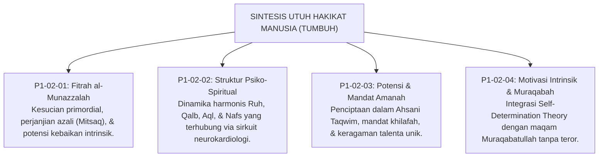

# P1-02-05: SINTESIS FILOSOFIS HAKIKAT KODRAT MANUSIA
## *Konsolidasi Paradigma Insan Pembelajar: Dari Fondasi Teologis Menuju Arsitektur Pengasuhan Santri Paripurna*

**Nomor Identifikasi**: `P1-02-05/SINTESIS-HUMAN-NATURE/2026`  
**Domain**: `01 Philosophy` > `02 Human Nature`  
**Dewan Pakar**: `pakar-filosofi-tumbuh`, `pakar-epistemologi-turats`, `pakar-tata-kelola-qudwah`

---

## 📑 DAFTAR ISI ANALITIS

1. [1. Integrasi Lima Pilar Hakikat Manusia](#1-integrasi-lima-pilar-hakikat-manusia)
2. [2. Matriks Epistemologis: Domain Human Nature TUMBUH](#2-matriks-epistemologis-domain-human-nature-tumbuh)
3. [3. Jembatan Filosofis Menuju Sub-Domain 03 (Human Development)](#3-jembatan-filosofis-menuju-sub-domain-03-human-development)
4. [4. Deklarasi Sikap Kelembagaan Ekosistem TUMBUH](#4-deklarasi-sikap-kelembagaan-ekosistem-tumbuh)

---

### 1. Integrasi Lima Pilar Hakikat Manusia

Sub-Domain `02 Human Nature` telah meletakkan landasan ontologis yang utuh bagi seluruh ekosistem pembinaan pesantren melalui lima pilar keilmuan:

---

### 2. Matriks Epistemologis: Domain Human Nature TUMBUH

| Modul Analisis | Landasan Turats Klasik | Landasan Sains Kontemporer | Manifestasi Praktis di Asrama |
| :--- | :--- | :--- | :--- |
| **P1-02-01 (Fitrah)** | QS. Ar-Rum: 30, HR. Bukhari, Ibn Taimiyyah (*Dar' Ta'arudh*). | *Innate Morality* (Paul Bloom, Yale) & *Moral Foundations* (Haidt). | Paradigma pengasuhan berbasis husnudzan dan pengayoman fitrah. |
| **P1-02-02 (Struktur Diri)** | Al-Ghazali (*Ihya & Ma'arij al-Quds*), Ibn Qayyim (*Ighatsah*). | *Brain-Heart Axis* (Armour) & *Heart-Brain Coherence* (McCraty). | Keseimbangan asupan ruhiyah, kognitif, dan biologis 24-jam. |
| **P1-02-03 (Potensi-Amanah)**| QS. At-Tin: 4, QS. Al-Ahzab: 72, Riwayat sahabat Nabi SAW. | *Multiple Intelligences* (Gardner) & *Strengths-Based Education*. | Kurikulum adab diferensiasi dan peniadaan perankingan tunggal. |
| **P1-02-04 (Motivasi Intrinsik)**| Al-Qusyairi (*Ar-Risalah*), Muhasibi (*Adab an-Nufus*). | *Self-Determination Theory* (Deci & Ryan) & *Autonomy Support*. | Internalisasi disiplin otonom berbasis kesadaran muraqabatullah. |

---

### 3. Jembatan Filosofis Menuju Sub-Domain 03 (Human Development)

Setelah memahami hakikat kodrat manusia (*Human Nature*) yang berakar pada fitrah suci, struktur psiko-spiritual berlapis, dan mandat amanah khilafah, langkah logis berikutnya adalah menelaah **bagaimana kodrat ini bertumbuh dan berkembang sepanjang lintasan usia santri**.

Diskursus ini akan dibedah secara mendalam pada **Sub-Domain `03 Human Development`**, yang menguraikan proses *Tazkiyatun Nafs*, fase transisi biososial remaja pesantren, desain trajektori Tangga TUMBUH T1–T4, dan integrasi *Social Emotional Learning* (CASEL SEL).

---

### 4. Deklarasi Sikap Kelembagaan Ekosistem TUMBUH

Ekosistem TUMBUH mendeklarasikan bahwa:
> *"Segala bentuk perlakuan yang merendahkan martabat manusia, mencederai fisik, mematikan nalar akal, atau menistakan fitrah santri adalah pengkhianatan nyata terhadap amanah kemanusiaan dan syariat Islam. Pesantren TUMBUH berkomitmen menjadi taman peradaban yang memuliakan, menyuburkan, dan mengantarkan fitrah santri menuju derajat Insan Kamil."*
