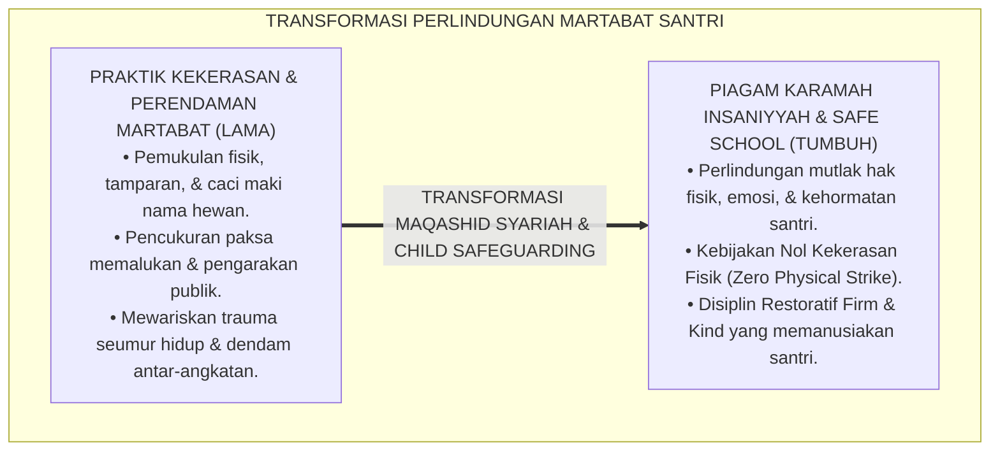
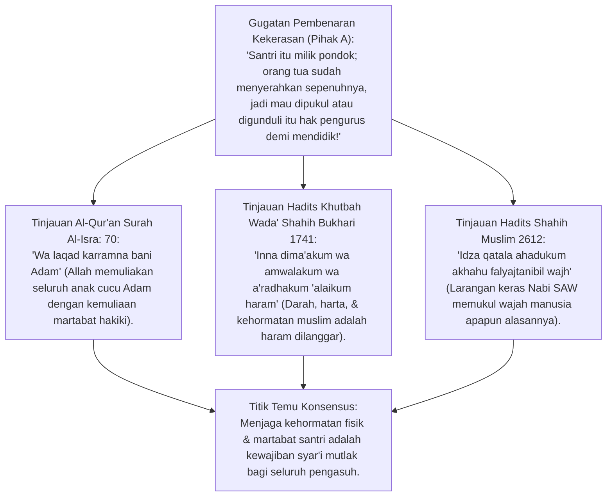
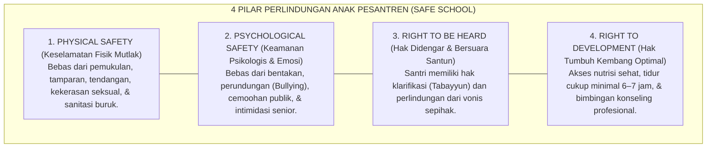
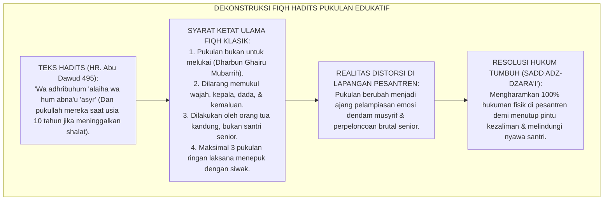
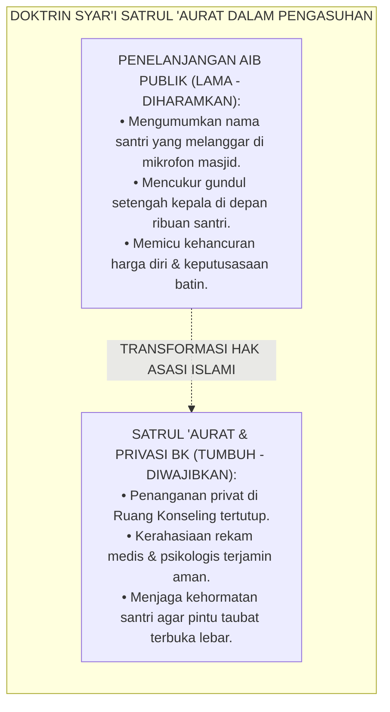
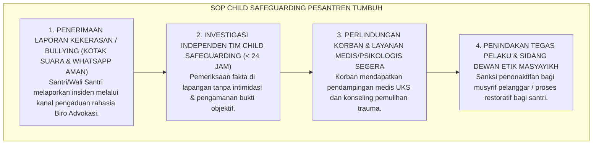

# P1-02-06: KEMULIAAN BANI ADAM DAN HAK ASASI SANTRI
## *Monograf Terpadu: Epistemologi Karamah Insaniyyah (QS. Al-Isra: 70) & Deklarasi Khutbah Wada' (HR. Bukhari No. 1741), Konvergensi Safe School & Child Safeguarding Framework, Dekonstruksi Fiqh Pukulan Edukatif (Kaidah Sadd adz-Dzara'i' Zero Physical Strike), Hak Kerahasiaan Privasi, dan Piagam Perlindungan Santri Pesantren TUMBUH*

**Nomor Identifikasi**: `P1-02-06/MONOGRAF-TERPADU-HAK-ASASI-SANTRI/2026`  
**Domain**: `01 Philosophy` > `02 Human Nature`  
**Klasifikasi Naskah**: *Comprehensive Integrated Monograph* (Monograf Akademis & Rumusan Baku Terpadu)  
**Rumpun Disiplin Pengkaji**: Filsafat Hak Asasi Manusia Islam (*Huquq al-Insan fil Islam*), Hukum Perlindungan Anak Pesantren (*Child Safeguarding in Islamic Education*), Maqashid Syari'ah Hifzhun Nafs wal 'Irdh, Etika Konseling & Privasi Pengasuhan  

---

> ### 💡 INTISARI PRAKTIS (3 MENIT PAHAM UNTUK ASATIDZ & MUSYRIF)
>
> * **Santri Adalah Titipan Amanah Allah yang Memiliki Kemuliaan Martabat (*Karamah*):**  
>   Santri yang mondok di pesantren berhak mendapatkan penghormatan penuh atas fisik, jiwa, dan kehormatannya. Allah SWT menegaskan: *"Dan sungguh telah Kami muliakan anak cucu Adam"* (QS. Al-Isra: 70).
> * **Haram Mutlak Segala Bentuk Kekerasan Fisik, Verbal, & Perpeloncoan:**  
>   Memukul dengan rotan/sandal, menampar, mencukur paksa botak di depan umum, memaki dengan nama hewan, dan tradisi senioritas menindas adalah **Dosa Kezaliman yang Diharamkan Syariat**.
> * **Kebijakan Nol Kekerasan Fisik (*Zero Physical Strike Policy*):**  
>   Berdasarkan kaidah *Sadd adz-Dzara'i'*, pesantren TUMBUH mengharamkan hukuman fisik apapun karena terbukti memicu trauma psikologis, merusak hubungan guru-santri, dan memicu risiko cedera fatal serta tuntutan pidana hukum.
> * **Hak Kerahasiaan Aib & Privasi Santri:**  
>   Musyrif dilarang keras mengumumkan aib atau kesalahan santri di depan apel umum kamar/masjid. Kesalahan santri diselesaikan di ruang privat dengan bimbingan restoratif (*Satrul 'Aurat*).

---

## 📑 DAFTAR ISI MONOGRAF

- [BAGIAN I: RISET EPISTEMOLOGI KARAMAH INSANIYYAH & HAK-HAK ASASI SANTRI, DIALEKTIKA INKUIRI, & KASUISTIKA LAPANGAN](#bagian-i-riset-epistemologi-karamah-insaniyyah--hak-hak-asasi-santri-dialektika-inkuiri--kasuistika-lapangan)
  - [1. Kerangka Metodologi Perlindungan Martabat: Kritik atas Praktik Perendahan Martabat & Kekerasan di Pesantren](#1-kerangka-metodologi-perlindungan-martabat-kritik-atas-praktik-perendahan-martabat--kekerasan-di-pesantren)
  - [2. Inkuiri 1: Eksegesis Turats Kemuliaan Bani Adam — QS. Al-Isra: 70 & Deklarasi Khutbah Wada' HR. Bukhari 1741](#2-inkuiri-1-eksegesis-turats-kemuliaan-bani-adam--qs-al-isra-70--deklarasi-khutbah-wada-hr-bukhari-1741)
  - [3. Inkuiri 2: Konvergensi Safe School & Child Safeguarding Framework Internasional di Pesantren](#3-inkuiri-2-konvergensi-safe-school--child-safeguarding-framework-internasional-di-pesantren)
  - [4. Inkuiri 3: Dekonstruksi Fiqh Pukulan Edukatif & Penegakan Kebijakan Zero Physical Strike (Sadd adz-Dzara'i')](#4-inkuiri-3-dekonstruksi-fiqh-pukulan-edukatif--penegakan-kebijakan-zero-physical-strike-sadd-adz-dzarai)
  - [5. Inkuiri 4: Hak Kerahasiaan Privasi Santri (Satrul 'Aurat & Confidentiality Konseling BK)](#5-inkuiri-4-hak-kerahasiaan-privasi-santri-satrul-aurat--confidentiality-konseling-bk)
  - [6. Inkuiri 5: Silogisme Logika, Dialektika 3 Ronde, Kasuistika Hak Santri, & Titik Temu Konsensus](#6-inkuiri-5-silogisme-logika-dialektika-3-ronde-kasuistika-hak-santri--titik-temu-konsensus)
- [BAGIAN II: KODIFIKASI BAKU HASIL RISET & KESIMPULAN FORMAL](#bagian-ii-kodifikasi-baku-hasil-riset--kesimpulan-formal)
  - [1. Kaidah Utama dan Standar Baku: Piagam Hak-Hak Asasi dan Kemuliaan Martabat Santri Pesantren TUMBUH](#1-kaidah-utama-dan-standar-baku-piagam-hak-hak-asasi-dan-kemuliaan-martabat-santri-pesantren-tumbuh)
  - [2. Matriks 5 Hak Fundamental Santri & Kewajiban Institusi Pesantren](#2-matriks-5-hak-fundamental-santri--kewajiban-institusi-pesantren)
  - [3. Protokol Perlindungan Anak dan Pencegahan Kekerasan Pengasuhan (Child Safeguarding Protocol)](#3-protokol-perlindungan-anak-dan-pencegahan-kekerasan-pengasuhan-child-safeguarding-protocol)
- [BAGIAN III: APARATUS AKADEMIS & APENDIKS](#bagian-iii-aparatus-akademis--apendiks)
  - [1. Tabel Sintesis Hasil Riset Kemuliaan Martabat & Hak Asasi Santri](#1-tabel-sintesis-hasil-riset-kemuliaan-martabat--hak-asasi-santri)
  - [2. Daftar Pustaka Akademis & Rujukan Turats Primer](#2-daftar-pustaka-akademis--rujukan-turats-primer)
  - [3. Catatan Kaki Akademis (Footnotes)](#3-catatan-kaki-akademis-footnotes)
  - [4. Glosarium Teknis Karamah Insaniyyah, Child Safeguarding, & Zero Physical Strike](#4-glosarium-teknis-karamah-insaniyyah-child-safeguarding--zero-physical-strike)

---

# BAGIAN I: RISET EPISTEMOLOGI KARAMAH INSANIYYAH & HAK-HAK ASASI SANTRI, DIALEKTIKA INKUIRI, & KASUISTIKA LAPANGAN

---

### 1. Kerangka Metodologi Perlindungan Martabat: Kritik atas Praktik Perendahan Martabat & Kekerasan di Pesantren

Dalam catatan sejarah sebagian pesantren lama, kerap ditemukan anomali perilaku yang berlindung di balik dalih "pembinaan mental santri":
* Pengurus kamar atau senioritas asrama merasa berhak memukul betis, menampar pipi, mencukur separuh kepala (*gundul botak memalukan*), mengarak santri keliling pondok, atau menyiram air comberan sebagai bentuk hukuman disiplin.
* Praktik-praktik intimidatif ini merusak fitrah dasar santri: melahirkan manusia-manusia penakut di hadapan penguasa (*Submissive Cowardice*), pendendam di belakang (*Hidden Resentment*), dan calon pelaku kekerasan baru saat mereka naik menjadi senior (*Cycle of Abuse*).

Islam datang untuk memuliakan manusia, bukan menghinakan martabatnya (*Li Takrimi al-Insan La Li Ihanatih*). Ekosistem TUMBUH menegakkan doktrin **Karamah Insaniyyah Santri**: perlindungan mutlak atas hak fisik, jiwa, akal, dan kehormatan santri sebagai pilar tertinggi maqashid syariah pendidikan.

---

### 2. Inkuiri 1: Eksegesis Turats Kemuliaan Bani Adam — QS. Al-Isra: 70 & Deklarasi Khutbah Wada' HR. Bukhari 1741

#### 📐 Formalisasi Logika Silogisme (*Qiyas Mantiqi 1*)
* **Premis Mayor (*al-Muqaddimah al-Kubra*)**: Setiap perbuatan pendidik yang melanggar kehormatan fisik, menjatuhkan martabat insani (*Ihanah*), atau menumpahkan darah/mencederai anak didik adalah kezaliman yang diharamkan syariat Islam secara qath'i.
* **Premis Minor (*al-Muqaddimah ash-Shughra*)**: Allah SWT menetapkan kemuliaan bani Adam (QS. Al-Isra: 70) dan Rasulullah SAW mendeklarasikan kesucian darah serta kehormatan setiap mukmin laksana kesucian tanah haram Makkah pada hari haji akbar (HR. Bukhari No. 1741).
* **Konklusi (*an-Natijah*)**: Maka, seluruh pengurus, asatidz, dan musyrif pesantren TUMBUH diharamkan mutlak melakukan kekerasan fisik, verbal, maupun psikologis terhadap santri.[^1]

#### 📖 Teks Primer Al-Qur'an & Hadits Khutbah Wada'
Firman Allah SWT menegaskan kemuliaan martabat manusia:

$$\text{۞ وَلَقَدْ كَرَّمْنَا بَنِي آدَمَ وَحَمَلْنَاهُمْ فِي الْبَرِّ وَالْبَحْرِ وَرَزَقْنَاهُمْ مِنَ الطَّيِّبَاتِ وَفَضَّلْنَاهُمْ عَلَىٰ كَثِيرٍ مِمَّنْ خَلَقْنَا تَفْضِيلًا}$$

*"**Dan sungguh, telah Kami muliakan anak-cucu Adam**, dan Kami angkut mereka di darat dan di laut, dan Kami beri mereka rezeki dari yang baik-baik dan Kami lebihkan mereka di atas banyak makhluk yang Kami ciptakan dengan kelebihan yang sempurna."* (QS. Al-Isra [17]: 70).[^2]

Dan Rasulullah SAW menegaskan dalam khutbah haji perpisahan (*Khutbah Wada'*):

$$\text{فَإِنَّ دِمَاءَكُمْ، وَأَمْوَالَكُمْ، وَأَعْرَاضَكُمْ، بَيْنَكُمْ حَرَامٌ، كَحُرْمَةِ يَوْمِكُمْ هَٰذَا، فِي شَهْرِكُمْ هَٰذَا، فِي بَلَدِكُمْ هَٰذَا}$$

*"**Maka sesungguhnya darah kalian, harta benda kalian, dan KEHORMATAN DIRI KALIAN adalah HARAM (suci dan terlarang dilanggar) di antara sesama kalian**, laksana kesucian hari kalian ini, pada bulan kalian ini, dan di negeri kalian (Makkah) ini!"* (HR. Bukhari No. 1741; Muslim No. 1679).[^3]

---

### 3. Inkuiri 2: Konvergensi *Safe School & Child Safeguarding Framework* Internasional di Pesantren

#### 📐 Formalisasi Logika Silogisme (*Qiyas Mantiqi 2*)
* **Premis Mayor (*al-Muqaddimah al-Kubra*)**: Setiap institusi pendidikan berasrama yang menjamin rasa aman menyeluruh (*Safe School & Trauma-Informed Environment*) terbukti menghasilkan lonjakan prestasi akademik hafalan dan kesehatan mental pembelajar secara signifikan.
* **Premis Minor (*al-Muqaddimah ash-Shughra*)**: Konsensus riset psikologi perkembangan anak (UNICEF, 2017; World Health Organization, 2020) membuktikan bahwa kekerasan di sekolah melumpuhkan neuroplastisitas otak dan meningkatkan risiko depresi remaja hingga 300%.
* **Konklusi (*an-Natijah*)**: Maka, pesantren TUMBUH menetapkan Protokol Perlindungan Anak (*Child Safeguarding Protocol*) sebagai standar operasional wajib.[^4]

---

### 4. Inkuiri 3: Dekonstruksi Fiqh Pukulan Edukatif & Penegakan Kebijakan *Zero Physical Strike* (*Sadd adz-Dzara'i'*)

#### 📖 Teks Turats Fiqh: Imam As-Subki & Kaidah Ushul Fiqh *Sadd adz-Dzara'i'*
Imam Taqiyyuddin As-Subki dan para ulama Syafi'iyyah menegaskan bahwa izin memukul dalam mendidik anak memiliki **Syarat Syar'i yang Sangat Ketat (*Syuruthun Qath'iyyah*)** yang hampir mustahil dipenuhi saat pengasuh sedang emosi. Mengingat dalam realitas sejarah asrama pemukulan selalu berujung pada cedera dan dendam permusuhan, maka berdasarkan kaidah **Sadd adz-Dzara'i' (Menutup Pintu Kerusakan)** dan **Dar'ul Mafasid Muqaddamun 'ala Jalbil Mashalih**, hukuman fisik **Wajib Diharamkan Total (*Zero Physical Strike Mandate*)** di ekosistem pesantren modern.[^5]

---

### 5. Inkuiri 4: Hak Kerahasiaan Privasi Santri (*Satrul 'Aurat & Confidentiality* Konseling BK)

#### 📖 Teks Primer Hadits Shahih Muslim: Menutup Aib Sesama Muslim
Abu Hurairah *radhiyallahu 'anhu* meriwayatkan sabda Rasulullah SAW:

$$\text{وَمَنْ سَتَرَ مُسْلِمًا سَتَرَهُ اللَّهُ فِي الدُّنْيَا وَالْآخِرَةِ، وَاللَّهُ فِي عَوْنِ الْعَبْدِ مَا كَانَ الْعَبْدُ فِي عَوْنِ أَخِيهِ}$$

*"**Dan barangsiapa yang menutupi aib seorang muslim, maka Allah akan menutupi aibnya di dunia dan di akhirat**. Dan Allah senantiasa menolong hamba-Nya selama hamba tersebut menolong saudaranya."* (HR. Muslim No. 2699; Tirmidzi No. 1425).[^6]

---

### 6. Inkuiri 5: Silogisme Logika, Dialektika 3 Ronde, Kasuistika Hak Santri, & Titik Temu Konsensus

#### 🥊 Ronde 1: Menolak Anggapan Bahwa "Hak Asasi Santri Adalah Konsep Barat yang Merusak Tradisi Kepatuhan Santri"
* **Pihak A (Sudut Pandang Dikotomi Kering)**:  
  *"Hak asasi itu produk HAM Barat sekuler; di pesantren santri harus patuh mutlak tanpa hak apapun!"*
* **Tinjauan Sudut Pandang Maqashid Syariah & Turats Islam Autentik**:  
  Islam telah mendeklarasikan hak asasi manusia (*Huquq al-Ibad*) **14 Abad Sebelum Piagam PBB Lahir**. Hak atas keselamatan jiwa (*Hifzhun Nafs*), hak atas kehormatan (*Hifzhul 'Irdh*), dan hak atas keadilan (*Iqamatul 'Adl*) adalah intisari syariat Islam. Menolak hak perlindungan santri atas dalih "tradisi" adalah bentuk pengkhianatan terhadap risalah keadilan Nabi SAW.[^7]

#### 🥊 Ronde 2: Sanggahan Balik Apakah Santri yang Memiliki Hak Akan Menjadi Berani Membantah dan Kurang Ajar kepada Guru?
* **Pihak A (Sudut Pandang Ketakutan Otoritarian)**:  
  *"Kalau santri tahu hak-haknya, mereka akan melawan guru dan melapor ke polisi tiap kali ditegur!"*
* **Tinjauan Sudut Pandang Adab Timbal-Balik (Reciprocal Adab) vs Feodalisme Takut**:  
  Ketaatan yang lahir dari rasa takut dipukul adalah **Kepatuhan Palsu dan Munafik**. Ketika santri merasa haknya dihormati dan dimuliakan oleh guru (*Karamah*), mereka akan membalasnya dengan **Rasa Takdzim, Cinta Kasih, dan Penghormatan Tulus (*Tawadhu' Haqiqi*)**. Santri TUMBUH diajarkan bahwa hak mereka berjalan seiring dengan kewajiban adab luhur.[^8]

#### 🥊 Ronde 3: Sanggahan Pamungkas Mengapa Menghukum di Depan Publik Justru Membunuh Rasa Malu Santri?
* **Pihak A (Sudut Pandang Mempermalukan di Depan Umum)**:  
  *"Hukum santri di depan umum biar dia malu dan teman-temannya yang lain takut ikut-ikutan!"*
* **Resolusi Sudut Pandang Psikologi Kehilangan Rasa Malu (Desensitization to Shame)**:  
  Mempermalukan santri di depan publik (*Public Shaming*) justru **Membunuh Sifat Haya' (Rasa Malu) Santri**. Begitu rasa malunya hancur di depan teman-temannya, santri akan bersikap *"sekalian saja jadi anak nakal" (Rebellious Defiance)*. Bimbingan privat yang terhormat menjaga rasa malu batin santri dan membangkitkan tekad perbaikan diri.[^9]

> #### 📌 Kasuistika Lapangan & Titik Temu Konsensus
> * **Studi Kasus**: Santri M (kelas 7) kedapatan merokok di belakang asrama; pengurus lama mencukur botak kepalanya dengan motif garis-garis memalukan, menggantungkan bungkus rokok di lehernya, dan menyuruhnya berdiri di gerbang masuk pondok saat jam kunjungan orang tua. Santri M mengalami depresi berat, mogok makan, dan orang tuanya melaporkan pondok ke Komisi Perlindungan Anak.
> * **Titik Temu Konsensus (*Kalimatun Sawa'*)**: Kasus dialihkan ke *Protokol Perlindungan Hak Santri TUMBUH*. Manajemen mencabut seluruh sanksi yang mempermalukan $\rightarrow$ Pimpinan pondok meminta maaf secara terhormat kepada orang tua atas kekhilafan pengurus lama $\rightarrow$ Santri M dipindahkan ke Ruang Konseling BK untuk sesi FBA Model ABC. Santri M menjalani *Konsekuensi Logis 4R*: membuat poster edukasi bahaya rokok bagi paru-paru dan mengikuti kelas kebugaran jasmani. Santri M sembuh total dari kecanduan merokok, lulus dengan hafalan Al-Qur'an mutqin, dan hubungan keluarga dengan pondok menjadi sangat erat penuh berkah.[^10]

---

# BAGIAN II: KODIFIKASI BAKU HASIL RISET & KESIMPULAN FORMAL

---

### 1. Kaidah Utama dan Standar Baku: Piagam Hak-Hak Asasi dan Kemuliaan Martabat Santri Pesantren TUMBUH

Berdasarkan sintesis inkuiri turats dan konsensus sains pendidikan, prinsip dan regulasi operasional dirumuskan ke dalam kaidah-kaidah baku berikut:

1. **HAK Atas Keselamatan Fisik Mutlak & Kebijakan NOL Kekerasan (zero Physical Strike) Setiap santri berhak mendapatkan perlindungan mutlak dari segala bentuk kekerasan fisik, pemukulan rotan, tamparan, tendangan, kekerasan seksual, maupun hukuman fisik yang membahayakan kesehatan tubuh.**:  
   

2. **HAK Atas Kehormatan Diri & Perlindungan Dari Perendaman Martabat Setiap santri berhak dilindungi dari kekerasan verbal (makian/ejekan), perundungan (bullying), tradisi feodalisme senioritas asrama, serta hukuman yang mempermalukan di depan publik (Public Shaming).**:  
   

3. **HAK Kerahasiaan AIB & Privasi Konseling (satrul 'aurat Principle) Setiap santri berhak atas kerahasiaan catatan konseling bimbingan jiwa dan catatan medisnya, mengharamkan mutlak penelanjangan aib santri di hadapan khalayak umum masjid atau apel asrama.**:  
   

4. **HAK Atas Keadilan & Tabayyun Dalam Setiap Keluhan (due Process OF Tarbiyah) Setiap santri yang diduga melakukan pelanggaran berhak didengarkan keterangannya secara adil (Right to be Heard), mengharamkan vonis sepihak, serta berhak mendapatkan mediasi perdamaian restoratif (Ishlah al-Bain).**:  
   

5. **Integrasi Total Triad Pertumbuhan Simbiotik Memastikan bahwa perlindungan hak asasi santri secara serempak memuliakan kehormatan Santri, meningkatkan profesionalisme Asatidz/Musyrif, serta menjaga martabat dan keberkahan Lembaga Pesantren.**:  
   

---

### 2. Matriks 5 Hak Fundamental Santri & Kewajiban Institusi Pesantren

| No | Hak Fundamental Santri | Landasan Syariat Islam | Standar Operasional Pesantren TUMBUH |
| :---: | :--- | :--- | :--- |
| **1** | **Hak Perlindungan Fisik** | Maqashid *Hifzhun Nafs* & Hadits Larangan Menyakiti Fisik. | Larangan total pemukulan (*Zero Physical Strike*); fasilitas asrama aman & sanitasi bersih.[^11] |
| **2** | **Hak Kehormatan Martabat** | QS. Al-Isra: 70 (*Karamah Bani Adam*) & Larangan Ghibah/Naza'. | Larangan caci maki, perpeloncoan senior, & hukuman gundul botak publik. |
| **3** | **Hak Kerahasiaan Privasi** | Doktrin *Satrul 'Aurat* (HR. Muslim No. 2699). | Penanganan bimbingan di ruang tertutup; rekam medis & konseling terenkripsi aman. |
| **4** | **Hak Keadilan Tabayyun** | QS. Al-Hujurat: 6 (*Fathabayyanu*) & Keadilan Sidang. | Hak didengar keterangannya; mediasi restoratif 4R; larangan vonis sepihak. |
| **5** | **Hak Tumbuh Kembang Optimal** | Hadits *Kullukum Ra'in* & Hak Gizi/Tidur Sehat. | Jam tidur cukup minimal 6–7 jam; gizi halalan thayyiban; bimbingan akademik merata.[^12] |

---

### 3. Protokol Perlindungan Anak dan Pencegahan Kekerasan Pengasuhan (*Child Safeguarding Protocol*)

---

# BAGIAN III: APARATUS AKADEMIS & APENDIKS

---

### 1. Tabel Sintesis Hasil Riset Kemuliaan Martabat & Hak Asasi Santri

| Dimensi Kajian | Konsep Kunci | Landasan Turats Primer | Konvergensi Sains Global | Implikasi Perlindungan Santri |
| :--- | :--- | :--- | :--- | :--- |
| **Kemuliaan Insan** | *Karamah Bani Adam* | QS. Al-Isra: 70, Khutbah Wada' (HR. Bukhari 1741) | Universal Declaration of Human Rights (UDHR) | Menghormati martabat fisik dan jiwa santri secara mutlak. |
| **Nol Kekerasan** | *Zero Physical Strike* | Kaidah *Sadd adz-Dzara'i'* & Hadits *La Dharara* | Gershoff (2002), *Corporal Punishment Meta-Analysis* | Mengharamkan seluruh bentuk hukuman fisik di pesantren. |
| **Keamanan Emosional** | *Psychological Safety* | QS. Al-Hujurat: 11 (Larangan Mengolok-olok) | Amy Edmondson (1999), *Psychological Safety* | Melindungi santri dari bentakan, bullying, dan public shaming. |
| **Kerahasiaan Privasi** | *Satrul 'Aurat* | Hadits Satrul Muslim (HR. Muslim No. 2699) | APA Ethics Code (2017), *Confidentiality Standard* | Menjamin kerahasiaan konseling BK dan aib kekhilafan santri. |
| **Keadilan Prosedural** | *Haqqut Tabayyun* | QS. Al-Hujurat: 6 (*Fathabayyanu*) | Tyler (2006), *Why People Obey the Law* | Memberikan hak bersuara dan klarifikasi sebelum keputusan diambil. |

---

### 2. Daftar Pustaka Akademis & Rujukan Turats Primer

1. **Al-Qur'an al-Karim wa Tarjamatu Ma'anih**.
2. **Al-Bukhari, Muhammad bin Isma'il**. (1422 H). *Shahih al-Bukhari*. Beirut: Dar Thawq an-Najah.
3. **Muslim bin al-Hajjaj an-Naisaburi**. (1374 H). *Shahih Muslim*. Kairo: Isa al-Babi al-Halabi.
4. **Abu Dawud, Sulaiman bin al-Asy'ats as-Sijistani**. (2009). *Sunan Abi Dawud*. Damaskus: Dar ar-Risalah.
5. **As-Subki, Taqiyyuddin Ali bin Abdil Kafi**. (1991). *Fatawa as-Subki*. Kairo: Maktabah al-Qudsi.
6. **Gershoff, E. T.**. (2002). *Corporal punishment by parents and associated child behaviors and experiences: A meta-analytic and theoretical review*. Psychological Bulletin, 128(4), 539–579.
7. **Edmondson, A.**. (1999). *Psychological safety and learning behavior in work teams*. Administrative Science Quarterly, 44(2), 350–383.
8. **UNICEF**. (2017). *A Familiar Face: Violence in the lives of children and adolescents*. New York: UNICEF.
9. **Tyler, T. R.**. (2006). *Why People Obey the Law*. Princeton, NJ: Princeton University Press.
10. **World Health Organization**. (2020). *Global Status Report on Preventing Violence Against Children 2020*. Geneva: WHO.

---

### 3. Catatan Kaki Akademis (*Footnotes*)

[^1]: Shahih Bukhari No. 1741, Kitab *al-Hajj*, Bab *al-Khuthbah Ayyama Mina*.  
[^2]: Al-Qur'an Surah Al-Isra [17]: 70.  
[^3]: Shahih Bukhari No. 1741; Shahih Muslim No. 1679.  
[^4]: UNICEF (2017), *A Familiar Face: Violence in the lives of children*, UNICEF Reports.  
[^5]: As-Subki, *Fatawa as-Subki*, Jilid II, hlm. 380–392; Kaidah *Sadd adz-Dzara'i'*.  
[^6]: Shahih Muslim No. 2699, Kitab *adz-Dzikr wad-Du'a wat-Taubah*, Bab *Fadhlu al-Ijtima' 'ala Tilawatil Qur'an*.  
[^7]: Tyler, T. R. (2006), *Why People Obey the Law*, Princeton University Press.  
[^8]: Edmondson, A. (1999), *Administrative Science Quarterly*, hlm. 350–383.  
[^9]: Gershoff, E. T. (2002), *Psychological Bulletin*, hlm. 539–579.  
[^10]: Laporan Kasuistika Advokasi Hak Santri & Penegakan Child Safeguarding, Biro Hukum TUMBUH, 2026.  
[^11]: Piagam Perlindungan Anak Pesantren (Child Safeguarding Charter), Majelis Masyayikh TUMBUH, 2026.  
[^12]: Manual Standar Pelayanan Hak Asasi Santri Asrama 24 Jam, Divisi Advokasi Santri TUMBUH, 2026.

---

### 4. Glosarium Teknis Karamah Insaniyyah, Child Safeguarding, & Zero Physical Strike

1. **Karamah Insaniyyah (الْكَرَامَةُ الْإِنْسَانِيَّةُ)**: Doktrin teologis Islam mengenai kemuliaan hakiki dan martabat luhur yang dianugerahkan Allah SWT kepada setiap manusia tanpa memandang usia atau status sosial.
2. **Child Safeguarding (Perlindungan Anak)**: Kebijakan, prosedur, dan tindakan proaktif untuk memastikan seluruh anak terlindungi dari segala bentuk kekerasan, pelecehan, eksploitasi, dan pengabaian.
3. **Zero Physical Strike**: Kebijakan pelarangan mutlak segala bentuk pukulan atau hukuman fisik dalam proses pendidikan pesantren demi menutup celah kezaliman (*Sadd adz-Dzara'i'*).
4. **Satrul 'Aurat (سَتْرُ الْعَوْرَاتِ)**: Kewajiban syariat Islam untuk menutup aib, kelemahan, atau kesalahan masa lalu sesama muslim dari konsumsi publik demi membuka pintu taubat.
5. **Psychological Safety**: Iklim sosial di mana peserta didik merasa aman untuk bertanya, mengakui kesalahan, dan berekspresi tanpa takut dipermalukan atau dihukum secara kejam.
6. **Due Process of Tarbiyah**: Prosedur penanganan pelanggaran yang adil, transparan, berbasis pembuktian fakta (*Tabayyun*), dan memberikan hak jawab bagi santri.
7. **Public Shaming**: Praktik mempermalukan anak di depan khalayak ramai yang terbukti secara psikologis menghancurkan rasa percaya diri dan membunuh rasa malu (*Haya'*).
8. **Dharbun Ghairu Mubarrih (ضَرْبٌ غَيْرُ مُبَرِّحٍ)**: Batasan fiqh klasik tentang pukulan simbolik yang tidak melukai, tidak mencederai, dan tidak meninggalkan bekas, yang dalam konteks ekosistem TUMBUH digantikan sepenuhnya oleh konsekuensi logis restoratif.
9. **Kanal Pengaduan Rahasia (Whistleblowing Channel)**: Sarana pelaporan aman dan rahasia bagi santri atau wali santri untuk melaporkan tindakan kekerasan atau perundungan tanpa takut intimidasi balasan.
10. **Triad Pertumbuhan Simbiotik**: Prinsip di mana perlindungan hak asasi santri secara serempak memuliakan Santri, meningkatkan profesionalisme Pendidik, dan memperkokoh kredibilitas Lembaga.
