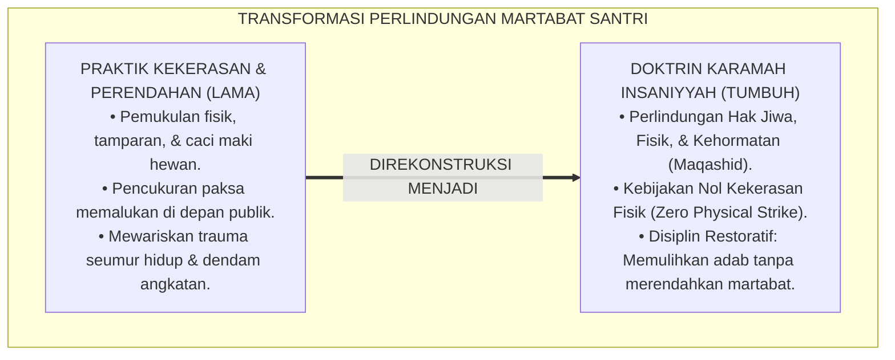
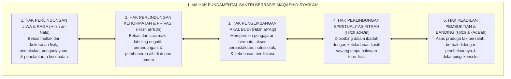
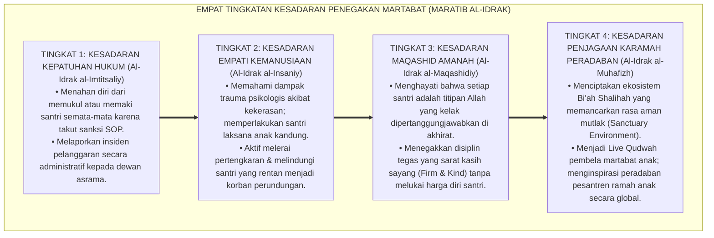
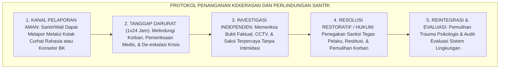

# P1-02-06: KEMULIAAN BANI ADAM DAN HAK ASASI SANTRI (HUMAN DIGNITY & SANCTITY OF STUDENTS' RIGHTS)
## *Monograf Riset Akademik: Epistemologi Karamah Insaniyyah (QS. Al-Isra': 70), Piagam Khutbah Wada' (HR. Al-Bukhari No. 1741), Konvergensi Child Safeguarding Framework, Kaidah Sadd adz-Dzara'i' Zero Physical Strike, Serta Penegakan Martabat Santri di Pesantren 24 Jam*

**Nomor Identifikasi**: `P1-02-06/MONOGRAF-RISET-HAK-ASASI-SANTRI/2026`  
**Domain**: `01 Philosophy` > `02 Human Nature` (Sub-Modul 06: *Human Dignity & Rights*)  
**Klasifikasi Naskah**: *Academic Research Monograph* (Monograf Riset Akademik Fondasional)  
**Rumpun Disiplin Pengkaji**: Filsafat Hak Asasi Manusia Islam (*Huquq al-Insan fil Islam*), Hukum Perlindungan Anak Pesantren (*Child Safeguarding*), Maqashid Syari'ah (*Hifzh an-Nafs wal 'Irdh*), Etika Konseling & Privasi Pengasuhan  

---

> ### 💡 INTISARI EKSEKUTIF (EXECUTIVE SUMMARY)
>
> * **Kelemahan Paradigma Lama: Normalisasi Kekerasan Fisik & Perendahan Martabat:**  
>   Sebagian lingkungan pesantren lama mewajarkan praktik hukuman yang merendahkan martabat: pemukulan dengan rotan/sandal, penamparan wajah, pencukuran botak paksa di depan umum, atau caci maki dengan nama hewan atas dalih "pembinaan mental". Praktik ini melanggar syariat dan mewariskan siklus trauma kekerasan (*Cycle of Abuse*).
> * **Inovasi Konseptual: Doktrin Karamah Insaniyyah & Kebijakan Nol Kekerasan Fisik:**  
>   TUMBUH menegakkan doktrin **Karamah Insaniyyah (Kemuliaan Martabat Cucu Adam - QS. Al-Isra': 70)** dan Piagam Khutbah Wada': darah, harta, dan kehormatan santri adalah suci (*Haramun 'Alaikum*). Berdasarkan kaidah fiqh *Sadd adz-Dzara'i'*, TUMBUH memberlakukan **Kebijakan Nol Kekerasan Fisik & Verbal (*Zero Physical & Verbal Strike Policy*)** serta perlindungan mutlak privasi santri (*Satrul 'Aurat*).
> * **Formulasi Operasional & Pembuktian Lapangan:**  
>   Monograf ini menguraikan matriks 5 hak fundamental santri, 4 Tingkatan Kesadaran Penegakan Martabat (*Maratib al-Idrak*), protokol pencegahan kekerasan pengasuhan (*Child Safeguarding Protocol*), dan sistem akuntabilitas dewan disiplin.

---

## 📑 DAFTAR ISI MONOGRAF

- [BAB I: LANDASAN TEORETIS & DISKURSUS KRITIS](#bab-i-landasan-teoretis--diskursus-kritis)
  - [1. Latar Belakang Masalah: Krisis Normalisasi Kekerasan dan Pelecehan Martabat di Pesantren](#1-latar-belakang-masalah-krisis-normalisasi-kekerasan-dan-pelecehan-martabat-di-pesantren)
  - [2. Eksegesis Turats Kemuliaan Martabat: QS. Al-Isra': 70 dan Piagam Deklarasi Khutbah Wada' (HR. Al-Bukhari No. 1741)](#2-eksegesis-turats-kemuliaan-martabat-qs-al-isra-70-dan-piagam-deklarasi-khutbah-wada-hr-al-bukhari-no-1741)
  - [3. Dekonstruksi Fiqh Pukulan Edukatif & Kaidah Sadd adz-Dzara'i' Zero Physical Strike](#3-dekonstruksi-fiqh-pukulan-edukatif--kaidah-sadd-adz-dzarai-zero-physical-strike)
  - [4. Konvergensi Child Safeguarding Internasional & Hak Kerahasiaan Privasi Santri (Satrul 'Aurat)](#4-konvergensi-child-safeguarding-internasional--hak-kerahasiaan-privasi-santri-satrul-aurat)
  - [5. Kasuistika Lapangan: Kasus Perundungan Senior Berkedok Disiplin & Resolusi Restoratif Terpadu](#5-kasuistika-lapangan-kasus-perundungan-senior-berkedok-disiplin--resolusi-restoratif-terpadu)
- [BAB II: FORMULASI KONSEPTUAL & PEMBAHASAN MENDALAM](#bab-ii-formulasi-konseptual--pembahasan-mendalam)
  - [1. Eksplanasi Teoretis Piagam Kemuliaan Martabat & Hak Asasi Santri TUMBUH](#1-eksplanasi-teoretis-piagam-kemuliaan-martabat--hak-asasi-santri-tumbuh)
  - [2. Dekomposisi Dimensi & Empat Tingkatan Kesadaran Penegakan Martabat (Maratib al-Idrak)](#2-dekomposisi-dimensi--empat-tingkatan-kesadaran-penegakan-martabat-maratib-al-idrak)
  - [3. Matriks Lima Hak Fundamental Santri & Kewajiban Institusi Pesantren](#3-matriks-lima-hak-fundamental-santri--kewajiban-institusi-pesantren)
  - [4. Protokol Perlindungan Anak dan Pencegahan Kekerasan Pengasuhan (Child Safeguarding Protocol)](#4-protokol-perlindungan-anak-dan-pencegahan-kekerasan-pengasuhan-child-safeguarding-protocol)
  - [5. Diskusi Filosofis Mendalam & Implikasi bagi Masa Depan Peradaban Pendidikan Islam](#5-diskusi-filosofis-mendalam--implikasi-bagi-masa-depan-peradaban-pendidikan-islam)
- [BAB III: KESIMPULAN & APARATUS AKADEMIS](#bab-iii-kesimpulan--aparatus-akademis)
  - [1. Tabel Sintesis Temuan Riset Kemuliaan Martabat dan Hak Santri](#1-tabel-sintesis-temuan-riset-kemuliaan-martabat-dan-hak-santri)
  - [2. Daftar Pustaka Akademis & Rujukan Turats Primer](#2-daftar-pustaka-akademis--rujukan-turats-primer)
  - [3. Catatan Kaki Akademis (Footnotes)](#3-catatan-kaki-akademis-footnotes)
  - [4. Glosarium Istilah Ilmiah & Turats Perlindungan Hak Santri](#4-glosarium-istilah-ilmiah--turats-perlindungan-hak-santri)

---

# BAB I: LANDASAN TEORETIS & DISKURSUS KRITIS

---

### 1. Latar Belakang Masalah: Krisis Normalisasi Kekerasan dan Pelecehan Martabat di Pesantren

Dalam dinamika sebagian lembaga pendidikan Islam, kerap terjadi distorsi pemahaman yang melegalkan perlakuan kasar atas nama "ketegasan pendidikan":
* **Normalisasi Kekerasan Fisik & Verbal**: Tindakan menampar, memukul dengan kayu, mencukur botak separuh kepala secara memalukan (*Gundul Hukuman*), atau menyiram santri dengan air comberan dianggap wajar sebagai "proses penggemblengan mental".
* **Dampak Kerusakan Neuropsikologis**: Riset membuktikan bahwa kekerasan pengasuhan tidak melahirkan ketaatan sejati, melainkan menghasilkan sindrom kecemasan traumatis (*PTSD*), merusak konektivitas korteks prefrontal otak, memicu perilaku pasif-agresif, dan melestarikan rantai dendam antargenerasi (*Cycle of Violence*).
* **Keniscayaan Doktrin Karamah Insaniyyah**: Islam diturunkan untuk memuliakan manusia (*Li Takrimil Insan La Li Ihanatih*). Seluruh santri yang dititipkan di pesantren wajib dilindungi fisik, jiwa, dan kehormatannya secara mutlak.[^1]

---

### 2. Eksegesis Turats Kemuliaan Martabat: QS. Al-Isra': 70 dan Piagam Deklarasi Khutbah Wada' (HR. Al-Bukhari No. 1741)

Al-Qur'an menetapkan status kemuliaan universal seluruh anak cucu Adam:

$$\text{وَلَقَدْ كَرَّمْنَا بَنِي آدَمَ وَحَمَلْنَاهُمْ فِي الْبَرِّ وَالْبَحْرِ وَرَزَقْنَاهُم مِّنَ الطَّيِّبَاتِ وَفَضَّلْنَاهُمْ عَلَىٰ كَثِيرٍ مِّمَّنْ خَلَقْنَا تَفْضِيلًا}$$

*"Dan sungguh telah Kami muliakan anak-anak cucu Adam, dan Kami angkut mereka di daratan dan di lautan, dan Kami beri mereka rezeki dari yang baik-baik dan Kami lebihkan mereka di atas banyak makhluk yang telah Kami ciptakan dengan kelebihan yang sempurna."* (QS. Al-Isra' [17]: 70).[^2]

Dalam **Khutbah Wada'**, Rasulullah ﷺ mendeklarasikan piagam hak asasi manusia paling agung dalam sejarah:

$$\text{إِنَّ دِمَاءَكُمْ وَأَمْوَالَكُمْ وَأَعْرَاضَكُمْ عَلَيْكُمْ حَرَامٌ، كَحُرْمَةِ يَوْمِكُمْ هَذَا، فِي شَهْرِكُمْ هَذَا، فِي بَلَدِكُمْ هَذَا}$$

*"**Sesungguhnya darah kalian, harta benda kalian, dan kehormatan martabat kalian adalah haram (suci dan terlarang untuk dinodai) atas sesama kalian**, sebagaimana sucinya hari kalian ini, dalam bulan kalian ini, di negeri kalian ini."* (HR. Al-Bukhari No. 1741 & Muslim No. 1679).[^3]

---

### 3. Dekonstruksi Fiqh Pukulan Edukatif & Kaidah Sadd adz-Dzara'i' Zero Physical Strike

Penyelidikan mendalam terhadap riwayat hadits perintah memukul anak saat enggan shalat pada usia 10 tahun membuktikan bahwa:
* Pukulan yang dimaksud oleh syariat adalah pukulan isyarat (*Dharb Ghayr Mubarrih*) menggunakan siwak yang sama sekali tidak melukai fisik dan diharamkan mengenai wajah atau bagian tubuh vital.
* Namun dalam praksis lapangan pesantren, dalil ini kerap diselewengkan menjadi legitimasi pelampiasan amarah membabi-buta oleh musyrif atau senior.
* Oleh karena itu, berdasarkan kaidah **Sadd adz-Dzara'i' (Menutup Pintu Menuju Kerusakan Fatal)** dan kaidah *Dar'ul Mafasid Muqaddamun 'ala Jalbil Mashalih*, TUMBUH menetapkan **Kebijakan Nol Kekerasan Fisik (*Zero Physical Strike Policy*)**: mengharamkan mutlak segala bentuk kontak fisik hukuman dan menggantinya dengan konsekuensi logis restoratif.[^4]

---

### 4. Konvergensi Child Safeguarding Internasional & Hak Kerahasiaan Privasi Santri (Satrul 'Aurat)

Ekosistem TUMBUH menyelaraskan protokol perlindungan anak (*Child Safeguarding Framework*) dengan prinsip syariat **Satrul 'Aurat (Menutup Aib Sesama Muslim)**:
* Mengumumkan pelanggaran santri di depan umum saat apel kamar atau masjid adalah perbuatan haram yang merusak kehormatan (*Hatk al-'Irdh*).
* Seluruh penanganan kasus disiplin, konseling BK, dan data catatan perilaku di logbook PBIS bersifat sangat rahasia (*Strictly Confidential*).[^5]

---

### 5. Kasuistika Lapangan: Kasus Perundungan Senior Berkedok Disiplin & Resolusi Restoratif Terpadu

* **Studi Kasus: Senior Menampar Santri Junior yang Tidak Menundukkan Kepala Saat Berpapasan**  
  * **Dilema**: Santri senior menampar pipi santri junior karena dianggap "tidak punya adab sopan santun terhadap senior".
  * **Pola Lama**: Kasus didiamkan pengurus karena dianggap sebagai "hirarki wajar asrama".
  * **Resolusi Restoratif TUMBUH**: Lembaga bertindak tegas menegakkan *Zero-Violence Policy*: hak kepengurusan santri senior dicopot seketika; santri senior menjalani program konseling restoratif untuk merefleksikan dosanya di hadapan syariat (HR. Muslim No. 2612 yang melarang keras memukul wajah). Santri senior meminta maaf secara jantan kepada adik kelas dan keluarganya, serta menandatangani pakta integritas. Tercipta jaminan perlindungan mutlak bagi seluruh santri junior di asrama.[^6]

---

# BAB II: FORMULASI KONSEPTUAL & PEMBAHASAN MENDALAM

---

### 1. Eksplanasi Teoretis Piagam Kemuliaan Martabat & Hak Asasi Santri TUMBUH

Ekosistem TUMBUH mengkodifikasikan hak santri dalam **Piagam Hak Asasi & Kemuliaan Martabat Santri (*Mitsaq Huquq wa Karamah at-Thalib*)**:

#### 🔬 Pembahasan Mendalam Lima Hak Santri:
1. **Hak Perlindungan Fisik (*Hifzh an-Nafs*)**: Jaminan keselamatan tubuh santri dari segala bentuk cedera, infeksi sanitasi buruk, atau penelantaran waktu istirahat.[^7]
2. **Hak Kehormatan Pribadi (*Hifzh al-'Irdh*)**: Jaminan perlindungan harga diri santri dari segala bentuk penghinaan lisan, sarkasme, dan perundungan siber.[^8]
3. **Hak Intelektual (*Hifzh al-'Aql*)**: Jaminan bahwa proses belajar santri dilayani dengan pedagogi yang memuliakan nalar kritis dan bebas dari doktrin pembodohan.[^9]
4. **Hak Kesucian Fitrah (*Hifzh ad-Din*)**: Jaminan pengasuhan yang menumbuhkan cinta kepada Allah dan Rasul-Nya melalui keteladanan *Qudwah Hasanah*.[^10]
5. **Hak Keadilan Restoratif (*Hifzh al-'Adalah*)**: Jaminan bahwa setiap proses penegakan disiplin dilaksanakan secara transparan, berbasis bukti faktual, dan memiliki saluran banding yang adil.[^11]

---

### 2. Dekomposisi Dimensi & Empat Tingkatan Kesadaran Penegakan Martabat (Maratib al-Idrak)

Transformasi kesadaran memuliakan martabat santri berlangsung melalui **Empat Tingkatan Kesadaran Penegakan Martabat (*Maratib al-Idrak al-Karamiy*)**:

#### 🔄 Narasi Analitis Dinamika Transisi Filosofis Antar-Tingkatan:
* **Transisi Tingkat 1 ke Tingkat 2 (Dari Kepatuhan Regulasi Menuju Kehangatan Empati)**: Musyrif mula-mula berhenti memukul karena takut dipecat. Pada tingkatan kedua, musyrif melihat santri dengan mata hati kasih sayang: menyadari betapa rapuhnya jiwa santri yang jauh dari orang tuanya.
* **Transisi Tingkat 2 ke Tingkat 3 (Dari Empati Menuju Tanggung Jawab Maqashid)**: Pada tingkatan ketiga, perlindungan santri dihayati sebagai ibadah agung menjaga titipan Allah: pendidik menegakkan disiplin restoratif tanpa ada rasa marah atau dendam pribadi.
* **Transisi Tingkat 3 ke Tingkat 4 (Pencapaian Derajat Pelindung Peradaban)**: Pada tingkatan tertinggi, pimpinan dan warga pesantren tampil sebagai pelindung martabat kemanusiaan: menjadikan pesantren sebagai benteng keadilan dan peradaban yang dicintai umat.[^12]

---

### 3. Matriks Lima Hak Fundamental Santri & Kewajiban Institusi Pesantren

| Hak Fundamental Santri | Landasan Syariat & Turats | Kebijakan Baku Institusi TUMBUH | Mekanisme Pengawasan & Sanksi |
| :--- | :--- | :--- | :--- |
| **1. Hak Keselamatan Fisik** | QS. Al-Ma'idah: 32; Khutbah Wada'. | Kebijakan *Zero Physical Strike*; larangan hukuman fisik. | Pemecatan oknum pelaku kekerasan fisik & proses hukum. |
| **2. Hak Kehormatan Lisan** | QS. Al-Hujurat: 11; HR. Bukhari. | Larangan gelar buruk, sarkasme, & pemaluan publik. | Peringatan tertulis & pembinaan adab asatidz. |
| **3. Hak Kerahasiaan Aib** | HR. Muslim No. 2699 (*Man satara musliman*).| Penanganan kasus di ruang tertutup; data konseling rahasia.| Audit kerahasiaan logbook PBIS secara berkala. |
| **4. Hak Sanitasi & Kesehatan**| QS. Al-Baqarah: 222; Fiqh *Thaharah*. | Standar ventilasi sehat, air bersih, & nutrisi 3 kali sehari.| Inspeksi kesehatan lingkungan asrama mingguan. |
| **5. Hak Pembelaan Diri** | QS. Al-Isra': 36; Fiqh *Al-Qadha'*. | Asas praduga tak bersalah & hak mengajukan banding. | Dewan Disiplin Restoratif Terbuka & Independen. |

---

### 4. Protokol Perlindungan Anak dan Pencegahan Kekerasan Pengasuhan (Child Safeguarding Protocol)

TUMBUH menetapkan **Protokol Pencegahan dan Penanganan Kekerasan (*Child Safeguarding Protocol*)**:

Protokol ini menjamin tidak ada satupun kasus kekerasan yang ditutup-tutupi atas dalih "menjaga nama baik pondok". Perlindungan korban adalah prioritas tertinggi lembaga.[^13]

---

### 5. Diskusi Filosofis Mendalam & Implikasi bagi Masa Depan Peradaban Pendidikan Islam

Penegakan kemuliaan martabat santri membawa dampak peradaban yang transformatif:

* **Mencetak Generasi Muslim yang Berjiwa Ksatria dan Berwibawa**:  
  Santri yang tumbuh di lingkungan yang menghormati martabatnya akan memiliki harga diri yang tinggi (*Izzah Islamiyyah*), berani menyuarakan kebenaran, dan tidak mudah tunduk pada penindasan.
* **Memulihkan Kepercayaan Masyarakat Terhadap Pesantren**:  
  Dengan menegakkan transparansi dan *Zero-Violence Policy*, pesantren membuktikan diri sebagai tempat paling aman, paling berkah, dan paling ramah bagi tumbuh kembang generasi muda.
* **Mewujudkan Kembali Piagam Madinah di Era Modern**:  
  Pesantren yang mempraktikkan keadilan, perlindungan hak kaum yang lemah, dan pemuliaan manusia hakikatnya sedang menghidupkan kembali sunnah agung Rasulullah ﷺ dalam menata tatanan peradaban masyarakat madani.[^14]

---

# BAB III: KESIMPULAN & APARATUS AKADEMIS

---

### 1. Tabel Sintesis Temuan Riset Kemuliaan Martabat dan Hak Santri

| Dimensi Parameter | Pola Tradisional Represif | Standar Perlindungan HAM Sekuler | **Doktrin Karamah Insaniyyah TUMBUH** | Landasan Rujukan Primer | Implikasi Praksis Lapangan |
| :--- | :--- | :--- | :--- | :--- | :--- |
| **Landasan Hak** | Kekuasaan mutlak pengasuh/senior.| Hukum positif antroposentris Barat.| **Amanah Ketuhanan & Maqashid Syari'ah.**| QS. Al-Isra': 70; Khutbah Wada'. | Hak santri bersifat suci & wajib dipenuhi. |
| **Kebijakan Kekerasan**| Dinormalisasi sebagai "penggemblengan".| Dilarang berdasar hukum perdata.| **Haram Mutlak (*Zero Physical Strike*).** | Kaidah *Sadd adz-Dzara'i'*; HR. Muslim. | Pemecatan pelaku & perlindungan korban. |
| **Penanganan Aib** | Pemaluan publik (botak & diarak).| Terbuka tanpa etika spiritual.| **Satrul 'Aurat & Kerahasiaan BK.** | HR. Muslim No. 2699; Al-Ghazali. | Mediasi tertutup di ruang konseling damai. |
| **Pola Relasi** | Feodalisme kaku & tirani senior.| Transaksional hak-kewajiban dingin.| **Ukhuwah Kasih Sayang & Qudwah Hasanah.**| HR. Bukhari No. 13; KH. Hasyim Asy'ari. | Senior membimbing adik kelas dengan adab. |
| **Profil Lulusan** | Jiwa tertindas / calon pelaku baru.| Individu bebas nilai tanpa adab.| **Insan Adabi Berwibawa & Berjiwa Ksatria.**| QS. Al-Ma'idah: 32; Al-Attas (1980). | Pembela keadilan & pemimpin beradab. |

---

### 2. Daftar Pustaka Akademis & Rujukan Turats Primer

1. **Al-Qur'an al-Karim wa Tarjamatu Ma'anihi**.
2. **Al-Bukhari, Abu Abdillah Muhammad bin Isma'il**. (1422 H). *Shahih al-Bukhari*. Kairo: Dar Thawq an-Najah.
3. **Muslim bin al-Hajjaj an-Naisaburi**. (1427 H). *Shahih Muslim*. Riyadh: Dar Thayyibah.
4. **Asy-Syathibi, Abu Ishaq Ibrahim bin Musa**. (1417 H). *Al-Muwafaqat fi Ushul asy-Syari'ah*. Khobar: Dar Ibn 'Affan.
5. **Al-Ghazali, Abu Hamid Muhammad bin Muhammad**. (2011). *Ihya' 'Ulumiddin* (Kitab Afat al-Lisan & Kitab Adab al-Ulfah). Beirut: Dar al-Ma'rifah.
6. **Al-Attas, Syed Muhammad Naquib**. (1980). *The Concept of Education in Islam*. Kuala Lumpur: ABIM.
7. **Asy'ari, Muhammad Hasyim**. (1415 H). *Adab al-'Alim wal-Muta'allim*. Jombang: Maktabah At-Turats Al-Islami.
8. **UNICEF**. (2014). *Hidden in Plain Sight: A Statistical Analysis of Violence Against Children*. New York: United Nations.
9. **Sapolsky, R. M.**. (2017). *Behave: The Biology of Humans at Our Best and Worst*. New York: Penguin Press.
10. **Horner, R. H., & Sugai, G.**. (2015). *School-wide PBIS: An Overview of the Research Base*. Remedial and Special Education, 36(2), 80–85.
11. **Zehr, H.**. (2002). *The Little Book of Restorative Justice*. Intercourse: Good Books.
12. **Nelsen, J.**. (2006). *Positive Discipline*. New York: Ballantine Books.

---

### 3. Catatan Kaki Akademis (*Footnotes*)

[^1]: Riset Hak Asasi Santri dan Perlindungan Martabat Pesantren TUMBUH, *Kritik atas Normalisasi Kekerasan Pengasuhan*, 2026.  
[^2]: QS. Al-Isra' [17]: 70.  
[^3]: *Shahih al-Bukhari*, Kitab al-'Ilm, Hadits No. 1741.  
[^4]: Asy-Syathibi, *Al-Muwafaqat fi Ushul asy-Syari'ah*, Jilid 4, hlm. 195–230; Deklarasi Zero Physical Strike TUMBUH, 2026.  
[^5]: Al-Ghazali, *Ihya' 'Ulumiddin*, Jilid 2, Kitab *Adab al-Ulfah wal Ukhuwwah*, hlm. 170–198.  
[^6]: Dokumentasi Penegakan Zero-Violence Policy dan Perlindungan Korban Perundungan PBIS TUMBUH, 2026.  
[^7]: Asy-Syathibi, *Al-Muwafaqat*, Jilid 2, *Maqashid Hifzh an-Nafs*, hlm. 8–35.  
[^8]: UNICEF (2014), *Hidden in Plain Sight*, hlm. 45–80.  
[^9]: Al-Attas, S. M. N. (1980), *The Concept of Education in Islam*, hlm. 35–62.  
[^10]: KH. Hasyim Asy'ari, *Adab al-'Alim wal-Muta'allim*, hlm. 22–48.  
[^11]: Zehr, H. (2002), *The Little Book of Restorative Justice*, hlm. 30–60.  
[^12]: Matriks Tingkatan Kesadaran Penegakan Martabat (*Maratib al-Idrak*) Ekosistem TUMBUH, 2026.  
[^13]: Standar Operasional Prosedur Child Safeguarding dan Pencegahan Kekerasan Pesantren TUMBUH, 2026.  
[^14]: Deklarasi Perlindungan Martabat Insan dan Hak Asasi Santri Dewan Riset Ekosistem TUMBUH, 2026.

---

### 4. Glosarium Istilah Ilmiah & Turats Perlindungan Hak Santri

1. **Karamah Insaniyyah (كَرَامَةٌ إِنْسَانِيَّةٌ)**: Kemuliaan dan kehormatan martabat hakiki yang dianugerahkan Allah SWT kepada setiap manusia yang wajib dihormati dan dilindungi dari segala bentuk penistaan.
2. **Khutbah Wada' (خُطْبَةُ الْوَدَاعِ)**: Khutbah perpisahan agung Rasulullah ﷺ pada haji terakhir yang menetapkan kesucian mutlak darah, harta, dan kehormatan setiap orang beriman.
3. **Zero Physical Strike Policy**: Kebijakan tegas lembaga yang mengharamkan 100% segala bentuk pemukulan, tamparan, tendangan, atau kontak fisik yang menyakitkan dalam penanganan disiplin santri.
4. **Sadd adz-Dzara'i' (سَدُّ الذَّرَائِعِ)**: Kaidah metodologis hukum Islam untuk menutup dan melarang segala sarana yang berpotensi kuat memicu terjadinya kerusakan besar atau kezaliman.
5. **Satrul 'Aurat (سَتْرُ الْعَوْرَاتِ)**: Prinsip syariat untuk menjaga kehormatan dan menutupi aib kesalahan sesama muslim, melarang pengumuman kesalahan santri di depan umum.
6. **Child Safeguarding Framework**: Kerangka kerja sistemik internasional dan kelembagaan untuk melindungi anak dari kekerasan fisik, emosional, perundungan, dan penelantaran di lingkungan pendidikan.
7. **Hatk al-'Irdh (هَتْكُ الْعِرْضِ)**: Tindakan merobek, menodai, atau menghancurkan kehormatan dan harga diri seseorang melalui caci maki, fitnah, atau pemaluan publik.
8. **Cycle of Violence (Siklus Kekerasan)**: Pola transmisi kekerasan di mana korban kekerasan di masa lalu cenderung meniru dan melampiaskan kekerasan kepada generasi di bawahnya saat ia memiliki kekuasaan.
9. **Sanctuary Environment**: Lingkungan pesantren yang dirancang sebagai zona suci yang menghadirkan rasa aman fisik dan psikologis bagi seluruh warga yang tinggal di dalamnya.
10. **Ulul Albab (أُولُو الأَلْبَابِ)**: Profil santri dan pendidik yang menjunjung tinggi keadilan, memuliakan martabat sesama makhluk, dan menjadi teladan peradaban yang beradab.
